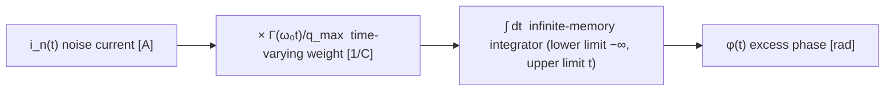

# From a Single Impulse to Arbitrary Noise: the Convolution Derivation

> **β**: This English translation is in beta — the Traditional-Chinese original is the authoritative version.

> **Prerequisites**: [isf_definition](/03_isf_core_theory/isf_definition) (the operational definition of $\Gamma$ and the single phase step), [impulse_to_phase_shift](/03_isf_core_theory/impulse_to_phase_shift) (the phase response to a single impulse), [oscillator_phase](/02_foundations/oscillator_phase) (excess phase has no restoring force and accumulates).

The previous page, [isf_definition](/03_isf_core_theory/isf_definition), gave the definition "**one** current impulse → **one** phase step". But the noise current $i_n(t)$ in a real circuit is injected **continuously and persistently** — it does not arrive as separate, isolated pulses. This page answers:

> **What is the total excess phase $\phi(t)$ produced by a continuous noise current $i_n(t)$?**

The answer is the single most central integral in ISF theory ([P1] Eq.(11), p.182):

$$
\phi(t)=\frac{1}{q_{max}}\int_{-\infty}^{t}\Gamma(\omega_0\tau)\,i_n(\tau)\,d\tau
$$

Our job is to derive it, step by step, from the previous page's "single step" using the **superposition principle** — and to see clearly that although it looks like a convolution, it is an **LTV (linear time-variant)** convolution, not the LTI convolution of a signals-and-systems textbook.

> **Physical intuition (conclusion first)**: slice the noise current into countless thin slivers, each a miniature impulse; each miniature impulse produces a miniature phase step weighted by the phase at that instant, $\Gamma(\omega_0\tau)$; because phase has **no restoring force**, every step, once it happens, **stays forever**; so the total phase $\phi(t)$ "now" = the **accumulation of all past steps**. Accumulating a continuum of infinitely many steps is an integral; "accumulate only the past" is why the upper limit is $t$. $\Gamma$ changes with the injection instant, so the weight is time-varying — that is LTV.

## Step 1: slice the noise into small impulses

Any continuous current can be approximated by a train of adjacent, very narrow rectangular pulses. The slice at time $\tau$ of width $d\tau$ deposits a charge

$$
dq(\tau)=i_n(\tau)\,d\tau .
$$

- **Physics used**: the definition of current, $i=dq/dt$, inverted: $dq=i\,d\tau$.
- **Unit check**: $[\text{A}]\cdot[\text{s}]=[\text{C}]$ ✓.
- **Why this is legitimate**: as long as each slice width $d\tau\ll T$ (one period), each slice can be treated as "a lump of charge injected instantaneously" — exactly the applicability condition of the impulse on the previous page.

## Step 2: each small charge produces a small phase step

Apply the previous page's operational definition to the slice of charge $dq(\tau)$ at time $\tau$:

$$
d\phi(\tau)=\frac{\Gamma(\omega_0\tau)}{q_{max}}\,dq(\tau)=\frac{\Gamma(\omega_0\tau)}{q_{max}}\,i_n(\tau)\,d\tau .
$$

- **Key point**: the weight $\Gamma(\omega_0\tau)$ is evaluated at the **phase of the injection instant**, $\omega_0\tau$ — not at the observation time $t$. The same charge injected at a zero crossing (large $\Gamma$) produces a large step; at the peak ($\Gamma\approx0$) it produces almost none.
- **Unit check**: $d\phi=\dfrac{[\text{dimensionless}]}{[\text{C}]}\cdot[\text{C}]=[\text{dimensionless}]=[\text{rad}]$ ✓.

## Step 3: each step persists permanently into the "future"

This is the soul of the whole derivation, and where an oscillator differs most from an ordinary RLC filter.

Once a phase step $d\phi$ occurs at time $\tau$, because **there is no restoring force along the phase direction** (claim C2, [P1] Sec. III-A; geometric reason in [isf_definition](/03_isf_core_theory/isf_definition), Step 2), it **does not decay** — it persists through every future $t>\tau$. Written as an impulse response, this brings a unit step $u(t-\tau)$ ([P1] Eq.(10), p.182):

$$
h_\phi(t,\tau)=\frac{\Gamma(\omega_0\tau)}{q_{max}}\,u(t-\tau).
$$

- $u(t-\tau)=1$ (for $t\ge\tau$), $=0$ (for $t<\tau$). Its physical meaning: "visible only in the future, and never fades" — the phase integrator has **infinite memory**.
- **Contrast**: if this were an amplitude perturbation, the impulse response would carry a **decaying** term (e.g. $e^{-(t-\tau)/\tau_A}u(t-\tau)$) — the perturbation gets pulled back. Phase gets a step, amplitude gets a decaying exponential — this is the mathematical face of "why phase noise accumulates and amplitude noise does not".

## Step 4: superpose all past steps → an integral

In a linear (small-signal) system, the total phase = the sum of all contributions.

**Step by step: discrete superposition → limit → integral (no skipped steps).** First slice the time axis into cells of width $\Delta\tau$, with injection instants $\tau_k=k\,\Delta\tau$ ($k=\dots,-2,-1,0,1,\dots$).

1. **Charge of the $k$-th slice** (step: treat the continuous current as a train of small impulses):

$$
\Delta q_k=i_n(\tau_k)\,\Delta\tau\quad[\text{A}\cdot\text{s}=\text{C}].
$$

2. **Phase step produced by the $k$-th slice** (step: apply Step 2's operational definition, with the weight taken at the **injection-instant** phase $\omega_0\tau_k$):

$$
\Delta\phi_k=\frac{\Gamma(\omega_0\tau_k)}{q_{max}}\,\Delta q_k=\frac{\Gamma(\omega_0\tau_k)}{q_{max}}\,i_n(\tau_k)\,\Delta\tau.
$$

3. **Each step persists permanently** (step: phase has no restoring force): at the observation time $t$, only steps with $\tau_k\le t$ have already happened and are still present; their contribution is multiplied by $u(t-\tau_k)$ (equal to 1 when $\tau_k\le t$, 0 otherwise).

4. **Add up all past steps** (discrete superposition):

$$
\phi(t)=\sum_{k:\ \tau_k\le t}\Delta\phi_k=\sum_{k=-\infty}^{\infty}\frac{\Gamma(\omega_0\tau_k)}{q_{max}}\,i_n(\tau_k)\,u(t-\tau_k)\,\Delta\tau.
$$

5. **Take the limit $\Delta\tau\to0$** (step: Riemann sum → Riemann integral): as the cells become infinitely fine, the discrete injection instants $\tau_k$ become a continuous variable $\tau$, $\Delta\tau\to d\tau$, and $\sum_k(\cdots)\Delta\tau\to\int(\cdots)\,d\tau$. This step is legitimate provided $\Gamma$ and $i_n$ are approximately constant within each cell (an integrable integrand), which for noise physically always holds:

$$
\phi(t)=\lim_{\Delta\tau\to0}\sum_{k}\frac{\Gamma(\omega_0\tau_k)}{q_{max}}\,i_n(\tau_k)\,u(t-\tau_k)\,\Delta\tau
=\int_{-\infty}^{\infty}\frac{\Gamma(\omega_0\tau)}{q_{max}}\,u(t-\tau)\,i_n(\tau)\,d\tau .
$$

Written in the superposition form with $h_\phi(t,\tau)$ ([P1] Eq.(11)):

$$
\phi(t)=\int_{-\infty}^{\infty}h_\phi(t,\tau)\,i_n(\tau)\,d\tau=\int_{-\infty}^{\infty}\frac{\Gamma(\omega_0\tau)}{q_{max}}\,u(t-\tau)\,i_n(\tau)\,d\tau .
$$

- **Why $u(t-\tau)$ appears naturally at the "adding" step**: it is not inserted by hand — it is the mathematical notation for two facts, "a step persists forever" + "only steps that have already happened can be added". The $\tau_k\le t$ condition of item 3 becomes $u(t-\tau)$ in the continuum limit. Right below, you see it cut the upper integration limit to $t$.

The role of $u(t-\tau)$ is to "cut" the upper integration limit at $t$: for $\tau>t$, $u(t-\tau)=0$ — future noise has not happened yet and cannot affect the present (**causality**). Hence

$$
\boxed{\ \phi(t)=\frac{1}{q_{max}}\int_{-\infty}^{t}\Gamma(\omega_0\tau)\,i_n(\tau)\,d\tau\ }\qquad\text{[P1] Eq.(11), p.182}
$$

- **Why the upper limit is $t$**: causality + infinite phase memory. The lower limit $-\infty$ says "all noise since power-up is still remembered" — precisely the root of long-term jitter's random walk, drifting further the longer it runs (see $\sigma_{\Delta t}=\kappa\sqrt{\Delta t}$ in [P2] Eq.(8)).
- **Unit check**: $\phi=\dfrac{1}{[\text{C}]}\cdot[\text{dimensionless}]\cdot[\text{A}]\cdot[\text{s}]=\dfrac{[\text{A}\cdot\text{s}]}{[\text{C}]}=\dfrac{[\text{C}]}{[\text{C}]}=[\text{dimensionless}]=[\text{rad}]$ ✓.
- **Degeneration check**: for $i_n(\tau)=\Delta q\,\delta(\tau-\tau_0)$ (a single impulse), the integral picks out $\tau_0$: $\phi(t)=\frac{\Gamma(\omega_0\tau_0)}{q_{max}}\Delta q$ (for $t>\tau_0$), recovering exactly the previous page's $\Delta\phi=\Gamma\,\Delta q/q_{max}$ ✓.

## Why this is LTV, not ordinary LTI convolution

The LTI convolution taught in signals-and-systems is $y(t)=\int h(t-\tau)x(\tau)\,d\tau$ — the kernel depends **only on the time difference $t-\tau$**. Here the kernel is

$$
h_\phi(t,\tau)=\frac{\Gamma(\omega_0\tau)}{q_{max}}\,u(t-\tau),
$$

which depends explicitly on the **absolute injection instant $\tau$** (through $\Gamma(\omega_0\tau)$) and cannot be written as just $h(t-\tau)$. Physically: **the same impulse, injected at different phases of the waveform, gives different responses** (claim C1, [P1] Sec. III).

- **LTI (time-invariant)**: delay the entire input by $\Delta$ and the output is merely delayed by $\Delta$, shape unchanged.
- **LTV (time-variant)**: delay the input by $\Delta$, and because $\Gamma(\omega_0\tau)$ takes different values at different phases, the output **changes shape**.

But be careful: it is **still linear** (linear in $i_n$, superposable) — it is just **not time-invariant**. Hence LTV (Linear Time-Variant). Slicing $i_n$, weighting each slice, and superposing works precisely because of this "linearity"; the weight varying with time is the "time variance". For the graphical comparison see [lti_vs_ltv](/02_foundations/lti_vs_ltv).

> **One-line mnemonic**: $\phi(t)$ is $i_n(t)$ first **multiplied pointwise by the periodic weight $\Gamma(\omega_0 t)/q_{max}$**, then **fed into an infinite-memory integrator**. Multiplication (time-varying weight) + integration (memory) = the LTV phase response.

## Block diagram

Draw Eq.(11) as two blocks: a time-varying multiplier and an integrator.



- Block B (multiplication) provides the "time variance": the weight varies periodically with the waveform phase $\omega_0 t$ — the origin of LTV.
- Block C (integration) provides the "memory": it accumulates all past weighted noise — the origin of phase **accumulation** and of long-term jitter's random walk.

## Python numerical verification

`integrate_phase_from_noise` is exactly block B (time-varying multiplication) followed by block C (cumulative integration) — an implementation of Eq.(11). Below we verify it with a **single-tone injection**: in theory, feeding in a single tone $i_n(t)=I_0\cos(\Delta\omega t)$ (very small offset, near DC), the excess phase should approach [P1] Eq.(15), p.183:

$$
\phi(t)\approx\frac{I_0\,c_0\sin(\Delta\omega t)}{2q_{max}\,\Delta\omega}.
$$

For the ideal LC ($\Gamma=-\sin$) the DC coefficient is $c_0=0$ and the response is suppressed; only with an asymmetric ISF carrying DC ($\Gamma=\cos\theta+\alpha$, giving $c_0=2\alpha$) does the slow phase drift of the form above — proportional to $\sin(\Delta\omega t)$ with amplitude $\propto1/\Delta\omega$ — appear. The code below runs both for comparison:

```python
import numpy as np
from simulations.common.isf_utils import (
    gamma_lc_ideal, gamma_asymmetric, integrate_phase_from_noise,
)

# --- setup ---
f0      = 1.0                      # normalized carrier
w0      = 2 * np.pi * f0
fs      = 8000.0                   # amply oversampled
t       = np.arange(0, 200.0, 1/fs)   # run many periods to see the slow phase drift
qmax    = 1.0
I0      = 1e-3
d_omega = 2 * np.pi * 0.01         # offset 0.01 Hz (near DC, far below w0)

i_n     = I0 * np.cos(d_omega * t)     # inject a single tone

# --- blocks B×C: run Eq.(11) once for each ISF ---
phi_lc  = integrate_phase_from_noise(t, i_n, gamma_lc_ideal(w0 * t), qmax)        # c0 = 0
alpha   = 0.4
phi_asy = integrate_phase_from_noise(t, i_n, gamma_asymmetric(w0 * t, alpha), qmax)  # c0 = 2*alpha

# --- theory Eq.(15): phi ~ I0 c0 sin(d_omega t)/(2 qmax d_omega) ---
c0_asy  = 2 * alpha
phi_theory = I0 * c0_asy * np.sin(d_omega * t) / (2 * qmax * d_omega)

print("LC (c0=0)   max|phi| =", np.max(np.abs(phi_lc)))      # tiny: DC is suppressed
print("asym sim    max|phi| =", np.max(np.abs(phi_asy)))
print("asym theory max|phi| =", np.max(np.abs(phi_theory)))  # same order as sim, same 1/d_omega trend
```

- **How to read it**: `phi_lc` barely drifts because $c_0=0$; `phi_asy` shows a slow phase drift $\propto\sin(\Delta\omega t)$ with amplitude $\propto1/\Delta\omega$, matching the analytic Eq.(15) in order of magnitude and in trend. This verifies "time-domain integration of Eq.(11) = the literature's frequency-domain result".
- **Why compare only magnitude/trend**: the toy ISF (`gamma_asymmetric`) is not transistor-level, and the numerical integration carries sampling and finite-length errors; the point is that the **scaling** ($\propto I_0 c_0/\Delta\omega$) matches, not point-by-point numbers.
- The full version, splitting this integral into "each ISF harmonic down-converting separately", is [P1] Eq.(13), p.183 — taught in [fourier_series_of_isf](/03_isf_core_theory/fourier_series_of_isf).

Implementation for reference (`simulations/common/isf_utils.py`, quoted verbatim from the real code):

```python
def integrate_phase_from_noise(t, i_noise, gamma_values, qmax):
    dt = np.mean(np.diff(t))
    return np.cumsum(gamma_values * i_noise / qmax) * dt
```

`np.cumsum(...)*dt` is the "infinite-memory integrator" (block C, accumulating all of the past); `gamma_values * i_noise / qmax` is the time-varying weighting (block B). Full library: `simulations/common/isf_utils.py`; noise utilities: `simulations/common/noise_utils.py`.

## Numerical feel (tying back to the single impulse)

Degenerating the continuous integral back to a single kick reproduces Example A of [impulse_to_phase_shift](/03_isf_core_theory/impulse_to_phase_shift): $q_{max}=1$ pC, $\Delta q=1$ fC, $\Gamma=0.5$, $f_0=5$ GHz → $\Delta\phi=5\times10^{-4}$ rad → $\Delta t=15.9$ fs. What continuous noise means: **every $d\tau$ kicks like this**, and the integrator remembers and accumulates all of it, so the rms phase grows with time (or with the lower limit of the integration bandwidth) — the starting point of the next stage, where the PSD of $i_n$ is connected to the phase noise $\mathcal{L}(\Delta f)$.

## Worked examples

Format per spec 10.4: problem → step-by-step substitution (with units) → result → dimension check → one-line Python verification. We deliberately pick constant scenarios that **can be hand-computed**, dissecting `integrate_phase_from_noise` (the implementation of Eq.(11)) for verification.

### Example 1: constant ISF × constant noise current — numerical integration vs hand calculation

> **Problem**: take a **constant** ISF $\Gamma=0.5$, a **constant** noise current $i_n=I_0=2\ \mu\text{A}$, and $q_{max}=1$ pC, injected over the window $[0,\,1\ \text{ns}]$. Use Eq.(11) to find the final phase $\phi(T)$ and compare with the hand calculation.

**Step-by-step substitution (by hand)**: the integrand is constant, so the integral degenerates into a multiplication.

$$
\phi(T)=\frac{1}{q_{max}}\int_0^{T}\Gamma\,i_n\,d\tau=\frac{\Gamma\,I_0\,T}{q_{max}}=\frac{0.5\times(2\times10^{-6}\,\text{A})\times(1\times10^{-9}\,\text{s})}{1\times10^{-12}\,\text{C}}.
$$

Numerator first: $0.5\times2\times10^{-6}\times10^{-9}=1\times10^{-15}\ \text{A}\cdot\text{s}=1\times10^{-15}\ \text{C}$. Then divide by $q_{max}$:

$$
\phi(T)=\frac{1\times10^{-15}\ \text{C}}{1\times10^{-12}\ \text{C}}=1\times10^{-3}\ \text{rad}=1\ \text{mrad}.
$$

**Cross-check from the "charge viewpoint"** (degenerate back to a single impulse): the total injected charge is $\Delta q=I_0 T=2\times10^{-6}\times10^{-9}=2\times10^{-15}$ C $=2$ fC; applying $\Delta\phi=\Gamma\,\Delta q/q_{max}=0.5\times2\times10^{-15}/10^{-12}=1\times10^{-3}$ rad ✓ (consistent with the integral — with constant $\Gamma$, the continuous integral equals injecting the total charge all at once).

**Result**: $\phi(T)=1$ mrad; the numerical integration `integrate_phase_from_noise` gives $1.00001\times10^{-3}$ rad, matching the hand calculation (the difference comes from the endpoint effect of the discrete `np.cumsum` accumulation, $\sim10^{-5}$ relative error).

**Dimension check**: $\dfrac{1}{[\text{C}]}\cdot[\text{dimensionless}]\cdot[\text{A}]\cdot[\text{s}]=\dfrac{[\text{A}\cdot\text{s}]}{[\text{C}]}=\dfrac{[\text{C}]}{[\text{C}]}=$ dimensionless (rad) ✓.

```python
import numpy as np
from simulations.common.isf_utils import integrate_phase_from_noise

qmax, I0, gamma = 1e-12, 2e-6, 0.5
t  = np.linspace(0, 1e-9, 100001)          # 0 -> 1 ns
i  = np.full_like(t, I0)                    # constant noise current
gv = np.full_like(t, gamma)                 # constant ISF
phi = integrate_phase_from_noise(t, i, gv, qmax)
print(phi[-1], "rad")                       # -> 0.00100001 rad  (hand calc = 1e-3 rad)
```

### Example 2: time-varying ISF ($\Gamma=-\sin$) × constant noise — net phase over a half period

> **Problem**: now use the real, time-varying ISF $\Gamma(\omega_0\tau)=-\sin(\omega_0\tau)$, constant $i_n=I_0=2\ \mu\text{A}$, $q_{max}=1$ pC, $f_0=1$ (normalized, so $\omega_0=2\pi$), integrated over an **integer number of periods**. Find $\phi$.

**Step-by-step substitution (by hand)**:

$$
\phi=\frac{I_0}{q_{max}}\int_0^{NT}(-\sin\omega_0\tau)\,d\tau=\frac{I_0}{q_{max}}\cdot\frac{\cos\omega_0\tau}{\omega_0}\Big|_0^{NT}.
$$

Over an **integer number of periods** $NT$, $\cos\omega_0(NT)=\cos(2\pi N)=1=\cos0$, so the integral **= 0**:

$$
\phi(NT)=\frac{I_0}{q_{max}}\cdot\frac{1-1}{\omega_0}=0\ \text{rad}.
$$

**Result**: under $\Gamma=-\sin$ (zero DC, $c_0=0$), constant (DC) noise produces zero net phase shift per full period — the positive and negative half cycles cancel. This is the time-domain face of "a symmetric ISF suppresses DC/near-DC injection" (echoing the single-tone example above: the LC has $c_0=0$, so the Eq.(15) response is suppressed). **If you stop at a half period** ($\tau=T/2$), $\cos\pi-\cos0=-2$ leaves a nonzero transient phase offset (the Python below prints $\phi(T/2)\approx-636619.7$ rad). (Note: here $I_0=2\ \mu\text{A}$, $q_{max}=1$ pC, and the half period $t=0.5$ s are all **normalized numbers**; $I_0/q_{max}=2\times10^6$, further divided by $\omega_0=2\pi$, so the "rad count" of $\phi$ is enormous. This is purely a bookkeeping artifact of normalized units, not a physical phase of $10^5$ rad — in fact, the small-signal/linear premises (Step 1's $d\tau\ll T$; a single impulse charging only about 10% of the total charge, [P1] p.182) are badly violated long before that. The point is the sign structure — **full periods cancel, half periods do not** — not the magnitude of that rad number.)

**Dimension check**: as in Example 1, the final $\phi$ is dimensionless (rad) ✓.

```python
import numpy as np
from simulations.common.isf_utils import gamma_lc_ideal, integrate_phase_from_noise

f0, w0, qmax, I0 = 1.0, 2*np.pi, 1e-12, 2e-6
t  = np.arange(0, 10.0, 1/8000.0)           # 10 full periods
i  = np.full_like(t, I0)
gv = gamma_lc_ideal(w0 * t)                  # Γ = -sin(w0 t)
phi = integrate_phase_from_noise(t, i, gv, qmax)
assert abs(phi[-1]) < 1e-6                    # net phase cancels over full periods (residual ~6e-10, purely cumsum discretization)
print(round(abs(phi[-1]), 6))                # -> 0.0  (net phase cancels over full periods)
print(round(phi[len(t)//20], 1))             # -> -636619.7  (near the half period: nonzero transient)
```

Full library: `simulations/common/isf_utils.py`.

## Validity and failure conditions

| Condition | When it holds | What happens when it fails |
|---|---|---|
| Small-signal / linear | superposition holds; slice and superpose | large noise → nonlinearity; $\Gamma$ itself is altered, no simple superposition |
| $\Gamma$ known and frequency-independent | plug directly into Eq.(11) | a frequency-dependent $\Gamma$ needs a more complete model |
| Infinite phase memory (no phase restoring) | upper limit $t$; permanent accumulation | with phase pulling (e.g. injection locking) a restoring term must be added — see the generalized Adler equation in [P3] |
| Amplitude perturbations negligible | the phase-only model suffices | strong AM–PM requires including the APF ([P4]) |

## Key takeaways

- Slice the noise → each slice carries charge $i_n d\tau$ → each slice gives a step $\Gamma(\omega_0\tau)i_n d\tau/q_{max}$ → each step persists forever into the future → superpose all of the past → upper integration limit $t$.
- Result: $\phi(t)=\dfrac{1}{q_{max}}\displaystyle\int_{-\infty}^{t}\Gamma(\omega_0\tau)\,i_n(\tau)\,d\tau$ ([P1] Eq.(11), p.182).
- This is **LTV**: the kernel depends on the absolute injection instant $\tau$ (through $\Gamma(\omega_0\tau)$), not just on $t-\tau$; still linear, but time-varying.
- Structure = **time-varying multiplier ($\times\Gamma(\omega_0 t)/q_{max}$) + infinite-memory integrator ($\int dt$)**.
- `integrate_phase_from_noise` implements this integral as `np.cumsum(gamma*i/qmax)*dt`; the single-tone injection verification matches the $1/\Delta\omega$ trend of Eq.(15).

## Further reading

- The operational definition for a single impulse: [impulse_to_phase_shift](/03_isf_core_theory/impulse_to_phase_shift)
- What $\Gamma$ is, and why LTV: [isf_definition](/03_isf_core_theory/isf_definition)
- LTI vs LTV, illustrated: [lti_vs_ltv](/02_foundations/lti_vs_ltv)
- Splitting the integral into ISF harmonics (frequency translation): [fourier_series_of_isf](/03_isf_core_theory/fourier_series_of_isf)
- White noise → 1/f² phase noise: [white_noise_to_phase_noise](/03_isf_core_theory/white_noise_to_phase_noise)
- Quick numerical-feel reference: [numerical_feeling](/04_simulation_labs/numerical_feeling)
