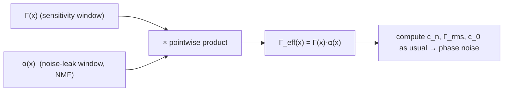

import EffectiveIsfExplorer from "@site/src/components/EffectiveIsfExplorer";

> **β**: This English translation is in beta — the Traditional-Chinese original is the authoritative version.

# Effective ISF and cyclostationary noise

> **Prerequisites**: [isf_definition](/03_isf_core_theory/isf_definition) (definition of $\Gamma$), [rms_isf](/03_isf_core_theory/rms_isf) ($\Gamma_{rms}$ and $\sum c_n^2$), [stochastic_noise_basics](/02_foundations/stochastic_noise_basics) (stationary vs cyclostationary noise).

So far we have assumed the noise sources are **stationary** — their statistics (e.g., mean-square power)
do not change with time. Resistor thermal noise is like that. But the dominant noise sources in an
oscillator are the **transistors**, and transistor noise power **varies periodically with the operating
point**: strong when the device conducts a large current, weak when it is off. Noise whose statistics
vary periodically with time is called **cyclostationary noise**.

This page answers: how does ISF theory handle cyclostationary device noise? The answer is elegant and
simple — fold the periodic "noise-intensity modulation" into the ISF, obtaining the **effective ISF**:

$$
\Gamma_{eff}(x)=\Gamma(x)\,\alpha(x)
$$

From then on, **every formula stays the same with $\Gamma_{eff}$ substituted for $\Gamma$** (the
cyclostationary decomposition and the effective ISF come from
[P1] Sec. II-D "Cyclostationary Noise Sources", Eq.(25)–(27), p.186; $\Gamma_{eff}=\Gamma\cdot\alpha$ is Eq.(27)).

**Try it yourself**: the interactive explorer below keeps $\Gamma(x)=-\sin x$ fixed and lets you drag
the NMF $\alpha(x)$ window's **center phase** $\theta_c$, **width**, and **floor**, watching $\Gamma$,
$\alpha$, and $\Gamma_{eff}=\Gamma\cdot\alpha$ overlaid live, along with $\Gamma_{eff,rms}$,
$c_0^{eff}$, and the phase-noise change relative to the stationary case.

<EffectiveIsfExplorer />

> **Physical intuition (conclusion first)**: two "time windows" open and close simultaneously in an oscillator:
> (1) the **ISF $\Gamma(x)$** — how sensitive the oscillator is to noise right now (where the waveform is easy to kick);
> (2) the **NMF $\alpha(x)$** — how much noise the device leaks right now (when the transistor is working).
> What actually enters the phase is the **overlap of the two windows**. If the device dumps most of its noise
> only at instants where the ISF is insensitive (like a good Colpitts: the current pulse lands at the voltage
> trough, where the ISF is small), most of the noise is simply wasted — this is why including $\alpha$
> **matters**; using the average noise power alone can badly over- or under-estimate.

## Step 1: decomposing cyclostationary noise

[P1] Sec. II-D "Cyclostationary Noise Sources" (p.186) decomposes a white cyclostationary current $i_n(t)$ as
([P1] Sec. II-D, Eq.(25), p.186):

$$
i_n(t)=i_{n0}(t)\,\alpha(\omega_0 t)
$$

where:

- $i_{n0}(t)$ is a **white stationary** random process — fixed intensity, easy to handle.
- $\alpha(\omega_0 t)$ is a **deterministic periodic function** describing the modulation of the noise
  amplitude, called the **noise-modulating function (NMF)**.

[P1] **normalizes $\alpha$ to a maximum of 1** ($0\le\alpha\le1$, period $2\pi$). Under this definition,
the instantaneous mean-square noise power $=\alpha^2(\omega_0 t)\cdot\overline{i_{n0}^2}$, where $\overline{i_{n0}^2}$ is the **maximum** mean-square power.

- **Physics used**: MOS channel noise $\propto g_m$ or $\propto$ overdrive voltage, and these quantities vary
  periodically with the waveform, so the noise power is "gated" — the device only really leaks noise at
  certain phases ([P1] uses MOS channel noise as its example).
- **Unit check**: $\alpha$ is dimensionless ($0$ to $1$); $i_{n0}$ and $i_n$ are both currents (A) ✓.

## Deriving the NMF $\alpha(t)$ from device thermal noise

The previous step took $\alpha(\omega_0 t)$ as a periodic modulation that fell from the sky. But for an
analog designer with 40 years of experience, the real question is: **where does $\alpha(t)$ come from, and
why does it have that shape?** The answer is written entirely in the device's **bias-dependent thermal
noise**. This section derives $\alpha(t)$ **by hand** from the transistor's instantaneous bias, and works
a switching-pair example to show how it changes the $1/f^3$.

> **Physical intuition (conclusion first)**: transistor thermal noise is **not of fixed intensity** — its
> mean-square noise current is proportional to some bias-dependent quantity ($g_m$ or $I_D$ for a MOS, the
> collector current for a BJT). In an oscillator these quantities **swing periodically with the large-signal
> waveform**: noise is strongest when the device is fully on and nearly vanishes when it is off. Take the
> instantaneous noise power relative to its maximum, take the square root, normalize the peak to 1 — that is
> the NMF $\alpha(t)$. So **$\alpha(t)$ is not an extra assumption; it is simply the instantaneous envelope
> of the device thermal noise**.

### Step A: transistor thermal noise is bias-dependent

Start from the standard device thermal-noise expression (treated as white over the offset band of interest).
For MOSFET channel thermal noise (standard external device model, not among the five source PDFs):

$$
\frac{\overline{i_{n,d}^2}}{\Delta f}=4kT\,\gamma\,g_m \qquad[\text{A}^2/\text{Hz}],
$$

where $\gamma$ is the noise coefficient ($\approx2/3$ long-channel, larger short-channel) and $g_m$ is the
instantaneous transconductance (units S = A/V). The key point is that $g_m$ **itself varies with the
instantaneous bias** — in an oscillator the device's gate-source voltage $v_{GS}(t)$ swings with the
waveform, so

$$
g_m=g_m\big(v_{GS}(t)\big)\quad\Longrightarrow\quad \frac{\overline{i_{n,d}^2(t)}}{\Delta f}=4kT\gamma\,g_m\big(v_{GS}(t)\big)
$$

**is itself a periodic function of time**. For a square-law MOS in saturation, $g_m=\sqrt{2\mu C_{ox}(W/L)\,I_D(t)}\propto\sqrt{I_D(t)}$;
when the device is off ($v_{GS}<V_T$), $I_D\to0$, $g_m\to0$, and the noise switches off.

- **Physics used**: thermal-noise intensity is set by the **channel conductance** (proportional to $g_m$ or
  $I_D$); the oscillator's large-signal waveform switches this conductance periodically. Same story for a
  BJT: collector shot noise $\overline{i_c^2}/\Delta f=2qI_C(t)$, with $I_C(t)$ pulsing along the waveform.
- **Unit check**: $4kT$ is $\text{J}=\text{V}\cdot\text{A}\cdot\text{s}$; multiplying by $g_m$ (A/V) gives $\text{A}^2\cdot\text{s}=\text{A}^2/\text{Hz}$ ✓.

### Step B: normalize → obtain $\alpha(t)$

Write the instantaneous mean-square noise power as "maximum × a $[0,1]$ shape". Define the maximum
mean-square power
$\overline{i_{n0}^2}/\Delta f\equiv\max_t\big[4kT\gamma\,g_m(v_{GS}(t))\big]$ (the peak over one period); then

$$
\frac{\overline{i_{n,d}^2(t)}}{\Delta f}=\frac{\overline{i_{n0}^2}}{\Delta f}\cdot\underbrace{\frac{g_m\big(v_{GS}(t)\big)}{\max_t g_m}}_{\equiv\,\alpha^2(\omega_0 t)} .
$$

Comparing term by term with [P1]'s decomposition $\overline{i_n^2(t)}=\alpha^2(\omega_0 t)\,\overline{i_{n0}^2}$ (Step 1 above), read off immediately

$$
\boxed{\ \alpha(\omega_0 t)=\sqrt{\frac{g_m\big(v_{GS}(t)\big)}{\max_t g_m\big(v_{GS}(t)\big)}}\ }\qquad(0\le\alpha\le1).
$$

- **This is the microscopic origin of the NMF**: $\alpha(t)$ is the square root of the instantaneous
  transconductance relative to its peak (the square root because $\alpha$ is defined on the **amplitude**
  side; noise power is $\alpha^2$). $\alpha=1$ at phases where the device conducts fully, $\alpha=0$ where it
  is off. **For circuits that conduct only over a small slice of phase (switching pair, class-C, the Colpitts
  current pulse), $\alpha$ is a narrow periodic gate.**
- **Unit check**: a ratio is dimensionless, and so is its square root → $\alpha$ is dimensionless, $0\le\alpha\le1$ ✓, consistent with the convention.
- **Interface to the ISF**: substituting back into the previous step gives $\Gamma_{eff}=\Gamma\cdot\alpha$.
  **The shape of $\alpha$ is set entirely by the device's $g_m(v_{GS}(t))$ — i.e., by circuit topology +
  bias + large-signal waveform** — it is not a free parameter.

> **Design takeaway (deeper)**: since $\alpha\propto\sqrt{g_m}$ and $g_m$ switches with whether the device
> conducts, **which slice of phase the device conducts in** is a knob in the designer's hand. Push the
> conduction window (the $\alpha$ peak) onto a zero of the ISF ($\Gamma\approx0$) and
> $\Gamma_{eff}=\Gamma\alpha$ collapses — this is exactly the physics behind the low phase noise of
> Colpitts/class-C. The switching-pair example below turns this into numbers.

## Step 2: absorb $\alpha$ into the ISF to get $\Gamma_{eff}$

Substitute the decomposition $i_n=i_{n0}\,\alpha(\omega_0\tau)$ into the LTV phase response [P1] Eq.(11), p.182:

$$
\phi(t)=\frac{1}{q_{max}}\int_{-\infty}^{t}\Gamma(\omega_0\tau)\,i_n(\tau)\,d\tau
=\frac{1}{q_{max}}\int_{-\infty}^{t}\underbrace{\Gamma(\omega_0\tau)\,\alpha(\omega_0\tau)}_{\equiv\,\Gamma_{eff}(\omega_0\tau)}\,i_{n0}(\tau)\,d\tau.
$$

The product of the two periodic functions in the middle is defined as the **effective ISF** (substituted
back into (11) this is [P1] Sec. II-D, Eq.(26), p.186;
$\Gamma_{eff}=\Gamma\cdot\alpha$ itself is [P1] Eq.(27), p.186):

$$
\boxed{\ \Gamma_{eff}(x)=\Gamma(x)\,\alpha(x)\ }
$$

So the form of the equation is **entirely unchanged**: the remaining $i_{n0}$ is stationary white noise
acting on a system whose ISF is $\Gamma_{eff}$. [P1] says it plainly:

> "the cyclostationary noise can be treated as a stationary noise applied to a system with an
> effective ISF".

- **Math used**: move the deterministic periodic factor $\alpha$ from the "random-process side" to the
  "system-weight side" — since $\alpha$ is deterministic, this move is fully legal and changes no statistics.
- **Unit check**: $\Gamma$ dimensionless, $\alpha$ dimensionless $\Rightarrow$ $\Gamma_{eff}$ dimensionless and still $2\pi$-periodic ✓.
- **Practical rule (claim C9)**: **use $\Gamma_{eff}$ in every subsequent calculation** — especially the
  Fourier coefficients $c_n$, $\Gamma_{rms}$, and $c_0$. That is, in
  [white_noise_to_phase_noise](/03_isf_core_theory/white_noise_to_phase_noise)
  and [flicker_noise_upconversion](/03_isf_core_theory/flicker_noise_upconversion), Eq.(21), (23), (24)
  all take $\Gamma\to\Gamma_{eff}$, $c_0\to c_0^{eff}$, $\Gamma_{rms}\to\Gamma_{rms}^{eff}$.

## Step 3: why this matters for design — Colpitts vs ring

$\Gamma_{eff}=\Gamma\cdot\alpha$ is a pointwise product of two periodic functions, so **phase alignment**
decides everything. [P1] (p.187, Fig. 14–15) illustrates with two classic examples, and the difference is dramatic:

- **Colpitts LC oscillator**: the transistor's collector current is a short, tall current pulse followed by a
  long quiet stretch. That current spike **lands exactly at the minimum of the tank voltage** — where the
  **ISF $\Gamma$ is small** (the trough is insensitive). So $\Gamma_{eff}=\Gamma\cdot\alpha$ is **much
  smaller** than $\Gamma$ alone: the device leaks noise only at the least sensitive instants, and most of the
  noise is wasted. [P1] verbatim: "$\Gamma_{eff}$ is quite different from $\Gamma$, and hence the effect of
  cyclostationarity is **very significant** for the LC oscillator and cannot be neglected."
  — this is one key reason Colpitts phase noise is good.
- **Ring oscillator**: device current is largest **during the transition** — exactly where the **ISF is
  largest** (most sensitive). The $\alpha$ peak **overlaps** the $\Gamma$ peak, so
  $\Gamma_{eff}\approx\Gamma$ and cyclostationarity **does not help**.
  [P1]: the ring's $\Gamma_{eff}$ is nearly identical to $\Gamma$ — this "unfortunate coincidence" is one
  reason ring phase noise is usually **worse** (another is that a ring burns all its stored energy every period).



- **Design takeaway**: low phase noise takes more than small $\Gamma_{rms}$ and large $q_{max}$ — you also
  want the device to **leak noise only at ISF-insensitive phases** (keep the $\alpha$ peak **misaligned**
  from the $\Gamma$ peak). Colpitts does this by construction; it is a topology-level advantage.

## Step 4: $\Gamma_{eff}$ also affects flicker — remember to use $c_0^{eff}$

Continuing from the previous page: flicker upconversion depends only on the DC term $c_0$ of the ISF. But
the quantity to look at is really the **DC value of $\Gamma_{eff}$**,
i.e., $c_0^{eff}/2=\langle\Gamma\,\alpha\rangle$ (average over one period). [P1] states it explicitly in the
design section (p.187–188, near Eq.(30)): the $1/f^3$ corner is set by the **DC value of the (effective) ISF**.

- **Consequence**: even if the main signal path's $\Gamma$ is very symmetric ($c_0\approx0$), if some
  source's $\alpha$ is asymmetric, the average of $\Gamma_{eff}=\Gamma\alpha$ can still be nonzero
  $\Rightarrow$ the flicker gate reopens.
- **The tail source's notoriety** (echoing the flicker page): the ISF/NMF combination of the tail current
  source often gives $\Gamma_{eff}$ a **large DC value**, strongly upconverting the tail's flicker.
  Symmetrizing the main path cannot save it — check every source from the $\Gamma_{eff}$ (including $\alpha$) point of view.

## Numerical example (toy, for intuition)

> **Toy setup (not transistor-level)**: ideal LC with $\Gamma(x)=-\sin x$. This toy deliberately places the
> conduction window at the **peak of $|\Gamma|$** (the most sensitive phase) to show how much cyclostationary
> gating still saves under "bad alignment" —
> approximate the NMF by a normalized Gaussian pulse: $\alpha(x)$ is a narrow peak of height 1 near
> $x=3\pi/2$ (where $\Gamma=-\sin(3\pi/2)=+1$,
> i.e., $|\Gamma|=1$, the most sensitive point). (For the well-aligned Colpitts case — window at the trough
> where $\Gamma\approx0$ — see Worked example 2(b) below.)

Compare the $\Gamma_{rms}^{eff}$ of $\Gamma_{eff}=\Gamma\cdot\alpha$ with the original $\Gamma_{rms}$:

- Original $\Gamma(x)=-\sin x$: $\Gamma_{rms}^2=\frac{1}{2\pi}\int_0^{2\pi}\sin^2x\,dx=\tfrac12
  \Rightarrow\Gamma_{rms}=0.707$.
- With the narrow $\alpha$ (duty about $10\%$, peak at the **most sensitive** phase $|\Gamma|\approx1$): $\Gamma_{eff}$ is nonzero only in that narrow window;
  its energy $\Gamma_{rms}^{eff}{}^2=\frac{1}{2\pi}\int \Gamma^2\alpha^2\,dx$ is roughly the duty times the original $\to$
  $\Gamma_{rms}^{eff}\approx0.707\times\sqrt{0.1}\approx0.22$.

Substituting into [P1] Eq.(21) (with $\Gamma_{rms}^{eff}$ replacing $\Gamma_{rms}$), everything else as in Example B
($f_0=5$ GHz, $\Delta f=1$ MHz, $q_{max}=1$ pC, $S_i=10^{-24}$):

$$
\mathcal{L}=10\log_{10}\!\left(\frac{(0.22)^2}{(10^{-12})^2}\cdot\frac{10^{-24}}{4(2\pi\times10^6)^2}\right)
=10\log_{10}\!\left(\frac{0.0484}{10^{-24}}\cdot6.332\times10^{-39}\right).
$$

$$
=10\log_{10}(3.065\times10^{-16})=-155.1\ \text{dBc/Hz}.
$$

- **Intuition**: this 0.22 was gated down from the **ungated $-\sin$ LC** ($\Gamma_{rms}=0.707$, $\mathcal{L}\approx-145.0$ dBc/Hz),
  so compare against **the same origin**: accounting for cyclostationary gating improves things by about **10 dB**
  ($\Gamma_{rms}^{eff}$ drops from 0.707 to 0.22, $20\log_{10}(0.707/0.22)\approx10.1$ dB). Even with the
  **window at the most sensitive phase** (bad alignment), merely leaking noise over a small slice of phase
  saves about 10 dB — **ignoring $\alpha$ badly overestimates the noise**.
  (Another comparison: relative to the convention's Example B $\Gamma_{rms}=0.5$ / $-148.0$ dBc/Hz it is about $20\log_{10}(0.5/0.22)\approx7.1$ dB;
  but 0.22 was not gated down from 0.5, so 0.707 is the self-consistent baseline.)
- **Required caveat**: the duty and phase of $\alpha$ here are **illustrative toy numbers**, not values
  extracted from a real Colpitts; the real $\alpha$ must come from device operating points/simulation.
  **TODO: extract $\alpha(x)$ and $\Gamma_{eff}$ from an actual Colpitts simulation to replace this toy estimate.**

## Supplement: PPV / adjoint method / Floquet theory (external-literature background)

In [P1] the ISF is introduced via physical intuition plus impulse simulations. Behind it there is in fact a
**rigorous mathematical foundation**, but **that foundation is not among the five PDFs we downloaded** — it
comes from the broader nonlinear-oscillator/perturbation-theory literature
(claim C13). So you can see the whole map, here is the intuition; formal citations have been added (see the honesty note below, [E2]/[E3]):

- **Floquet theory**: the mathematical framework for the solution structure of **linear differential
  equations with periodic coefficients**. An oscillator linearized around its limit cycle is exactly such a
  system. Floquet gives a set of periodically time-varying
  eigenvectors (Floquet eigenvectors) and exponents describing the growth/decay of perturbations along each direction.
- **PPV (Perturbation Projection Vector)**: within the Floquet framework, the **first principal vector**
  $v_1(t)$ corresponding to the **zero Floquet exponent** (the neutral direction — the phase direction,
  because phase has no restoring force).
  Projecting any perturbation onto $v_1(t)$ yields the phase shift. **The PPV is essentially the rigorous
  version of the ISF** —
  $\Gamma(\omega_0\tau)/q_{max}$ corresponds to the component of $v_1(t)$ at the injection node. Demir et al.
  (2000) use the PPV to write the phase dynamics as the first-order equation
  $\dot{\phi}(t)=v_1^T(t)\,B(t)\,\xi(t)$ (see the reference form collected in equation_index).
- **Adjoint method**: the standard practical method for **extracting the ISF/PPV from simulation**. It solves
  the periodic solution of the **adjoint (transposed) problem** of the system's monodromy matrix, obtaining
  the entire $v_1(t)$ (i.e., the entire ISF) in one shot —
  far more efficient than injecting impulses one phase at a time (the brute-force method of this site's
  lab_04). The PSS + Pnoise flow of commercial RF simulators uses this class of method internally.

> **Honesty note**: PPV / adjoint / Floquet belong to **Demir–Mehrotra–Roychowdhury (2000)**, Kärtner, and
> other external literature — **not among the five PDFs downloaded for this site**; they are given here only
> as standard literature background for intuition.
> **Formal citation added**: Demir et al. 2000 (IEEE TCAS-I 47(5):655–674, DOI 10.1109/81.847872), see
> [references](/99_appendix/references) [E2] (external literature).
> **Scope note**: the rigorous PPV definition and the $\dot\phi=v_1^T B\xi$ form are the core result of **[E2] Demir 2000** (the entire paper is on this topic, TCAS-I 47(5):655–674, DOI 10.1109/81.847872); the correspondence between $v_1(t)$ and $\Gamma/q_{max}$ ("ISF = the PPV scalarized along the charge-injection direction") is in [E2] and Kärtner [E3]. This site only cites, and does not re-derive (external-literature scope).

## Worked examples

Format per convention Sec. 10.4: problem → step-by-step substitution (with units) → result → dimension check → one-line Python verification.
**All $\alpha$ duty cycles and phases are illustrative toy numbers (not transistor-level extractions).**

### Worked example 1: $\Gamma_{eff,rms}$ of a square-wave gating NMF (duty $\alpha$)

> **Toy problem**: ideal LC with $\Gamma(x)=-\sin x$. The device conducts only in a narrow window of duty $\alpha=0.1$ ($10\%$ of the period) centered on the zero crossing ($x=\pi/2$, where $|\Gamma|=1$, the most sensitive point), and leaks no noise the rest of the time. Use a square-wave NMF $\alpha(x)\in\{0,1\}$ (peak already normalized to 1). Find $\Gamma_{eff,rms}$.

**Step-by-step substitution**: under square-wave gating, $\Gamma_{eff}=\Gamma\cdot\alpha$ equals $\Gamma$ inside the narrow window and 0 elsewhere. Since the window is narrow and centered where $|\Gamma|\approx1$, $\Gamma^2\approx1$ inside the window, so

$$
\Gamma_{eff,rms}^2=\frac{1}{2\pi}\int_0^{2\pi}\Gamma^2\alpha^2\,dx
\approx\underbrace{(1)}_{\text{in-window}\,\Gamma^2}\times\underbrace{0.1}_{\text{duty}}=0.1
\ \Rightarrow\ \Gamma_{eff,rms}\approx\sqrt{0.1}\approx0.316.
$$

A bit more precisely: with the window centered at $\pi/2$ with half-width $0.1\pi$, the average of $\sin^2 x$ inside the window is slightly below 1 (about $0.97$), so $\Gamma_{eff,rms}\approx\sqrt{0.97\times0.1}\approx0.311$.

**Result**: $\Gamma_{eff,rms}\approx0.31$, much smaller than the ungated LC's $\Gamma_{rms}=0.707$. (Note: here the device sits at the **most sensitive** phase — "bad" alignment; a Colpitts-like window at the trough $\Gamma\approx0$ gives an even smaller $\Gamma_{eff,rms}$ — see Worked example 2.)

**Dimension check**: $\Gamma$, $\alpha$, $\Gamma_{eff}$ are all dimensionless → $\Gamma_{eff,rms}$ is dimensionless ✓.

```python
import numpy as np
from simulations.common.isf_utils import gamma_lc_ideal, effective_isf, gamma_rms

x = np.linspace(0.0, 2*np.pi, 200001, endpoint=True)
gamma = gamma_lc_ideal(x)                       # -sin x
center, half = np.pi/2, 0.1*np.pi               # window center, half-width (duty=0.1)
alpha = ((np.abs(((x-center+np.pi)%(2*np.pi))-np.pi)) <= half).astype(float)
g_eff = effective_isf(gamma, alpha)             # Γ_eff = Γ·α
print(gamma_rms(x, g_eff))                       # -> ~0.31
```

### Worked example 2: phase alignment decides everything (Colpitts vs ring toy) + relative PN change

> **Toy problem**: same square-wave gating with duty $\alpha=0.1$, but compare two alignments:
> (a) **ring-like**: window centered at $x=\pi/2$ ($|\Gamma|$ maximal); (b) **Colpitts-like**: window centered at $x=0$ (waveform peak, $\Gamma\approx0$).
> Find each $\Gamma_{eff,rms}$, and via [P1] Eq.(21) the phase-noise change (dB) relative to the ungated stationary case ($\Gamma_{rms}=0.707$).

**Step-by-step substitution**: the relative PN change depends only on the $\Gamma_{rms}$ ratio, since $\mathcal{L}\propto\Gamma_{rms}^2/q_{max}^2$ with all other parameters identical:

$$
\Delta\mathcal{L}=10\log_{10}\!\left(\frac{\Gamma_{eff,rms}^2}{\Gamma_{rms}^2}\right)=20\log_{10}\!\left(\frac{\Gamma_{eff,rms}}{\Gamma_{rms}}\right).
$$

- **(a) ring-like** (window at $|\Gamma|\approx1$): $\Gamma_{eff,rms}\approx0.31$ (Worked example 1).

$$
\Delta\mathcal{L}_{(a)}=20\log_{10}\!\left(\frac{0.31}{0.707}\right)=20\log_{10}(0.438)\approx-7.2\ \text{dB}.
$$

- **(b) Colpitts-like** (window at $\Gamma\approx0$): $\sin^2 x$ is tiny inside the window; its average within the half-width $0.1\pi$ is $\approx0.032$, so $\Gamma_{eff,rms}\approx\sqrt{0.032\times0.1}=\sqrt{3.2\times10^{-3}}\approx0.057\ll0.31$.

$$
\Delta\mathcal{L}_{(b)}=20\log_{10}\!\left(\frac{0.057}{0.707}\right)=20\log_{10}(0.081)\approx-22\ \text{dB}.
$$

**Result**: **same duty, same amount of noise, yet phase alignment alone changes the PN by about 15 dB** ((b)'s $-22$ dB vs (a)'s $-7$ dB). Colpitts-like (noise leaked at the insensitive peak) is far better than ring-like — this is the quantitative evidence that cyclostationarity "cannot be neglected". (Echoing the main text: the ungated $\Gamma_{rms}=0.707$ gives $\mathcal{L}\approx-145$ dBc/Hz; Colpitts-like improves a further $\sim22$ dB. **Illustrative toy numbers.**)

**Dimension check**: the ratio is dimensionless → $20\log_{10}(\cdot)$ gives dB ✓.

```python
import numpy as np
from simulations.common.isf_utils import gamma_lc_ideal, effective_isf, gamma_rms

x = np.linspace(0.0, 2*np.pi, 200001, endpoint=True)
gamma = gamma_lc_ideal(x)
half = 0.1*np.pi
def gated_rms(center):
    a = ((np.abs(((x-center+np.pi)%(2*np.pi))-np.pi)) <= half).astype(float)
    return gamma_rms(x, effective_isf(gamma, a))
g_ring     = gated_rms(np.pi/2)   # bad alignment
g_colpitts = gated_rms(0.0)       # good alignment
g_stat     = 0.7071               # ungated LC
for name, g in [("ring-like", g_ring), ("Colpitts-like", g_colpitts)]:
    print(name, round(g,3), "rms ;", round(20*np.log10(g/g_stat),1), "dB vs stationary")
# -> ring-like 0.311, -7.1 dB ; Colpitts-like 0.057, -21.9 dB
```

### Worked example 3: the switching pair's 2-per-period gate — how $c_0/c_2$ of $\Gamma_{eff}$ change the $1/f^3$

This example applies the "derive $\alpha$ from device thermal noise" result above to the skeleton of a
**real topology**: the differential **switching pair**. It is the core shared by cross-coupled LC VCOs,
Gilbert mixers, and CML logic, so this $\alpha$ shape
(**conducting twice per period**) is especially representative. We compute the **$c_0$ and $c_2$** of
$\Gamma_{eff}=\Gamma\alpha$ and see how they open/alter the close-in $1/f^3$.

> **Toy problem (gate shape is illustrative, not a transistor-level extraction)**: the two devices of a
> differential pair **conduct alternately** —
> the left device in the positive half-cycle, the right device in the negative half-cycle. Seen from a
> **single device's noise**, its $\alpha$ is a narrow once-per-period
> pulse (duty $\alpha=0.1$); but treating the **pair as a whole** (both devices' noise counted) as one
> equivalent source injecting into the tank, conduction events
> occur **twice per period** (one narrow gate each at $x=\pi/2$ and $x=3\pi/2$), so the equivalent NMF is a **2-per-period gate**
> $\alpha(x)$: a window of half-width $0.1\pi$ and height 1 at each of $x=\pi/2,\,3\pi/2$, and 0 elsewhere.
> Take the ideal-LC ISF $\Gamma(x)=-\sin x$. Find $c_0^{eff}$ and $c_2^{eff}$ of $\Gamma_{eff}$, and assess the $1/f^3$.

**Step-by-step substitution:**

**(1) Why a 2-per-period gate generates $c_2$.** $\alpha(x)$ repeats twice per period (fundamental period $\pi$), so by itself it
contains only **even** harmonics ($2\omega_0,4\omega_0,\dots$). $\Gamma=-\sin x$ is pure fundamental (odd). Their product
$\Gamma_{eff}=\Gamma\cdot\alpha$ mixes "odd × even" into new harmonics — the point is that it generates a **nonzero $c_2^{eff}$** (absent when looking at $\Gamma$
alone, which has $c_2=0$), and possibly a **nonzero $c_0^{eff}$**.

**(2) Compute $c_0^{eff}$ (DC value = one-period average).** $c_0^{eff}/2=\langle\Gamma\alpha\rangle$. Inside the window at $x=\pi/2$,
$\Gamma=-\sin(\pi/2)=-1$; inside the window at $x=3\pi/2$, $\Gamma=-\sin(3\pi/2)=+1$. **The two windows carry equal and opposite $\Gamma$**;
with equal width and height, the average **cancels**:

$$
c_0^{eff}/2=\langle\Gamma\alpha\rangle\approx\frac{1}{2\pi}\Big[\underbrace{(-1)(0.2\pi)}_{x=\pi/2\,\text{window}}+\underbrace{(+1)(0.2\pi)}_{x=3\pi/2\,\text{window}}\Big]=0\ \Rightarrow\ c_0^{eff}\approx0.
$$

(Each window has width $2\times0.1\pi=0.2\pi$.) **A symmetric 2-per-period gate → $c_0^{eff}=0$ → in theory no $1/f^3$** —
this is the root of the "clean close-in" behavior of differential/push-pull structures (echoing [fourier_series_of_isf](/03_isf_core_theory/fourier_series_of_isf)
Step 7 on half-wave symmetry suppressing even harmonics, and [symmetry](/06_design_insights/symmetry)).

**(3) Compute $c_2^{eff}$.** Even harmonics do **not** cancel. $c_2^{eff}=\dfrac1\pi\displaystyle\int_0^{2\pi}\Gamma\alpha\cos 2x\,dx$
(take the magnitude together with the $\sin$ component). At $x=\pi/2$: $\Gamma=-1$, $\cos2x=\cos\pi=-1$, product $+1$; at $x=3\pi/2$:
$\Gamma=+1$, $\cos3\pi=-1$, product $-1$ — huh, it cancels again? Check the $\sin2x$ component: $\sin\pi=0$ at $x=\pi/2$ and
$\sin3\pi=0$ at $x=3\pi/2$, also 0. **So in this ideally symmetric arrangement $c_2^{eff}$ is also very small** — an ideal differential pair suppresses the even harmonics too.
**What really generates $c_2^{eff}$ is mismatch**: if the two conduction windows differ in width/height (rise/fall asymmetry, $V_T$ mismatch), the cancellation fails, and
$c_2^{eff}$ pops up together with $c_0^{eff}$. Below we quantify this "mismatch opens the door" effect.

**(4) Mismatch opens the door: set the right window's height to $1-\delta$ ($\delta=0.2$ mismatch).** The two windows are no longer equal, and the average is no longer zero:

$$
c_0^{eff}/2\approx\frac{1}{2\pi}\big[(-1)(0.2\pi)+(+1)(1-\delta)(0.2\pi)\big]
=\frac{0.2\pi}{2\pi}\big[-1+(1-\delta)\big]=\frac{0.1\,(-\delta)}{1}=-0.02,
$$

so $c_0^{eff}\approx-0.04$ (magnitude $|c_0^{eff}|\approx0.04$). **A mismatch of $\delta=0.2$ pushes the formerly zero $c_0^{eff}$
up to $\approx0.04$ — the $1/f^3$ is reopened.**

**(5) Consequence for the $1/f^3$ (using [P1] Eq.(23),(24)).** The amount of flicker-upconverted $1/f^3$ is proportional to $c_0^{eff\,2}$ ([P1] Eq.(23));
the $1/f^3$ corner ([P1] Eq.(24)):

$$
\Delta\omega_{1/f^3}=\omega_{1/f}\cdot\frac{c_0^{eff\,2}}{2\,\Gamma_{rms}^{eff\,2}}.
$$

$\Gamma_{rms}^{eff}$ from the 2-per-period gate (two windows, $\Gamma^2\approx1$ inside each, total duty $0.2$):
$\Gamma_{rms}^{eff}\approx\sqrt{0.2}\approx0.447$. Substituting: symmetric ($c_0^{eff}=0$) → corner $=0$ (no $1/f^3$);
mismatched ($c_0^{eff}=0.04$) →

$$
\Delta\omega_{1/f^3}=\omega_{1/f}\cdot\frac{0.04^2}{2\times0.447^2}=\omega_{1/f}\cdot\frac{1.6\times10^{-3}}{0.4}=4.0\times10^{-3}\,\omega_{1/f}.
$$

**Result:** ideal symmetric switching pair: $c_0^{eff}\approx0$, $c_2^{eff}\approx0$, **no $1/f^3$**. With $20\%$ mismatch:
$c_0^{eff}\approx0.04$, $1/f^3$ corner $\approx4\times10^{-3}\,\omega_{1/f}$ (small but nonzero) — **the device's bias-dependent
gating combined with mismatch is the source of close-in $1/f^3$; symmetry is the knob that closes this door.**

**Dimension check:** $c_0^{eff}$, $c_2^{eff}$, $\Gamma_{rms}^{eff}$ are all dimensionless; in the corner formula,
$\omega_{1/f}$ (rad/s) × dimensionless ratio = rad/s ✓.

```python
import numpy as np
from simulations.common.isf_utils import gamma_lc_ideal, effective_isf, gamma_rms, compute_fourier_coefficients

x = np.linspace(0.0, 2*np.pi, 200001, endpoint=True)
gamma = gamma_lc_ideal(x)                      # -sin x
half = 0.1*np.pi

def gate_2pp(delta=0.0):                        # two windows per period: pi/2 and 3pi/2, right window height 1-delta
    w1 = (np.abs(((x-np.pi/2 + np.pi) % (2*np.pi)) - np.pi) <= half).astype(float)
    w2 = (np.abs(((x-3*np.pi/2 + np.pi) % (2*np.pi)) - np.pi) <= half).astype(float)
    return w1 + (1.0-delta)*w2

for delta, name in [(0.0, "symmetric"), (0.2, "mismatch 20%")]:
    g_eff = effective_isf(gamma, gate_2pp(delta))
    a0, a, b, c, ph = compute_fourier_coefficients(x, g_eff, n_harmonics=4)
    grms = gamma_rms(x, g_eff)
    corner = (a0**2) / (2*grms**2)              # Δω_{1/f3} / ω_{1/f}
    print(name, "c0_eff=", round(abs(a0),3), "c2_eff=", round(c[2],3),
          "Grms_eff=", round(grms,3), "corner/w1f=", round(corner,4))
# -> symmetric    c0_eff≈0.000  c2_eff≈0.000  Grms_eff≈0.440  corner/w1f≈0.0
# -> mismatch 20% c0_eff≈0.039  c2_eff≈0.037  Grms_eff≈0.398  corner/w1f≈0.005
```

- **Intuition**: this example quantifies the **second knob — symmetry** — beyond the main text's "phase
  alignment decides everything". The switching pair's
  2-per-period gating by itself (when symmetric) forces $c_0^{eff}$ to zero and keeps close-in clean; once device mismatch breaks the symmetry,
  $c_0^{eff}$ comes back to life and the $1/f^3$ reopens. **This is why the flicker upconversion of differential VCOs is so sensitive to layout symmetry and $V_T$ mismatch.**
- **Required caveat**: the gate duty, half-width, and $20\%$ mismatch are all **illustrative toy numbers**
  (not transistor-level extractions). A real
  switching pair's $\alpha(x)$ must come from device operating points/PSS simulation. **TODO: extract
  $\alpha(x)$ and $\Gamma_{eff}$ from an actual cross-coupled pair simulation to replace this toy gate.**

Full utility library: `simulations/common/isf_utils.py` (`effective_isf`, `gamma_rms`, `compute_fourier_coefficients`).
The corresponding lab is `simulations/lab_14_cyclostationary_isf.py` (generates `cyclostationary_effective_isf.png`).

## Validity and failure conditions

| Condition | When it holds | What happens when it fails |
|---|---|---|
| Noise decomposes as $i_{n0}\cdot\alpha$ | $\Gamma_{eff}=\Gamma\alpha$ holds; calculations proceed as usual | Strong correlation / non-multiplicative modulation needs a fuller model |
| $\alpha$ is a deterministic periodic function | Can be moved from the random side to the system side | Not applicable if $\alpha$ itself is random |
| Small perturbation, phase-linear | First-order theory valid | Large injection → nonlinear, needs numerics |
| $\Gamma$ and $\alpha$ known | Predictions accurate | Both must be extracted via simulation/adjoint (see above) |

## Which papers/equations this maps to

- Cyclostationary decomposition [P1] Sec. II-D, Eq.(25), p.186; substituted back into (11) to rewrite $\phi$ [P1] Eq.(26), p.186;
  effective-ISF definition $\Gamma_{eff}=\Gamma\cdot\alpha$ [P1] Eq.(27), p.186 (verified verbatim).
- Colpitts vs ring comparison of $\Gamma$, $\Gamma_{eff}$, $\alpha$ [P1] Fig. 14–15, p.187.
- $1/f^3$ corner uses the DC value of the (effective) ISF, near [P1] Eq.(30), p.187–188.
- PPV/adjoint/Floquet: **external literature** (Demir et al. 2000 etc.), collected in equation_index as references;
  claim C13.
- Claim C9 (the ISF naturally accommodates cyclostationarity, $\Gamma_{eff}=\Gamma\cdot\alpha$).

## Key takeaways

- Device noise is mostly **cyclostationary**: the noise power is periodically "gated" by the operating point.
- Decompose $i_n=i_{n0}\,\alpha(\omega_0 t)$ ($\alpha$ = NMF, $0\le\alpha\le1$) and absorb $\alpha$ into the ISF:
  **$\Gamma_{eff}=\Gamma\cdot\alpha$**; every formula afterwards uses $\Gamma_{eff}$ unchanged.
- **Phase alignment decides everything**: Colpitts ($\alpha$ peak at the $\Gamma$ trough) → $\Gamma_{eff}\ll\Gamma$, noise is wasted (a good thing);
  ring (the two peaks overlap) → $\Gamma_{eff}\approx\Gamma$, cyclostationarity does not help.
- For flicker, look at the **DC value of $\Gamma_{eff}$**, $c_0^{eff}$; the tail source often dominates the $1/f^3$ through a large DC in its $\Gamma_{eff}$.
- The rigorous foundation is **PPV / adjoint / Floquet** (ISF = the first Floquet vector $v_1$ of the zero exponent),
  from **Demir et al. and other external literature, not among the five PDFs**; the adjoint method extracts the ISF efficiently from simulation.

## Further reading

- Operational definition of the ISF: [impulse_to_phase_shift](/03_isf_core_theory/impulse_to_phase_shift)
- White-noise $1/f^2$ (using $\Gamma_{rms}^{eff}$): [white_noise_to_phase_noise](/03_isf_core_theory/white_noise_to_phase_noise)
- Flicker $1/f^3$ (using $c_0^{eff}$): [flicker_noise_upconversion](/03_isf_core_theory/flicker_noise_upconversion)
- LC vs ring topology trade-off: [lc_vs_ring](/06_design_insights/lc_vs_ring)
- Advanced injection theory (same ISF): [paper_003_injection_locking_part1](/05_paper_deep_dives/paper_003_injection_locking_part1)
