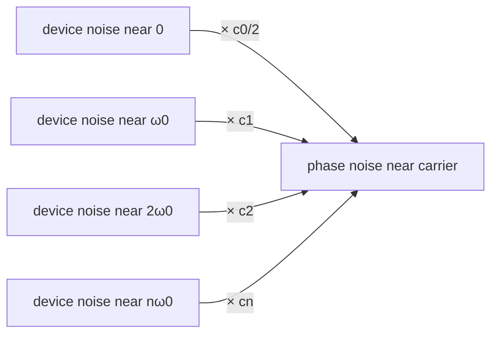

# Fourier Series of the ISF

> **β**: This English translation is in beta — the Traditional-Chinese original is the authoritative version.

> **Prerequisites**: [isf_definition](/03_isf_core_theory/isf_definition) ($\Gamma$ is dimensionless and $2\pi$-periodic), [impulse_to_phase_shift](/03_isf_core_theory/impulse_to_phase_shift) (the operational definition of $\Gamma$), [convolution_derivation](/03_isf_core_theory/convolution_derivation) (the phase integral for continuous noise).
>
> **Hands-on verification**: the Fourier-coefficient extraction, reconstruction, and Parseval numerical checks for this page are in [lab_05](/04_simulation_labs/lab_05_isf_fourier_coefficients).

The previous chapter [impulse_to_phase_shift](/03_isf_core_theory/impulse_to_phase_shift) derived the
operational definition of the ISF, $\Delta\phi=\Gamma(\omega_0\tau)\,\Delta q/q_{max}$, and pointed out that $\Gamma$ is a
**dimensionless, $2\pi$-periodic** function. This page answers the next key question:

**Given that $\Gamma$ is periodic, once it is expanded as a Fourier series, what physics does each term represent?**
The answer is the most elegant piece of ISF theory — it spells out exactly which band of device noise
the oscillator moves to the vicinity of the carrier. The core result ([P1] Eq.(12), p.183):

$$
\Gamma(\omega_0\tau)=\frac{c_0}{2}+\sum_{n=1}^{\infty}c_n\cos(n\omega_0\tau+\theta_n)
$$

> **Physical intuition (conclusion first)**: an oscillator is a **time-varying mixer**. Its phase sensitivity
> to noise, $\Gamma$, varies periodically with the waveform phase — equivalent to multiplying the noise by a "periodic weight" with fundamental $\omega_0$.
> Multiplying noise by a periodic function is, mathematically, shifting the noise spectrum to $0,\ \omega_0,\ 2\omega_0,\dots$ and summing.
> So **device noise near each $n\omega_0$ is weighted by the $n$-th Fourier coefficient $c_n$
> and then down-converted to the carrier vicinity** as phase noise. The $c_0$ (DC) term is especially important:
> it moves the **1/f flicker noise near DC** straight up, producing the close-in $1/f^3$ phase noise.

## Step 1: why $\Gamma$ can be expanded as a Fourier series

$\Gamma(\omega_0\tau)$ describes "how far the phase is pushed by a kick at a given point of the waveform". The oscillator sits in
**periodic steady state** (the output waveform repeats every $T=1/f_0$), so "kicking at phase $x$" and "kicking at phase
$x+2\pi$" have exactly the same effect. In other words $\Gamma$ is $2\pi$-periodic in its argument $x\equiv\omega_0\tau$:

$$
\Gamma(x+2\pi)=\Gamma(x).
$$

- **Math used**: any $2\pi$-periodic function that is square-integrable over one period ($\int_0^{2\pi}|\Gamma|^2dx<\infty$)
  admits a Fourier series (Dirichlet conditions). Real ISFs are continuous and piecewise smooth, so the conditions are easily satisfied.
- **Physical basis**: the periodicity comes from the oscillator's **limit cycle** — in steady state the state point goes around the cycle once per period,
  and the sensitivity depends only on the "position on the cycle (phase)", not on "which lap".
- **Unit check**: $x=\omega_0\tau$ is $[\text{rad/s}]\cdot[\text{s}]=[\text{rad}]$ ✓, dimensionless;
  $\Gamma$ itself is dimensionless, and so are $c_0,c_n$ (see [notation](/00_overview/notation)).

## Step 2: write the standard Fourier expansion (cos/sin form)

First write the familiar real cos/sin Fourier series, then merge it into the amplitude–phase form of [P1].
For a $2\pi$-periodic function:

$$
\Gamma(x)=\frac{a_0}{2}+\sum_{n=1}^{\infty}\big[a_n\cos(nx)+b_n\sin(nx)\big],
$$

with the coefficients obtained by inner products (projections) over one period:

$$
a_0=\frac{1}{\pi}\int_0^{2\pi}\Gamma(x)\,dx,\qquad
a_n=\frac{1}{\pi}\int_0^{2\pi}\Gamma(x)\cos(nx)\,dx,\qquad
b_n=\frac{1}{\pi}\int_0^{2\pi}\Gamma(x)\sin(nx)\,dx.
$$

- **Math used**: $\{\cos(nx),\sin(nx)\}$ are orthogonal on $[0,2\pi]$,
  $\int_0^{2\pi}\cos(mx)\cos(nx)\,dx=\pi\,\delta_{mn}$ ($m,n\ge1$); this orthogonality "sifts" out the corresponding component.
- **Watch the $1/\pi$ and the DC factor**: $a_0=\frac{1}{\pi}\int_0^{2\pi}\Gamma\,dx$, while the **mean
  (DC value)** of $\Gamma$ is $\frac{1}{2\pi}\int_0^{2\pi}\Gamma\,dx=\frac{a_0}{2}$. So the first term of the series must be written
  $\frac{a_0}{2}$ to equal the true mean. This $1/2$ is not arbitrary; the definition of $c_0$ below inherits it.

## Step 3: merge into amplitude–phase form to get $c_n,\theta_n$

Combine the same-frequency pair $a_n\cos(nx)+b_n\sin(nx)$ into a single cosine via the trig identity:

$$
a_n\cos(nx)+b_n\sin(nx)=c_n\cos(nx+\theta_n),
$$

where

$$
c_n=\sqrt{a_n^2+b_n^2},\qquad \theta_n=\operatorname{atan2}(-b_n,\,a_n).
$$

- **Math used**: $c_n\cos(nx+\theta_n)=c_n\cos\theta_n\cos(nx)-c_n\sin\theta_n\sin(nx)$;
  matching coefficients gives $a_n=c_n\cos\theta_n$, $b_n=-c_n\sin\theta_n$; inverting yields the expressions above.
- **DC correspondence**: set $c_0\equiv a_0$ (the DC coefficient), so the constant term $\frac{a_0}{2}=\frac{c_0}{2}$.
  Substituting gives [P1] Eq.(12):

$$
\boxed{\ \Gamma(\omega_0\tau)=\frac{c_0}{2}+\sum_{n=1}^{\infty}c_n\cos(n\omega_0\tau+\theta_n)\ }\qquad[\text{P1] Eq.(12), p.183}
$$

- **Notation trap (important)**: $c_0$ is the Fourier **coefficient**, while the DC **value** of the ISF is $c_0/2$. This factor
  is the easiest place to slip when computing the $1/f^3$ corner (Eq.(24)); later chapters will keep reminding you. The `a0`
  returned by this site's Python `compute_fourier_coefficients` equals this $c_0$ (see Step 8).

## Step 4: the physics of $c_0$ — DC, controls $1/f$ upconversion

Substitute the Fourier expansion of the ISF back into the LTV phase response ([P1] Eq.(11)→Eq.(13), p.183):

$$
\phi(t)=\frac{1}{q_{max}}\!\left[\frac{c_0}{2}\!\int_{-\infty}^{t}\!i_n\,d\tau+\sum_{n=1}^{\infty}c_n\!\int_{-\infty}^{t}\!i_n\cos(n\omega_0\tau+\theta_n)\,d\tau\right]\qquad[\text{P1] Eq.(13), p.183}
$$

The first term (the $c_0$ term) **integrates the noise current directly**, without any $\cos(n\omega_0\tau)$ modulation. Meaning:

- The $c_0$ term responds to the **DC / very-low-frequency components** of the noise current — push the node slowly and the phase drifts slowly.
- Inject a **small tone near DC**, $i(t)=I_0\cos(\Delta\omega t)$ ($\Delta\omega\ll\omega_0$):
  only the $c_0$ term responds (the other harmonics are averaged out by $\cos(n\omega_0\tau)$), giving ([P1] Eq.(15), p.183):

$$
\phi(t)\approx\frac{I_0\,c_0\sin(\Delta\omega t)}{2q_{max}\,\Delta\omega}.
$$

- **Why this is called "$1/f$ upconversion"**: device **flicker / $1/f$ noise** is concentrated at low frequency
  (near DC). The $c_0$ term moves (up-converts) this "noise living at baseband" next to the carrier,
  turning it into close-in phase noise. Later, [flicker_noise_upconversion](/03_isf_core_theory/flicker_noise_upconversion)
  uses this to derive the $1/f^3$ skirt ([P1] Eq.(23),(24)).
- **Design implication**: the smaller $c_0$, the weaker the flicker upconversion. With $c_0=0$ (a perfectly symmetric waveform), close-in theoretically has no
  $1/f^3$ contribution. This is the mathematical root of the "waveform symmetry → close-in phase noise" design rule
  (experimentally supported by [P2] Fig. 17, p.802).

## Step 5: the physics of $c_n$ — frequency-translating noise near $n\omega_0$ to the carrier

Look at the $n$-th component of the second term of Eq.(13): it multiplies the noise current by $\cos(n\omega_0\tau+\theta_n)$ and then integrates.
Multiplying by $\cos(n\omega_0\tau)$ is, in the frequency domain, **shifting the noise spectrum by $\pm n\omega_0$** (modulation theorem). So:

- Device noise near $n\omega_0+\Delta\omega$ (and $n\omega_0-\Delta\omega$) is weighted by $c_n$ and
  **down-converted to $\Delta\omega$**, becoming the phase noise at offset $\Delta\omega$ from the carrier.
- Inject a small tone near $n\omega_0$, $i(t)=I_0\cos((n\omega_0+\Delta\omega)t)$, into Eq.(13):
  only the $n$-th harmonic responds, giving ([P1] Eq.(16)/(17), p.183):

$$
\phi(t)\approx\frac{I_0\,c_n\sin(\Delta\omega t)}{2q_{max}\,\Delta\omega}.
$$

#### Explicit algebra: using $\cos A\cos B$ to move noise near $n\omega_0$ to the carrier

The line above is the "result"; now we work the **frequency-translation algebra** out in full, not just the intuition. Take the $n$-th component of the second term of Eq.(13)
and substitute the single tone $i_n(\tau)=I_0\cos((n\omega_0+\Delta\omega)\tau)$:

$$
\phi_n(t)=\frac{c_n}{q_{max}}\int_{-\infty}^{t}\cos(n\omega_0\tau+\theta_n)\,I_0\cos\big((n\omega_0+\Delta\omega)\tau\big)\,d\tau .
$$

**Step (i): product-to-sum.** The product of the two cosines uses the identity

$$
\cos A\cos B=\tfrac12\big[\cos(A-B)+\cos(A+B)\big],
$$

with $A=n\omega_0\tau+\theta_n$, $B=(n\omega_0+\Delta\omega)\tau$; compute the difference and sum frequencies:

$$
A-B=\theta_n-\Delta\omega\tau\quad(\text{frequency}\approx\Delta\omega),\qquad A+B=(2n\omega_0+\Delta\omega)\tau+\theta_n\quad(\text{frequency}\approx 2n\omega_0).
$$

The integrand becomes two terms:

$$
\cos(n\omega_0\tau+\theta_n)\cos\big((n\omega_0+\Delta\omega)\tau\big)=\tfrac12\Big[\cos(\Delta\omega\tau-\theta_n)+\cos\big((2n\omega_0+\Delta\omega)\tau+\theta_n\big)\Big].
$$

This line is the core of "frequency translation": noise that originally lived at $n\omega_0+\Delta\omega$, once multiplied by $\cos(n\omega_0\tau)$,
has its **difference frequency** collapse down to $\Delta\omega$ at baseband (moved down), while its **sum frequency** is pushed to $2n\omega_0$ (higher, useless).

**Step (ii): the integrator amplifies only the slow term and averages out the fast one.** $\int^t d\tau$ is a low-pass:

$$
\int^{t}\cos(\Delta\omega\tau-\theta_n)\,d\tau=\frac{\sin(\Delta\omega t-\theta_n)}{\Delta\omega}\ (\text{slow; small denominator}\Rightarrow\text{amplified, survives}),
$$

$$
\int^{t}\cos\big((2n\omega_0+\Delta\omega)\tau+\theta_n\big)\,d\tau=\frac{\sin(\cdots)}{2n\omega_0+\Delta\omega}\ (\text{fast; denominator}\approx2n\omega_0\Rightarrow\text{suppressed to negligible}).
$$

**Step (iii): keep only the slow term.**

$$
\phi_n(t)\approx\frac{c_n}{q_{max}}\cdot\frac{I_0}{2}\cdot\frac{\sin(\Delta\omega t-\theta_n)}{\Delta\omega}=\frac{I_0\,c_n\sin(\Delta\omega t-\theta_n)}{2q_{max}\,\Delta\omega},
$$

Absorbing the fixed phase $\theta_n$ into the origin recovers Eq.(16/17). **Conclusion**: the $n$-th Fourier coefficient $c_n$ really does take the noise near $n\omega_0$,
"multiply it by $\tfrac12 c_n$ and collapse it to $\Delta\omega$" — this is the algebraic proof of frequency translation, matching the mixer picture below.
(The same down-conversion integral is used again in [white_noise_to_phase_noise](/03_isf_core_theory/white_noise_to_phase_noise)
to accumulate the $1/f^2$ summation.)

- **This is exactly the picture of [P1] Fig. 8 (p.183)**: noise is spread across the bands at $0,\omega_0,2\omega_0,\dots$;
  the ISF's $c_0,c_1,c_2,\dots$ act like a bank of mixer gains, each folding its band's noise back to the carrier vicinity,
  all superposing into the final phase-noise sideband.



- **Unit/dimension check**: in Eq.(15)/(16) the dimensions of $\dfrac{I_0\,c_n}{2q_{max}\,\Delta\omega}$ are
  $\dfrac{[\text{A}]\cdot(\text{dimensionless})}{[\text{C}]\cdot[\text{rad/s}]}
  =\dfrac{[\text{A}]}{[\text{C/s}]\cdot[\text{rad}]}=\dfrac{[\text{A}]}{[\text{A}]}\cdot\dfrac{1}{[\text{rad}]^{-1}}$
  — after simplification $\phi$ is rad (dimensionless), and $\sin(\Delta\omega t)$ is dimensionless ✓. (Remember $C=\text{A}\cdot\text{s}$.)

## Step 6: why close-in ($1/f^3$) is dominated by $c_0$ and the low-order coefficients

Put the two steps above together into one "frequency map":

| Where the device noise lives | Via which coefficient | What it becomes next to the carrier |
|---|---|---|
| $1/f$ flicker near DC | $c_0/2$ | close-in, slope $1/f^3$ (very steep) |
| White noise near $\omega_0$ | $c_1$ | $1/f^2$ skirt ($-20$ dB/dec) |
| White noise at $2\omega_0,3\omega_0,\dots$ | $c_2,c_3,\dots$ | also folds back, merged into $1/f^2$ (counted via $\sum c_n^2$) |

- **Why flicker becomes $1/f^3$ through $c_0$**: flicker is already $1/f$ (power spectrum $\propto1/\Delta\omega$).
  The $c_0$ term moves it intact next to the carrier; the phase integrator (the $\int d\tau$ in Eq.(13)) then adds another
  $1/\Delta\omega^2$ (integration divides by $(j\Delta\omega)$ in frequency, i.e. by $\Delta\omega^2$ in power),
  $\dfrac{1}{\Delta\omega}\times\dfrac{1}{\Delta\omega^2}=\dfrac{1}{\Delta\omega^3}$ → $1/f^3$.
- **Why the higher-order $c_n$ mainly feed $1/f^2$**: white noise is flat — flat wherever it is moved — and the integrator only adds $1/\Delta\omega^2$ → $1/f^2$.
  All harmonic contributions are summarized by a single number, $\sum_{n=0}^\infty c_n^2$, which is exactly the Parseval relation and $\Gamma_{rms}$ of the next page
  [rms_isf](/03_isf_core_theory/rms_isf).
- The full $1/f^3$ / $1/f^2$ derivations are in
  [flicker_noise_upconversion](/03_isf_core_theory/flicker_noise_upconversion) and
  [white_noise_to_phase_noise](/03_isf_core_theory/white_noise_to_phase_noise) respectively.

## Step 7: how waveform symmetry nulls certain coefficients

The parity of the Fourier coefficients follows directly from the symmetry of $\Gamma(x)$, giving the designer a knob to "switch off certain upconversions via the waveform shape":

| Symmetry of $\Gamma$ | Mathematical result | Physical consequence |
|---|---|---|
| Even function $\Gamma(-x)=\Gamma(x)$ | all $b_n=0$ (pure cos) | $\theta_n\in\{0,\pi\}$, simple phases |
| Odd function $\Gamma(-x)=-\Gamma(x)$ | all $a_n=0$ and $a_0=0$ ⟹ $c_0=0$ | **no $1/f$ upconversion** (the ideal-LC $-\sin$ is of this type) |
| Half-wave symmetry $\Gamma(x+\pi)=-\Gamma(x)$ | even harmonics $c_2=c_4=\dots=0$ | noise near $2\omega_0$ does not fold back |
| DC offset $\cos\theta+\alpha$ (toy `gamma_asymmetric`) | $c_0=2\alpha\neq0$ | $1/f^3$ appears (close-in degrades) |

- **Example (ideal LC)**: $\Gamma_{LC}(\theta)=-\sin\theta$ is odd ⟹ $c_0=0$. So the ideal LC has, to
  first order, **no** flicker upconversion; it is real-world asymmetry (hard switching, bias asymmetry) that props $c_0$ up.
- **Example (half-wave symmetry)**: differential / push-pull structures make the rising and falling edges mirror images ⟹ $\Gamma(x+\pi)=-\Gamma(x)$ ⟹
  the even harmonics are suppressed, and noise at $2\omega_0$ (often supply ripple and second-harmonic distortion) does not fold back to the carrier.
- **Note (mechanism of the toy model)**: the `gamma_asymmetric` in the table props $c_0$ up in the simplest possible way — adding a DC offset to the whole ISF ($\cos\theta+\alpha$); in real circuits, **asymmetric rise/fall transition slopes** are a different — and more common — mechanism that likewise makes $c_0\neq0$ and turns on $1/f$ upconversion, but with a different waveform shape. The toy on this page exists only to isolate the "$c_0$ knob".
- This is exactly the message of the figure below: symmetric waveform $c_0=0$, asymmetric waveform $c_0\neq0$.

## Step 8: computing the coefficients by numerical integration (real function)

Beyond the theory, here is code that runs. This site's `compute_fourier_coefficients` (read from
`simulations/common/isf_utils.py`) simply carries out the Step-2 integrals with the trapezoidal rule:

```python
import numpy as np
from simulations.common.isf_utils import (
    gamma_lc_ideal, gamma_asymmetric,
    compute_fourier_coefficients, reconstruct_from_fourier, gamma_rms,
)

# theta must span exactly one period [0, 2*pi] (endpoint included) for the trapezoidal rule to give the correct (1/pi)*∫ value
theta = np.linspace(0.0, 2 * np.pi, 4096, endpoint=True)

# Ideal LC ISF: Gamma(theta) = -sin(theta) (odd function)
gamma = gamma_lc_ideal(theta)

# a0 is c0 in Hajimiri's notation; a,b are the cos/sin coefficients; c_n = sqrt(a_n^2+b_n^2)
a0, a, b, c, phase = compute_fourier_coefficients(theta, gamma, n_harmonics=8)

print("c0 =", a0)            # -> ~0.0  (odd function: no DC, no 1/f upconversion)
print("c1 =", c[1])         # -> ~1.0  (fundamental component only)
print("c2..c8 =", c[2:])    # -> ~0    (pure single tone)

# Reconstruct the waveform to verify the Eq.(12) reconstruction
gamma_hat = reconstruct_from_fourier(theta, a0, a, b)
print("max reconstruction error =", np.max(np.abs(gamma_hat - gamma)))  # -> ~1e-15
```

- **Why the trapezoidal rule suffices**: the integrand is a smooth periodic function, and the trapezoidal rule converges **exponentially** for periodic functions (the endpoint errors cancel);
  a few thousand points reach machine precision.
- **The endpoints must include $2\pi$**: the function docstring states explicitly that `theta` must span `[0, 2*pi]` (endpoint included), otherwise $\frac{1}{\pi}\int$
  misses one cell. This is the most common source of numerical off-by-one errors.
- **Asymmetric toy-model comparison**: plug in `gamma = gamma_asymmetric(theta, alpha=0.3)` (i.e. $\cos\theta+0.3$)
  and you get $c_0\approx2\alpha=0.6$, $c_1\approx1$, and the rest $\approx0$ — confirming that $\alpha$ is exactly the knob that
  "props up the DC and turns on $1/f$ upconversion" (this is a pedagogical toy model, **not transistor-level**).

## Figure 1: more harmonics, closer reconstruction of the original ISF

The figure below (`fig_reconstruction` from `lab_05`) takes a multi-harmonic toy ISF
($\Gamma(\theta)=-\sin\theta+0.35\sin2\theta+0.18\cos3\theta+0.25$) and reconstructs it with $N=1,2,4$ terms,
showing how the partial sums of Eq.(12) converge step by step to the original waveform.


- **Corresponding formula**: [P1] Eq.(12) (partial sum $\Gamma_N=\frac{c_0}{2}+\sum_{n=1}^{N}c_n\cos(n\omega_0\tau+\theta_n)$).
- **How to read it**: $N=1$ captures only the fundamental and has the largest error; by $N=4$ the curves almost coincide. In practice the ISF's energy concentrates in the low-order harmonics,
  so a handful of terms is enough to compute phase noise accurately.
- **Toy-model note**: this ISF is a synthetic teaching waveform, **not a transistor-level** extraction.
- Full script: `simulations/lab_05_fourier_isf.py`.

## Figure 2: the coefficient spectrum $c_n$ (with Parseval verification)

The figure below (`fig_coefficients` from `lab_05`, `n_harmonics=8`) plots $c_n$ as a bar chart (the coefficient spectrum)
and marks the Parseval check $\sum_{n=0}^{\infty}c_n^2=2\Gamma_{rms}^2$ ([P1] Eq.(20), derived in detail on the next page).


- **Corresponding formulas**: the $c_n$ of [P1] Eq.(12); the $\sum c_n^2=2\Gamma_{rms}^2$ of [P1] Eq.(20).
- **How to read it**: each bar's height is that harmonic's "weight" in the phase noise. The $c_0$ bar is critical —
  as soon as it is nonzero, close-in $1/f^3$ appears. The low-order bars dominate; the high orders decay quickly.
- The detailed Parseval derivation and $\Gamma_{rms}$ are in [rms_isf](/03_isf_core_theory/rms_isf).

## Figure 3: $c_0$ for symmetric vs. asymmetric waveforms

The figure below (`fig_symmetric_vs_asymmetric` from `lab_05`) contrasts two toy ISFs: the symmetric
$\Gamma=\cos\theta$ ($c_0=0$) and the asymmetric $\Gamma=\cos\theta+0.4$ ($c_0=0.8$), highlighting that **only $c_0\neq0$
upconverts $1/f$ noise**.


- **Corresponding formulas**: $c_0$ ([P1] Eq.(12)); its consequence, the $1/f^3$ corner of [P1] Eq.(24).
- **How to read it**: on the left, the symmetric waveform has zero mean and the DC bar disappears → no $1/f^3$; on the right, the whole curve is lifted and
  the DC bar pops out → close-in noise degrades. In design terms, "making the waveform symmetric" means "flattening this DC bar".
- **Toy-model note**: `gamma_symmetric`/`gamma_asymmetric` are pedagogical toy ISFs,
  **not transistor-level** (see the `isf_utils.py` docstring).
- Design-side extension: [symmetry](/06_design_insights/symmetry).

## Numerical example (building a feel for the numbers)

> Take the ideal-LC $\Gamma(\theta)=-\sin\theta$ and hand-compute the first few coefficients.

View $-\sin x$ as a Fourier expansion of itself: $-\sin x=c_1\cos(x+\theta_1)$, where
$\cos(x+\theta_1)=\cos x\cos\theta_1-\sin x\sin\theta_1$; for this to equal $-\sin x$ requires
$\theta_1=\pi/2$ (then $\cos(x+\pi/2)=-\sin x$), hence $c_1=1$, $\theta_1=\pi/2$.

- $c_0=\dfrac{1}{\pi}\displaystyle\int_0^{2\pi}(-\sin x)\,dx=0$ (odd function, zero DC).
- $c_1=1$, $c_n=0$ ($n\ge2$).
- **Feel**: the ideal-LC ISF is a "clean single fundamental" — all the energy sits in $c_1$. So it folds noise back mainly from
  near $\omega_0$ ($1/f^2$), and since $c_0=0$ there is, ideally, no $1/f^3$. The next page shows
  $\sum c_n^2=c_1^2=1=2\Gamma_{rms}^2$ ⟹ $\Gamma_{rms}=1/\sqrt{2}\approx0.707$.

## Worked examples

Two problems in the strict format: **problem → step-by-step substitution (with units) → result → dimension check → one-line Python verification**.
Problem 1 hand-computes $c_0,c_1,c_2$ and cross-checks with `compute_fourier_coefficients`; Problem 2 computes one harmonic's contribution to the phase noise.

> **Example 1 (hand-compute the first few $c_n$, then cross-check in code)**: given the toy ISF
> $\Gamma(\theta)=0.25-\sin\theta+0.35\sin2\theta+0.18\cos3\theta$ (the synthetic waveform used in the lab_05 reconstruction figure),
> hand-compute $c_0,c_1,c_2,c_3$.

**Step by step (read the coefficients off directly; no integration needed):** compare $\Gamma$ term by term with the standard expansion $\Gamma=\dfrac{a_0}{2}+\sum_n[a_n\cos n\theta+b_n\sin n\theta]$:

1. **DC**: the constant term of $\Gamma$ is $0.25$, i.e. the mean $=0.25$. Since the DC **value** $=a_0/2$, we get $a_0=0.5$, hence $c_0=a_0=0.5$.
2. **Fundamental $n=1$**: $\Gamma$ contains $-\sin\theta$ and no $\cos\theta$. Comparison gives $a_1=0$, $b_1=-1$.
   Hence $c_1=\sqrt{a_1^2+b_1^2}=\sqrt{0+1}=1$, $\theta_1=\operatorname{atan2}(-b_1,a_1)=\operatorname{atan2}(1,0)=\pi/2$.
3. **Second harmonic $n=2$**: contains $0.35\sin2\theta$ and no $\cos2\theta$. So $a_2=0$, $b_2=0.35$, hence $c_2=0.35$.
4. **Third harmonic $n=3$**: contains $0.18\cos3\theta$ and no $\sin3\theta$. So $a_3=0.18$, $b_3=0$, hence $c_3=0.18$.

**Result:** $c_0=0.5,\ c_1=1,\ c_2=0.35,\ c_3=0.18$ (the rest $\approx0$).

**Dimension check:** $\Gamma$ is dimensionless ([notation](/00_overview/notation)); each $c_n$ is one of its Fourier amplitudes,
likewise dimensionless; $\theta_n$ is rad (a phase) ✓.

**Parseval cross-check (while we are at it):** the strict relation (with the DC factor) is $\dfrac{c_0^2}{2}+\sum_{n\ge1}c_n^2=2\Gamma_{rms}^2$.
Substituting: $\dfrac{0.5^2}{2}+(1^2+0.35^2+0.18^2)=0.125+1.1549=1.2799$, so $\Gamma_{rms}=\sqrt{1.2799/2}=0.800$.
(Note: [P1] Eq.(20) writes $\sum_{n=0}^\infty c_n^2=2\Gamma_{rms}^2$ using the convention that the DC term carries no extra $1/2$;
for a symmetric ISF with $c_0=0$ the two forms agree, but when $c_0\neq0$ remember the DC term's factor — see [rms_isf](/03_isf_core_theory/rms_isf).)

```python
import numpy as np
from simulations.common.isf_utils import compute_fourier_coefficients, gamma_rms

theta = np.linspace(0.0, 2*np.pi, 4096, endpoint=True)
gamma = 0.25 - np.sin(theta) + 0.35*np.sin(2*theta) + 0.18*np.cos(3*theta)
a0, a, b, c, phase = compute_fourier_coefficients(theta, gamma, n_harmonics=4)
print("c0,c1,c2,c3 =", round(a0,3), round(c[1],3), round(c[2],3), round(c[3],3))
# -> c0,c1,c2,c3 = 0.5 1.0 0.35 0.18
print("Gamma_rms =", round(gamma_rms(theta, gamma),3))   # -> 0.8
```

> **Example 2 (one harmonic's contribution to phase noise)**: with the ISF of Example 1, a small tone of amplitude $I_0=1\ \mu\text{A}$
> is injected at $2\omega_0+\Delta\omega$ (i.e. near the **second harmonic**). Take $q_{max}=1$ pC and $\Delta f=1$ MHz ($\Delta\omega=2\pi\times10^6$ rad/s).
> Find the phase-modulation amplitude and the relative single-sideband power this noise produces at offset $\Delta\omega$ from the carrier after down-conversion via $c_2$.

**Step-by-step substitution:**

1. Only the $2$nd harmonic $c_2=0.35$ responds (the explicit algebra of Step 5: noise near $2\omega_0$ is moved to $\Delta\omega$ by $c_2$).
2. Phase-modulation amplitude (from Eq.(16/17) with $c_n\to c_2$):

$$
\phi_p=\frac{I_0\,c_2}{2q_{max}\,\Delta\omega}=\frac{(10^{-6}\,\text{A})\times0.35}{2\times(10^{-12}\,\text{C})\times(6.283\times10^{6}\,\text{rad/s})}.
$$

3. Denominator $=2\times10^{-12}\times6.283\times10^{6}=1.257\times10^{-5}\ \text{C}\cdot\text{rad/s}$;
   numerator $=3.5\times10^{-7}\ \text{A}$. Dividing gives $\phi_p=2.785\times10^{-2}\ \text{rad}$.
4. Relative single-sideband power ([P1] Eq.(18), $\left(\dfrac{I_0c_2}{4q_{max}\Delta\omega}\right)^2=(\phi_p/2)^2$):

$$
P_{SBC}=\left(\frac{\phi_p}{2}\right)^2=\left(\frac{2.785\times10^{-2}}{2}\right)^2=1.939\times10^{-4}.
$$

**Result:** $\phi_p\approx27.9$ mrad, $P_{SBC}\approx1.94\times10^{-4}=10\log_{10}\to-37.1$ dBc.

**Dimension check:** $\phi_p$: $\dfrac{\text{A}}{\text{C}\cdot(\text{rad/s})}=\dfrac{\text{A}}{(\text{A}\cdot\text{s})\cdot\text{s}^{-1}\cdot\text{rad}}=\dfrac{\text{A}}{\text{A}\cdot\text{rad}}=\text{rad}^{-1}$...
in the simplification the rad of $\Delta\omega$ sits in the denominator, so $\phi_p$ carries rad ($C=\text{A}\cdot\text{s}$; the s of rad/s cancels the s of C) → rad ✓.
$P_{SBC}=(\text{rad}/\text{rad})^2$ is dimensionless ✓ (a power ratio).

```python
import numpy as np
I0, c2, qmax, dw = 1e-6, 0.35, 1e-12, 2*np.pi*1e6
phi_p = I0*c2/(2*qmax*dw)
P_sb  = (I0*c2/(4*qmax*dw))**2
print(round(phi_p*1e3,1), "mrad ;", round(10*np.log10(P_sb),1), "dBc")
# -> 27.9 mrad ; -37.1 dBc
```

- **Feel**: the same $1\ \mu\text{A}$ tone, if injected near the fundamental instead (using $c_1=1$ rather than $c_2=0.35$), makes $\phi_p$ larger by a factor of $1/0.35\approx2.86$
  and the power larger by $(1/0.35)^2\approx8.2$ ($+9.1$ dB). This is the numerical face of "$c_n$ as mixer gains": **the larger a harmonic's coefficient, the harder it folds that band's noise back.**

(Full library: `simulations/common/isf_utils.py`.)

## Applicability and failure conditions

| Condition | When it holds | What happens when it fails |
|---|---|---|
| Oscillator in periodic steady state | $\Gamma$ is strictly $2\pi$-periodic, Fourier-expandable | during startup transients / under injection pulling, $\Gamma$ is not purely periodic |
| Noise is a small perturbation | linear superposition in Eq.(13) holds | large injection → harmonic interaction; the single-$c_n$ picture breaks down |
| Device noise is stationary | simple per-band bookkeeping | cyclostationary noise requires $\Gamma_{eff}=\Gamma\cdot\alpha$ (see [effective_isf](/03_isf_core_theory/effective_isf)) |
| $\Gamma$ correctly extracted | coefficients are trustworthy | transient / adjoint simulation needed to obtain $\Gamma$ |

## Key takeaways

- $\Gamma$ is a $2\pi$-periodic function, expandable as $\Gamma=\dfrac{c_0}{2}+\sum_{n\ge1}c_n\cos(n\omega_0\tau+\theta_n)$ ([P1] Eq.(12), p.183).
- The oscillator acts like a time-varying mixer: the $n$-th coefficient $c_n$ **down-converts** device noise near $n\omega_0$ to the carrier ([P1] Eq.(16), Fig. 8).
- $c_0$ (the DC coefficient; the DC **value** $=c_0/2$) upconverts baseband flicker noise into close-in $1/f^3$ ([P1] Eq.(15),(23),(24)).
- Waveform symmetry sets the parity of the coefficients: odd function ⟹ $c_0=0$ (no $1/f$ upconversion); half-wave symmetry ⟹ even harmonics vanish.
- Ideal LC: $c_0=0,\ c_1=1$, the rest zero; $\Gamma_{rms}=1/\sqrt2\approx0.707$.
- Numerically, `compute_fourier_coefficients` (trapezoidal rule; `theta` including both the $0$ and $2\pi$ endpoints) computes the coefficients.

## Further reading

- Operational ISF definition (previous step): [impulse_to_phase_shift](/03_isf_core_theory/impulse_to_phase_shift)
- Parseval and the rms ISF (next step): [rms_isf](/03_isf_core_theory/rms_isf)
- How $c_n$ feeds $1/f^2$: [white_noise_to_phase_noise](/03_isf_core_theory/white_noise_to_phase_noise)
- How $c_0$ feeds $1/f^3$: [flicker_noise_upconversion](/03_isf_core_theory/flicker_noise_upconversion)
- Design consequences of symmetry: [symmetry](/06_design_insights/symmetry)
- Numerical-feel quick reference: [numerical_feeling](/04_simulation_labs/numerical_feeling)
