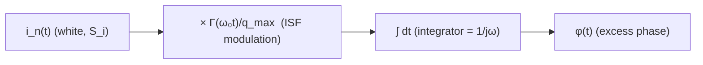

# How White Noise Becomes 1/f² Phase Noise

> **β**: This English translation is in beta — the Traditional-Chinese original is the authoritative version.

> Prerequisites: [convolution_derivation](/03_isf_core_theory/convolution_derivation) | Next: [fourier_series_of_isf](/03_isf_core_theory/fourier_series_of_isf) · [rms_isf](/03_isf_core_theory/rms_isf)
>
> **Hands-on verification**: see [lab_06](/04_simulation_labs/lab_06_white_noise_phase_noise) for this page's "white noise → $1/f^2$ phase noise" time-domain simulation matching theory.

This page answers the **most iconic** result in oscillator phase-noise theory: why does a **spectrally flat white current noise** (a random current whose power spectral density is independent of frequency), after passing through an oscillator, turn into a **phase-noise skirt with a slope of $-20$ dB/decade (i.e., $1/f^2$)**? We will derive all the way to

$$
\mathcal{L}\{\Delta\omega\}=10\log_{10}\!\left(\frac{\Gamma_{rms}^2}{q_{max}^2}\cdot\frac{\overline{i_n^2}/\Delta f}{4\,\Delta\omega^2}\right)
$$

and honestly account for the famous "off by a factor of 2" bookkeeping issue in the literature.

> **Physical intuition (conclusion first)**: white noise is itself "flat" — it has no $1/f$ structure whatsoever.
> But the previous chapter [convolution_derivation](/03_isf_core_theory/convolution_derivation) told us: the phase $\phi(t)$
> is the **time integral** of the noise current ([P1] Eq.(11)). **An integrator is a $1/(j\omega)$ filter**:
> it multiplies the power spectrum by $1/\omega^2$. Something flat goes in, gets multiplied by $1/\omega^2$, and comes out — that is where $1/f^2$ comes from.
> The ISF only decides "how large a weight to multiply by" (set by $\Gamma_{rms}$ and $q_{max}$); it does not decide the slope.
> **The slope always comes from the integrator.**

## Recap first: phase is the integral of noise

Start from the LTV phase response of [P1] Eq.(11), p.182:

$$
\phi(t)=\frac{1}{q_{max}}\int_{-\infty}^{t}\Gamma(\omega_0\tau)\,i_n(\tau)\,d\tau .
$$

Read it as a signal flow: the noise current $i_n(t)$ is first modulated (pointwise multiplication) by the **periodic weight** $\Gamma(\omega_0 t)/q_{max}$,
and then **integrated** (with memory up to the upper limit $t$). As a block diagram:



The whole task is: trace the **power spectrum** through this chain — the input is $S_i$; what is the output $S_\phi$?

## Step 1: what is the PSD of white current noise

White noise is by definition noise whose PSD is independent of frequency (flat). Using the single-sided PSD, we write

$$
S_i(f)=\frac{\overline{i_n^2}}{\Delta f}\quad[\text{A}^2/\text{Hz}].
$$

- **Physics used**: thermal noise and shot noise can both be treated as white within the offset band we care about
  (kHz–MHz) — their corner frequencies lie far higher.
- **Unit check**: $[\text{A}^2/\text{Hz}]$; multiplying by a bandwidth $\Delta f$ (Hz) gives $[\text{A}^2]$ = mean-square current ✓.
- **Order-of-magnitude feel**: the thermal noise current of a conducting resistance $R$ is $\overline{i_n^2}/\Delta f=4kT/R$; at $R=1\,\text{k}\Omega$ and
  room temperature this is about $1.6\times10^{-23}\,\text{A}^2/\text{Hz}$. The canonical Example B on this page takes $S_i=10^{-24}\,\text{A}^2/\text{Hz}$
  as a round-number "single equivalent white-noise source", convenient for mental arithmetic.

## Step 2: ISF modulation — white noise "stirred" by the periodic weight

Expand $\Gamma(\omega_0\tau)$ in a Fourier series ([P1] Eq.(12), p.183):

$$
\Gamma(\omega_0\tau)=\frac{c_0}{2}+\sum_{n=1}^{\infty}c_n\cos(n\omega_0\tau+\theta_n).
$$

Multiplying by the white noise $i_n(\tau)$ amounts to picking up the noise near each harmonic $n\omega_0$ and "down-converting" it back to baseband
(this is the frequency translation described in [fourier_series_of_isf](/03_isf_core_theory/fourier_series_of_isf)).
The key point: for **white** noise, the noise power near every harmonic $n\omega_0$ is equally large (because the spectrum is flat),
so every $c_n$ brings down white noise of the **same strength**. The harmonics are **uncorrelated** (white noise in different frequency bands is mutually independent),
so powers add directly, and the total weight is $\sum_n c_n^2$.

- **Math used**: white noise in different bands is uncorrelated → the harmonic contributions add in **power** (not in amplitude).
- **Unit check**: $c_n$ is dimensionless, so $\sum c_n^2$ is dimensionless ✓.

## Step 3: from single-tone sidebands to the white-noise summation (Eq.(19))

[P1]'s strategy is clever: first compute how much sideband "one small single-tone current" produces, then treat white noise as a superposition of countless independent small tones.
For a tone injected near $n\omega_0$, $i(t)=I_0\cos(n\omega_0+\Delta\omega)t$, the excess phase is a slow modulation
([P1] Eq.(16/17), p.183):

$$
\phi(t)\approx\frac{I_0\,c_n\sin(\Delta\omega t)}{2q_{max}\,\Delta\omega}.
$$

The single-sideband power it produces relative to the carrier ([P1] Eq.(18), p.183):

$$
P_{SBC}(\Delta\omega)=10\log_{10}\!\left(\frac{I_0\,c_n}{4q_{max}\,\Delta\omega}\right)^2.
$$

### Step 3a (worked out explicitly): the downconversion integral — the slow term survives, the fast term is averaged away

Eq.(16/17) above does not appear out of thin air; it is the algebraic result of "down-converting
the noise near $n\omega_0$ to baseband". We now **work it out for you step by step** — this is exactly the intermediate step that the authoring spec (§10.2) requires.

Substitute the near-$n\omega_0$ injected tone $i(\tau)=I_0\cos((n\omega_0+\Delta\omega)\tau)$ into the $n$-th harmonic term of [P1] Eq.(13).
The integral to evaluate for that term is "the ISF's $n$-th harmonic weight" times "the injected current", integrated:

$$
\phi_n(t)=\frac{1}{q_{max}}\int^{t}\!\!c_n\cos(n\omega_0\tau+\theta_n)\,I_0\cos\big((n\omega_0+\Delta\omega)\tau\big)\,d\tau .
$$

**Step (i): use the product-to-sum identity to split the product of the two cosines into a "sum" cosine and a "difference" cosine.** The identity

$$
\cos A\cos B=\tfrac12\big[\cos(A-B)+\cos(A+B)\big]
$$

Let $A=n\omega_0\tau+\theta_n$ and $B=(n\omega_0+\Delta\omega)\tau$. Compute the difference and sum frequencies:

$$
A-B=(n\omega_0\tau+\theta_n)-(n\omega_0+\Delta\omega)\tau=\theta_n-\Delta\omega\tau,
$$

$$
A+B=(n\omega_0\tau+\theta_n)+(n\omega_0+\Delta\omega)\tau=(2n\omega_0+\Delta\omega)\tau+\theta_n .
$$

So the integrand becomes

$$
c_n\cos(n\omega_0\tau+\theta_n)\,I_0\cos\big((n\omega_0+\Delta\omega)\tau\big)=\frac{I_0c_n}{2}\Big[\underbrace{\cos(\Delta\omega\tau-\theta_n)}_{\text{slow term, }\approx\Delta\omega}+\underbrace{\cos\big((2n\omega_0+\Delta\omega)\tau+\theta_n\big)}_{\text{fast term, }\approx 2n\omega_0}\Big].
$$

(Using $\cos(\theta_n-\Delta\omega\tau)=\cos(\Delta\omega\tau-\theta_n)$ — cosine is an even function.)

**Step (ii): the two terms meet completely different fates.** The integrator (that $\int^t d\tau$) is essentially a **low-pass** — it accumulates the signal over time;
high-frequency components "cancel between positive and negative excursions and get averaged away", while low-frequency (slow) components keep accumulating.

- **The slow term** has frequency about $\Delta\omega$ (the offset, typically kHz–MHz, $\Delta\omega\ll\omega_0$). Integrating a slow cosine gives
  $\int\cos(\Delta\omega\tau-\theta_n)\,d\tau=\dfrac{\sin(\Delta\omega\tau-\theta_n)}{\Delta\omega}$ — the denominator is only a tiny $\Delta\omega$,
  so the term is **amplified and survives**.
- **The fast term** has frequency about $2n\omega_0$ (twice-the-carrier scale, GHz). The same integration gives $\dfrac{\sin(\cdots)}{2n\omega_0+\Delta\omega}$ —
  the denominator is the huge $2n\omega_0$, squeezing the amplitude down to a factor of $\sim\Delta\omega/(2n\omega_0)$; negligible relative to the slow term, it is effectively **averaged away by the integrator**.

**Step (iii): keep only the slow term, obtaining Eq.(16/17).**

$$
\phi_n(t)\approx\frac{1}{q_{max}}\cdot\frac{I_0c_n}{2}\cdot\frac{\sin(\Delta\omega t-\theta_n)}{\Delta\omega}=\frac{I_0\,c_n\sin(\Delta\omega t-\theta_n)}{2q_{max}\,\Delta\omega}
$$

Absorbing the time-independent phase $\theta_n$ into the time origin recovers [P1] Eq.(16/17) above, $\phi(t)\approx\dfrac{I_0 c_n\sin(\Delta\omega t)}{2q_{max}\Delta\omega}$.
This downconversion integral (spec §10.2) is the hard core of "the oscillator acting as a mixer": **noise near $n\omega_0$ is moved by the ISF's $n$-th harmonic
to $\Delta\omega$ (the difference-frequency slow term survives), while the sum-frequency fast term at $2n\omega_0$ vanishes automatically.**

- **Unit check**: $\dfrac{[\text{A}]\cdot(\text{dimensionless})}{[\text{C}]\cdot[\text{rad/s}]}=\dfrac{\text{A}}{\text{A}\cdot\text{s}}\cdot\text{s}\cdot\text{rad}^{-1}$ —
  with $C=\text{A}\cdot\text{s}$ and $\Delta\omega$ in rad/s, this simplifies so that $\phi$ is dimensionless (rad) ✓.

### Step 3b (worked out explicitly): the factor-8 summation, (18)→(19)

Next, accumulate the "single-tone sideband powers" into the "white-noise summation". Three things hide in this step: **both sidebands**,
**the white-noise substitution $I_0^2/2\to\overline{i_n^2}/\Delta f$**, and **the sum over $n$**. Unpacked step by step:

**Step (i): the linear value of the single-sideband relative power.** Square the quantity inside Eq.(18)'s parentheses (hold off on the $10\log$):

$$
\left(\frac{I_0\,c_n}{4q_{max}\,\Delta\omega}\right)^2=\frac{I_0^2\,c_n^2}{16\,q_{max}^2\,\Delta\omega^2}.
$$

(The $4$ here comes from the $2q_{max}\Delta\omega$ of Eq.(16) plus taking a single sideband — the power of the slow modulation $\sin(\Delta\omega t)$ corresponds to $\tfrac12$ of the amplitude,
$\tfrac12\times\tfrac1{2}=\tfrac14$, so the denominator goes from $2$ to $4$; hence $4^2=16$.)

**Step (ii): the white-noise substitution $I_0^2/2\to\overline{i_n^2}/\Delta f$.** A single tone of amplitude $I_0$ has mean square (power) $I_0^2/2$
(sinusoid rms² $=$ amplitude²$/2$). View the white noise as "one equivalent small tone near each $n\omega_0$, within bandwidth $\Delta f$";
its power is the PSD times the bandwidth $=(\overline{i_n^2}/\Delta f)$. Equate the two:

$$
\frac{I_0^2}{2}\;\to\;\frac{\overline{i_n^2}}{\Delta f}\qquad\Longrightarrow\qquad I_0^2\;\to\;2\,\frac{\overline{i_n^2}}{\Delta f}.
$$

Note that the extra piece here is exactly that **factor 2**: converting "peak amplitude" to "power" brings a $\tfrac12$, so substituting in the reverse direction brings a $2$.
Insert into step (i):

$$
\frac{I_0^2\,c_n^2}{16\,q_{max}^2\,\Delta\omega^2}\;\to\;\frac{2(\overline{i_n^2}/\Delta f)\,c_n^2}{16\,q_{max}^2\,\Delta\omega^2}.
$$

**Step (iii): both sidebands + sum over $n$.** Each harmonic $n\omega_0$ folds one sideband back from each side of the carrier
(both $n\omega_0+\Delta\omega$ and $n\omega_0-\Delta\omega$ down-convert to $\Delta\omega$); the power above already contains both contributions.
Then sum over all harmonics $n=0,1,2,\dots$ (the bands are uncorrelated, so powers add directly):

$$
\mathcal{L}=\sum_n\frac{2(\overline{i_n^2}/\Delta f)\,c_n^2}{16\,q_{max}^2\,\Delta\omega^2}=\frac{(\overline{i_n^2}/\Delta f)\sum_n c_n^2}{8\,q_{max}^2\,\Delta\omega^2}.
$$

**Step (iv): cancel to get the factor 8.** Numerator $2$, denominator $16$; cancelling leaves $8$ — this is the origin of that famous $8$ in Eq.(19)'s denominator:

$$
8=\frac{16}{2}=\frac{(\text{Eq.18 squared: }4^2)}{(\text{white-noise substitution: }2)} .
$$

Treating the white noise as countless independent tones near each $n\omega_0$ within bandwidth $\Delta f$, letting $I_0^2/2\to\overline{i_n^2}/\Delta f$,
and summing over all harmonics $n=0,1,2,\dots$ gives the **white-noise phase-noise summation** ([P1] Eq.(19), p.185):

$$
\mathcal{L}\{\Delta\omega\}=10\log_{10}\!\left(\frac{\overline{i_n^2}/\Delta f\;\sum_{n=0}^{\infty}c_n^2}{8\,q_{max}^2\,\Delta\omega^2}\right)
$$

- **See the $1/f^2$ yet?** The denominator carries $\Delta\omega^2$. For every decade up ($\Delta\omega\times10$), the bracketed quantity
  drops $100\times$ $\Rightarrow$ $10\log_{10}(100)=20$ dB. So the slope is $-20$ dB/decade — exactly $1/f^2$.
  **This $\Delta\omega^2$ comes entirely from the integrator** (that $\int dt$ of Step 2).
- **Unit check (the bracketed quantity should be dimensionless, since we take its log)**:
  $\dfrac{[\text{A}^2/\text{Hz}]\cdot(\text{dimensionless})}{[\text{C}^2]\cdot[\text{rad/s}]^2}$.
  $\text{C}=\text{A}\cdot\text{s}$ so $\text{C}^2=\text{A}^2\text{s}^2$; and $\text{Hz}=1/\text{s}$, $(\text{rad/s})^2=1/\text{s}^2$.
  Numerator $\text{A}^2/\text{Hz}=\text{A}^2\cdot\text{s}$; denominator $\text{A}^2\text{s}^2\cdot\text{s}^{-2}=\text{A}^2$.
  The ratio $=\text{s}$. Strictly speaking it carries a dimension of $1/\text{Hz}$ (this is exactly the per-Hz in dBc/**Hz**); after $10\log_{10}$
  it reads as dBc/Hz ✓.

## Step 4: use Parseval to replace the sum by $\Gamma_{rms}$ (Eq.(20))

$\sum c_n^2$ is hard to measure directly, but it equals the "total energy" of the ISF. The Parseval relation ([P1] Eq.(20), p.185):

$$
\sum_{n=0}^{\infty}c_n^2=\frac{1}{\pi}\int_0^{2\pi}|\Gamma(x)|^2dx=2\,\Gamma_{rms}^2.
$$

- **Math used**: the sum of squared Fourier coefficients = the mean square of the function (Parseval/Rayleigh); see
  [rms_isf](/03_isf_core_theory/rms_isf) for details. Note the right-hand side is $2\Gamma_{rms}^2$ (not $\Gamma_{rms}^2$),
  because $\Gamma_{rms}^2=\frac{1}{2\pi}\int_0^{2\pi}|\Gamma|^2dx$ — a factor of $2$ apart.
- **Physical meaning**: you do not need to know every individual $c_n$; knowing the ISF's **rms value** alone suffices to compute the white-noise phase noise.

## Step 5: substitute to get the signature 1/f² result (Eq.(21))

Substitute $\sum c_n^2=2\Gamma_{rms}^2$ back into Eq.(19); the $8$ in the denominator cancels by half, becoming $4$:

$$
\frac{\overline{i_n^2}/\Delta f\cdot 2\Gamma_{rms}^2}{8\,q_{max}^2\,\Delta\omega^2}=\frac{\Gamma_{rms}^2}{q_{max}^2}\cdot\frac{\overline{i_n^2}/\Delta f}{4\,\Delta\omega^2}.
$$

This yields the **white-noise 1/f² result** ([P1] Eq.(21), p.185):

$$
\boxed{\ \mathcal{L}\{\Delta\omega\}=10\log_{10}\!\left(\frac{\Gamma_{rms}^2}{q_{max}^2}\cdot\frac{\overline{i_n^2}/\Delta f}{4\,\Delta\omega^2}\right)\ }
$$

- **Design message (claim C3)**: phase noise is proportional to $\Gamma_{rms}^2/q_{max}^2$. To lower the $1/f^2$ noise,
  **increase the signal charge swing $q_{max}$** (squared in the denominator — a very strong lever) and **reduce the ISF's rms value $\Gamma_{rms}$**.
  These two are the fundamental knobs of all low-phase-noise oscillator design.
- **Dimension check, same as Step 3**: $\Gamma_{rms}^2/q_{max}^2$ carries $1/\text{C}^2$; multiplying by $S_i/\Delta\omega^2$,
  which carries $\text{A}^2\text{s}/\text{s}^{-2}=\text{A}^2\text{s}^3=\text{C}^2\text{s}$ ✓ this reduces to $\text{s}$ → per-Hz.

> **Rigorous re-derivation from scratch**: Step 3 above follows the "white noise $=$ superposition of tones" heuristic route; if you want to see the same
> result re-derived from scratch with the **rigorous machinery of signals and systems** (the two-time autocorrelation of the LTV phase → period-averaging
> over absolute time to stationarize the cyclostationary process → the Wiener-Khinchin theorem for the spectrum) — letting $\sum c_n^2=2\Gamma_{rms}^2$
> **fall out of the autocorrelation by itself**, with no hand-tallied factor-8 bookkeeping — see the appendix
> [derivation_autocorrelation_wiener_khinchin](/99_appendix/derivation_autocorrelation_wiener_khinchin).

## The relation between $S_\phi(f)$ and $\mathcal{L}(\Delta f)$ (dBc/Hz intuition)

Engineering practice commonly uses two quantities to describe the same thing; you must be able to convert between them:

- **phase PSD** $S_\phi(f)$: the power spectral density of phase fluctuations, in $\text{rad}^2/\text{Hz}$; integrating over $f$ gives the phase variance
  $\sigma_\phi^2$.
- **SSB phase noise** $\mathcal{L}(\Delta f)$: single-sideband noise power per Hz relative to the carrier, in dBc/Hz.

Under the small-angle approximation (phase fluctuations far below 1 rad) the two are related by (spec Eq. 16):

$$
\mathcal{L}(\Delta f)\approx\tfrac12 S_\phi(\Delta f).
$$

Writing the white-noise result in phase-PSD form (clean time-domain derivation, see the section below):

$$
S_\phi(f)=\frac{\Gamma_{rms}^2}{q_{max}^2}\cdot\frac{S_i}{(2\pi f)^2}\quad[\text{rad}^2/\text{Hz}].
$$

- **dBc/Hz intuition**: $-100$ dBc/Hz means "at that offset from the carrier, within a 1 Hz bandwidth, the noise power is $10^{10}$ times smaller than the carrier".
  The more negative the number, the cleaner. In the $1/f^2$ region, every decade further out **improves the dBc/Hz figure by 20** (20 more negative).

## The important factor-of-2 teaching note (make sure you understand it)

If you **do the clean time-domain derivation yourself** (white noise $\times$ ISF $\to$ integration), you get

$$
S_\phi(f)=\frac{\Gamma_{rms}^2\,S_i}{q_{max}^2(2\pi f)^2},\qquad\Rightarrow\qquad\mathcal{L}(\Delta f)\approx\tfrac12 S_\phi=\frac{\Gamma_{rms}^2}{q_{max}^2}\cdot\frac{S_i}{2\,\Delta\omega^2}.
$$

That is, the denominator is $2\,\Delta\omega^2$. But [P1] Eq.(21) has $4\,\Delta\omega^2$. **They differ by a factor of 2.**

- The gap comes from the **SSB (single-sideband) bookkeeping convention**: whether all of the phase-fluctuation power is charged to "a single sideband" or "split evenly across both sidebands",
  and whether $\overline{i_n^2}/\Delta f$ is a single-sided or two-sided PSD — any inconsistency in definitions produces a factor of 2.
- This is a **famous minor controversy** in the literature; the constant lands somewhere between $/2$ and $/4$ across textbooks/papers.
- **The key point**: it **does not affect** the $\Gamma_{rms}^2/q_{max}^2$ scaling at all, nor the $-20$ dB/decade slope.
  Design work looks at scaling and slope; that $\pm3$ dB constant is naturally absorbed during measurement calibration.
- This site's [lab_06](/04_simulation_labs/lab_06_white_noise_phase_noise) numerical simulation uses the clean time-domain version
  $S_\phi=\Gamma_{rms}^2 S_i/(q_{max}^2(2\pi f)^2)$, so it differs from Eq.(21) by this factor of 2 — **expected and taught**,
  not a bug.

> One sentence to remember: **slope and scaling are physics; the constant 2 is bookkeeping.** Do not lose sleep over that 2.

## Numerical example (canonical Example B, step by step with units)

> **Example B**: $f_0=5$ GHz, $\Delta f=1$ MHz, $q_{max}=1$ pC, $\Gamma_{rms}=0.5$, $S_i=10^{-24}\,\text{A}^2/\text{Hz}$.
> Use [P1] Eq.(21).

**Step 1: compute the offset angular frequency.**

$$
\Delta\omega=2\pi\Delta f=2\pi\times10^{6}=6.283\times10^{6}\ \text{rad/s},\qquad\Delta\omega^2=3.948\times10^{13}\ \text{rad}^2/\text{s}^2.
$$

**Step 2: compute $\Gamma_{rms}^2/q_{max}^2$.**

$$
\frac{\Gamma_{rms}^2}{q_{max}^2}=\frac{0.25}{(10^{-12})^2}=\frac{0.25}{10^{-24}}=2.5\times10^{23}\ \text{C}^{-2}.
$$

**Step 3: compute $S_i/(4\Delta\omega^2)$.**

$$
\frac{S_i}{4\,\Delta\omega^2}=\frac{10^{-24}}{4\times3.948\times10^{13}}=\frac{10^{-24}}{1.579\times10^{14}}=6.332\times10^{-39}.
$$

**Step 4: multiply to get the linear value inside the parentheses.**

$$
\frac{\Gamma_{rms}^2}{q_{max}^2}\cdot\frac{S_i}{4\,\Delta\omega^2}=2.5\times10^{23}\times6.332\times10^{-39}=1.583\times10^{-15}.
$$

**Step 5: take $10\log_{10}$.**

$$
\mathcal{L}(1\,\text{MHz})=10\log_{10}(1.583\times10^{-15})=-148.0\ \text{dBc/Hz}.
$$

- **Feel for the number**: this is the theoretical floor for a "**single** ideal white-noise source", about $-148$ dBc/Hz @ 1 MHz. Real circuits have **multiple**
  noise sources (several transistors, tail, load), cyclostationary gating (see
  [effective_isf](/03_isf_core_theory/effective_isf)), and close-in flicker upconversion (see
  [flicker_noise_upconversion](/03_isf_core_theory/flicker_noise_upconversion)); actual values are **higher** (closer to 0).
- **Cross-page consistency**: with the clean time-domain version ($/2$ instead of $/4$), the same parameters give $\approx-145.0$ dBc/Hz — exactly 3 dB apart
  ($10\log_{10}2$) — the numerical face of the factor-of-2 above.

## Corresponding simulation figure

[lab_06](/04_simulation_labs/lab_06_white_noise_phase_noise) feeds a stretch of white noise into the toy model
$S_\phi=\Gamma_{rms}^2 S_i/(q_{max}^2(2\pi f)^2)$, estimates its phase PSD, and overlays the theoretical line:
the measured slope lands precisely on $-20$ dB/decade.


| Item | Value | Notes |
|---|---|---|
| Model | toy (not transistor-level) | $S_\phi=\Gamma_{rms}^2 S_i/(q_{max}^2(2\pi f)^2)$ |
| ISF | $\Gamma(\theta)=-\sin\theta\Rightarrow\Gamma_{rms}=1/\sqrt2$ | ideal LC |
| Slope | $-20$ dB/decade | from the integrator's $1/\omega^2$ |
| Constant convention | time-domain $/2$ version (lab) | differs from Eq.(21)'s $/4$ by 2× (explained above) |

Core Python (full script: `simulations/lab_06_white_noise_phase_noise.py`):

```python
import numpy as np
from simulations.common.noise_utils import white_noise, estimate_psd
from simulations.common.isf_utils import gamma_lc_ideal, gamma_rms, apply_isf_weighting

# white-noise current -> ISF weighting -> cumulative integration -> phase -> PSD
i_n = white_noise(n=2**20, psd=1e-4, fs=256.0, rng=np.random.default_rng(0))
phi = apply_isf_weighting(t, i_n, gamma_lc_ideal, qmax=1.0, omega0=2*np.pi*1.0)
f, S_phi = estimate_psd(phi, fs=256.0, nperseg=4096)   # measures -20 dB/dec
```

## Applicability and failure conditions

| Condition | When it holds | What happens when it fails |
|---|---|---|
| noise is white within the band of interest | $S_i$ treated as constant; clean $1/f^2$ | with flicker, close-in becomes $1/f^3$ (see the flicker page) |
| small perturbation, linear phase | the Eq.(11) integral holds | large injection → nonlinearity; the ISF itself is altered |
| a single stationary source | apply Eq.(21) directly | multiple sources need superposition; cyclostationary needs $\Gamma_{eff}$ |
| $\Delta\omega$ not too close to the carrier | clean $1/f^2$ region | very close in, close-in mechanisms and $1/Q$ dominate |

## Corresponding papers and equations

- Summation form [P1] Eq.(19), p.185; Parseval [P1] Eq.(20), p.185; signature result [P1] Eq.(21), p.185.
- Upstream integral [P1] Eq.(11), p.182; single-tone sidebands [P1] Eq.(16)–(18), p.183.
- The big picture (noise regions: $1/f^3$, $1/f^2$, floor) corresponds to [P1] Fig. 11–12, p.185.
- Claim C3 (the $\Gamma_{rms}^2/q_{max}^2$ scaling) comes from [P1] Eq.(21).

## Worked examples

The two problems below follow the strict format: **problem → step-by-step substitution (with units) → result → dimension check → one-line Python verification**.
The first reuses the canonical Example B (spec §8); the second uses a different set of numbers for practice. Both apply [P1] Eq.(21).

> **Example 1 (canonical Example B, $\Gamma_{rms}=0.5$)**: $f_0=5$ GHz, $\Delta f=1$ MHz, $q_{max}=1$ pC,
> $\Gamma_{rms}=0.5$, $S_i=\overline{i_n^2}/\Delta f=10^{-24}\ \text{A}^2/\text{Hz}$. Use [P1] Eq.(21) to find $\mathcal{L}(1\text{MHz})$.

**Step-by-step substitution:**

1. Offset angular frequency: $\Delta\omega=2\pi\Delta f=2\pi\times10^{6}=6.283\times10^{6}\ \text{rad/s}$,
   $\Delta\omega^2=3.948\times10^{13}\ \text{rad}^2/\text{s}^2$.
2. $\dfrac{\Gamma_{rms}^2}{q_{max}^2}=\dfrac{0.5^2}{(10^{-12}\,\text{C})^2}=\dfrac{0.25}{10^{-24}}=2.5\times10^{23}\ \text{C}^{-2}$.
3. $\dfrac{S_i}{4\Delta\omega^2}=\dfrac{10^{-24}}{4\times3.948\times10^{13}}=6.332\times10^{-39}\ \dfrac{\text{A}^2/\text{Hz}}{\text{rad}^2/\text{s}^2}$.
4. Multiply (linear value inside the parentheses): $2.5\times10^{23}\times6.332\times10^{-39}=1.583\times10^{-15}$.
5. Take dB: $\mathcal{L}=10\log_{10}(1.583\times10^{-15})$.

**Result:** $\mathcal{L}(1\,\text{MHz})\approx-148.0\ \text{dBc/Hz}$ (the theoretical floor for a single ideal white-noise source).

**Dimension check:** inside the parentheses, $\text{C}^{-2}\cdot\dfrac{\text{A}^2/\text{Hz}}{(\text{rad/s})^2}$. With $\text{C}=\text{A}\cdot\text{s}$,
$\text{C}^{-2}=\text{A}^{-2}\text{s}^{-2}$; $\dfrac{\text{A}^2\cdot\text{s}}{\text{s}^{-2}}=\text{A}^2\text{s}^3$. The product $=\text{s}$,
i.e. per-Hz; after $10\log_{10}$ it reads as dBc/Hz ✓.

```python
import numpy as np
gamma_rms, qmax, Si = 0.5, 1e-12, 1e-24
dw = 2*np.pi*1e6
L = 10*np.log10((gamma_rms**2/qmax**2) * (Si/(4*dw**2)))
print(round(L, 1), "dBc/Hz")   # -> -148.0 dBc/Hz
```

> **Example 2 (a second set of numbers: a larger-swing, low-noise oscillator)**: $f_0=10$ GHz, $\Delta f=1$ MHz,
> $q_{max}=2$ pC, $\Gamma_{rms}=1/\sqrt2\approx0.707$ (the $-\sin$ of an ideal LC),
> $S_i=4\times10^{-24}\ \text{A}^2/\text{Hz}$. Find $\mathcal{L}(1\text{MHz})$.

**Step-by-step substitution:**

1. $\Delta\omega=2\pi\times10^{6}=6.283\times10^{6}\ \text{rad/s}$ (same as Example 1 because $\Delta f$ is the same; note that Eq.(21)
   depends only on the offset $\Delta\omega$, not on the carrier $f_0$), $\Delta\omega^2=3.948\times10^{13}$.
2. $\Gamma_{rms}^2=(1/\sqrt2)^2=0.5$, $q_{max}^2=(2\times10^{-12})^2=4\times10^{-24}\ \text{C}^2$,
   so $\dfrac{\Gamma_{rms}^2}{q_{max}^2}=\dfrac{0.5}{4\times10^{-24}}=1.25\times10^{23}\ \text{C}^{-2}$.
3. $\dfrac{S_i}{4\Delta\omega^2}=\dfrac{4\times10^{-24}}{4\times3.948\times10^{13}}=\dfrac{10^{-24}}{3.948\times10^{13}}=2.533\times10^{-38}$.
4. Multiply: $1.25\times10^{23}\times2.533\times10^{-38}=3.166\times10^{-15}$.
5. $\mathcal{L}=10\log_{10}(3.166\times10^{-15})$.

**Result:** $\mathcal{L}(1\,\text{MHz})\approx-145.0\ \text{dBc/Hz}$.

- **Sanity check by scaling**: relative to Example 1, doubling $q_{max}$ cuts $\Gamma_{rms}^2/q_{max}^2$ in half ($-3$ dB), while $S_i$ goes up 4×
  ($+6$ dB) and $\Gamma_{rms}^2$ doubles ($+3$ dB); net change $-3+6+3=+6$ dB, taking $-148$ to $-145$... wait —
  $-148+6=-142$? The actual answer is $-145$. The discrepancy is in $\Gamma_{rms}^2$: Example 1 uses $0.5^2=0.25$, Example 2 uses $0.707^2=0.5$ —
  only a factor 2 ($+3$ dB), not 4; redoing the net change $-3(q_{max})+6(S_i)+3(\Gamma_{rms}^2)=... $ where $\Gamma_{rms}^2$
  going $0.25\to0.5$ is $\times2$ i.e. $+3$ dB, $q_{max}^2$ going $1\to4$ (pC²) is $\times4$ i.e. $-6$ dB, and $S_i$ going $1\to4$
  is $+6$ dB: net $+3-6+6=+3$ dB, $-148+3=-145$ ✓. **This demonstrates scaling estimation: just add and subtract dB for each knob.**

**Dimension check:** same as Example 1; the parenthesized quantity reduces to $\text{s}$ (per-Hz) ✓.

```python
import numpy as np
gamma_rms, qmax, Si = 1/np.sqrt(2), 2e-12, 4e-24
dw = 2*np.pi*1e6
L = 10*np.log10((gamma_rms**2/qmax**2) * (Si/(4*dw**2)))
print(round(L, 1), "dBc/Hz")   # -> -145.0 dBc/Hz
```

(Both problems use Eq.(21) in the SSB $/4$ convention; with this site's lab_06 clean time-domain $/2$ version, each gains another $+3$ dB — see the factor-of-2 note above.
Full libraries: `simulations/common/noise_utils.py`, `simulations/common/isf_utils.py`.)

> **Where Example 3 (adding two noise sources) moved to**: a real oscillator is never driven by just one noise source; the full worked example on
> "multi-source superposition" (two independent white-noise sources combined, added in $S_\phi$ power rather than in dB) now lives in
> [psd_phase_noise_jitter](/02_foundations/psd_phase_noise_jitter)'s Worked examples, **Example E** — it reuses this page's Example 1
> parameters and the logic is unchanged.

## Key takeaways

- White noise is flat; **the $1/f^2$ slope comes entirely from the phase integrator's** $1/\omega^2$ — the ISF only sets the size of the weight.
- Derivation chain: Eq.(19) summation → Eq.(20) Parseval ($\sum c_n^2=2\Gamma_{rms}^2$) → Eq.(21) signature result.
- $\mathcal{L}\propto\Gamma_{rms}^2/q_{max}^2\cdot S_i/\Delta\omega^2$; in design, **increase $q_{max}$ and reduce $\Gamma_{rms}$**.
- $\mathcal{L}\approx\frac12 S_\phi$; the $1/f^2$ region improves by 20 dB per decade.
- **Factor-of-2**: the clean time-domain version has $/(2\Delta\omega^2)$; [P1] Eq.(21) has $/(4\Delta\omega^2)$; the factor 2 comes from SSB bookkeeping
  and does not affect scaling/slope.
- Canonical Example B: a single white-noise source gives $\approx-148$ dBc/Hz @ 1 MHz (time-domain version $-145$, 3 dB apart).

## Further reading

- Upstream integral: [convolution_derivation](/03_isf_core_theory/convolution_derivation)
- $\Gamma_{rms}$ and Parseval: [rms_isf](/03_isf_core_theory/rms_isf)
- Rigorous re-derivation from scratch via autocorrelation / Wiener-Khinchin: [derivation_autocorrelation_wiener_khinchin](/99_appendix/derivation_autocorrelation_wiener_khinchin)
- Close-in $1/f^3$: [flicker_noise_upconversion](/03_isf_core_theory/flicker_noise_upconversion)
- Resolving the spurious divergence of $1/f^2$ as $\Delta f\to0$ (near-carrier Lorentzian, linewidth $D/\pi$): [lorentzian_linewidth](/03_isf_core_theory/lorentzian_linewidth)
- Integrating $\mathcal{L}$ back into jitter: [numerical_feeling](/04_simulation_labs/numerical_feeling)
- Simulation verification: [lab_06](/04_simulation_labs/lab_06_white_noise_phase_noise)
- Multi-source superposition example (formerly Example 3): [psd_phase_noise_jitter](/02_foundations/psd_phase_noise_jitter), Worked examples, Example E
