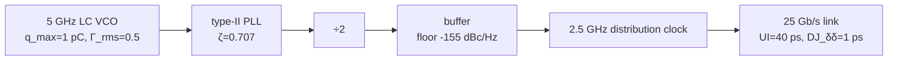

> **β**: This English translation is in beta — the Traditional-Chinese original is the authoritative version.

import NumericQuiz from "@site/src/components/NumericQuiz";

# Final Exam: A 5 GHz LC VCO into a 25 Gb/s SerDes, End to End

> **Prerequisites**: [capstone_lc_end_to_end](/03_isf_core_theory/capstone_lc_end_to_end) (the site-wide spine, end to end) and the three chapter exercise sets — [02 Foundations](/02_foundations/exercises), [03 Core Theory](/03_isf_core_theory/exercises), [06 Design Insights](/06_design_insights/exercises) (finish those first) | **Next**: none — this is the last page. Get all 10 right and you graduate.

This is not yet another problem set. It is **an exam**: one design story, 10 checkpoints,
from the instant a single charge impulse hits the LC tank all the way to the eye opening of a
SerDes link at BER $=10^{-12}$. Each question asks for exactly one "clean number", but every
number requires cross-chapter dispatch — you will need [P1]'s ISF, [P2]'s κ and the App. B
closed forms, the diffusion dictionary's wardrobe changes, the four clock-chain accounting
rules, the PLL closed-loop algebra, and the dual-Dirac extrapolation.
**Work each one out yourself and type your answer first; only then expand the solution.**

## Design scenario (shared by the whole exam)

You own the clock path of a **25 Gb/s NRZ SerDes link** (UI $=40$ ps, target BER $=10^{-12}$):



| Quantity | Value | Unit | Source |
|---|---|---|---|
| VCO carrier $f_0$ | 5 | GHz | site-wide canonical |
| $q_{max}$ | 1 | pC | Example A / Example B |
| $\Gamma_{rms}$ (representative) | 0.5 | — | Example B (a true LC gives $1/\sqrt2$) |
| White-noise source $S_i$ | $10^{-24}$ | A²/Hz | Example B |
| Measured $\mathcal{L}(1\,\text{MHz})$ | $-100$ | dBc/Hz | Example C (datasheet-grade) |
| PLL | $\zeta=0.707$, type-II 2nd order | — | [pll_noise_budget](/06_design_insights/pll_noise_budget) |
| Buffer floor | $-155$ (flat) | dBc/Hz | [clock_chain_budget](/06_design_insights/clock_chain_budget) |
| Link DJ | $\mathrm{DJ}_{\delta\delta}=1$ | ps | given in Question 10 |

> **Two-track honesty statement (read before starting)**: this exam deliberately runs two
> sets of numbers in parallel.
> **Ideal single-source-limit track** (Questions 2, 3, 7): a single white-noise source and
> [P1] Eq.(21) give $-148$ dBc/Hz — a physical floor no real circuit reaches.
> **Measured track** (Questions 5, 6, 9, 10): the datasheet-grade $-100$ dBc/Hz — 48 dB above
> the ideal limit, reflecting the reality of multiple sources, cyclostationarity, flicker, and
> the buffer chain. The two tracks **must not be mixed**; each question states which track it uses.
>
> **Convention flags (exam-wide discipline)**: all $\mathcal{L}$ are SSB dBc/Hz. Anything
> **predicted** from circuit noise is flagged with [P1] Eq.(21)'s SSB $/4$ convention (the
> time-domain $/2$ convention shifts the whole curve $+3$ dB); anything **measured**
> ($-100$ dBc/Hz) follows the site rule and is booked with the small-angle
> $\mathcal{L}=\tfrac12 S_\phi$ ($/2$). The 1/f³ corner is flagged [P2] Eq.(57) vs
> [P1] Eq.(24) (a factor-of-2 difference). Every 2 must have a first and last name — that is
> itself part of what is being examined.

---

## Act 1: Oscillator core physics (Questions 1–4)

### Question 1 — One impulse into the tank (impulse → Δφ)

The story opens: the VCO is still at schematic stage. You ask the most primitive question —
a charge impulse of $\Delta q=1$ fC sneaks in from the supply, the ISF value at the injection
instant is $\Gamma(\omega_0\tau)=0.5$ (Example A's representative value), with $q_{max}=1$ pC
and $f_0=5$ GHz. Find the permanent phase step $\Delta\phi$ and the equivalent timing error $\Delta t$.

<NumericQuiz
  prompt="Work it out first: the timing error caused by this impulse, Δt = ? (Δq = 1 fC, q_max = 1 pC, Γ = 0.5, f₀ = 5 GHz; answer in fs)"
  answer={15.9}
  tol={0.01}
  unit="fs"
  hint="Δφ = Γ·Δq/q_max = 0.5×10⁻¹⁵/10⁻¹² = 5×10⁻⁴ rad, then Δt = Δφ/(2πf₀)."
  solutionNote="Δφ = 5×10⁻⁴ rad = 0.5 mrad; Δt = 5×10⁻⁴/(2π×5×10⁹) ≈ 1.59×10⁻¹⁴ s = 15.9 fs — this is canonical Example A. See the full solution below."
/>

<details>
<summary><strong>Question 1 — full solution</strong> (impulse → Δφ → Δt)</summary>

**Step 1 (operational ISF definition, spec formula 5; derivation in [impulse_to_phase_shift](/03_isf_core_theory/impulse_to_phase_shift))**:

$$
\Delta\phi=\frac{\Gamma(\omega_0\tau)}{q_{max}}\,\Delta q=\frac{0.5\times(1\times10^{-15}\ \text{C})}{1\times10^{-12}\ \text{C}}=5\times10^{-4}\ \text{rad}=0.0286^\circ.
$$

**Step 2 (phase→time, spec formula 17)**:

$$
\Delta t=\frac{\Delta\phi}{2\pi f_0}=\frac{5\times10^{-4}}{2\pi\times5\times10^{9}}=1.59\times10^{-14}\ \text{s}=15.9\ \text{fs}.
$$

**Result**: $\Delta\phi=5\times10^{-4}$ rad, $\Delta t=15.9$ fs (canonical Example A).

**Dimension check**: $\Gamma$ dimensionless $\times$ C/C $=$ rad ✓; rad ÷ (rad/s) $=$ s ✓.

**Story note**: this 15.9 fs is a "one impulse, one-shot" displacement; the oscillator has no
phase restoring force, so it stays in the phase **permanently** (the heart of LTV, see
[lti_vs_ltv](/02_foundations/lti_vs_ltv)). The next three questions upgrade "one impulse" to
"continuous white noise".

```python
from simulations.common.isf_utils import impulse_to_phase_step
from simulations.common.noise_utils import phase_to_time_error
dphi = impulse_to_phase_step(1e-15, 0.5, qmax=1e-12)
print(dphi, round(phase_to_time_error(dphi, 5e9)*1e15, 1))  # -> 0.0005 15.9
```

</details>

### Question 2 — White noise paints a whole skirt (Eq.(21) → $\mathcal{L}$)

A single white-noise source $S_i=\overline{i_n^2}/\Delta f=10^{-24}\ \text{A}^2/\text{Hz}$
now hits the same VCO continuously ($\Gamma_{rms}=0.5$, $q_{max}=1$ pC). Use
[P1] Eq.(21), p.185 to find $\mathcal{L}(1\,\text{MHz})$.

<NumericQuiz
  prompt="Work it out first: L(1 MHz) = ? (Γ_rms = 0.5, q_max = 1 pC, S_i = 10⁻²⁴ A²/Hz, the /4 convention of [P1] Eq.(21); answer in dBc/Hz, mind the sign)"
  answer={-148.0}
  tol={0.01}
  unit="dBc/Hz"
  hint="L = 10·log₁₀[(Γ_rms²/q_max²)·S_i/(4Δω²)], Δω = 2π×10⁶, Δω² ≈ 3.95×10¹³."
  solutionNote="Bracket ≈ 1.583×10⁻¹⁵ → −148.0 dBc/Hz (canonical Example B; the time-domain /2 convention gives −145.0). See the full solution below."
/>

<details>
<summary><strong>Question 2 — full solution</strong> ([P1] Eq.(21), with the /4 vs /2 convention flag)</summary>

**Step-by-step substitution (with units)**. [P1] Eq.(21), p.185 (spec formula 12):

$$
\mathcal{L}\{\Delta\omega\}=10\log_{10}\!\left(\frac{\Gamma_{rms}^2}{q_{max}^2}\cdot\frac{\overline{i_n^2}/\Delta f}{4\,\Delta\omega^2}\right)
$$

1. $\Delta\omega=2\pi\times10^6=6.283\times10^6$ rad/s, $\Delta\omega^2=3.948\times10^{13}$.
2. $\dfrac{\Gamma_{rms}^2}{q_{max}^2}=\dfrac{0.25}{(10^{-12})^2}=2.5\times10^{23}\ \text{C}^{-2}$.
3. $\dfrac{S_i}{4\Delta\omega^2}=\dfrac{10^{-24}}{1.579\times10^{14}}=6.33\times10^{-39}$.
4. Product $=1.583\times10^{-15}$, $\mathcal{L}=10\log_{10}(1.583\times10^{-15})=-148.0$ dBc/Hz.

**Result**: $\mathcal{L}(1\,\text{MHz})=-148.0$ dBc/Hz (canonical Example B — the
**ideal single-source-limit track**).

**Convention flag**: this is [P1] Eq.(21)'s **SSB $/4$ bookkeeping**; the clean time-domain
derivation's $/2$ convention gives $-145.0$ dBc/Hz (the famous 3 dB convention dispute, see
[white_noise_to_phase_noise](/03_isf_core_theory/white_noise_to_phase_noise)). Question 3
needs the $/2$ version — remember this.

**Dimension check**: $\text{C}^{-2}\cdot\dfrac{\text{A}^2/\text{Hz}}{(\text{rad/s})^2}$
simplifies via $\text{C}=\text{A·s}$ to s (per-Hz); taking $10\log_{10}$ reads as dBc/Hz ✓.

```python
import numpy as np
dw = 2*np.pi*1e6
print(round(10*np.log10((0.5**2/1e-24)*(1e-24/(4*dw**2))), 1))  # -> -148.0
```

</details>

### Question 3 — Put on the first of the five outfits ($\mathcal{L}\to\kappa^2\to$ linewidth)

Same ideal single-source VCO. A systems colleague asks: "what is the free-running carrier
**linewidth**?" Use the reverse dictionary lookup of
[diffusion_dictionary](/03_isf_core_theory/diffusion_dictionary): first convert Question 2's
$\mathcal{L}$ back to $\kappa^2$, then to the Lorentzian 3-dB linewidth (**the v5-adjudicated
mapping**: $\Delta f_{3\mathrm{dB}}=\kappa^2/(2\pi)$, not $\kappa^2/\pi$).

<NumericQuiz
  prompt="Work it out first: the free-running Lorentzian 3-dB linewidth of this VCO, Δf₃dB = ? (invert Question 2's L to get κ², then divide by 2π; answer in mHz)"
  answer={19.9}
  tol={0.01}
  unit="mHz"
  hint="The reverse lookup takes the /2-convention number: −148 (/4) +3 dB → −145 (/2); κ² = L_lin·Δω² = 0.125 rad²/s; Δf₃dB = κ²/(2π)."
  solutionNote="κ² = 0.125 rad²/s → Δf₃dB = 0.125/(2π) = 19.9 mHz (the v5-adjudicated value; misusing D/π with D=0.125 doubles it to 40 mHz). See the full solution below."
/>

<details>
<summary><strong>Question 3 — full solution</strong> (the v5 mapping: the $\mathcal{L}\to\kappa^2\to\Delta f_{3\mathrm{dB}}$ 19.9 mHz chain)</summary>

**Step 1 (settle the convention before changing outfits)**. The reverse dictionary formula is
$\kappa^2=\mathcal{L}_{/2}\cdot\Delta\omega^2$ — it takes the **time-domain $/2$-convention**
$\mathcal{L}$. Question 2's $-148.0$ is the $/4$ convention, so add 3 dB first:

$$
\mathcal{L}_{/2}(1\,\text{MHz})=-145.0\ \text{dBc/Hz}\;\Rightarrow\;\mathcal{L}_{\text{lin}}=3.17\times10^{-15}\ \text{1/Hz}.
$$

**Step 2 (back to the protagonist $\kappa^2$)**:

$$
\kappa^2=\mathcal{L}_{/2}\cdot\Delta\omega^2=3.17\times10^{-15}\times3.948\times10^{13}=0.125\ \text{rad}^2/\text{s}.
$$

**Cross-check** (directly from the definition, [P2] Eq.(11)/(12), p.793, without going
through $\mathcal{L}$):

$$
\kappa^2=\frac{\Gamma_{rms}^2}{2\,q_{max}^2}\cdot\frac{\overline{i_n^2}}{\Delta f}=\frac{0.25}{2\times10^{-24}}\times10^{-24}=0.125\ \text{rad}^2/\text{s}\ \checkmark
$$

**Step 3 (put on outfit three: the linewidth)**. The v5-adjudicated mapping (settled by
lab_23's Monte-Carlo variance slope $0.1252$ and linewidth fit $20.0$ mHz, see outfit three in
[diffusion_dictionary](/03_isf_core_theory/diffusion_dictionary)):

$$
\Delta f_{3\mathrm{dB}}=\frac{\kappa^2}{2\pi}=\frac{0.125}{2\pi}=1.99\times10^{-2}\ \text{Hz}=19.9\ \text{mHz}.
$$

**Result**: $\kappa^2=0.125\ \text{rad}^2/\text{s}$, $\Delta f_{3\mathrm{dB}}=19.9$ mHz
(a true LC with $\Gamma_{rms}=1/\sqrt2$ gives $\kappa^2=0.25$ and a $39.8$ mHz linewidth).

**Convention flags (this question is a minefield of exactly three factor-of-2s)**:
(1) $/4\to/2$ differs by 3 dB — forget the conversion and $\kappa^2$ comes out half;
(2) the two $D$ conventions: $D_{\text{A}}=\kappa^2=0.125$ ($\mathrm{Var}=D\vert t\vert$) vs
$D_{\text{B}}=\kappa^2/2=0.0625$ ($\mathrm{Var}=2D\vert t\vert$);
(3) the linewidth formula $\Delta f_{3\mathrm{dB}}=\kappa^2/(2\pi)=D_{\text{B}}/\pi$ —
**v3 once plugged the A-value into the B-formula** and got 40 mHz (2× too large); v5 fixed it
site-wide. The 1/f² pseudo-divergence flattens into a Lorentzian for
$\Delta f\lesssim\Delta f_{3\mathrm{dB}}$, see
[lorentzian_linewidth](/03_isf_core_theory/lorentzian_linewidth).

**Dimension check**: $\text{1/Hz}\times(\text{rad/s})^2=\text{rad}^2/\text{s}$ ✓;
$\text{rad}^2/\text{s}\div2\pi=\text{Hz}$ ✓.

```python
import numpy as np
dw = 2*np.pi*1e6
kappa2 = 10**((-148.0 + 3.01)/10)*dw**2     # /4 -> /2, then reverse lookup
print(round(kappa2, 3), round(kappa2/(2*np.pi)*1e3, 1))  # -> 0.125 19.9
```

</details>

### Question 4 — Plan B: what if we used a ring? (App. B closed form → 1/f³ corner)

At the design review someone proposes: "the LC costs area — how about a 5-stage single-ended
ring?" You answer the flicker-upconversion price on the spot with the [P2] Appendix B closed
forms ([asymmetric_isf_closed_form](/03_isf_core_theory/asymmetric_isf_closed_form)):
$N=5$, $\eta=1$, waveform asymmetry ratio $A=f'_{rise}/f'_{fall}=1.5$, device 1/f corner
$f_{1/f}=1$ MHz. Find the spectral $1/f^3$ corner ([P2] Eq.(57) convention).

<NumericQuiz
  prompt="Work it out first: for a ring with N = 5, A = 1.5, η = 1, f₁/f = 1 MHz, the 1/f³ corner = ? ([P2] Eq.(57) convention; answer in kHz)"
  answer={42.86}
  tol={0.01}
  unit="kHz"
  hint="Eq.(57): f_corner = f₁/f · 3/(2ηN) · (1−A)²/(1−A+A²) = 10⁶ × 0.3 × 0.25/1.75."
  solutionNote="corner = 42.86 kHz ([P2] Eq.(57)); the [P1] Eq.(24) convention (with c₀=2Γdc) gives 85.71 kHz — exactly 2×. See the full solution below."
/>

<details>
<summary><strong>Question 4 — full solution</strong> ([P2] App. B Eq.(55)–(57), with the factor-of-2 convention flag)</summary>

**Step-by-step substitution (with units)**. [P2] Eq.(57), p.803:

$$
f_{1/f^3}=f_{1/f}\cdot\frac{3}{2\eta N}\cdot\frac{(1-A)^2}{1-A+A^2}
=10^6\ \text{Hz}\times\frac{3}{2\times1\times5}\times\frac{(-0.5)^2}{1-1.5+2.25}
=10^6\times0.3\times\frac{0.25}{1.75}=42.86\ \text{kHz}.
$$

For completeness, the intermediate quantities ([P2] Eq.(55)/(56), triple-verified by lab_33
on that page):

$$
\Gamma_{rms}^2=\frac{2\pi^2}{3\eta^3 N^3}\left[4\,\frac{1+A^3}{(1+A)^3}\right]=0.05895\;\Rightarrow\;\Gamma_{rms}=0.2428,
\qquad
c_0=2\Gamma_{dc}=2\cdot\frac{2\pi}{\eta^2N^2}\frac{1-A}{1+A}=-0.1005.
$$

**Result**: corner $=42.86$ kHz ([P2] Eq.(57) convention).

**Convention flag**: substituting $c_0=2\Gamma_{dc}$ into [P1] Eq.(24)
$\Delta\omega_{1/f^3}=\omega_{1/f}\,c_0^2/(2\Gamma_{rms}^2)$ yields **85.71 kHz — exactly
2×** (a DC-channel bookkeeping difference; each paper is internally self-consistent, and
scalings and ratios are unaffected). Always state the convention when reporting the number.

**Design read**: corner $\propto(1-A)^2/(1-A+A^2)$ and $\propto1/N$ — a 42.86 kHz close-in
$1/f^3$ would be mostly washed out by the SerDes PLL (loop BW far above 42.86 kHz), so
flicker is not the reason to veto the ring; the ring's real price is the white-noise-region
FOM ([lc_vs_ring](/06_design_insights/lc_vs_ring)). This exam keeps the LC; this question
archives Plan B quantitatively. Symmetrization ($A\to1$) sends the corner to zero
quadratically — the closed-form version of [symmetry](/06_design_insights/symmetry).

**Dimension check**: Hz $\times$ dimensionless $\times$ dimensionless $=$ Hz ✓.

```python
N, A, eta, f1f = 5, 1.5, 1.0, 1e6
print(round(f1f*3/(2*eta*N)*(1-A)**2/(1-A+A**2)/1e3, 2))  # -> 42.86
```

</details>

---

## Act 2: From the datasheet to the clock tree (Questions 5–7)

### Question 5 — Integrate the real clock's RJ ($\mathcal{L}\to\sigma_t$)

Silicon is back. The integrated VCO measures $\mathcal{L}(1\,\text{MHz})=-100$ dBc/Hz with a
$1/f^2$ slope (**measured track** — 48 dB above Question 2's ideal single-source limit: the
reality of multiple sources, cyclostationarity, flicker, and the buffer chain).
Integration band 1–100 MHz. Find the rms jitter $\sigma_t$.

<NumericQuiz
  prompt="Work it out first: L(1 MHz) = −100 dBc/Hz, 1/f² slope, integrated 1→100 MHz, f₀ = 5 GHz — rms jitter σ_t = ? (answer in fs)"
  answer={447.9}
  tol={0.01}
  unit="fs"
  hint="S_φ = 2×10^(L/10); the 1/f² closed form σ_φ² = S_φ(f_ref)·f_ref²·(1/f₁ − 1/f₂); then σ_t = σ_φ/(2πf₀)."
  solutionNote="σ_φ² = 1.98×10⁻⁴ rad² → σ_φ = 14.07 mrad → σ_t = 447.9 fs (canonical Example C; lab_08, numeric = analytic). See the full solution below."
/>

<details>
<summary><strong>Question 5 — full solution</strong> (jitter integration, canonical Example C)</summary>

**Step-by-step substitution (with units; the full four-step chain of
[lab_08](/04_simulation_labs/lab_08_jitter_integration))**:

$$
\begin{aligned}
S_\phi(1\,\text{MHz})&=2\times10^{-100/10}=2\times10^{-10}\ \text{rad}^2/\text{Hz}
\quad(\mathcal{L}\approx\tfrac12 S_\phi\text{，小角 SSB 慣例，規範公式 16}),\\[2pt]
\sigma_\phi^2&=S_\phi(f_{ref})\,f_{ref}^2\left(\frac{1}{f_1}-\frac{1}{f_2}\right)
=2\times10^{-10}\times(10^6)^2\times(10^{-6}-10^{-8})=1.98\times10^{-4}\ \text{rad}^2,\\[2pt]
\sigma_\phi&=1.407\times10^{-2}\ \text{rad}=14.07\ \text{mrad},\\[2pt]
\sigma_t&=\frac{\sigma_\phi}{2\pi f_0}=\frac{1.407\times10^{-2}}{2\pi\times5\times10^9}=4.479\times10^{-13}\ \text{s}=447.9\ \text{fs}.
\end{aligned}
$$

**Result**: $\sigma_\phi=14.07$ mrad, $\sigma_t=447.9$ fs (canonical Example C).

**Convention flag**: $-100$ is a **measured** SSB number; per the site rule it is restored to
$S_\phi$ with $\mathcal{L}=\tfrac12S_\phi$ ($/2$) — measured values never involve the $/4$
(that only enters when **predicting** from circuit noise, Questions 2/3).

**Feel**: the $1/f^2$ integral is **dominated by the lower limit** (the $1/f_1$ term carries
99%); "where the integration starts" is set by the PLL loop BW — the setup for Question 8.
**Dimension check**: $\text{rad}^2/\text{Hz}\times\text{Hz}=\text{rad}^2$ ✓;
rad ÷ (rad/s) $=$ s ✓.

```python
import numpy as np
from simulations.common.noise_utils import integrate_rms_jitter
f = np.logspace(6, 8, 4000)
st, sp = integrate_rms_jitter(f, -100.0 - 20*np.log10(f/1e6), 5e9, 1e6, 100e6)
print(round(sp*1e3, 2), round(st*1e15, 1))   # -> 14.07 447.9
```

</details>

### Question 6 — The same clock's period jitter (jitter-kernel closed form)

Your digital colleague only cares about adjacent edges: "what is the single-period period
jitter?" Use the white-FM closed form of [jitter_kernels](/02_foundations/jitter_kernels):
first invert the measured skirt to $\kappa^2$ (the reverse of dictionary outfit four), then
apply $\sigma_P(1)=\kappa\sqrt{T}/\omega_0$.

<NumericQuiz
  prompt="Work it out first: for the measured −100 dBc/Hz@1 MHz (1/f² region) 5 GHz clock, the white-FM closed-form single-period period jitter σ_P(1) = ? (answer in fs)"
  answer={28.3}
  tol={0.02}
  unit="fs"
  hint="κ² = 10^(−100/10)×(2π×10⁶)² ≈ 3.95×10³ rad²/s; σ_P(1) = √(κ²·T)/(2πf₀), T = 200 ps."
  solutionNote="σ_ΔΦ(1T) = √(3948×2×10⁻¹⁰) = 8.89×10⁻⁴ rad → σ_P(1) = 28.28 fs ≈ 28.3 fs (the jitter_kernels closed form; Example C3's 27.6 fs is the same formula truncated to the 10³–10¹⁰ Hz band). See the full solution below."
/>

<details>
<summary><strong>Question 6 — full solution</strong> (the $4\sin^2$ kernel closed form: $\sigma_{\Delta\phi}^2(N)=\kappa^2NT$)</summary>

**Step 1 (invert the skirt to $\kappa^2$)**. In the $1/f^2$ region, time-domain $/2$
convention (the measured value plugs in directly):

$$
\kappa^2=\mathcal{L}_{\text{lin}}(\Delta f)\cdot\Delta\omega^2=10^{-10}\times(2\pi\times10^6)^2=3.95\times10^{3}\ \text{rad}^2/\text{s}.
$$

(This is exactly the "$-100$ dBc/Hz anchor" row of
[diffusion_dictionary](/03_isf_core_theory/diffusion_dictionary): $\kappa^2=3.95\times10^3$,
linewidth 628 Hz, $\kappa_t=2.0\times10^{-9}\sqrt{\text{s}}$.)

**Step 2 (the white-FM closed form)**. [jitter_kernels](/02_foundations/jitter_kernels)
Step 4: substituting $S_\phi=2\kappa^2/(2\pi f)^2$ into the first-difference kernel
$4\sin^2(\pi fNT)$, the integral gives **exactly**
$\sigma_{\Delta\phi}^2(N)=\kappa^2NT$ (precisely [P2] Eq.(8)'s $\kappa\sqrt{\Delta t}$, not a
single coefficient off). Take $N=1$, $T=1/f_0=200$ ps:

$$
\sigma_{\Delta\phi}(1T)=\sqrt{3947.8\times2\times10^{-10}}=8.886\times10^{-4}\ \text{rad},
\qquad
\sigma_P(1)=\frac{\sigma_{\Delta\phi}}{2\pi f_0}=\frac{8.886\times10^{-4}}{3.142\times10^{10}}=28.28\ \text{fs}.
$$

**Result**: $\sigma_P(1)\approx28.3$ fs ($1.4\times10^{-4}$ of a period).

**Convention flags (two)**: (1) the inversion formula takes the $/2$-convention
$\mathcal{L}$ — measured values plug in as-is; plugging in a $/4$-convention predicted value
here would come out $\sqrt2$ low. (2) The kernel prefactor under the
"**single-sided $S_\phi$, $\int_0^\infty$**" convention is $1/\omega_0^2$ (not
$2/\omega_0^2$ — that 2 belongs to double-sided-spectrum bookkeeping; adjudicated by the
jitter_kernels Step 0 table plus Monte-Carlo). worked_examples Example C3's 27.6 fs is this
same formula truncated to the $10^3$–$10^{10}$ Hz band — one physics.

**Against Question 5**: same clock — accumulated jitter (TIE, 1–100 MHz band) 447.9 fs vs
single-period 28.3 fs. TIE eats the low frequencies; the period kernel is a first-order
high-pass that suppresses close-in. Both numbers are right; they measure different things
([psd_phase_noise_jitter](/02_foundations/psd_phase_noise_jitter)).

**Dimension check**: $\text{rad}^2/\text{s}\times\text{s}=\text{rad}^2$ ✓;
rad ÷ (rad/s) $=$ s ✓.

```python
import numpy as np
kappa2 = 10**(-100/10)*(2*np.pi*1e6)**2
print(round(kappa2, 1), round(np.sqrt(kappa2/5e9)/(2*np.pi*5e9)*1e15, 2))
# -> 3947.8 28.28
```

</details>

### Question 7 — ÷2 to 2.5 GHz, through a buffer: when does the floor take over?

The clock tree: 5 GHz through an ideal ÷2 to 2.5 GHz, then one output buffer with a flat
$-155$ dBc/Hz floor. Look at **10 MHz offset** (PLL out-of-band, where the free-running VCO
skirt rules). Use the **ideal single-source-limit track**: extrapolate the VCO skirt from
Question 2's $-148$ dBc/Hz @ 1 MHz anchor at $1/f^2$. Find the buffer output's
$\mathcal{L}(10\,\text{MHz})$.

<NumericQuiz
  prompt="Work it out first: VCO skirt −148 dBc/Hz@1 MHz (1/f²) extrapolated to 10 MHz, ideal ÷2, then power-summed with the −155 dBc/Hz buffer floor — L(10 MHz) = ? (answer in dBc/Hz, mind the sign)"
  answer={-154.95}
  tol={0.001}
  unit="dBc/Hz"
  hint="Three steps: −148 − 20log₁₀(10) = −168; ÷2 is another −6.02 → −174.02; then 10log₁₀(10^(−174.02/10)+10^(−155/10)) with the −155 floor."
  solutionNote="The signal sits 19 dB below the floor → the floor takes over: output ≈ −154.95 dBc/Hz, clamped at the buffer floor. See the full solution below."
/>

<details>
<summary><strong>Question 7 — full solution</strong> (clock_chain rules 2 + 4: ÷N and the additive floor)</summary>

**Step 1 ($1/f^2$ extrapolation)**:

$$
\mathcal{L}_{vco}(10\,\text{MHz})=-148-20\log_{10}\!\frac{10\,\text{MHz}}{1\,\text{MHz}}=-168.00\ \text{dBc/Hz}.
$$

**Step 2 (rule 2: an ideal ÷2 is edge-picking, $\phi_{out}=\phi_{in}/2$)**:

$$
\mathcal{L}(10\,\text{MHz})\big|_{2.5\,\text{GHz}}=-168.00-20\log_{10}2=-174.02\ \text{dBc/Hz}.
$$

**Step 3 (rule 4: the buffer floor is uncorrelated with the input — powers add, never dB)**:

$$
\mathcal{L}_{out}=10\log_{10}\!\big(10^{-174.02/10}+10^{-155/10}\big)=-154.95\ \text{dBc/Hz}.
$$

**Result**: $-154.95$ dBc/Hz — the signal is 19 dB below the floor, so the **floor takes
over** and the output is clamped at the buffer floor. However clean the source, one noisy
buffer ruins it: those 19 dB of margin are voided outright — the core lesson of
[clock_chain_budget](/06_design_insights/clock_chain_budget) (same numbers as that page's
worked chain: $-168\to-174.02\to-154.95$).

**Convention flag**: $\pm20\log_{10}N$ and power addition are **ratio/additive operations**;
the $/2$ vs $/4$ convention cancels between input and output — the only convention-sensitive
item is the anchor itself ($-148$ = [P1] Eq.(21)'s $/4$; the $/2$ bookkeeping shifts the whole
curve $+3$ dB, and the conclusion "floor takes over" stands, output still $\approx-154.9$).
Also note the conserved quantity: an ideal ÷2 improves $\mathcal{L}$ by 6.02 dB, but the
**$\sigma_t$ in seconds does not change by a single fs** (needed in Question 9).

**Dimension check**: all dB operations act on dimensionless power ratios ✓.

```python
import numpy as np
L_div = (-148.0 - 20*np.log10(10)) - 20*np.log10(2)
print(round(L_div, 2))                                            # -> -174.02
print(round(10*np.log10(10**(L_div/10) + 10**(-155.0/10)), 2))    # -> -154.95
```

</details>

---

## Act 3: Loop and link (Questions 8–10)

### Question 8 — The PLL's peaking tax (type-II peaking closed form)

The VCO goes into a type-II second-order PLL ($\zeta=0.707$). The system spec asks: what is
the jitter-transfer **peaking** (how far the peak exceeds 0 dB)? Use the closed form from
[pll_noise_budget](/06_design_insights/pll_noise_budget).

<NumericQuiz
  prompt="Work it out first: type-II second-order PLL, ζ = 0.707 — the |H_lp|² peaking = ? (answer in dB)"
  answer={2.09}
  tol={0.01}
  unit="dB"
  hint="Closed form: s = √(1+8ζ²), |H_lp|²_max = (s+1)²/[(s−1)(s+3)]; at ζ = 1/√2, s = √5 and the peak is exactly the golden ratio φ = 1.618."
  solutionNote="peaking = 10log₁₀(1.618) = 2.09 dB, located at f_pk = 0.786 f_n. Cascade 20 stages and it is 41.8 dB — why telecom specs cap 0.1 dB/stage. See the full solution below."
/>

<details>
<summary><strong>Question 8 — full solution</strong> (peaking closed form: $\zeta=0.707\to2.09$ dB @ $0.786f_n$)</summary>

**Closed form (the result of that page's supplementary derivation, self-contained algebra)**.
Let $s=\sqrt{1+8\zeta^2}$:

$$
\lvert H_{lp}\rvert^2_{max}=\frac{(s+1)^2}{(s-1)(s+3)},\qquad f_{pk}=f_n\sqrt{\frac{2}{s+1}}.
$$

**Step-by-step substitution** ($\zeta=1/\sqrt2$, $\zeta^2=\tfrac12$): $s=\sqrt{1+4}=\sqrt5=2.236$,

$$
\lvert H_{lp}\rvert^2_{max}=\frac{(\sqrt5+1)^2}{(\sqrt5-1)(\sqrt5+3)}=\frac{\sqrt5+1}{2}=\varphi=1.618,
\qquad
f_{pk}=f_n\sqrt{\frac{2}{\sqrt5+1}}=0.786\,f_n.
$$

$$
\text{peaking}=10\log_{10}1.618=2.09\ \text{dB}.
$$

(The peak is exactly the **golden ratio** — that page's easter egg; a 4-million-point fine
sweep of `pll_utils.H_lowpass_mag2` numerically gives the same $0.7862/2.0903$ dB.)

**Result**: peaking $=2.09$ dB @ $f_{pk}=0.786f_n$ (phase margin $65.5^\circ$).

**Convention flag**: this is a power transfer's $10\log_{10}$ (numerically equal to the
magnitude's $20\log_{10}$) — **no** SSB $/2$, $/4$ business here (that only appears in the
$S_\phi\leftrightarrow\mathcal{L}$ conversion). A type-II loop with a zero **must** peak
(the derivative at DC is always positive): it is the price of stability, not a design error;
cascading $M$ stages adds the dB directly — 20 regenerators make $41.8$ dB, which is why
telecom specs cap per-stage peaking at 0.1 dB (requiring $\zeta\approx4.32$). For this exam:
reference/in-band noise near $f_{pk}$ pays an extra 2.09 dB tax — do not miss it in the
jitter budget.

**Dimension check**: $\zeta,s,x$ all dimensionless; $f_{pk}=f_n\times$dimensionless $=$ Hz ✓.

```python
import numpy as np
s = np.sqrt(1 + 8*0.707**2)
print(round(np.sqrt(2/(s+1)), 4), round(10*np.log10((s+1)**2/((s-1)*(s+3))), 2))
# -> 0.7862 2.09
```

</details>

### Question 9 — Sample with this 2.5 GHz clock: how many bits is it worth? (aperture SNR)

The RX-side monitor ADC samples a full-scale 2.5 GHz calibration tone with the final 2.5 GHz
clock. Clock RJ on the measured track: Question 5's $\sigma_t=447.9$ fs — an ideal ÷2 **does
not change $\sigma_t$ in seconds** (Question 7's conserved quantity; the buffer floor adds
about 16 fs in the same band, $+0.06\%$ after RSS, negligible). Find the jitter-limited SNR.

<NumericQuiz
  prompt="Work it out first: a clock with σ_t = 447.9 fs samples a full-scale f_in = 2.5 GHz sine — SNR_jitter = ? (answer in dB)"
  answer={43.05}
  tol={0.01}
  unit="dB"
  hint="SNR = −20log₁₀(2π·f_in·σ_t); 2π×2.5×10⁹×4.479×10⁻¹³ = 7.04×10⁻³ rad."
  solutionNote="SNR = −20log₁₀(7.036×10⁻³) = 43.05 dB → ENOB = (43.05−1.76)/6.02 = 6.86 bit (the 2.5 GHz row of the adc_aperture_jitter design table). See the full solution below."
/>

<details>
<summary><strong>Question 9 — full solution</strong> (aperture SNR and ENOB)</summary>

**Step-by-step substitution (with units; derivation in
[adc_aperture_jitter](/06_design_insights/adc_aperture_jitter))**. Sampling error $=$ slope
$\times$ timing error; after mean-squaring over sampling phase and jitter the two $\tfrac12$s
cancel:

$$
\sigma_{\phi,in}=2\pi f_{in}\,\sigma_t=2\pi\times2.5\times10^9\ \text{Hz}\times4.479\times10^{-13}\ \text{s}=7.036\times10^{-3}\ \text{rad},
$$

$$
\text{SNR}_{jitter}=-20\log_{10}\!\big(2\pi f_{in}\sigma_t\big)=-20\log_{10}(7.036\times10^{-3})=43.05\ \text{dB},
$$

$$
\text{ENOB}=\frac{43.05-1.76}{6.02}=6.86\ \text{bit}.
$$

**Result**: SNR $=43.05$ dB, ENOB $=6.86$ bit — word-for-word the 2.5 GHz row of the
[adc_aperture_jitter](/06_design_insights/adc_aperture_jitter) design table. Buying a 12-bit
ADC would not help: the high-frequency SNR is pinned by the clock.

**Convention flag**: the formula itself is **independent** of SSB/DSB or any $\mathcal{L}$
convention (the $\tfrac12$ in $P_{sig}$ cancels the $\tfrac12$ from
$\langle\cos^2\rangle$); the convention hides upstream in $\sigma_t$ — 447.9 fs was
integrated from a measured $\mathcal{L}$ via the $/2$ small-angle conversion (Question 5);
keep the chain consistent and there is no ambiguity.

**Using the conserved quantity**: $\sigma_t$ (seconds) is invariant through an ideal ÷2
([clock_chain_budget](/06_design_insights/clock_chain_budget), Step 5) — ÷2 saves dB of
$\mathcal{L}$, not fs; so the 2.5 GHz clock inherits 447.9 fs directly.
Honesty note: with the buffer floor, $\sqrt{447.9^2+16.0^2}=448.2$ fs ($+0.06\%$) — ignored
in this question.

**Dimension check**: Hz $\times$ s $\times2\pi=$ rad (dimensionless) ✓ — a legal log
argument; dB and bit dimensionless ✓.

```python
import numpy as np
snr = -20*np.log10(2*np.pi*2.5e9*447.9e-15)
print(round(snr, 2), round((snr - 1.76)/6.02, 2))   # -> 43.05 6.86
```

</details>

### Question 10 — Final boss: how much eye is left? (dual-Dirac TJ@$10^{-12}$)

Closing out the link. 25 Gb/s (UI $=40$ ps), measured decomposition gives
$\mathrm{DJ}_{\delta\delta}=1$ ps; RJ is the measured-track clock's $\sigma_t=447.9$ fs.
Use the dual-Dirac extrapolation ([dj_dual_dirac](/06_design_insights/dj_dual_dirac)) to find
the total jitter at BER $=10^{-12}$.

<NumericQuiz
  prompt="Work it out first: DJ_δδ = 1 ps, RJ σ = 447.9 fs — the dual-Dirac extrapolated TJ@BER=10⁻¹² = ? (per-Gaussian convention Q⁻¹ = 7.034; answer in ps)"
  answer={7.3}
  tol={0.01}
  unit="ps"
  hint="TJ = DJ_δδ + 2·Q⁻¹(10⁻¹²)·σ = 1 ps + 14.07×0.4479 ps."
  solutionNote="TJ = 1 + 6.30 = 7.30 ps; eye opening = 40 − 7.30 = 32.7 ps = 0.82 UI. See the full solution below — congratulations on making it all the way."
/>

<details>
<summary><strong>Question 10 — full solution</strong> (dual-Dirac extrapolation and the eye budget)</summary>

**Step-by-step substitution (with units)**. The dual-Dirac extrapolation formula (deep tail
dominated by a single Gaussian):

$$
\mathrm{TJ}(\mathrm{BER})=\mathrm{DJ}_{\delta\delta}+2\,Q^{-1}(\mathrm{BER})\,\sigma,
\qquad Q^{-1}(10^{-12})=7.034\ (\text{本站記 }7.03).
$$

$$
\mathrm{TJ}=1\ \text{ps}+2\times7.034\times0.4479\ \text{ps}=1\ \text{ps}+6.30\ \text{ps}=7.30\ \text{ps}.
$$

$$
\text{eye 開度}=UI-\mathrm{TJ}=40-7.30=32.7\ \text{ps}=0.82\ UI.
$$

**Result**: TJ@$10^{-12}=7.30$ ps, eye opening $32.7$ ps ($0.82\,UI$) — the RJ term 6.30 ps
matches [serdes_clocking_connection](/06_design_insights/serdes_clocking_connection)'s
"448 fs → RJ eats $6.3$ ps" ✓. This 25 Gb/s link's clock budget passes.

**Convention flag**: $Q^{-1}(10^{-12})=7.034$ is the **industry per-Gaussian convention**
(each Gaussian's tail $=$ BER); rigorously booking the Dirac weight ½ and the transition
density ½ gives the $Q=4\times\mathrm{BER}$ convention ($Q^{-1}=6.839$), about
$0.2\sigma$/side of difference — settle the convention before comparing instrument reports
(the Step 6 audit table of [dj_dual_dirac](/06_design_insights/dj_dual_dirac)). Also remember
$\mathrm{DJ}_{\delta\delta}\le\mathrm{DJ}_{pp}$: the model parameter is deliberately
under-reported precisely so the extrapolation is accurate — do not stuff $\mathrm{DJ}_{pp}$
into this formula.

**Dimension check**: $[\text{s}]+[\text{dimensionless}]\times[\text{s}]=[\text{s}]$ ✓.

**Closing the loop on the whole exam**: Question 1's single 1 fC impulse (15.9 fs) →
Questions 2–3's white-noise skirt and linewidth → Question 5's integration into a 447.9 fs
RJ → Question 7's clock-tree accounting → Question 10 settles the bill on the eye.
**Where one charge goes is where a SerDes link's margin goes.**

```python
import numpy as np
from scipy.special import erfcinv
qinv = float(np.sqrt(2)*erfcinv(2*1e-12))
tj = 1e-12 + 2*qinv*447.9e-15
print(round(qinv, 3), round(tj*1e12, 2))   # -> 7.034 7.3
```

</details>

---

## Graduation check: Python appendix (recompute all 10 questions in one run)

Run from the project root with `PYTHONPATH=.`; every `# ->` is actual printed output,
matching each solution word for word.

```python
import numpy as np
from scipy.special import erfcinv
from simulations.common.isf_utils import impulse_to_phase_step
from simulations.common.noise_utils import phase_to_time_error, integrate_rms_jitter
from simulations.common.pll_utils import H_lowpass_mag2

f0, qmax, grms, Si = 5e9, 1e-12, 0.5, 1e-24
dw = 2*np.pi*1e6                                   # 1 MHz offset [rad/s]

# --- Q1: impulse -> Delta_phi -> Delta_t (Example A)
dphi = impulse_to_phase_step(1e-15, 0.5, qmax=qmax)
print(dphi, round(phase_to_time_error(dphi, f0)*1e15, 1))   # -> 0.0005 15.9

# --- Q2: [P1] Eq.(21) (SSB /4 convention)
L4 = 10*np.log10((grms**2/qmax**2)*(Si/(4*dw**2)))
print(round(L4, 1))                                # -> -148.0

# --- Q3: /4 -> /2 -> kappa^2 -> Lorentzian linewidth
L2_lin = 10**((L4 + 3.01)/10)                      # back to /2 convention (+3.01 dB)
kappa2 = L2_lin*dw**2                              # reverse lookup kappa^2 = L_/2 * dw^2
print(round(kappa2, 3), round(grms**2*Si/(2*qmax**2), 3))   # -> 0.125 0.125
print(round(kappa2/(2*np.pi)*1e3, 1))              # -> 19.9  (mHz)

# --- Q4: [P2] App.B Eq.(55)-(57), N=5, A=1.5, eta=1, f_1/f=1 MHz
N, A, eta, f1f = 5, 1.5, 1.0, 1e6
corner = f1f*3/(2*eta*N)*(1-A)**2/(1-A+A**2)
print(round(corner/1e3, 2), round(2*corner/1e3, 2))  # -> 42.86 85.71 ([P2]; [P1] convention)

# --- Q5: measured -100 dBc/Hz@1MHz, 1/f^2, integrated 1-100 MHz
f = np.logspace(6, 8, 4000)
sigma_t, sigma_phi = integrate_rms_jitter(f, -100.0 - 20*np.log10(f/1e6), f0, 1e6, 100e6)
print(round(sigma_phi*1e3, 2), round(sigma_t*1e15, 1))      # -> 14.07 447.9

# --- Q6: the same measured clock's period jitter (jitter_kernels closed form)
kappa2_m = 10**(-100/10)*dw**2                     # measured SSB = /2 convention
print(round(kappa2_m, 1))                          # -> 3947.8  (rad^2/s)
print(round(np.sqrt(kappa2_m/f0)/(2*np.pi*f0)*1e15, 2))     # -> 28.28  (fs)

# --- Q7: ideal skirt /2 to 2.5 GHz + buffer floor (10 MHz offset)
L_div = (-148.0 - 20*np.log10(10)) - 20*np.log10(2)
print(round(L_div, 2))                             # -> -174.02
print(round(10*np.log10(10**(L_div/10) + 10**(-155.0/10)), 2))  # -> -154.95

# --- Q8: type-II peaking closed form vs pll_utils numeric
s = np.sqrt(1 + 8*0.707**2)
print(round(np.sqrt(2/(s+1)), 4), round(10*np.log10((s+1)**2/((s-1)*(s+3))), 2))
# -> 0.7862 2.09
x = np.linspace(0.001, 5, 400001)
m2 = H_lowpass_mag2(x, 1.0, 0.707)
print(round(10*np.log10(np.max(m2)), 2))           # -> 2.09

# --- Q9: aperture SNR (sigma_t conserved through the ideal /2)
st = 447.9e-15
snr = -20*np.log10(2*np.pi*2.5e9*st)
print(round(snr, 2), round((snr - 1.76)/6.02, 2))  # -> 43.05 6.86

# --- Q10: dual-Dirac TJ@1e-12 (per-Gaussian convention), UI = 40 ps
qinv = float(np.sqrt(2)*erfcinv(2*1e-12))
tj = 1e-12 + 2*qinv*st
print(round(qinv, 3), round(tj*1e12, 2))           # -> 7.034 7.3
print(round((40e-12 - tj)*1e12, 1), round((40e-12 - tj)/40e-12, 2))  # -> 32.7 0.82
```

## Key takeaways (10 numbers to carry with you)

| Q | Tested skill | Answer | Convention flag |
|---|---|---|---|
| 1 | impulse→$\Delta\phi$→$\Delta t$ | $5\times10^{-4}$ rad, 15.9 fs | — |
| 2 | [P1] Eq.(21) white-noise $\mathcal{L}$ | $-148.0$ dBc/Hz | SSB $/4$ ($/2$ gives $-145.0$) |
| 3 | $\mathcal{L}\to\kappa^2\to$ linewidth | $\kappa^2=0.125$ rad²/s, 19.9 mHz | lookup takes $/2$; $\Delta f_{3\mathrm{dB}}=\kappa^2/2\pi$ (v5) |
| 4 | App. B 1/f³ corner | 42.86 kHz | [P2] Eq.(57); [P1] Eq.(24) $=2\times=85.71$ kHz |
| 5 | jitter integration 1–100 MHz | 14.07 mrad, 447.9 fs | measured SSB uses $\mathcal{L}=\tfrac12S_\phi$ |
| 6 | period-jitter closed form | 28.3 fs | single-sided $S_\phi$ kernel prefactor $1/\omega_0^2$ |
| 7 | ÷2 + buffer floor | $-154.95$ dBc/Hz | rules are ratio operations, conventions cancel; floor takes over |
| 8 | type-II peaking | 2.09 dB @ $0.786f_n$ | $10\log_{10}$ of power, no SSB business |
| 9 | aperture SNR @ 2.5 GHz | 43.05 dB (6.86 bit) | formula convention-free; $\sigma_t$ conserved through ÷2 |
| 10 | dual-Dirac TJ@$10^{-12}$ | 7.30 ps (eye 0.82 UI) | per-Gaussian $Q^{-1}=7.034$ |

All 10 correct — congratulations, you graduate. You can now account for a single charge
impulse all the way to a SerDes link's eye margin.

## Further reading (the deep-dive page for each question)

- Q1: [impulse_to_phase_shift](/03_isf_core_theory/impulse_to_phase_shift)
- Q2: [white_noise_to_phase_noise](/03_isf_core_theory/white_noise_to_phase_noise)
- Q3: [diffusion_dictionary](/03_isf_core_theory/diffusion_dictionary), [lorentzian_linewidth](/03_isf_core_theory/lorentzian_linewidth)
- Q4: [asymmetric_isf_closed_form](/03_isf_core_theory/asymmetric_isf_closed_form), [symmetry](/06_design_insights/symmetry)
- Q5: [lab_08_jitter_integration](/04_simulation_labs/lab_08_jitter_integration)
- Q6: [jitter_kernels](/02_foundations/jitter_kernels)
- Q7: [clock_chain_budget](/06_design_insights/clock_chain_budget)
- Q8: [pll_noise_budget](/06_design_insights/pll_noise_budget)
- Q9: [adc_aperture_jitter](/06_design_insights/adc_aperture_jitter)
- Q10: [dj_dual_dirac](/06_design_insights/dj_dual_dirac), [serdes_clocking_connection](/06_design_insights/serdes_clocking_connection)
- The fully rigorous spine: [capstone_lc_end_to_end](/03_isf_core_theory/capstone_lc_end_to_end)
