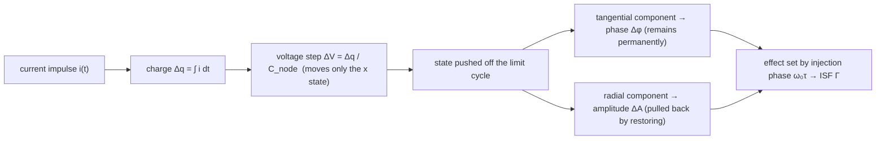

# Lab 01 — Sinusoidal Oscillator and the Phase/Amplitude Geometry of the Limit Cycle

> **β**: This English translation is in beta — the Traditional-Chinese original is the authoritative version.

This is the first lab of the entire ISF (Impulse Sensitivity Function — the oscillator's "phase-sensitivity" weight toward noise) story. We deliberately **touch no constants in any formula** yet; with a single 2-D picture we build a geometric intuition that will stay with you for life: the oscillator's state circles a closed trajectory (the **limit cycle**); when a perturbation pushes the state point away, the part **along the cycle (tangential)** becomes phase and the part **off the cycle (radial)** becomes amplitude; and **phase has no restoring force while amplitude does** — this is the root of "why phase noise accumulates permanently".

> **Physical intuition (conclusion first)**: picture the oscillation as a bead circling a track at constant speed. Push it from the **side** (tangentially) → its position along the track (the phase) is permanently displaced; no force whatsoever pushes it back to its original schedule. Push it **inward from the outside** (radially) → the track radius (the amplitude) changes, but the oscillator's AGC / device nonlinearity slowly pulls the radius back to steady state. So **only the tangential part** becomes a permanent phase error. The same impulse, injected at different phases of the waveform, splits between tangential and radial in different proportions — this is exactly what the ISF $\Gamma(\omega_0\tau)$ describes.

## 1. Learning goals

- See the **limit cycle** in the 2-D state space, and distinguish the geometric directions of the two perturbations: **phase (tangential)** and **amplitude (radial)**.
- Understand that amplitude perturbations are pulled back to the limit cycle by a restoring mechanism, while phase perturbations **remain permanently**.
- See why a current impulse of the **same size** changes almost only the amplitude when injected at the **peak** ($\Gamma\approx0$) and almost only the phase at the **zero crossing** ($|\Gamma|$ maximal) — the most direct evidence that the ISF is **time-variant (LTV)** rather than **time-invariant (LTI)**.
- Lay the geometric groundwork for $\Gamma(\theta)=-\sin\theta$ in [lab_02](/04_simulation_labs/lab_02_lc_oscillator_toy_model) and the derivation in [impulse_to_phase_shift](/03_isf_core_theory/impulse_to_phase_shift).

## 2. Mathematical model

We use a normalized (dimensionless) 2-D oscillator state model. The state is $z=(x,y)$, where you may think of $x$ as the capacitor voltage and $y$ as (proportional to) the inductor current:

$$
\begin{aligned}
\frac{dx}{dt}&=-\omega_0\,y+\mu\,(1-r^2)\,x,\\
\frac{dy}{dt}&=\;\;\omega_0\,x+\mu\,(1-r^2)\,y,\qquad r^2=x^2+y^2.
\end{aligned}
$$

- **The first term, the $\pm\omega_0$ coupling**: pure rotation. With $\mu=0$ this is the **ideal lossless LC**: the state circles the unit circle at constant angular velocity $\omega_0$, with the amplitude marginally stable (neither growing nor decaying), corresponding to $V(t)=\cos\omega_0 t$.
- **The second term, $\mu(1-r^2)z$**: a **Van der Pol-style amplitude restoration**. For $r>1$ (pushed outside the circle) it pulls inward; for $r<1$ (pushed inside) it pushes outward — dragging the trajectory **back to the $r=1$ limit cycle**. It models the AGC / device nonlinearity every real oscillator must have (without it, the amplitude would diverge or decay).
- **Dimension check**: the equations are normalized — $x,y,r$ are all dimensionless, $\omega_0,\mu$ carry rad/s, and both sides are "dimensionless ÷ seconds" ✓.

**How a perturbation enters**: a current impulse injected into the capacitor node deposits charge $\Delta q=\int i\,dt$, producing an instantaneous voltage step $\Delta V=\Delta q/C_{node}$ ([P1] Eq.(9), p.182):

$$
\Delta V=\frac{\Delta q}{C_{node}}.
$$

In normalized units ($A=1$, $q_{max}=C_{node}\cdot A=C_{node}$), this is a step $\Delta x=\Delta q/q_{max}$ added to the $x$ state. Note that it **moves only the capacitor voltage $x$, not the inductor current $y$** (an inductor current cannot change instantaneously), so in the state space it is a **horizontal jump along the $x$ axis** — Step 2 of
[impulse_to_phase_shift](/03_isf_core_theory/impulse_to_phase_shift) covers this in more detail.

> **Toy-model statement**: this is a pedagogical toy model, **not transistor-level**. It faithfully reproduces the **mechanisms** — the phase/amplitude decomposition and the absence of a phase restoring force — but it produces no noise numbers of any real circuit.

## 3. Block diagram



## 4. Core Python code

The following is excerpted from the actual script (checked against `simulations/lab_01_sinusoidal_oscillator.py`).
`fig_limit_cycle` starts integrating from a point **off the cycle, $(x_0,y_0)=(1.7,0)$**, so you can watch the trajectory relax back to the limit cycle; two arrows then mark the tangential (phase) and radial (amplitude) directions:

```python
from oscillator_models import simulate_lc, sinusoidal_oscillator

def fig_limit_cycle():
    f0 = 1.0          # normalized
    fs = 4000.0
    # start from an off-cycle point: the trajectory relaxes back to the unit-circle limit cycle (mu=0.6 provides amplitude restoration)
    t, x, y = simulate_lc(f0, t_end=3.0, fs=fs, mu=0.6, x0=1.7, y0=0.0)

    # operating point chosen at theta = pi/4
    p = np.array([np.cos(np.pi / 4), np.sin(np.pi / 4)])
    tang = np.array([-p[1], p[0]]) * 0.45   # tangential (phase) direction: perpendicular to the radius
    rad  = p * 0.45                          # radial (amplitude) direction: along the radius
    # tang part -> permanent phase Δφ ; rad part -> amplitude ΔA, pulled back
```

The second figure marks equal-size impulses at the peak ($\theta=0$) and at the zero crossing ($\theta=\pi/2$, i.e. $t=0.25T$), highlighting that "the injection phase determines the effect":

```python
def fig_impulse_markers():
    f0, fs = 1.0, 4000.0
    t = np.arange(int(2.0 * fs)) / fs
    v = sinusoidal_oscillator(t, f0, amp=1.0)   # V(t)=cos(2*pi*f0*t)

    t_peak = 0.0          # peak theta=0  -> amplitude only (Gamma ~ 0)
    t_zc   = 0.25 / f0    # zero crossing theta=pi/2 -> phase only (|Gamma| max)
```

The underlying state integration (RK4) and impulse injection live inside `simulate_lc()`; injection is
`xi += impulse_dx`, i.e. adding a step of $\Delta q/q_{max}$ to the $x$ state.

## 5. Full script path

`simulations/lab_01_sinusoidal_oscillator.py`
(depends on `simulate_lc` and `sinusoidal_oscillator` from `simulations/common/oscillator_models.py`,
and `savefig` from `simulations/common/plot_utils.py`.)

To run: `python scripts/run_all_sims.py` (generates all site figures into `static/figures/`),
or standalone: `python simulations/lab_01_sinusoidal_oscillator.py`.

## 6. Parameter table

| Parameter | Code variable | Value | Meaning |
|---|---|---|---|
| Oscillation frequency | `f0` | 1.0 (normalized) | this lab looks only at shape, so dimensionless frequency |
| Sampling rate | `fs` | 4000 | 4000 points per period, smooth enough |
| Amplitude-restoring strength | `mu` | 0.6 (limit-cycle figure) / 1.0 | Van der Pol coefficient; larger pulls back to the cycle faster |
| Initial state | `x0, y0` | (1.7, 0.0) | deliberately off the cycle, to show relaxation back to the limit cycle |
| Peak injection phase | $\theta$ | 0 | $\Gamma\approx0$: amplitude change only |
| Zero-crossing injection phase | $\theta$ | $\pi/2$ ($t=0.25T$) | $\vert \Gamma\vert $ maximal: phase change only |

## 7. Units table

| Quantity | Symbol | Unit | Note |
|---|---|---|---|
| Time | $t$ | periods (normalized) | plot x-axes count in periods |
| State $x$ | $x$ | normalized (≈ capacitor voltage) | dimensionless |
| State $y$ | $y$ | normalized (≈ inductor current) | dimensionless |
| Angular frequency | $\omega_0=2\pi f_0$ | rad/s | $=2\pi$ when normalized |
| Phase perturbation | $\Delta\phi$ | rad | tangential component; permanent |
| Amplitude perturbation | $\Delta A$ | normalized | radial component; decays |
| ISF | $\Gamma(\omega_0\tau)$ | dimensionless | tangential/radial split ratio |

## 8. Simulation figures

**(Figure 1) Phase vs amplitude perturbations on the limit cycle**


**(Figure 2) Same-size impulse at different injection phases → completely different effects**


## 9. How to read the figures

**Figure 1 (state space)**:

- The black dashed unit circle is the steady-state limit cycle; the solid blue curve is the trajectory starting from $(1.7,0)$, **pulled back** to the unit circle turn after turn by the $\mu(1-r^2)z$ term — seeing is believing for "amplitude perturbations get restored".
- The black dot is the operating point $\theta=\pi/4$. The **green arrow (tangential)** is the phase direction: moving along the cycle is moving the bead forward/backward on the track, and **no force pushes it back**, so this part accumulates permanently.
- The **red arrow (radial)** is the amplitude direction: pushing the point away from or toward the center **gets pulled back by the restoring mechanism**, leaving no trace.
- Key mental model: any perturbation vector decomposes into these two orthogonal components; **only the part projected onto the green tangential direction** becomes permanent phase error.

**Figure 2 (waveform)**:

- The blue curve is $V(t)=\cos(2\pi f_0 t)$. The red triangle sits at the **peak**: the waveform slope there is 0, so the horizontal voltage jump is almost purely radial (amplitude change), with tangential component $\approx0$, hence $\Gamma\approx0$.
- The green triangle sits at the **zero crossing**: the waveform slope there is maximal, so the horizontal voltage jump is almost purely tangential (phase change), hence $|\Gamma|$ is maximal.
- Connect the two points: **the same $\Delta q$ at different injection times $\tau$ → completely different $\Delta\phi$**. The system's response to an impulse **depends on the absolute injection phase** — the defining signature of LTV (compare
  [lti_vs_ltv](/02_foundations/lti_vs_ltv)).

## 10. Corresponding paper equations/figures

- **Conceptual source**: [P1] Fig. 4, p.182 — Hajimiri–Lee use the state-space limit cycles of LC and ring oscillators to demonstrate "impulse at the peak (amplitude change) vs at the zero crossing (phase change)". The two figures in this lab are **redrawn conceptual toy figures**
  (redrawn conceptual — not transistor-level, not point-by-point copies of the paper's figures).
- **Charge → voltage step**: [P1] Eq.(9), p.182, $\Delta V=\Delta q/C_{node}$.
- **ISF and impulse response** (used in the next step): [P1] Eq.(10), p.182:

  

$$
h_\phi(t,\tau)=\frac{\Gamma(\omega_0\tau)}{q_{max}}\,u(t-\tau).
$$

  where the unit step $u(t-\tau)$ is exactly the mathematical statement of Figure 1's "phase perturbations remain permanently".
- Next: the ideal LC's $\Gamma(\theta)=-\sin\theta$ (maximal at the zero crossings, zero at the peaks — consistent with Figure 2) is derived in
  [lab_02](/04_simulation_labs/lab_02_lc_oscillator_toy_model) and
  [isf_definition](/03_isf_core_theory/isf_definition).

## 11. Limitations and approximations

- This is a **pedagogical toy model, not transistor-level**. $\mu(1-r^2)z$ is only the simplest possible way to write "there is amplitude restoring"; **it does not represent the restoring dynamics of any real device** — real amplitude-restoring time constants and AM–PM conversion require transistor-level / Floquet analysis.
- **Small-signal assumption**: projecting a perturbation into "tangential + radial" is a **linearization**, requiring $\Delta q\ll q_{max}$. A large injection nonlinearly alters the ISF itself (see the linearity verification in [lab_02](/04_simulation_labs/lab_02_lc_oscillator_toy_model)).
- **Narrow-pulse assumption**: treating the impulse as an instantaneous voltage jump requires the pulse width $\ll T$; wide pulses must go back to the integral form of Eq.(11).
- This lab **deliberately gives no absolute-unit numbers** (normalized $f_0=1$) — it teaches the geometry and the sign directions. The canonical numbers with real units ($q_{max}=1$ pC, $\Delta q=1$ fC, $f_0=5$ GHz, $\Delta\phi=5\times10^{-4}$ rad,
  $\Delta t=15.9$ fs) are in Example A of [impulse_to_phase_shift](/03_isf_core_theory/impulse_to_phase_shift)
  and in [numerical_feeling](/04_simulation_labs/numerical_feeling).

## Key takeaways

- The oscillator state circles the limit cycle; a perturbation decomposes into **tangential (phase, permanent)** and **radial (amplitude, pulled back)**.
- Phase has **no restoring force** — the physical root of phase noise accumulating without bound (random walk).
- Same-size impulse: at the **peak** → amplitude change ($\Gamma\approx0$); at the **zero crossing** → phase change ($|\Gamma|$ maximal).
- "The effect depends on the injection phase" = the essence of LTV, and the reason the ISF exists.
- Source: [P1] Fig. 4 and Eq.(9),(10), p.182.
