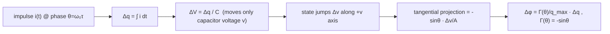

> **β**: This English translation is in beta — the Traditional-Chinese original is the authoritative version.

# Lab 02 — Ideal LC oscillator toy model: $\Gamma(\theta)=-\sin\theta$ and charge linearity

[lab_01](/04_simulation_labs/lab_01_sinusoidal_oscillator) gave the geometric intuition: phase = tangential, amplitude = radial.
This lab turns that into **a concrete function**. For an ideal lossless parallel LC oscillator, the
permanent phase shift caused by injecting a current impulse into the capacitor node can be written
**fully analytically**, giving the ISF:

$$
\Gamma(\theta)=-\sin\theta,\qquad \theta=\omega_0\tau.
$$

This is the site's first ISF that "actually has a shape", and it is **not a toy assumption** — it is derived from the state geometry.
We will (a) plot the waveform and its ISF, (b) verify numerically that in the small-signal regime $\Delta\phi$ is strictly
proportional to $\Delta q$, and (c) watch in state space how a zero-crossing injection becomes a "pure phase jump".

> **Physical intuition (conclusion first)**: the LC state $z=(v,w)=A(\cos\theta,\sin\theta)$ rotates at constant speed on a circle.
> A current impulse pushes only the **capacitor voltage $v$**, one horizontal step $\Delta v=\Delta q/C$. How much of that step
> becomes phase depends on the angle, at that instant, between the radius (pointing outward from the center) and the tangential
> direction (perpendicular to the radius). At the **peak** ($\theta=0$,
> $v=A$) the step lies entirely along the radius → all amplitude; at the **zero crossing** ($\theta=\pi/2$, $v=0$) the step lies entirely along the tangent
> → all phase. Writing this projection as a phase increment gives exactly $-\sin\theta$.

## 1. Learning objectives

- **Derive from physics** the ideal-LC ISF $\Gamma(\theta)=-\sin\theta$ — no memorization, no assumptions.
- Understand how the "shape" of the ISF maps onto the waveform: $|\Gamma|$ is largest at the zero crossings and zero at the peaks.
- Verify **small-signal linearity** by simulation: $\Delta\phi=\Gamma\,\Delta q/q_{max}$, i.e. at a fixed injection phase
  $\Delta\phi$ is proportional to $\Delta q$ (reproducing the conclusion of [P1] Fig. 6).
- See in state space that "**zero-crossing injection = a tangential push = a pure phase jump, trajectory radius unchanged**".
- Prepare a clean, analytically tractable example for [convolution_derivation](/03_isf_core_theory/convolution_derivation) and the
  Fourier decomposition of the ISF ([lab_05](/04_simulation_labs/lab_05_isf_fourier_coefficients)).

## 2. Mathematical model

Ideal lossless parallel LC: energy shuttles losslessly between $L$ and $C$; the state traces a circle at constant speed
in the 2-D plane. In normalized state form ($A=1$):

$$
z(\theta)=(v,\,w)=(\cos\theta,\;\sin\theta),\qquad \theta=\omega_0 t .
$$

- $v$ = capacitor voltage ($\propto\cos\theta$); $w$ = (proportional to) inductor current ($\propto\sin\theta$).
- Here $\mu=0$ (no amplitude restoration), corresponding to the "marginally stable ideal LC". In the simulations, to keep the
  trajectory cleanly on the ring, we use a small $\mu=0.3$ (weak restoration) in (a)(b), and $\mu=0$ in (c) to watch pure rotation.

**Impulse → voltage step** ([P1] Eq.(9), p.182):

$$
\Delta V=\frac{\Delta q}{C_{node}}.
$$

It **moves only $v$** (the inductor current cannot change instantaneously), i.e. the state jumps by $\Delta v=\Delta q/C$ along the $+v$ axis.

**Projecting the voltage step onto phase.** At $z=(\cos\theta,\sin\theta)$, the unit vector along the tangential (phase-increasing) direction is
$\hat t=(-\sin\theta,\cos\theta)$. A step along the $+v$ axis, $\Delta v\,\hat v=\Delta v\,(1,0)$, has
**tangential projection** (divided by the radius $A=1$ to convert into an angle increment):

$$
\Delta\phi=\frac{\hat t\cdot(\Delta v,0)}{A}=\frac{(-\sin\theta)\,\Delta v}{A}=-\sin\theta\;\frac{\Delta v}{A}.
$$

Substituting $\Delta v=\Delta q/C$ and using $q_{max}=C\cdot A$:

$$
\boxed{\;\Delta\phi=-\sin\theta\;\frac{\Delta q/C}{A}=\frac{-\sin\theta}{C A}\,\Delta q=\frac{\Gamma(\theta)}{q_{max}}\,\Delta q,\qquad \Gamma(\theta)=-\sin\theta.\;}
$$

- **dimension check**: $\Delta\phi$ is in rad (dimensionless); $\Delta q/q_{max}=[\text{C}]/[\text{C}]$ is dimensionless;
  hence $\Gamma$ is dimensionless ✓. $\Gamma$ is $2\pi$-periodic, consistent with the definitions in [P1] Eq.(10),(11).
- **Physics check**: $\theta=0$ (peak) → $\Gamma=0$ (amplitude change only, matching the red dot in lab_01 figure two);
  $\theta=\pi/2$ (rising zero crossing) → $\Gamma=-1$ ($|\Gamma|$ maximal, pure phase, matching the green dot). The minus sign is the
  sign convention for "phase being pushed backward".

> **Toy-model note**: ideal lossless LC + pure 2-D rotation + small-signal projection is a pedagogical toy model,
> **not transistor-level**. A real LC has finite $Q$, harmonics, and cyclostationary noise, which pull $\Gamma$
> away from the clean $-\sin\theta$ (see [effective_isf](/03_isf_core_theory/effective_isf)).

## 3. Block diagram



## 4. Core Python code

Excerpted from `simulations/lab_02_lc_toy_model.py` (checked against the source). The ideal-LC ISF comes directly from
`gamma_lc_ideal` (i.e. $-\sin\theta$); for linearity, `simulate_lc` injects a range of
$\Delta q/q_{max}$ at a fixed zero-crossing phase, and `excess_phase` measures the persistent phase shift:

```python
from oscillator_models import simulate_lc, excess_phase
from simulations.common.isf_utils import gamma_lc_ideal

f0, fs = 1.0, 8000.0
theta = np.linspace(0, 2 * np.pi, 400)

# (a) waveform cos(theta) and its ISF -sin(theta)
V     = np.cos(theta)
Gamma = gamma_lc_ideal(theta)          # = -np.sin(theta)

# (b) linearity: inject a series of dq/qmax at the zero crossing (theta=pi/2, ISF=-1), measure persistent Δφ
dq_list = np.linspace(-0.05, 0.05, 11)            # dq / q_max
T = 1.0 / f0
t_inj = 4 * T + (np.pi / 2) / (2 * np.pi * f0)    # injection time corresponding to theta=pi/2
t_ref, xr, yr = simulate_lc(f0, 10 * T, fs, mu=0.3)
phi_ref = excess_phase(t_ref, xr, yr, f0)

dphi = []
for dq in dq_list:
    t_p, xp, yp = simulate_lc(f0, 10 * T, fs, mu=0.3,
                              impulse_time=t_inj, impulse_dx=dq)
    phi_p = excess_phase(t_p, xp, yp, f0)
    m = t_p >= (10 * T - T)                        # take the settled value over the last period
    dphi.append(np.mean(phi_p[m] - phi_ref[m]))
# theory: Δφ = Γ·Δq/q_max = -1 · (dq/q_max)
```

`excess_phase` subtracts the carrier rotation $2\pi f_0 t$, keeping only the perturbation-induced phase
($\phi=\operatorname{unwrap}(\operatorname{atan2}(y,x))-2\pi f_0 t$) — exactly the
$\phi(t)$ in [P1] Eq.(1).

## 5. Full script path

`simulations/lab_02_lc_toy_model.py`
(depends on `simulate_lc` and `excess_phase` from `simulations/common/oscillator_models.py`;
`gamma_lc_ideal` from `simulations/common/isf_utils.py`; `savefig` from `simulations/common/plot_utils.py`.)

To run: `python scripts/run_all_sims.py` or `python simulations/lab_02_lc_toy_model.py`.

## 6. Parameter table

| Parameter | Code variable | Value | Meaning |
|---|---|---|---|
| Oscillation frequency | `f0` | 1.0 (normalized) | shape only, so dimensionless |
| Sampling rate | `fs` | 8000 | 8000 points per period |
| Weak amplitude restoration | `mu` | 0.3 ((a)(b)) / 0.0 ((c)) | (c) uses pure rotation to watch the phase jump |
| Injected-charge sweep | `dq_list` | $[-0.05,\,0.05]$ ($\Delta q/q_{max}$) | small-signal range |
| Injection phase | $\theta$ | $\pi/2$ (zero crossing, $\Gamma=-1$) | linearity measured at maximum sensitivity |
| (c) injection size | `impulse_dx` | 0.25 | slightly larger so the jump is visible in the plot |
| Measurement window | — | last 1 period | takes the settled value of the phase shift |

## 7. Units table

| Quantity | Symbol | Unit | Note |
|---|---|---|---|
| Phase | $\theta=\omega_0\tau$ | rad | ISF argument |
| ISF | $\Gamma(\theta)=-\sin\theta$ | dimensionless | $2\pi$-periodic |
| Injected charge (normalized) | $\Delta q/q_{max}$ | dimensionless | x-axis of panel (b) |
| Persistent phase shift | $\Delta\phi$ | rad | y-axis of panel (b) |
| state $x,y$ | — | normalized | axes of panel (c) |
| Maximum charge swing | $q_{max}=C A$ | C | used for normalization |

## 8. Simulation figures


(One three-panel figure: (a) waveform and ISF; (b) $\Delta\phi$ vs $\Delta q$ linearity; (c) state-space zero-crossing injection.)

## 9. How to read the figures

**(a) Waveform and ISF**:

- Blue: $V(\theta)=\cos\theta$ (tank voltage); red: $\Gamma(\theta)=-\sin\theta$ (ISF).
- Note the **$90^\circ$ phase difference** between them: $\Gamma=0$ when $V$ is at its peak, $|\Gamma|=1$ when $V$ crosses zero. Physically this is exactly right
  — the magnitude of the ISF is set by the **waveform slope** (large slope = large tangential component = phase-sensitive), and the slope of $\cos$ is
  $-\sin$. This is precisely the picture "the most phase-sensitive instant is the zero crossing, the least sensitive is the peak".

**(b) Linearity**:

- The purple dots are the persistent $\Delta\phi$ measured from the numerical simulation; the black dashed line is the theory $\Delta\phi=-\Delta q/q_{max}$
  (because the injection is at $\Gamma=-1$). They **nearly coincide** over the entire $\pm0.05$ range — this is seeing-is-believing
  for the strict small-signal proportionality of $\Delta\phi$ to $\Delta q$, reproducing [P1] Fig. 6.
- The slope is $-1$ (not $+1$), confirming the minus sign of $\Gamma(\pi/2)=-1$.

**(c) State space**:

- The black dashed line is the unperturbed unit circle; the green curve is the trajectory after being "kicked tangentially at a zero crossing". Key observation: the trajectory
  **radius is essentially unchanged** (amplitude untouched), but the **phase of the rotation is permanently shifted** — this is the "pure phase jump".
  By contrast, injecting at the peak makes the radius first grow then get pulled back while the phase barely moves (readers can move `t_inj` to a peak and try).

## 10. Corresponding paper equations / figures

- **Charge → voltage step**: [P1] Eq.(9), p.182: $\Delta V=\Delta q/C_{node}$.
- **ISF impulse response and convolution**: [P1] Eq.(10),(11), p.182:

  

$$
h_\phi(t,\tau)=\frac{\Gamma(\omega_0\tau)}{q_{max}}\,u(t-\tau),\qquad
  \phi(t)=\frac{1}{q_{max}}\int_{-\infty}^{t}\Gamma(\omega_0\tau)\,i_n(\tau)\,d\tau.
$$

- **Concept and linearity figures**: [P1] Fig. 4 (state-space limit cycle, peak vs zero-crossing injection),
  **Fig. 6** ($\Delta\phi$ linear in $\Delta q$ at small charge — panel (b) of this lab directly reproduces that conclusion),
  **Fig. 7(a)** (the LC ISF shape, corresponding to this lab's $-\sin\theta$). The three panels of this lab are
  **redrawn toy concept figures** (not point-by-point copies of the paper figures, and not transistor-level).
- **Operational ISF definition**: $\Delta\phi=\Gamma(\omega_0\tau)\,\Delta q/q_{max}$; the full step-by-step derivation is in
  [impulse_to_phase_shift](/03_isf_core_theory/impulse_to_phase_shift) (Example A: $q_{max}=1$ pC,
  $\Delta q=1$ fC, $\Gamma=0.5$, $f_0=5$ GHz → $\Delta\phi=5\times10^{-4}$ rad, $\Delta t=15.9$ fs).

## 11. Limitations and approximations

- **Pedagogical toy model, not transistor-level.** $\Gamma=-\sin\theta$ is the result for an **ideal lossless LC**;
  a real LC has finite $Q$, a waveform with harmonics, and cyclostationary device noise (gated by the operating point), so the actual
  $\Gamma$ deviates from the clean $-\sin$ and must be extracted with transient/adjoint/Floquet methods (see
  [effective_isf](/03_isf_core_theory/effective_isf); the related PPV/adjoint material is **not among the five downloaded
  PDFs** and is supplemented from standard literature).
- **Small-signal / linearization**: projecting onto the tangent assumes $\Delta q\ll q_{max}$. Panel (b) sweeps only up to $\pm0.05\,q_{max}$;
  larger injections bring in AM–PM conversion, change the ISF itself, or even kick the oscillator off the limit cycle.
- **Single node, single injection**: real circuits have many nodes, each with its own $\Gamma$ and $q_{max}$; multi-node ISF is discussed in
  [isf_definition](/03_isf_core_theory/isf_definition).
- **Numerical integration error**: `simulate_lc` uses fixed-step RK4; the weak $\mu=0.3$ introduces a tiny bias into the phase measurement.
  This lab averages over the last period to suppress transient residue. `extract_isf_by_injection` sweeps the full
  $\Gamma(\theta)$ with a smaller $\Delta q/q_{max}=10^{-3}$; the maximum error against $-\sin\theta$ is about 0.001
  (see [lab_04](/04_simulation_labs/lab_04_impulse_injection_sweep)).

## Key takeaways

- The ideal-LC ISF is **analytically derivable**: $\Gamma(\theta)=-\sin\theta$ (from the tangential projection of the voltage step).
- $|\Gamma|$ magnitude = waveform slope: most sensitive at zero crossings ($\Gamma=-1$), insensitive at peaks ($\Gamma=0$).
- In the small-signal regime $\Delta\phi=\Gamma\,\Delta q/q_{max}$; simulation confirms **linearity** with slope $-1$ ([P1] Fig. 6).
- Zero-crossing injection = pure phase jump (state radius unchanged, phase permanently shifted).
- Sources: [P1] Eq.(9),(10),(11), p.182; Fig. 4, 6, 7(a).
