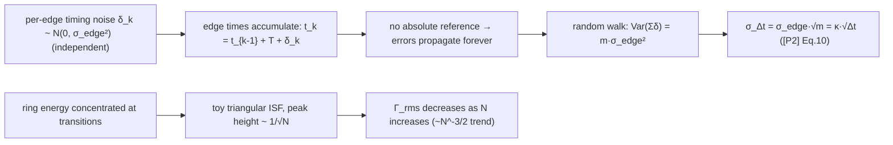

> **β**: This English translation is in beta — the Traditional-Chinese original is the authoritative version.

# Lab 03 — Ring-oscillator toy model: accumulated-jitter random walk and ISF comparison

[lab_02](/04_simulation_labs/lab_02_lc_oscillator_toy_model) looked at the phase jump from a single impulse.
In the real world noise kicks **continuously**, so the phase error **accumulates step by step**. The ring oscillator
($N$ inverter stages connected in a ring, each with delay $\tau_D$) is the cleanest place to watch this, because it has **no absolute time
reference**: every edge (transition) is timed off the previous edge, so earlier errors **propagate forever**.

This lab does two things: (1) uses an edge-time model to demonstrate the **random walk of accumulated jitter**
$\sigma_{\Delta t}=\kappa\sqrt{\Delta t}$ ([P2] Eq.(8), p.792; κ from Eq.(12), p.793); (2) contrasts the LC's smooth
$-\sin\theta$ with the ring's toy ISF — "concentrated at transitions, shrinking with stage count $N$" — and spells out
**what this toy model can and cannot show**.

> **Physical intuition (conclusion first)**: every beat (every edge) is kicked by independent noise into a small timing error,
> and that error **adds onto the accumulated edge time** and is never corrected (open loop, no reference). Independent small steps accumulating
> = a **random walk**: after $m$ steps the position variance is $\propto m$, so the standard deviation is $\propto\sqrt{m}$,
> i.e. the timing error $\sigma_{\Delta t}\propto\sqrt{\Delta t}$. This is the same thing as "a drunkard's distance from the origin
> growing as the square root of the number of steps".

## 1. Learning objectives

- Understand that the ring oscillator has **no absolute time reference** → every edge's error **keeps propagating** → a random walk forms.
- Use simulation to see the $\sqrt{\Delta t}$ scaling (slope $1/2$ on log–log axes) of **accumulated (long-term) jitter**
  $\sigma_{\Delta t}=\kappa\sqrt{\Delta t}$ ([P2] Eq.(8)).
- Contrast the LC's smooth ISF $-\sin\theta$ ($\Gamma_{rms}=0.707$) with the ring's toy ISF: energy **concentrated at
  transitions**, peak height $\sim1/\sqrt N$, and $\Gamma_{rms}$ decreasing as the stage count $N$ increases.
- Delimit the toy model: it **shows** the mechanisms (random walk, ISF shape difference) but **not** the real constants
  (exact values of $\kappa$ and $\Gamma_{rms}$, or the different scaling of correlated noise).

## 2. Mathematical model

**(A) Edge-time random walk.** Abstract the ring's output into a sequence of transition times $\{t_k\}$. Ideally each beat lasts one
period $T=1/f_0$; in practice each beat picks up an **independent** Gaussian timing perturbation with standard deviation $\sigma_{edge}$:

$$
t_{k}=t_{k-1}+T+\delta_k,\qquad \delta_k\sim\mathcal{N}(0,\sigma_{edge}^2)\ \text{i.i.d.}
$$

The perturbation part of the edge-time difference $t_{k+m}-t_k$ over $m$ beats is then $\sum_{j=1}^{m}\delta_j$. Independent terms add →
variances add:

$$
\operatorname{Var}\!\Big(\sum_{j=1}^{m}\delta_j\Big)=m\,\sigma_{edge}^2
\;\Longrightarrow\;
\sigma_{\Delta t}(m)=\sigma_{edge}\sqrt{m}.
$$

Converting the step count $m$ into time $\Delta t=mT$ gives [P2] Eq.(8), p.792:

$$
\boxed{\;\sigma_{\Delta t}=\kappa\sqrt{\Delta t}\;},\qquad \kappa=\frac{\sigma_{edge}}{\sqrt{T}}.
$$

- **dimension check**: $[\kappa]=[\text{s}]/[\text{s}]^{1/2}=[\text{s}]^{1/2}=\sqrt{\text{s}}$,
  consistent with the notation table; $\kappa\sqrt{\Delta t}=\sqrt{\text{s}}\cdot\sqrt{\text{s}}=\text{s}$ ✓.
- **Key assumption**: the per-beat perturbations are **mutually independent (uncorrelated)**. The paper ([P2] Sec. III, p.793) explicitly distinguishes:
  **uncorrelated** sources such as thermal noise → variances add → $\sigma\propto\sqrt{\Delta t}$ (this lab); versus
  **fully correlated** sources such as substrate/supply/$1/f$ → **standard deviations** add →
  $\sigma\propto\Delta t$ (this toy model **does not simulate** that branch; see Section 11).

**(B) Ring vs LC ISF shape.** The ring's energy is concentrated at the transitions (the switching instant has the largest slope and is the most sensitive); its ISF
is not the LC's smooth $-\sin$ but has a spike near every transition. This lab uses a **triangular toy ISF** to "sketch"
this, with peak height shrinking with stage count $N$:

$$
\Gamma_{ring}^{toy}(\theta)\propto\frac{1}{\sqrt N}\times(\text{每半週期一個三角脈衝}).
$$

This echoes the $\Gamma_{rms}\propto N^{-3/2}$ scaling trend claimed by [P2] (more stages → each stage contributes less to the total phase).

> **Toy-model note**: both parts are pedagogical toy models, **not transistor-level**. The random walk uses
> abstract per-edge Gaussian perturbations (not computed from device thermal noise); the triangular ISF is only an illustration of "energy concentrated at
> transitions", **not an extracted ring ISF** — the constants await verification against a real extraction.

## 3. Block diagram



## 4. Core Python code

Excerpted from `simulations/lab_03_ring_toy_model.py` (checked against the source). Accumulated jitter uses
`accumulated_jitter_curve` (internally a `cumsum` of per-period Gaussian increments over `n_trials` trials,
i.e. a random walk); the ISF comparison uses `gamma_lc_ideal`, `gamma_triangular`, and `gamma_rms`:

```python
from oscillator_models import accumulated_jitter_curve
from simulations.common.isf_utils import gamma_lc_ideal, gamma_triangular, gamma_rms

RNG = np.random.default_rng(12345)

def fig_accumulation():
    f0 = 5e9              # 5 GHz
    sigma_edge = 50e-15   # independent timing perturbation, 50 fs rms per beat
    # cumsum of per-period Gaussian increments over 2000 trials -> random walk
    lags, sigma_dt = accumulated_jitter_curve(
        f0, sigma_edge, max_lag_periods=500, n_trials=2000, rng=RNG)
    # simulated points vs theory sigma_edge*sqrt(lags): a slope-1/2 line on log-log axes

def fig_lc_vs_ring_isf():
    theta = np.linspace(0, 2 * np.pi, 1000, endpoint=True)
    g_lc  = gamma_lc_ideal(theta)               # -sin(theta), smooth
    g_r5  = gamma_triangular(theta, n_stages=5)  # toy triangle, peak height ~ 1/sqrt(5)
    g_r15 = gamma_triangular(theta, n_stages=15) # toy triangle, peak height ~ 1/sqrt(15)
    # gamma_rms(theta, g_lc)=0.707, g_r5=0.258, g_r15=0.149 -> rms drops as N rises
```

The core of `accumulated_jitter_curve` is just `walk = np.cumsum(incr, axis=1)` followed by `np.std` across
trials — it directly measures "the variance of a random walk grows linearly with the step count".

## 5. Full script path

`simulations/lab_03_ring_toy_model.py`
(depends on `accumulated_jitter_curve` (and `ring_edge_times`) from `simulations/common/oscillator_models.py`;
`gamma_lc_ideal`, `gamma_triangular`, `gamma_rms` from `simulations/common/isf_utils.py`;
`savefig` from `simulations/common/plot_utils.py`.)

To run: `python scripts/run_all_sims.py` or `python simulations/lab_03_ring_toy_model.py`.

## 6. Parameter table

| Parameter | Code variable | Value | Meaning |
|---|---|---|---|
| Oscillation frequency | `f0` | $5\times10^{9}$ Hz (5 GHz) | matches the site-wide canonical $f_0$ |
| Per-beat timing perturbation | `sigma_edge` | $50\times10^{-15}$ s (50 fs) | rms of the independent per-beat Gaussian perturbation |
| Maximum measurement interval | `max_lag_periods` | 500 periods ($=100$ ns @ 5 GHz) | longest accumulated lag |
| Trial count | `n_trials` | 2000 | Monte-Carlo statistical samples |
| Random seed | `RNG` | 12345 | reproducible results |
| LC ISF | `gamma_lc_ideal` | $-\sin\theta$ | $\Gamma_{rms}=0.707$ |
| ring toy ISF (N=5) | `gamma_triangular(.,5)` | peak height $1/\sqrt5$ | $\Gamma_{rms}=0.258$ |
| ring toy ISF (N=15) | `gamma_triangular(.,15)` | peak height $1/\sqrt{15}$ | $\Gamma_{rms}=0.149$ |

## 7. Units table

| Quantity | Symbol | Unit | Note |
|---|---|---|---|
| Measurement interval | $\Delta N$ (periods) / $\Delta t$ (seconds) | periods / s | $\Delta t=\Delta N\cdot T$ |
| Accumulated jitter | $\sigma_{\Delta t}$ | s (fs in the plot) | rms |
| Per-beat perturbation | $\sigma_{edge}$ | s | 50 fs |
| Proportionality constant | $\kappa$ | $\sqrt{\text{s}}$ | $\kappa=\sigma_{edge}/\sqrt T$ |
| Phase | $\theta$ | rad | ISF argument |
| ISF | $\Gamma(\theta)$ | dimensionless | LC vs ring comparison |
| rms ISF | $\Gamma_{rms}$ | dimensionless | $\sqrt{\frac{1}{2\pi}\int_0^{2\pi}\Gamma^2\,d\theta}$ |
| Stage count | $N$ | dimensionless | number of ring inverter stages |

## 8. Simulation figures

**(Figure 1) The √Δt random walk of accumulated jitter**


**(Figure 2) LC vs ring ISF comparison**


## 9. How to read the figures

**Figure 1 (accumulated jitter, log–log)**:

- Blue dots: $\sigma_{\Delta t}$ simulated over 2000 trials; black dashed line: the theory
  $\sigma_{\Delta t}=\sigma_{edge}\sqrt{\Delta N}$. They collapse onto a single **line of slope $1/2$**
  (on log–log axes, $\sqrt{}$ is slope $1/2$) — the fingerprint of a random walk.
- **Numerical feel**: $\sigma_{edge}=50$ fs; after 1 beat $\sigma=50$ fs; after 500 beats
  $\sigma=50\times\sqrt{500}\approx1118$ fs $\approx1.12$ ps (@ 5 GHz, 500 beats $=100$ ns).
  Stretching the measurement time by 100× (1→100 beats) grows the jitter only $\sqrt{100}=10$× — this is "why an open-loop
  oscillator drifts further the longer it runs, but drifts ever more slowly".
- Contrast: with a **locked PLL** there is an absolute reference and the accumulation is truncated (outside the scope of this toy).

**Figure 2 (ISF comparison)**:

- Blue: the LC's $-\sin\theta$ — smooth, $\Gamma_{rms}=0.707$. Red (N=5) and green (N=15): the ring's
  toy triangular ISFs: **energy concentrated at transitions** (one spike per half period), with **peaks getting shorter and shorter**.
- Read-off $\Gamma_{rms}$: LC $=0.707$, ring N=5 $=0.258$, ring N=15 $=0.149$. **Larger stage count $N$ →
  smaller $\Gamma_{rms}$** — qualitatively echoing [P2]'s $\Gamma_{rms}\propto N^{-3/2}$ trend (more stages,
  each stage's weight in the total phase gets diluted). Since $1/f^2$ phase noise $\propto\Gamma_{rms}^2/q_{max}^2$
  ([P1] Eq.(21)), this explains "how the ring's stage count / power budget affects phase noise at design time" (see
  [lc_vs_ring](/06_design_insights/lc_vs_ring)).
- Note: the toy triangle's **absolute peak height and the precise $N^{-3/2}$ coefficient are not verified by real extraction** — the trend is illustrative only.

## 10. Corresponding paper equations / figures

- **Accumulated jitter (core)**: [P2] Eq.(8), p.792:

  

$$
\sigma_{\Delta t}=\kappa\sqrt{\Delta t}.
$$

  The narrative in [P2] Sec. III (p.793) states explicitly that because "uncertainty in any earlier transition affects all
  following transitions, and its effect persists indefinitely", variances add for uncorrelated sources and
  $\sigma\propto\sqrt{\Delta t}$; Figure 1 of this lab directly reproduces this equation (compare the
  "rms jitter vs measurement time, log–log" concept of [P2] Fig. 3 and Fig. 4).
- **The other branch — correlated sources**: the same section of [P2] notes that for correlated sources (substrate/supply/$1/f$) **standard deviations add**,
  $\sigma\propto\Delta t$ (slope 1, not 1/2). This toy simulates **uncorrelated only**.
- **Ring frequency** (background): [P2] Eq.(15), p.794: $f_0=\dfrac{1}{2N\tau_D}$.
- **$\Gamma_{rms}$ scaling**: [P2] Eq.(16), p.794: $\Gamma_{rms}\propto N^{-3/2}$ ([P2] Eq.(16), p.794 — v7 re-verified:
  the square root covers only the constant, so $\Gamma_{rms}\propto N^{-3/2}$; the body text's $4/N^{1.5}$ at η=0.75 and App. B
  Eq.(55) triple-confirm this. v3 had misread it as $N^{-3/4}$;
  this lab echoes it only qualitatively; compare $\Gamma_{rms}$ vs $N$ in [P2] Fig. 8). Both figures of this lab are
  **redrawn toy concept figures** (not point-by-point copies of the paper figures, not transistor-level).
- **Link to phase noise**: $\Gamma_{rms}$ enters $1/f^2$ phase noise through [P1] Eq.(21), p.185.

## 11. Limitations and approximations — what the toy model can and cannot show

**Can show (mechanisms this toy model teaches correctly)**:

- An open-loop oscillator has **no absolute time reference** → errors propagate forever → the **random-walk nature** of accumulated jitter.
- Under uncorrelated noise, $\sigma_{\Delta t}\propto\sqrt{\Delta t}$ (log–log slope $1/2$).
- The qualitative shape of the ring ISF — **energy concentrated at transitions** — contrasted with the LC's smooth $-\sin$.
- The **direction of the trend** that $\Gamma_{rms}$ shrinks as $N$ grows.

**Cannot show (things the toy model misses; need transistor-level / real extraction)**:

- **The real $\kappa$ and $\sigma_{edge}$**: the 50 fs in this lab is a hand-placed number, **not** computed from device thermal
  noise + $\Gamma$ + $q_{max}$ (that requires [P1] Eq.(21) and the real ISF).
- **The different scaling of correlated noise**: substrate/supply/$1/f$ give $\sigma\propto\Delta t$ (slope 1);
  this model **contains none** of that branch — a real ring shows both trends ([P2] Sec. III).
- **The precise $\Gamma_{rms}\propto N^{-3/2}$ constant** and the real ring ISF shape: the triangle is only illustrative;
  the real ISF must be extracted via transient/adjoint methods (the related PPV/adjoint/Floquet material is **not among the five downloaded PDFs**
  and is supplemented from standard literature; see [effective_isf](/03_isf_core_theory/effective_isf)).
- **Flicker ($1/f$) upconversion and cyclostationarity**: the per-edge perturbations in this lab are pure white and symmetric,
  with no $1/f^3$ close-in behavior (see [lab_07](/04_simulation_labs/lab_07_flicker_noise_upconversion)).
- **Small-lag saturation**: a footnote in [P2] notes that under a more accurate treatment the phase noise does not grow without bound as $f_0\to0$ (it flattens);
  this random walk contains no such correction at large lag — but, as the paper says, it makes "no practical difference" for this discussion.

## Key takeaways

- The ring has no absolute time reference → errors propagate forever → accumulated jitter is a **random walk**.
- Uncorrelated noise: $\sigma_{\Delta t}=\kappa\sqrt{\Delta t}$ ([P2] Eq.(8)); simulated log–log
  slope $1/2$; 50 fs/beat → 500 beats ≈ 1.12 ps.
- Correlated noise instead gives $\sigma\propto\Delta t$ (not included in this toy).
- The ring ISF is concentrated at transitions with peak height $\sim1/\sqrt N$; $\Gamma_{rms}$ (LC 0.707 → ring N=5 0.258
  → N=15 0.149) drops with $N$, echoing $\Gamma_{rms}\propto N^{-3/2}$.
- Sources: [P2] Eq.(8),(14),(16), Sec. III, Fig. 3,4,8; linked to [P1] Eq.(21).
