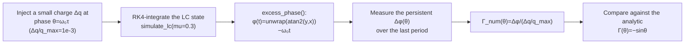

> **β**: This English translation is in beta — the Traditional-Chinese original is the authoritative version.

# Lab 04 — impulse injection sweep and LTI vs LTV

This lab turns the "operational ISF definition" from
[impulse_to_phase_shift](/03_isf_core_theory/impulse_to_phase_shift) into a **measurable
experiment**: inject a very small charge impulse at different phases $\theta=\omega_0\tau$ of the
waveform, measure the **permanent** phase shift it causes, divide that shift by the injected
amount, and thereby **back out** the ISF (impulse sensitivity function — where on its waveform the
oscillator is most vulnerable to a kick).

The extracted numerical ISF nearly coincides with the analytic solution
$\Gamma(\theta)=-\sin\theta$ for the ideal LC (maximum error about $7\times10^{-4}$). The same lab
also uses impulse responses to draw out the difference between **LTI (linear time-invariant) vs
LTV (linear time-variant — the system parameters vary periodically with time)** — the key reason
the whole ISF theory "cannot treat oscillator phase with an ordinary LTI transfer function."

> **The two things this lab wants you to see with your own eyes**: (1) the ISF is not an abstract
> definition; it is the result of the action "kick at phase $\theta$, measure the persistent phase
> jump"; (2) the same-size impulse barely changes the phase when it kicks at the peak, but causes
> the largest phase jump at the zero crossing — this "kick effect varying periodically with the
> injection instant" is LTV, and can never be drawn by an LTI impulse response that depends only
> on $t-\tau$.

## 1. Learning objectives

- Turn the operational ISF definition $\Delta\phi=\dfrac{\Gamma(\omega_0\tau)}{q_{max}}\,\Delta q$ into a
  **numerical experimental flow**: sweep the injection phase → measure the persistent phase → back out $\Gamma$.
- Verify that the ISF of the ideal LC oscillator (current injected into the capacitor node) is exactly $\Gamma(\theta)=-\sin\theta$,
  and quantify the numerical-vs-theory error (~$10^{-3}$ level).
- Understand the difference between the "persistent phase shift" and the "decaying amplitude perturbation" — only the tangential (phase) component remains permanently.
- Use the impulse-response comparison plot to build the physical picture of **LTV**: the step height varies periodically with the injection phase.
- Maps to [P1] Eq.(10),(11) and Fig. 4.

## 2. Mathematical model

The whole lab stands on this LTV impulse response ([P1] Eq.(10), p.182):

$$
h_\phi(t,\tau)=\frac{\Gamma(\omega_0\tau)}{q_{max}}\,u(t-\tau)
$$

Its meaning: injecting unit charge at time $\tau$ (corresponding to phase $\omega_0\tau$) makes the
phase **jump in a single step** to $\Gamma(\omega_0\tau)/q_{max}$, and because of the unit step
$u(t-\tau)$ the jump is **kept permanently**. Superposing it over all past noise currents gives the
central LTV phase response ([P1] Eq.(11), p.182):

$$
\phi(t)=\frac{1}{q_{max}}\int_{-\infty}^{t}\Gamma(\omega_0\tau)\,i_n(\tau)\,d\tau
$$

**The single-impulse experiment that backs out the ISF**: if $i_n$ is just one narrow pulse located
at phase $\theta$ with total charge $\Delta q$, Eq.(11) degenerates to a single step (the step
version of [P1] Eq.(10); see also the operational definition in impulse_to_phase_shift):

$$
\Delta\phi(\theta)=\frac{\Gamma(\theta)}{q_{max}}\,\Delta q
\quad\Longrightarrow\quad
\Gamma(\theta)=\frac{\Delta\phi(\theta)}{\Delta q/q_{max}} .
$$

- **dimension check**: the right-hand side $[\text{rad}]/(\text{C}/\text{C})=[\text{rad}]$ looks like it carries units,
  but $\Delta\phi$ is rad (dimensionless) and $\Delta q/q_{max}$ is dimensionless, so $\Gamma$ is dimensionless ✓.
- **Theory reference**: for the ideal lossless parallel LC with current injected into the capacitor node, the state is $z=(v,w)=A(\cos\theta,\sin\theta)$;
  a charge impulse pushes $v$ by $\Delta v=\Delta q/C$, and projecting onto the limit-cycle tangential direction gives
  $\Delta\phi=-(\sin\theta)\,\Delta v/A$; combined with $q_{max}=CA$ this yields

$$
\boxed{\ \Gamma(\theta)=-\sin\theta\ }
$$

  At the peak $\theta=0$, $\Gamma=0$ (pure amplitude change); at the zero crossing $\theta=\pi/2$, $|\Gamma|$ is maximum
  (pure phase change). Full geometric derivation: [isf_definition](/03_isf_core_theory/isf_definition).

**The mathematical difference of LTV vs LTV**: an LTI system's impulse response depends only on the
time difference, $h(t,\tau)=h(t-\tau)$; the oscillator's phase impulse response $h_\phi(t,\tau)$
**explicitly depends on the absolute injection instant $\tau$** (through the $2\pi$-periodic weight
$\Gamma(\omega_0\tau)$) — precisely the definition of LTV.

## 3. Block diagram



## 4. Core Python code

The core of backing out the ISF is `extract_isf_by_injection`: for each phase $\theta$ run one
injection simulation, measure the mean phase difference over "the last period" relative to a
no-injection reference trajectory (this keeps only the permanent phase and filters out the
already-decayed amplitude perturbation), then divide by $\Delta q/q_{max}$. Quoted verbatim from
the real code (`simulations/common/oscillator_models.py`):

```python
def extract_isf_by_injection(f0, fs, n_inject_periods=6, settle_periods=4,
                             dq_over_qmax=1e-3, n_points=64, mu=0.3):
    T = 1.0 / f0
    settle = settle_periods * T
    t_end = (settle_periods + n_inject_periods) * T
    thetas = np.linspace(0.0, TWO_PI, n_points, endpoint=False)
    gamma_num = np.zeros(n_points)

    # Reference (no impulse), started from the limit cycle.
    t_ref, xr, yr = simulate_lc(f0, t_end, fs, mu=mu, x0=1.0, y0=0.0)
    phi_ref = excess_phase(t_ref, xr, yr, f0)

    for i, th in enumerate(thetas):
        t_inj = settle + th / (TWO_PI * f0)  # phase th occurs at this time
        t_p, xp, yp = simulate_lc(f0, t_end, fs, mu=mu, x0=1.0, y0=0.0,
                                  impulse_time=t_inj, impulse_dx=dq_over_qmax)
        phi_p = excess_phase(t_p, xp, yp, f0)
        # persistent phase difference measured over the last period
        m = t_p >= (t_end - T)
        dphi = np.mean(phi_p[m] - phi_ref[m])
        gamma_num[i] = dphi / dq_over_qmax

    gamma_analytic = -np.sin(thetas)
    return thetas, gamma_num, gamma_analytic
```

The core of the LTV vs LTV comparison figure plots "LTI: step height fixed, only time-shifted"
next to "LTV: step height $=\Gamma(\omega_0\tau)$ varying with the injection phase"
(`simulations/lab_04_impulse_sweep.py`):

```python
    # LTV (oscillator phase): step of height Gamma(w0 tau)/qmax * u(t - tau).
    ax = axes[1]
    for tau, c in zip([0.0, 0.25, 0.5], ["tab:blue", "tab:orange", "tab:green"]):
        gamma = -np.sin(2 * np.pi * f0 * tau)  # ISF at injection phase
        h = gamma * (t >= tau)
        ax.plot(t, h, color=c,
                label=fr"$\tau={tau}$, $\Gamma=-\sin(2\pi\tau)={gamma:+.2f}$")
```

- **Why measure "the mean over the last period"**: the transient right after injection contains both
  an amplitude perturbation and a phase jump; the Van der Pol-type amplitude restoration with
  `mu=0.3` pulls the radial (amplitude) component back to the limit cycle within a few periods,
  leaving only the tangential (phase) component permanently. Measuring after `n_inject_periods`
  periods yields the clean persistent phase.
- **Why `endpoint=False`**: $\theta=0$ and $\theta=2\pi$ are the same phase — do not duplicate it in the sweep.
- **Why `dq_over_qmax=1e-3` is small**: keeps small-signal linearity ($\Delta q\ll q_{max}$); otherwise the ISF itself
  would be altered by the large injection and the extraction would be inaccurate.

## 5. Full script path

`simulations/lab_04_impulse_sweep.py`
(calls `simulate_lc`, `excess_phase`, `extract_isf_by_injection` from
`simulations/common/oscillator_models.py`; plotting utilities in `simulations/common/plot_utils.py`).
How to run: `python scripts/run_all_sims.py`; figures are written to `static/figures/`.

## 6. Parameter table

| Parameter | Code variable | Value | Notes |
|---|---|---|---|
| Oscillation frequency | `f0` | 1.0 (normalized) | the toy model uses a dimensionless frequency; the real-world 5 GHz mapping is in the units table below |
| Sampling rate | `fs` | 8000 (sweep) / 2000 (LTV figure) | $fs/f_0$ points per period, enough to resolve the tangential projection |
| Injected charge ratio | `dq_over_qmax` | $10^{-3}$ | $\Delta q/q_{max}$, keeps small signal |
| Sweep points | `n_points` | 48 | 48 injection phases within one period |
| Post-injection observation | `n_inject_periods` | 6 | run 6 more periods after injection so the amplitude perturbation decays |
| Settle periods | `settle_periods` | 4 | let the system settle onto the limit cycle before injecting |
| Restoration strength | `mu` | 0.3 | Van der Pol-type amplitude restoration; $\mu=0$ is the ideal lossless LC |
| LTV-figure injection phases | `tau` | 0.0, 0.25, 0.5 (periods) | correspond to $\Gamma=-\sin(2\pi\tau)=0,-1,0$ |

## 7. Units table

| Quantity | Symbol | toy-model unit | Physical unit |
|---|---|---|---|
| Time | $t,\tau$ | periods (normalized) | s |
| Injection phase | $\theta=\omega_0\tau$ | rad ($2\pi$-periodic) | rad |
| Injected charge ratio | $\Delta q/q_{max}$ | dimensionless | C/C |
| Persistent phase | $\Delta\phi$ | rad | rad |
| ISF | $\Gamma(\theta)$ | dimensionless | — |
| Maximum error | $\max\vert \Gamma_{num}-\Gamma_{ana}\vert $ | dimensionless | — |

> **toy model note**: this is a pedagogical toy model (2-D Van der Pol-type state-space), **not
> transistor-level**. It faithfully reproduces the *mechanism* of the ISF (tangential projection,
> $-\sin\theta$, LTV) but does not produce real-circuit numbers. To convert into physical
> intuition, apply canonical example A: $q_{max}=1$ pC, $\Delta q=1$ fC
> (i.e. $\Delta q/q_{max}=10^{-3}$), $\Gamma=0.5$, $f_0=5$ GHz $\Rightarrow$
> $\Delta\phi=5\times10^{-4}$ rad, $\Delta t=15.9$ fs.

## 8. Simulation figures

**Figure 1: phase shift vs injection phase** — the same $\Delta q/q_{max}=10^{-3}$ impulse, kicked
at different phases, produces completely different persistent $\Delta\phi$:


**Figure 2: numerically extracted ISF vs theoretical −sinθ** — dividing the vertical axis of the
previous figure by $\Delta q/q_{max}$ gives the ISF itself; the numerical points (purple circles)
nearly coincide with the theoretical dashed line:


**Figure 3: LTI vs LTV impulse responses** — top: the LTI response keeps its shape and only shifts;
bottom: the LTV step height varies with the injection phase:


## 9. How to read the figures

**Figure 1 (phase sweep)**: the horizontal axis is the injection phase $\theta/2\pi$ (one period),
the vertical axis is the persistent phase shift $\Delta\phi$. Note that it is a $-\sin$-shaped
curve: nearly zero at $\theta=0$ (the peak), the largest negative value at $\theta\approx0.25$
(rising zero crossing), the largest positive value at $\theta\approx0.75$. **This is direct
evidence of LTV** — the effect of "the same kick" depends entirely on "where on the waveform you
kick." The numerical blue circles hug the black theoretical dashed line.

**Figure 2 (recovered ISF)**: dividing Figure 1 by $\Delta q/q_{max}=10^{-3}$ gives
$\Gamma(\theta)$. The title reports a maximum absolute error of about $7\times10^{-4}$ (the title
is formatted to three decimals, about 0.001). Error sources: RK4 time discretization, the $\theta$
sampling (48 points), and the measurement window averaging only over the last period. This level
is enough to claim "the numerical method successfully recovered $\Gamma=-\sin\theta$ of the ideal
LC."

**Figure 3 (LTI vs LTV)**:
- Top half (LTI): the three curves are the same decaying-exponential impulse response shifted to $\tau=0.3,0.9,1.5$ — **identical shape**,
  only the starting point differs. This is the LTI hallmark: $h(t,\tau)=h(t-\tau)$.
- Bottom half (LTV phase): all three are unit steps (permanently held), but with **different step heights**: at $\tau=0$,
  $\Gamma=-\sin(0)=0$ (kick at the peak, phase unmoved); at $\tau=0.25$, $\Gamma=-\sin(\pi/2)=-1$
  (kick at the zero crossing, largest phase jump); at $\tau=0.5$, $\Gamma=-\sin(\pi)=0$. **The step height varies with the absolute injection phase**
  — this is LTV, and the fundamental reason a single LTI transfer function cannot describe oscillator phase.

## 10. Corresponding paper equations / figures

- **[P1] Eq.(10), p.182**: $h_\phi(t,\tau)=\dfrac{\Gamma(\omega_0\tau)}{q_{max}}\,u(t-\tau)$
  — every curve in the bottom half of Figure 3 is exactly this (a different $\tau$ gives a different step height $\Gamma(\omega_0\tau)$).
- **[P1] Eq.(11), p.182**: $\phi(t)=\dfrac{1}{q_{max}}\displaystyle\int_{-\infty}^{t}\Gamma(\omega_0\tau)\,i_n(\tau)\,d\tau$
  — this lab is its single-impulse special case (the basis for backing out $\Gamma$).
- **[P1] Fig. 4, p.181**: caption "(a) impulse injected at the peak, (b) impulse injected at the
  zero crossing, and (c) effect of nonlinearity on amplitude and phase ... in state-space" — demonstrates the difference between impulses
  injected at the peak vs the zero crossing, and the effect of nonlinearity on amplitude/phase (state-space picture). Figures 1/2 of this lab are its
  toy-model reproduction on the ideal LC
  (TODO: only the exact axis-tick values of Fig. 4 have not yet been transcribed verbatim; check the original figure on [P1] p.181).
- Geometric derivation of the $-\sin\theta$ ISF: see [isf_definition](/03_isf_core_theory/isf_definition);
  operational definition and the 16 fs numerical example: [impulse_to_phase_shift](/03_isf_core_theory/impulse_to_phase_shift).

## 11. Limitations and approximations

| Limitation / approximation | Impact | Where it holds / fails |
|---|---|---|
| 2-D Van der Pol toy model (not transistor-level) | Reproduces the mechanism only, gives no real-circuit numbers | Sufficient for teaching; for design, extract $\Gamma$ with transient/adjoint |
| Small signal $\Delta q/q_{max}=10^{-3}$ | $\Delta\phi$ linearly proportional to $\Delta q$ | Large injection → nonlinearity, AM–PM, $\Gamma$ itself altered |
| Measure only after `mu=0.3` has let the amplitude perturbation decay | Needed to isolate the pure phase component | If $\mu$ is too small and the amplitude perturbation has not fully decayed, the measured $\Delta\phi$ is contaminated by residual amplitude |
| RK4 + finite `fs` discretization | Introduces ~$10^{-3}$ numerical error | Raising `fs`/`n_points` lowers it further, but this lab's level is already sufficient |
| Ideal lossless LC's $\Gamma=-\sin\theta$ | Holds only for injection into the single capacitor node | Multi-node, ring, and lossy cases have different ISF shapes (see [lab_05](/04_simulation_labs/lab_05_isf_fourier_coefficients) and the ring model) |
| The LTI reference curve is an illustrative exponential decay | Only to contrast "shape invariance" | It is not the impulse response of any real circuit — purely a teaching reference |

## Key takeaways

- The ISF is **measurable**: inject a small charge at phase $\theta$, measure the persistent $\Delta\phi$, divide by $\Delta q/q_{max}$.
- The ISF backed out of the ideal LC (capacitor-node injection) is exactly $\Gamma(\theta)=-\sin\theta$; maximum numerical-vs-theory error ~$10^{-3}$.
- Injection at the peak → pure amplitude change (pulled back); injection at the zero crossing → pure phase change (permanently retained).
- The essence of LTV: the phase impulse response $h_\phi(t,\tau)$ depends on the **absolute injection phase**, with step height $=\Gamma(\omega_0\tau)$ — not on $t-\tau$ alone.
- Source: [P1] Eqs.(10),(11), p.182 and Fig. 4.

## Further reading

- Operational definition and physical intuition: [impulse_to_phase_shift](/03_isf_core_theory/impulse_to_phase_shift)
- Geometric derivation of $-\sin\theta$: [isf_definition](/03_isf_core_theory/isf_definition)
- Decomposing the ISF into Fourier coefficients: [lab_05](/04_simulation_labs/lab_05_isf_fourier_coefficients)
- Numerical conversion feel: [numerical_feeling](/04_simulation_labs/numerical_feeling)
