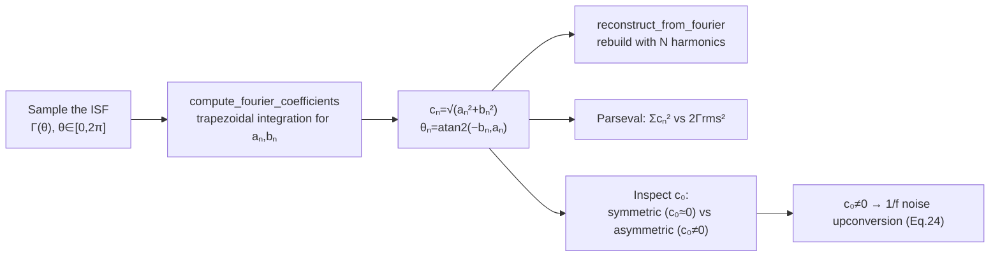

> **β**: This English translation is in beta — the Traditional-Chinese original is the authoritative version.

# Lab 05 — ISF Fourier coefficients and Parseval

The ISF is a $2\pi$-periodic function, so it can be decomposed into a Fourier series. **Why
decompose?** Because what appears in the phase-noise formulas is the ISF's Fourier coefficients
$c_n$, not $\Gamma$ itself: $c_0$ (the DC coefficient) decides whether 1/f noise gets upconverted
into close-in phase noise; $c_n$ sets the weight with which noise near $n\omega_0$ is moved to the
carrier; and by Parseval (Parseval's theorem — time-domain energy = frequency-domain energy) the
sum of squares of all coefficients equals $2\Gamma_{rms}^2$, where $\Gamma_{rms}$ directly sets
the 1/f² phase-noise magnitude.

This lab does three things: (1) compute the $c_n$ of one ISF and reconstruct it with 1, 2, 4
harmonics; (2) plot the coefficient spectrum and numerically verify the Parseval relation; (3) put
a symmetric ($c_0=0$) and an asymmetric ($c_0\neq0$) ISF side by side to show that only
$c_0\neq0$ upconverts 1/f noise.

> **Physical intuition**: think of the ISF as "the local-oscillator (LO) waveform of the mixer
> that the oscillator is." Noise does not enter the phase directly; it is first comb-sampled by
> the ISF in the frequency domain — noise near each $n\omega_0$ is weighted by $c_n$ and
> downconverted to near the carrier. So **the ISF's shape (its harmonic content) is the knob the
> designer can actually turn**: make the waveform symmetric (suppress $c_0$) to suppress 1/f³;
> make the overall $\Gamma_{rms}$ small to suppress 1/f².

## 1. Learning objectives

- Write the ISF as the Fourier series $\Gamma(\omega_0\tau)=\dfrac{c_0}{2}+\sum_n c_n\cos(n\omega_0\tau+\theta_n)$,
  and understand the physical role of each coefficient.
- Compute the $c_n$ of a given ISF by numerical integration, and demonstrate "more harmonics, closer reconstruction."
- Use the Parseval relation $\sum_n c_n^2=2\Gamma_{rms}^2$ to connect "frequency-domain coefficients" with "time-domain rms,"
  and **face honestly** the DC-term bookkeeping trap under the half-amplitude convention.
- Understand why $c_0$ (= the ISF's mean value × 2) is the "gate" for 1/f noise upconversion: a symmetric waveform gives $c_0\approx0$
  → the 1/f³ corner is pushed very low.
- Maps to [P1] Eq.(12),(20),(24).

## 2. Mathematical model

**ISF Fourier series** ([P1] Eq.(12), p.183):

$$
\Gamma(\omega_0\tau)=\frac{c_0}{2}+\sum_{n=1}^{\infty}c_n\cos(n\omega_0\tau+\theta_n)
$$

- $c_0/2$ is the **mean (DC value)** of the ISF. Note the factor of 2: the Fourier coefficient is called $c_0$, but the ISF's
  DC *value* is $c_0/2$. This factor is extremely easy to get wrong when computing the 1/f³ corner (see the notation pitfalls in [notation](/00_overview/notation)).
- $c_n,\theta_n$ are the amplitude and phase of the $n$-th harmonic; $c_n=\sqrt{a_n^2+b_n^2}$,
  $\theta_n=\operatorname{atan2}(-b_n,a_n)$, where $a_n,b_n$ are the standard cos/sin coefficients.
- **dimension check**: $\Gamma$ is dimensionless, cos is dimensionless, so every $c_n$ is dimensionless ✓.

**Parseval / rms ISF** ([P1] Eq.(20), p.185):

$$
\sum_{n=0}^{\infty}c_n^2=\frac{1}{\pi}\int_0^{2\pi}|\Gamma(x)|^2dx=2\,\Gamma_{rms}^2
$$

It links "the sum of squares of all harmonics" to "the ISF's mean square × 2." Physically:
white-noise phase noise is proportional to $\sum c_n^2=2\Gamma_{rms}^2$ ([P1] Eq.(19) → Eq.(21)),
so knowing $\Gamma_{rms}$ is enough to compute the 1/f² phase noise without tracking every
harmonic individually.

> **The half-amplitude-convention bookkeeping trap (you will see it with your own eyes in this
> lab)**: the $c_0$ on the left side of Eq.(20) must use the same definition as the $c_0$ of
> Eq.(12). This lab's `compute_fourier_coefficients` returns `c[0] = |a0|`, where
> $a_0=2\times(\text{DC value})$, i.e. $c_0=a_0$. For an ISF with a non-zero DC value, throwing
> `c[0]**2` straight into $\sum c_n^2$ **counts the DC energy once too many** (because the cos
> terms enter at half amplitude while the DC term enters at full amplitude, so their squared
> weights differ). This is exactly why the Parseval numbers below disagree by ~10% — we choose to
> **show it as is** rather than hide it.

**1/f³ corner** ([P1] Eq.(24), p.185, which explains why $c_0$ matters):

$$
\Delta\omega_{1/f^3}=\omega_{1/f}\cdot\frac{c_0^2}{2\,\Gamma_{rms}^2}\approx\omega_{1/f}\left(\frac{c_0}{c_1}\right)^2
$$

$c_0\to0$ (symmetric waveform) $\Rightarrow$ the 1/f³ corner $\to0$, and the close-in phase noise is clean.

## 3. Block diagram



## 4. Core Python code

The Fourier coefficients are computed directly by trapezoidal integration
(`simulations/common/isf_utils.py`, quoted verbatim):

```python
def compute_fourier_coefficients(theta, gamma, n_harmonics):
    theta = np.asarray(theta, dtype=float)
    gamma = np.asarray(gamma, dtype=float)

    a0 = (1 / np.pi) * _trapz(gamma, theta)
    a = np.zeros(n_harmonics + 1)
    b = np.zeros(n_harmonics + 1)

    for n in range(1, n_harmonics + 1):
        a[n] = (1 / np.pi) * _trapz(gamma * np.cos(n * theta), theta)
        b[n] = (1 / np.pi) * _trapz(gamma * np.sin(n * theta), theta)

    c = np.sqrt(a ** 2 + b ** 2)
    c[0] = abs(a0)  # c0 magnitude (the DC coefficient)
    phase = np.arctan2(-b, a)

    return a0, a, b, c, phase
```

rms and the Parseval check (`fig_coefficients` in `simulations/lab_05_fourier_isf.py`):

```python
    a0, a, b, c, ph = compute_fourier_coefficients(theta, g, n_harmonics=8)

    # check Parseval: sum c_n^2 ?= 2 Gamma_rms^2
    parseval_lhs = c[0] ** 2 + np.sum(c[1:] ** 2)
    grms = gamma_rms(theta, g)
```

The example ISF used in this lab (deliberately made asymmetric so several harmonics are non-zero;
the `+0.25` creates the non-zero $c_0$):

```python
def make_isf(theta):
    """A richer asymmetric ISF so several harmonics are non-trivial."""
    return (-np.sin(theta) + 0.35 * np.sin(2 * theta)
            + 0.18 * np.cos(3 * theta) + 0.25)  # the +0.25 sets a non-zero c0
```

Symmetric vs asymmetric comparison (`fig_symmetric_vs_asymmetric`):

```python
    g_sym = np.cos(theta)               # c0 = 0 (symmetric)
    g_asym = gamma_asymmetric(theta, alpha=0.4)  # c0 = 2*alpha = 0.8
```

- **Why `theta` must include the endpoint (`endpoint=True`) across the full $[0,2\pi]$**: the trapezoidal rule must integrate
  $\frac{1}{\pi}\int_0^{2\pi}$ to give the correct coefficients; drop one endpoint and the integration interval is incomplete.
- **How `gamma_rms` is computed**: $\Gamma_{rms}=\sqrt{\frac{1}{2\pi}\int_0^{2\pi}\Gamma^2\,d\theta}$,
  consistent with the right-hand side of Eq.(20).

## 5. Full script path

`simulations/lab_05_fourier_isf.py`
(calls `compute_fourier_coefficients`, `reconstruct_from_fourier`, `gamma_rms`,
`gamma_asymmetric` from `simulations/common/isf_utils.py`; plotting in
`simulations/common/plot_utils.py`). How to run: `python scripts/run_all_sims.py`.

## 6. Parameter table

| Parameter | Code variable | Value | Notes |
|---|---|---|---|
| Phase sampling | `theta` | `linspace(0,2π,2000,endpoint=True)` | one full period, endpoint included |
| Highest harmonic | `n_harmonics` | 8 | computed up to $c_8$ |
| Example ISF | `make_isf` | $-\sin\theta+0.35\sin2\theta+0.18\cos3\theta+0.25$ | asymmetric, with DC |
| Reconstruction harmonics | `N` | 1, 2, 4 | shows the progressive approximation |
| Symmetric ISF | `g_sym` | $\cos\theta$ | $c_0=0$ |
| Asymmetric ISF | `g_asym` | $\cos\theta+0.4$ | $c_0=2\times0.4=0.8$ |

**Key numbers computed in this lab** (canonical; used in the figure interpretation below):

| Quantity | Value | Source |
|---|---|---|
| $c_0$ (example ISF) | $0.5$ (so DC value $=c_0/2=0.25$) | the `+0.25` term → $a_0=0.5$ |
| $c_1$ | $1.0$ (from $-\sin\theta$) | |
| $c_2$ | $0.35$ (from $0.35\sin2\theta$) | |
| $c_3$ | $0.18$ (from $0.18\cos3\theta$) | |
| $\Gamma_{rms}$ | $0.8$ | `gamma_rms(theta,g)` |
| $\sum c_n^2$ (as coded) | $1.405$ | `c[0]**2+sum(c[1:]**2)` |
| $2\Gamma_{rms}^2$ | $1.280$ | theoretical right-hand side |
| Symmetric / asymmetric $c_0$ | $0.0$ / $0.8$ | |

## 7. Units table

| Quantity | Symbol | Unit |
|---|---|---|
| Injection phase | $\theta=\omega_0\tau$ | rad ($2\pi$-periodic) |
| ISF | $\Gamma(\theta)$ | dimensionless |
| Fourier coefficients | $c_n,a_n,b_n$ | dimensionless |
| Harmonic phase | $\theta_n$ | rad |
| ISF rms | $\Gamma_{rms}$ | dimensionless |
| Harmonic index | $n$ | dimensionless (integer) |

> **toy model note**: `make_isf`, `gamma_symmetric`, `gamma_asymmetric` are all pedagogical
> toy ISFs, **not transistor-level** extraction results. Their purpose is to make the *mechanisms*
> clear — how $c_n$ is computed, how Parseval checks out, how $c_0$ affects upconversion. Real ISFs
> must be extracted by transient/adjoint simulation
> (see [effective_isf](/03_isf_core_theory/effective_isf)).

## 8. Simulation figures

**Figure 1: Fourier reconstruction** — the black line is the original ISF; the colored lines are reconstructions with $N=1,2,4$ harmonics; more harmonics, tighter fit:


**Figure 2: coefficient spectrum and Parseval** — the bar height is $|c_n|$; the title lists $c_0$, $\Gamma_{rms}$,
$\sum c_n^2$ and $2\Gamma_{rms}^2$:


**Figure 3: $c_0$ of symmetric vs asymmetric ISF** — the green line $\cos\theta$ ($c_0=0$) is symmetric about zero; the red line
$\cos\theta+0.4$ is lifted as a whole, with DC value $=c_0/2=0.4$:


## 9. How to read the figures

**Figure 1 (reconstruction)**: the original ISF contains the three harmonics $\sin\theta,\sin2\theta,\cos3\theta$ plus a DC term.
$N=1$ captures only the main harmonic (the $-\sin\theta$ one) and clearly deviates; $N=2$ adds the second harmonic and the shape is roughly right; $N=4$
already contains all non-zero harmonics and nearly coincides with the original. **Teaching point**: the ISF's "shape" is its harmonic mix, and a handful of coefficients
describe most of the phase-noise behavior — exactly why the phase-noise formulas only need $c_0,c_1,\dots$ and $\Gamma_{rms}$.

**Figure 2 (coefficients)**: $c_0=0.5$, $c_1=1.0$ (dominant), $c_2=0.35$, $c_3=0.18$, the rest about zero
— matching the four terms of `make_isf`. The Parseval check in the title shows $\sum c_n^2=1.405$ against
$2\Gamma_{rms}^2=1.280$ — **not exactly equal**. This is not a bug; it is the consequence of DC-term bookkeeping under the half-amplitude convention
(see the trap in Section 2): the cos harmonics enter $\sum$ with half-amplitude squared weights, while $c_0=a_0=2\times$DC uses full amplitude
and is over-counted. If the DC were instead counted with the correct weight $(c_0/2)^2\times2$, the two sides would agree;
for a symmetric ISF with zero DC value (such as a pure $-\sin\theta$) there is no such gap in the first place.
**It has no effect whatsoever on the 1/f²/$\Gamma_{rms}^2$ scaling or the −20 dB/dec slope** — this is just a constant bookkeeping convention,
the same class of thing as the famous factor-of-2 discussed in
[white_noise_to_phase_noise](/03_isf_core_theory/white_noise_to_phase_noise).

**Figure 3 (symmetric vs asymmetric)**: the green line is symmetric about the zero axis (positive and negative areas cancel, $c_0=0$); the red line is lifted
as a whole by $+0.4$; the red dashed line marks its DC value $=c_0/2=0.4$, and the shading is the lifted "DC offset." **Only this
non-zero DC directly upconverts the device's 1/f flicker noise to near the carrier** ([P1] Eq.(24)):
$c_0=0$ → $\Delta\omega_{1/f^3}=0$. In design terms, this is the mathematical basis for why "making the rise/fall edges symmetric so the upper and lower half-periods of the waveform are symmetric"
suppresses close-in 1/f³ phase noise (for design usage see [symmetry](/06_design_insights/symmetry)).

## 10. Corresponding paper equations / figures

- **[P1] Eq.(12), p.183**: $\Gamma(\omega_0\tau)=\dfrac{c_0}{2}+\sum_{n=1}^{\infty}c_n\cos(n\omega_0\tau+\theta_n)$
  — directly verified by the Figure 1 reconstruction and the Figure 2 coefficient spectrum.
- **[P1] Eq.(20), p.185**: $\sum_{n=0}^{\infty}c_n^2=\dfrac{1}{\pi}\displaystyle\int_0^{2\pi}|\Gamma(x)|^2dx=2\,\Gamma_{rms}^2$
  — the Parseval check in the Figure 2 title (including the bookkeeping-trap explanation above).
- **[P1] Eq.(24), p.185**: $\Delta\omega_{1/f^3}=\omega_{1/f}\cdot\dfrac{c_0^2}{2\,\Gamma_{rms}^2}\approx\omega_{1/f}\left(\dfrac{c_0}{c_1}\right)^2$
  — the physical conclusion of Figure 3 ($c_0=0$ → no upconversion).
- How the 1/f² white-noise result uses $\Gamma_{rms}$: [P1] Eq.(19),(21), see [white_noise_to_phase_noise](/03_isf_core_theory/white_noise_to_phase_noise).

## 11. Limitations and approximations

| Limitation / approximation | Impact | Where it holds / fails |
|---|---|---|
| Toy ISFs (`make_isf` etc., not transistor-level) | Demonstrates the mechanism only; coefficients are not real-circuit values | Sufficient for teaching; real $c_n$ must be computed from an extracted ISF |
| Trapezoidal integration + 2000 sample points | Small discretization error in the coefficients | Sharp ISFs with high harmonics need denser sampling |
| DC-term bookkeeping under the half-amplitude convention | The two Parseval sides differ by ~10% for ISFs with non-zero DC value | No gap for symmetric ISFs ($c_0=0$); scaling/slope unaffected |
| Only computed up to $c_8$ | Truncates higher harmonics | Misses significant energy at $n>8$ if present (not in this example) |
| Eq.(24)'s $\approx(c_0/c_1)^2$ | Assumes $c_1$ dominates, $\Gamma_{rms}^2\approx c_1^2/2$ | Use the exact form $c_0^2/(2\Gamma_{rms}^2)$ when the main harmonic does not dominate |
| Linear ISF theory | Assumes small signal; the ISF is not altered by the noise | Fails under large injection or strong AM–PM |

## Key takeaways

- Decompose the ISF into a Fourier series: $\Gamma=\dfrac{c_0}{2}+\sum c_n\cos(n\omega_0\tau+\theta_n)$; a few harmonics suffice for reconstruction (Figure 1).
- This example: $c_0=0.5$ (DC value 0.25), $c_1=1.0$, $c_2=0.35$, $c_3=0.18$, $\Gamma_{rms}=0.8$.
- Parseval $\sum c_n^2=2\Gamma_{rms}^2$; the coded form gives $1.405$ vs $1.280$ — the gap comes from half-amplitude-convention DC bookkeeping and **does not affect scaling**.
- $c_0$ (= 2 × DC value) is the gate for 1/f upconversion: symmetric waveform $c_0\to0$ → 1/f³ corner → 0 (Eq.(24)).
- Source: [P1] Eqs.(12),(20),(24), p.183–185.

## Further reading

- Rigorous ISF definition and the $-\sin\theta$ derivation: [isf_definition](/03_isf_core_theory/isf_definition)
- The numerical experiment that backs out the ISF: [lab_04](/04_simulation_labs/lab_04_impulse_injection_sweep)
- How $\Gamma_{rms}$ sets the 1/f² phase noise: [white_noise_to_phase_noise](/03_isf_core_theory/white_noise_to_phase_noise)
- The full story of $c_0$ and 1/f³: [flicker_upconversion](/03_isf_core_theory/flicker_noise_upconversion)
- effective ISF / cyclostationary: [effective_isf](/03_isf_core_theory/effective_isf)
- **Used in design/theory**: the symmetric-design technique for $c_0\to0$ → [symmetry](/06_design_insights/symmetry)
