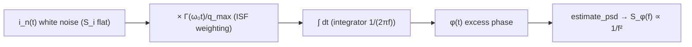

> **β**: This English translation is in beta — the Traditional-Chinese original is the authoritative version.

# Lab 06 — White Noise → 1/f² Phase Noise

This lab runs the entire causal chain — white noise → ISF weighting → integration → phase — in the cleanest possible numerical form, so you can **see with your own eyes** how a flat (white, frequency-independent) current-noise power spectrum gets colored by the oscillator — a "phase integrator" — into $1/f^2$ ($-20$ dB per decade) phase noise.

> **Physical intuition (conclusion first)**: the oscillator's phase has no restoring force (a force that pulls a perturbation back),
> so every phase step kicked in by noise **accumulates permanently** — this is an **integrator** (a system that
> time-integrates its input; infinite memory). The integrator's transfer-function magnitude is $1/(2\pi f)$,
> which is $1/(2\pi f)^2$ for a PSD. The input is flat (white noise), so the output is multiplied by $1/f^2$. **White in, $1/f^2$ out** —
> not because the noise source is $1/f^2$, but because phase is obtained by integration.

## 1. Learning objectives

- Verify by simulation the signature result of [P1]: white current noise becomes $1/f^2$ phase noise in an oscillator.
- Understand **where** the $-20$ dB/decade slope comes from (the integrator, not the noise source).
- Quantitatively verify the theoretical prediction $S_\phi(f)=\Gamma_{rms}^2 S_i/(q_{max}^2(2\pi f)^2)$.
- Understand the famous **factor-of-2** controversy: the clean time-domain derivation differs from [P1] Eq.(21) by a factor of 2,
  but the scaling and slope are entirely unaffected.

## 2. Mathematical model

The phase response is the LTV (linear time-variant) convolution expression [P1] Eq.(11), p.182:

$$
\phi(t)=\frac{1}{q_{max}}\int_{-\infty}^{t}\Gamma(\omega_0\tau)\,i_n(\tau)\,d\tau
$$

Split it into three blocks: first phase-weight the noise with the ISF, then integrate. The input is white current noise
with constant one-sided PSD (power spectral density) $S_i$ ($A^2/$Hz).

Integrating the white input, the clean time-domain result for the output phase PSD is

$$
S_\phi(f)=\frac{\Gamma_{rms}^2\,S_i}{q_{max}^2\,(2\pi f)^2}.
$$

- **Where it comes from**: after the ISF weights the white noise, the average power is scaled by $\Gamma_{rms}^2$ (the ISF's rms squared,
  see [P1] Eq.(20)), with $q_{max}^2$ in the denominator (normalization); the integrator is then
  $1/(j2\pi f)$ in the frequency domain, i.e. $1/(2\pi f)^2$ for the PSD.
- **Dimension check**: $\Gamma_{rms}^2$ is dimensionless, $S_i$ is $A^2/$Hz, $q_{max}^2$ is $C^2$,
  $(2\pi f)^2$ is $(\text{rad/s})^2=\text{s}^{-2}$. Overall
  $=\dfrac{A^2/\text{Hz}}{C^2\cdot\text{s}^{-2}}=\dfrac{A^2\,\text{s}^2}{C^2}\cdot\dfrac{1}{\text{Hz}}$.
  Since $C=A\cdot s$, $A^2 s^2/C^2=1$ (dimensionless = rad²), so $[S_\phi]=\text{rad}^2/\text{Hz}$ ✓.

This has the same scaling as the signature expression [P1] Eq.(21), p.185:

$$
\mathcal{L}\{\Delta\omega\}=10\log_{10}\!\left(\frac{\Gamma_{rms}^2}{q_{max}^2}\cdot\frac{\overline{i_n^2}/\Delta f}{4\,\Delta\omega^2}\right)
$$

> **factor-of-2 teaching note (must read)**: the clean time-domain derivation "white noise × ISF → integrate" gives
> $S_\phi=\Gamma_{rms}^2 S_i/(q_{max}^2(2\pi f)^2)$, corresponding to SSB
> $\mathcal{L}=\Gamma_{rms}^2 S_i/(2q_{max}^2\Delta\omega^2)$ (denominator $2$);
> whereas [P1] Eq.(21) is written with denominator $4\Delta\omega^2$. This factor of 2 comes from the **SSB (single-sideband) bookkeeping convention**
> — a famous minor controversy in the literature. It does **not** affect the $\Gamma_{rms}^2/q_{max}^2$ scaling,
> nor the $-20$ dB/decade slope — those are the physics. The simulation in this lab uses the clean time-domain version (denominator $(2\pi f)^2$),
> so the simulated curve sits on the time-domain theory line. See [white_noise_to_phase_noise](/03_isf_core_theory/white_noise_to_phase_noise).

## 3. Block diagram



## 4. Core Python code

Verbatim from `main()` in `simulations/lab_06_white_noise_phase_noise.py`: three steps
(generate white noise → ISF weighting → cumsum integration), then Welch-estimate the phase PSD and overlay the theory line.

```python
f0 = 1.0
fs = 256.0                 # 256 samples per period
n = 2 ** 20                # ~4096 periods -> good low-freq resolution
t = np.arange(n) / fs

q_max = 1.0
S_i = 1.0e-4               # one-sided white current PSD [A^2/Hz] (normalized)

# ISF and its rms
theta_grid = np.linspace(0, 2 * np.pi, 4000, endpoint=True)
Grms = gamma_rms(theta_grid, gamma_lc_ideal(theta_grid))  # = 1/sqrt(2)

# 1) white current noise
i_n = white_noise(n, psd=S_i, fs=fs, rng=RNG)
# 2) ISF weighting
g = gamma_lc_ideal(2 * np.pi * f0 * t) * i_n / q_max
# 3) integrate (cumulative) -> excess phase
dt = 1.0 / fs
phi = np.cumsum(g) * dt
phi = phi - np.mean(phi)   # remove the random-walk DC offset for PSD est.

# 4) estimate phase PSD
f, Sphi = estimate_psd(phi, fs, nperseg=2 ** 16)

# theory line
Sphi_theory = Grms ** 2 * S_i / (q_max ** 2 * (2 * np.pi * f) ** 2)
```

- Step 3, `np.cumsum(g) * dt`, discretizes the $\int d\tau$ in the convolution expression — **the cumulative sum is the integrator**,
  i.e. the source of the phase's "infinite memory".
- The ISF is the ideal-LC `gamma_lc_ideal` ($\Gamma(\theta)=-\sin\theta$), whose
  $\Gamma_{rms}=1/\sqrt2\approx0.707$ (because $\langle\sin^2\rangle=1/2$).

## 5. Full script path

`simulations/lab_06_white_noise_phase_noise.py`
(Dependencies: `white_noise` and `estimate_psd` from `simulations/common/noise_utils.py`;
`gamma_lc_ideal` and `gamma_rms` from `simulations/common/isf_utils.py`.)

How to run: `python scripts/run_all_sims.py` (generates all figures into `static/figures/`).

## 6. Parameter table

| Parameter | Variable | Value | Notes |
|---|---|---|---|
| Oscillation frequency | `f0` | $1.0$ (normalized) | the whole lab uses $f_0=1$ normalization; absolute dBc/Hz is computed in lab_08 |
| Sampling rate | `fs` | $256$ | 256 samples per period |
| Number of samples | `n` | $2^{20}=1{,}048{,}576$ | about 4096 periods, sufficient low-frequency resolution |
| Maximum charge swing | `q_max` | $1.0$ | for normalization |
| White current-noise PSD | `S_i` | $1\times10^{-4}$ | one-sided, frequency-independent |
| ISF | `gamma_lc_ideal` | $-\sin\theta$ | ideal LC, $\Gamma_{rms}=1/\sqrt2$ |
| PSD segment length | `nperseg` | $2^{16}=65{,}536$ | Welch segmentation, traded for low-frequency resolution |
| Random seed | `RNG` | `default_rng(2024)` | reproducible results |

## 7. Units table

| Quantity | Symbol | Unit (normalized lab) |
|---|---|---|
| Time | $t$ | s (in units of the "period" when $f_0=1$) |
| Current-noise PSD | $S_i$ | A²/Hz |
| Maximum charge swing | $q_{max}$ | C |
| ISF | $\Gamma(\omega_0\tau)$ | dimensionless |
| ISF rms | $\Gamma_{rms}$ | dimensionless |
| Excess phase | $\phi(t)$ | rad |
| Phase PSD | $S_\phi(f)$ | rad²/Hz |
| Offset frequency | $f$ | Hz (normalized, $f_0=1$) |

## 8. Simulation figure


## 9. How to read the figure

- **Blue line (simulated $S_\phi$)**: the PSD actually estimated from the simulated phase sequence. On log–log it is a straight
  line of slope $-2$ (dropping $20$ dB per decade), with the random fluctuations of a Welch estimate.
- **Black dashed line (theory)**: the analytic line $\Gamma_{rms}^2 S_i/(q_{max}^2(2\pi f)^2)$. The blue line **hugs** the black one
  — this is "white noise → $1/f^2$" confirmed numerically.
- **Red dotted line ($-20$ dB/dec guide)**: a pure slope reference confirming the slope is exactly $-2$.
- **Key point**: the input is **flat** ($S_i$ independent of $f$), yet the output is $1/f^2$. The extra $1/f^2$
  comes entirely from the integrator in step 3. Swapping in a different ISF shape only changes $\Gamma_{rms}$ (shifting the whole line up or down);
  the slope is always $-2$. The height of the whole line is set by $\Gamma_{rms}^2/q_{max}^2$, so enlarging $q_{max}$ (tank
  swing) is the main knob for lowering $1/f^2$ phase noise (design usage in [tank_swing](/06_design_insights/tank_swing)).

Plugging in this lab's numbers as a sanity check: $\Gamma_{rms}^2=0.5$, $S_i=10^{-4}$, $q_{max}=1$;
at $f=0.1$ (normalized), $2\pi f=0.6283$, $(2\pi f)^2=0.3948$,
$S_\phi=0.5\times10^{-4}/0.3948=1.27\times10^{-4}$ rad²/Hz. The height of the plot at $f=0.1$ should be of this order.

## 10. Corresponding paper equations/figures

- **Theory-line source**: the clean time-domain version $S_\phi=\Gamma_{rms}^2 S_i/(q_{max}^2(2\pi f)^2)$, matching the scaling of [P1] Eq.(21), p.185
  (differs by the factor-of-2, see the note above).
- **$\Gamma_{rms}$ definition**: [P1] Eq.(20), p.185, $\sum_{n=0}^{\infty}c_n^2=\frac{1}{\pi}\int_0^{2\pi}|\Gamma(x)|^2dx=2\Gamma_{rms}^2$.
- **White-noise sum expression**: [P1] Eq.(19), p.185, $\mathcal{L}=10\log_{10}\big(\frac{\overline{i_n^2}/\Delta f\sum_n c_n^2}{8q_{max}^2\Delta\omega^2}\big)$;
  substituting Eq.(20) to replace $\sum c_n^2$ with $2\Gamma_{rms}^2$ yields Eq.(21).
- **Concept-figure source**: paper_001 Eq.(21) (the factor-of-2 SSB note lives in this lab). Corresponding site figure
  `white_noise_phase_noise_psd.png`.

## 11. Limitations and approximations

- This is a **pedagogical toy model, not transistor-level**: the ISF is the analytic $-\sin\theta$ (ideal LC),
  not extracted from a real circuit. $q_{max}=1$, $f_0=1$ are normalized units, so there is **no absolute dBc/Hz**
  (for absolute values see [lab_08](/04_simulation_labs/lab_08_jitter_integration) and numerical_feeling example B).
- **Single white-noise source, stationary assumption**: real circuits have multiple sources and are **cyclostationary**
  (noise intensity varies periodically with the operating point); the correction is $\Gamma_{eff}=\Gamma\cdot\alpha$
  (see [effective_isf](/03_isf_core_theory/effective_isf)).
- **Small-angle approximation**: phase is treated as linearly superposable and small; for large phase excursions $\mathcal{L}\approx\frac12 S_\phi$ breaks down.
- **factor-of-2**: the simulation agrees with the time-domain theory line (denominator $(2\pi f)^2$) and differs from the $4\Delta\omega^2$
  of [P1] Eq.(21) by the SSB-bookkeeping factor of 2 — **slope and scaling unaffected**.
- **Numerical limits**: the low-frequency end is limited by the total simulated time ($\approx4096$ periods) and `nperseg`; the leftmost few points
  have larger statistical scatter, and the plot shows only the trustworthy region $f>0.02$.

## Key takeaways

- White noise (flat) → ISF weighting (scale by $\Gamma_{rms}^2/q_{max}^2$) → integrator (multiply by $1/(2\pi f)^2$) → $1/f^2$ phase noise.
- The $-20$ dB/decade slope comes from the **integrator**, independent of the noise source's spectral shape.
- The simulated PSD hugs the theory line $\Gamma_{rms}^2 S_i/(q_{max}^2(2\pi f)^2)$.
- The factor-of-2 is an SSB bookkeeping-convention difference; it changes neither the scaling nor the slope.

## Further reading

- Full theory derivation: [white_noise_to_phase_noise](/03_isf_core_theory/white_noise_to_phase_noise)
- Origin of the convolution/integrator: [convolution_derivation](/03_isf_core_theory/convolution_derivation)
- Next lab (1/f upconversion): [lab_07_flicker_noise_upconversion](/04_simulation_labs/lab_07_flicker_noise_upconversion)
- Converting to absolute jitter: [lab_08_jitter_integration](/04_simulation_labs/lab_08_jitter_integration)
- **Use in design/theory**: suppress $1/f^2$ with $q_{max}$ (tank swing) → [tank_swing](/06_design_insights/tank_swing)
