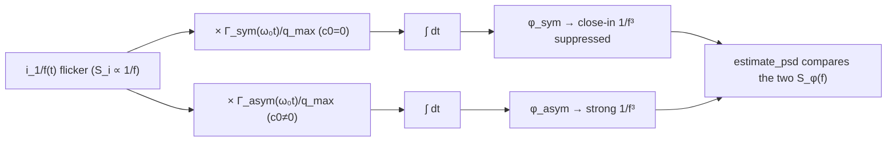

> **β**: This English translation is in beta — the Traditional-Chinese original is the authoritative version.

# Lab 07 — 1/f Noise Upconversion and ISF Symmetry

This lab answers the **most profitable** question in oscillator design: **why do some oscillators have terrible
close-in phase noise (a steep $1/f^3$) while others are clean?** The answer lies not in the noise source
but in the waveform's **symmetry** — specifically, in the ISF's DC Fourier coefficient $c_0$.

> **Physical intuition (conclusion first)**: the device's $1/f$ (flicker) noise is concentrated at **very low frequencies** (near DC).
> Whether it can "upconvert" (get moved next to the carrier and become phase noise) depends on whether the ISF has a DC component.
> The ISF's DC value is $c_0/2$. If the waveform is **perfectly symmetric** (rise and fall mirror-symmetric), $c_0=0$:
> near-DC $1/f$ noise, multiplied by an ISF that "averages to zero", cancels and **does not upconvert**;
> if the waveform is **asymmetric**, $c_0\neq0$: the near-DC noise survives, and the integrator then colors it into a steep, tall $1/f^3$.
> **Symmetry is a free lunch**: making the waveform symmetric cuts $1/f^3$ phase noise for free.

## 1. Learning objectives

- Understand how device $1/f$ noise "upconverts" into close-in phase noise.
- Compare, by simulation, the close-in behavior of a **symmetric ISF ($c_0=0$)** and an **asymmetric ISF ($c_0\neq0$)**.
- Confirm with your own eyes: $c_0=0$ → close-in $1/f^3$ suppressed; $c_0\neq0$ → a steep $1/f^3$ appears.
- Connect this phenomenon to [P1] Eq.(23) (the $1/f^3$ expression) and Eq.(24) (the $1/f^3$ corner).

## 2. Mathematical model

The one-sided PSD of device flicker current noise has a $1/f$ shape ([P1] Eq.(22), p.185):

$$
\overline{i_{n,1/f}^2}=\overline{i_n^2}\cdot\frac{\omega_{1/f}}{\Delta\omega}
$$

- **Meaning**: $\omega_{1/f}$ is the device's $1/f$ corner (corner frequency); below it the noise goes as $1/f$, above it the noise approaches white.
- **Units**: $\overline{i_n^2}$ is $A^2/$Hz; $\omega_{1/f}/\Delta\omega$ is dimensionless, so the whole expression is still $A^2/$Hz ✓.

Feeding this $1/f$ noise into the ISF's DC channel and integrating gives the close-in phase noise ([P1] Eq.(23), p.185):

$$
\mathcal{L}\{\Delta\omega\}=10\log_{10}\!\left(\frac{c_0^2}{q_{max}^2}\cdot\frac{\overline{i_n^2}/\Delta f}{8\,\Delta\omega^2}\cdot\frac{\omega_{1/f}}{\Delta\omega}\right)
$$

- **Where the slope comes from**: $\frac{1}{\Delta\omega^2}$ (integrator, $-20$ dB/dec) $\times\frac{1}{\Delta\omega}$ ($1/f$ noise source,
  $-10$ dB/dec) $=\frac{1}{\Delta\omega^3}$, i.e. **$1/f^3$ ($-30$ dB/dec)**.
- **$c_0$ is the switch**: the whole expression is multiplied by $c_0^2$. $c_0=0$ → this $1/f^3$ term **vanishes** (is suppressed),
  and close-in falls back to white-noise-dominated $1/f^2$; $c_0\neq0$ → $1/f^3$ appears with height proportional to $c_0^2$.

The corner frequency where the $1/f^3$ and $1/f^2$ segments intersect ([P1] Eq.(24), p.185):

$$
\Delta\omega_{1/f^3}=\omega_{1/f}\cdot\frac{c_0^2}{2\,\Gamma_{rms}^2}\approx\omega_{1/f}\left(\frac{c_0}{c_1}\right)^2
$$

- **Design implication**: shrink $c_0$ (waveform asymmetry) and the corner moves left — the close-in $1/f^3$ region narrows.
- **Notation trap**: $c_0$ is a Fourier **coefficient**; the ISF's DC **value** is $c_0/2$ (see [notation](/00_overview/notation)).

> In this lab's toy formulation, the asymmetric ISF is `gamma_asym = cos(theta) + 0.5`, DC value $=0.5$,
> corresponding to $c_0=1.0$; the symmetric ISF is `gamma_sym = cos(theta)`, DC value $=0$, $c_0=0$.
> Using `cos` instead of the LC's $-\sin$ simply makes the "symmetric basis + DC shift" contrast more intuitive; both are toys.

## 3. Block diagram



## 4. Core Python code

Verbatim from `simulations/lab_07_flicker_noise.py`: the same flicker-noise record passes separately through the symmetric and asymmetric ISFs,
then each is integrated and its PSD estimated. Note that `phase_from_isf` is exactly "ISF weighting → cumsum integration".

```python
def phase_from_isf(i_n, gamma_vals, q_max, fs):
    g = gamma_vals * i_n / q_max
    phi = np.cumsum(g) / fs
    return phi - np.mean(phi)


def main():
    f0 = 1.0
    fs = 256.0
    n = 2 ** 20
    t = np.arange(n) / fs
    q_max = 1.0

    theta = 2 * np.pi * f0 * t
    gamma_sym = np.cos(theta)            # c0 = 0
    gamma_asym = np.cos(theta) + 0.5     # c0 = 1.0 (DC = 0.5)

    i_flicker = flicker_noise(n, fs, k_flicker=1e-4, rng=RNG)

    phi_sym = phase_from_isf(i_flicker, gamma_sym, q_max, fs)
    phi_asym = phase_from_isf(i_flicker, gamma_asym, q_max, fs)

    f, S_sym = estimate_psd(phi_sym, fs, nperseg=2 ** 16)
    _, S_asym = estimate_psd(phi_asym, fs, nperseg=2 ** 16)
```

- The **only difference** between the two ISFs is that `+ 0.5` (DC shift). Everything else is identical — so any difference between the two output PSDs
  **can only** come from $c_0$. This turns "is $c_0$ the switch for $1/f^3$?" into a controlled experiment.

## 5. Full script path

`simulations/lab_07_flicker_noise.py`
(Dependencies: `flicker_noise` and `estimate_psd` from `simulations/common/noise_utils.py`.
`flicker_noise` uses frequency-domain shaping: white noise → rFFT → multiply by $1/\sqrt{f}$ → irFFT, producing $S\propto1/f$.)

How to run: `python scripts/run_all_sims.py`.

## 6. Parameter table

| Parameter | Variable | Value | Notes |
|---|---|---|---|
| Oscillation frequency | `f0` | $1.0$ (normalized) | $f_0=1$ normalization |
| Sampling rate | `fs` | $256$ | 256 points per period |
| Number of samples | `n` | $2^{20}$ | about 4096 periods, sufficient low-frequency resolution |
| Maximum charge swing | `q_max` | $1.0$ | normalization |
| Flicker strength | `k_flicker` | $1\times10^{-4}$ | $S_i\approx k_{flicker}/f$ |
| Symmetric ISF | `gamma_sym` | $\cos\theta$ | $c_0=0$, DC$=0$ |
| Asymmetric ISF | `gamma_asym` | $\cos\theta+0.5$ | $c_0=1.0$, DC$=0.5$ |
| Random seed | `RNG` | `default_rng(7)` | reproducible results |

## 7. Units table

| Quantity | Symbol | Unit |
|---|---|---|
| Flicker current-noise PSD | $\overline{i_{n,1/f}^2}$ | A²/Hz |
| Device 1/f corner | $\omega_{1/f}$ | rad/s |
| ISF DC coefficient | $c_0$ | dimensionless |
| ISF 1st harmonic | $c_1$ | dimensionless |
| ISF rms | $\Gamma_{rms}$ | dimensionless |
| Phase PSD | $S_\phi(f)$ | rad²/Hz |
| Offset frequency | $f$ | Hz (normalized) |
| 1/f³ corner | $\Delta\omega_{1/f^3}$ | rad/s |

## 8. Simulation figure


## 9. How to read the figure

- **Red line (asymmetric, $c_0\neq0$)**: in the close-in (low-offset) region a tall, steep curve appears,
  with slope near $-30$ dB/dec ($1/f^3$). The black dotted line is a pure $1/f^3$ slope reference; the red line hugs it.
- **Green line (symmetric, $c_0=0$)**: clearly **much lower** in the close-in region, with a gentler slope (near $1/f^2$,
  gray dashed reference). $1/f^3$ is suppressed — visual proof that "waveform symmetry cuts close-in noise for free".
- **The two lines converge at higher offsets**: far from the carrier, the gap between $1/f^3$ and $1/f^2$ shrinks, because flicker
  noise itself is already weak at high frequency.
- **Key point**: the only difference between the two ISFs is $c_0$. The huge close-in gap between red and green is **caused entirely by $c_0$**.
  As $c_0\to0$, the red line collapses onto the green one.

## 10. Corresponding paper equations/figures

- **Flicker noise source**: [P1] Eq.(22), p.185, $\overline{i_{n,1/f}^2}=\overline{i_n^2}\cdot\omega_{1/f}/\Delta\omega$.
- **$1/f^3$ close-in**: [P1] Eq.(23), p.185; the prefactor $c_0^2$ is exactly this lab's switch.
- **$1/f^3$ corner**: [P1] Eq.(24), p.185, $\Delta\omega_{1/f^3}=\omega_{1/f}\,c_0^2/(2\Gamma_{rms}^2)\approx\omega_{1/f}(c_0/c_1)^2$.
- **Concept-figure source**: paper_001 Eqs (23),(24); the symmetry argument of paper_002. Corresponding site figure
  `flicker_upconversion_symmetric_vs_asymmetric.png`. For the geometric meaning of $c_0$ see also
  `symmetric_vs_asymmetric_isf_c0.png` in [lab_05](/04_simulation_labs/lab_05_isf_fourier_coefficients).

## 11. Limitations and approximations

- **Pedagogical toy model, not transistor-level**: the two ISFs (`cos`, `cos+0.5`) are teaching toys,
  not extracted from real circuits. The `+0.5` is an artificially set $c_0$, purely for a controlled comparison.
- **Normalized units**: $f_0=1$, $q_{max}=1$, `k_flicker` on an arbitrary scale — **no absolute dBc/Hz**.
  The relative shape of the curves (slopes, red–green gap) is the teaching point.
- **Flicker generation is approximate**: `flicker_noise` uses frequency-domain $1/\sqrt f$ shaping and relies on `f_low` to tame the divergent DC bin;
  accuracy at very low frequency is limited by `f_low` and the total record length.
- **Stationary-noise assumption**: real flicker upconversion also involves cyclostationary modulation
  (the device leaks noise only while conducting); the full treatment uses $\Gamma_{eff}=\Gamma\cdot\alpha$
  (see [effective_isf](/03_isf_core_theory/effective_isf)); this lab demonstrates only the $c_0$ mechanism.
- **Welch low-frequency scatter**: the close-in region has few points and large statistical scatter; the plot shows only the trustworthy segment $f>0.02$.

## Key takeaways

- Device $1/f$ noise is concentrated near DC; whether it upconverts into phase noise is determined by the ISF's DC component ($c_0/2$).
- $c_0\neq0$ → close-in $1/f^3$ ($-30$ dB/dec); $c_0=0$ → suppressed, falls back to $1/f^2$.
- The $1/f^3$ height is proportional to $c_0^2$; the corner $\propto c_0^2/\Gamma_{rms}^2$.
- Design lesson: making the waveform symmetric (suppressing $c_0$) is a free way to lower close-in phase noise.

## Further reading

- Full theory derivation: [flicker_noise_upconversion](/03_isf_core_theory/flicker_noise_upconversion)
- Fourier geometry of $c_0$: [lab_05_fourier_isf](/04_simulation_labs/lab_05_isf_fourier_coefficients)
- Previous lab (white noise → 1/f²): [lab_06_white_noise_phase_noise](/04_simulation_labs/lab_06_white_noise_phase_noise)
- **Use in design/theory**: make the waveform symmetric (suppress $c_0$) to lower close-in $1/f^3$ → [symmetry](/06_design_insights/symmetry)
