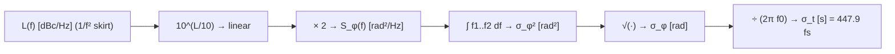

> **β**: This English translation is in beta — the Traditional-Chinese original is the authoritative version.

# Lab 08 — rms Jitter by Integrating L(f)

This lab turns something you see on every datasheet — the **single-sideband phase-noise curve** $\mathcal{L}(f)$ (dBc/Hz)
— into the number designers actually care about: **rms timing jitter** $\sigma_t$.
We use a canonical scenario ($f_0=5$ GHz, $\mathcal{L}(1\text{MHz})=-100$ dBc/Hz, $1/f^2$ slope,
integrated 1→100 MHz) and make the **numerical integration** and the **analytic closed form** agree digit by digit: $\sigma_t=447.9$ fs.

> **Physical intuition (conclusion first)**: phase noise is "how much phase power density sits at each offset frequency";
> jitter is "add it all up, take the square root, convert to time". So going from $\mathcal{L}(f)$ to $\sigma_t$
> is three things: (1) convert dBc/Hz back to linear and multiply by 2 to recover $S_\phi$; (2) integrate over offset frequency to get the phase variance;
> (3) take the square root and divide by $2\pi f_0$ to convert to time. For a $1/f^2$ shape, **the integral is dominated by the lower limit $f_1$**
> — "where you start integrating" matters far more than "how high you go".

## 1. Learning objectives

- Convert $\mathcal{L}(f)$ (dBc/Hz) step by step into rms phase $\sigma_\phi$ and rms jitter $\sigma_t$.
- Build a feel for the 5 GHz conversion: $-100$ dBc/Hz @ 1 MHz, $1/f^2$, integrated 1→100 MHz → **about 448 fs**.
- Verify **numerical integration = analytic closed form** ($1/f^2$ has a closed form).
- Understand why $1/f^2$ jitter is dominated by the **lower integration limit**.

## 2. Mathematical model

**Step 1: $\mathcal{L}$ → $S_\phi$.** Under the small-angle / single-sideband approximation (canonical formula 16):

$$
\mathcal{L}(\Delta f)\approx\tfrac12 S_\phi(\Delta f)\;\Rightarrow\;S_\phi(f)=2\cdot10^{\mathcal{L}(f)/10}.
$$

**Step 2: write the $1/f^2$ shape** (anchored at $f_{ref}=1$ MHz, canonical example C):

$$
S_\phi(f)=S_\phi(f_{ref})\left(\frac{f_{ref}}{f}\right)^2.
$$

**Step 3: integrate to get the phase variance** (canonical formula 18):

$$
\sigma_\phi^2=\int_{f_1}^{f_2}S_\phi(f)\,df.
$$

For the $1/f^2$ shape this integral has a closed form ($\int f^{-2}df=-1/f$):

$$
\sigma_\phi^2=S_\phi(f_{ref})\,f_{ref}^2\!\int_{f_1}^{f_2}\frac{df}{f^2}=S_\phi(f_{ref})\,f_{ref}^2\left(\frac{1}{f_1}-\frac{1}{f_2}\right).
$$

**Step 4: convert to rms jitter** (canonical formula 19):

$$
\sigma_t=\frac{\sigma_\phi}{2\pi f_0}=\frac{1}{2\pi f_0}\sqrt{\int_{f_1}^{f_2}S_\phi(f)\,df}.
$$

- **Dimension check (step 4)**: $\sigma_\phi$ is rad, $2\pi f_0$ is rad/s,
  $[\text{rad}]/[\text{rad/s}]=[\text{s}]$ ✓.
- **Lower-limit dominance**: $\big(\tfrac1{f_1}-\tfrac1{f_2}\big)=10^{-6}-10^{-8}=9.9\times10^{-7}$,
  of which $1/f_1=10^{-6}$ contributes 99%. So the integral depends almost entirely on $f_1$.

Substituting the canonical numbers digit by digit (identical to numerical_feeling example C):

$$
\begin{aligned}
S_\phi(1\text{MHz})&=2\times10^{-100/10}=2\times10^{-10}\ \text{rad}^2/\text{Hz},\\
\sigma_\phi^2&=2\times10^{-10}\,(10^6)^2\,(10^{-6}-10^{-8})=200\times9.9\times10^{-7}=1.98\times10^{-4}\ \text{rad}^2,\\
\sigma_\phi&=1.407\times10^{-2}\ \text{rad}=14.07\ \text{mrad},\\
\sigma_t&=\frac{1.407\times10^{-2}}{2\pi\times5\times10^{9}}=4.479\times10^{-13}\ \text{s}=447.9\ \text{fs}.
\end{aligned}
$$

## 3. Block diagram



## 4. Core Python code

Verbatim from `main()` in `simulations/lab_08_jitter_integration.py`: first build the $1/f^2$ curve with
`leeson_one_over_f2`, then integrate numerically with `integrate_rms_jitter`,
and finally check against the hand-computed $1/f^2$ closed form.

```python
import numpy as np
from simulations.common.noise_utils import leeson_one_over_f2, integrate_rms_jitter

f0 = 5e9
f_ref = 1e6
L_ref = -100.0  # dBc/Hz
f1, f2 = 1e6, 100e6

f = np.logspace(np.log10(f1), np.log10(f2), 4000)
L = leeson_one_over_f2(f, L_ref, f_ref)

# numerical integration
sigma_t, sigma_phi = integrate_rms_jitter(f, L, f0, f1, f2)

# analytic closed form (1/f^2)
L_ref_lin = 10 ** (L_ref / 10)
sigma_phi2_analytic = 2 * L_ref_lin * f_ref ** 2 * (1 / f1 - 1 / f2)
sigma_phi_analytic = np.sqrt(sigma_phi2_analytic)
sigma_t_analytic = sigma_phi_analytic / (2 * np.pi * f0)

print(round(sigma_t * 1e15, 1))    # -> 447.9   (sigma_t in fs)
print(round(sigma_phi * 1e3, 2))   # -> 14.07   (sigma_phi in mrad)
```

The underlying function `integrate_rms_jitter` (`noise_utils.py`) implements exactly steps 1, 3, and 4:

```python
l_linear   = 10 ** (l_dbc_per_hz[mask] / 10)   # dBc/Hz -> linear
s_phi      = 2 * l_linear                       # L ~= 0.5 * S_phi
sigma_phi  = np.sqrt(_trapz(s_phi, f[mask]))    # integrate + square root
sigma_t    = sigma_phi / (2 * np.pi * f0)        # convert to time
```

- The script prints `sigma_phi (numeric) ≈ sigma_phi (analytic)` and `sigma_t ≈ 447.9 fs`;
  the numerical and analytic values agree **digit by digit** (the only difference is the negligible discretization error of logspace sampling and trapezoidal integration).

## 5. Full script path

`simulations/lab_08_jitter_integration.py`
(Dependencies: `leeson_one_over_f2` and `integrate_rms_jitter` from `simulations/common/noise_utils.py`.)

How to run: `python scripts/run_all_sims.py`.

## 6. Parameter table

| Parameter | Variable | Value | Notes |
|---|---|---|---|
| Oscillation frequency | `f0` | $5\times10^{9}$ Hz | 5 GHz carrier |
| Reference offset | `f_ref` | $1\times10^{6}$ Hz | 1 MHz, anchor point |
| Reference phase noise | `L_ref` | $-100$ dBc/Hz | single datasheet-style number |
| Lower integration limit | `f1` | $1\times10^{6}$ Hz | 1 MHz (dominates the integral) |
| Upper integration limit | `f2` | $100\times10^{6}$ Hz | 100 MHz |
| Number of sample points | — | $4000$ (logspace) | log-uniform sampling |
| Slope | — | $1/f^2$ ($-20$ dB/dec) | pure skirt |

## 7. Units table

| Quantity | Symbol | Unit | Result in this lab |
|---|---|---|---|
| Phase noise | $\mathcal{L}(f)$ | dBc/Hz | $-100$ @ 1 MHz |
| Phase PSD | $S_\phi(f)$ | rad²/Hz | $2\times10^{-10}$ @ 1 MHz |
| Phase variance | $\sigma_\phi^2$ | rad² | $1.98\times10^{-4}$ |
| rms phase | $\sigma_\phi$ | rad | $14.07$ mrad |
| rms jitter | $\sigma_t$ | s | $447.9$ fs |
| Offset frequency | $f$ | Hz | 1–100 MHz |
| Carrier frequency | $f_0$ | Hz | 5 GHz |

## 8. Simulation figure


## 9. How to read the figure

- **Blue line ($L(f)$)**: a straight line on semilog (logarithmic x-axis), because $1/f^2$ has a constant slope in dBc/Hz vs log-f
  ($-20$ dB/dec). The red dot marks the anchor point $\mathcal{L}(1\text{MHz})=-100$ dBc/Hz.
- **Blue shading**: illustrates "where the phase power sits over offset frequency". Under $1/f^2$, **the part closest to $f_1$
  contributes the most** — the visual rendering of "lower-limit dominance".
- **Text box**: lists the integration results $\sigma_\phi=14.07$ mrad, $\sigma_t=447.9$ fs, and notes that the analytic value
  equals the numerical one, proving the closed form matches the trapezoidal integration.
- **How to use it**: take any datasheet $\mathcal{L}(f)$ curve, integrate the area under the blue line, take the square root,
  divide by $2\pi f_0$, and you have the jitter. Remember the 5 GHz conversion point: $\approx448$ fs in this example.
  With phase noise 20 dB better ($-120$ dBc/Hz @ 1 MHz), the power is 100× smaller and $\sigma$ 10× smaller → $\approx45$ fs.

## 10. Corresponding paper equations/figures

- This lab uses the **standard jitter integration** (canonical formulas 16–19), general DSP/communications practice — **not among the five source PDFs**,
  supplemented from standard references; consistent in spirit with the jitter discussion in [P2] (period/accumulated jitter).
- $\mathcal{L}\approx\frac12 S_\phi$: canonical formula 16 (small-angle approximation).
- Phase variance: canonical formula 18, $\sigma_\phi^2=\int_{f_1}^{f_2}S_\phi df$.
- rms jitter: canonical formula 19, $\sigma_t=\frac{1}{2\pi f_0}\sqrt{\int S_\phi df}$.
- Concept-figure source: standard jitter integration / SerDes practice. Corresponding site figure
  `phase_noise_to_jitter_integration.png`, also cited in numerical_feeling example C,
  [psd_phase_noise_jitter](/02_foundations/psd_phase_noise_jitter), and
  [serdes_clocking_connection](/06_design_insights/serdes_clocking_connection).

## 11. Limitations and approximations

- **Small-angle approximation** $\mathcal{L}\approx\frac12 S_\phi$: breaks down at large phase excursions; here $\sigma_\phi=14$ mrad $\ll1$ rad,
  so the approximation is excellent.
- **Pure $1/f^2$ skirt assumption**: real curves also have $1/f^3$ (close-in, see [lab_07](/04_simulation_labs/lab_07_flicker_noise_upconversion))
  and a far-out white floor (noise floor). This lab takes only a single $1/f^2$ segment — a teaching simplification.
  This part is **not a toy** (the integration flow itself is real engineering practice), but the $L(f)$ shape is idealized.
- **Sensitivity to the integration range**: with $1/f^2$, the lower limit $f_1$ dominates; changing $f_1$ visibly changes $\sigma_t$, while the upper limit matters little.
  In practice $f_1$, $f_2$ must be chosen per application (PLL loop bandwidth, data rate).
- **Numerical = analytic**: the two differ only by the discretization error (logspace + trapezoidal rule), negligible in this setup.

## Key takeaways

- $\mathcal{L}$ (dBc/Hz) → linear → $\times2$ gives $S_\phi$ → integrate → square root → $\div(2\pi f_0)$ = rms jitter.
- Canonical: 5 GHz, $-100$ dBc/Hz @ 1 MHz, $1/f^2$, integrated 1→100 MHz → $\sigma_\phi=14.07$ mrad, $\sigma_t=447.9$ fs.
- $1/f^2$ jitter is dominated by the **lower integration limit** (the $1/f_1$ term).
- The numerical integration agrees digit by digit with the $1/f^2$ analytic closed form.

## Further reading

- Same problem, mental-math version: [numerical_feeling](/04_simulation_labs/numerical_feeling) (example C)
- PSD and jitter types: [psd_phase_noise_jitter](/02_foundations/psd_phase_noise_jitter)
- Origin of close-in $1/f^3$: [lab_07_flicker_noise_upconversion](/04_simulation_labs/lab_07_flicker_noise_upconversion)
- **Use in design/theory**: how rms jitter sets the eye and BER → [serdes_clocking_connection](/06_design_insights/serdes_clocking_connection)
