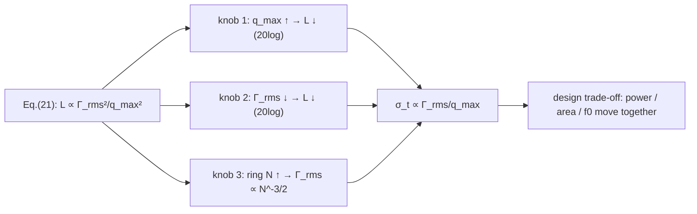

> **β**: This English translation is in beta — the Traditional-Chinese original is the authoritative version.

# Lab 09 — Design trade-off scaling synthesis

> **Breadcrumb**: [Simulation labs](/04_simulation_labs/numerical_feeling) › Noise & jitter › **This page (design trade-offs intro)**. Upstream: [lab_06](/04_simulation_labs/lab_06_white_noise_phase_noise), [lab_08](/04_simulation_labs/lab_08_jitter_integration); advanced version: [lab_17](/04_simulation_labs/lab_17_design_tradeoffs).

The first eight labs exercised each mechanism one at a time. This synthesis lab introduces no new simulation; instead it treats [P1] Eq.(21)
— the signature equation — as a **map of design knobs**: holding everything else fixed, separately sweep $q_{max}$, $\Gamma_{rms}$, and
the ring stage count $N$, and watch how the phase noise $\mathcal{L}$ and the rms jitter $\sigma_t$ move.
Throughout we use the canonical numbers (spec Section 8) for back-of-envelope arithmetic, building the reflex of "turn this knob, gain that many dB".

> **Physical intuition (conclusion first)**: $1/f^2$ phase noise $\propto\Gamma_{rms}^2/q_{max}^2$.
> There are only two broad roads to lower phase noise: **make the signal charge $q_{max}$ larger** (store more energy, so the noise is relatively smaller),
> or **make the ISF $\Gamma_{rms}$ smaller** (make the waveform insensitive to noise).
> Both are **$20\log_{10}$ relationships**: doubling $q_{max}$ → phase noise $-6$ dB;
> halving $\Gamma_{rms}$ → also $-6$ dB. A ring oscillator's $N$ moves two things at once — watch the net effect carefully.

## 1. Learning objectives

- Read [P1] Eq.(21) as a scaling law and build design intuition for $q_{max}$, $\Gamma_{rms}$, and $N$.
- Use the canonical numbers to compute "how many dB / how many fs one knob buys".
- Understand the two-sided nature of the ring oscillator's $N$ ($\Gamma_{rms}\propto N^{-3/2}$, but power/area grow too).
- Connect the scaling conclusions to the design-insight pages.

## 2. Mathematical model

The starting point is [P1] Eq.(21), p.185:

$$
\mathcal{L}\{\Delta\omega\}=10\log_{10}\!\left(\frac{\Gamma_{rms}^2}{q_{max}^2}\cdot\frac{\overline{i_n^2}/\Delta f}{4\,\Delta\omega^2}\right)
$$

Expand the logarithm into "additive knobs" (fixing $\Delta\omega$ and $S_i=\overline{i_n^2}/\Delta f$):

$$
\mathcal{L}=20\log_{10}\Gamma_{rms}-20\log_{10}q_{max}+10\log_{10}S_i-20\log_{10}(2\Delta\omega)+\text{const}.
$$

- **How to read it**: every knob enters as $20\log_{10}$ (voltage/charge-like) or $10\log_{10}$ (power-like).
  Both $q_{max}$ and $\Gamma_{rms}$ enter through $20\log_{10}$, so "double/halve = $\pm6$ dB".

Jitter and phase noise share the same origin: for the $1/f^2$ skirt, $\sigma_t=\frac{1}{2\pi f_0}\sqrt{\int S_\phi df}$
(spec formula 19), and $S_\phi\propto\Gamma_{rms}^2/q_{max}^2$, so

$$
\sigma_t\;\propto\;\frac{\Gamma_{rms}}{q_{max}}\qquad(\text{固定}f_0,\ S_i,\ \text{積分範圍}).
$$

- **The bridge from dB to jitter**: $\mathcal{L}$ down $6$ dB (power $\times\frac14$) → $\sigma_t$ halves (the $\sqrt{}$).

Ring oscillator: [P2] gives two scalings — more stages make each stage's ISF sharper but its rms smaller ([P2] Eq.(16), p.794):

$$
\Gamma_{rms}=\sqrt{\dfrac{2\pi^2}{3\eta^3}}\;\dfrac{1}{N^{1.5}}\quad(\text{[P2] Eq.(16), p.794 — v7 re-verified: the square root covers only the constant, }\Gamma_{rms}\propto N^{-3/2}\text{; }\approx4/N^{1.5}\text{ at η=0.75, the solid line in [P2] Fig.8}),\qquad f_0=\frac{1}{2N\tau_D}\ \text{[P2] Eq.(15)}.
$$

- Looking at phase noise alone, $N$ from 5 → 15 ($\times3$): $\Gamma_{rms}$ is multiplied by $3^{-3/2}=0.192$,
  a $\mathcal{L}$ change of $20\log_{10}0.192=-14.3$ dB. **But** more stages → power, area, and the $q_{max}$ allocation all change,
  and $f_0$ drops (unless $\tau_D$ shrinks), so this is a toy scaling that "looks at $\Gamma_{rms}$ in isolation", not a net design conclusion.

## 3. Block diagram



## 4. Core Python code

This lab produces no new figure; the scaling comes straight from back-of-envelope use of [P1] Eq.(21). The snippet below (following
the conventions of `simulations/lab_08_jitter_integration.py`) shows how to turn knob changes into dB and fs
so you can sweep the parameters yourself:

```python
import math

def L_dbc(Grms, qmax, Si, df):
    """Hajimiri-Lee Eq.(21): 1/f^2 SSB phase noise [dBc/Hz]."""
    dw = 2 * math.pi * df
    return 10 * math.log10((Grms**2 / qmax**2) * (Si / (4 * dw**2)))

# canonical baseline (spec example B)
f0, df, Si = 5e9, 1e6, 1e-24
base = L_dbc(Grms=0.5, qmax=1e-12, Si=Si, df=df)   # -148.0 dBc/Hz

print("baseline           :", round(base, 1), "dBc/Hz")
print("q_max x2           :", round(L_dbc(0.5, 2e-12, Si, df) - base, 1), "dB")  # -6.0
print("Gamma_rms /2       :", round(L_dbc(0.25, 1e-12, Si, df) - base, 1), "dB") # -6.0
# ring N: Gamma_rms ~ N^-1.5 ([P2] Eq.(16), p.794, re-verified v7: sqrt covers only the constant); show isolated scaling
for N in (5, 15, 45):
    rel = (N / 5.0) ** -1.5
    print(f"N={N:2d} Gamma_rms rel={rel:.3f}  dL={20*math.log10(rel):+.1f} dB")

# jitter scales as Gamma_rms / q_max  ->  -6 dB phase noise = sigma_t / 2
```

- `L_dbc` is not the same thing as lab_08's `integrate_rms_jitter`: lab_08 **integrates** jitter out of $\mathcal{L}$;
  here we go the other way — use Eq.(21) to **generate** $\mathcal{L}$, then infer jitter from the scaling. The two pages are forward and inverse operations of each other.

## 5. Full script path

This lab is a synthesis analysis with **no dedicated script**. The calculations it cites come from:
`simulations/lab_06_white_noise_phase_noise.py` (simulation evidence for the $\Gamma_{rms}^2/q_{max}^2$ scaling),
`simulations/lab_03_ring_toy_model.py` (LC vs ring ISF and the $N$ scaling),
`simulations/lab_08_jitter_integration.py` ($\mathcal{L}\to\sigma_t$).
The back-of-envelope snippet above can be saved as a small standalone script for your own parameter sweeps.

## 6. Parameter table

| Parameter | Symbol | Canonical value | Role |
|---|---|---|---|
| Carrier frequency | $f_0$ | $5$ GHz | Fixed |
| Offset | $\Delta f$ | $1$ MHz | Fixed (evaluation point) |
| Current noise PSD | $S_i$ | $1\times10^{-24}$ A²/Hz | Fixed (single white source) |
| Maximum charge swing | $q_{max}$ | $1$ pC (baseline) | **Knob 1**, swept over $0.5,1,2$ pC |
| ISF rms | $\Gamma_{rms}$ | $0.5$ (baseline) | **Knob 2**, swept over $0.25,0.5$ |
| Ring stage count | $N$ | $5$ (baseline) | **Knob 3**, swept over $5,15,45$ |
| Baseline phase noise | $\mathcal{L}$ | $-148.0$ dBc/Hz | From Eq.(21) (= spec example B) |

## 7. Unit table

| Quantity | Symbol | Unit |
|---|---|---|
| Maximum charge swing | $q_{max}$ | C |
| ISF rms | $\Gamma_{rms}$ | Dimensionless |
| Ring stage count | $N$ | Dimensionless |
| Phase noise | $\mathcal{L}$ | dBc/Hz |
| rms jitter | $\sigma_t$ | s |
| Current noise PSD | $S_i$ | A²/Hz |

## 8. Scaling table (back-of-envelope, toy scaling)

Take the canonical baseline $\mathcal{L}=-148.0$ dBc/Hz ($q_{max}=1$ pC, $\Gamma_{rms}=0.5$,
$S_i=10^{-24}$, 5 GHz @ 1 MHz) as the $0$ dB reference. $\sigma_t\propto\Gamma_{rms}/q_{max}$.

| Knob change | $\mathcal{L}$ change | $\sigma_t$ change | Physical reason |
|---|---|---|---|
| $q_{max}\times2$ ($\to2$ pC) | $-6.0$ dB | $\times0.5$ | $-20\log_{10}q_{max}$; larger signal charge, relatively smaller noise |
| $q_{max}\times0.5$ ($\to0.5$ pC) | $+6.0$ dB | $\times2$ | Same as above, reversed |
| $\Gamma_{rms}\times0.5$ ($\to0.25$) | $-6.0$ dB | $\times0.5$ | $+20\log_{10}\Gamma_{rms}$; waveform insensitive to noise |
| Ring $N:5\to15$ ($\times3$) | $-14.3$ dB | $\times0.192$ | $\Gamma_{rms}\propto N^{-3/2}$ (in isolation; [P2] Eq.(16), p.794, v7 re-verified) |
| Ring $N:5\to45$ ($\times9$) | $-28.6$ dB | $\times0.037$ | Same as above; but power/area/$f_0$ change too |

**Back-of-envelope example**: doubling $q_{max}$ from 1 pC to 2 pC changes $\mathcal{L}$ by
$20\log_{10}(1/2)=-6.0$ dB → $-154.0$ dBc/Hz; jitter halves via the $\sqrt{}$.
Apply the same $-6$ dB move to lab_08's $447.9$ fs (that was the $-100$ dBc/Hz scenario) and it drops to $\approx224$ fs.

## 9. How to read the figures (reusing existing figures)

**Figure 1: simulation evidence for the $\Gamma_{rms}^2/q_{max}^2$ scaling.** In lab_06's white-noise PSD figure, swapping the ISF for a different
$\Gamma_{rms}$ (or changing $q_{max}$) merely **shifts the whole $1/f^2$ line up or down**, without changing its slope — the visual version of the
scaling table's "turn a knob = shift by dB".


**Figure 2: LC vs ring ISF shape and $N$.** lab_03's comparison figure: the ring's ISF sensitivity is concentrated at the transitions;
the larger $N$, the sharper each stage's ISF but the smaller its rms ($\Gamma_{rms}\propto N^{-3/2}$). This explains where knob 3 in the scaling table
comes from — and reminds you it is an isolated scaling.


- **How to use the two figures**: Figure 1 tells you "the $q_{max}$/$\Gamma_{rms}$ knobs = a vertical shift";
  Figure 2 tells you "how the ring's $\Gamma_{rms}$ varies with $N$". Together they form the design map.

## 10. Corresponding paper equations/figures

- **Main scaling**: [P1] Eq.(21), p.185, $\mathcal{L}\propto\Gamma_{rms}^2/q_{max}^2$.
- **Parseval / $\Gamma_{rms}$**: [P1] Eq.(20), p.185.
- **Ring $\Gamma_{rms}$ scaling**: [P2] Eq.(16), p.794 (v7 re-verified: the square root covers only the constant,
  $\Gamma_{rms}\propto N^{-3/2}$; the body text's $4/N^{1.5}$ at η=0.75 and App. B Eq.(55) triple-confirm this. v3 had misread it as $N^{-3/4}$).
- **Ring frequency**: [P2] Eq.(15), p.794, $f_0=1/(2N\tau_D)$.
- **Ring white-noise FOM**: [P2] Eq.(23), p.796, $\mathcal{L}|_{1/f^2}\approx\frac{8}{3\eta}\,\frac{V_{DD}}{V_{char}}\,\frac{kT}{P}(\omega_0/\Delta\omega)^2$ ($\eta$ is the stage-delay proportionality constant of [P2] Eq.(14), $\approx1$; $\gamma$ enters only through $V_{char}=\Delta V/\gamma$).
- **Concept figures**: reuses `white_noise_phase_noise_psd.png` (lab_06) and `lc_vs_ring_isf_comparison.png` (lab_03).

## 11. Limitations and approximations

- **Toy scaling, not transistor-level**: the scaling assumes "turn one knob, hold everything else exactly fixed".
  In a real circuit $q_{max}$, $\Gamma_{rms}$, $N$, power, area, and $f_0$ are **coupled** and cannot be tuned in isolation.
- **Ring $N$ scaling** ([P2] Eq.(16), p.794 — v7 re-verified: the square root covers only the constant,
  $\Gamma_{rms}\propto N^{-3/2}$; the body text's $4/N^{1.5}$ at η=0.75 and App. B Eq.(55) triple-confirm this.
  v3 had misread it as $N^{-3/4}$): the proportionality constant is
  $\Gamma_{rms}=\sqrt{2\pi^2/(3\eta^3)}\cdot\dfrac{1}{N^{1.5}}$ ($\eta\approx1$); adding stages also changes
  $f_0=1/(2N\tau_D)$, power, and area — the net phase noise/jitter requires the full FOM, not $\Gamma_{rms}$ alone.
- **Single white source**: ignores multiple sources, cyclostationarity ($\Gamma_{eff}=\Gamma\cdot\alpha$), and flicker upconversion
  ($1/f^3$, see [lab_07](/04_simulation_labs/lab_07_flicker_noise_upconversion)). The table does not apply in the close-in region.
- **Factor-of-2**: uses Eq.(21)'s denominator $4\Delta\omega^2$; it differs from the time-domain version by the factor-of-2 SSB bookkeeping,
  which **affects none of the scaling conclusions** (all dB changes are relative).
- **Jitter scaling**: $\sigma_t\propto\Gamma_{rms}/q_{max}$ assumes a fixed integration range and a $1/f^2$ shape;
  if close-in $1/f^3$ dominates, jitter is set by $c_0$ and the lower integration limit and must be computed separately.

## Key takeaways

- $1/f^2$ phase noise $\propto\Gamma_{rms}^2/q_{max}^2$; jitter $\propto\Gamma_{rms}/q_{max}$.
- Doubling $q_{max}$ or halving $\Gamma_{rms}$ → phase noise $-6$ dB, jitter halved ($20\log_{10}$).
- Ring $N$ in isolation: $\Gamma_{rms}\propto N^{-3/2}$ ($N\times3\to-14.3$ dB), but $f_0$/power/area change simultaneously — a toy scaling.
- Baseline numbers: $q_{max}=1$ pC, $\Gamma_{rms}=0.5$, 5 GHz @ 1 MHz, $S_i=10^{-24}$ → $\mathcal{L}=-148.0$ dBc/Hz.

## Further reading

- $q_{max}$ design: [power_and_qmax](/06_design_insights/tank_swing)
- Symmetry cuts $1/f^3$: [symmetry_and_1overf](/06_design_insights/symmetry)
- SerDes clocking: [serdes_clocking_connection](/06_design_insights/serdes_clocking_connection)
- **Applied to design/theory**: turning the $\Gamma_{rms}$, $q_{max}$, $N$ scalings into a topology decision → [lc_vs_ring](/06_design_insights/lc_vs_ring)
- Upstream simulations: [lab_06_white_noise_phase_noise](/04_simulation_labs/lab_06_white_noise_phase_noise),
  [lab_08_jitter_integration](/04_simulation_labs/lab_08_jitter_integration)
