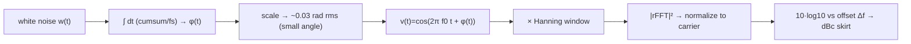

> **β**: This English translation is in beta — the Traditional-Chinese original is the authoritative version.

# Lab 10 — how phase noise smears the carrier into an RF skirt

> **Breadcrumb**: [Simulation labs](/04_simulation_labs/numerical_feeling) › Noise & jitter › **This page (RF spectrum skirt)**. Upstream: [white_noise_to_phase_noise](/03_isf_core_theory/white_noise_to_phase_noise); downstream: [lab_08](/04_simulation_labs/lab_08_jitter_integration).

This lab connects the abstract phase-noise PSD $S_\phi(f)$ to what you actually see on a
**spectrum analyzer**: an ideal carrier is a **single line** in the spectrum; with phase noise,
that line gets "smeared" into a continuous **skirt (sidebands sloping down on both sides of the
carrier)**. We synthesize $v(t)=\cos(\omega_0 t+\phi(t))$ directly in the time domain, take an FFT,
and see it with our own eyes — this is exactly the picture in [P1] Fig. 8, and it's where the unit
**dBc/Hz (decibels relative to carrier per Hz)** comes from.

> **Physical intuition (conclusion first)**: phase noise is not "an extra noise source sitting next
> to the carrier" — it is the **carrier's own phase jittering**. Stuff the jittering phase $\phi(t)$
> into the cosine's phase argument (phase modulation, PM), and the carrier's energy "leaks" from that
> one clean spectral line into nearby offset frequencies. How far it leaks and how much depends on the
> spectral shape of $\phi(t)$: $1/f^2$ phase noise → a skirt that falls off at $-20$ dB/dec on either
> side of the carrier. Seeing the skirt means seeing $S_\phi(f)$ "moved" next to the carrier.

## 1. Learning objectives

- Start from the **time-domain** PM signal $v(t)=\cos(\omega_0 t+\phi(t))$ and use an FFT to see the
  **sideband skirt** caused by phase noise.
- Compare an "ideal carrier (nearly a single spectral line)" against "with phase noise (continuous
  skirt)" to understand the physical meaning of dBc/Hz.
- Map $1/f^2$ phase noise (integrated white noise) to a $-20$ dB/dec skirt slope on either side of
  the carrier.
- Recognize this plot as the time-domain version of [P1] Fig. 8.

## 2. Mathematical model

**Carrier + excess phase.** An oscillator output corrupted by phase noise is written as (a special
case of canonical formula 1, with $A(t)$ treated as constant):

$$
v(t)=\cos\!\big(\omega_0 t+\phi(t)\big),\qquad \omega_0=2\pi f_0 .
$$

**$\phi(t)$ is $1/f^2$ phase noise.** White noise $w(t)$ passed through a phase integrator (in the
spirit of canonical formula 11: noise is first weighted by $\Gamma/q_{max}$, then integrated by
$\int dt$) produces a **random-walk**-like phase:

$$
\phi(t)=\frac{1}{f_s}\sum_{k\le t f_s} w_k\;\;\Longrightarrow\;\; S_\phi(f)\propto\frac{1}{f^2}.
$$

- **Why integrating white noise gives $1/f^2$**: an integrator in the frequency domain is
  $1/(j2\pi f)$, so power transfers as $1/f^2$; white noise ($S_w$ flat) passing through this yields
  $S_\phi(f)\propto S_w/f^2$. This is exactly the signature $1/f^2$ skirt of a free-running
  oscillator (the spectral shape of canonical formula 21).

**RF spectrum = power spectrum of the PM signal.** Window $v(t)$ (Hanning), take the FFT, take the
magnitude squared, and normalize to the carrier peak:

$$
P(f)=\frac{\lvert\mathcal{F}\{v(t)\,w_{\text{win}}(t)\}\rvert^2}{\max_f\lvert\cdots\rvert^2},\qquad
P_{\text{dBc}}(\Delta f)=10\log_{10}P(f_0+\Delta f).
$$

- **Sideband mechanism under the small-angle approximation** (spec Section 10.2,
  "$L\approx\tfrac12 S_\phi$"): let $\phi(t)=\phi_p\sin\omega_m t$; at small angle

$$
\cos(\omega_0 t+\phi)\approx\cos\omega_0 t-\frac{\phi_p}{2}\big[\cos(\omega_0-\omega_m)t-\cos(\omega_0+\omega_m)t\big].
$$

  Each sideband's power relative to the carrier is $(\phi_p/2)^2$; summing over the continuous
  spectrum of $\phi(t)$ produces the skirt.
- **Dimension check**: $\phi$ and $\phi_p$ are in rad (dimensionless), $P/P_{\max}$ is dimensionless,
  and $10\log_{10}$ of that gives dBc ✓. The offset $\Delta f$ and $f$ share units (this lab
  uses normalized units).

## 3. Block diagram



## 4. Core Python code

Verbatim excerpt from `main()` in `simulations/lab_10_rf_spectrum.py`: `cumsum` white noise into
$1/f^2$ phase `phi` (scaled to ~0.03 rad rms to stay small-angle), then synthesize the clean carrier
and the noisy carrier, and finally apply a Hanning window, take the rFFT, normalize to the peak, and
convert to dB.

```python
fs = 8192.0
n = 2 ** 18
t = np.arange(n) / fs
f0 = 512.0  # carrier (normalized units), 16 samples/cycle

# 1/f^2 phase noise: integrate white noise, scale to a visible (small) rms
white = RNG.standard_normal(n)
phi = np.cumsum(white) / fs
phi -= phi.mean()
phi *= 0.03 / np.std(phi)  # ~0.03 rad rms -> small-angle regime

v_clean = np.cos(2 * np.pi * f0 * t)
v_noisy = np.cos(2 * np.pi * f0 * t + phi)

win = np.hanning(n)
def spec(x):
    X = np.fft.rfft(x * win)
    P = np.abs(X) ** 2
    return P / P.max()
f = np.fft.rfftfreq(n, 1 / fs)
Pc = spec(v_clean)
Pn = spec(v_noisy)

off = f - f0  # offset from carrier
```

- `phi = np.cumsum(white) / fs` is the discrete integrator (the source of $1/f^2$).
- `phi *= 0.03 / np.std(phi)` compresses the rms to ~0.03 rad, keeping it in the **small-angle
  regime** (so the skirt stays proportional to $S_\phi$ without spawning strong higher-order
  harmonic sidebands).
- `P / P.max()` normalizes power to the carrier peak, so the y-axis is naturally **dBc**.

## 5. Full script path

`simulations/lab_10_rf_spectrum.py`
(dependency: `savefig` from `simulations/common/plot_utils.py`. Everything else is numpy/matplotlib.)

Run with: `python scripts/run_all_sims.py`.

## 6. Parameter table

| Parameter | Variable | Value | Notes |
|---|---|---|---|
| Sample rate | `fs` | $8192$ (normalized) | samples per second (dimensionless unit) |
| Number of samples | `n` | $2^{18}=262144$ | FFT length, sets frequency resolution |
| Carrier frequency | `f0` | $512$ (normalized) | 16 samples per cycle |
| Phase rms | — | $\approx0.03$ rad | rms of $\phi$ after scaling (small angle) |
| Phase shape | — | $1/f^2$ (cumsum of white noise) | signature free-running skirt |
| Window function | `win` | Hanning | reduces FFT sidelobe leakage |
| Displayed offset | `off` | $1\sim2000$ (normalized) | skirt range to the right of the carrier |
| Random seed | `RNG` | `default_rng(10)` | reproducible results |

> Note: this lab deliberately uses **normalized units** (`fs`, `f0` have no physical dimension); the
> focus is on **shape** (skirt slope and the single-line-vs-continuous-spectrum contrast), not
> absolute Hz.

## 7. Units table

| Quantity | Symbol | Unit | Value in this lab |
|---|---|---|---|
| Time | $t$ | (normalized) s | $0\sim n/f_s$ |
| Carrier frequency | $f_0$ | (normalized) Hz | $512$ |
| Excess phase | $\phi(t)$ | rad | rms $\approx0.03$ |
| Offset frequency | $\Delta f$ | (normalized) Hz | $1\sim2000$ |
| Relative power | $P/P_{\max}$ | dBc | $-90\sim0$ |
| Phase PSD | $S_\phi(f)$ | rad²/Hz | $\propto1/f^2$ |

## 8. Simulation plot


## 9. How to read the plot

- **Blue line (ideal carrier)**: energy is almost entirely concentrated at the carrier itself and
  drops off sharply as offset increases — the spectrum looks "almost like a single line". The small
  residual skirt comes from finite FFT length and window leakage, not physical phase noise.
- **Red line (with phase noise)**: a continuous **skirt** appears on both sides of the carrier,
  sloping down with increasing offset. On a log-offset axis it is nearly a straight-line falloff,
  matching $-20$ dB/dec for $1/f^2$: this is the time-domain origin of the dBc/Hz curve.
- **The single-line-vs-skirt contrast** is the core message of this plot: the phase jitters →
  carrier energy leaks out → a spectral line becomes a skirt. "Lower and steeper skirt" means
  smaller phase noise.
- **How to use it**: the skirt height you measure on a spectrum analyzer (relative to the carrier,
  per Hz) is $\mathcal{L}(\Delta f)$ (dBc/Hz). Integrate it (see
  [lab_08](/04_simulation_labs/lab_08_jitter_integration)) to get rms jitter. This lab lets you
  "see" how that curve grows out of time-domain PM.

## 10. Corresponding paper equations/figures

- **Core correspondence**: [P1] A. Hajimiri and T. H. Lee, *"A General Theory of Phase Noise in
  Electrical Oscillators,"* IEEE JSSC, 33(2), 1998, **Fig. 8** — shows phase noise smearing the
  carrier into a sideband skirt. This lab is its **time-domain synthesis version**.
  [P1] Fig. 8 is on p.183 (checked against the original PDF).
- Carrier decomposition: canonical formula 1, $V_{out}(t)=A(t)f(\omega_0 t+\phi(t))$ (here $A$ is
  taken constant, $f=\cos$).
- Sideband mechanism (small-angle PM → $\mathcal{L}\approx\tfrac12 S_\phi$): spec Section 10.2,
  "$L\approx\tfrac12 S_\phi$ (small-angle PM)".
- Origin of the $1/f^2$ skirt: phase integration of white noise, consistent with the spectral shape
  of canonical formula 21 ([P1] Eq.(21), p.185).
- Corresponds to site figure `rf_spectrum_phase_noise_sidebands.png`; further reading:
  [white_noise_to_phase_noise](/03_isf_core_theory/white_noise_to_phase_noise),
  [psd_phase_noise_jitter](/02_foundations/psd_phase_noise_jitter).

## 11. Limitations and approximations

- **This is a pedagogical toy model, not transistor-level**: we directly "inject" a $1/f^2$ phase
  noise without actually simulating the full pipeline of transistor noise weighted by the ISF; the
  goal is to see "what the skirt looks like".
- **Small-angle assumption**: $\phi$ rms $\approx0.03$ rad $\ll1$, so the skirt is proportional to
  $S_\phi$ with no strong higher-order sidebands. At large phase excursions, PM produces carrier
  compression and higher-order sidebands, which this plot does not cover.
- **Normalized units**: `fs` and `f0` have no physical dimension, and the x-axis offset is also
  normalized; the focus is on **shape and contrast**, not absolute Hz. Matching a real 5 GHz,
  dBc/Hz result requires setting a real sample rate and an absolute $S_\phi$ level.
- **FFT artifacts**: the blue line's residual skirt and the red line's far floor partly come from
  finite-length FFT and Hanning window leakage, not entirely physical phase noise. Increasing `n` or
  using a sharper window reduces this.
- **Single random realization**: the plot comes from one $\phi(t)$ trace with a fixed seed; a
  rigorous $\mathcal{L}(f)$ requires ensemble averaging (Welch) over many realizations, see
  [lab_06](/04_simulation_labs/lab_06_white_noise_phase_noise).

## Key takeaways

- Phase noise is not an extra source sitting beside the carrier — it is **the carrier's own phase
  jittering** → energy leaks from a single line into a sideband skirt.
- Taking the FFT of the time-domain $v(t)=\cos(\omega_0 t+\phi(t))$ lets you "see" the skirt of
  [P1] Fig. 8.
- $1/f^2$ phase noise (integrated white noise) → a $-20$ dB/dec skirt on both sides of the carrier;
  skirt height is dBc/Hz.
- Under small-angle PM each sideband's relative power is $(\phi_p/2)^2$, summing into a continuous
  spectrum ($\mathcal{L}\approx\tfrac12 S_\phi$).

## Further reading

- How the skirt grows out of white noise: [white_noise_to_phase_noise](/03_isf_core_theory/white_noise_to_phase_noise)
- dBc/Hz and jitter types: [psd_phase_noise_jitter](/02_foundations/psd_phase_noise_jitter)
- Integrating the skirt into jitter: [lab_08_jitter_integration](/04_simulation_labs/lab_08_jitter_integration)
- Building numerical intuition: [numerical_feeling](/04_simulation_labs/numerical_feeling)
- **Applied to design/theory**: how a lab measures this skirt (SA/delay-line/cross-correlation) → [measurement_and_spurs](/06_design_insights/measurement_and_spurs)
