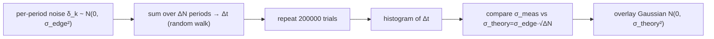

> **β**: This English translation is in beta — the Traditional-Chinese original is the authoritative version.

# Lab 11 — Monte Carlo accumulated jitter — RJ is Gaussian, σ grows as √ΔN

> **Breadcrumb**: [Simulation labs](/04_simulation_labs/numerical_feeling) › Noise & jitter › **This page (Monte Carlo accumulated jitter)**. Upstream: [oscillator_phase](/02_foundations/oscillator_phase), [lab_03](/04_simulation_labs/lab_03_ring_oscillator_toy_model); downstream: [lab_12](/04_simulation_labs/lab_12_serdes_eye_ber), [lab_13](/04_simulation_labs/lab_13_pll_cdr_transfer).

This lab uses the most direct method — **Monte Carlo (large-scale random sampling statistics)** —
to prove that the **random jitter (RJ, Gaussian, unbounded)** accumulated by a free-running
(unlocked) oscillator has two key properties:

1. its distribution is **Gaussian**;
2. its standard deviation grows as the square root of the accumulated period count:
   $\sigma_{\Delta t}=\sigma_{edge}\sqrt{\Delta N}$.

This is the junction between the "statistical (time-domain) view" and the "spectral view", and it
is the microscopic origin of [P2] Eq.(8), $\sigma_{\Delta t}=\kappa\sqrt{\Delta t}$.

> **Physical intuition (conclusion first)**: every period, noise pushes the oscillator's edge
> (zero-crossing/transition instant) by an independent small amount, mean 0, standard deviation
> $\sigma_{edge}$. Phase has **no restoring force** (see [oscillator_phase](/02_foundations/oscillator_phase)),
> so these small pushes are **never pulled back** — they simply **accumulate**. This is a
> one-dimensional **random walk**. After $\Delta N$ steps, a random walk's position still has mean 0,
> but its variance is $\Delta N$ times the single-step variance, so the **standard deviation grows as
> $\sqrt{\Delta N}$**. And a sum of independent small increments tends to **Gaussian** by the central
> limit theorem.

## 1. Learning objectives

- Use Monte Carlo to directly "see" the **Gaussian distribution** of accumulated jitter.
- Verify the random-walk law $\sigma_{\Delta t}=\sigma_{edge}\sqrt{\Delta N}$: a $4\times$ increase in
  $\Delta N$ gives only a $2\times$ increase in $\sigma$.
- Link this time-domain result to [P2] Eq.(8), $\sigma_{\Delta t}=\kappa\sqrt{\Delta t}$
  ($\kappa$ a proportionality constant).
- Understand why phase/jitter accumulates — because phase has no restoring force (unlike amplitude).

## 2. Mathematical model

**Per-period increment.** The edge-timing error of the $k$-th period is an i.i.d. Gaussian
increment:

$$
\delta_k\sim\mathcal{N}(0,\;\sigma_{edge}^2).
$$

**Accumulated jitter = sum of increments (random walk).** After accumulating $\Delta N$ periods, the
timing error relative to the ideal edge is:

$$
\Delta t_{\Delta N}=\sum_{k=1}^{\Delta N}\delta_k .
$$

**Statistical properties (step by step).** The increments are independent with zero mean:

$$
\begin{aligned}
\mathbb{E}[\Delta t_{\Delta N}]&=\sum_{k=1}^{\Delta N}\mathbb{E}[\delta_k]=0,\\
\operatorname{Var}[\Delta t_{\Delta N}]&=\sum_{k=1}^{\Delta N}\operatorname{Var}[\delta_k]=\Delta N\cdot\sigma_{edge}^2,\\
\sigma_{\Delta t}&=\sqrt{\operatorname{Var}}=\sigma_{edge}\sqrt{\Delta N}.
\end{aligned}
$$

- **Why variances add**: the variance of a sum of independent random variables equals the sum of
  the individual variances (zero covariance). This is the entire origin of the "$\sqrt{\Delta N}$".
- **Why it's Gaussian**: a sum of $\Delta N$ independent increments tends to Gaussian by the central
  limit theorem (and since each increment is already Gaussian, the sum is exactly Gaussian).
- **Dimension check**: $\sigma_{edge}$ is in s, $\sqrt{\Delta N}$ is dimensionless ($\Delta N$ is a
  period count), so $\sigma_{\Delta t}$ is in s ✓.

**Linking to [P2] Eq.(8).** Convert the accumulated period count into accumulated time
$\Delta t=\Delta N\cdot T=\Delta N/f_0$:

$$
\sigma_{\Delta t}=\sigma_{edge}\sqrt{\Delta N}=\sigma_{edge}\sqrt{f_0\,\Delta t}=\underbrace{\big(\sigma_{edge}\sqrt{f_0}\big)}_{\kappa}\sqrt{\Delta t},
$$

i.e., [P2] Eq.(8), p.792, $\sigma_{\Delta t}=\kappa\sqrt{\Delta t}$, with $\kappa=\sigma_{edge}\sqrt{f_0}$.

- **Dimension check ($\kappa$)**: $[\text{s}]\cdot[\text{Hz}]^{1/2}=[\text{s}]\cdot[\text{s}^{-1/2}]=[\text{s}^{1/2}]$,
  consistent with the unit $\sqrt{s}$ given for $\kappa$ in the canonical symbol table ✓.

## 3. Block diagram



## 4. Core Python code

Verbatim excerpt from `main()` in `simulations/lab_11_monte_carlo_jitter.py`: for each accumulation
length `lag` (=$\Delta N$), draw `n_trials × lag` independent Gaussian increments, sum along the
period axis to get the accumulated error `acc`, measure its `std`, then overlay the theoretical
Gaussian.

```python
f0 = 5e9
sigma_edge = 50e-15  # 50 fs per period
n_trials = 200000
lags = [25, 100, 400]  # number of periods accumulated

for lag, c in zip(lags, colors):
    incr = sigma_edge * RNG.standard_normal((n_trials, lag))
    acc = incr.sum(axis=1)  # accumulated timing error after `lag` periods
    sigma_meas = np.std(acc)
    sigma_theory = sigma_edge * np.sqrt(lag)
    # histogram (in fs)
    ax.hist(acc / 1e-15, bins=120, density=True, alpha=0.35, color=c,
            label=fr"$\Delta N$={lag}: 量得 $\sigma$={sigma_meas/1e-15:.0f} fs "
                  fr"(理論 {sigma_theory/1e-15:.0f} fs)")
    # gaussian overlay
    xx = np.linspace(acc.min(), acc.max(), 300)
    g = np.exp(-xx ** 2 / (2 * sigma_theory ** 2)) / (sigma_theory * np.sqrt(2 * np.pi))
    ax.plot(xx / 1e-15, g * 1e-15, color=c, lw=1.6)
```

- `incr.sum(axis=1)` sums `lag` independent increments — a one-dimensional random walk.
- `sigma_meas = np.std(acc)` (measured) converges digit by digit to
  `sigma_theory = sigma_edge*np.sqrt(lag)` (theoretical), because `n_trials=200000` is large enough.
- The Gaussian overlay `g` uses the **theoretical** $\sigma$; its match to the histogram is the proof
  that the distribution is Gaussian.

Expected numbers ($\sigma_{edge}=50$ fs): $\Delta N=25\to250$ fs, $\Delta N=100\to500$ fs,
$\Delta N=400\to1000$ fs (each $\times4$ step in $\Delta N$ gives $\times2$ in $\sigma$).

## 5. Full script path

`simulations/lab_11_monte_carlo_jitter.py`
(dependency: `savefig` from `simulations/common/plot_utils.py`. Everything else uses numpy/matplotlib.)

Run with: `python scripts/run_all_sims.py`.

## 6. Parameter table

| Parameter | Variable | Value | Notes |
|---|---|---|---|
| Oscillation frequency | `f0` | $5\times10^{9}$ Hz | 5 GHz (used for the $\Delta N\leftrightarrow\Delta t$ conversion) |
| Per-period jitter | `sigma_edge` | $50\times10^{-15}$ s | rms increment per edge per period (50 fs) |
| Monte Carlo trials | `n_trials` | $200000$ | trials per $\Delta N$ |
| Accumulated period counts | `lags` | $\{25,100,400\}$ | $\Delta N$, in a $\times4$ geometric progression |
| Histogram bins | — | $120$ | density histogram |
| Random seed | `RNG` | `default_rng(11)` | reproducible results |

## 7. Units table

| Quantity | Symbol | Unit | Value in this lab |
|---|---|---|---|
| Per-period increment | $\delta_k,\ \sigma_{edge}$ | s | $\sigma_{edge}=50$ fs |
| Accumulated period count | $\Delta N$ | — (count) | 25 / 100 / 400 |
| Accumulated jitter | $\Delta t,\ \sigma_{\Delta t}$ | s | 250 / 500 / 1000 fs |
| Accumulated time | $\Delta t=\Delta N/f_0$ | s | time spanned by $\Delta N$ periods |
| Proportionality constant | $\kappa=\sigma_{edge}\sqrt{f_0}$ | $\sqrt{s}$ | $\approx3.5\times10^{-12}\,\sqrt{s}$ |
| Probability density | — | 1/s (1/fs on the plot) | Gaussian curve |

## 8. Simulation plot


## 9. How to read the plot

- **Three bell curves** (blue/orange/red for $\Delta N=25/100/400$): the histogram (translucent) and
  the theoretical Gaussian curve (solid line) overlap almost perfectly — this is direct evidence
  that "RJ is Gaussian".
- **Wider means longer accumulation**: as $\Delta N$ grows, the bell gets shorter and wider. Note the
  width ($\sigma$) grows only as $\sqrt{\Delta N}$: from $25\to100$ ($\times4$), $\sigma$ goes from
  250 fs to 500 fs (only $\times2$); from $100\to400$ (another $\times4$), 500 fs becomes 1000 fs
  (another $\times2$).
- **"Measured σ vs. theoretical" in the legend**: the two numbers are nearly identical, quantitatively
  verifying $\sigma_{\Delta t}=\sigma_{edge}\sqrt{\Delta N}$.
- **How to use it**: this explains why a free-running oscillator's long-term stability **cannot** be
  described by "per-period jitter" alone — jitter grows with observation time. Stopping the
  accumulation requires a PLL/CDR to lock the phase back to a reference (see
  [lab_13](/04_simulation_labs/lab_13_pll_cdr_transfer)).

## 10. Corresponding paper equations/figures

- **Core correspondence**: [P2] A. Hajimiri, S. Limotyrakis, and T. H. Lee, *"Jitter and Phase Noise
  in Ring Oscillators,"* IEEE JSSC, 34(6), 1999, **Eq.(8), p.792**:
  $\sigma_{\Delta t}=\kappa\sqrt{\Delta t}$. This lab proves its microscopic origin is a random walk
  of per-edge Gaussian increments, and derives $\kappa=\sigma_{edge}\sqrt{f_0}$.
- Spec Section 10.2, "period / cycle-to-cycle jitter kernels": accumulated jitter "has no
  differencing (low-frequency dominated)", corresponding to the pure accumulation here (no
  high-pass differencing kernel).
- Phase has no restoring force (hence accumulates): [P1]'s LTV phase model (canonical formula 11),
  consistent with the geometry in [oscillator_phase](/02_foundations/oscillator_phase).
- Corresponds to site figure `monte_carlo_jitter_histogram.png`; echoes the time-domain accumulation
  plot `ring_oscillator_timing_noise_accumulation.png` in
  [lab_03](/04_simulation_labs/lab_03_ring_oscillator_toy_model).

## 11. Limitations and approximations

- **This is a pedagogical toy model, not transistor-level**: we directly assume an independent
  Gaussian increment $\sigma_{edge}$ per period, without deriving its numerical value from ISF +
  device noise (that requires [P2]'s $\kappa$/FOM formulas, canonical formulas 22–23, verified
  verbatim against [P2] Eq.(8)/(12) p.792-793, Eq.(16) p.794, Eq.(23) p.796).
- **Pure RJ, independent increments**: assumes period-to-period noise is uncorrelated (white at the
  period scale). Real $1/f$ (flicker) noise introduces **correlated** increments, causing long-term
  accumulation to deviate from pure $\sqrt{\Delta N}$ (close-in $1/f^3$, see
  [lab_07](/04_simulation_labs/lab_07_flicker_noise_upconversion)).
- **Only covers accumulated/long-term jitter**: period jitter (single-period deviation) and
  cycle-to-cycle jitter (adjacent difference) are the first/second-order differences of phase and are
  outside the scope of this plot (spec Section 10.2).
- **Gaussian, unbounded**: RJ is described by $\sigma$ with tails extending to infinity — this is
  exactly why SerDes BER is always $>0$ (see [lab_12](/04_simulation_labs/lab_12_serdes_eye_ber)).
  Deterministic jitter (DJ, bounded) is outside this model.
- **Finite-sample error**: the small difference between `sigma_meas` and `sigma_theory` comes from
  finite `n_trials`; increasing it improves convergence.

## Key takeaways

- Accumulated jitter is a **random walk** of per-edge Gaussian increments: mean 0, variance
  $\propto\Delta N$, Gaussian distribution.
- $\sigma_{\Delta t}=\sigma_{edge}\sqrt{\Delta N}$: a $4\times$ increase in $\Delta N$ gives only a
  $2\times$ increase in $\sigma$.
- Converting to time gives [P2] Eq.(8), $\sigma_{\Delta t}=\kappa\sqrt{\Delta t}$, with
  $\kappa=\sigma_{edge}\sqrt{f_0}$.
- No restoring force on phase → jitter accumulates → poor free-running long-term stability → needs
  a PLL/CDR to lock it back.

## Further reading

- Why phase has no restoring force: [oscillator_phase](/02_foundations/oscillator_phase)
- Time-domain accumulation plot for the ring oscillator: [lab_03_ring_oscillator_toy_model](/04_simulation_labs/lab_03_ring_oscillator_toy_model)
- How a PLL/CDR stops the accumulation: [lab_13_pll_cdr_transfer](/04_simulation_labs/lab_13_pll_cdr_transfer)
- RJ → SerDes BER: [lab_12_serdes_eye_ber](/04_simulation_labs/lab_12_serdes_eye_ber)
- **Applied to design/theory**: how accumulated jitter eats into the SerDes timing budget → [serdes_clocking_connection](/06_design_insights/serdes_clocking_connection)
