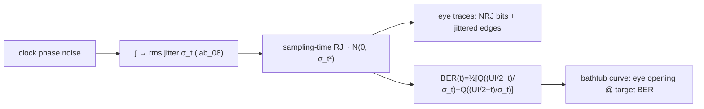

> **β**: This English translation is in beta — the Traditional-Chinese original is the authoritative version.

# Lab 12 — From jitter to eye to BER (SerDes bathtub)

> **Breadcrumb**: [Simulation labs](/04_simulation_labs/numerical_feeling) › Noise & jitter › **This page (eye / BER bathtub)**. Upstream: [lab_08](/04_simulation_labs/lab_08_jitter_integration), [lab_11](/04_simulation_labs/lab_11_monte_carlo_jitter); downstream: [lab_13](/04_simulation_labs/lab_13_pll_cdr_transfer).

This lab settles, once and for all, the "**why care about jitter**" question of the whole ISF course: the oscillator's
phase noise integrates into **rms timing jitter** $\sigma_t$ (see [lab_08](/04_simulation_labs/lab_08_jitter_integration));
this $\sigma_t$ is the **random jitter (RJ)** of the SerDes sampling clock; RJ **closes the eye diagram (the opening
formed by overlaying many bits)** and sets the **BER (bit-error rate)**. We plot the eye diagram and the
**BER bathtub (a curve of BER versus sampling instant, shaped like a bathtub)**.

> **Physical intuition (conclusion first)**: an ideal clock always samples at the exact center of the UI (unit interval,
> the time span of one bit), $UI/2$ away from either data edge — the safest spot. With jitter, the sampling instant
> wanders randomly left and right; whenever it wanders past either edge, the wrong bit is sampled. RJ is Gaussian and
> **unbounded**, so there is **always** a tail that crosses an edge
> — the BER is always $>0$; its size is set by "how many $\sigma$ you sit from the edge". The more $\sigma$ of margin,
> the error probability drops exponentially via $Q(\cdot)$ (the Gaussian tail) — which is why the bathtub floor is deep and flat.

## 1. Learning objectives

- Map rms jitter $\sigma_t$ to **eye closure** and **BER**.
- Write down and understand the RJ-only BER bathtub formula (the SerDes BER expression of spec section 10.2).
- See that "larger $\sigma_t$ → narrower usable sampling window (eye opening at a target BER)".
- Link the $Q$-function (Gaussian tail) with "how many $\sigma$ from the edge" to grasp the BER's exponential sensitivity.

## 2. Mathematical model

**$Q$-function (Gaussian tail probability).**

$$
Q(x)=\frac12\,\mathrm{erfc}\!\Big(\frac{x}{\sqrt2}\Big),
$$

the probability that a standard Gaussian exceeds $x$ $\sigma$. The larger $x$, the smaller $Q(x)$ (exponential-like decay).

**BER bathtub (RJ only).** Sample within the UI at offset $t$ relative to the eye center, with the left edge at $-UI/2$
and the right edge at $+UI/2$. The sampling instant is dithered by Gaussian jitter $\sigma_t$; crossing either edge
produces an error (spec section 10.2, "SerDes BER (RJ)"):

$$
\text{BER}(t)=\frac12\Big[\,Q\!\Big(\frac{UI/2-t}{\sigma_t}\Big)+Q\!\Big(\frac{UI/2+t}{\sigma_t}\Big)\Big].
$$

- **Term-by-term physics**: the first term is the probability of jittering past the **right** edge (distance $UI/2-t$);
  the second is that of jittering past the **left** edge (distance $UI/2+t$). The leading $\tfrac12$ is the bookkeeping
  for "a transition is present half the time" (RJ-only first-order model).
- **Eye center $t=0$**: the two terms are symmetric, $\text{BER}(0)=Q(UI/(2\sigma_t))$ — both edges sit
  $UI/(2\sigma_t)$ $\sigma$ away. **This ratio is everything**: it is called the "eye half-width in units of $\sigma$".
- **Dimension check**: the argument of $Q$, $(UI/2-t)/\sigma_t$, is $[\text{s}]/[\text{s}]$, dimensionless ✓;
  the BER is a probability (dimensionless) ✓.

**The eye half-width (in $\sigma$) sets the BER.** For $UI=100$ ps:

$$
\frac{UI/2}{\sigma_t}=\frac{50\ \text{ps}}{\sigma_t}.
$$

$\sigma_t=4$ ps → $12.5\sigma$; $\sigma_t=8$ ps → $6.25\sigma$. $Q(12.5)\sim10^{-36}$ (extremely deep),
$Q(6.25)\sim2\times10^{-10}$ (much shallower) — **double the jitter and the bathtub floor rises by dozens of orders of magnitude**.

## 3. Block diagram



## 4. Core Python code

Verbatim from `main()` in `simulations/lab_12_serdes_eye_ber.py`: the left panel overlays the eye with `eye_traces`;
the right panel plots bathtub curves for three values of $\sigma_t$ with `ber_bathtub`.

```python
ui = 100e-12       # 10 Gb/s -> 100 ps UI
sigma_t = 4e-12    # 4 ps rms RJ (e.g. from an integrated 5 GHz clock)

# (a) eye diagram
t, traces = eye_traces(sigma_t, ui, n_traces=300, rng=RNG)
for tr in traces:
    ax.plot(t, tr, color="tab:blue", alpha=0.05, lw=1.0)

# (b) BER bathtub
toff = np.linspace(-ui / 2 * 0.98, ui / 2 * 0.98, 400)
for st, c in zip([2e-12, 4e-12, 8e-12], ["tab:green", "tab:orange", "tab:red"]):
    ber = ber_bathtub(toff, st, ui)
    ax.semilogy(toff / ui, ber, color=c, label=fr"$\sigma_t$={st*1e12:.0f} ps")
ax.axhline(1e-12, color="gray", ls="--", lw=1, label="BER = $10^{-12}$")
```

The underlying `ber_bathtub` and `Q` (`serdes_utils.py`) are a verbatim implementation of the spec section 10.2 BER formula:

```python
def Q(x):
    """Gaussian tail probability Q(x) = 0.5*erfc(x/sqrt(2))."""
    return 0.5 * erfc(np.asarray(x, dtype=float) / np.sqrt(2.0))

def ber_bathtub(t_offsets, sigma_t, ui):
    t = np.asarray(t_offsets, dtype=float)
    half = ui / 2.0
    ber = 0.5 * (Q((half - t) / sigma_t) + Q((half + t) / sigma_t))
    return np.maximum(ber, 1e-300)
```

- `eye_traces` adds $\mathcal{N}(0,\sigma_t/UI)$ jitter to each transition's edge time
  (in UI units); overlaying 300 traces forms the eye.
- `ber_bathtub` applies the $Q$-function directly; `np.maximum(ber, 1e-300)` puts a floor under the log plot to avoid $\log 0$.

## 5. Full script path

`simulations/lab_12_serdes_eye_ber.py`
(Dependencies: `Q`, `ber_bathtub`, `eye_traces` from `simulations/common/serdes_utils.py`;
`savefig` from `simulations/common/plot_utils.py`. `Q` uses `scipy.special.erfc`.)

How to run: `python scripts/run_all_sims.py`.

## 6. Parameter table

| Parameter | Variable | Value | Notes |
|---|---|---|---|
| Unit interval | `ui` | $100\times10^{-12}$ s | 10 Gb/s NRZ → 100 ps UI |
| Eye-diagram jitter | `sigma_t` | $4\times10^{-12}$ s | 4 ps rms RJ (e.g. integrated from a 5 GHz clock) |
| Bathtub jitter sweep | — | $\{2,4,8\}$ ps | three bathtub curves |
| Number of eye traces | `n_traces` | $300$ | overlay density |
| BER sample points | `toff` | $400$ ($\pm0.98\,UI/2$) | bathtub-curve resolution |
| Target BER | — | $10^{-12}$ | common SerDes spec line |
| Random seed | `RNG` | `default_rng(12)` | reproducible results |

## 7. Units table

| Quantity | Symbol | Unit | Value in this lab |
|---|---|---|---|
| Unit interval | $UI$ | s | 100 ps |
| rms jitter | $\sigma_t$ | s | 2 / 4 / 8 ps |
| Sampling offset | $t$ | s (plotted in UI units) | $\pm UI/2$ |
| Eye half-width (in σ) | $UI/(2\sigma_t)$ | — (dimensionless) | 25 / 12.5 / 6.25 |
| BER | $\text{BER}(t)$ | — (probability) | $1\sim10^{-18}$ |
| $Q$ argument | $(UI/2\mp t)/\sigma_t$ | — (dimensionless) | number of σ from the edge |

## 8. Simulation figure


## 9. How to read the figure

- **Left panel (eye diagram)**: 300 jitter-dithered transitions overlaid, leaving a diamond-shaped
  **eye opening** at the center. Jitter smears the edges out and narrows the opening horizontally; with even more jitter
  the eye closes until no sampling instant is safe.
- **Right panel (BER bathtub)**: three bathtub curves (green/orange/red = $\sigma_t=2/4/8$ ps).
  - **Floor depth**: the smaller $\sigma_t$, the deeper the bathtub floor (the lower the BER). The green curve (2 ps) bottoms out beyond the plot
    ($UI/(2\sigma_t)=25\sigma$, $Q$ vanishingly small); the red curve (8 ps) only reaches the $\sim10^{-10}$ level.
  - **Walls**: near $\pm0.5$ UI (i.e. the edges) the BER shoots up to $\sim0.5$ (a coin flip).
  - **Usable window (eye opening @ BER)**: the span between where the two walls cross the $10^{-12}$ dashed line is the
    "window in which sampling is safe at that BER". The larger $\sigma_t$, the narrower this window — this is
    "jitter eating the timing budget".
- **How to use it**: given the data rate (UI) and target BER, back out the tolerable $\sigma_t$; then require the clock's
  integrated phase noise to stay below that $\sigma_t$ (closing the loop with [lab_08](/04_simulation_labs/lab_08_jitter_integration)).

## 10. Corresponding paper equations/figures

- **BER formula**: spec section 10.2, "SerDes BER (RJ)":
  $\text{BER}(t)=\tfrac12[Q(\tfrac{UI/2-t}{\sigma_t})+Q(\tfrac{UI/2+t}{\sigma_t})]$,
  $Q(x)=\tfrac12\mathrm{erfc}(x/\sqrt2)$. Generic communications/SerDes practice — **external literature, not among the five source PDFs** —
  supplemented from standard references.
- **Jitter source**: $\sigma_t$ comes from integrating the phase noise (spec Eq. 19, see
  [lab_08](/04_simulation_labs/lab_08_jitter_integration)); the underlying phase-accumulation mechanism traces back to
  the ISF/LTV model of [P1] and the jitter discussion in [P2].
- **RJ Gaussian and unbounded**: consistent with the Monte-Carlo conclusion of
  [lab_11](/04_simulation_labs/lab_11_monte_carlo_jitter) (Gaussian tail → BER always $>0$).
- Corresponds to site figure `serdes_eye_ber_bathtub.png`; for the design-level chain see
  [serdes_clocking_connection](/06_design_insights/serdes_clocking_connection).

## 11. Limitations and approximations

- **This is a pedagogical toy model, not transistor-level**: the eye approximates NRZ transitions with `tanh`-smoothed
  edges and has no real channel/equalizer; the BER uses the closed-form $Q$ expression, not Monte-Carlo error counting.
- **RJ-only (random jitter only)**: ignores **DJ (deterministic jitter — bounded, from ISI,
  duty-cycle distortion, crosstalk, etc.)**. Real jitter is dual-Dirac (RJ ⊛ DJ); DJ pushes the bathtub walls
  inward and puts a plateau on the floor. This lab demonstrates only the Gaussian-tail RJ part.
- **No amplitude noise / vertical eye closure**: timing only (horizontal eye); vertical closure from voltage noise is not included.
- **Ideal two-level signaling, no ISI**: assumes clean transitions between adjacent bits and no inter-symbol interference; practical high-speed channels need CTLE/DFE equalization.
- **The $\tfrac12$ bookkeeping**: transition density taken as 0.5 (random-data average); specific patterns will differ.

## Key takeaways

- Integrated phase noise → $\sigma_t$ → RJ of the SerDes sampling clock → eye closure → BER.
- $\text{BER}(t)=\tfrac12[Q(\tfrac{UI/2-t}{\sigma_t})+Q(\tfrac{UI/2+t}{\sigma_t})]$; at the eye center
  $\text{BER}(0)=Q(UI/(2\sigma_t))$.
- The key quantity is the **eye half-width in units of $\sigma$**, $UI/(2\sigma_t)$: double the jitter and the BER floor rises by dozens of orders of magnitude.
- Gaussian RJ is unbounded → the BER is always $>0$; the intersections of the bathtub with the target-BER line bound the usable sampling window.

## Further reading

- Where jitter comes from (integration): [lab_08_jitter_integration](/04_simulation_labs/lab_08_jitter_integration)
- Why RJ is Gaussian: [lab_11_monte_carlo_jitter](/04_simulation_labs/lab_11_monte_carlo_jitter)
- Reining jitter in with a PLL/CDR: [lab_13_pll_cdr_transfer](/04_simulation_labs/lab_13_pll_cdr_transfer)
- **Use in design/theory**: back out a clock phase-noise budget from the $\sigma_t$ spec → [serdes_clocking_connection](/06_design_insights/serdes_clocking_connection)
