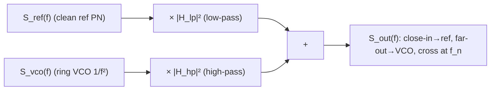

> **β**: This English translation is in beta — the Traditional-Chinese original is the authoritative version.

# Lab 13 — PLL/CDR jitter transfer: VCO high-pass, reference low-pass

> **Breadcrumb**: [Simulation labs](/04_simulation_labs/numerical_feeling) › System & advanced › **This page (PLL/CDR jitter transfer)**. Upstream: [lab_11](/04_simulation_labs/lab_11_monte_carlo_jitter); downstream: [lab_12](/04_simulation_labs/lab_12_serdes_eye_ber).

This lab explains something practically crucial: **how a PLL (phase-locked loop) / CDR (clock and
data recovery) "filters" an oscillator's phase noise**. The key conclusion — referred to the output phase,
**the VCO's (voltage-controlled oscillator's) own phase noise is high-pass shaped** (close-in suppressed,
far-out dominant), while **the reference clock's phase noise is low-pass shaped**. This is why a noisy
ring VCO, once locked to a clean reference, can still deliver a usable clock.

> **Physical intuition (conclusion first)**: a PLL is a negative-feedback loop that **tracks** the reference phase. Inside the loop bandwidth $f_n$
> (low offset, slow variation), the feedback reacts in time, so the output **follows the reference** — the reference's low-frequency noise passes
> straight to the output (reference low-pass), while the VCO's own low-frequency drift gets **corrected away** by the feedback (VCO high-pass). Beyond $f_n$
> (high offset, fast variation), the feedback cannot keep up and the output **follows the VCO** free-running — VCO noise passes through unchanged
> (the passband of the VCO high-pass) and the reference's high-frequency noise is filtered out (the stopband of the reference low-pass). The crossover sits at the loop bandwidth $f_n$.

## 1. Learning objectives

- Understand the PLL's **two phase-noise transfer functions**: reference→output is a **low-pass** $\lvert H_{lp}\rvert^2$,
  VCO→output is a **high-pass** $\lvert H_{hp}\rvert^2$, with $H_{hp}=1-H_{lp}$.
- Synthesize the locked output with $S_{out}=S_{ref}\lvert H_{lp}\rvert^2+S_{vco}\lvert H_{hp}\rvert^2$.
- See that "close-in follows the reference, far-out follows the VCO, crossover at the loop bandwidth $f_n$".
- Connect to the design trade-off: how to choose the loop bandwidth so as to suppress VCO close-in without amplifying reference far-out.

## 2. Mathematical model

**Closed-loop transfer functions of the type-II second-order PLL** (spec section 10.2, "PLL (type-II 2nd order)").
Written in terms of the natural frequency $\omega_n=2\pi f_n$ and damping ratio $\zeta$, referred to the output phase:

$$
\lvert H_{lp}\rvert^2=\frac{(2\zeta\omega_n\omega)^2+\omega_n^4}{(\omega_n^2-\omega^2)^2+(2\zeta\omega_n\omega)^2},
$$

$$
\lvert H_{hp}\rvert^2=\frac{\omega^4}{(\omega_n^2-\omega^2)^2+(2\zeta\omega_n\omega)^2}.
$$

where $\omega=2\pi f$ ($f$ is the offset frequency).

- **Limit check (low frequency $\omega\to0$)**: $\lvert H_{lp}\rvert^2\to\omega_n^4/\omega_n^4=1$
  (reference passes fully), $\lvert H_{hp}\rvert^2\to0$ (VCO suppressed). ✓ Matches "close-in follows the reference".
- **Limit check (high frequency $\omega\to\infty$)**: $\lvert H_{lp}\rvert^2\to(2\zeta\omega_n\omega)^2/\omega^4\to0$
  (reference filtered out), $\lvert H_{hp}\rvert^2\to\omega^4/\omega^4=1$ (VCO passes fully). ✓ Matches "far-out follows the VCO".
- **Complementarity**: with these standard forms one can verify $H_{hp}(s)=1-H_{lp}(s)$ (the same time-domain error shared between the two paths),
  so the output phase = the sum of the two.
- **Dimension check**: $\omega$ and $\omega_n$ are both rad/s; numerator and denominator are of the same order ($\omega^4$ or
  $\omega_n^4$), so the transfer functions are dimensionless ✓.

**Output phase noise (power superposition).** The noise of the two paths is uncorrelated, so powers add (spec section 10.2):

$$
S_{out}(f)=S_{ref}(f)\,\lvert H_{lp}\rvert^2+S_{vco}(f)\,\lvert H_{hp}\rvert^2 .
$$

- **Dimension check**: $S_{ref},S_{vco},S_{out}$ are all rad²/Hz, $\lvert H\rvert^2$ dimensionless,
  so the units of the sum are consistent ✓.

**Representative input shapes for this lab** (anchored, not a specific silicon process):

$$
S_{vco}(f)=10^{-6}\Big(\frac{10^6}{f}\Big)^2\ \text{(ring VCO, strong }1/f^2\text{)},\qquad
S_{ref}(f)=10^{-12}+10^{-14}\Big(\frac{10^6}{f}\Big)^2\ \text{(clean reference)}.
$$

## 3. Block diagram



## 4. Core Python code

Verbatim from `main()` in `simulations/lab_13_pll_cdr_transfer.py`: set the loop bandwidth `fn` and damping `zeta`,
provide representative VCO and reference PSDs, then call `shape_output_phase_noise` to synthesize the output.

```python
f = np.logspace(3, 9, 2000)  # 1 kHz .. 1 GHz offset
fn = 1e6  # loop natural frequency ~ 1 MHz
zeta = 0.707

# representative phase-noise PSDs (rad^2/Hz), anchored shapes
S_vco = 1e-6 * (1e6 / f) ** 2          # ring VCO: strong 1/f^2 close-in
S_ref = 1e-12 + 1e-14 * (1e6 / f) ** 2  # clean reference: low flat + slight 1/f^2

S_out, S_ref_sh, S_vco_sh = shape_output_phase_noise(f, S_ref, S_vco, fn, zeta)
```

The underlying transfer functions (`pll_utils.py`) are a verbatim implementation of the spec section 10.2 PLL formulas:

```python
def H_lowpass_mag2(f, fn_hz, zeta=0.707):
    """|H_lp(j2*pi*f)|^2 for a type-II 2nd-order PLL (reference -> output)."""
    w = 2 * np.pi * np.asarray(f, dtype=float)
    wn = loop_natural_freq(fn_hz)
    num = (2 * zeta * wn * w) ** 2 + wn ** 4
    den = (wn ** 2 - w ** 2) ** 2 + (2 * zeta * wn * w) ** 2
    return num / den

def H_highpass_mag2(f, fn_hz, zeta=0.707):
    """|H_hp(j2*pi*f)|^2 = |1 - H_lp|^2 for the VCO -> output path."""
    w = 2 * np.pi * np.asarray(f, dtype=float)
    wn = loop_natural_freq(fn_hz)
    num = w ** 4
    den = (wn ** 2 - w ** 2) ** 2 + (2 * zeta * wn * w) ** 2
    return num / den
```

- Internally, `shape_output_phase_noise` is simply `S_ref*lp + S_vco*hp`, returning the output and the two shaped components.
- `zeta=0.707` (Butterworth damping) gives a flat closed loop with no visible jitter peaking.

## 5. Full script path

`simulations/lab_13_pll_cdr_transfer.py`
(Dependencies: `H_lowpass_mag2`, `H_highpass_mag2`,
`shape_output_phase_noise`, `loop_natural_freq` from `simulations/common/pll_utils.py`; `savefig` from `simulations/common/plot_utils.py`.)

How to run: `python scripts/run_all_sims.py`.

## 6. Parameter table

| Parameter | Variable | Value | Notes |
|---|---|---|---|
| Offset sweep | `f` | $10^3\sim10^9$ Hz (logspace 2000) | 1 kHz–1 GHz |
| Loop natural frequency | `fn` | $1\times10^{6}$ Hz | loop bandwidth $\approx$ crossover point |
| Damping ratio | `zeta` | $0.707$ | Butterworth, no peaking |
| VCO PN level | — | $10^{-6}\,(10^6/f)^2$ rad²/Hz | ring: strong $1/f^2$ |
| Reference PN level | — | $10^{-12}+10^{-14}(10^6/f)^2$ rad²/Hz | clean: low flat + slight $1/f^2$ |

## 7. Units table

| Quantity | Symbol | Unit | Value in this lab |
|---|---|---|---|
| Offset frequency | $f$ | Hz | 1 kHz–1 GHz |
| Angular frequency | $\omega=2\pi f$ | rad/s | — |
| Loop natural frequency | $\omega_n=2\pi f_n$ | rad/s | $2\pi\times10^6$ |
| Damping ratio | $\zeta$ | — (dimensionless) | 0.707 |
| Power transfer | $\lvert H_{lp}\rvert^2,\lvert H_{hp}\rvert^2$ | — (dimensionless) | $0\sim1$ |
| Phase PSD | $S_{ref},S_{vco},S_{out}$ | rad²/Hz | see parameter table |

## 8. Simulation figure


## 9. How to read the figure

- **Left panel (transfer functions)**: the blue curve $\lvert H_{lp}\rvert^2$ is 1 (0 dB) at low offsets and rolls off past $f_n$
  (low-pass); the red curve $\lvert H_{hp}\rvert^2$ approaches 0 at low offsets and rises to 1 past $f_n$ (high-pass).
  The two cross near $f_n=1$ MHz (gray dashed line) — that is the loop bandwidth.
- **Right panel (output PN synthesis)**:
  - **The black curve (locked output)** close-in ($<f_n$) **hugs the blue reference** — the VCO's strong $1/f^2$
    has been suppressed by the high-pass.
  - Far-out ($>f_n$) the black curve **hugs the red VCO** — the reference's high frequencies are low-pass filtered out and the VCO passes through unchanged.
  - The crossover (where the two inputs are comparable) sits near $f_n$.
- **Core message**: locking swaps "the noisy VCO's close-in" for "the clean reference's close-in", at the cost that far-out
  is still set by the VCO. **The loop bandwidth $f_n$ is the design knob**: raising $f_n$ → suppresses more VCO close-in but admits
  more reference far-out and possible jitter peaking; lowering $f_n$ does the opposite.
- **CDR view**: think of the "reference" as the jitter of the incoming data — a CDR low-pass tracks low-frequency input jitter (jitter
  tolerance) and high-pass rejects high frequencies — the same shaping.

## 10. Corresponding paper equations/figures

- **PLL transfer functions**: spec section 10.2, "PLL (type-II 2nd order)": $\lvert H_{lp}\rvert^2$,
  $\lvert H_{hp}\rvert^2$ and $S_{out}=S_{ref}\lvert H_{lp}\rvert^2+S_{vco}\lvert H_{hp}\rvert^2$.
  Generic PLL/CDR theory — **external literature, not among the five source PDFs** — supplemented from standard references.
- **The VCO noise being shaped** itself comes from the ISF phase noise of [P1]/[P2] (a ring VCO's $1/f^2$ corresponds to spec
  Eq. 21 and the ring discussion in [P2]); this lab feeds that $S_\phi$ into the loop shaping.
- **Stopping jitter accumulation**: echoes [lab_11](/04_simulation_labs/lab_11_monte_carlo_jitter)
  — the free-running $\sqrt{\Delta N}$ accumulation is exactly what the PLL's high-pass shaping reins in close-in.
- Corresponds to site figure `pll_cdr_jitter_transfer.png`; for the design chain see
  [serdes_clocking_connection](/06_design_insights/serdes_clocking_connection).

## 11. Limitations and approximations

- **This is a pedagogical toy model, not transistor-level**: ideal type-II second-order closed-loop expressions; no
  charge-pump non-idealities, divider, loop-filter parasitics, reference spurs, etc.
- **Linear, time-invariant, small-phase assumption**: phase-domain linearization (the small-signal model of a locked PLL); large loss of lock and cycle slips
  are out of scope.
- **Second-order approximation**: real loops often contain extra poles (third order and above) affecting high-frequency roll-off and stability; only the dominant second-order behavior is kept here.
- **Uncorrelated-noise assumption**: $S_{out}=S_{ref}\lvert H_{lp}\rvert^2+S_{vco}\lvert H_{hp}\rvert^2$
  requires the reference and VCO noise to be uncorrelated (powers add). In practice, shared bias/supply can correlate them.
- **Input PSD shapes are illustrative**: the levels and shapes of $S_{vco}$, $S_{ref}$ are anchored examples, not measurements of a specific
  silicon process; the point is the **shaping mechanism and the crossover at $f_n$**, not absolute dBc/Hz.
- **No jitter-peaking detail**: $\zeta=0.707$ is deliberately chosen flat; a smaller $\zeta$ produces peaking near $f_n$
  (a bump in the output PN), a case this figure does not sweep.

## Key takeaways

- Referred to the output phase: the reference is low-passed ($\lvert H_{lp}\rvert^2$), the VCO high-passed ($\lvert H_{hp}\rvert^2$),
  with $H_{hp}=1-H_{lp}$.
- $S_{out}=S_{ref}\lvert H_{lp}\rvert^2+S_{vco}\lvert H_{hp}\rvert^2$; close-in follows the reference,
  far-out follows the VCO, crossover at the loop bandwidth $f_n$.
- This is why a noisy ring VCO locked to a clean reference can still deliver a good clock.
- The loop bandwidth $f_n$ is the central knob: raising it suppresses VCO close-in but admits reference far-out and peaking risk.

## Further reading

- Where the VCO's $1/f^2$ comes from: [white_noise_to_phase_noise](/03_isf_core_theory/white_noise_to_phase_noise)
- Why free-running accumulation demands locking: [lab_11_monte_carlo_jitter](/04_simulation_labs/lab_11_monte_carlo_jitter)
- How output jitter affects BER: [lab_12_serdes_eye_ber](/04_simulation_labs/lab_12_serdes_eye_ber)
- Design chain: [serdes_clocking_connection](/06_design_insights/serdes_clocking_connection)
- **Use in design/theory**: multiply each noise source by its transfer function, build the whole-PLL noise budget and the optimum loop BW → [pll_noise_budget](/06_design_insights/pll_noise_budget)
