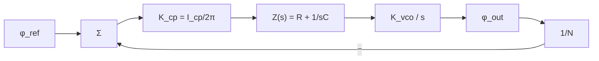
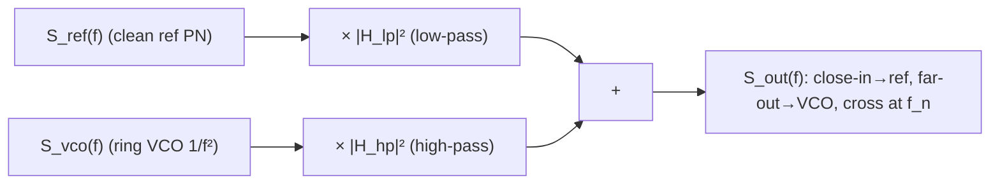

> **β**: This English translation is in beta — the Traditional-Chinese original is the authoritative version.

# Lab 13 — PLL/CDR jitter transfer: VCO high-pass, reference low-pass

> **Breadcrumb**: [Simulation labs](/04_simulation_labs/numerical_feeling) › System & advanced › **This page (PLL/CDR jitter transfer)**. Upstream: [lab_11](/04_simulation_labs/lab_11_monte_carlo_jitter); downstream: [lab_12](/04_simulation_labs/lab_12_serdes_eye_ber).

This lab explains something practically crucial: **how a PLL (phase-locked loop) / CDR (clock and
data recovery) "filters" an oscillator's phase noise**. The key conclusion — referred to the output phase,
**the VCO's (voltage-controlled oscillator's) own phase noise is high-pass shaped** (close-in suppressed,
far-out dominant), while **the reference clock's phase noise is low-pass shaped**. This is why a noisy
ring VCO, once locked to a clean reference, can still deliver a usable clock.

> **Physical intuition (conclusion first)**: a PLL is a negative-feedback loop that **tracks** the reference phase. Inside the loop bandwidth $f_n$
> (low offset, slow variation), the feedback reacts in time, so the output **follows the reference** — the reference's low-frequency noise passes
> straight to the output (reference low-pass), while the VCO's own low-frequency drift gets **corrected away** by the feedback (VCO high-pass). Beyond $f_n$
> (high offset, fast variation), the feedback cannot keep up and the output **follows the VCO** free-running — VCO noise passes through unchanged
> (the passband of the VCO high-pass) and the reference's high-frequency noise is filtered out (the stopband of the reference low-pass). The crossover sits at the loop bandwidth $f_n$.

## 1. Learning objectives

- Understand the PLL's **two phase-noise transfer functions**: reference→output is a **low-pass** $\lvert H_{lp}\rvert^2$,
  VCO→output is a **high-pass** $\lvert H_{hp}\rvert^2$, with $H_{hp}=1-H_{lp}$.
- Synthesize the locked output with $S_{out}=S_{ref}\lvert H_{lp}\rvert^2+S_{vco}\lvert H_{hp}\rvert^2$.
- See that "close-in follows the reference, far-out follows the VCO, crossover at the loop bandwidth $f_n$".
- Connect to the design trade-off: how to choose the loop bandwidth so as to suppress VCO close-in without amplifying reference far-out.

## 2. Mathematical model

**Closed-loop transfer functions of the type-II second-order PLL** (spec section 10.2, "PLL (type-II 2nd order)").
Written in terms of the natural frequency $\omega_n=2\pi f_n$ and damping ratio $\zeta$, referred to the output phase:

$$
\lvert H_{lp}\rvert^2=\frac{(2\zeta\omega_n\omega)^2+\omega_n^4}{(\omega_n^2-\omega^2)^2+(2\zeta\omega_n\omega)^2},
$$

$$
\lvert H_{hp}\rvert^2=\frac{\omega^4}{(\omega_n^2-\omega^2)^2+(2\zeta\omega_n\omega)^2}.
$$

where $\omega=2\pi f$ ($f$ is the offset frequency).

- **Limit check (low frequency $\omega\to0$)**: $\lvert H_{lp}\rvert^2\to\omega_n^4/\omega_n^4=1$
  (reference passes fully), $\lvert H_{hp}\rvert^2\to0$ (VCO suppressed). ✓ Matches "close-in follows the reference".
- **Limit check (high frequency $\omega\to\infty$)**: $\lvert H_{lp}\rvert^2\to(2\zeta\omega_n\omega)^2/\omega^4\to0$
  (reference filtered out), $\lvert H_{hp}\rvert^2\to\omega^4/\omega^4=1$ (VCO passes fully). ✓ Matches "far-out follows the VCO".
- **Complementarity**: with these standard forms one can verify $H_{hp}(s)=1-H_{lp}(s)$ (the same time-domain error shared between the two paths),
  so the output phase = the sum of the two.
- **Dimension check**: $\omega$ and $\omega_n$ are both rad/s; numerator and denominator are of the same order ($\omega^4$ or
  $\omega_n^4$), so the transfer functions are dimensionless ✓.

**Output phase noise (power superposition).** The noise of the two paths is uncorrelated, so powers add (spec section 10.2):

$$
S_{out}(f)=S_{ref}(f)\,\lvert H_{lp}\rvert^2+S_{vco}(f)\,\lvert H_{hp}\rvert^2 .
$$

- **Dimension check**: $S_{ref},S_{vco},S_{out}$ are all rad²/Hz, $\lvert H\rvert^2$ dimensionless,
  so the units of the sum are consistent ✓.

**Representative input shapes for this lab** (anchored, not a specific silicon process):

$$
S_{vco}(f)=10^{-6}\Big(\frac{10^6}{f}\Big)^2\ \text{(ring VCO, strong }1/f^2\text{)},\qquad
S_{ref}(f)=10^{-12}+10^{-14}\Big(\frac{10^6}{f}\Big)^2\ \text{(clean reference)}.
$$

### From the circuit to $\omega_n$, $\zeta$: the charge-pump type-II second-order design equations

The two expressions $\lvert H_{lp}\rvert^2$, $\lvert H_{hp}\rvert^2$ above are "standard forms" — they only
know $\omega_n$ and $\zeta$, not the circuit. This section writes the small-signal model of the four blocks
(PFD/charge-pump, loop filter, VCO, divider), derives the open-loop gain $G(s)$, proves that the closed loop
**is** the standard form above, and obtains the design equations "given $f_n$ and $\zeta$, what $R$ and $C$
do I need". The whole chain is standard PLL textbook material (external literature, not among this site's
5 PDFs: F. M. Gardner, *Phaselock Techniques*, 3rd ed., Wiley, 2005; B. Razavi, *Design of CMOS
Phase-Locked Loops*, Cambridge Univ. Press, 2020); the derivation below is self-contained and step by step.

**The four blocks (phase domain, linearized after lock):**

1. **PFD + charge-pump**: a phase error $\Delta\phi$ turns the CP on for a fraction $\Delta\phi/2\pi$ of each
   reference period, so the average current is $\bar i_{cp}=K_{cp}\big(\phi_{ref}-\phi_{out}/N\big)$ with
   $K_{cp}=I_{cp}/2\pi$ [A/rad] (the same $K_{cp}$ as Step 1 of
   [sampling_pll](/06_design_insights/sampling_pll)).
2. **Loop filter** (series $R$–$C$ to ground): $Z(s)=R+\dfrac{1}{sC}=\dfrac{1+sRC}{sC}$ [Ω],
   $V_{ctrl}=\bar i_{cp}\,Z(s)$. The capacitor **integrates** current into voltage — the first integrator.
3. **VCO**: frequency deviation $=K_{vco}V_{ctrl}$, and phase is the integral of frequency:
   $\phi_{out}=\dfrac{K_{vco}}{s}V_{ctrl}$ — the second integrator. **Unit flag (one $2\pi$)**: the $K_{vco}$
   here is in **rad/s/V**; the Hz/V convention used by datasheets and by this site's
   [varactor_tuning_supply_pushing](/06_design_insights/varactor_tuning_supply_pushing) must be multiplied by
   $2\pi$ (50 MHz/V $\to2\pi\times5\times10^{7}=3.142\times10^{8}$ rad/s/V).
4. **Divider**: $\phi_{div}=\phi_{out}/N$ (phase is divided by $N$ too; see
   [clock_chain_budget](/06_design_insights/clock_chain_budget) rule 2).



**Open-loop gain.** Going once around the loop (from $\phi_{div}$ back to $\phi_{div}$):

$$
G(s)=\frac{I_{cp}}{2\pi}\Big(R+\frac{1}{sC}\Big)\frac{K_{vco}}{s}\frac{1}{N}
=\frac{I_{cp}K_{vco}}{2\pi N C}\cdot\frac{1+sRC}{s^{2}} .
$$

- **Two factors of $1/s$** (one from the capacitor, one from the VCO) → this is what "**type-II**" means (two
  integrators); the zero $\omega_z=1/(RC)$ is brought in by $R$ — without it two pure integrators sit at exactly
  $-180^\circ$ and the loop is unstable.
- **Dimension check**: the unit of $\dfrac{I_{cp}K_{vco}}{2\pi NC}$ is $\dfrac{\text{A}\cdot\text{rad}\,\text{s}^{-1}\text{V}^{-1}}{\text{F}}
  =\dfrac{\text{A}}{\text{F}}\cdot\dfrac{\text{rad}}{\text{s}\,\text{V}}=\dfrac{\text{V}}{\text{s}}\cdot\dfrac{\text{rad}}{\text{s}\,\text{V}}=\text{rad/s}^2$;
  dividing by $s^2$ ($\text{s}^{-2}$) makes $G$ dimensionless (rad is dimensionless) ✓. This combination has the
  unit of an angular frequency squared — it **is** $\omega_n^2$:

$$
\boxed{\;\omega_n^{2}\equiv\frac{I_{cp}K_{vco}}{2\pi N C}\;}\qquad\Longrightarrow\qquad
G(s)=\frac{\omega_n^{2}\,(1+sRC)}{s^{2}} .
$$

**Closed loop (reference path).** $\phi_{out}=\dfrac{K_{cp}Z(s)K_{vco}}{s}\Big(\phi_{ref}-\dfrac{\phi_{out}}{N}\Big)
=N\,G(s)\Big(\phi_{ref}-\dfrac{\phi_{out}}{N}\Big)$; rearranging, $\phi_{out}(1+G)=NG\,\phi_{ref}$:

$$
\frac{\phi_{out}}{\phi_{ref}}=N\cdot\frac{G}{1+G}
=N\cdot\frac{\omega_n^{2}RC\,s+\omega_n^{2}}{s^{2}+\omega_n^{2}RC\,s+\omega_n^{2}} .
$$

Comparing term by term with the standard form $H_{lp}(s)=\dfrac{2\zeta\omega_n s+\omega_n^2}{s^2+2\zeta\omega_n s+\omega_n^2}$,
the only coefficient left to match is that of $s^1$: $2\zeta\omega_n=\omega_n^2RC$, hence

$$
\boxed{\;\zeta=\frac{\omega_nRC}{2}=\frac{R}{2}\sqrt{\frac{I_{cp}K_{vco}C}{2\pi N}}\;},\qquad
\omega_z=\frac{1}{RC}=\frac{\omega_n}{2\zeta}
$$

(the last expression is the $f_z=f_n/(2\zeta)$ of the peaking section in
[pll_noise_budget](/06_design_insights/pll_noise_budget)). The leading $N$ is "output phase $=N\times$ reference
phase", i.e. power $\times N^2$ — this is where pll_noise_budget's $S_{ref}N^2\lvert H_{lp}\rvert^2$ comes from;
this lab's $S_{ref}$ is already referred to the output (i.e. already includes the $N^2$).

**Closed loop (VCO path).** The VCO's own phase noise $\phi_{vco}$ adds directly at the output:
$\phi_{out}=\phi_{vco}+NG\,(0-\phi_{out}/N)$ → $\phi_{out}(1+G)=\phi_{vco}$:

$$
\frac{\phi_{out}}{\phi_{vco}}=\frac{1}{1+G}=\frac{s^{2}}{s^{2}+2\zeta\omega_n s+\omega_n^{2}}=H_{hp}(s),
\qquad H_{lp}+H_{hp}=\frac{G}{1+G}+\frac{1}{1+G}=1\ ✓ .
$$

**Reproducing this page's $\lvert H\rvert^2$.** Substitute $s=j\omega$: numerator
$\lvert 2\zeta\omega_n\,j\omega+\omega_n^2\rvert^2=(2\zeta\omega_n\omega)^2+\omega_n^4$; denominator
$\lvert(\omega_n^2-\omega^2)+2\zeta\omega_n\,j\omega\rvert^2=(\omega_n^2-\omega^2)^2+(2\zeta\omega_n\omega)^2$
— exactly the $\lvert H_{lp}\rvert^2$ at the top of this page; for $H_{hp}$ the numerator is
$\lvert(j\omega)^2\rvert^2=\omega^4$ with the same denominator — exactly $\lvert H_{hp}\rvert^2$ ✓.

**Charge-pump noise to the output.** A noise current $i_n$ is injected at the same node as $\bar i_{cp}$:
$\phi_{out}=\dfrac{Z K_{vco}/s}{1+G}\,i_n=\dfrac{N}{K_{cp}}\,H_{lp}(s)\,i_n$, so

$$
S_{\phi,cp,out}(f)=\Big(\frac{2\pi N}{I_{cp}}\Big)^{2}S_{i,cp}(f)\,\lvert H_{lp}\rvert^{2}
$$

(the same expression as $S_{\phi,out}^{\text{classic}}=(2\pi N/I_{cp})^2S_i$ in Step 3 of
[sampling_pll](/06_design_insights/sampling_pll), now with the loop's low-pass attached).
**Dimension check**: $(\text{rad}/\text{A})^2\times\text{A}^2/\text{Hz}=\text{rad}^2/\text{Hz}$ ✓.
Feel for the numbers: lab_20's flat floor $S_{cp}=5\times10^{-13}\ \text{rad}^2/\text{Hz}$ at $N=100$,
$I_{cp}=100\ \mu$A corresponds to $S_{i,cp}=5\times10^{-13}/(2\pi\times10^{6})^2=1.27\times10^{-26}$ A²/Hz
($0.11$ pA/$\sqrt{\text{Hz}}$) — very quiet; if the CP conducted 100% of the time with shot noise only,
$2qI_{cp}=3.2\times10^{-23}$ A²/Hz would be 2500× larger (a real CP conducts only briefly during the phase
error, and its noise scales down with the on-duty; lab_20's floor is illustrative).

**Thermal noise of the loop-filter resistor (completing the term pll_noise_budget "omitted").** The thermal
noise voltage $v_{n,R}$ of $R$ (PSD $4kTR$ V²/Hz) is in series with $R$; the CP is a current source (high output
impedance), so the current through the $R$–$C$ branch is unchanged and $v_{n,R}$ **adds directly to $V_{ctrl}$**:
$\phi_{out}=\dfrac{K_{vco}}{s}\cdot\dfrac{1}{1+G}\,v_{n,R}$,

$$
\boxed{\;S_{\phi,R}(f)=\frac{4kTR\,K_{vco}^{2}}{(2\pi f)^{2}}\,\lvert H_{hp}(f)\rvert^{2}\;}
\qquad[\text{rad}^2/\text{Hz}] .
$$

- **Dimension check**: $\text{V}^2/\text{Hz}\times(\text{rad}\,\text{s}^{-1}\text{V}^{-1})^2/(\text{s}^{-1})^2
  =\text{rad}^2/\text{Hz}$ ✓.
- **Shape**: at low frequency $\lvert H_{hp}\rvert^2\propto f^4$ → $S_{\phi,R}\propto f^{2}$ rising; at high
  frequency $\lvert H_{hp}\rvert^2\to1$ → $\propto1/f^2$ falling — a **band-pass** whose peak sits **exactly at
  $f=f_n$** ($\omega^2/[(\omega_n^2-\omega^2)^2+(2\zeta\omega_n\omega)^2]$ is maximal at $\omega=\omega_n$ with
  value $1/(2\zeta\omega_n)^2$), peak value $S_{\phi,R}(f_n)=\dfrac{4kTR\,K_{vco}^2}{(2\zeta\omega_n)^2}$.
  This is the closed form behind the "loop filter: band-pass, peaks near $f_n$" row of the pll_noise_budget table.

**The third pole $C_3$ (a necessity for fractional-N).** Put $C_3$ to ground in parallel with the $R$–$C$ branch:

$$
Z_3(s)=\Big(R+\frac{1}{sC}\Big)\Big\Vert\frac{1}{sC_3}
=\frac{1+sRC}{s\,(C+C_3)\,\big(1+s/\omega_{p3}\big)},\qquad
\omega_{p3}=\frac{C+C_3}{R\,C\,C_3}\approx\frac{1}{RC_3}\ (C_3\ll C).
$$

(Derivation: $Z_3=\dfrac{(1+sRC)/(sC)}{1+sC_3(R+1/sC)}$, whose denominator is $1+C_3/C+sRC_3=\dfrac{C+C_3}{C}\Big(1+s\dfrac{RCC_3}{C+C_3}\Big)$.)
$C_3$ makes $G$ fall an extra $-20$ dB/dec beyond $f_{p3}$ ($\lvert H_{lp}\rvert^2$ goes from $-20$ to $-40$ dB/dec)
— exactly the pole missing from the toy warning in pll_noise_budget's "fractional-N third term": against the
$+40$ dB/dec ramp of a MASH-1-1-1, a third-order loop can only **flatten** it; a net decline needs one more pole
(fourth-order loop). The price is phase margin: every step $f_{p3}$ takes toward the crossover frequency $f_c$
costs $\arctan(f_c/f_{p3})$. The common rule of thumb $C_3\approx C/10$ (external convention, Gardner/Razavi, not
among this site's 5 PDFs) gives $\omega_{p3}=11/(RC)=11\,\omega_z$, and $\omega_n$ drops slightly by
$\sqrt{1/1.1}$ because $C\to C+C_3$.

> **Worked example (this lab's $f_n=1$ MHz, $\zeta=0.707$ loop)**: $N=100$, $K_{vco}=50$ MHz/V,
> $I_{cp}=100\ \mu$A. Find $C$ and $R$, verify $f_n$ and $\lvert H\rvert^2$ numerically, then compute the
> loop-filter resistor noise and the third pole for $C_3=C/10$.

**Step by step:**

1. $K_{vco}=2\pi\times5\times10^{7}=3.1416\times10^{8}$ rad/s/V; $\omega_n=2\pi\times10^{6}=6.2832\times10^{6}$ rad/s,
   $\omega_n^2=3.9478\times10^{13}$ s⁻².
2. $C=\dfrac{I_{cp}K_{vco}}{2\pi N\omega_n^2}=\dfrac{10^{-4}\times3.1416\times10^{8}}{628.32\times3.9478\times10^{13}}
   =\dfrac{3.1416\times10^{4}}{2.4805\times10^{16}}=1.2665\times10^{-12}$ F $=\mathbf{1.27\ pF}$.
3. $R=\dfrac{2\zeta}{\omega_nC}=\dfrac{1.414}{6.2832\times10^{6}\times1.2665\times10^{-12}}=\dfrac{1.414}{7.958\times10^{-6}}
   =1.777\times10^{5}\ \Omega=\mathbf{178\ k\Omega}$.
4. **Verification**: $f_n=\dfrac{1}{2\pi}\sqrt{\dfrac{I_{cp}K_{vco}}{2\pi NC}}=1.000$ MHz,
   $\zeta=(R/2)\sqrt{I_{cp}K_{vco}C/(2\pi N)}=0.707$, $f_z=1/(2\pi RC)=707$ kHz $=f_n/(2\zeta)$ ✓.
   Computing $\lvert G/(1+G)\rvert^2$ directly from the circuit's $G(j\omega)$ at 1 MHz gives $1.5002$;
   `pll_utils.H_lowpass_mag2` gives $1.5002$ ($+1.76$ dB, the number in Step 3 of pll_noise_budget);
   $\lvert1/(1+G)\rvert^2=0.5002$ versus $0.5002$ from `H_highpass_mag2` ✓.
5. **Resistor noise**: $4kTR=4\times1.381\times10^{-23}\times300\times1.777\times10^{5}=2.94\times10^{-15}$ V²/Hz
   ($54$ nV/$\sqrt{\text{Hz}}$). At $f=f_n$: $K_{vco}^2/\omega_n^2=(3.1416\times10^{8}/6.2832\times10^{6})^2=2500$,
   $\lvert H_{hp}\rvert^2=1/(4\zeta^2)=0.500$ → $S_{\phi,R}(1\ \text{MHz})=2.94\times10^{-15}\times2500\times0.5
   =3.68\times10^{-12}\ \text{rad}^2/\text{Hz}$, $\mathcal{L}=10\log_{10}(\tfrac12\times3.68\times10^{-12})=-117.4$ dBc/Hz
   (SSB $=\tfrac12S_\phi$, spec Eq. 16).
   **Against lab_20's budget**: the in-band floor is $1.5\times10^{-12}$ ($-121.2$ dBc/Hz) — at $f_n$ the resistor
   term is **2.5× higher** than it, so "omitted" does **not** hold for a small-current (large-$R$) design at
   $I_{cp}=100\ \mu$A; but it is 27× below the ring VCO's $2\times10^{-10}\times0.5=10^{-10}$ at $f_n$, so the
   total jitter is still VCO-dominated. Integrated alone over 1 kHz–1 GHz ($f_0=5$ GHz):
   $\sigma_{t,R}=91$ fs (compare lab_20's optimum of 259 fs — not negligible, but not the lead actor).
6. **Design knob**: at fixed $f_n,\zeta$, $C\propto I_{cp}$ and $R\propto1/I_{cp}$ → $S_{\phi,R}\propto R\propto1/I_{cp}$,
   and the CP noise term $(2\pi N/I_{cp})^2S_{i,cp}$ also falls with $I_{cp}$ — **raising the charge-pump current
   suppresses both terms at once**, at the cost of power and capacitor area ($I_{cp}$ 100 µA → 1 mA: $R=17.8$ kΩ,
   $C=12.7$ pF, $S_{\phi,R}$ down 10 dB).
7. **Third pole**: $C_3=C/10=0.127$ pF → $f_{p3}=\dfrac{C+C_3}{2\pi RCC_3}=7.78$ MHz $=11f_z$.
   Second-order crossover $f_c=f_n\sqrt{2\zeta^2+\sqrt{4\zeta^4+1}}=1.554$ MHz, PM $=65.5^\circ$; with $C_3$ the
   numerical solution is $f_c=1.414$ MHz, PM $=53.1^\circ$ — a loss of $12.4^\circ$ (rough estimate
   $\arctan(1.554/7.78)=11.3^\circ$; the difference comes from $\omega_n$ being pulled down by $C+C_3$).

**Dimension check (design equations):** $C=\dfrac{[\text{A}][\text{rad/s/V}]}{[\text{rad/s}]^2}=\dfrac{\text{A}}{\text{V/s}}=\dfrac{\text{A}\cdot\text{s}}{\text{V}}=\text{F}$ ✓;
$R=\dfrac{1}{[\text{rad/s}][\text{F}]}=\dfrac{\text{s}}{\text{F}}=\Omega$ ✓.

```python
import numpy as np
from simulations.common.pll_utils import design_type2, H_lowpass_mag2, H_highpass_mag2

fn, zeta, N, Kvco, Icp = 1e6, 0.707, 100, 50e6, 100e-6   # Hz, -, -, Hz/V, A
R, C = design_type2(fn, zeta, N, Kvco, Icp)
print(round(C*1e12, 3), "pF", round(R/1e3, 1), "kohm")
# -> 1.267 pF 177.7 kohm
kv = 2*np.pi*Kvco                                          # rad/s/V
wn = np.sqrt(Icp*kv/(2*np.pi*N*C)); z = (R/2)*np.sqrt(Icp*kv*C/(2*np.pi*N))
print(round(wn/2/np.pi/1e6, 3), "MHz", round(z, 3), round(1/(2*np.pi*R*C)/1e3, 1), "kHz")
# -> 1.0 MHz 0.707 707.2 kHz
def G(f, C3=0.0):                                          # open loop straight from the circuit
    s = 1j*2*np.pi*f
    Z = (R + 1/(s*C)) / (1 + s*C3*(R + 1/(s*C)))          # C3=0 -> plain series R-C
    return (Icp/(2*np.pi)) * Z * (kv/s) / N
g = G(1e6)
print(round(abs(g/(1+g))**2, 4), round(H_lowpass_mag2(np.array([1e6]), fn, zeta)[0], 4),
      round(abs(1/(1+g))**2, 4), round(H_highpass_mag2(np.array([1e6]), fn, zeta)[0], 4))
# -> 1.5002 1.5002 0.5002 0.5002
```

```python
import numpy as np
from simulations.common.pll_utils import design_type2, H_highpass_mag2

fn, zeta, N, Kvco, Icp, f0 = 1e6, 0.707, 100, 50e6, 100e-6, 5e9
R, C = design_type2(fn, zeta, N, Kvco, Icp)
kv = 2*np.pi*Kvco
Sv = 4*1.380649e-23*300*R                                  # V^2/Hz
f = np.logspace(3, 9, 200001)
S_R = Sv*kv**2/(2*np.pi*f)**2 * H_highpass_mag2(f, fn, zeta)   # rad^2/Hz
i = np.argmin(abs(f - 1e6))
print(f"{Sv:.3e}", f"{S_R[i]:.3e}", round(10*np.log10(0.5*S_R[i]), 1), round(f[np.argmax(S_R)]/1e6, 2))
# -> 2.944e-15 3.681e-12 -117.4 1.0
sig_R = np.sqrt(np.trapezoid(S_R, f))/(2*np.pi*f0)
print(round(sig_R*1e15, 1), round(S_R[i]/1.5e-12, 2), round(2e-10*0.5/S_R[i], 1))
# -> 91.0 2.45 27.2
R2, C2 = design_type2(fn, zeta, N, Kvco, 1e-3)             # Icp x10
print(round(R2/1e3, 1), round(C2*1e12, 1), round(10*np.log10(R2/R), 1))
# -> 17.8 12.7 -10.0
```

```python
import numpy as np
from simulations.common.pll_utils import design_type2

fn, zeta, N, Kvco, Icp = 1e6, 0.707, 100, 50e6, 100e-6
R, C = design_type2(fn, zeta, N, Kvco, Icp); kv = 2*np.pi*Kvco
C3 = C/10
fp3 = (C + C3)/(R*C*C3)/(2*np.pi)
print(round(fp3/1e6, 2), round(fp3*2*np.pi*R*C, 1))
# -> 7.78 11.0
def G(f, C3=0.0):
    s = 1j*2*np.pi*f
    Z = (R + 1/(s*C)) / (1 + s*C3*(R + 1/(s*C)))
    return (Icp/(2*np.pi)) * Z * (kv/s) / N
for c3 in (0.0, C3):                                       # 2nd-order vs 3rd-order loop
    ff = np.logspace(5, 7.5, 400001); g = G(ff, c3); j = np.argmin(abs(abs(g) - 1))
    print(round(ff[j]/1e6, 3), "MHz", round(180 + np.degrees(np.angle(g[j])), 1), "deg")
# -> 1.554 MHz 65.5 deg
# -> 1.414 MHz 53.1 deg
```

**Applicability and failure (design equations):** valid only in the linearized phase domain after lock
($\Delta\phi$ small enough that the CP's average current is linear); ideal CP (no up/down mismatch, leakage,
dead-zone), no divider delay, linear $K_{vco}$ with no extra poles. $f_n$ must be well below $f_{ref}$
(rule of thumb $f_n\lesssim f_{ref}/10$, external convention) — otherwise the continuous-time "average current"
approximation breaks down and discrete-time effects (sampling, extra phase delay) eat the PM.

## 3. Block diagram



## 4. Core Python code

Verbatim from `main()` in `simulations/lab_13_pll_cdr_transfer.py`: set the loop bandwidth `fn` and damping `zeta`,
provide representative VCO and reference PSDs, then call `shape_output_phase_noise` to synthesize the output.

```python
f = np.logspace(3, 9, 2000)  # 1 kHz .. 1 GHz offset
fn = 1e6  # loop natural frequency ~ 1 MHz
zeta = 0.707

# representative phase-noise PSDs (rad^2/Hz), anchored shapes
S_vco = 1e-6 * (1e6 / f) ** 2          # ring VCO: strong 1/f^2 close-in
S_ref = 1e-12 + 1e-14 * (1e6 / f) ** 2  # clean reference: low flat + slight 1/f^2

S_out, S_ref_sh, S_vco_sh = shape_output_phase_noise(f, S_ref, S_vco, fn, zeta)
```

The underlying transfer functions (`pll_utils.py`) are a verbatim implementation of the spec section 10.2 PLL formulas:

```python
def H_lowpass_mag2(f, fn_hz, zeta=0.707):
    """|H_lp(j2*pi*f)|^2 for a type-II 2nd-order PLL (reference -> output)."""
    w = 2 * np.pi * np.asarray(f, dtype=float)
    wn = loop_natural_freq(fn_hz)
    num = (2 * zeta * wn * w) ** 2 + wn ** 4
    den = (wn ** 2 - w ** 2) ** 2 + (2 * zeta * wn * w) ** 2
    return num / den

def H_highpass_mag2(f, fn_hz, zeta=0.707):
    """|H_hp(j2*pi*f)|^2 = |1 - H_lp|^2 for the VCO -> output path."""
    w = 2 * np.pi * np.asarray(f, dtype=float)
    wn = loop_natural_freq(fn_hz)
    num = w ** 4
    den = (wn ** 2 - w ** 2) ** 2 + (2 * zeta * wn * w) ** 2
    return num / den
```

- Internally, `shape_output_phase_noise` is simply `S_ref*lp + S_vco*hp`, returning the output and the two shaped components.
- `zeta=0.707` (Butterworth damping) gives a flat closed loop with no visible jitter peaking.

## 5. Full script path

`simulations/lab_13_pll_cdr_transfer.py`
(Dependencies: `H_lowpass_mag2`, `H_highpass_mag2`,
`shape_output_phase_noise`, `loop_natural_freq` from `simulations/common/pll_utils.py`; the §2 design equation
`design_type2(fn, zeta, N, Kvco, Icp)`→`(R, C)` lives in the same file; `savefig` from `simulations/common/plot_utils.py`.)

How to run: `python scripts/run_all_sims.py`.

## 6. Parameter table

| Parameter | Variable | Value | Notes |
|---|---|---|---|
| Offset sweep | `f` | $10^3\sim10^9$ Hz (logspace 2000) | 1 kHz–1 GHz |
| Loop natural frequency | `fn` | $1\times10^{6}$ Hz | loop bandwidth $\approx$ crossover point |
| Damping ratio | `zeta` | $0.707$ | Butterworth, no peaking |
| VCO PN level | — | $10^{-6}\,(10^6/f)^2$ rad²/Hz | ring: strong $1/f^2$ |
| Reference PN level | — | $10^{-12}+10^{-14}(10^6/f)^2$ rad²/Hz | clean: low flat + slight $1/f^2$ |

## 7. Units table

| Quantity | Symbol | Unit | Value in this lab |
|---|---|---|---|
| Offset frequency | $f$ | Hz | 1 kHz–1 GHz |
| Angular frequency | $\omega=2\pi f$ | rad/s | — |
| Loop natural frequency | $\omega_n=2\pi f_n$ | rad/s | $2\pi\times10^6$ |
| Damping ratio | $\zeta$ | — (dimensionless) | 0.707 |
| Power transfer | $\lvert H_{lp}\rvert^2,\lvert H_{hp}\rvert^2$ | — (dimensionless) | $0\sim1$ |
| Phase PSD | $S_{ref},S_{vco},S_{out}$ | rad²/Hz | see parameter table |

## 8. Simulation figure


> **Translator's note**: this figure is generated by a script with Chinese text baked into the image. Titles read: "(a) PLL 把 VCO noise 高通、reference 低通" = (a) the PLL high-pass filters VCO noise and low-pass filters reference noise; "(b) 結果：close-in 跟 reference、far-out 跟 VCO（交越在 fn）" = (b) result: close-in tracks the reference, far-out tracks the VCO (crossover at fn).

## 9. How to read the figure

- **Left panel (transfer functions)**: the blue curve $\lvert H_{lp}\rvert^2$ is 1 (0 dB) at low offsets and rolls off past $f_n$
  (low-pass); the red curve $\lvert H_{hp}\rvert^2$ approaches 0 at low offsets and rises to 1 past $f_n$ (high-pass).
  The two cross near $f_n=1$ MHz (gray dashed line) — that is the loop bandwidth.
- **Right panel (output PN synthesis)**:
  - **The black curve (locked output)** close-in ($<f_n$) **hugs the blue reference** — the VCO's strong $1/f^2$
    has been suppressed by the high-pass.
  - Far-out ($>f_n$) the black curve **hugs the red VCO** — the reference's high frequencies are low-pass filtered out and the VCO passes through unchanged.
  - The crossover (where the two inputs are comparable) sits near $f_n$.
- **Core message**: locking swaps "the noisy VCO's close-in" for "the clean reference's close-in", at the cost that far-out
  is still set by the VCO. **The loop bandwidth $f_n$ is the design knob**: raising $f_n$ → suppresses more VCO close-in but admits
  more reference far-out and possible jitter peaking; lowering $f_n$ does the opposite.
- **CDR view**: think of the "reference" as the jitter of the incoming data — a CDR's low-pass
  **tracks** low-frequency input jitter; that is **jitter transfer** $\lvert H_{lp}\rvert^2$ (how much
  the recovered clock "follows" the input jitter), not jitter tolerance. How much input jitter the CDR
  can actually **tolerate** without erroring is a different question, set by the untracked error
  $1-H_{lp}=H_{hp}$ (see the "CDR jitter tolerance" subsection of
  [pll_noise_budget](/06_design_insights/pll_noise_budget)).

## 10. Corresponding paper equations/figures

- **PLL transfer functions**: spec section 10.2, "PLL (type-II 2nd order)": $\lvert H_{lp}\rvert^2$,
  $\lvert H_{hp}\rvert^2$ and $S_{out}=S_{ref}\lvert H_{lp}\rvert^2+S_{vco}\lvert H_{hp}\rvert^2$.
  Generic PLL/CDR theory — **external literature, not among the five source PDFs** — supplemented from standard references.
- **The VCO noise being shaped** itself comes from the ISF phase noise of [P1]/[P2] (a ring VCO's $1/f^2$ corresponds to spec
  Eq. 21 and the ring discussion in [P2]); this lab feeds that $S_\phi$ into the loop shaping.
- **Stopping jitter accumulation**: echoes [lab_11](/04_simulation_labs/lab_11_monte_carlo_jitter)
  — the free-running $\sqrt{\Delta N}$ accumulation is exactly what the PLL's high-pass shaping reins in close-in.
- Corresponds to site figure `pll_cdr_jitter_transfer.png`; for the design chain see
  [serdes_clocking_connection](/06_design_insights/serdes_clocking_connection).

## 11. Limitations and approximations

- **This is a pedagogical toy model, not transistor-level**: ideal type-II second-order closed-loop expressions (the §2 design
  equations connect the four blocks charge-pump, $R$–$C$, VCO, divider, but still with an ideal CP); no CP up/down
  mismatch, leakage, dead-zone, divider delay, reference spurs, etc.
- **Linear, time-invariant, small-phase assumption**: phase-domain linearization (the small-signal model of a locked PLL); large loss of lock and cycle slips
  are out of scope.
- **Second-order approximation**: real loops often contain extra poles (third order and above) affecting high-frequency roll-off and stability; only the dominant second-order behavior is kept here
  (§2 gives the third-pole location $f_{p3}$ and its PM cost, but the figure still uses the second-order form).
- **Uncorrelated-noise assumption**: $S_{out}=S_{ref}\lvert H_{lp}\rvert^2+S_{vco}\lvert H_{hp}\rvert^2$
  requires the reference and VCO noise to be uncorrelated (powers add). In practice, shared bias/supply can correlate them.
- **Input PSD shapes are illustrative**: the levels and shapes of $S_{vco}$, $S_{ref}$ are anchored examples, not measurements of a specific
  silicon process; the point is the **shaping mechanism and the crossover at $f_n$**, not absolute dBc/Hz.
- **No jitter-peaking detail**: $\zeta=0.707$ is deliberately chosen flat; a smaller $\zeta$ produces peaking near $f_n$
  (a bump in the output PN), a case this figure does not sweep.

## Key takeaways

- Referred to the output phase: the reference is low-passed ($\lvert H_{lp}\rvert^2$), the VCO high-passed ($\lvert H_{hp}\rvert^2$),
  with $H_{hp}=1-H_{lp}$.
- $S_{out}=S_{ref}\lvert H_{lp}\rvert^2+S_{vco}\lvert H_{hp}\rvert^2$; close-in follows the reference,
  far-out follows the VCO, crossover at the loop bandwidth $f_n$.
- This is why a noisy ring VCO locked to a clean reference can still deliver a good clock.
- The loop bandwidth $f_n$ is the central knob: raising it suppresses VCO close-in but admits reference far-out and peaking risk.
- **Design equations** (charge-pump type-II): $G(s)=\frac{I_{cp}}{2\pi}(R+\frac{1}{sC})\frac{K_{vco}}{s}\frac{1}{N}$,
  $\omega_n=\sqrt{I_{cp}K_{vco}/(2\pi NC)}$, $\zeta=\frac{R}{2}\sqrt{I_{cp}K_{vco}C/(2\pi N)}$ ($K_{vco}$ in rad/s/V);
  $f_n=1$ MHz, $\zeta=0.707$, $N=100$, $K_{vco}=50$ MHz/V, $I_{cp}=100\ \mu$A → $C=1.27$ pF, $R=178$ kΩ.
- The loop-filter resistor term $S_{\phi,R}=4kTR\,K_{vco}^2/(2\pi f)^2\cdot\lvert H_{hp}\rvert^2$ is band-pass with its peak at $f_n$ (here $-117.4$ dBc/Hz
  @1 MHz, $\sigma_{t,R}=91$ fs); $C_3\approx C/10$ places the third pole at $f_{p3}=7.78$ MHz, PM $65.5^\circ\to53.1^\circ$.

## Further reading

- Where the VCO's $1/f^2$ comes from: [white_noise_to_phase_noise](/03_isf_core_theory/white_noise_to_phase_noise)
- Why free-running accumulation demands locking: [lab_11_monte_carlo_jitter](/04_simulation_labs/lab_11_monte_carlo_jitter)
- How output jitter affects BER: [lab_12_serdes_eye_ber](/04_simulation_labs/lab_12_serdes_eye_ber)
- Design chain: [serdes_clocking_connection](/06_design_insights/serdes_clocking_connection)
- Another use of $K_{cp}=I_{cp}/2\pi$ and the CP noise $(2\pi N/I_{cp})^2S_i$ (why sub-sampling avoids the $\times N^2$): [sampling_pll](/06_design_insights/sampling_pll)
- $K_{vco}$ (Hz/V convention) and tune-line noise: [varactor_tuning_supply_pushing](/06_design_insights/varactor_tuning_supply_pushing)
- **Use in design/theory**: multiply each noise source by its transfer function, build the whole-PLL noise budget and the optimum loop BW → [pll_noise_budget](/06_design_insights/pll_noise_budget)
