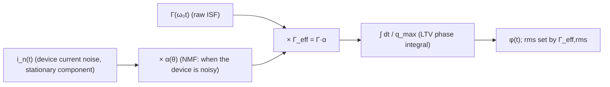

> **β**: This English translation is in beta — the Traditional-Chinese original is the authoritative version.

# Lab 14 — Cyclostationary noise and the effective ISF

> **Breadcrumb**: [Simulation labs](/04_simulation_labs/numerical_feeling) › System & advanced › **This page (cyclostationary / effective ISF)**. Upstream: [lab_06](/04_simulation_labs/lab_06_white_noise_phase_noise), [effective_isf](/03_isf_core_theory/effective_isf); related: [lab_09](/04_simulation_labs/lab_09_design_tradeoffs).

The previous labs all assumed the noise source is "equally noisy over the entire cycle" (stationary). Real circuits are not like that:
a tail current source or a switching transistor **conducts — and injects noise — only during part of the cycle**.
Noise whose intensity itself varies periodically with the oscillation phase is called
**cyclostationary noise**. This lab uses a
**noise-modulating function (NMF)** $\alpha(\theta)$, bounded between 0 and 1, to draw "when the device is noisy",
then shows that what actually determines the phase noise is not the raw ISF but the **effective ISF**
$\Gamma_{eff}=\Gamma\cdot\alpha$.

> **Physical intuition (conclusion first)**: phase noise depends not only on how noisy the device is ($\overline{i_n^2}$) but also on
> **at which phase of the waveform it is noisy**. For the same device, if its noisiest interval happens to land where the ISF is large
> (e.g. the zero crossing), it does a lot of damage; if it lands at the peak, where ISF≈0, little damage. Multiplying
> "when it is noisy", $\alpha(\theta)$, into the ISF gives $\Gamma_{eff}=\Gamma\alpha$; taking the rms of $\Gamma_{eff}$
> then yields this cyclostationary source's true effective sensitivity $\Gamma_{eff,rms}$.

## 1. Learning objectives

- Understand the difference between stationary and cyclostationary noise.
- Model "the device is noisy only during part of the cycle" with the NMF $\alpha(\theta)\in[0,1]$.
- Derive the effective ISF $\Gamma_{eff}(\theta)=\Gamma(\theta)\,\alpha(\theta)$ and use it in place of $\Gamma$ when computing the rms.
- See that for the **same device with the same amount of noise**, the injection phase alone can change $\Gamma_{eff,rms}$ by severalfold.

## 2. Mathematical model

Start from the white-noise phase-noise law of [P1] Eq.(21), p.185:

$$
\mathcal{L}\{\Delta\omega\}=10\log_{10}\!\left(\frac{\Gamma_{rms}^2}{q_{max}^2}\cdot\frac{\overline{i_n^2}/\Delta f}{4\,\Delta\omega^2}\right)
$$

This assumes $\overline{i_n^2}/\Delta f$ is constant (stationary). If the noise is cyclostationary,
its instantaneous PSD can be written as "a stationary component times a periodic gate":

$$
\overline{i_n^2(\theta)}/\Delta f=\big(\overline{i_n^2}/\Delta f\big)\cdot\alpha^2(\theta),\qquad \alpha(\theta)\in[0,1].
$$

Plugging this phase dependence back into the ISF integral kernel $\Gamma(\omega_0\tau)\,i_n(\tau)$ of [P1] Eq.(11), p.182
is equivalent to folding the noise's "$\alpha$" into the ISF. Define the **effective ISF** (spec section 10):

$$
\Gamma_{eff}(\theta)=\Gamma(\theta)\,\alpha(\theta).
$$

The phase noise of a cyclostationary source is then obtained by replacing $\Gamma_{rms}$ with $\Gamma_{eff,rms}$:

$$
\Gamma_{eff,rms}=\sqrt{\frac{1}{2\pi}\int_0^{2\pi}\big[\Gamma(\theta)\,\alpha(\theta)\big]^2\,d\theta},
$$

and substituting it into [P1] Eq.(21): $\mathcal{L}\propto\Gamma_{eff,rms}^2/q_{max}^2$.

- **Why multiplication is correct**: $\alpha$ describes "the fraction by which the noise amplitude is gated"; the ISF describes
  "how efficiently noise at that phase converts into phase". Both act on the same injection at the same instant, so their effects multiply.
- **Dimension check**: $\Gamma$ dimensionless, $\alpha$ dimensionless ($\in[0,1]$) ⇒ $\Gamma_{eff}$ dimensionless ✓,
  same units as the raw ISF, directly substitutable into Eq.(21).

This lab uses the ideal-LC $\Gamma(\theta)=-\sin\theta$ (derived in [P1]; maximum $\vert\Gamma\vert$ at the
zero crossing $\theta=\pi/2$, $\Gamma\approx0$ at the peak $\theta=0$), paired with two smooth gates of equal width $\pi$:
one gate at the zero crossing (bad), one at the peak (good).

## 3. Block diagram



## 4. Core Python code

Below is the core of `simulations/lab_14_cyclostationary_isf.py`: use `gamma_lc_ideal` ($-\sin$)
as the ISF, a smooth periodic window `nmf_window` as $\alpha(\theta)$, then `effective_isf` (i.e. $\Gamma\cdot\alpha$)
and `gamma_rms` to compute each rms.

```python
import numpy as np
from simulations.common.isf_utils import gamma_lc_ideal, gamma_rms, effective_isf


def nmf_window(theta, center, width):
    """Smooth periodic gate in [0,1], centered at `center`, of given width (rad)."""
    d = np.angle(np.exp(1j * (theta - center)))  # wrapped distance
    return 0.5 * (1 + np.cos(np.pi * np.clip(d / (width / 2), -1, 1)))


theta = np.linspace(0, 2 * np.pi, 2000, endpoint=True)
gamma = gamma_lc_ideal(theta)                 # -sin(theta)

# case 1: device noisy near the ZERO CROSSING (where |Gamma| is max) -> bad
a_bad = nmf_window(theta, center=np.pi / 2, width=np.pi)
# case 2: device noisy near the PEAK (where |Gamma|~0) -> good
a_good = nmf_window(theta, center=0.0, width=np.pi)

g_bad = effective_isf(gamma, a_bad)           # Gamma * alpha
g_good = effective_isf(gamma, a_good)

grms = gamma_rms(theta, gamma)                # stationary reference
grms_bad = gamma_rms(theta, g_bad)
grms_good = gamma_rms(theta, g_good)
print(f"stationary={grms:.3f} bad={grms_bad:.3f} good={grms_good:.3f}")
# -> stationary=0.707, bad=0.395, good=0.177
```

`effective_isf(gamma_values, alpha_values)` is a pointwise product (see `simulations/common/isf_utils.py`),
and `gamma_rms(theta, gamma)` is $\sqrt{\frac{1}{2\pi}\int_0^{2\pi}\Gamma^2\,d\theta}$, corresponding to [P1] Eq.(20).

## 5. Full script path

`simulations/lab_14_cyclostationary_isf.py` (`main()` generates the figure; the NMF uses `nmf_window`,
the effective ISF and rms use `effective_isf`, `gamma_rms`,
`gamma_lc_ideal` from `simulations/common/isf_utils.py`). Re-run: `python scripts/run_all_sims.py`.

## 6. Parameter table

| Parameter | Symbol | Value | Role |
|---|---|---|---|
| ISF (ideal LC) | $\Gamma(\theta)$ | $-\sin\theta$ | fixed (physically derived) |
| Number of phase samples | — | 2000 | one cycle $[0,2\pi]$ (endpoint included) |
| Bad gate center | $\theta_{c,\text{bad}}$ | $\pi/2$ | noise lands on the zero crossing ($\vert\Gamma\vert$ maximal) |
| Good gate center | $\theta_{c,\text{good}}$ | $0$ | noise lands on the peak ($\Gamma\approx0$) |
| Gate width | width | $\pi$ | same for both cases (half a cycle) |
| NMF bounds | $\alpha$ | $[0,1]$ | smooth raised-cosine window |

## 7. Units table

| Quantity | Symbol | Unit |
|---|---|---|
| Oscillation phase | $\theta=\omega_0\tau$ | rad |
| ISF | $\Gamma$ | dimensionless |
| NMF | $\alpha$ | dimensionless ($\in[0,1]$) |
| effective ISF | $\Gamma_{eff}=\Gamma\alpha$ | dimensionless |
| rms ISF | $\Gamma_{rms},\Gamma_{eff,rms}$ | dimensionless |

## 8. Simulation figure


## 9. How to read the figure

- **Left panel (a)**: the black curve is the ISF $\Gamma=-\sin\theta$ ($\vert\Gamma\vert$ maximal at $\theta/2\pi=0.25$, $0.75$,
  i.e. the zero crossings; $\Gamma=0$ at $0$, $0.5$, i.e. the peaks). The red dashed $\alpha$ places the device's noisy
  interval at the zero crossing ($\theta/2\pi\approx0.25$); the green dashed $\alpha$ places it at the peak ($\theta/2\pi\approx0$).
  The two gates have exactly the same shape and width — **only the phase differs**.
- **Right panel (b)**: multiplying the left panel gives $\Gamma_{eff}=\Gamma\alpha$. The red curve (bad) collides with the ISF's
  large values at the zero crossing, leaving a deep, wide lobe, $\Gamma_{eff,rms}=0.395$; the green curve (good) lands on the peak, where the ISF is nearly 0,
  leaving only small residual lobes on either side, $\Gamma_{eff,rms}=0.177$.
- **Key reading**: the stationary reference is $\Gamma_{rms}=0.707$ (=$1/\sqrt2$, the full-cycle rms of $-\sin$).
  Once the gate is open for only half the cycle, the rms must drop; but **how much it drops depends entirely on where the gate lands on the ISF**: the bad case
  still retains $0.395$, the good case is cut to $0.177$ — a difference of about $2.2\times$.
  The phase-noise difference is $20\log_{10}(0.395/0.177)\approx7$ dB. **Same device, same amount of noise — changing only the injection phase buys 7 dB.**

## 10. Corresponding paper equations/figures

- **White-noise phase noise (with $\Gamma_{eff,rms}$ replacing $\Gamma_{rms}$)**: [P1] Eq.(21), p.185.
- **ISF integral kernel ($\Gamma\cdot i_n$, where $\alpha$ folds in)**: [P1] Eq.(11), p.182.
- **Parseval / rms**: [P1] Eq.(20), p.185, $\sum_n c_n^2=2\Gamma_{rms}^2$.
- **Cyclostationary-noise concept**: [P1] Sec. II-D "Cyclostationary Noise Sources",
  Eq.(25)–(27), p.186. There $i_n(t)=i_{n0}(t)\,\alpha(\omega_0 t)$ is Eq.(25), substituting it back into the integral is Eq.(26),
  and the effective ISF $\Gamma_{eff}(x)=\Gamma(x)\cdot\alpha(x)$ is Eq.(27); this lab is its toy visualization.
- **Concept extension**: where a device's $\alpha$ comes from and how it is mapped — see
  [device_noise_mapping](/06_design_insights/device_noise_mapping) and
  [effective_isf](/03_isf_core_theory/effective_isf).

## 11. Limitations and approximations

- **Toy model, not transistor-level**: $\alpha(\theta)$ is an artificial raised-cosine window, not a real NMF extracted from a transistor's
  $g_m$ / conduction interval; the ISF is the ideal-LC $-\sin$. A real device's $\alpha$ and $\Gamma$
  must both be extracted from PSS/transient simulation.
- **$\Gamma_{eff}=\Gamma\alpha$ is a first-order approximation**: assumes the noise amplitude is linearly modulated by the gate and that $\alpha$ and the phase
  response are mutually independent; ignores the noise's own AM–PM and any coupling between $\alpha$ and $\Gamma$.
- **rms illustration only, no PSD run**: this lab uses $\Gamma_{eff,rms}$ to show the scaling; it does not actually push a cyclostationary
  source through the [P1] Eq.(11) integral to produce a PSD (that would be an extension of lab_06).
- **Single source**: real circuits have multiple cyclostationary sources, each with its own $\alpha$; compute each $\Gamma_{eff,rms}$
  separately and then sum in power.
- **Factor-of-2**: follows the $4\Delta\omega^2$ convention of Eq.(21); the factor-of-2 SSB bookkeeping difference does not affect any of the
  relative (dB) comparisons here.

## Key takeaways

- Cyclostationary noise: noise intensity varies periodically with the oscillation phase, described by $\alpha(\theta)\in[0,1]$.
- Effective ISF: $\Gamma_{eff}=\Gamma\cdot\alpha$; the phase noise substitutes $\Gamma_{eff,rms}$ for $\Gamma_{rms}$ in [P1] Eq.(21).
- Numbers in this lab: stationary $\Gamma_{rms}=0.707$; noise at the zero crossing → $0.395$ (bad); at the peak → $0.177$ (good).
- Design implication: arranging noisy devices to inject at phases where the ISF is small (the peaks) saves considerable phase noise.

## Further reading

- Effective-ISF theory: [effective_isf](/03_isf_core_theory/effective_isf)
- White noise → phase noise (stationary version): [lab_06_white_noise_phase_noise](/04_simulation_labs/lab_06_white_noise_phase_noise)
- Design trade-off roundup: [lab_09_design_tradeoffs](/04_simulation_labs/lab_09_design_tradeoffs)
- **Use in design/theory**: how a device's $\alpha(\theta)$ is mapped from bias / conduction interval → [device_noise_mapping](/06_design_insights/device_noise_mapping)
