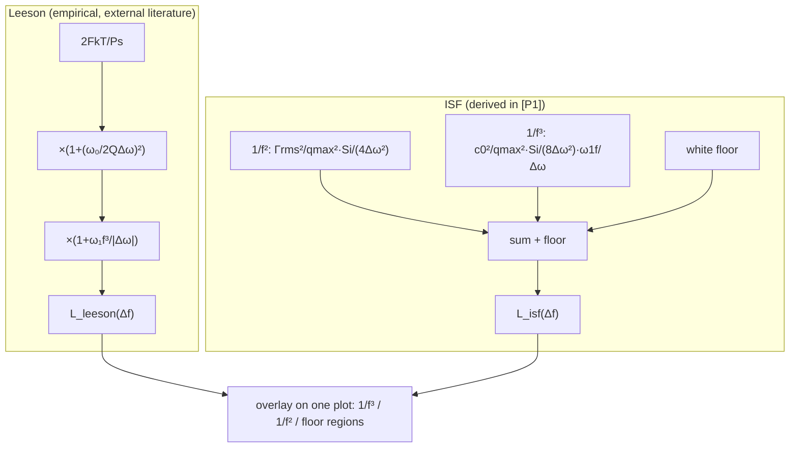

# Lab 16 — Leeson Model vs ISF Model (Three-Region Comparison)

> **Breadcrumb**: [Simulation labs](/04_simulation_labs/numerical_feeling) › System & advanced › **This page (Leeson vs ISF)**. Upstream: [lab_06](/04_simulation_labs/lab_06_white_noise_phase_noise), [lab_07](/04_simulation_labs/lab_07_flicker_noise_upconversion); related: [lab_09](/04_simulation_labs/lab_09_design_tradeoffs).

> **β**: This English translation is in beta — the Traditional-Chinese original is the authoritative version.

The phase-noise model designers see most often actually comes in two lineages. One is **Leeson (1966)**, an empirical formula:
it fits a measured curve **after the fact** into three regions — $1/f^3$, $1/f^2$, and a flat floor — with parameters (quality factor $Q$, noise figure $F$,
flicker corner) mostly obtained by fitting. The other is the **ISF model**, the main thread of this site: from [P1] Hajimiri–Lee's LTV
theory it **derives from first principles** the same three regions, and every parameter has a physical origin ($\Gamma_{rms}$, $q_{max}$, $c_0$).
This lab overlays the two curves on one plot so you can see clearly: **they are two maps of the same mountain** — Leeson describes
"what it looks like", the ISF explains "why it looks that way".

> **External-literature note**: the Leeson model is **external literature, not among the five source PDFs**; it is supplemented from the standard reference
> (D. B. Leeson, *"A simple model of feedback oscillator noise spectrum,"* Proc. IEEE, 1966).
> This site treats it as a comparison baseline and historical context; **the ISF model is the main thread**. Step-by-step Leeson derivation and term-by-term comparison:
> see the appendix [derivation_leeson](/99_appendix/derivation_leeson).

> **Physical intuition (conclusion first)**: every free-running oscillator's phase noise looks the same from near to far — close to the carrier it is
> $1/f^3$ (flicker upconversion, steepest, $-30$ dB/dec), the middle is $1/f^2$ (white noise, $-20$ dB/dec), and the far end is
> a flat measurement/buffer floor. Leeson assembles the three regions with $Q$ and a corner; the ISF tells you the $1/f^2$ region's height
> is $\Gamma_{rms}^2/q_{max}^2$, the $1/f^3$ region is set by $c_0^2$, and the corner does not equal the device $1/f$ corner.

## 1. Learning objectives

- Recognize the three-region structure of the empirical Leeson model and its fitting parameters ($F,Q,$ flicker corner).
- Write the ISF model ([P1] Eq.(21) + Eq.(23) + floor) as the same three regions and overlay the plots.
- Understand the correspondence and differences of the two models in the $1/f^3$, $1/f^2$, and floor regions.
- Understand how the ISF **gives Leeson's parameters physical meaning** (and honestly flag Leeson as external literature).

## 2. Mathematical model

**Leeson model** (external literature, not among the five PDFs; verbatim per spec section 10.2):

$$
\mathcal{L}(\Delta\omega)=10\log_{10}\!\left[\frac{2FkT}{P_s}\left(1+\Big(\frac{\omega_0}{2Q\Delta\omega}\Big)^2\right)\left(1+\frac{\omega_{1/f^3}}{\lvert\Delta\omega\rvert}\right)\right]
$$

- First bracket $\big(1+(\omega_0/2Q\Delta\omega)^2\big)$: approaches $1$ at large offset (floor), and gives the
  $1/\Delta\omega^2$-shaped $1/f^2$ region at small offset; the corner is set by $Q$ (tank quality factor).
- Second bracket $\big(1+\omega_{1/f^3}/\vert\Delta\omega\vert\big)$: inside the corner it multiplies in an extra
  $1/\vert\Delta\omega\vert$, lifting $1/f^2$ into $1/f^3$.
- $F$ is the noise figure, $P_s$ the signal power, $kT$ the thermal noise — in Leeson these are mostly **fitted/estimated** values.

**ISF model** (derived from [P1] plus one white-noise floor): add the $1/f^2$ ([P1] Eq.(21)) and $1/f^3$
([P1] Eq.(23)) regions on a linear scale, then add the floor:

$$
\mathcal{L}(\Delta\omega)=10\log_{10}\!\left[\underbrace{\frac{\Gamma_{rms}^2}{q_{max}^2}\frac{\overline{i_n^2}/\Delta f}{4\,\Delta\omega^2}}_{1/f^2,\ \text{Eq.(21)}}+\underbrace{\frac{c_0^2}{q_{max}^2}\frac{\overline{i_n^2}/\Delta f}{8\,\Delta\omega^2}\frac{\omega_{1/f}}{\Delta\omega}}_{1/f^3,\ \text{Eq.(23)}}+\underbrace{\text{floor}}_{\text{flat}}\right]
$$

- **Physical correspondence**: the ISF's $1/f^2$ region height $=\Gamma_{rms}^2/q_{max}^2$ (Leeson's $2FkT/P_s$ maps to it),
  while the $1/f^3$ region strength is set by **$c_0^2$** (the ISF DC coefficient, waveform asymmetry).
- **Corners have different origins**: the ISF's $1/f^3$ corner ([P1] Eq.(24)) is
  $\Delta\omega_{1/f^3}=\omega_{1/f}\,c_0^2/(2\Gamma_{rms}^2)$, which is **not equal to** the device's $\omega_{1/f}$;
  Leeson simply inserts the corner as a fitting parameter $\omega_{1/f^3}$.
- **Dimension check**: both bracketed terms are dimensionless power ratios (before taking $10\log_{10}$ in dBc/Hz), so adding them is legitimate ✓;
  the $1/f^2$ term $\propto1/\Delta\omega^2$ and the $1/f^3$ term carries one more $1/\Delta\omega$ ✓.

Numbers for this lab (pedagogical, deliberately tuned so the two curves overlap in the middle region): $f_0=5$ GHz, $Q=10$, $F=5$,
$P_s=1$ mW, flicker corner $f_c=100$ kHz; on the ISF side $q_{max}=1$ pC, $\Gamma_{rms}=0.5$, $c_0=0.2$,
$\overline{i_n^2}/\Delta f=10^{-20}$ A²/Hz, floor $=-160$ dBc/Hz.

## 3. Block diagram



## 4. Core Python code

Core of `simulations/lab_16_leeson_vs_isf.py`: each model computes dBc/Hz, overlaid on a semilogx plot.

```python
import numpy as np

k = 1.380649e-23
T = 300.0

f = np.logspace(3, 8, 2000)          # 1 kHz .. 100 MHz offset
dw = 2 * np.pi * f
f0 = 5e9
w0 = 2 * np.pi * f0

# --- Leeson (empirical; external literature) ---
F = 5.0; Ps = 1e-3; Q = 10.0; fc = 1e5            # flicker corner 100 kHz
leeson = (2 * F * k * T / Ps) * (1 + (w0 / (2 * Q * dw)) ** 2) * (1 + 2 * np.pi * fc / dw)
L_leeson = 10 * np.log10(leeson)

# --- ISF model ([P1] Eq.(21) 1/f^2 + Eq.(23) 1/f^3 + white floor) ---
qmax = 1e-12
in2_df = 1e-20
Grms = 0.5
c0 = 0.2
w1f = 2 * np.pi * fc
floor = 10 ** (-160 / 10)
isf = (Grms ** 2 / qmax ** 2) * in2_df / (4 * dw ** 2) \
    + (c0 ** 2 / qmax ** 2) * in2_df / (8 * dw ** 2) * (w1f / dw) \
    + floor
L_isf = 10 * np.log10(isf)
```

- **How to read it**: Leeson multiplies the three regions together (floor → $\times1/f^2$ factor → $\times1/f^3$ factor); the ISF **adds** the three
  regions in the linear power domain. Both bookkeeping styles produce a three-segment broken line on a log plot.
- **Note on the constants**: the ISF-side $\Gamma_{rms},c_0,$ floor were deliberately picked so the two curves overlap in the middle region for the teaching overlay,
  **not extracted from any specific circuit**.

## 5. Full script path

`simulations/lab_16_leeson_vs_isf.py` (`main()` computes both models, overlays them on semilogx, and marks the $1/f^3$ corner).
Re-run: `python scripts/run_all_sims.py`.

## 6. Parameter table

| Parameter | Symbol | Value | Belongs to | Role |
|---|---|---|---|---|
| Carrier frequency | $f_0$ | $5$ GHz | Shared | $\omega_0=2\pi f_0$ |
| Offset range | $\Delta f$ | $1$ kHz–$100$ MHz | Shared | Horizontal axis |
| Quality factor | $Q$ | $10$ | Leeson | Sets the $1/f^2$ corner |
| Noise figure | $F$ | $5$ | Leeson | Floor height |
| Signal power | $P_s$ | $1$ mW | Leeson | $2FkT/P_s$ |
| Flicker corner | $f_c$ | $100$ kHz | Shared | $1/f^3$ corner (dotted line in figure) |
| Maximum charge swing | $q_{max}$ | $1$ pC | ISF | $\Gamma_{rms}^2/q_{max}^2$ |
| ISF rms | $\Gamma_{rms}$ | $0.5$ | ISF | $1/f^2$ height |
| ISF DC coefficient | $c_0$ | $0.2$ | ISF | $1/f^3$ strength |
| Current noise PSD | $\overline{i_n^2}/\Delta f$ | $10^{-20}$ A²/Hz | ISF | Noise magnitude |
| Noise floor | floor | $-160$ dBc/Hz | ISF | Flat region |

## 7. Unit table

| Quantity | Symbol | Unit |
|---|---|---|
| Offset frequency | $\Delta f,\ \Delta\omega$ | Hz, rad/s |
| Phase noise | $\mathcal{L}$ | dBc/Hz |
| Quality factor / noise figure | $Q,\ F$ | Dimensionless |
| Power | $P_s$ | W |
| Charge | $q_{max}$ | C |
| ISF rms / DC coefficient | $\Gamma_{rms},\ c_0$ | Dimensionless |
| Current noise PSD | $\overline{i_n^2}/\Delta f$ | A²/Hz |
| $kT$ | — | J |

## 8. Simulation figure


## 9. How to read the figure

- **Three-segment broken line**: both curves, from left (close to carrier) to right (far offset), show
  $1/f^3$ (steepest) → $1/f^2$ (middle) → flat floor. The gray dotted line is the $1/f^3$ corner ($f_c=100$ kHz):
  to its left both curves are steeper ($-30$ dB/dec), to its right they turn to $-20$ dB/dec.
- **Overlap in the middle, divergence at the ends**: this lab deliberately tunes the parameters so the two curves nearly coincide in the $1/f^2$ region (teaching overlay). Note
  the right end (large offset) where the curves separate: Leeson's $(1+\ldots)$ factor has already flattened toward its constant floor, while the ISF model's
  floor is set lower at $-160$ dBc/Hz, so the red curve keeps following $1/f^2$ a while longer at high offset before hitting the floor.
  **This difference is not a bug — the two models book the floor differently** — a reminder that "the curve shape is right; absolute values depend on each model's parameters".
- **Key reading**: Leeson's $Q$ sets the mid-region corner, $F/P_s$ sets the floor; the ISF's $\Gamma_{rms}/q_{max}$ sets the
  mid-region height, $c_0$ sets the $1/f^3$ strength. **One curve, two languages**: to lower the middle region, lower $\Gamma_{rms}$ / raise
  $q_{max}$ (= raise $Q$, raise $P_s$); to lower close-in noise, suppress $c_0$ (= make the waveform symmetric).

## 10. Corresponding paper equations/figures

- **ISF $1/f^2$ region**: [P1] Eq.(21), p.185, $\mathcal{L}\propto\Gamma_{rms}^2/q_{max}^2/\Delta\omega^2$.
- **ISF $1/f^3$ region**: [P1] Eq.(23), p.185, $\propto c_0^2\cdot\omega_{1/f}/\Delta\omega^3$.
- **$1/f^3$ corner (physical meaning, different from the device corner)**: [P1] Eq.(24), p.185.
- **Full three-region picture**: [P1] Fig. 11 / Fig. 12, p.185 ($1/f^3$, $1/f^2$, floor, and corner definitions).
- **Leeson model**: D. B. Leeson, Proc. IEEE, 1966, **not among the five source PDFs**, supplemented as external literature;
  step-by-step derivation and term-by-term comparison in [derivation_leeson](/99_appendix/derivation_leeson).

## 11. Limitations and approximations

- **Leeson is an empirical model (external literature)**: $F$, $Q$, and the corner are mostly after-the-fact fits, unlike the ISF which derives them from circuit quantities
  ($\Gamma_{rms},q_{max},c_0$); the Leeson parameters in this figure are illustrative.
- **Parameters deliberately co-tuned**: the ISF-side $\Gamma_{rms}=0.5,c_0=0.2,$ floor$=-160$ dBc/Hz were chosen to make the curves
  coincide in the middle region, **not extracted from any specific oscillator**; do not read the absolute dBc/Hz as real device specs.
- **Different floor bookkeeping**: Leeson's floor is built into the $(1+\ldots)$ factor, while the ISF model uses an added constant floor;
  hence the divergence at high offset (see figure reading) — a model-structure difference, not a physical one.
- **Single white source, linear region summation**: the ISF model directly adds $1/f^2$ and $1/f^3$ in the linear power domain, ignoring multiple sources,
  cyclostationarity (see [lab_14](/04_simulation_labs/lab_14_cyclostationary_isf)), and AM–PM.
- **Factor-of-2**: $1/f^2$ uses Eq.(21)'s $4\Delta\omega^2$, $1/f^3$ uses Eq.(23)'s $8\Delta\omega^2$;
  the minor factor-of-2 SSB-bookkeeping dispute does not affect the three-region slopes or the comparison conclusions.
- **$Q=10$ is low**: illustrative; real LC tanks often have $Q\gtrsim$ several tens, moving Leeson's mid-region corner closer to the carrier.

## Key takeaways

- Free-running oscillator phase noise has three regions: $1/f^3$ (close-in) → $1/f^2$ (white noise) → flat floor.
- Leeson (empirical, external literature) and the ISF (derived in [P1]) describe the same three regions; the ISF gives Leeson's parameters physical meaning.
- $1/f^2$ height $=\Gamma_{rms}^2/q_{max}^2$ (↔ Leeson's $2FkT/P_s$ and $Q$); $1/f^3$ strength $=c_0^2$.
- The ISF's $1/f^3$ corner ([P1] Eq.(24)) scales with $c_0^2/\Gamma_{rms}^2$ and is **not equal to** the device $1/f$ corner.

## Further reading

- White noise → $1/f^2$: [lab_06_white_noise_phase_noise](/04_simulation_labs/lab_06_white_noise_phase_noise), [white_noise_to_phase_noise](/03_isf_core_theory/white_noise_to_phase_noise)
- Flicker upconversion → $1/f^3$ and $c_0$: [lab_07_flicker_noise_upconversion](/04_simulation_labs/lab_07_flicker_noise_upconversion), [flicker_noise_upconversion](/03_isf_core_theory/flicker_noise_upconversion)
- Design trade-offs: [lab_09_design_tradeoffs](/04_simulation_labs/lab_09_design_tradeoffs)
- **Applied to design/theory**: step-by-step Leeson derivation and term-by-term "$Q,F,1/f^3$ corner" mapping onto the ISF → [derivation_leeson](/99_appendix/derivation_leeson)
