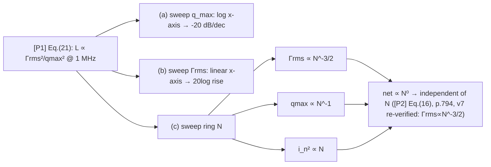

# Lab 17 — Design Sweeps: Three Design Curves for swing / Γrms / N

> **Breadcrumb**: [Simulation labs](/04_simulation_labs/numerical_feeling) › System & advanced › **This page (advanced design sweeps)**. Back-of-the-envelope intro version: [lab_09](/04_simulation_labs/lab_09_design_tradeoffs); upstream: [lab_06](/04_simulation_labs/lab_06_white_noise_phase_noise), [lab_08](/04_simulation_labs/lab_08_jitter_integration).

> **β**: This English translation is in beta — the Traditional-Chinese original is the authoritative version.

[lab_09](/04_simulation_labs/lab_09_design_tradeoffs) read [P1] Eq.(21) as a scaling law by mental arithmetic.
This lab **actually sweeps the same equation and plots it as three curves**: holding everything else fixed, sweep the node charge swing
$q_{max}$ (swing), the ISF rms $\Gamma_{rms}$, and the ring stage count $N$, and watch how the phase noise
$\mathcal{L}$ at $1$ MHz offset moves. On the plots you will see with your own eyes the "$-20$ dB/decade" straight-line slope, the "$2\times$ swing $\to-6$ dB"
arrow, and the ring oscillator's **nearly horizontal** $N$ curve (the famous $N$-independence).

> **Physical intuition (conclusion first)**: $1/f^2$ phase noise $\propto\Gamma_{rms}^2/q_{max}^2$.
> Both knobs enter as $20\log_{10}$: doubling $q_{max}$ → $-6$ dB; halving $\Gamma_{rms}$ → $-6$ dB.
> The ring's $N$ is sneakier: adding stages shrinks $\Gamma_{rms}\propto N^{-3/2}$, but the per-node $q_{max}$ shrinks and there are
> more noisy devices — **the three roughly cancel at fixed $f_0$/power**, so net phase noise is almost independent of $N$.

## 1. Learning objectives

- Plot [P1] Eq.(21)'s $\mathcal{L}\propto\Gamma_{rms}^2/q_{max}^2$ as three design curves.
- On the $q_{max}$ curve, quantify "$-20$ dB/decade" and "$2\times$ swing $\to-6$ dB".
- On the $\Gamma_{rms}$ curve, see "symmetric waveform / low $\Gamma_{rms}\to$ PN↓".
- On the ring $N$ curve, see where $N$-independence comes from ([P2] Eq.(16), p.794 — v7 re-verified: $\Gamma_{rms}\propto N^{-3/2}$).
- Connect the curves back to [lab_09](/04_simulation_labs/lab_09_design_tradeoffs) and the Chapter 06 design-insight pages.

## 2. Mathematical model

The starting point is again [P1] Eq.(21), p.185 ($1/f^2$ region, fixed offset):

$$
\mathcal{L}\{\Delta\omega\}=10\log_{10}\!\left(\frac{\Gamma_{rms}^2}{q_{max}^2}\cdot\frac{\overline{i_n^2}/\Delta f}{4\,\Delta\omega^2}\right)
$$

Expand the logarithm to expose each knob's own slope:

$$
\mathcal{L}=20\log_{10}\Gamma_{rms}-20\log_{10}q_{max}+10\log_{10}\!\big(\overline{i_n^2}/\Delta f\big)-20\log_{10}(2\Delta\omega)+\text{const}.
$$

- **Knob 1 ($q_{max}$)**: $-20\log_{10}q_{max}$ → against a $\log$ horizontal axis in $q_{max}$ this is a straight line with slope $-20$ dB/decade;
  $q_{max}\times2\Rightarrow20\log_{10}2=6.02$ dB → **$-6$ dB**.
- **Knob 2 ($\Gamma_{rms}$)**: $+20\log_{10}\Gamma_{rms}$ → halving $\Gamma_{rms}$ → $-6$ dB;
  this lab uses a linear horizontal axis, so the curve is the logarithmic rise of $20\log_{10}\Gamma_{rms}$.

**The ring's $N$** ([P2] Eq.(16), p.794 — v7 re-verified: the square root covers only the constant, $\Gamma_{rms}\propto N^{-3/2}$;
the body text's $4/N^{1.5}$ at η=0.75 and App. B Eq.(55) triple-confirm this. v3 had misread it as $N^{-3/4}$): adding stages moves three things at once, and the three cancel each other at fixed $f_0$/power:

$$
\Gamma_{rms}\propto N^{-3/2}\ \text{[P2] Eq.(16)},\qquad q_{max}\propto N^{-1}\ (\text{smaller per-node swing}),\qquad \overline{i_n^2}\propto N\ (\text{more devices}).
$$

Substituting into $\Gamma_{rms}^2/q_{max}^2\cdot\overline{i_n^2}$:

$$
\frac{(N^{-3/2})^2}{(N^{-1})^2}\cdot N=\frac{N^{-3}}{N^{-2}}\cdot N=N^{-1}\cdot N=N^{0}=\text{const}.
$$

- **Conclusion**: under this toy scaling the net effect $\propto N^0$ → **phase noise is independent of $N$** ([P2]'s signature result).
- **Dimension check**: $\Gamma_{rms}^2/q_{max}^2\cdot(\text{A}^2/\text{Hz})/(\text{rad/s})^2$ →
  the bracket is dimensionless (before taking $10\log_{10}$), legitimate ✓; $N$ is dimensionless throughout ✓.

Numbers for this lab: evaluated at $\Delta f=1$ MHz, $\overline{i_n^2}/\Delta f=10^{-22}$ A²/Hz; the baseline
$q_{max}=1$ pC, $\Gamma_{rms}=0.5$ gives $\mathcal{L}=-128.0$ dBc/Hz.

## 3. Block diagram



## 4. Core Python code

`simulations/lab_17_design_sweep.py` uses a shared `L_dbc` to evaluate [P1] Eq.(21) in dBc/Hz,
then sweeps one curve per knob:

```python
import numpy as np


def L_dbc(Grms, qmax, in2_df, dw):
    return 10 * np.log10(Grms ** 2 / qmax ** 2 * in2_df / (4 * dw ** 2))


dw = 2 * np.pi * 1e6        # evaluate at 1 MHz offset
in2_df = 1e-22

# (a) sweep q_max: 0.1 pC .. 10 pC  -> slope -20 dB/decade, 2x -> -6 dB
q = np.logspace(-13, -11, 50)
L_q = L_dbc(0.5, q, in2_df, dw)                # baseline qmax=1pC -> -128 dBc/Hz

# (b) sweep Gamma_rms: low Grms -> lower PN
g = np.linspace(0.1, 1.5, 50)
L_g = L_dbc(g, 1e-12, in2_df, dw)

# (c) ring N: Gamma_rms ~ N^-3/2, per-node qmax ~ 1/N, more noisy devices ~ N
N = np.arange(3, 31)
Grms_N = 0.5 * (5.0 / N) ** 1.5                # scaling (illustrative; [P2])
qmax_N = 1e-12 * (5.0 / N)                      # lower per-node swing as N grows
noise_N = in2_df * (N / 5.0)                    # more noisy devices
L_N = 10 * np.log10(Grms_N ** 2 / qmax_N ** 2 * noise_N / (4 * dw ** 2))
print(round(L_N[0], 1), round(L_N[-1], 1))
# -> -128.0 -128.0  (essentially flat for all N: the famous N-independence)
```

- **`L_dbc` vs lab_08**: lab_08 **integrates** the measured $\mathcal{L}$ into jitter; here we go the other way, using
  Eq.(21) to **generate** $\mathcal{L}$ and then sweep the knobs. The two pages are inverse operations of each other (same note as in lab_09).
- **The three scalings in (c) are illustrative**: the constant in $\Gamma_{rms}\propto N^{-3/2}$ and the exponents for per-node $q_{max}$ and
  device count are toy assumptions, meant to draw concretely "why $N$ roughly cancels".

## 5. Full script path

`simulations/lab_17_design_sweep.py` (`main()` draws the three subplots; `L_dbc` wraps [P1] Eq.(21) in dBc/Hz;
(c) uses the toy scaling $\Gamma_{rms}\propto N^{-3/2}$, $q_{max}\propto N^{-1}$, $\overline{i_n^2}\propto N$).
Re-run: `python scripts/run_all_sims.py`.

> Note: this page's filename is `lab_17_design_tradeoffs.md` (aligned with the sidebar naming convention); the corresponding script is
> `lab_17_design_sweep.py`, and the figure file is `design_tradeoff_sweeps.png`.

## 6. Parameter table

| Parameter | Symbol | Value / sweep range | Role |
|---|---|---|---|
| Offset (evaluation point) | $\Delta f$ | $1$ MHz | Fixed |
| Current noise PSD | $\overline{i_n^2}/\Delta f$ | $10^{-22}$ A²/Hz | Fixed (baseline); varies with $N$ in (c) |
| Maximum charge swing | $q_{max}$ | (a) $0.1$–$10$ pC; baseline $1$ pC | **Knob 1** |
| ISF rms | $\Gamma_{rms}$ | (b) $0.1$–$1.5$; baseline $0.5$ | **Knob 2** |
| Ring stage count | $N$ | (c) $3$–$30$; baseline $5$ | **Knob 3** |
| Baseline phase noise | $\mathcal{L}$ | $-128.0$ dBc/Hz | From Eq.(21) ($q_{max}=1$ pC, $\Gamma_{rms}=0.5$) |

## 7. Unit table

| Quantity | Symbol | Unit |
|---|---|---|
| Maximum charge swing | $q_{max}$ | C |
| ISF rms | $\Gamma_{rms}$ | Dimensionless |
| Ring stage count | $N$ | Dimensionless |
| Offset frequency | $\Delta f,\ \Delta\omega$ | Hz, rad/s |
| Phase noise | $\mathcal{L}$ | dBc/Hz |
| Current noise PSD | $\overline{i_n^2}/\Delta f$ | A²/Hz |

## 8. Simulation figure


## 9. How to read the figure

- **(a) swing sweep (blue)**: on a log horizontal axis, $q_{max}$ (0.1–10 pC) vs $\mathcal{L}$ is a straight line with slope
  **$-20$ dB/decade** — as $q_{max}$ goes from 0.1 → 10 pC (two decades), $\mathcal{L}$ drops from $-108$ → $-148$ dBc/Hz,
  exactly $40$ dB. The red arrow marks "$2\times$ swing $\to-6$ dB" ($1\to2$ pC, $-128\to-134$ dBc/Hz).
  **Mnemonic: double the swing, gain 6 dB of phase noise.**
- **(b) $\Gamma_{rms}$ sweep (green)**: linear horizontal axis, a logarithmic curve $\mathcal{L}=20\log_{10}\Gamma_{rms}+$const —
  smaller $\Gamma_{rms}$ means lower phase noise, with the steepest descent at the small-$\Gamma_{rms}$ end (halving $\Gamma_{rms}$
  from 0.5 to 0.25 → $-6$ dB). This is the payoff of "symmetric waveform / low sensitivity".
- **(c) ring $N$ sweep (purple)**: a **nearly perfectly horizontal** line ($\approx-128$ dBc/Hz, independent of $N$).
  Not a coincidence — it is the $N^0$ computed in Section 2: more stages shrink $\Gamma_{rms}$ (good), but $q_{max}$ also shrinks and there are
  more devices (bad); the three cancel at fixed $f_0$/power. **Adding ring stages does not buy you phase noise for free** ([P2]).
- **Putting it together**: (a)(b) are the "knobs that truly earn dB" (raise the swing, suppress $\Gamma_{rms}$); (c) is the
  "looks tunable, actually cancels" knob — choose $N$ based on $f_0$, power, area, and phase-count requirements, not for phase noise.

## 10. Corresponding paper equations/figures

- **Main scaling**: [P1] Eq.(21), p.185, $\mathcal{L}\propto\Gamma_{rms}^2/q_{max}^2$.
- **Parseval / $\Gamma_{rms}$**: [P1] Eq.(20), p.185.
- **Ring $\Gamma_{rms}$ scaling**: [P2] Eq.(16), p.794 (v7 re-verified: the square root covers only the constant,
  $\Gamma_{rms}\propto N^{-3/2}$; the body text's $4/N^{1.5}$ at η=0.75 and App. B Eq.(55) triple-confirm this. v3 had misread it as $N^{-3/4}$).
- **Ring frequency**: [P2] Eq.(15), p.794, $f_0=1/(2N\tau_D)$.
- **Ring white-noise FOM / $N$-independence**: [P2], p.795, $\mathcal{L}\vert_{1/f^2}\approx\frac{8}{3\eta}\,\frac{V_{DD}}{V_{char}}\,\frac{kT}{P}(\omega_0/\Delta\omega)^2$
  (the prefactor of [P2] Eq.(23), p.796 is $8/(3\eta)$ ($\eta$ being the stage-delay proportionality constant of Eq.14, $\approx1$); $\gamma$ enters only through $V_{char}=\Delta V/\gamma$. v2 mistakenly changed this to $8/(3\gamma)$ and mislabeled it "verified verbatim"; v3 corrected it against the original PDF p.796).

## 11. Limitations and approximations

- **Toy scaling, not transistor-level**: (a)(b) assume "turn one knob only, everything else perfectly fixed"; in real circuits
  $q_{max}$, $\Gamma_{rms}$, $N$, power, area, and $f_0$ are coupled and cannot be tuned in isolation.
- **The three exponents in ring (c) are illustrative**: $\Gamma_{rms}\propto N^{-3/2}$, $q_{max}\propto N^{-1}$,
  $\overline{i_n^2}\propto N$ are toy assumptions to demonstrate the cancellation; the exact constants are marked `TODO: manual verification
  needed from [P2] page 794–796`. Changing $N$ also changes $f_0=1/(2N\tau_D)$ (unless $\tau_D$ is shrunk), which this figure does not show simultaneously.
- **$1/f^2$ region only, fixed offset**: evaluated at $1$ MHz; close-in $1/f^3$ is dominated by $c_0$ and the lower integration limit,
  where these three plots do not apply (see [lab_07](/04_simulation_labs/lab_07_flicker_noise_upconversion)).
- **Single white noise source**: ignores multiple sources, cyclostationarity ($\Gamma_{eff}=\Gamma\alpha$,
  [lab_14](/04_simulation_labs/lab_14_cyclostationary_isf)), and AM–PM.
- **Factor-of-2**: uses Eq.(21)'s $4\Delta\omega^2$ convention; the factor-of-2 SSB-bookkeeping difference does not affect any relative (dB) slope.
- **Jitter inference**: $\sigma_t\propto\Gamma_{rms}/q_{max}$ ($-6$ dB phase noise = jitter halved) requires a fixed
  integration range and $1/f^2$ shape; see [lab_08](/04_simulation_labs/lab_08_jitter_integration), [lab_09](/04_simulation_labs/lab_09_design_tradeoffs).

## Key takeaways

- $q_{max}$ curve: $-20$ dB/decade; **$2\times$ swing $\to-6$ dB** (baseline $-128$ → $-134$ dBc/Hz).
- $\Gamma_{rms}$ curve: $20\log_{10}\Gamma_{rms}$, halving $\to-6$ dB; symmetric waveforms / low sensitivity pay off.
- Ring $N$ curve: nearly horizontal — $\Gamma_{rms}^2/q_{max}^2\cdot\overline{i_n^2}\propto N^0$, **phase noise is independent of $N$** ([P2] Eq.(16), p.794, v7 re-verified: $\Gamma_{rms}\propto N^{-3/2}$).
- Baseline: $q_{max}=1$ pC, $\Gamma_{rms}=0.5$, $\overline{i_n^2}/\Delta f=10^{-22}$, $1$ MHz $\to\mathcal{L}=-128.0$ dBc/Hz.

## Further reading

- Back-of-the-envelope design trade-offs: [lab_09_design_tradeoffs](/04_simulation_labs/lab_09_design_tradeoffs)
- Swing / $q_{max}$ design: [tank_swing](/06_design_insights/tank_swing)
- Waveform slope and $\Gamma_{rms}$: [waveform_slope](/06_design_insights/waveform_slope)
- Symmetry kills $1/f^3$: [symmetry](/06_design_insights/symmetry)
- Upstream simulations: [lab_06_white_noise_phase_noise](/04_simulation_labs/lab_06_white_noise_phase_noise), [lab_08_jitter_integration](/04_simulation_labs/lab_08_jitter_integration)
- **Applied to design/theory**: the three scaling curves (swing / $\Gamma_{rms}$ / $N$-independence) land on the LC vs ring topology decision → [lc_vs_ring](/06_design_insights/lc_vs_ring)
