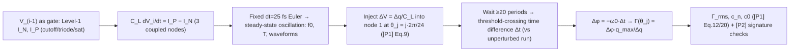

> **β**: This English translation is in beta — the Traditional-Chinese original is the authoritative version.

# Lab 32 — MOS Level-1 Equation-Level Ring: Extracting the ISF from Transistor Equations

> **Breadcrumb**: [Simulation labs](/04_simulation_labs/numerical_feeling) › System & advanced › **This page (MOS Level-1 equation-level ring ISF)**. Upstream: [lab_03](/04_simulation_labs/lab_03_ring_oscillator_toy_model) (toy triangular ISF), [lab_04](/04_simulation_labs/lab_04_impulse_injection_sweep) (impulse extraction method); related: [waveform_slope](/06_design_insights/waveform_slope), [real_oscillator_topologies](/06_design_insights/real_oscillator_topologies).

Every ring ISF on this site so far has been a **hand-placed shape**: the triangle in
[lab_03](/04_simulation_labs/lab_03_ring_oscillator_toy_model)
was only a sketch of "energy concentrated in the transitions" — its height, width, and sign
were never computed. This page takes an honest step forward: **model each inverter stage with
the MOS Level-1 (Shichman-Hodges) square-law equations** —
cutoff/triode/saturation, real $k'$, $V_t$, $W/L$, $C_L$ — integrate the steady-state
oscillation in numpy with a fixed small step, then **assume nothing** and directly **measure**
node 1's $\Gamma(\theta)$ phase by phase with the impulse method of [P1].

> **Model-level statement (applies to the whole page)**: this lab is **MOS Level-1
> equation-level (Shichman-Hodges), not SPICE/BSIM/PDK**. It is one level more honest than a
> toy model (the currents really come from device equations, and the ISF really is measured),
> but it is still not transistor-level sign-off: no velocity saturation, no subthreshold, no
> parasitic RC, and **no noise sources** (see Section 11). ngspice is not installed in this
> environment — this is precisely a demonstration of the upper limit of "how honest you can be
> without SPICE."

> **Physical intuition (conclusion first)**: a ring node only fears a kick while **it (or the
> gate driving it) is switching**.
> When pinned to a rail, the low output impedance of the driving stage swallows the injected
> charge within tens of ps ($\tau\approx C_L/g$) and no phase trace remains; during a
> transition, $\Delta V=\Delta q/C_L$ directly shifts the edge in time, and that shift
> **propagates permanently**. So the measured $\Gamma(\theta)$ is **dual-lobe**: a positive
> lobe around the rising edge (advance) and a negative lobe around the falling edge (delay) —
> exactly the signature of [P2] Fig. 5/Fig. 6 (p.793).

Three rungs on the model ladder; this page stands on the middle one:

| Level | Where the current comes from | Where the ISF comes from | Site counterpart |
|---|---|---|---|
| toy model | no current, waveform drawn directly | hand-placed shape ($-\sin$, triangle) | lab_02, lab_03 |
| **equation-level (this page)** | **Level-1 square-law device equations** | **measured with the impulse method** | **lab_32** |
| SPICE + PDK | BSIM4/PSP + extracted parasitics | measured via transient/PSS+adjoint | not on this site (honesty note) |

The SPICE/PDK rung would further add: velocity saturation and mobility degradation
(short-channel $I_D$ no longer
$\propto V_{ov}^2$), subthreshold conduction (exponential tail when $V_{GS}$ is below $V_t$),
channel-length modulation ($\lambda$), gate capacitances $C_{gs}/C_{gd}$ (Miller coupling),
layout parasitic RC, corners/mismatch, and the **noise models** (thermal + flicker). All of
these change the numbers, but they do **not** change the mechanism this page teaches: the ISF
is a physical quantity that can be measured directly from device equations.

## 1. Teaching goals

- Write the MOS Level-1 (Shichman-Hodges) three-region IV equations as integrable node
  equations and integrate the 3-stage ring to a **steady-state oscillation**
  ($f_0=1.2252$ GHz, measured, not computed by formula).
- Extract node 1's $\Gamma(\theta)$ with the impulse method of [P1]: 24 injection phases,
  $\Delta q=0.5$ fC, wait $\ge20$ periods, then read the permanent phase shift by
  **threshold-crossing time comparison**.
- Verify the [P2] signatures: dual-lobe shape, energy concentrated near the node's own
  transitions, sensitivity approaching 0 while pinned to the rails.
- Compare against the triangular approximation of [P2] Fig. 6 (p.793) and the
  $\Gamma_{rms}$ of Eq.(16) (p.794) —
  which parts hold, and which distort at $N=3$.
- Honest scoping: this level extracts **only** the deterministic ISF; getting to phase noise
  still requires noise sources
  ([P1] Eq.(21), see [device_noise_mapping](/06_design_insights/device_noise_mapping)).

## 2. Mathematical model

### 2.1 Device: MOS Level-1 (Shichman-Hodges) square law

NMOS ($\lambda=0$, $V_{DS}\ge0$):

$$
I_{D,N}=\begin{cases}
0, & V_{GS}\le V_{tn}\quad(\text{cutoff})\\[4pt]
k_n'\dfrac{W}{L}\Big[(V_{GS}-V_{tn})V_{DS}-\dfrac{V_{DS}^2}{2}\Big], & V_{DS}<V_{GS}-V_{tn}\quad(\text{triode})\\[4pt]
\dfrac{k_n'}{2}\dfrac{W}{L}(V_{GS}-V_{tn})^2, & V_{DS}\ge V_{GS}-V_{tn}\quad(\text{saturation})
\end{cases}
$$

The PMOS is the exact mirror (replace $V_{GS},V_{DS},V_{tn}$ with $V_{SG},V_{SD},\lvert V_{tp}\rvert$).

- **Unit check**: $[k']=\text{A/V}^2$ ($=\mu C_{ox}$), $W/L$ dimensionless,
  $\text{A/V}^2\times\text{V}\times\text{V}=\text{A}$ ✓.
- Parameters chosen for a **symmetric inverter**: $k_n'(W/L)_n=200\times2=400\ \mu\text{A/V}^2$
  equals
  $k_p'(W/L)_p=100\times4=400\ \mu\text{A/V}^2$,
  $V_{tn}=0.4$ V, $V_{tp}=-0.4$ V — rise/fall symmetric, so we expect $c_0\approx0$
  ([P1] symmetry argument; the measurement gives $c_0=0.0014$, see Section 9).
- This is exactly SPICE's "Level 1" model (external literature, not among the five source
  PDFs): H. Shichman and
  D. A. Hodges, *"Modeling and simulation of insulated-gate field-effect transistor
  switching circuits,"* IEEE J. Solid-State Circuits, vol. 3, no. 3, pp. 285–289, Sep. 1968.
- In code the three regions are implemented as a single clamped expression:
  $V_{ov}=\max(V_{GS}-V_t,0)$,
  $V_{DE}=\min(V_{DS},V_{ov})$, $I_D=\beta\,(V_{ov}-V_{DE}/2)\,V_{DE}$ — **pointwise equal**
  to the piecewise definition above (substitute $V_{ov}=0$ for cutoff and $V_{DE}=V_{ov}$ for
  saturation).
  If an injection pushes a node above $V>V_{DD}$, the code swaps source/drain to handle
  reverse conduction and stays physical.

### 2.2 Circuit: node equations of a 3-stage single-ended inverter ring

Stage $i$ takes node $i-1$ (mod 3) as input, drives node $i$, each node loaded by $C_L$:

$$
C_L\frac{dV_i}{dt}=I_P\big(V_{i-1},V_i\big)-I_N\big(V_{i-1},V_i\big),\qquad i=1,2,3.
$$

- **Unit check**: $\text{A}/\text{F}=\text{V/s}$ ✓.
- Integration: fixed-step forward Euler, $dt=25$ fs. The fastest node time constant is
  $\tau\approx C_L/g\approx10\ \text{fF}/240\ \mu\text{S}\approx42$ ps,
  $dt/\tau\approx6\times10^{-4}$, huge stability margin; halving $dt\to dt/2$ changes $f_0$
  by only
  $1.22\times10^{-5}$ (relative, verified by rerun).
- An odd-stage single-ended inverter ring has no stable DC point; integrating from an
  asymmetric initial condition (0.9, 0.1, 0.5 V) for 11 ns
  reaches the steady-state limit cycle; the measured period spread is only of order
  $10^{-8}$ ps (deterministic, no noise sources).

### 2.3 ISF extraction: impulse injection + threshold-crossing comparison

Inject $\Delta q=0.5$ fC into node 1 at phase $\theta_j=j\cdot2\pi/24$; the equivalent
voltage step
([P1] Eq.(9), p.182):

$$
\Delta V=\frac{\Delta q}{C_L}=\frac{0.5\ \text{fC}}{10\ \text{fF}}=0.05\ \text{V}.
$$

Wait $\ge20$ periods (the amplitude deviation has long been dissipated by the driving stage,
leaving only the phase shift), then compare the perturbed run against an unperturbed run using
**the same integrator and the same initial condition**: read the times at which node 1's rising
edge crosses $V_{DD}/2$, fold the time difference $\Delta t$ back into
$[-T/2,T/2)$, and convert:

$$
\Delta\phi=-\omega_0\,\Delta t,\qquad
\Gamma(\theta_j)=\frac{\Delta\phi}{\Delta q/q_{max}},\qquad
q_{max}=C_L V_{DD}=10\ \text{fC}.
$$

This is exactly the operational definition of [P1] Eq.(10)–(11) (p.182) (the same thing
[lab_04](/04_simulation_labs/lab_04_impulse_injection_sweep)
did on a sinusoidal oscillator, now on an equation-level circuit). **Numerical feel** (using
the measured peak):
$\Gamma=1.1734$, $\Delta q/q_{max}=0.05$ ⇒ $\Delta\phi=0.0587$ rad;
$\Delta t=\Delta\phi/\omega_0=0.0587/(2\pi\times1.2252\times10^9)=7.62$ ps —
a 0.9% permanent shift of the $T=816$ ps period, well within the resolution of
threshold crossing with linear interpolation.

- **Unit check**: $\text{rad}/(\text{rad/s})=\text{s}$ ✓; $\Gamma$ dimensionless ✓.
- **Linearity premise** ([P1] Fig. 6, p.182): halving $\Delta q$ changes $\Gamma$ by only 0.1%
  (1.1284 vs 1.1295, verified by rerun), confirming small-signal linear operation.
- The injection instant is quantized to $dt=25$ fs, a phase error $\le0.011^\circ$, negligible.

## 3. Block diagram



## 4. Core Python code

Excerpt from `simulations/lab_32_mos_level1_ring.py` (checked against the source). Device
three-region single expression, ring derivative, and the extraction main loop:

```python
def _sq_v(vgs, vds, beta, vt):
    """Level-1 square law (vds>=0): cutoff/triode/saturation in one clamped expression."""
    vov = np.maximum(vgs - vt, 0.0)      # cutoff -> vov = 0
    vde = np.minimum(vds, vov)           # saturation -> vde = vov
    return beta * (vov - 0.5 * vde) * vde

def ring_dvdt_v(v):
    """dV/dt [V/s]; v shape (..., 3), stage-i input = node i-1 (np.roll)."""
    vin = np.roll(v, 1, axis=-1)
    i_n = (_sq_v(vin, np.maximum(v, 0.0), BETA_N, VTN)
           - _sq_v(vin - v, np.maximum(-v, 0.0), BETA_N, VTN))      # reverse-conduction term
    i_p = (_sq_v(VDD - vin, np.maximum(VDD - v, 0.0), BETA_P, VTP_ABS)
           - _sq_v(v - vin, np.maximum(v - VDD, 0.0), BETA_P, VTP_ABS))
    return (i_p - i_n) / CL

# 26 rings run in lockstep: run 0 = unperturbed reference, runs 1..24 = the 24 phases, run 25 = linearity check
for k in range(n):
    r = inj.get(k)
    if r is not None:
        V[r + 1, 0] += DV                # dV = dq/CL ([P1] Eq.(9))
    V += dt * ring_dvdt_v(V)             # fixed small-step Euler
    rec[k + 1] = V[:, 0]                 # record node 1 for threshold-crossing comparison

tc = first_after(rising_crossings(x[:, r], dt), t_late)   # after >= 20 periods
dts = (tc - tc_ref + 0.5 * T) % T - 0.5 * T               # fold back into [-T/2, T/2)
gamma = -w0 * dts * QMAX / DQ                             # Δφ·q_max/Δq
```

The reference run and the perturbed runs share the same integrator and initial condition, so
Euler's (first-order) period bias **cancels exactly** —
the same differential-measurement trick used in the numerical verification of
[derivation_floquet_ppv](/99_appendix/derivation_floquet_ppv)
(lab_25).

## 5. Full script path

`simulations/lab_32_mos_level1_ring.py`
(depends on `compute_fourier_coefficients`, `gamma_rms`, and
`gamma_triangular` from `simulations/common/isf_utils.py`; `savefig` from
`simulations/common/plot_utils.py`.)

Run with: `PYTHONPATH=. python simulations/lab_32_mos_level1_ring.py` (about 10 s on a single
machine, no randomness, fully reproducible).

## 6. Parameter table

| Parameter | Code variable | Value | Meaning |
|---|---|---|---|
| Supply | `VDD` | 1.0 V | supply |
| NMOS threshold | `VTN` | 0.4 V | $V_{tn}$ |
| PMOS threshold | `VTP_ABS` | 0.4 V | $\lvert V_{tp}\rvert$ ($V_{tp}=-0.4$ V) |
| NMOS process constant | `KPN` | $200\ \mu\text{A/V}^2$ | $k_n'=\mu_nC_{ox}$ |
| PMOS process constant | `KPP` | $100\ \mu\text{A/V}^2$ | $k_p'=\mu_pC_{ox}$ |
| Size ratios | `WLN` / `WLP` | 2 / 4 | $(W/L)_n$, $(W/L)_p$ (compensates $k_n'/k_p'=2$) |
| Effective strength | `BETA_N` = `BETA_P` | $400\ \mu\text{A/V}^2$ | symmetric inverter ⇒ $c_0\approx0$ |
| Node load | `CL` | 10 fF | lumped capacitance per node |
| Stage count | `N_STAGES` | 3 | single-ended inverter ring |
| Integration step | `DT` | 25 fs | $dt/\tau\approx6\times10^{-4}$ |
| Injected charge | `DQ` | 0.5 fC | $\Delta V=0.05$ V |
| Maximum charge | `QMAX` | 10 fC | $q_{max}=C_LV_{DD}$ |
| Injection phases | `N_PHASES` | 24 | one point every $15^\circ$ |
| Wait time | — | 22 $T$ | measure only $\ge20$ periods after injection |

## 7. Unit table

| Quantity | Symbol | Unit | Notes |
|---|---|---|---|
| Node voltage | $V_i$ | V | 0 to $V_{DD}$ (measured 0.0038–0.9962 V) |
| Drain current | $I_{D}$ | A | Level-1, three regions |
| Process constant | $k'$ | A/V² | $\mu C_{ox}$ |
| Period / frequency | $T$ / $f_0$ | s / Hz | 816.186 ps / 1.2252 GHz |
| Stage delay | $\tau_D$ | s | $T/(2N)=136.03$ ps ([P2] Eq.(15)) |
| Injected charge | $\Delta q$ | C | 0.5 fC |
| Phase shift | $\Delta\phi$ | rad | $-\omega_0\Delta t$ |
| ISF | $\Gamma(\theta)$ | dimensionless | measured, not assumed |
| Fourier coefficients | $c_n$ | dimensionless | [P1] Eq.(12) |

## 8. Simulation figure


## 9. How to read the figure

**(a) Waveforms (one period)**: the three nodes toggle in turn, spaced $T/6=136$ ps apart
(a 3-stage ring has 3 edges per half period). $f_0=1.2252$ GHz and $T=816.186$ ps are
**measured**; inverting [P2] Eq.(15)
gives a per-stage delay $\tau_D=136.03$ ps. Note that at $N=3$ the waveform is **far from
square** — each transition's
10%–90% window occupies roughly a fifth of the period, and the flat tops on the rails are
not actually long.

**(b) Extracted $\Gamma(\theta)$ (the star of this page)**: the 24 purple dots are 24
independent impulse experiments. The structure they read out:

| $\theta$ | $0^\circ$ | $45^\circ$ | $75^\circ$ | $90^\circ$ | $135^\circ$ | $180^\circ$ | $225^\circ$ | $255^\circ$ | $315^\circ$ |
|---|---|---|---|---|---|---|---|---|---|
| $\Gamma$ | $+1.128$ | $+0.786$ | $+0.038$ | $-0.356$ | $-1.155$ | $-1.132$ | $-0.844$ | $-0.059$ | $+1.173$ |

- **Dual-lobe, correctly registered**: the positive lobe sits around node 1's own rising edge
  ($\theta=0$, $\Gamma=+1.128$),
  the negative lobe around its own falling edge ($\theta=180^\circ$, $\Gamma=-1.132$).
  Positive charge **advances**
  the phase at the rising edge and **delays** it at the falling edge — the signs are not
  postulated, they are measured.
- **Peak at the onset of a transition**: $\max\lvert\Gamma\rvert=1.1734$ occurs at
  $\theta=315^\circ$,
  i.e. **$45^\circ$ before the rising edge**; the deepest point of the negative lobe,
  $-1.1555$, is at $135^\circ$, i.e. **$45^\circ$ before the falling edge** —
  mirror symmetric. The physics: the driving gate (node 3) is starting to flip and the
  transistor holding the rail is letting go; charge injected at that moment is neither
  swallowed nor wasted — it directly shifts the imminent edge. That hurts the most.
- **Energy concentrated in the transitions**: the 10%–90% transition windows (shaded) take
  40.7% of the period yet contain 58.7% of the
  $\Gamma^2$ energy. At $N=3$ the concentration looks "not dramatic enough," and the honest
  reason is: **one stage switches every $T/6$, and each transition takes $\approx0.2T$** —
  the ring has almost no quiet moment; the quietest phases
  ($\Gamma$ zero crossings) are at $75^\circ/255^\circ$ ($+0.038/-0.059$). The [P2] picture
  is: as $N$ grows,
  the transition fraction shrinks, the lobes narrow, and the quiet zones widen — a single-$N$
  lab like this one can only demonstrate the mechanism,
  not verify the scaling (see below).
- **Against the lab_03 toy triangle (black dashed)**: the toy guessed the right direction
  ("concentrated in the transitions"), but
  (i) its peak height $1/\sqrt3=0.577$ is half the measured $1.17$; (ii) the toy puts a
  **positive** peak on both edges,
  while the measurement gives **one positive, one negative**; (iii) at $N=3$ the measured
  lobes are wide flat-tops, not sharp triangles.
  That is the gap between a hand-placed shape and a measured one.
- Against $\Gamma\propto1/\dot V$ from [waveform_slope](/06_design_insights/waveform_slope):
  inside a lobe, $\Gamma(0)=1.128$ corresponds to
  $\dot V=\omega_0V_{DD}/\Gamma\approx6.8\times10^9$ V/s,
  consistent with the waveform slope; but **on the rails the slope goes to 0 while $\Gamma$
  also goes to 0** — because the inverse-proportionality assumes
  the perturbation stays on the orbit, whereas on the rail the driving stage is a
  low-impedance termination that simply swallows the charge. The two pages are complementary,
  not contradictory.

**(c) $\lvert c_n\rvert$ stems**: $c_1=1.3047$ dominates, $c_3=0.1633$ is second, and the even
harmonics are nearly 0
— a wide flat-top, odd-symmetric dual lobe is naturally dominated by odd harmonics. The most
important stem is the one you can barely see:
$c_0=0.0014\approx0$. Because rise/fall were designed symmetric via $\beta_n=\beta_p$,
flicker upconversion
($1/f^3$, [P1] Eq.(23)(24), $\propto c_0^2$) would be suppressed to almost nothing — **if** a
flicker source had been modeled
(this lab has none, see Section 11). Parseval ([P1] Eq.(20)): $\sum c_n^2=1.7308$ vs
$2\Gamma_{rms}^2=1.7309$, consistent.

**Three measurement-quality checks** (printed by the actual run): halving $dt$ moves $f_0$ by
only $1.22\times10^{-5}$; halving $\Delta q$
moves $\Gamma$ by only 0.1%; period spread $10^{-8}$ ps. The numbers are trustworthy.

## 10. Mapping to paper equations/figures

- **Operational ISF definition**: [P1] Eq.(10)–(11), p.182 together with
  $\Delta V=\Delta q/C$ (Eq.(9), p.182)
  — this lab's extraction procedure uses these two equations as the measurement instrument.
- **Linearity premise**: [P1] Fig. 6, p.182 ($\Delta\phi\propto\Delta q$ for small charge;
  this lab verifies by
  halving $\Delta q$, 0.1% difference).
- **Ring ISF shape**: [P2] Fig. 5, p.793 (simulation-extracted ring ISF, energy concentrated
  in the transitions),
  Fig. 6, p.793 (approximate waveform + **triangular ISF approximation**). This lab's $N=3$
  measurement: dual lobes, peaks at
  the transition onsets ✓; but the lobes are wide flat-tops rather than narrow triangles —
  the triangular approximation only becomes accurate at large $N$ (small transition fraction).
- **Frequency**: [P2] Eq.(15), p.794: $f_0=1/(2N\tau_D)$; this lab back-solves
  $\tau_D=136.03$ ps.
- **$\Gamma_{rms}$**: the correct reading of [P2] Eq.(16), p.794 is that the square root
  covers **only the constant**:
  $\Gamma_{rms}=\sqrt{\dfrac{2\pi^2}{3\eta^3}}\;\dfrac{1}{N^{1.5}}$
  (at $\eta=0.75$ this is $\approx4/N^{1.5}$, the solid line in [P2] Fig.8). Plugging in
  $N=3$: $\eta=1$ gives $0.4937$, the $\eta=0.75$ anchor gives $0.760$. The measured
  $\Gamma_{rms}=0.9303$ is **88% above** the $\eta=1$ reference and **22% above** the
  $\eta=0.75$ anchor — same order of magnitude, but no single $\eta$ lines up exactly
  ($\eta$ was not fitted to this circuit, and at $N=3$ the triode/saturation mix and the
  symmetric inverter's actual waveform naturally deviate from the triangular/exponential
  approximation used in the paper's derivation). **A single $N$ cannot verify the
  $\Gamma_{rms}\propto N^{-3/2}$ scaling** — it can only serve as a ballpark magnitude
  check; verifying the scaling requires sweeping $N=3,5,7,\dots$ (this script's
  vectorized derivative supports any stage count; the $N$ sweep is left as an extension
  exercise).
- **Next step toward phase noise** (not done in this lab): plugging the measured
  $\Gamma_{rms}$ and $c_0$ into
  [P1] Eq.(21) ($1/f^2$) and Eq.(23)(24) ($1/f^3$) still requires the device noise PSD
  $\overline{i_n^2}/\Delta f$ and cyclostationary weighting
  ([effective_isf](/03_isf_core_theory/effective_isf)).

## 11. Limitations and approximations — where this level of honesty ends

**What we see beyond the toy model**: $f_0$, the waveforms, and the shape/sign/magnitude of
$\Gamma(\theta)$ are all measured from device
equations; symmetric design ⇒ $c_0\approx0$ can be **engineered**, not merely declared.

**What remains invisible (needs SPICE/BSIM/PDK or more modeling)**:

- **Level-1 physics gaps**: no velocity saturation/mobility degradation (in advanced nodes
  $I_D\propto V_{ov}$ rather than $V_{ov}^2$, which changes transition slopes and lobe
  shapes); no
  subthreshold conduction (real devices still carry an exponential tail current for $V_{GS}$
  below $V_t$, softening the lobe edges);
  $\lambda=0$ (no channel-length modulation).
- **Lumped $C_L$ only**: no $C_{gs}/C_{gd}$ (Miller coupling would make edges tug at each
  other), no
  layout parasitic RC. $q_{max}=C_LV_{DD}=10$ fC uses the nominal value (measured swing 99.2%
  of $V_{DD}$, 0.8% off).
- **No noise model at all**: this lab is deterministic — it extracts the **ISF itself** and
  produces no
  phase noise. Thermal ($4kT\gamma g_m$) and flicker sources, and their cyclostationary
  modulation, are not at this level.
- **Single $N$, single corner**: does not verify $N^{-3/2}$, does not look at PVT.
- **Numerics**: fixed-step first-order Euler (convergence measured at $1.22\times10^{-5}$);
  injection-phase quantization
  $\le0.011^\circ$; threshold crossing via linear interpolation.

## Key takeaways

- MOS Level-1 (Shichman-Hodges) equation-level 3-stage ring: $f_0=1.2252$ GHz,
  $T=816.186$ ps,
  $\tau_D=136.03$ ps ([P2] Eq.(15)) — not SPICE/BSIM/PDK.
- The impulse method ($\Delta q=0.5$ fC, 24 phases, wait $\ge20$ periods,
  threshold-crossing comparison) measures a dual-lobe ISF:
  positive lobe around the rising edge ($+1.128$), negative lobe around the falling edge
  ($-1.132$), peak $1.1734$ at **$45^\circ$ before the rising edge**.
- The [P2] signatures hold: 58.7% of the $\Gamma^2$ energy inside the 40.7% transition
  windows; at $N=3$ the lobes
  are wide flat-tops, and the triangular approximation ([P2] Fig. 6) only becomes accurate at
  large $N$.
- $\Gamma_{rms}=0.9303$ ([P2] Eq.(16), $N^{-3/2}$ scaling: $\eta=1$ gives 0.4937, the
  $\eta=0.75$ anchor gives 0.760 — same order of magnitude, ballpark only; $\eta$ not
  fitted, single $N$ does not verify the scaling); $c_0=0.0014\approx0$
  comes from the symmetric $\beta_n=\beta_p$ design ⇒ weak $1/f^3$ upconversion
  ([P1] Eq.(23)(24)).
- This level extracts the **ISF itself**; reaching phase noise still requires noise sources
  and cyclostationary weighting.

## Further reading

- [lab_03 — ring toy model](/04_simulation_labs/lab_03_ring_oscillator_toy_model): where the hand-placed triangular ISF that this page replaces came from.
- [lab_04 — impulse extraction method](/04_simulation_labs/lab_04_impulse_injection_sweep): the same measurement instrument's first appearance, on a sinusoidal oscillator.
- [waveform_slope — waveform slope and sensitivity](/06_design_insights/waveform_slope): why $\Gamma\propto1/\dot V$ inside a lobe and why it fails on the rails.
- [real_oscillator_topologies — real topologies](/06_design_insights/real_oscillator_topologies): where the ISF of cross-coupled LC / Colpitts / CMOS ring stages comes from.
- [device_noise_mapping](/06_design_insights/device_noise_mapping): fills in the step this page deliberately skipped — device noise PSD × ISF → phase noise.
