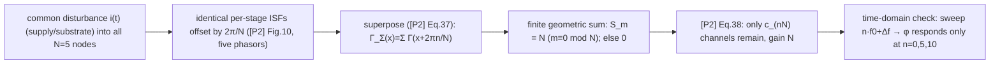

> **β**: This English translation is in beta — the Traditional-Chinese original is the authoritative version.

# Lab 34 — The N·f0 Selection Rule for Correlated Supply/Substrate Noise

> **Prerequisites**: [lab_03](/04_simulation_labs/lab_03_ring_oscillator_toy_model) (ring toy and accumulated jitter), [lab_05](/04_simulation_labs/lab_05_isf_fourier_coefficients) (numerical extraction of $c_n$), [fourier_series_of_isf](/03_isf_core_theory/fourier_series_of_isf) ($c_n$ as "receive channels") | **Next**: [varactor_tuning_supply_pushing](/06_design_insights/varactor_tuning_supply_pushing) (the quasi-static $K_{push}$ door for supply noise), [device_noise_mapping](/06_design_insights/device_noise_mapping) (the full harmonics-equal-channels map)

Every phase-noise computation so far carried an unstated assumption: **each noise source injects into ONE node, and the sources on different nodes are independent (uncorrelated)**. For device thermal / flicker noise that is indeed the case — [P2] p.792 says it explicitly: with uncorrelated sources on the nodes, the total phase noise of $N$ sources is $N$ times the single-source result ([P2] Eq.(6)) ($2N$ times for a differential ring) — **powers simply add, with no frequency selection whatsoever**.

But **supply and substrate noise are not like that**. [P2] Sec. VI (p.797) points out two key differences from internal device noise:

1. their PSD is usually **nonwhite**, often with strong peaks at specific frequencies (switching-regulator harmonics, digital-block switching harmonics);
2. **the same supply line / the same substrate hits every node of the ring with a nearly identical disturbance** — the nodes see **strongly correlated** (nearly identical) noise.

This page turns point 2 into a **selection rule** you can measure: the effective ISF for correlated noise is the **SUM** of $N$ per-stage ISFs shifted by $2\pi/N$, and its Fourier components — except those with $n\equiv0\ (\mathrm{mod}\ N)$ — all **cancel as phasors**. Hence **correlated noise converts into phase only from bands near DC and near $k\cdot N\cdot f_0$**.

> **Physical intuition (conclusion first)**: think of the $N$-stage ring as $N$ antennas pointing in different directions — every stage's ISF has the same shape, offset only by a $2\pi/N$ phase ([P2] Fig. 10 draws them as five phasors $e^{j2\pi n/5}$). When the same disturbance hits all $N$ antennas, the $m$-th harmonic channel receives the sum of $N$ phasors: only when $m$ is an integer multiple of $N$ do the five phasors add **in phase** (gain $N$); otherwise they walk a full circle in the complex plane and **their vector sum is exactly zero**. This is not an approximation — it is a finite-geometric-series identity, and this lab computes it down to machine precision for you.

> **Model-level statement**: the per-stage ISF in this lab is a **pedagogical toy model (dual triangular lobes, deliberately rise/fall-asymmetric), not transistor-level** (for a *measured* ring ISF go to [lab_32](/04_simulation_labs/lab_32_mos_level1_ring)). The selection rule itself **does not depend on the ISF shape** — the derivation holds for any $2\pi$-periodic $\Gamma$, which is exactly what makes it powerful. The phase model is linear LTV ([P1] Eq.(11)) with no amplitude dynamics; a real oscillator's amplitude response leaves residual sidebands ([P2] Fig. 11 measured them; see Section 11).

## 1. Teaching goals

- Transcribe verbatim and explain [P2] Eq.(37)–(38) (p.797): with identical noise sources on all $N$ nodes, the total phase is the superposition of $N$ phase-shifted ISFs.
- Prove, with a **finite geometric sum** and no skipped steps, that the summed ISF keeps only the Fourier components with $n\equiv0\ (\mathrm{mod}\ N)$, and that the survivors are amplified by $N$.
- Numerical verification on an $N=5$ toy ring (frequency domain): the summed ISF's $\lvert c_n\rvert$ comb keeps only $n=0,5,10,15$; forbidden components drop to the numeric floor (165.8 dB selection ratio).
- Time-domain verification (after [P2] Fig. 11's 10 µA experiment): sweep a common sinusoidal disturbance across $n f_0+\Delta f$; the phase response peaks only at $n=0,5,10$ (66 dB selection, coherent gain $4.998\approx N$, matching the [P1] Eq.(15)/(16) theory to $10^{-5}$ relative error).
- Translate into design language: the **$N\cdot f_0$ selection rule** — keep supply peaks away from $k\cdot N\cdot f_0$; rise/fall symmetry closes the DC door; stage mismatch makes the cancellation incomplete.

## 2. Mathematical model

### 2.1 From one source to N identical sources — [P2] Eq.(37) (p.797, verbatim)

The LTV phase response of a single node is [P1] Eq.(11) (p.182): $\phi(t)=\frac{1}{q_{max}}\int_{-\infty}^{t}\Gamma(\omega_0\tau)\,i(\tau)\,d\tau$ ([P2] calls it its Eq.(5)). If all inverters are identical, the ISF of node $n$ has **the same shape as node 0, offset only by a phase $2\pi n/N$** (within one period the $N$ stages switch in turn, adjacent-stage events spaced by $T/N$… strictly, adjacent stages of a single-ended inverter ring differ by $\pi/N$ plus an inversion; [P2] writes the set of ISFs of "all $N$ nodes" as a family shifted by $2\pi/N$ — the five phasors of Fig. 10). With the same $i(\tau)$ injected into all $N$ nodes, superposition gives:

$$
\phi(t)=\frac{1}{q_{max}}\sum_{n=0}^{N-1}\int_{-\infty}^{t}i(\tau)\,\Gamma\!\left(\omega_0\tau+\frac{2\pi n}{N}\right)d\tau
=\frac{1}{q_{max}}\int_{-\infty}^{t}i(\tau)\left[\sum_{n=0}^{N-1}\Gamma\!\left(\omega_0\tau+\frac{2\pi n}{N}\right)\right]d\tau
$$

([P2] Eq.(37), p.797.) The second equality just exchanges "sum over $n$" with "integral over $\tau$" (a finite sum — always legal). **The bracketed object is the protagonist of this page**:

$$
\Gamma_\Sigma(x)\equiv\sum_{n=0}^{N-1}\Gamma\!\left(x+\frac{2\pi n}{N}\right)
$$

— the **effective ISF** seen by correlated noise. Unit check: $\Gamma$ is dimensionless; the sum of $N$ dimensionless quantities is still dimensionless ✓; $\phi=[\text{A}\cdot\text{s}/\text{C}]=[\text{C}/\text{C}]=$ dimensionless (rad) ✓.

### 2.2 The finite geometric sum — why only $n\equiv0\ (\mathrm{mod}\ N)$ survives

[P2] only says "Expanding the term in brackets in a Fourier series, we can show that it is zero except at dc and multiples of $N\omega_0$" (p.797). We fill in the "can show", skipping nothing.

**Step 1 (complex Fourier expansion)**: $\Gamma$ is $2\pi$-periodic and real-valued, so write

$$
\Gamma(x)=\sum_{m=-\infty}^{\infty}\gamma_m\,e^{jmx},\qquad \gamma_{-m}=\gamma_m^{*}
$$

($\gamma_m$ dimensionless; the correspondence with the real-coefficient form of [P1] Eq.(12) is $c_m=2\lvert\gamma_m\rvert$ for $m\ge1$, while the DC value $=\gamma_0=c_0/2$.)

**Step 2 (insert the phase shifts)**: a shift $x\to x+2\pi n/N$ acts on the $m$-th component as a mere phase factor $e^{jm\cdot2\pi n/N}$:

$$
\Gamma_\Sigma(x)=\sum_{m=-\infty}^{\infty}\gamma_m\,e^{jmx}\underbrace{\sum_{n=0}^{N-1}e^{j2\pi mn/N}}_{\equiv S_m}
$$

**Step 3 (evaluate $S_m$: a finite geometric series)**: let $r=e^{j2\pi m/N}$, so $S_m=\sum_{n=0}^{N-1}r^{\,n}$. Two cases:

- **Case A: $m\equiv0\ (\mathrm{mod}\ N)$**. Then $r=e^{j2\pi(m/N)}=1$ ($m/N$ is an integer) and every term equals 1:

$$
S_m=\underbrace{1+1+\cdots+1}_{N\ \text{terms}}=N
$$

- **Case B: $m\not\equiv0\ (\mathrm{mod}\ N)$**. Then $r\neq1$, and the geometric-series formula gives:

$$
S_m=\frac{1-r^{N}}{1-r}=\frac{1-e^{j2\pi m}}{1-r}=\frac{1-1}{1-r}=0
$$

because $r^{N}=e^{j2\pi m}=1$ ($m$ integer) while the denominator $1-r\neq0$. **Exactly zero — not an approximation**. This is the algebraic version of the intuition "five phasors walk a full circle, their vector sum is zero"; the lab prints $\lvert S_m\rvert$: 5.000 at $m=0,5,10$, and $10^{-16}\sim10^{-15}$ (machine precision) for all of $m=1\dots4,6\dots9$.

**Step 4 (conclusion)**:

$$
\Gamma_\Sigma(x)=N\sum_{m\equiv0\ (\mathrm{mod}\ N)}\gamma_m\,e^{jmx}
\qquad\Longleftrightarrow\qquad
c_{\Sigma,m}=\begin{cases}N\,c_m, & m\equiv0\ (\mathrm{mod}\ N)\\[2pt] 0, & \text{otherwise}\end{cases}
$$

The surviving channels are **amplified $N$ times in amplitude** ($N^2$ in power); every other channel is **wiped out**. Substituting back into Eq.(37) gives the paper's compact form:

$$
\phi(t)=\frac{N}{q_{max}}\sum_{n=0}^{\infty}c_{(nN)}\int_{-\infty}^{t}i(\tau)\cos\left(nN\omega_0\tau\right)d\tau
$$

([P2] Eq.(38), p.797; "where $c_i$ is the $i$th Fourier coefficient of the ISF" — $c_{(nN)}$ is the $nN$-th Fourier coefficient of the **single-stage** ISF, with the factor-$N$ gain pulled out front.) The paper's compact form drops the harmonic phases $\theta_{nN}$ (we keep the full phases in the numerical verification). **The ½ bookkeeping of the DC term (flag)**: in the convention of [P1] Eq.(12) (the DC term written as $c_0/2$), the $n=0$ term of Eq.(38) should be read as $N\,(c_0/2)\int i\,d\tau/q_{max}$ — i.e. the effective DC gain is $\Gamma_{\Sigma,dc}=N c_0/2$. This 2 is **Fourier-series DC bookkeeping** (for $n\ge1$ the $\cos$ channel collects both sidebands; DC collects only one) and has nothing to do with the SSB 2/4 convention. The lab's $n=0$ time-domain check uses $\Gamma_{\Sigma,dc}=Nc_0/2$ and matches theory to 1.000012.

[P2]'s one-sentence conclusion (p.797, verbatim): "for identical sources, only noise in the vicinity of integer multiples of $N\omega_0$ affects the phase."

### 2.3 Frequency-domain consequence — only bands near DC and $k\cdot N\cdot f_0$ turn into phase

Apply the single-tone injection result [P1] Eq.(15)/(16) (p.183) to $\Gamma_\Sigma$: with $i(\tau)=I_0\cos((m\omega_0+\Delta\omega)\tau)$,

$$
\phi(t)\approx\frac{I_0\,c_{\Sigma,m}\,\sin(\Delta\omega t)}{2\,q_{max}\,\Delta\omega}
$$

(the 2 in the amplitude comes from the **product-to-sum identity** $\cos A\cos B=\tfrac12[\cos(A-B)+\cos(A+B)]$ — the slow-term coefficient — and again is **not** the SSB bookkeeping 2.) Therefore:

- **Correlated noise**: $c_{\Sigma,m}=0$ unless $m\equiv0\ (\mathrm{mod}\ N)$ ⇒ only noise **near DC** (through $\Gamma_{\Sigma,dc}=Nc_0/2$, upconverted to close-in) and **near $k\cdot N\cdot f_0$** (downconverted) becomes phase; within each surviving band the integrator behaviour $1/\Delta\omega$ still applies ⇒ sidebands fall at $-20$ dB/dec of offset ([P2] Fig. 11 measured this slope).
- **Uncorrelated noise (the control)**: independent per-node sources ⇒ powers add; total phase noise is $N$ times a single source ([P2] p.792, $N$ times Eq.(6)); **every harmonic channel stays open** — no selection rule.
- **The difference on the surviving bands**: a correlated source gets amplitude gain $N$ ⇒ power $N^2$; $N$ uncorrelated sources get power $N$ ⇒ correlated is **worse by $10\log_{10}N$ dB** ($N=5$: 7.0 dB). Coherent addition cuts both ways: it saves you on the forbidden bands (total kill) and punishes you on the surviving ones ($N^2$).

### 2.4 The DC door and rise/fall asymmetry — why low-frequency supply noise is the most dangerous

Supply-noise power is concentrated **at low frequency** (regulator ripple, load transients, $1/f$) — exactly aligned with the **DC channel** of $\Gamma_\Sigma$. How wide that channel opens is set by the single-stage $c_0$, and $c_0$ is set by **rise/fall asymmetry** ([P2] App. B, p.803): Eq.(53) defines $A=f_{rise}'/f_{fall}'$ (rise/fall slope ratio) and Eq.(56) gives

$$
\Gamma_{dc}=\frac{2\pi}{\eta^2N^2}\cdot\frac{1-A}{1+A}
$$

— **perfect symmetry ($A=1$) slams the DC door shut**; the more asymmetric, the wider it opens, raising the $1/f^3$ corner through Eq.(57). This lab's toy ISF is deliberately asymmetric (positive-lobe peak 1.0, negative-lobe peak 0.6), so that $c_0\neq0$ and the DC channel is open — letting you see both stories, "the DC door" and "the $N f_0$ comb", in one figure.

**Design language (the $N\cdot f_0$ selection rule)**: to correlated supply/substrate noise, the ring is a **comb receiver** — it only listens at DC and at $k\cdot N\cdot f_0$. Hence: (i) if the supply has a known switching spur at $f_{sw}$ and harmonics, choose $N$ and $f_0$ so that $k\cdot N\cdot f_0$ **avoids** the spurs (or choose $f_{sw}$ the other way around); (ii) larger $N$ pushes the first high-frequency sensitive band $N f_0$ higher, where package/decoupling attenuation is usually better; (iii) rise/fall symmetry ($A\to1$) narrows the DC door — the same knob as the device-flicker $c_0$ counter-measure ([symmetry](/06_design_insights/symmetry)); (iv) stage mismatch makes the phasor cancellation incomplete, leaking residue into the forbidden bands (Section 11).

## 3. Block diagram



## 4. Python core code

Excerpts from `simulations/lab_34_correlated_supply.py` (checked against the source). Toy per-stage ISF, summed ISF, and the time-domain injection measurement:

```python
def gamma_stage(theta):
    """Per-stage toy ring ISF: +1.0 triangular lobe at the rising edge (θ=0),
    −0.6 triangular lobe at the falling edge (θ=π).
    Deliberately asymmetric (1.0 vs 0.6) → c0 ≠ 0 ([P2] App.B: A≠1 ⇒ Γdc≠0)."""
    th = wrap_phase(theta)
    d_rise = np.minimum(th, 2 * np.pi - th)
    d_fall = np.abs(th - np.pi)
    return H_RISE * _tri(d_rise, W_LOBE) - H_FALL * _tri(d_fall, W_LOBE)

def gamma_summed(theta):
    """Sum of N per-stage ISFs shifted by 2π/N (the bracket of [P2] Eq.(37))."""
    acc = np.zeros_like(np.asarray(theta, dtype=float))
    for n in range(N_STAGES):
        acc += gamma_stage(theta + 2 * np.pi * n / N_STAGES)
    return acc

def response(n_h, g_t):
    """Common injection i(t)=I0·cos(2π(n_h·f0+Δf)t); return the amplitude of φ at Δf [rad]."""
    i_inj = I0 * np.cos(2 * np.pi * (n_h * F0 + DF) * t)
    phi = np.cumsum(i_inj * g_t) * dt / QMAX      # discrete version of [P1] Eq.(11)
    return 2.0 * np.abs(np.mean(phi * proj))      # project onto the Δf bin (integer slow periods)
```

The frequency-domain part uses `compute_fourier_coefficients` (the same ruler as lab_05) to compute $c_0\dots c_{15}$ of both the single-stage and the summed ISF; the phasor identity is evaluated directly as $\lvert S_m\rvert=\lvert\sum_n e^{j2\pi mn/5}\rvert$.

## 5. Full script path

`simulations/lab_34_correlated_supply.py`
(depends on `compute_fourier_coefficients`, `wrap_phase` from `simulations/common/isf_utils.py`; `savefig` from `simulations/common/plot_utils.py`.)

Run: `PYTHONPATH=. python simulations/lab_34_correlated_supply.py` (a few seconds on one machine, no RNG, fully reproducible).

## 6. Parameter table

| Parameter | Variable | Value | Meaning |
|---|---|---|---|
| Stages | `N_STAGES` | 5 | ring stages (same as [P2] Fig. 11's 5-stage ring) |
| Oscillation frequency | `F0` | 5 GHz | site canonical |
| Max charge | `QMAX` | 1 pC | site-canonical $q_{max}$ |
| Injection amplitude | `I0` | 10 µA | same as the [P2] Fig. 11 experiment |
| Offset | `DF` | 10 MHz | injection frequency $=n f_0+\Delta f$ |
| Lobe peaks | `H_RISE` / `H_FALL` | 1.0 / 0.6 | rise/fall asymmetry ⇒ $c_0\neq0$ |
| Lobe half-width | `W_LOBE` | 0.5 rad | triangular-lobe half-width |
| Harmonics | `N_HARM` | 15 | range shown in the $\lvert c_n\rvert$ comb |
| Sweep limit | `N_INJ_MAX` | 12 | injection sweep $n=0\dots12$ |
| Sample rate | `fs` | $256\,f_0$ | time-domain integration sampling |
| Duration | — | $4/\Delta f=400$ ns | 4 slow periods (2000 carrier periods) |

## 7. Unit table

| Quantity | Symbol | Unit | Note |
|---|---|---|---|
| Per-stage / summed ISF | $\Gamma$, $\Gamma_\Sigma$ | dimensionless | $\Gamma_\Sigma=\sum_n\Gamma(x+2\pi n/N)$ |
| Fourier coefficients | $c_n$, $c_{\Sigma,n}$ | dimensionless | $c_{\Sigma,n}=N c_n$ or 0 |
| Phasor sum | $S_m$ | dimensionless | $N$ or 0 (machine precision) |
| Injected current | $i(t)$ | A | $I_0=10$ µA single tone |
| Phase response | $\phi$ | rad | amplitude at $\Delta f$ |
| Theory amplitude | $I_0 c_{\Sigma,n}/(2q_{max}\Delta\omega)$ | $\frac{\text{A}}{\text{C}\cdot\text{rad/s}}=$ rad | dimension check ✓ |
| Selection ratio | — | dB | $20\log_{10}$ (amplitude ratio) |

## 8. Simulation figure


## 9. How to read the figure

**(a) Five antennas and their sum**: the gray curves are the 5 per-stage toy ISFs shifted by $2\pi/5$ (each with one positive and one negative lobe); the red curve is $\Gamma_\Sigma$ — note it becomes **$2\pi/5$-periodic** (every $T/5$ some stage is switching; to a common disturbance the five stages are indistinguishable), which is the time-domain face of "only $n\equiv0\ (\mathrm{mod}\ 5)$ harmonics remain". The dashed blue line is its mean $\Gamma_{\Sigma,dc}=Nc_0/2=0.1592$ — the DC door is open (the toy is deliberately asymmetric), and low-frequency common noise upconverts through it.

**(b) The $\lvert c_n\rvert$ comb (frequency-domain verification)**: gray dots are the single-stage $c_n$ — every channel is open ($c_0=0.063662$, $c_1=0.249387$, $c_5=0.146770$, $c_{10}=0.003648$). Red diamonds are the summed ISF: only $n=0,5,10,15$ remain, and one by one $c_{\Sigma,n}/c_n=5.000000$ ($n=0,5$), $4.999999$ ($n=10,15$) — the gain is exactly $N$. The largest forbidden component drops to $3.766\times10^{-9}$ (the trapezoid-quadrature numeric floor), a selection ratio of

$$
20\log_{10}\frac{c_{\Sigma,5}}{\max_{n\not\equiv0}\lvert c_{\Sigma,n}\rvert}=165.8\ \text{dB}.
$$

**(c) Time-domain injection sweep (after [P2] Fig. 11)**: a common tone $I_0=10$ µA into all 5 nodes, frequency swept over $n f_0+\Delta f$ ($\Delta f=10$ MHz), measuring the amplitude of $\phi$ at $\Delta f$ (printed by the run):

| $n$ | 0 | 1 | 4 | **5** | 6 | **10** | 11 |
|---|---|---|---|---|---|---|---|
| Correlated (5 nodes) [rad] | $2.533\times10^{-2}$ | $1.80\times10^{-5}$ | $4.50\times10^{-6}$ | $\mathbf{5.840\times10^{-2}}$ | $9.7\times10^{-7}$ | $\mathbf{1.452\times10^{-3}}$ | $2.93\times10^{-5}$ |
| Single node [rad] | $5.07\times10^{-3}$ | $1.99\times10^{-2}$ | $3.59\times10^{-3}$ | $1.17\times10^{-2}$ | $2.24\times10^{-3}$ | $2.93\times10^{-4}$ | $4.01\times10^{-4}$ |
| Theory $I_0c_{\Sigma,n}/(2q_{max}\Delta\omega)$ | $2.533\times10^{-2}$ | $\approx0$ | $\approx0$ | $5.840\times10^{-2}$ | $\approx0$ | $1.452\times10^{-3}$ | $\approx0$ |

- **The selection rule holds**: the correlated injection peaks only at $n=0,5,10$; the residue at forbidden $n$ ($10^{-6}\sim10^{-5}$ rad) is the sampling/leakage numeric floor, giving a selection ratio $20\log_{10}[\text{amp}(5)/\max_{\text{forbidden}}]=66.0$ dB.
- **The control has no selection**: single-node injection (gray) responds at every $n$, tracking the single-stage $c_n$ — the selection rule is a consequence of **correlation**, not of ISF shape.
- **Coherent gain**: $\text{amp}_{corr}(5)/\text{amp}_{single}(5)=4.9978\approx N=5$ ✓ (power $N^2$; contrast $N$ **uncorrelated** sources at power $N$ — the 7.0 dB remark of 2.3).
- **Theory match**: measured/theory $=1.000034$ at $n=5$ and $=1.000012$ at $n=0$ (using $\Gamma_{\Sigma,dc}=Nc_0/2$) — [P1] Eq.(15)/(16) plus the selection rule is all the physics there is.
- [P2] Fig. 11's measured version (10 µA, 5 nodes, a real oscillator) sees the same structure: only low frequency and the vicinity of the fifth harmonic are integrated, with a $-20$ dB/dec slope; but the response at non-multiples of $N$ is **not zero**, just clearly smaller — the paper attributes the residue to the **amplitude response**. Our pure-phase toy has no such path, so its residue is only the numeric floor (Section 11).

## Worked example (with units + dimension check)

> **Example (a supply spur lands on $N f_0$)**: an $N=5$, $f_0=5$ GHz ring whose supply carries a switching harmonic exactly at $5f_0+10\ \text{MHz}=25.01$ GHz, equivalent common injected current amplitude $I_0=10$ µA, $q_{max}=1$ pC. How large is the spur at $\pm10$ MHz from the carrier?

**Step 1 (channel gain)**: $5f_0$ is an integer multiple of $N f_0$ ⇒ the channel is open, gain $c_{\Sigma,5}=N c_5=5\times0.146770=0.733852$ (measured in this lab).

**Step 2 (phase amplitude, [P1] Eq.(15)/(16) applied to $\Gamma_\Sigma$)**: $\Delta\omega=2\pi\times10^7=6.283\times10^{7}$ rad/s,

$$
\phi_p=\frac{I_0\,c_{\Sigma,5}}{2\,q_{max}\,\Delta\omega}=\frac{10^{-5}\times0.733852}{2\times10^{-12}\times6.283\times10^{7}}=5.840\times10^{-2}\ \text{rad}.
$$

(The 2 in the denominator = the slow-term coefficient of the product-to-sum identity, not SSB bookkeeping.) **Dimension check**: $\dfrac{\text{A}}{\text{C}\cdot\text{rad/s}}=\dfrac{\text{A}\cdot\text{s}}{\text{C}}=\dfrac{\text{C}}{\text{C}}=$ dimensionless (rad) ✓.

**Step 3 (PM sideband → spur level)**: for small-angle PM the single sideband amplitude is $\phi_p/2$ of the carrier (this 2 is the narrowband-PM sideband split — same family as $\mathcal{L}\approx\tfrac12S_\phi$, but here it is a deterministic spur, not a noise density):

$$
20\log_{10}\frac{\phi_p}{2}=20\log_{10}(2.920\times10^{-2})=-30.7\ \text{dBc}.
$$

A $-30.7$ dBc spur is catastrophic for any frequency synthesizer — **this is why $k\cdot N\cdot f_0$ must avoid known supply spurs**. Had the same spur landed at $4f_0+10$ MHz (a forbidden channel), the ideal identical-stage response would be zero (this lab measures a residue 66 dB below $n=5$, and even that is just the numeric floor; in a real circuit the residue is set by mismatch and by the amplitude response).

```python
I0, c5, qmax, dw = 10e-6, 0.146770, 1e-12, 2*3.141592653589793*10e6
phi_p = I0*5*c5/(2*qmax*dw); print(phi_p, 20*__import__('math').log10(phi_p/2))
# -> 0.0583979274939937 -30.69265122236508 (consistent with the lab run's 5.8400e-02, -30.7 dBc)
```

Incidentally: if you treated these 10 µA as **uncorrelated** device noise (independent per stage, powers adding), you would open the $n=1\dots4$ channels that are actually closed *and* underestimate the $n=5$ power by $N^2/N=5$ times (7.0 dB) — get the correlation wrong and you are wrong in both directions.

## 10. Corresponding paper equations / figures

- **[P2] Eq.(37), p.797**: superposition of identical sources on all $N$ nodes (transcribed verbatim in 2.1; upstream is [P2] Eq.(5) = [P1] Eq.(11), the LTV phase integral).
- **[P2] Eq.(38), p.797**: after Fourier expansion only dc and multiples of $N\omega_0$ remain (2.2 fills in the geometric-series proof; the DC ½ bookkeeping is flagged in 2.2).
- **[P2] Fig. 10, p.797**: the five phasors $e^{j2\pi n/5}$ — the original picture behind this page's "antenna array" intuition.
- **[P2] Fig. 11, p.797**: measured sidebands with 10 µA sinusoids injected into all five nodes, swept over $n f_0+f_m$ — only low frequency and the vicinity of the fifth harmonic are integrated, $-20$ dB/dec; the residue at non-integer multiples comes from the amplitude response. Panel (c) of this lab is its linear-phase-model replica.
- **[P2] p.792 (end of Sec. II)**: the uncorrelated baseline — $N$ independent sources ⇒ phase noise is $N$ times Eq.(6) ($2N$ for differential). Note [P2] Eq.(6)'s denominator $8\pi^2f_{off}^2=2\Delta\omega^2$ is the **time-domain /2 convention**, a factor 2 above [P1] Eq.(21)'s $/4\Delta\omega^2$ (SSB bookkeeping) — the same famous factor-of-2; the site has a dedicated section in [white_noise_to_phase_noise](/03_isf_core_theory/white_noise_to_phase_noise); with canonical numbers ($\Gamma_{rms}=0.5$, $S_i=10^{-24}$ A²/Hz, 1 MHz) the two read $-148$ (/4) vs $-145$ (/2) dBc/Hz.
- **[P2] App. B Eq.(53)/(56)/(57), p.803**: $A=f_{rise}'/f_{fall}'$, $\Gamma_{dc}=\frac{2\pi}{\eta^2N^2}\frac{1-A}{1+A}$, the $1/f^3$ corner — the source of this page's DC door.
- **[P1] Eq.(15)/(16), p.183**: the single-tone phase amplitude $I_0c_n/(2q_{max}\Delta\omega)$ — the formula behind this lab's time-domain theory values (applied to $c_{\Sigma,n}$).
- A close relative of the selection rule: **[P2] p.796 (Sec. V-B)** notes that in a differential ring the tail-current noise affects phase noise only **at low frequency and near even multiples of $f_0$** — the same "symmetry ⇒ channel selection" logic, just with a different symmetry group (the tail node sees half-period symmetry).

## 11. Limitations and approximations

- **Pure-phase linear LTV**: this lab has only the phase integral of [P1] Eq.(11), no amplitude dynamics. [P2] Fig. 11's measurement shows **residual sidebands from the amplitude response** at non-multiples of $N$ — that path (AM, and AM-PM back into phase) does not exist in this model; our forbidden-band residue ($-66$ dB) is purely numerical (sampling leakage). Do not use it to predict the forbidden-band depth of a real circuit.
- **Identical stages**: exact cancellation relies on every stage's ISF having the same shape at exactly $2\pi/N$ spacing. Real mismatch (load, drive strength, layout) leaves a phasor residue $\propto$ mismatch — to first order, a relative mismatch $\varepsilon$ leaks an amplitude $\sim\varepsilon$ into the forbidden channels ($20\log_{10}\varepsilon$ dB). 1% mismatch ⇒ the forbidden bands are only suppressed by 40 dB, not infinitely deep.
- **"Fully correlated, equal-strength, same-sign" injection**: real supply/substrate coupling coefficients differ from node to node (IR drop, layout distance), landing between "fully correlated" and "uncorrelated"; the two extremes on this page bracket the answer.
- **Toy ISF**: the dual triangular lobes are hand-placed ([lab_03](/04_simulation_labs/lab_03_ring_oscillator_toy_model)-style, plus asymmetry); for the real single-ended ring ISF shape see [lab_32](/04_simulation_labs/lab_32_mos_level1_ring). **But the selection rule does not depend on shape** — the proof of 2.2 holds for any $2\pi$-periodic $\Gamma$; changing the ISF changes the $c_n$ values of each channel, not **which channels exist**.
- **Supply noise is modeled here as node-current injection**: low-frequency supply noise also has a **quasi-static FM path** ($K_{push}$, shifting $f_0$ through the operating point) — the subject of [varactor_tuning_supply_pushing](/06_design_insights/varactor_tuning_supply_pushing); both paths coexist, the $K_{push}$ door usually dominating at low offsets while the $k N f_0$ comb is the dedicated entrance for **high-frequency** supply spurs.
- **Cyclostationary weighting not included**: strictly each stage's injection should also be multiplied by the NMF $\alpha(\omega_0t)$ ([effective_isf](/03_isf_core_theory/effective_isf)); for identical stages the $\alpha$'s are the same phase-shifted family, so the selection rule holds unchanged for $\Gamma_{eff}=\Gamma\alpha$ (the product is still $2\pi$-periodic).

## Key takeaways

- The essential difference between supply/substrate noise and device noise: **nonwhite PSD (with spurs) + strong cross-node correlation** ([P2] Sec. VI, p.797).
- The effective ISF of a correlated source is the **SUM** of $N$ per-stage ISFs shifted by $2\pi/N$ ([P2] Eq.(37)); the finite geometric sum gives $S_m=N$ ($m\equiv0\ \mathrm{mod}\ N$) or $0$ (otherwise) ⇒ **only the $n\equiv0\ (\mathrm{mod}\ N)$ channels remain, with gain $N$** ([P2] Eq.(38)).
- Numerical verification ($N=5$ toy): $\lvert S_m\rvert$ to machine precision; $c_{\Sigma,n}/c_n=5.000000$; 165.8 dB frequency-domain selection; the time-domain sweep peaks only at $n=0,5,10$ (66.0 dB, coherent gain 4.9978, theory match $10^{-5}$).
- **The $N\cdot f_0$ selection rule**: correlated noise enters only from **DC** (door size $=Nc_0/2$, set by the rise/fall asymmetry $A$, [P2] Eq.(56)) and from **near $k\cdot N\cdot f_0$**. In design: keep $kNf_0$ away from supply spurs, symmetrize to close the DC door, and watch mismatch, which makes the cancellation incomplete.
- On the surviving bands, correlated is **worse than uncorrelated by $10\log_{10}N$ dB** (coherent $N^2$ vs power $N$); on the forbidden bands, correlated is **better all the way down to the mismatch/amplitude residue**. Get the correlation wrong and both numbers are wrong.

## Further reading

- [varactor_tuning_supply_pushing](/06_design_insights/varactor_tuning_supply_pushing): the other door for supply noise — the quasi-static $K_{push}$ FM path (dominant at low frequency; this page's comb is the high-frequency entrance).
- [device_noise_mapping](/06_design_insights/device_noise_mapping): the full "harmonics = receive channels" map — this page effectively shuts $N-1$ of its channels for correlated sources.
- [fourier_series_of_isf](/03_isf_core_theory/fourier_series_of_isf): $c_n$ and the channel structure of [P1] Eq.(12)/(13).
- [lab_05](/04_simulation_labs/lab_05_isf_fourier_coefficients): numerical extraction of $c_n$ (this lab's frequency-domain ruler).
- [lab_32](/04_simulation_labs/lab_32_mos_level1_ring): tired of hand-placed ISFs? Measure the ring ISF from MOS Level-1 equations.
- [paper_002 deep dive](/05_paper_deep_dives/paper_002_jitter_phase_noise_ring): a guided tour of [P2] (where Sec. VI sits in the whole).
