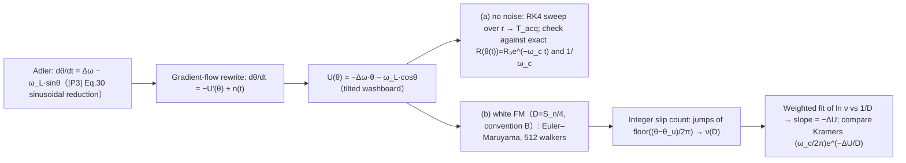

> **β**: This English translation is in beta — the Traditional-Chinese original is the authoritative version.

# Lab 36 — Lock-Acquisition Transient and Noise-Induced Cycle Slips

> **Prerequisites**: [injection_locking_noise](/06_design_insights/injection_locking_noise) (reduction of the [P3] generalized Adler equation to $\dot\theta=\Delta\omega-\omega_L\sin\theta$, in-lock noise shaping lab_26, out-of-lock pulling lab_27), [paper_003](/05_paper_deep_dives/paper_003_injection_locking_part1) (origin of the lock characteristic), [diffusion_dictionary](/03_isf_core_theory/diffusion_dictionary) (bookkeeping of the $D$ conventions) | **Next**: [paper_004](/05_paper_deep_dives/paper_004_injection_locking_part2) (original source of the pull-in transient, [P4] Sec. V), [quadrature_and_coupled_oscillators](/06_design_insights/quadrature_and_coupled_oscillators).

[injection_locking_noise](/06_design_insights/injection_locking_noise) already answered the two
steady-state questions — "after lock" (noise shaping) and "cannot lock" (pulling comb).
This page fills in the two missing **transient** pieces:

> **What this page answers**:
> 1. The moment the injection turns on, **how long** does the phase take to climb into the
>    locked point? What is the settle rate? Why is it that near the lock-range edge you can
>    "lock, but lock extremely slowly"? (Part a: the **acquisition transient**)
> 2. Once locked, what is the probability that noise occasionally kicks the phase over
>    **a whole cycle** (a cycle slip — the phase slides by $2\pi$ in one event)? How does it
>    scale with detuning and noise strength? At the canonical numbers, how often does it slip?
>    (Part b)

> **Physical intuition (conclusion first)**: rewrite the Adler equation as an overdamped
> particle rolling in a **tilted washboard** potential and everything becomes obvious.
> **Acquisition** = the particle rolls down the slope into the nearest well: the potential
> curvature near the well is $\omega_c=\sqrt{\omega_L^2-\Delta\omega^2}$, so settling is an
> exponential with rate $\omega_c$; as the detuning ratio $r=\Delta\omega/\omega_L\to1$ the
> well and the saddle merge, the curvature vanishes, and the acquisition time diverges as
> $1/\sqrt{1-r}$ (critical slowing down). A **cycle slip** = thermal noise kicks the particle
> over the barrier of height $\Delta U$ next to the well and it slides down one washboard
> period ($2\pi$): the rate is Arrhenius-like, $e^{-\Delta U/D}$, and the "attempt frequency"
> is again the same $\omega_c/2\pi$ — **the third appearance of that Pythagorean square root**
> (first: settle rate; second: the noise-shaping corner of lab_26; outside lock it turns
> into the beat frequency $\omega_b$).

> **Positioning of this page**: an advanced lab page with the theory derived in full on the
> page. The phase equation itself and the pull-in frequency are native results of [P3]/[P4]
> ([P3] Eq.(38)–(40), p.2115; [P4] Eq.(31)–(32) and Table I, p.2130, all verified against the
> original PDFs); **the escape rate of noise over a barrier (Kramers/MFPT) is standard
> stochastic-process theory, not contained in the site's 5 PDFs** (external references:
> Kramers 1940, Risken 1989, Ambegaokar–Halperin 1969, see the end of the page). This page
> honestly derives the barrier itself, quotes the escape-rate formula, and then checks
> everything against an SDE simulation term by term.

## 1. Teaching goals

- Solve $\dot\theta=\Delta\omega-\omega_L\sin\theta$ ($\lvert\Delta\omega\rvert\le\omega_L$)
  **exactly** by separation of variables + tan half-angle: the settle rate equals
  [P3] Eq.(40)'s pull-in frequency $\omega_c=\sqrt{\omega_L^2-\Delta\omega^2}$ not just in the
  linearization but **globally**.
- Demonstrate **critical slowing down**: sweep $r=\Delta\omega/\omega_L$ up to 0.99 and show
  the acquisition time diverging as $1/\omega_c$ (RK4 measurement vs the exact closed form,
  ratio 1.0000).
- Rewrite the Adler equation as the tilted-washboard potential
  $U(\theta)=-\Delta\omega\,\theta-\omega_L\cos\theta$ and **derive step by step** the forward
  barrier $\Delta U=2\omega_L[\sqrt{1-r^2}-r\arccos r]$ with its two limits
  ($r=0$: $2\omega_L$; $r\to1$: $\propto(1-r)^{3/2}$).
- Use the Kramers escape rate (external reference) to predict the slip rate
  $\nu\approx(\omega_c/2\pi)e^{-\Delta U/D}$, verified with a 512-walker Euler–Maruyama SDE:
  the log-linear slope = 0.993 of the analytic barrier, with the prefactor compared honestly
  (0.88).
- Map back to the canonical numbers ($f_L=5$ MHz, true-LC $S_n=0.5$ rad²/s): at $r=0.8$ the
  slip rate is $\sim10^{-1.86\times10^7}$ — **it never happens**; it only reaches once per
  second within $10^{-5}$ of the lock edge — thermal slips are a **cliff**, not a slope.

## 2. Mathematical model (theory derived on this page)

### 2.0 Starting point and notation (one-line recap)

The site-verified [P3] generalized Adler equation (Eq.(30), p.2113) reduces, for sinusoidal
injection + the ideal-LC ISF, to the classic Adler equation (full derivation and symbol
mapping in [injection_locking_noise](/06_design_insights/injection_locking_noise), Step 0):

$$
\frac{d\theta}{dt}=\Delta\omega-\omega_L\sin\theta,\qquad
\Delta\omega\equiv\omega_0-\omega_{inj}\ [\text{rad/s}],\quad
\omega_L=\frac{I_{inj}}{2q_{max}}\ [\text{rad/s}].
$$

([P3] itself writes it as $d\theta/dt=-\Delta\omega_{[P3]}+\Omega(\theta)$, Eq.(38), p.2115,
with $\Delta\omega_{[P3]}=\omega_{inj}-\omega_0$ — an overall sign flip; this page's results
depend only on $\Delta\omega^2$ and $r\equiv\Delta\omega/\omega_L$ and are unaffected.)
Throughout we take $0\le r\le1$ ($\Delta\omega\ge0$) and often use dimensionless time
$\tau=\omega_L t$ — the Adler dynamics depend only on $r$ and (in Part b) $D/\omega_L$;
converting back to real units is a division by $\omega_L$.

### 2.1 Part (a): acquisition transient — exact solution and critical slowing

**Step 1: locked point and linearization ([P3]'s native result).** Steady state
$\sin\theta_{ss}=r$, stable branch $\theta_{ss}=\arcsin r$ ($\cos\theta_{ss}\gt0$), unstable
solution $\theta_u=\pi-\arcsin r$ (the stability criterion of [P3] Eq.(38)–(39), p.2115:
$\Omega'(\theta_0)\lt0$). First-order Taylor expansion around $\theta_{ss}$
($\sin\theta\approx r+\cos\theta_{ss}\,\delta\theta$):

$$
\frac{d(\delta\theta)}{dt}=-\omega_c\,\delta\theta,\qquad
\omega_c\equiv\omega_L\cos\theta_{ss}=\sqrt{\omega_L^2-\Delta\omega^2}.
$$

This is exactly the **pull-in frequency** defined in [P3] Eq.(40), p.2115:
$\omega_p:=-\Omega'(\theta_0)=1/\tau_p$, and [P3] states the solution is the exponential
decay $\hat\theta(t)\propto e^{-t/\tau_p}$. **Unit check**: $[\omega_c]=$ rad/s ✓;
$\delta\theta$ [rad] ÷ s = rad/s ✓.

**Step 2: no linearization — solve exactly (separation of variables + tan half-angle).**
Separate time out:

$$
t=\int\frac{d\theta}{\Delta\omega-\omega_L\sin\theta}.
$$

Use the Weierstrass half-angle substitution $u=\tan(\theta/2)$ ($\sin\theta=\dfrac{2u}{1+u^2}$,
$d\theta=\dfrac{2\,du}{1+u^2}$) — **the exact same step** used for the beat frequency in
[injection_locking_noise](/06_design_insights/injection_locking_noise) Part B — and the
denominator becomes the same quadratic:

$$
t=\int\frac{2\,du}{\Delta\omega\,u^2-2\omega_L u+\Delta\omega}.
$$

The only difference is the **sign of the discriminant**: outside lock
($\Delta\omega\gt\omega_L$) it is negative, completing the square gives $\arctan$ → a periodic
solution (beat frequency $\omega_b$); **inside lock ($\Delta\omega\lt\omega_L$) the
discriminant $4(\omega_L^2-\Delta\omega^2)\gt0$ and the quadratic has two real roots**:

$$
u_\pm=\frac{\omega_L\pm\omega_c}{\Delta\omega},\qquad
u_+u_-=\frac{\omega_L^2-\omega_c^2}{\Delta\omega^2}=1 .
$$

These two roots are none other than the half-angle tangents of the two equilibria — using the
half-angle formula and $\Delta\omega^2=(\omega_L+\omega_c)(\omega_L-\omega_c)$
(rationalizing in the last step):

$$
\tan\frac{\theta_{ss}}{2}=\frac{\sin\theta_{ss}}{1+\cos\theta_{ss}}
=\frac{\Delta\omega}{\omega_L+\omega_c}=\frac{\omega_L-\omega_c}{\Delta\omega}=u_-\ (\text{stable}),
\qquad u_+=\tan\frac{\theta_u}{2}\ (\text{unstable});
$$

and $u_+u_-=1$ means $\tan\frac{\theta_{ss}}{2}\tan\frac{\theta_u}{2}=1\Leftrightarrow\theta_{ss}+\theta_u=\pi$ ✓
(self-consistent). Partial fractions ($u_+-u_-=2\omega_c/\Delta\omega$):

$$
\frac{2}{\Delta\omega(u-u_+)(u-u_-)}
=\frac{1}{\omega_c}\left[\frac{1}{u-u_+}-\frac{1}{u-u_-}\right]
\quad\Longrightarrow\quad
t=\frac{1}{\omega_c}\ln\left\lvert\frac{u-u_+}{u-u_-}\right\rvert+C.
$$

Arrange into the cleanest form — define the trajectory coordinate $R$, which decays
**strictly exponentially**:

$$
\boxed{\ R(\theta)\equiv\frac{\tan\frac{\theta}{2}-\tan\frac{\theta_{ss}}{2}}{\tan\frac{\theta}{2}-\tan\frac{\theta_u}{2}},
\qquad R\big(\theta(t)\big)=R(\theta_0)\,e^{-\omega_c t}\ }
$$

**Unit check**: $u$, $R$ dimensionless; the exponent $\omega_c t=$ (rad/s)(s) = rad
(dimensionless) ✓. **Three readouts**:

1. **The settle rate is $\omega_c$ globally** — not only in the linearization: the whole
   trajectory converges as $e^{-\omega_c t}$ in the $R$ coordinate; near the locked point
   $u-u_-\propto e^{-\omega_c t}$, recovering Step 1 ✓.
2. **Exact acquisition time** (from $\theta_0$ to $\theta_{ss}-\varepsilon$):
   $T_{acq}=\dfrac{1}{\omega_c}\ln\dfrac{R(\theta_0)}{R(\theta_{ss}-\varepsilon)}$ —
   $1/\omega_c$ is the protagonist; the start point and the threshold enter only through the
   logarithm.
3. **Equivalent to [P4] Eq.(31), p.2130.** [P4] writes the same solution as
   $\tan(N\tilde\theta/2)=\tan(N\tilde\theta_0/2)\tanh\!\big((\omega_p t+\phi_0)/2\big)$
   (its coordinate shifts the lock characteristic into an even function, so the unstable
   point sits exactly at $-\tilde\theta_0$). Using the identity
   $x=x_0\tanh z\Leftrightarrow\dfrac{x-x_0}{x+x_0}=-e^{-2z}$ this becomes the boxed $R$
   form; the **$/2$ inside the tanh argument cancels against the 2 of $e^{-2z}$**, so the
   decay rate is still $\omega_p$ (= our $\omega_c$; [P4] Eq.(32):
   $\omega_p=N\sqrt{\omega_L^2-\Delta\omega^2}$ with $N=1$) — that 2 is tanh half-angle
   bookkeeping, not physics. Honest note: $\tanh$ only sweeps $(-1,1)$, so [P4]'s form covers
   initial conditions on the arc between the two equilibria; starting outside that arc the
   same solution family takes the $\coth$ branch with the identical rate — the $R$ form
   (any real $R(\theta_0)$) contains both branches.
   [P4] Table I, p.2130 validates this exponential pull-in with circuit simulations:
   $\tau_p/T_{inj}$ simulated 6 / 1.87 / 16.9 vs theory 5.95 / 1.79 / 17.4.

**Step 3: critical slowing down (the price of the lock-range edge).** Let $r=1-\delta$,
$\delta\ll1$:

$$
\omega_c=\omega_L\sqrt{1-r^2}=\omega_L\sqrt{\delta(2-\delta)}\approx\sqrt{2}\,\omega_L\sqrt{1-r}\ \to\ 0,
$$

$$
T_{acq}\approx\frac{1}{\omega_c}\Big[\ln\frac{1}{\varepsilon}+O(1)\Big]\ \propto\ \frac{1}{\sqrt{1-r}}\ \to\ \infty .
$$

Physics: as $r\to1$ the stable point $\arcsin r$ and the unstable point $\pi-\arcsin r$
**merge** at $\pi/2$ (a saddle-node bifurcation) and the restoring slope vanishes —
"can lock" and "locks fast" are two different things. (Saddle-node critical slowing is a
standard nonlinear-dynamics result — external reference, not among the site's 5 PDFs, e.g.
S. H. Strogatz, *Nonlinear Dynamics and Chaos*, 2nd ed., Westview, 2015 — but the derivation
above is self-contained.) This echoes the two steady-state conclusions of
[injection_locking_noise](/06_design_insights/injection_locking_noise): at the edge the
noise-suppression corner $\omega_c\to0$ (Part A) and, outside lock, the beat frequency
$\omega_b\to0$ (Part B) — **one square root, three kinds of slowing**.

> **Example (acquisition time, canonical scale)**: $f_L=\omega_L/2\pi=5$ MHz, $r=0.5$,
> $\theta_0=0$, $\varepsilon=0.01$ rad. The simulation (Section 8) measures
> $\omega_L T_{acq}=4.435$, so in real units
> $T_{acq}=4.435/(2\pi\times5\times10^6)=141.2$ ns — 706 periods of the $f_0=5$ GHz carrier.
> **Dimension check**: dimensionless ÷ (rad/s) = s ✓.
> Same procedure at $r=0.99$: $\omega_L T_{acq}=22.913\Rightarrow729.3$ ns (3647 periods) —
> pushing the detuning from half to the edge slows acquisition by a factor of 5.2, and it
> keeps degrading as $1/\sqrt{1-r}$.

### 2.2 Part (b): tilted washboard, barrier, and Kramers escape

**Step 1: put the noise back and rewrite as a gradient flow.** The oscillator's own white
noise, averaged through the ISF, is an effective white-FM drive $n(t)$ (one-sided PSD
$S_n=\Gamma_{rms}^2\,\overline{i_n^2}/\Delta f\,/q_{max}^2$ [rad²/s], derived in
[injection_locking_noise](/06_design_insights/injection_locking_noise), Step 2):

$$
\frac{d\theta}{dt}=\Delta\omega-\omega_L\sin\theta+n(t)
=-\frac{\partial U}{\partial\theta}+n(t),\qquad
\boxed{\ U(\theta)=-\Delta\omega\,\theta-\omega_L\cos\theta\ }
$$

(Check: $-\partial_\theta U=\Delta\omega-\omega_L\sin\theta$ ✓.) This is the **tilted
washboard**: mean slope $-\Delta\omega$ (the detuning tilts the whole potential downhill)
plus a ripple of amplitude $\omega_L$ (the injection's restoring force). **Units**:
$[\Delta\omega\,\theta]=$ (rad/s)(rad), $[\omega_L\cos\theta]=$ rad/s — rad is dimensionless
(site convention), so both terms are $\text{rad}^2/\text{s}$, equivalently $1/\text{s}$ ✓;
$U'$ is rad/s, same units as $\dot\theta$ ✓.

**Convention flag (the 2 and the 4 in $D$, following
[diffusion_dictionary](/03_isf_core_theory/diffusion_dictionary))**: the Kramers literature
writes the noise as $\langle n(t)n(t')\rangle=2D\,\delta(t-t')$ — this is **convention B**
($\mathrm{Var}[\Delta\phi]=2D\lvert t\rvert$). The autocorrelation of a one-sided PSD $S_n$
is $(S_n/2)\delta$ (this 2 = one-sided↔two-sided Wiener–Khinchin), and matching to $2D\delta$
absorbs the second 2 (convention-B definition), so

$$
D=\frac{S_n}{4}=\frac{\kappa^2}{2}=\frac{\Gamma_{rms}^2}{4q_{max}^2}\frac{\overline{i_n^2}}{\Delta f}\quad[\text{rad}^2/\text{s}].
$$

Canonical: true LC ($\Gamma_{rms}=1/\sqrt2$, $S_i=10^{-24}$ A²/Hz, $q_{max}=1$ pC)
$S_n=0.5\Rightarrow D=0.125$ rad²/s; representative $\Gamma_{rms}=0.5$ gives
$S_n=0.25\Rightarrow D=0.0625$ rad²/s.
(The same representative numbers on a free-running oscillator correspond to
$\mathcal{L}(1\text{MHz})=-148.0$ dBc/Hz — the SSB $/4$ convention of [P1] Eq.(21); the
time-domain $/2$ convention gives $-145.0$ dBc/Hz. The identity of every 2/4 is audited in
[diffusion_dictionary](/03_isf_core_theory/diffusion_dictionary).)

**Step 2: the barrier $\Delta U$ — computed honestly.** Extrema:
$U'(\theta)=0\Leftrightarrow\sin\theta=r$. Well bottom $\theta_{ss}=\arcsin r$
($U''=\omega_L\cos\theta_{ss}=+\omega_c\gt0$), barrier top $\theta_u=\pi-\arcsin r$
($U''=-\omega_c$) — **the same pair of equilibria, the same $\omega_c$ again**. The height
to climb sliding forward (down the tilt, $\theta$ increasing):

$$
\begin{aligned}
\Delta U_+&=U(\theta_u)-U(\theta_{ss})\\
&=\big[-\Delta\omega(\pi-\arcsin r)+\omega_L\sqrt{1-r^2}\big]
 -\big[-\Delta\omega\arcsin r-\omega_L\sqrt{1-r^2}\big]\\
&=2\omega_L\sqrt{1-r^2}-\Delta\omega\big(\pi-2\arcsin r\big)\\
&=2\omega_L\Big[\sqrt{1-r^2}-r\Big(\tfrac{\pi}{2}-\arcsin r\Big)\Big]
\end{aligned}
$$

Using $\tfrac{\pi}{2}-\arcsin r=\arccos r$:

$$
\boxed{\ \Delta U_+(r)=2\,\omega_L\Big[\sqrt{1-r^2}-r\arccos r\Big]\ }
$$

(The **2 here is geometric** — max minus min each contribute one $\omega_L\sqrt{1-r^2}$ —
not a bookkeeping convention.) **Three checks**:

- **Units**: $\omega_L$ [rad/s] × dimensionless = rad²/s (rad≡1 bookkeeping as above);
  the exponent $\Delta U/D=$ (rad²/s)/(rad²/s) is dimensionless ✓.
- **$r=0$**: $\Delta U_+=2\omega_L$ — valley-to-peak of the untilted washboard
  $-\omega_L\cos\theta$ ✓; then forward/backward are symmetric, slips are equally likely in
  both directions, and the net drift is zero.
- **$r\to1$** ($r=1-\delta$): $\sqrt{1-r^2}\approx\sqrt{2\delta}(1-\delta/4)$,
  $\arccos r\approx\sqrt{2\delta}(1+\delta/12)$, and the leading term of the difference is
  $\Delta U_+\approx\dfrac{4\sqrt2}{3}\,\omega_L(1-r)^{3/2}\to0$ — the standard saddle-node
  barrier scaling. Plugging $r=0.8$ into the asymptote gives $0.169\,\omega_L$, only 1% off
  the exact $0.1704\,\omega_L$.

**Backward barrier**: sliding backwards means climbing the barrier at $\theta_u-2\pi$,
one extra full period of tilt: $\Delta U_-=\Delta U_++2\pi\Delta\omega$ (the net potential
drop per period is $U(\theta-2\pi)-U(\theta)=2\pi\Delta\omega$). At $r=0.8$ the backward rate
is suppressed by an extra $e^{-2\pi r\,\omega_L/D}$ — utterly negligible at this page's
parameters, so slips are effectively one-directional (toward the detuning).

**Step 3: the escape rate (Kramers — external reference, honestly flagged).** For the
overdamped SDE $\dot x=-U'(x)+n$, $\langle nn'\rangle=2D\delta$, and barrier
$\Delta U\gg D$, the mean escape rate is

$$
\nu=\frac{\sqrt{U''(\theta_{ss})\,\lvert U''(\theta_u)\rvert}}{2\pi}\,e^{-\Delta U/D}
\qquad\text{(Kramers 1940; Risken 1989, Ch. 11 — external references, not among the site's 5 PDFs)}
$$

In this problem $U''(\theta_{ss})=\lvert U''(\theta_u)\rvert=\omega_c$, so

$$
\boxed{\ \nu_{slip}\approx\frac{\omega_c}{2\pi}\,e^{-\Delta U_+/D}\ }
\qquad\Big[\frac{1}{\text{s}}\Big]
$$

**Dimension check**: $\omega_c/2\pi$ = rad/s ÷ rad = 1/s (attempt frequency, Hz) ✓, the
exponent dimensionless ✓. The **third appearance of $\omega_c$**: in-lock settle rate,
noise-shaping corner (lab_26), and now the escape attempt rate — all of them are the slope of
the lock characteristic at the locked point. The same tilted-washboard-plus-thermal-escape
mathematics also governs the RSJ model of Josephson junctions and the overdamped pendulum
(Ambegaokar–Halperin 1969, external reference) — the Adler equation is simply its oscillator
incarnation. Honest boundary: the Kramers formula is the asymptote for $\Delta U/D\gg1$; at
moderate barriers there are $O(D/\Delta U)$ corrections — hence Section 8 uses the **slope**
(the barrier) as the primary verification and reports the prefactor deviation honestly.

> **Example (slip rate, canonical numbers)**: $f_L=5$ MHz, $r=0.8$.
> $\Delta U_+=0.1704\,\omega_L=0.1704\times2\pi\times5\times10^6=5.353\times10^6$ rad²/s;
> $\omega_c=0.6\,\omega_L$ (a 3–4–5 triangle), attempt frequency $\omega_c/2\pi=3.0$ MHz.
> True-LC thermal noise $D=0.125$ rad²/s: $\Delta U/D=4.283\times10^7$,
> $\log_{10}\nu\approx6.5-4.283\times10^7\times0.4343=-1.86\times10^7$ —
> a slip rate of $10^{-18{,}600{,}000}$ per second. The age of the universe is only
> $4\times10^{17}$ s: **it never happens**. Asking the question backwards — "how close to the
> edge before it slips once per second" — solving $\nu(r^\*)=1$ gives
> $1-r^\*=7.6\times10^{-6}$ (true LC; the representative $D=0.0625$ gives
> $4.7\times10^{-6}$) — the detuning must sit within **seven parts per million** of the
> lock-range edge. Conclusion: for clean injection + thermal noise, cycle slips are not a
> gradual degradation but a **cliff**; the slips seen in practice almost always come from
> transients, interferers, or loops whose effective $D$ is far larger (low-SNR CDRs,
> bang-bang PLLs) — and at the cliff edge $\omega_c$ has already collapsed
> (at $r^\*$ the noise-shaping corner is down to 19.5 kHz — it gets dirty before it slips).
> The cost of one slip: the phase advances by $\pm2\pi$ in one go = **one whole carrier
> period** — a forwarded-clock SerDes drops a bit outright, a counting PLL miscounts a beat,
> so it is a "rate" to be suppressed exponentially, not an "amplitude" that averages out.

### 2.3 Applicability and failure conditions

| Condition | When it holds | What happens when it fails |
|---|---|---|
| Weak injection $I_{inj}\ll I_{max}=\omega_0q_{max}$ ([P3] Eq.(36)–(37), p.2115) | Adler / lock characteristic linear in $i_{inj}$ | Strong injection: needs [P4]'s APF/AM corrections ([paper_004](/05_paper_deep_dives/paper_004_injection_locking_part2)) |
| $\theta$ slowly varying (≈ constant within one period) | Time-averaged equation ([P3] Eq.(30)) valid | If $\dot\theta\sim\omega_{inj}$ early in acquisition, the averaging fails (here $\omega_c\ll\omega_{inj}$, no problem) |
| Sinusoidal injection + ideal-LC ISF | The $-\omega_L\sin\theta$ closed form, real roots $u_\pm$ | Arbitrary waveform/topology: back to $\Omega(\theta)$; settle rate generalizes to $-\Omega'(\theta_{ss})$ ([P3] Eq.(40)), the barrier becomes the corresponding area of $\int[\Omega(\theta)-\Delta\omega]d\theta$, no simple closed form |
| Pure phase model (amplitude dynamics ignored) | Everything on this page | Large transients / strong injection in LC: amplitude moves too, [P4] Sec. V APF corrections (the third column of Table I is exactly an APF case) |
| $\Delta U\gg D$ (high barrier) | Kramers rate with prefactor $\omega_c/2\pi$ | Moderate/low barrier: the exponential slope still approximates, the prefactor deviates more (Section 8 measures 0.77–0.94); for $\Delta U\lesssim D$ it fails entirely — continuous sliding, i.e. pulling |
| White-FM drive | $D=S_n/4$ constant | Flicker FM: $D$ is no longer constant, escape statistics non-Poisson (not covered here) |

## 3. Block diagram



## 4. Python core code

Excerpted from `simulations/lab_36_lock_acquisition.py` (checked against the source). Exact
closed form, barrier, and the slip-counting main loop:

```python
def barrier(r):                        # ΔU/ω_L = 2(√(1−r²) − r·arccos r)
    return 2.0 * (np.sqrt(1.0 - r**2) - r * np.arccos(r))

def acquisition_exact(r, theta0=0.0, eps=0.01):
    wc = np.sqrt(1.0 - r**2)           # ω_c/ω_L (dimensionless pull-in rate)
    um = (1.0 - wc) / r                # tan(θ_ss/2) (stable root)
    up = (1.0 + wc) / r                # tan(θ_u/2)  (unstable root; um·up = 1)
    R = lambda u: (u - um) / (u - up)  # R(θ(t)) = R(θ₀)·e^(−ω_c t)
    u0, uthr = np.tan(theta0 / 2), np.tan((np.arcsin(r) - eps) / 2)
    return (1.0 / wc) * np.log(R(u0) / R(uthr))   # exact acquisition time [1/ω_L]

# --- slips: Euler–Maruyama (dimensionless τ=ω_L t; n supplied by the site's white_noise) ---
# white_noise one-sided PSD = 4D ⇒ increment variance 2·D·dτ (convention B ⟨nn'⟩=2Dδ) [checked]
nz = white_noise(nb * m, 4.0 * D, 1.0 / dtau, rng).reshape(nb, m)
for i in range(nb):
    theta += (r - np.sin(theta) + nz[i]) * dtau
# integer slip count: floor((θ−θ_u)/2π) is constant inside one well, jumps ±1 on a slip
slips = int(np.sum(np.floor((th_end - th_u) / (2*np.pi))
                   - np.floor((th_start - th_u) / (2*np.pi))))
```

Verification numbers as printed (`PYTHONPATH=. python3 simulations/lab_36_lock_acquisition.py`):

```python
print(ratio_min, ratio_max)     # -> 1.0000 1.0000 RK4 acquisition time / exact closed form (all 12 r values)
print(T_r050)                   # -> 4.435 ω_L·T_acq @ r=0.5 (ε=0.01 rad, θ₀=0)
print(T_r090)                   # -> 9.202 ω_L·T_acq @ r=0.9
print(T_r099)                   # -> 22.913 ω_L·T_acq @ r=0.99 (critical slowing)
print(wc_T_range)               # -> 2.30 .. 4.10 ω_c·T_acq barely moves (the divergence is all in 1/ω_c)
print(max_traj_dev)             # -> 2.90e-14 rad, max deviation closed form vs RK4 whole trajectory (r=0.8)
print(T_r05_real)               # -> 141.2 ns (=706 carrier periods at 5 GHz; f_L=5 MHz)
print(dU_over_wL)               # -> 0.1704 barrier ΔU/ω_L @ r=0.8
print(slips_x6, ratio_x6)       # -> 1350, 0.93 slips and (measured/Kramers) @ ΔU/D=6
print(dU_fit_over_theory)       # -> 0.993 fitted barrier / analytic barrier (log-linear slope)
print(prefac_fit_over_kramers)  # -> 0.88 fitted prefactor / (ω_c/2π) (Kramers asymptote)
print(dt_halving)               # -> 1.053 slip-rate ratio after halving dτ (step-size bias ~5%)
print(log10_nu_canonical)       # -> -1.860e7 log10(ν·s) @ true-LC D=0.125, r=0.8
print(one_minus_rstar)          # -> 7.573e-06 1−r*: distance to the edge for ν=1 slip/s (true LC)
```

## 5. Full script path

`simulations/lab_36_lock_acquisition.py`
(depends on `white_noise` from `simulations/common/noise_utils.py`, `savefig` from
`simulations/common/plot_utils.py`; `scipy.optimize.brentq` solves for $r^\*$).

Run: `PYTHONPATH=. python3 simulations/lab_36_lock_acquisition.py` (about 27 s on one
machine; fixed seed `default_rng(36)`, fully reproducible).

## 6. Parameter table

| Parameter | Variable | Value | Meaning |
|---|---|---|---|
| Half lock range | `F_LOCK` | 5.0 MHz | $f_L=\omega_L/2\pi$ (for real-unit conversion) |
| Carrier | `F0` | 5 GHz | canonical $f_0$ (only for period-count conversion) |
| Detuning sweep | `r_arr` | 0.10–0.99 (12 points) | Part (a): $r=\Delta\omega/\omega_L$ |
| Settle threshold | `EPS` | 0.01 rad | acquisition declared at $\theta_{ss}-\varepsilon$ |
| RK4 step | `dtau` | 0.002 | dimensionless $\tau=\omega_L t$; threshold via linear interpolation |
| Slip detuning | `R_SLIP` | 0.8 | Part (b) fixed ($\omega_c=0.6\,\omega_L$, 3–4–5) |
| Barrier/noise ratio | `x_list` | 4–9 (6 points) | $\Delta U/D$; $D=\Delta U/x$ solved backwards |
| Walkers | `M` | 512 | parallel SDE samples |
| EM steps/step size | `NSTEPS`/`DTAU` | $6\times10^5$ / 0.02 | per walker $\tau_{tot}=12000$; total $\tau=6.1\times10^6$ |
| Noise | `white_noise(…,4D,1/dτ)` | — | convention B $\langle nn'\rangle=2D\delta$ (increment variance $2D\,d\tau$) |
| Canonical $D$ | `D_TRUE_LC`/`D_REPR` | 0.125 / 0.0625 rad²/s | $S_n/4$ (true LC / representative) |

## 7. Unit table

| Quantity | Symbol | Units | Notes |
|---|---|---|---|
| Phase difference | $\theta$ | rad | oscillator phase relative to the injection |
| Detuning / half lock range | $\Delta\omega$, $\omega_L$ | rad/s | $r=\Delta\omega/\omega_L$ dimensionless |
| Pull-in rate | $\omega_c=\sqrt{\omega_L^2-\Delta\omega^2}$ | rad/s | the $\omega_p$ of [P3] Eq.(40) |
| Acquisition time | $T_{acq}$ | s | figure uses dimensionless $\omega_L T_{acq}$ |
| Washboard potential | $U(\theta)$ | rad²/s | rad dimensionless, equivalent to $1/\text{s}$ |
| Barrier | $\Delta U_+$ | rad²/s | $=2\omega_L[\sqrt{1-r^2}-r\arccos r]$ |
| White-FM drive | $n(t)$, $S_n$ | rad/s, rad²/s | one-sided PSD |
| Diffusion constant (convention B) | $D=S_n/4$ | rad²/s | $\langle nn'\rangle=2D\delta$ |
| Slip rate | $\nu$ | 1/s | dimensionless version $\nu/\omega_L$ (per unit $\omega_L t$) |

## 8. Simulation figure


## 9. How to read the figure

**(a) Acquisition time (left)**: the blue line is the exact closed form
$T_{acq}=\omega_c^{-1}\ln[R(\theta_0)/R(\theta_{ss}-\varepsilon)]$, the red circles are the
first-crossing times measured by direct RK4 integration — all 12 values of $r$ agree to a
ratio of 1.0000 (maximum deviation over the whole trajectory $2.9\times10^{-14}$ rad,
machine-precision level: the closed form *is* the solution). The gray dashed line is the pure
$1/\omega_c$ scaling (anchored at $r=0.99$): beyond $r\gtrsim0.5$ the measured points ride
it exactly — every bit of the divergence comes from $\omega_c\to0$, while the start point and
threshold enter only through the log ($\omega_c T_{acq}$ stays within 2.30–4.10 throughout,
while $T_{acq}$ itself spans an order of magnitude). The design reading: **the acquisition
bandwidth and the noise-suppression bandwidth are the same number** — pulling the detuning
back from the edge ($r=0.99$) to mid-range ($r=0.5$) not only drops the noise plateau
(the $1/\cos^2\theta_{ss}$ accounting of lab_26) but also makes acquisition 5.2× faster.

**(b) Slip rate (right)**: on the log-linear axis the measured points fall on a straight
line — the signature of an Arrhenius-type $e^{-\Delta U/D}$. The weighted fit of the slope
gives $\Delta U_{fit}=0.993\,\Delta U_{theory}$: **the barrier height is measured by the
simulation itself**, matching $2\omega_L[\sqrt{1-r^2}-r\arccos r]=0.1704\,\omega_L$. The
prefactor, honestly: the fit gives 0.88 of the Kramers $\omega_c/2\pi$, with point-by-point
ratios 0.77–0.94 — three sources: Kramers is the $\Delta U/D\gg1$ asymptote ($x=4$ is only a
moderate barrier), Euler step-size bias (halving $d\tau$ moves the slip rate by 5.3%,
`dt_halving = 1.053`), and statistics at $x=9$ with only 56 events (error bar ±13%).
**The exponent (the physics) is accurate to 0.7%; the prefactor (asymptotics + numerics) is
off by a tenth** — exactly what Kramers theory should look like. The inset shows a single
walker at $\Delta U/D=5$: long plateaus (dithering inside a well) plus integer stair steps
(one $2\pi$ slide per slip) — a slip is a discrete event, not a continuous drift; the plateau
lengths are exponentially distributed, which is also why counting integer jumps of
$\mathrm{floor}((\theta-\theta_u)/2\pi)$ is the cleanest method (constant inside a well,
±1 across the barrier, zero fractional noise).

## 10. Corresponding paper equations / figures

- **Stability and pull-in (linearized settling)**: [P3] Eq.(38), p.2115
  ($d\theta/dt=-\Delta\omega+\Omega(\theta)$), Eq.(39)
  ($d\hat\theta/dt=\Omega'(\theta_0)\hat\theta$), Eq.(40)
  ($1/\tau_p\equiv\omega_p:=-\Omega'(\theta_0)$, exponential decay
  $\hat\theta\propto e^{-t/\tau_p}$); Fig. 8, p.2115 (decomposition of the ISF harmonics into
  $\omega_p$), Fig. 9, p.2115 (feedback block diagram). This page's $\omega_c$ = that
  $\omega_p$ specialized to sinusoidal + ideal-LC: $\sqrt{\omega_L^2-\Delta\omega^2}$.
- **Exact pull-in closed form**: [P4] Sec. V-A "Pull-In Process", Eq.(31), p.2130 (tanh form;
  the $R$ form of Section 2.1 Step 2 is equivalent and also covers the coth branch),
  Eq.(32), p.2130 ($\omega_p=N\sqrt{\omega_L^2-\Delta\omega^2}$ — the Pythagorean twin of the
  out-of-lock $\omega_b$ of Eq.(34)); Table I, p.2130 (circuit-simulated $\tau_p/T_{inj}$ vs
  theory: 6/5.95, 1.87/1.79, 16.9/17.4 — the original validation of exponential pull-in).
- **Weak-injection linearity boundary**: [P3] Eq.(36)–(37), p.2115
  ($I_{inj}\ll I_{max}:=\omega_0q_{max}$).
- **Where the noise step belongs**: [P4] p.2130 states that the noise analysis of
  free-running and injection-locked oscillators via the pulling equation is deferred to its
  reference [29, Ch. 7] (Hong's PhD thesis) — **attaching $n(t)$ to Adler and reading off the
  slip rate via Kramers is not in the site's 5 PDFs**; this page derives the barrier itself,
  quotes the standard escape rate (external references), and checks it against simulation.
- **Upstream machinery**: $S_n=\Gamma_{rms}^2 S_i/q_{max}^2$ comes from the time-domain
  derivation of [P1] Eq.(11)/(21)
  ([white_noise_to_phase_noise](/03_isf_core_theory/white_noise_to_phase_noise));
  the $D=S_n/4$ bookkeeping is audited in
  [diffusion_dictionary](/03_isf_core_theory/diffusion_dictionary)
  (the $\kappa^2=2D$ of [P2] Eq.(11)/(12)).

## 11. Limitations and approximations

- **Phase-domain toy model**: what is integrated is the time-averaged Adler equation (the
  sinusoidal reduction of [P3] Eq.(30)), not a transistor-level circuit — no amplitude
  dynamics (APF), no harmonics, no cyclostationary weighting (the latter is already absorbed
  into $S_n$ through $\Gamma_{rms}$, see [effective_isf](/03_isf_core_theory/effective_isf)).
- **Kramers asymptotics**: $\nu=(\omega_c/2\pi)e^{-\Delta U/D}$ holds only for
  $\Delta U\gg D$; this lab sweeps $\Delta U/D=4$–$9$, medium-to-high barriers, so the
  exponential slope is accurate (0.993) while the prefactor is off by 12%. Higher accuracy
  needs the closed-form MFPT double integral (Risken Ch. 11), not expanded here.
- **Euler–Maruyama, first-order weak convergence**: at $d\tau=0.02$ the slip-rate step-size
  bias is ~5% (measured `dt_halving = 1.053`); the barrier fit is insensitive to it (the
  slope is a difference between ratios).
- **One-directional counting assumption**: at $r=0.8$ the backward barrier is higher by
  $2\pi r\,\omega_L$, suppressing the backward rate by $e^{-2\pi r\omega_L/D}$
  ($\lesssim e^{-100}$ at this page's parameters); at small $r$ or large $D$ forward and
  backward slips must be counted separately.
- **White-noise assumption**: under flicker FM, $D$ is not constant and slips are
  non-Poissonian; long-gate slip statistics in measurements then deviate from exponential.
- **$T_{acq}$ depends on the start point**: $\theta_0=0$ is a representative choice; changing
  it only moves the log factor (the 2.30–4.10 range of $\omega_c T$), never the $1/\omega_c$
  divergence. Starting exactly at $\theta_u$ (measure zero) never acquires, in theory.

## Key takeaways

- The in-lock Adler equation has an **exact closed-form solution**:
  $R(\theta)\equiv\dfrac{\tan\frac{\theta}{2}-\tan\frac{\theta_{ss}}{2}}{\tan\frac{\theta}{2}-\tan\frac{\theta_u}{2}}$
  decays strictly as $e^{-\omega_c t}$, so the settle rate is **globally** the pull-in
  frequency $\omega_c=\sqrt{\omega_L^2-\Delta\omega^2}$ ([P3] Eq.(40); equivalent to the tanh
  form of [P4] Eq.(31)–(32)).
- **Critical slowing**: as $r\to1$ the two equilibria merge in a saddle-node,
  $T_{acq}\propto(1-r)^{-1/2}$; simulation: $\omega_L T_{acq}$ grows from 4.435 ($r=0.5$) to
  22.913 ($r=0.99$), all riding the $1/\omega_c$ line (RK4/closed-form ratio 1.0000).
  Canonical scale: 141.2 ns → 729.3 ns.
- With white FM noise the Adler equation = an overdamped particle in the **tilted washboard**
  $U=-\Delta\omega\theta-\omega_L\cos\theta$; forward barrier
  $\Delta U_+=2\omega_L[\sqrt{1-r^2}-r\arccos r]$ ($r{=}0.8$: $0.1704\,\omega_L$;
  $r\to1$: $\propto(1-r)^{3/2}$).
- **Kramers slip rate** $\nu\approx(\omega_c/2\pi)e^{-\Delta U_+/D}$ (external reference),
  $D=S_n/4$ (convention B): the simulated log-linear slope = 0.993 of the barrier, prefactor
  0.88 (asymptotics + Euler, honestly accounted).
- Canonical numbers ($f_L=5$ MHz, true-LC $D=0.125$ rad²/s, $r=0.8$):
  $\log_{10}\nu\approx-1.86\times10^7$ — thermal slips **never happen**; one slip per second
  requires pushing the detuning to the cliff edge $1-r=7.6\times10^{-6}$. One slip = one
  whole carrier period — a dropped-bit-class event.
- The **four identities** of the same square root
  $\sqrt{\lvert\omega_L^2-\Delta\omega^2\rvert}$: in lock, settle rate = noise-shaping
  corner = Kramers attempt frequency; out of lock, the beat frequency $\omega_b$.

## Further reading

- [injection_locking_noise](/06_design_insights/injection_locking_noise): the steady-state prequel — in-lock noise shaping (lab_26), out-of-lock pulling comb (lab_27), the same $\omega_c$.
- [paper_003](/05_paper_deep_dives/paper_003_injection_locking_part1): generalized Adler, lock characteristic, stability ([P3] Eq.(26)–(40)).
- [paper_004](/05_paper_deep_dives/paper_004_injection_locking_part2): original source of the pull-in transient and the beat frequency ([P4] Sec. V, Eq.(31)–(34), Table I).
- [diffusion_dictionary](/03_isf_core_theory/diffusion_dictionary): $\kappa^2$, the two $D$ conventions, linewidth — the audit behind this page's $D=S_n/4$.
- [lorentzian_linewidth](/03_isf_core_theory/lorentzian_linewidth): phase diffusion of the free-running oscillator — without a washboard, $D$ turns directly into linewidth.
- [lab_13](/04_simulation_labs/lab_13_pll_cdr_transfer): acquisition/tracking of second-order loops — the PLL version of the same set of questions.

### External references (not among the 5 downloaded PDFs)

- **[E-Kramers]** H. A. Kramers, *"Brownian motion in a field of force and the diffusion
  model of chemical reactions,"* Physica, vol. 7, no. 4, pp. 284–304, 1940.
  (Original source of the overdamped escape rate $\propto e^{-\Delta U/D}$ with the
  curvature prefactor.)
- **[E-Risken]** H. Risken, *The Fokker–Planck Equation: Methods of Solution and
  Applications*, 2nd ed., Springer, 1989, Ch. 11. (Complete MFPT theory of tilted periodic
  potentials.)
- **[E-AH]** V. Ambegaokar and B. I. Halperin, *"Voltage due to thermal noise in the dc
  Josephson effect,"* Phys. Rev. Lett., vol. 22, no. 25, pp. 1364–1366, 1969.
  (The classic application of the same tilted-washboard + thermal-escape mathematics to
  Josephson junctions.)
- **[E-Strogatz]** S. H. Strogatz, *Nonlinear Dynamics and Chaos*, 2nd ed., Westview,
  2015. (The standard textbook for saddle-node bifurcations and critical slowing
  $\propto1/\sqrt{\text{distance}}$.)
- **[E-Adler]** R. Adler, *"A Study of Locking Phenomena in Oscillators,"* Proc. IRE,
  vol. 34, no. 6, pp. 351–357, Jun. 1946. (The classic Adler equation.)
