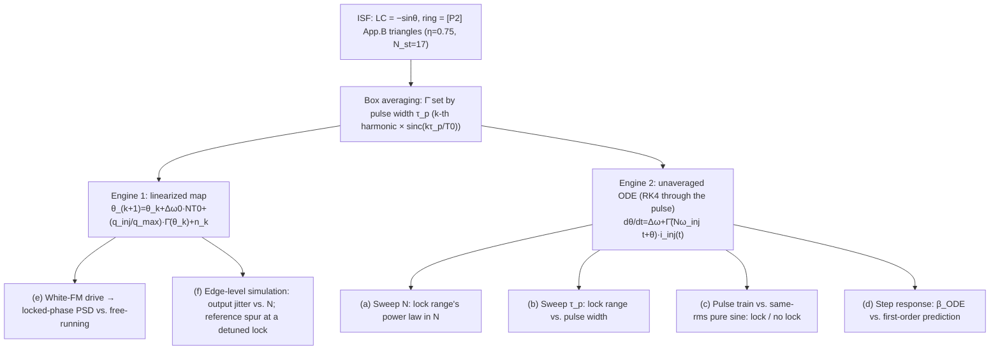

> **β**: This English translation is in beta — the Traditional-Chinese original is the authoritative version.

# Lab 40 — Subharmonic (×N) Pulse Injection: Impulse-Train Map vs. Unaveraged Time-Synchronous ODE

> **Prerequisites**: [subharmonic_injection](/06_design_insights/subharmonic_injection) (**every** closed form this lab verifies — the lock range, the realignment factor $\beta$, discrete-time noise shaping, output jitter, and the reference spur), [paper_003](/05_paper_deep_dives/paper_003_injection_locking_part1) ([P3] Sec. IV's impulse train and footnote 7's subharmonic arithmetic), [paper_004](/05_paper_deep_dives/paper_004_injection_locking_part2) ([P4] Eq.(28)–(30)'s M:N averaging equation) | **Next**: [injection_locked_division](/06_design_insights/injection_locked_division) (the dual, divider direction), [sampling_pll](/06_design_insights/sampling_pll), [clock_chain_budget](/06_design_insights/clock_chain_budget)

The [subharmonic_injection](/06_design_insights/subharmonic_injection) page has already **derived**
every formula for the injection-locked clock multiplier (ILCM) step by step: the multiplier closed
form $\omega_L=\tfrac12\vert I_N\vert\vert\tilde\Gamma_1\vert$ from [P4] Eq.(29), the $\Delta\omega_L\propto1/N$
scaling from the discrete arithmetic of [P3] footnote 7, the realignment factor $\beta$ from the
linearized per-pulse map, and the output-jitter closed form from putting noise on a first-order
discrete loop. This page **does not re-derive** any of it — it uses two independent numerical
engines to **score every one of those closed forms** term by term.

> **What this lab verifies**:
> 1. Does the lock range really go as $1/N$ (Engine 2: sweep $N$ with the unaveraged ODE)?
> 2. How does a finite pulse width eat into the lock range — a clean sinc for LC, and what about the ring (Engine 2: sweep the pulse width)?
> 3. At the same rms current, does the pulse train really lock while a pure sine really doesn't (Engine 2: pulse-train vs. sine comparison)?
> 4. How accurate is the first-order prediction $-q_{inj}\tilde\Gamma'(\theta_{ss})$ for the realignment factor $\beta$ (Engine 2: step response)?
> 5. Is the locked phase noise really a first-order discrete high-pass, with corner $\approx\beta f_{ref}/2\pi$ (Engine 1: map + white FM noise)?
> 6. Does output jitter really go as $\sqrt N$, and is the reference spur really independent of $\beta$ (Engine 1: edge-level simulation)?

> **Physical intuition**: the two engines measure the same physics at different resolutions.
> **Engine 1 (the map)** compresses one pulse's effect into an instantaneous jump
> $\theta_{k+1}=\theta_k+\Delta\omega_0NT_0+q_{inj}\tilde\Gamma(\theta_k)+n_k$ — fast, well suited
> to long-horizon noise statistics (PSD, jitter), but assumes the pulse is narrow. **Engine 2 (the
> unaveraged ODE)** honestly integrates the instantaneous equation
> $\dot\theta=\Delta\omega+\tilde\Gamma(N\omega_{inj}t+\theta)(q_{inj}/\tau_p)$ through the pulse with
> RK4 — it sees pulse-width effects and $\beta$'s second-order correction (the phase is already
> moving during the pulse), but each data point costs thousands of periods of integration, so it is
> best suited to "does it lock or not" edge sweeps. The two engines agree to within 0.1%–1% at the
> canonical parameters — that agreement is this lab's acceptance criterion.

> **Where this page sits**: an independent verification lab. All the theory has already been
> derived step by step, with sources flagged ([P3]/[P4] verified portions vs. this site's own
> derivations vs. external literature), on [subharmonic_injection](/06_design_insights/subharmonic_injection);
> this page lists only the **verification core code and the resulting numbers**. Pedagogical toy
> model: phase-only, weak injection, no transistors.

---

## 1. Learning goals

- Independently verify $\text{lock range}\propto1/N$ using the **unaveraged** time-synchronous
  ODE (not the already-averaged map) — this avoids the circular-reasoning trap of "verifying an
  averaged formula with the same averaged formula" (log-log slope $-1.000$, for both LC and ring).
- Sweep the pulse width $\tau_p$: LC's lock range follows $\mathrm{sinc}(\tau_p/T_0)$ exactly (a
  single harmonic, max deviation $10^{-4}$); the ring's sharp ISF spreads its energy across
  multiple harmonics, so a plain sinc is **not enough** (deviation up to 0.74) — only a
  "box-averaged whole ISF" matches (deviation $\le0.0074$).
- At equal rms current, the pulse train locks throughout the lock range (15/15 grid points) while
  a pure sine cannot lock at first order anywhere (0/15) — pinning down numerically what
  [subharmonic_injection](/06_design_insights/subharmonic_injection) Section 1 states in words: "a
  pure sine cannot lock."
- The realignment factor $\beta$'s ODE step response against the first-order prediction
  $-q_{inj}\tilde\Gamma'(\theta_{ss})/q_{max}$: ratio $0.98$–$1.03$ ($q_{inj}/q_{max}=0.05$),
  tightening to $0.995$–$1.03$ at $q_{inj}/q_{max}=0.01$ — the deviation is a second-order,
  $O(q_{inj}/q_{max})$ effect (the phase is already moving during the pulse), matching the
  precision the linear theory promises.
- Put white FM noise on the map and measure the locked phase's PSD: the low-frequency plateau
  matches theory to a ratio of $0.991$, and the corner measures $1.934$ MHz (simplified theory
  $1.981$ MHz; the exact discrete closed form gives $1.934$ MHz — the measurement rides right on
  the exact form).
- Edge-level simulation of the output jitter's power law in $N$: fitted slope $0.497$ (theory
  $0.5$); the canonical $N=20$ gives $2.226$ fs (closed form $2.228$ fs).
- The reference spur at a detuned lock: $k=1$ error $0.00$ dB, $k=2$ error $0.01$ dB — the
  first-order sawtooth approximation is nearly exact at the canonical parameters.

## 2. Mathematical model (the two engines and notation; full derivation on subharmonic_injection)

### 2.1 Engine 1: the linearized impulse-train map

$$
\theta_{k+1}=\theta_k+\Delta\omega_0\,NT_0+\frac{q_{inj}}{q_{max}}\,\bar\Gamma(\theta_k)+n_k,\qquad
n_k\sim\mathcal N(0,\kappa^2T_{inj})
$$

$\bar\Gamma$ is the ISF box-averaged over the pulse width (the $k$-th harmonic multiplied by
$\mathrm{sinc}(k\tau_p/T_0)$, reducing to $\Gamma$ in the impulse limit); $\kappa^2=0.125$ rad²/s
is the canonical white-FM variance-growth rate (see
[diffusion_dictionary](/03_isf_core_theory/diffusion_dictionary)). Linearizing gives the
realignment factor $\beta\equiv-\dfrac{q_{inj}}{q_{max}}\bar\Gamma'(\theta_{ss})$, corner
$\omega_c=\beta/T_{inj}$, and the first-order discrete noise-shaping transfer functions
$H_{ref}(z)=\dfrac{\beta}{1-(1-\beta)z^{-1}}$, $H_{osc}(z)=\dfrac{1-z^{-1}}{1-(1-\beta)z^{-1}}$.

### 2.2 Engine 2: the unaveraged time-synchronous ODE

$$
\frac{d\theta}{dt}=\Delta\omega+\tilde\Gamma\big(N\omega_{inj}t+\theta\big)\,i_{inj}(t),\qquad
i_{inj}(t)=\begin{cases}q_{inj}/\tau_p,&\vert t-kT_{inj}\vert<\tau_p/2\\0,&\text{otherwise}\end{cases}
$$

RK4 is used during the pulse (with the number of sub-steps set by the ISF's curvature: LC at
$\le0.2$ rad per sub-step, the ring's sharp triangle kinks at $\le0.05$–$0.08$ rad per sub-step,
checked against a 512-sub-step reference to $\le0.4\%$/$0.85\%$ error); between pulses,
$\dot\theta=\Delta\omega$ is skipped over analytically. "Does it lock" is read directly off the
**net correction of the lock characteristic** $J(\theta)=\theta_{\text{after pulse}}-\theta_{\text{before pulse}}$
(a single integration at $\Delta\omega=0$) giving the edges $A_\pm=\mp\min/\max J(\theta)$, or
cross-checked with a long-time convergence test (2500–4000 periods; locked $\Leftrightarrow$ the
last 800–1300 periods satisfy $\vert\theta(\text{end})-\theta(\text{end}-n_{tail})\vert<5\times10^{-3}$).

### 2.3 Two toy ISFs (shared with other labs on this site)

$$
\Gamma_{LC}(\theta)=-\sin\theta,\qquad
\Gamma_{ring}(\theta)=\text{[P2] App.B triangular pulses (}\eta=0.75,\ N_{st}=17\text{, the same construction as lab\_39)}
$$

The ring toy is two opposite-sign triangular pulses, height = half-width $=1/f'$ ($f'=\eta N_{st}/\pi=4.0585$
1/rad), $\max\vert\Gamma_{ring}\vert=1/f'=0.2464$ — a **pedagogical toy, not transistor-level**.

### 2.4 Applicability and failure conditions

| Condition | When it holds | What happens when it fails |
|---|---|---|
| Weak injection $q_{inj}\ll q_{max}$ | Engine 1 linearizes correctly; $\beta$'s first-order prediction is accurate | Large injection: the $\beta$ ODE/map ratio deviates systematically from 1 (measured at $O(q_{inj}/q_{max})$ in (d)) |
| Pulse width $\ll T_0$ | $\bar\Gamma\approx\Gamma$; Engines 1 and 2 agree | $\tau_p\to T_0$: LC's lock range collapses to 0 (the null seen in (b)) |
| $\theta$ varies slowly within $T_{inj}$ | The two engines reconcile with each other | Near the lock-range edge: critical slowing, requiring more periods for the long-time convergence test |
| White-FM noise drive (Engine 1's noise part) | $\sigma_w^2=\kappa^2T_{inj}$; the PSD closed form holds | Flicker FM: not covered by this lab |

---

## 3. Block diagram



## 4. Core Python code

Excerpted from `simulations/lab_40_subharmonic_injection.py` (checked against the source). The
box-averaged table, the per-pulse map, and one pulse period of the unaveraged ODE (RK4):

```python
def isf_tables(gamma_func, tp):
    """Gbar(theta) = ISF box-averaged over the pulse (width tp/T0), via FFT:
    k-th harmonic multiplied by sinc(k*tp/T0)."""
    g = gamma_func(XG)
    G = np.fft.rfft(g)
    k = np.arange(G.size)
    Gb = G * np.sinc(k * tp)
    gbar = np.fft.irfft(Gb, NG)
    gbar_p = np.fft.irfft(1j * k * Gb, NG)          # d Gbar / d theta
    return gbar, gbar_p

def pulse_period_step(theta, dw, n_div, qt, gamma_func, tp, nsub):
    """ENGINE 2: one injection period T_inj = n_div*T0 of the UNAVERAGED ODE —
    RK4 through the rectangular pulse (width tp), analytic free-run in between."""
    h = tp / nsub
    amp = qt / tp
    t = -tp / 2.0
    for _ in range(nsub):
        k1 = dw + amp * gamma_func(TWO_PI * t + theta)
        k2 = dw + amp * gamma_func(TWO_PI * (t + 0.5 * h) + theta + 0.5 * h * k1)
        k3 = dw + amp * gamma_func(TWO_PI * (t + 0.5 * h) + theta + 0.5 * h * k2)
        k4 = dw + amp * gamma_func(TWO_PI * (t + h) + theta + h * k3)
        theta = theta + (h / 6.0) * (k1 + 2 * k2 + 2 * k3 + k4)
        t += h
    return theta + dw * (n_div - tp)

def gbar_prime_exact(gamma_func, theta, tp):
    """Exact derivative of the box-averaged ISF (difference of raw Gamma at the
    two box ends over the box width) -- used for beta = -q_t * Gbar'(theta*)."""
    half_w = np.pi * tp
    return (gamma_func(theta + half_w) - gamma_func(theta - half_w)) / (2.0 * half_w)
```

Numbers printed by the script (`PYTHONPATH=. python3 simulations/lab_40_subharmonic_injection.py`,
about 35 s single core; seed fixed with `default_rng(40)`, results reproducible):

```python
print(A_edge_pred['LC'])                    # -> 0.04979 rad/period (qt*max|Gbar|, N=20)
print(fL_pred['LC']/1e6)                    # -> 1.9813 MHz (with the 10 ps pulse-width sinc correction)
print(slope_N['LC'], slope_N['ring'])       # -> -1.000 -1.000 ((a) log-log slope, theory -1)
print(ratio_N['LC'].min(), ratio_N['LC'].max())   # -> 1.0000 1.0000 (LC measured/theory)
print(dev_lc_sinc)                          # -> 0.0001 ((b) LC: max deviation of ODE/f_L(0) from sinc)
print(dev_ring_box, dev_ring_sinc)          # -> 0.0074 0.7434 (ring: box average correct, plain sinc wrong)
print(n_lock_pulse, n_plateau_sine)         # -> 15 0 ((c): 15/15 grid points lock for the LC pulse train, 0 for the pure sine)
print(beta_c_lc[5], beta_c_lc[4])           # -> 0.04858 0.04979 ((d) headline beta: ODE vs. first order)
print(r_plateau, fc_meas/1e6, fc_pred/1e6)  # -> 0.991 1.9343 1.9813 ((e) plateau ratio, measured/theory corner)
print(slope_j, sig_all[10]/(2*np.pi*5e9)*1e15)  # -> 0.497 2.226 ((f1) jitter's power law in N, N=20 output in fs)
print(round(spur1[0], 2))                   # -> -67.96 ((f2) reference spur at 100 kHz detuning, dBc)
```

## 5. Full script path

`simulations/lab_40_subharmonic_injection.py` (depends on `savefig` from
`simulations/common/plot_utils.py` and `gamma_lc_ideal` from `simulations/common/isf_utils.py`;
uses `scipy.signal.welch` for the PSD and `scipy.optimize.brentq` to solve the exact discrete
corner).

To run: `PYTHONPATH=. python3 simulations/lab_40_subharmonic_injection.py` (about 35 s single
core; seed fixed with `default_rng(40)`).

## 6. Parameter table

| Parameter | Program variable | Value | Meaning |
|---|---|---|---|
| Carrier | `F0` | 5 GHz | canonical $f_0$ |
| $q_{max}$ | `QMAX` | 1 pC | canonical |
| $q_{inj}$ | `QINJ` | 50 fC | charge per pulse ($q_{inj}/q_{max}=0.05$) |
| Pulse width | `TAUP` | 10 ps | $\tau_p/T_0=0.05$ |
| Multiplication ratio | `N_HEAD` | 20 | $f_{ref}=250$ MHz, $T_{inj}=4$ ns |
| $N$ sweep ((a)) | `N_list` | 2, 4, 8, 16, 20 | lock range vs. $N$ |
| Pulse-width sweep ((b)) | `tp_list` | 2–175 ps (9 points) | lock range vs. $\tau_p$ |
| Detuning sweep ((c)) | `r_grid` | $-1.5$–$1.5$ (25 points, $\times\omega_L/N$) | pulse-train vs. pure-sine drift curves |
| $q_{inj}/q_{max}$ ((d)) | `qt_arr` | 0.05, 0.01 | two injection strengths for the $\beta$ step response |
| $\kappa^2$ | `KAPPA2` | 0.125 rad²/s | canonical (diffusion_dictionary) |
| PSD samples ((e)) | `K_PSD`/`M_W` | $2^{18}$/32 walkers | Welch, `nperseg`$=2^{14}$ |
| Edge-level samples ((f1)) | `K` (depends on $N$) | $\ge4096$, 8 walkers | rerun per $N$ |
| Ring toy | `ETA`, `NST` | 0.75, 17 | [P2] App.B construction, same as lab_39 |

## 7. Units table

| Quantity | Symbol | Units |
|---|---|---|
| Phase | $\theta$ | rad |
| Half lock range | $\omega_L$, $f_L$ | rad/s, Hz |
| Realignment factor | $\beta$ | dimensionless |
| Noise corner | $\omega_c$, $f_c$ | rad/s, Hz |
| White-noise variance growth rate | $\kappa^2$ | rad²/s |
| Phase PSD | $S(f)$ | rad²/Hz |
| Output jitter | $\sigma_t$ | s (fs) |
| Reference spur | — | dBc |

## 8. Simulation figure

![Subharmonic (×N) pulse injection locking: (a) log-log sweep of lock range vs. N (theory slope −1, LC/ring unaveraged-ODE measurements overlap); (b) lock range vs. pulse width — LC follows the exact sinc, the ring needs the box average; (c) pulse train vs. same-rms pure sine drift curves vs. detuning, the pulse train locks throughout the lock range while the sine does not; (d) realignment factor β's ODE step response vs. the first-order prediction −q_inj·Γ̄′(θ*)/q_max; (e) locked-phase PSD against free-running, first-order discrete high-pass shaping and the corner; (f) output jitter vs. N (∝√N) with a reference-spur inset for a detuned lock](/figures/subharmonic_injection.png)

## 9. How to read the figure

**(a) Lock range vs. $N$**: the two theory dashed lines (LC, ring) are
$f_L=\dfrac{q_{inj}}{2\pi q_{max}}\dfrac{\max\vert\bar\Gamma\vert}{NT_0}$; the circles/squares are
the unaveraged-ODE measurements at $N=2,4,8,16,20$ — LC lies exactly on the theory line (ratio
$1.0000$), the ring runs $0.30\%$ high (a slightly larger finite-pulse effect at the triangle's
sharp corner). Both log-log slopes are $-1.000$: the same pulse has to pay for $N$-times-longer
drift, no exceptions to the $1/N$ law.

**(b) Lock range vs. pulse width**: the black dashed line is the "plain sinc" reference (the decay
of the single $k=N$ harmonic). LC's blue measured points lie **exactly** on that line (max
deviation $10^{-4}$) — because LC's ISF has only one harmonic ($-\sin$), and locking taps only the
$N$-th harmonic. The ring's green measured points fall off **much faster** and clearly deviate
from the plain sinc (deviation up to $0.74$): the ring's triangular pulse spreads its energy
across many harmonics ($m=1,2,3,\dots$, each paired with $mN$), and the pulse's box window shaves
all of them at once — so only "box-average the whole ISF, then take the extremum" (the green solid
line) matches the measurement (deviation $\le0.0074$). This is direct numerical evidence that a
plain sinc is not enough for the ring.

**(c) Pulse train vs. pure sine**: the horizontal axis is the normalized detuning
$\Delta\omega/\omega_L$. The pulse train (circles/squares) has its drift rate **pinned at zero**
for $\vert x\vert<1$ (the locked plateau); the pure sine at the same rms current (crosses) has
**no plateau** at all, only a line lightly offset by a second-order pushing effect (LC's fitted
intercept $-0.0801\,\omega_L=-158.7$ kHz matches the analytic pushing formula
$-(I/q_{max})^2\omega_0/(4(\omega_0^2-\omega_{inj}^2))$ to a ratio of $1.000$). The gray dashed
line is the Adler continuous-limit beat frequency $\mathrm{sgn}\sqrt{(\Delta\omega/\omega_L)^2-1}$
— the pulse train's out-of-lock drift rate tracks it exactly (median ratio $1.001$). This figure
is the most direct visual evidence that a pure sine cannot lock.

**(d) $\beta$ step response**: the black dashed line is the first-order prediction
$\beta=-q_{inj}\bar\Gamma'(\theta^*)/q_{max}$; the gray solid line is $1-e^{-\beta}$ (the
second-order correction from the phase moving during the pulse itself — the unaveraged ODE's
exponential step essentially measures $1-e^{-\beta_{map}}$, not $\beta_{map}$ itself). Both
LC and ring's measured points, at the two strengths $q_{inj}/q_{max}=0.05$ and $0.01$, sit on the
gray line; comparing against the first-order prediction itself, LC's center-point ratio $0.9755$
matches $1-\beta/2=0.9751$ almost exactly — precisely "the first term of the second-order
correction." This is a direct demonstration that the $\beta$ first-order theory's precision is
$O(q_{inj}/q_{max})$.

**(e) PSD**: the gray line is the measured free-running $S_\phi$ (tracking the discrete version of
$2\kappa^2/\omega^2$, ratio $0.999$), the blue line is the measured locked PSD, and the black
dashed line is the first-order discrete theory
$2\sigma_n^2T_{inj}/\vert e^{j\omega T_{inj}}-(1-\beta)\vert^2$. The low-frequency plateau
($1.613\times10^{-15}$ rad²/Hz) matches theory to a ratio of $0.991$; the red vertical line marks
the corner, measured at $1.934$ MHz against the simplified prediction $\beta f_{ref}/2\pi=1.981$
MHz (a $2.4\%$ difference) — but against the **exact discrete closed form**
$f_c'=\frac{f_{ref}}{2\pi}\arccos(1-\beta^2/(2(1+\beta)))=1.934$ MHz it is almost a perfect match
(ratio $1.0002$). The simplified formula's $2.4\%$ gap is the known $O(\beta)$ correction, not a
model error.

**(f) Output jitter and spur**: the main panel's circles are the edge-level simulation's full
output-edge jitter at fixed $\beta$ (i.e., fixed $q_{inj}$) across different $N$; the black dashed
line is the closed form
$\sqrt{\kappa^2NT_0[(1-\beta)^2/(\beta(2-\beta))+1/2]}$; the fitted slope is $0.497$ against the
theoretical $0.5$ — $\sigma_t\propto\sqrt N$ holds, giving $2.226$ fs at $N=20$ (closed form
$2.228$ fs). The inset shows the reference spur at a detuned lock: the $k=1$ and $k=2$ measured
points track $20\log_{10}(\Delta f_0/(kf_{ref}))$ exactly (max error $0.00$/$0.01$ dB) — the spur
is a first-order, deterministic effect, independent of $\beta$.

## 10. Corresponding paper equations / figures

- **[P3] Sec. IV footnote 7, p.2112 (verified)**: the injection can also land once every $M$
  periods — this lab's impulse-train map (Engine 1) and the (a)(b) unaveraged-ODE lock-range
  sweeps are exactly this sentence's discrete arithmetic and its numerical verification.
- **[P4] Eq.(28)–(30), p.2129 (verified)**: the $M{:}N$ time-synchronous averaging equation; this
  lab takes $(M,N)_{[P4]}=(N,1)$, whose term-by-term derivation into the multiplier closed form is
  written out in full on
  [subharmonic_injection](/06_design_insights/subharmonic_injection), Section 1 — this lab
  independently verifies that conclusion with Engine 2's unaveraged ODE (avoiding circular
  reasoning).
- **[P4] footnote 10, p.2129 (verified)**: the injection harmonics needed for $M\neq1$ are "not
  explicitly captured by our framework" — this lab's (c) "pure sine 0/15 vs. pulse train 15/15" is
  exactly the numerical demonstration of that sentence: assuming the injection already carries the
  $N$-th harmonic (a pulse), the first-order theory applies directly.
- **Noise shaping and the closed-form output jitter**: derived on this site (not in the 5 PDFs);
  the full derivation is in Section 4 of
  [subharmonic_injection](/06_design_insights/subharmonic_injection), and this lab's (e)(f1) are
  that derivation's independent numerical adjudication.
- **The first-order sawtooth reference-spur formula**: derived on this site
  ([subharmonic_injection](/06_design_insights/subharmonic_injection), Section 4.4); this lab's
  (f2) verifies it via an FFT of the deterministic sawtooth phase modulation.

## 11. Limitations and approximations

- **Phase-only toy model**: amplitude dynamics (the APF) are ignored; at zero detuning the LC's
  lock point sits at the voltage peak, where a pulse also kicks the amplitude ([P4]'s APF), a
  second-order effect when $q_{inj}\ll q_{max}$ — not covered by this lab.
- **Weak injection**: $q_{inj}/q_{max}=0.05$ or $0.01$; (d) already measures the first-order
  theory's $O(q_{inj}/q_{max})$ deviation; stronger injection needs the APF correction from
  [paper_004_large_injection_transient](/05_paper_deep_dives/paper_004_large_injection_transient).
- **White-FM noise assumption** (Engine 1's noise part): $\sigma_w^2=\kappa^2T_{inj}$ is the exact
  result for white FM noise; under flicker FM the variance is no longer $\propto t$ — not covered
  by this lab.
- **The ring toy is a triangular construction**: a real ring's ISF flank is not a strict triangle,
  and its dead zone is not strictly zero; the order-of-magnitude conclusion driven by $q_{max}$
  (the ring's $\beta$ wins on small $q_{max}$, not on slope) is unaffected by this simplification —
  see the ring-vs-LC table in Section 3 of
  [subharmonic_injection](/06_design_insights/subharmonic_injection).
- **$f\ll f_{ref}/2$**: (e)'s discrete $\vert H\vert^2$ equals the continuous first-order PLL only
  well below $f_{ref}/2$; sampling effects start to show up near $f_{ref}/2$ (this lab logs only
  near $f<f_{ref}/8$).
- **First-order spur**: (f2)'s sawtooth approximation ignores direct pulse feedthrough, AM caused
  by the APF, and pulse-width effects — none of these are in the phase-only model, and are
  honestly left out (see Section 4.4 of
  [subharmonic_injection](/06_design_insights/subharmonic_injection)).

## Key takeaways

- **(a) Lock range $\propto1/N$**: the unaveraged-ODE sweep over $N=2$–$20$ gives a log-log slope
  of $-1.000$ (LC and ring alike), with measured/theory ratios of $1.0000$ (LC) and $1.0030$
  (ring).
- **(b) Pulse-width effect**: LC follows $\mathrm{sinc}(\tau_p/T_0)$ exactly (deviation $10^{-4}$);
  the ring's multi-harmonic energy makes the plain sinc fail (deviation $0.74$), requiring the
  extremum of the box-averaged ISF to match (deviation $0.0074$).
- **(c) A pure sine cannot lock**: at the same $I_{rms}=250\ \mu$A, the pulse train locks at 15/15
  grid points while the pure sine locks at 0/15 — completely unable to lock at first order, with
  only the second-order pushing effect left (LC: $-158.7$ kHz, matching the analytic formula at a
  ratio of $1.000$).
- **(d) $\beta$'s first-order precision**: the ODE step response against the first-order
  prediction has ratio $0.98$–$1.03$ ($q_{inj}/q_{max}=0.05$), tightening at $0.01$; the deviation
  is essentially the second-order term $1-e^{-\beta}$, with headline $\beta_{ODE}=0.04858$ against
  the first-order $0.04979$.
- **(e) Noise shaping**: the locked PSD's low-frequency plateau matches theory to a ratio of
  $0.991$, and the corner measures $1.934$ MHz — an almost exact match (ratio $1.0002$) against
  the exact discrete closed form (not the simplified $\beta f_{ref}/2\pi$).
- **(f) Jitter and spur**: the output jitter's fitted power-law slope is $0.497\approx1/2$, giving
  $2.226$ fs at $N=20$ (closed form $2.228$ fs); the reference spur matches the first-order
  sawtooth formula to within $0.01$ dB.
- The two independent engines (the linearized map and the unaveraged ODE) agree with each other to
  within $0.1$–$1\%$ at the canonical parameters — every closed form on
  [subharmonic_injection](/06_design_insights/subharmonic_injection) has passed this lab's
  numerical adjudication.

## Further reading

- The full theoretical derivation this lab verifies: [subharmonic_injection](/06_design_insights/subharmonic_injection)
- The impulse-train thought experiment and the subharmonic footnote: [paper_003](/05_paper_deep_dives/paper_003_injection_locking_part1) ([P3] Sec. IV, p.2112)
- The original source of the M:N averaging equation: [paper_004](/05_paper_deep_dives/paper_004_injection_locking_part2) ([P4] Eq.(28)–(30), p.2129)
- The dual, divider direction (÷N ILFD): [injection_locked_division](/06_design_insights/injection_locked_division)
- The source of $\kappa^2$ and its five outfits: [diffusion_dictionary](/03_isf_core_theory/diffusion_dictionary)
- The continuous-time version of "a locked oscillator is a first-order PLL": [injection_locking_noise](/06_design_insights/injection_locking_noise)
- Wiring the ILCM back into system-level accounting: [clock_chain_budget](/06_design_insights/clock_chain_budget), [sampling_pll](/06_design_insights/sampling_pll)
