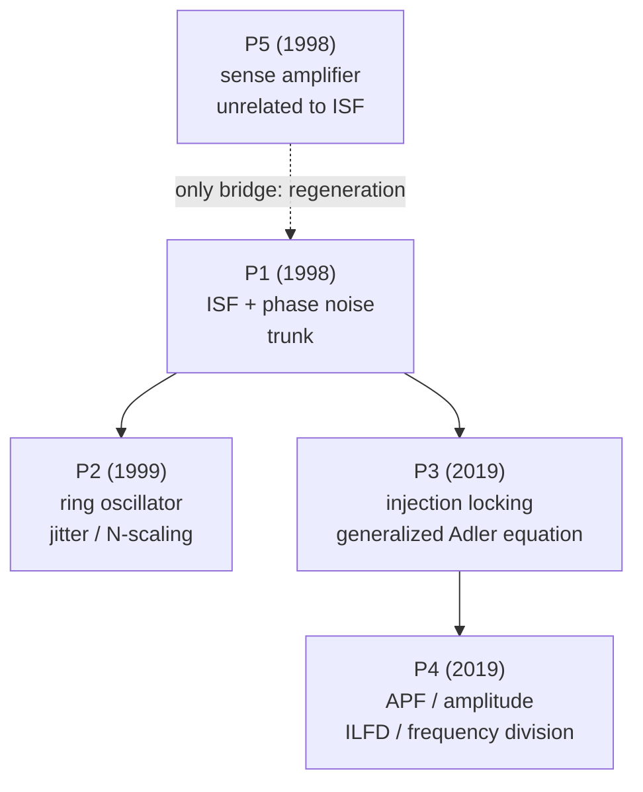

> **β**: This English translation is in beta — the Traditional-Chinese original is the authoritative version.

# Paper Deep Dives

> **Prerequisites (recommended first)**: the step-by-step derivations of the core concepts are in [03_isf_core_theory](/03_isf_core_theory/isf_definition) (start from [isf_definition](/03_isf_core_theory/isf_definition)); the geometric and signal background is in [02_foundations](/02_foundations/oscillator_phase). This folder looks back "from the altitude of the papers" — it reads much more smoothly once you have the core concepts.

This folder gives a **deep dive of each** of the 5 source PDFs: every page follows the same
template (Citation → one-sentence contribution →
why it matters → main assumptions → key equations derived step by step → key figures → design
insights →
limitations → relation to the other papers → what to remember). The detailed derivations of
the core theory live in
[03_isf_core_theory](/03_isf_core_theory/isf_definition); here we look back from the altitude
of the papers.

> **How to use this folder**: read the [P1] page first — it is the foundation of the entire
> course, and the other four pages all build on it.
> To compute things hands-on, go back to the [simulation labs](/04_simulation_labs/numerical_feeling); to find which paper an equation
> belongs to and where it is derived, check the [equation_index](/01_paper_map/equation_index).

## The five papers at a glance

| # | Paper | Year | Relation to the ISF | Difficulty | Deep-dive page |
|---|---|---|---|---|---|
| **[P1]** | A General Theory of Phase Noise in Electrical Oscillators | 1998 | **ISF core foundation** (definition, derivation, design rules) | Core | [paper_001](/05_paper_deep_dives/paper_001_general_theory_phase_noise) |
| **[P2]** | Jitter and Phase Noise in Ring Oscillators | 1999 | ISF applied to rings: jitter, $N$-scaling, symmetry | Core extension | [paper_002](/05_paper_deep_dives/paper_002_jitter_phase_noise_ring) |
| **[P3]** | Injection Locking & Pulling—Part I (time-synchronous) | 2019 | The same ISF yields the **generalized Adler equation**, lock range | Advanced | [paper_003](/05_paper_deep_dives/paper_003_injection_locking_part1) |
| **[P4]** | Injection Locking & Pulling—Part II (APF / frequency division) | 2019 | Introduces the **APF** (amplitude counterpart of the ISF), ILFD | Advanced | [paper_004](/05_paper_deep_dives/paper_004_injection_locking_part2) |
| **[P5]** | Design Issues in Cross-Coupled Inverter Sense Amplifier | 1998 | **Unrelated to ISF/phase noise** (see below) | Peripheral | [paper_005](/05_paper_deep_dives/paper_005_cross_coupled_sense_amp) |

## Standard citation strings (use verbatim)

- **[P1]** A. Hajimiri and T. H. Lee, *"A General Theory of Phase Noise in Electrical
  Oscillators,"* IEEE J. Solid-State Circuits, vol. 33, no. 2, pp. 179–194, Feb. 1998.
- **[P2]** A. Hajimiri, S. Limotyrakis, and T. H. Lee, *"Jitter and Phase Noise in Ring
  Oscillators,"* IEEE J. Solid-State Circuits, vol. 34, no. 6, pp. 790–804, Jun. 1999.
- **[P3]** B. Hong and A. Hajimiri, *"A General Theory of Injection Locking and Pulling in
  Electrical Oscillators—Part I: Time-Synchronous Modeling and Injection Waveform Design,"*
  IEEE J. Solid-State Circuits, vol. 54, no. 8, pp. 2109–2121, Aug. 2019.
- **[P4]** B. Hong and A. Hajimiri, *"...Part II: Amplitude Modulation in LC Oscillators,
  Transient Behavior, and Frequency Division,"* IEEE JSSC, vol. 54, no. 8, pp. 2122–2139,
  Aug. 2019.
- **[P5]** A. Hajimiri and R. Heald, *"Design Issues in Cross-Coupled Inverter Sense
  Amplifier,"* Proc. IEEE ISCAS, 1998.

## Their role in the course

Think of the four related papers as a tree: [P1] is the trunk (ISF and phase noise), [P2] is
the main branch that applies the trunk
to ring oscillators, and [P3]/[P4] are the two new 2019 branches where Hong–Hajimiri extend
**the same
ISF** from "free-running phase noise" to "locking/pulling under an external injected
signal." One main thread runs through all of them:

> **"An oscillator's phase response to any perturbation = the perturbation weighted by the ISF $\Gamma(\omega_0\tau)$, then integrated."**

Phase noise ([P1][P2]) makes the perturbation a random noise current; injection locking
([P3][P4]) makes it
a **deterministic, periodic injected current**. Same mathematical skeleton, different input.

## Suggested reading order

1. **Read [P1] first** ([paper_001](/05_paper_deep_dives/paper_001_general_theory_phase_noise)).
   It defines the ISF, derives the 1/f² (Eq.(21)) and 1/f³ (Eq.(23)–(24)) phase noise, and
   gives the three design rules
   (raise $q_{max}$, lower $\Gamma_{rms}$, use symmetry to suppress $c_0$). If you have not
   understood it, nothing downstream will move.
2. **Then [P2]** ([paper_002](/05_paper_deep_dives/paper_002_jitter_phase_noise_ring)).
   It applies [P1] to rings: accumulated jitter $\sigma_{\Delta t}=\kappa\sqrt{\Delta t}$,
   $\Gamma_{rms}\propto N^{-3/2}$, and the conclusion that "at fixed power and frequency,
   ring phase noise is almost independent of $N$"
   (verified).
3. **For injection, read [P3]→[P4]**. [P3] is the phase-only generalized Adler equation; [P4]
   adds amplitude
   (APF) and frequency division. These two are **advanced**; their core equations have been
   verified against the original PDFs ([P3] generalized Adler Eq.(30)/(35), pp.2113–2114;
   [P4] APF Eq.(18)–(22), Fig. 5, p.2126).
4. **[P5] last, and only as an aside**. See below.

## Honesty note: [P5] is unrelated to the ISF

The source folder holds 5 PDFs, but **`Hajimiri_ISCS_98.pdf` ([P5]) is not an oscillator
phase noise/ISF paper**. It is a 4-page ISCAS 1998 paper on the design of a
**cross-coupled inverter sense amplifier**. It discusses
regeneration speed, the offset voltage caused by device mismatch, and a
figure of merit for offset — **entirely outside** the scope of ISF/phase noise/jitter.

It appears in this list purely because it **sits in the source folder and shares the author
Hajimiri**. We do not pretend it is related to the
ISF. Its **only** conceptual bridge to this course: the heart of a sense amp is the
**positive feedback/regeneration** of a cross-coupled pair, and that same positive-feedback
mechanism is what lets latch-based and LC oscillators "self-start and
sustain a limit cycle." Beyond that, treat [P5] as a marginal note. See
[paper_005](/05_paper_deep_dives/paper_005_cross_coupled_sense_amp) (claim C12).

## External literature outside these 5 PDFs (standard supplements)

The rigorous mathematical foundation of the ISF — **PPV (perturbation projection
vector)/adjoint
method/Floquet theory** — comes from the broader literature (e.g.
Demir–Mehrotra–Roychowdhury 2000, Kaertner), **not among the five downloaded PDFs**; this
site supplements it from standard
references and marks it explicitly as external, see [effective_isf](/03_isf_core_theory/effective_isf) (claim C13).

## Further reading / matching teaching pages

Every deep dive lists its matching core-theory/lab/design pages at the bottom. Here is a **lightweight master table** to jump straight from a paper to the "work through the derivation" page:

| Paper | Deep-dive page | Main matching teaching pages |
|---|---|---|
| **[P1]** | [paper_001](/05_paper_deep_dives/paper_001_general_theory_phase_noise) | [isf_definition](/03_isf_core_theory/isf_definition), [convolution_derivation](/03_isf_core_theory/convolution_derivation), [white_noise_to_phase_noise](/03_isf_core_theory/white_noise_to_phase_noise), [flicker_noise_upconversion](/03_isf_core_theory/flicker_noise_upconversion), [symmetry](/06_design_insights/symmetry) |
| **[P2]** | [paper_002](/05_paper_deep_dives/paper_002_jitter_phase_noise_ring) | [lc_vs_ring](/06_design_insights/lc_vs_ring), [lab_03_ring_oscillator_toy_model](/04_simulation_labs/lab_03_ring_oscillator_toy_model), [symmetry](/06_design_insights/symmetry) |
| **[P3]** | [paper_003](/05_paper_deep_dives/paper_003_injection_locking_part1) | [quadrature_and_coupled_oscillators](/06_design_insights/quadrature_and_coupled_oscillators) (advanced; injection locking) |
| **[P4]** | [paper_004](/05_paper_deep_dives/paper_004_injection_locking_part2) | [effective_isf](/03_isf_core_theory/effective_isf), [lab_14_cyclostationary_isf](/04_simulation_labs/lab_14_cyclostationary_isf), [quadrature_and_coupled_oscillators](/06_design_insights/quadrature_and_coupled_oscillators) |
| **[P5]** | [paper_005](/05_paper_deep_dives/paper_005_cross_coupled_sense_amp) | **no matching ISF page**; the only bridge is regeneration/positive feedback (see that page) |

> **How to use this table**: to "push a paper's equation all the way through," click the matching teaching page; to "see the paper's overall story," stay in the deep dive. All hands-on labs are in [04_simulation_labs](/04_simulation_labs/numerical_feeling), and the design rules are collected in [06_design_insights](/06_design_insights/lc_vs_ring).

## Key takeaways

- Four related papers, one main thread: **phase response = ISF-weighted perturbation, integrated**; phase noise and injection differ only in the input.
- Reading order: [P1] → [P2] → (advanced) [P3] → [P4]; [P5] only as an aside.
- [P5] is a sense-amplifier paper, **unrelated to the ISF**; the only bridge is regeneration/positive feedback.
- PPV/adjoint/Floquet is the rigorous foundation of the ISF but is **not among these 5 PDFs** — external literature.
