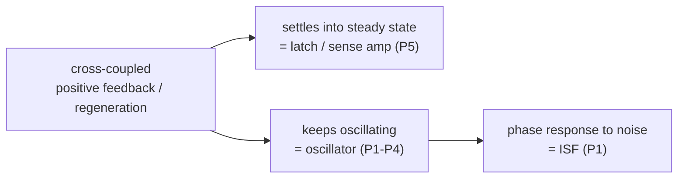

> **β**: This English translation is in beta — the Traditional-Chinese original is the authoritative version.

# Design Issues in Cross-Coupled Inverter Sense Amplifier

> **Prerequisites (recommended reading)**: this page is **not** a prerequisite for the ISF. Its only connection to this course is the **regeneration / positive feedback** of the cross-coupled pair; to see how that mechanism becomes "oscillator start-up," first read [oscillator_phase](/02_foundations/oscillator_phase) (limit-cycle start-up) and [tank_Q_and_energy_restoration](/02_foundations/tank_Q_and_energy_restoration) (negative resistance compensating losses). To learn the ISF itself, go straight to [paper_001](/05_paper_deep_dives/paper_001_general_theory_phase_noise).

**Let's be clear up front: this paper has nothing to do with ISF / phase noise / jitter.** It is an
ISCAS 1998 short paper (4 pages) on the design of a **cross-coupled inverter sense amplifier**, covering
regeneration speed, offset voltage caused by device mismatch, and a figure of merit for
offset. It appears in this list purely because it is **in the source folder and shares the author Hajimiri**. This page
honestly flags that mismatch (claim C12) and offers only **one conceptual bridge**.

> **Why write a page anyway**: Section 9 of the authoring conventions requires "[P5] must always be honestly described as
> a sense-amplifier paper unrelated to ISF." We do not pretend it relates to the ISF, nor force equations onto it; we simply state
> its actual content and point out its **only** legitimate connection to this course.

## Citation

> **[P5]** A. Hajimiri and R. Heald, *"Design Issues in Cross-Coupled Inverter Sense
> Amplifier,"* Proc. IEEE International Symposium on Circuits and Systems (ISCAS), 1998.
> (file `Hajimiri_ISCS_98.pdf`, paper_005, 4 pages)

## One-sentence contribution

Analytic design of a CMOS cross-coupled-inverter sense amplifier: analyzes the effect of the equilibrating
transistors and the tail current source on sensing speed, the offset caused by mismatch, and proposes a figure of merit for
offset — **unrelated to oscillator phase noise / ISF** (claim C12).

## Why this paper matters (for this course: essentially not at all)

For the **ISF course**, this paper's importance is ≈ **zero**. It solves problems in memory and datapath circuits: a sense amplifier
must **quickly and reliably** amplify the tiny voltage difference appearing on the bitline into a full-swing digital 0/1. Its concerns are:

- **Regeneration speed**: the cross-coupled pair uses positive feedback to exponentially separate the two node voltages
  from the metastable point — the faster the separation, the faster the sensing.
- **Offset**: the two sides' transistors can never be identical (mismatch); this asymmetry makes the sense amp
  favor one side even at zero input difference, causing read errors. The paper analyzes the mismatch sources and gives a figure of merit.
- How the **gradual switching** of the equilibrating device and the tail current source degrades the above performance.

These are digital/memory circuit topics — **no** limit cycle, no excess phase, no ISF,
no phase noise spectrum.

## Main assumptions

Per paper_metadata (paper_005.assumptions):

- Small-signal regeneration analysis around the metastable point; mismatch-based offset model.
- (As stated in the paper) current has flowed through the transistors long enough, and the equilibrating device can be treated as an ideal switch — two simplifying assumptions
  that are challenged one by one in the later sections.

## Key equations (not transcribed; outside the scope of this course)

Per paper_metadata (paper_005.important_equations): the equations of this paper (regeneration time constant,
offset voltage expressions) are **outside the scope of the ISF course and are therefore not transcribed verbatim**.

> ⚠️ **TODO**: equations not transcribed because this PDF is unrelated to ISF/phase noise.

However, to make the **single conceptual bridge** clear, we point out only its core mechanism (regeneration), with a maximally
simplified small-signal model showing "how positive feedback amplifies exponentially" — the same mechanism is also what allows an oscillator to start up:

**Regeneration of the cross-coupled pair (simplified small-signal)**: for two mutually fed-back inverters, the differential voltage
$v_d=v_1-v_2$ near the metastable point satisfies

$$
C\frac{dv_d}{dt}=(G_m-G_0)\,v_d\quad\Rightarrow\quad v_d(t)=v_d(0)\,e^{\,t/\tau_{regen}},\quad \tau_{regen}=\frac{C}{G_m-G_0}.
$$

- **Meaning**: as long as the effective transconductance $G_m$ exceeds the node leakage conductance $G_0$, the differential voltage
  **grows exponentially** (positive feedback), rapidly amplifying a tiny input difference to full swing — this is regeneration.
  The smaller $\tau_{regen}$, the faster the sensing.
- **Dimension check**: $[\text{F}]/[\text{S}]=[\text{C/V}]/[\text{A/V}]=[\text{C/A}]=[\text{s}]$ ✓.
- This comes from simplifying the paper's Sec. 2 pair of cross-coupled differential equations ($dv_1/dt$, $dv_2/dt$); **this is the minimal form we
  wrote to explain the bridge — the paper's full expressions (including equilibrating / tail effects) are more complex and outside the scope of this course**.

## Key figures

The paper has sense-amp schematics and small-signal equivalent diagrams (Fig. 1 etc.), but they are **irrelevant to the ISF course; this site neither cites nor redraws them**
(paper_metadata: important_figures is empty).

## Design insights (for the sense amp, not for the ISF)

- At the regenerative node, **the design goal is to minimize the time constant $\tau_{regen}$**, not to blindly enlarge the initial voltage difference
  (the paper explicitly points out this trade-off).
- A complete offset analysis must consider the cell and bitline structure together, not just the cross-coupled pair itself.
- The gradual switching of the equilibrating device and the tail current source significantly degrades speed and offset and must be included in the analysis.

These are useful to SRAM / sense-amp designers, but **carry no transferable design rules for ISF / phase noise**.

## Limitations (for this course)

Per paper_metadata (paper_005.limitations):

- **Entirely outside the scope of ISF / phase noise / jitter.** This site treats it as a corner-case deep-dive, honestly flags it as mislabeled,
  and offers only the "regeneration → oscillation" conceptual bridge.

## Relationship to other papers (the only bridge)

[P5] has **no theoretical continuity** with [P1]–[P4]. The only legitimate connection is one **mechanism**:

> **The regeneration (positive feedback) of the cross-coupled pair is also the foundation on which latch-based and LC oscillators
> "start up on their own and sustain a limit cycle."**

- In a **sense amp**: positive feedback amplifies a tiny input difference **once** to full swing, then settles into a steady state (the latch locks).
- In an **oscillator**: the same negative resistance / positive feedback supplies energy to compensate the tank's losses, letting the oscillation
  **persist** without decaying — this is exactly the physical origin of a stable limit cycle ([P1] assumption 2). The $-G_m$ pair of a differential LC-VCO and the
  cross-coupled stage of a latch-based ring share the same start-up mechanism as this paper's cross-coupled pair.

So remember it this way: **the same cross-coupled positive feedback, when it stops, is a latch/sense amp; when it cannot stop (keeps
oscillating), it is an oscillator.** But the moment we get to "the oscillator's phase response to noise," that is ISF territory — unrelated to this paper.

For the details of oscillator start-up and limit-cycle geometry, see
[oscillator_phase](/02_foundations/oscillator_phase); for the ISF itself, see
[paper_001](/05_paper_deep_dives/paper_001_general_theory_phase_noise).

## Further reading / corresponding teaching pages

[P5] is unrelated to the ISF, so there is **only one bridge** here — we do not pretend there are more:

| Which part of this page | Corresponding teaching page | Why this link |
|---|---|---|
| Regeneration / positive feedback of the cross-coupled pair (the only bridge) | [paper_001](/05_paper_deep_dives/paper_001_general_theory_phase_noise) and the [paper-by-paper deep-dive guide](/05_paper_deep_dives) | The same positive feedback: "stops = latch/sense amp, cannot stop = oscillator"; the oscillator's limit-cycle start-up comes from it, and only then does the ISF enter the stage (claim C12) |

> **Honesty note**: this page does not link to any core ISF theory page or design page, because [P5] is outside the scope of ISF / phase noise (see the mismatch statement above). To learn the ISF, return to [paper_001](/05_paper_deep_dives/paper_001_general_theory_phase_noise); for the full map of the five papers' roles, see the [paper-by-paper deep-dive guide](/05_paper_deep_dives).

## What to remember

- **[P5] is a sense-amplifier paper, unrelated to ISF / phase noise / jitter** (claim C12) — do not cite it as
  ISF literature.
- It is in the list only because it is **in the source folder and shares an author**; this site honestly flags it as mislabeled.
- **The only conceptual bridge**: the regeneration / positive feedback of the cross-coupled pair, which is also the foundation of latch and LC oscillator start-up
  (stops = latch, cannot stop = oscillator).
- To learn the ISF, return to [P1] ([paper_001](/05_paper_deep_dives/paper_001_general_theory_phase_noise)).
