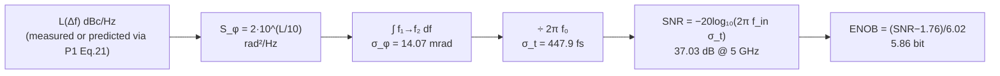

import NumericQuiz from "@site/src/components/NumericQuiz";

# ADC aperture jitter: how clock jitter eats SNR and ENOB

> **β**: This English translation is in beta — the Traditional-Chinese original is the authoritative version.

> Prerequisites: [psd_phase_noise_jitter](/02_foundations/psd_phase_noise_jitter) (the $\mathcal{L}\to S_\phi\to\sigma_\phi\to\sigma_t$ four-step chain), [lab_08_jitter_integration](/04_simulation_labs/lab_08_jitter_integration) (how the 447.9 fs is integrated) ｜ Next: [serdes_clocking_connection](/06_design_insights/serdes_clocking_connection), [exercises](/06_design_insights/exercises)

## The problem: you swapped in a 12-bit ADC — why didn't the high-frequency SNR improve at all?

A high-speed ADC (analog-to-digital converter) "freezes" the input voltage at the **sampling instant**.
But the sampling instant itself is not ideal: the sampling clock has jitter, and the trigger instant of the sampling switch carries its own random uncertainty —
the two combined are called **aperture jitter (the rms random error of the sampling instant, $\sigma_t$, in s)**.
As the input frequency rises, the waveform slope steepens, and the same timing error is amplified by that slope into an ever larger **voltage error** —
beyond some input frequency the SNR is completely pinned by clock quality, regardless of how many bits of ADC you bought.

This page does four things:

1. Derive the signature formula $\text{SNR}_{jitter}=-20\log_{10}(2\pi f_{in}\sigma_t)$ step by step from first principles;
2. Derive the ENOB (effective number of bits) conversion $\text{ENOB}=(\text{SNR}-1.76)/6.02$;
3. Use this site's canonical Example C value $\sigma_t=447.9$ fs to compute an honest design table (1 / 2.5 / 5 / 10 GHz),
   and back-solve "how clean a clock does 10 ENOB @ 5 GHz require";
4. Connect it back to this site's main thread: $\mathcal{L}(\Delta f)\to$ integrate $\to\sigma_t\to$ SNR — **the oscillator's phase
   noise plot directly sets the data converter's effective number of bits**.

> **External-literature note**: the aperture-jitter SNR formula is a standard data-converter textbook result
> (external literature, not among the five source PDFs); e.g. W. Kester, *"MT-007: Aperture Time, Aperture Jitter,
> Aperture Delay Time—Removing the Confusion,"* Analog Devices Tutorial MT-007, 2008;
> R. H. Walden, *"Analog-to-digital converter survey and analysis,"* IEEE J. Sel. Areas
> Commun., vol. 17, no. 4, pp. 539–550, Apr. 1999. The input number $\sigma_t=447.9$ fs on this page,
> however, is **this site's own verified** canonical Example C ([lab_08](/04_simulation_labs/lab_08_jitter_integration)).

> **Physical intuition (conclusion first)**: sampling error = **slope × timing error**. The steepest slope of a sine is
> $A\cdot2\pi f_{in}$ (V/s), so the same clock (the same $\sigma_t$) hitting an input at twice the frequency
> gives twice the voltage error and 4× the noise power — **SNR drops 6 dB per octave, i.e. 1 bit per octave**.
> This is why in direct RF-sampling systems the most expensive part is often not the ADC itself,
> but the low-noise clock that feeds it.

## Step 1: the voltage error of jittered sampling (error = slope × timing error)

**Write down the signal and the sampling instants.** Let the ADC sample a full-scale sine:

$$
V(t)=A\sin(2\pi f_{in}t),
$$

where $A$ is the amplitude (V) and $f_{in}$ the input frequency (Hz). The ideal sampling instants are $t_n=nT_s$ ($T_s=1/f_s$, s);
the actual sampling instants carry an additional random error $\delta t_n$ (s):

$$
\hat V_n=V(nT_s+\delta t_n)=A\sin\big(2\pi f_{in}(nT_s+\delta t_n)\big).
$$

**Extract the error with a first-order Taylor expansion.** Because $\delta t_n$ is tiny (fs scale), expand $V$ around $t_n$,
keeping only the first order:

$$
\hat V_n\approx V(nT_s)+\left.\frac{dV}{dt}\right|_{t=nT_s}\!\cdot\delta t_n
\quad\Longrightarrow\quad
e_n\equiv\hat V_n-V(nT_s)=A\,2\pi f_{in}\cos(2\pi f_{in}nT_s)\,\delta t_n.
$$

- **Math used**: $\frac{d}{dt}A\sin(2\pi f_{in}t)=A\cdot2\pi f_{in}\cos(2\pi f_{in}t)$.
- **Unit check (term by term)**: $A$ (V) $\times\,2\pi f_{in}$ (rad/s) $\times\,\delta t_n$ (s)
  $=$ V·rad; rad is dimensionless, so $e_n$ is in V ✓. The slope $A\cdot2\pi f_{in}$ has units of V/s —
  "how many volts of change per second"; multiplied by "how many seconds off", you naturally get volts.
- **Validity condition of the first-order approximation**: the second-order Taylor term relative to the first is $O(2\pi f_{in}\delta t_n)$, so we need
  $2\pi f_{in}\sigma_t\ll1$ rad. The worst case on this page (10 GHz, 447.9 fs) is
  $2\pi\times10^{10}\times4.479\times10^{-13}=2.81\times10^{-2}$ rad ✓, far below 1.
- **Physical meaning**: this step is the core of the whole page — **a timing error is amplified by the waveform slope into a voltage error**.
  The slope is proportional to $f_{in}$, so the damage is proportional to $f_{in}$. This is the same physical quantity, seen from the
  other side, as [waveform_slope](/06_design_insights/waveform_slope)'s point that inside an oscillator "the steeper the slope,
  the less sensitive to noise": **inside** the oscillator, a steep slope is good (voltage noise converted to phase noise
  gets divided by the slope); at the sampling **interface**, a steep slope is bad (the timing error gets multiplied by it).

## Step 2: mean-square over jitter and sampling phase → noise power

Now turn the single-sample error $e_n$ into a statistical **noise power**. Assume (Section 5 below audits each item):

- $\delta t_n$ is zero-mean Gaussian, independent between samples (white RJ), with variance $\mathrm{E}[\delta t_n^2]=\sigma_t^2$ (s²);
- $\delta t_n$ is independent of the signal phase (the jitter does not know where the waveform currently is).

Take the expectation of $e_n^2$; because $\delta t_n$ and $\cos(\cdot)$ are independent, the expectation factorizes:

$$
\mathrm{E}[e_n^2]=A^2(2\pi f_{in})^2\,\underbrace{\mathrm{E}\big[\cos^2(2\pi f_{in}nT_s)\big]}_{=\ 1/2}\;\underbrace{\mathrm{E}[\delta t_n^2]}_{=\ \sigma_t^2}.
$$

**Where that $\tfrac12$ comes from**: the sampling phase $2\pi f_{in}nT_s$ sweeps uniformly over a full period (coherent sampling
over an integer number of periods, or treating the phase as uniformly distributed), and the average of $\cos^2$ is $\tfrac12$ —
the same fact as "the power of a sine is half the amplitude squared". So the noise power (V²) is:

$$
P_e=\frac{A^2(2\pi f_{in})^2\sigma_t^2}{2}\quad[\mathrm{V}^2].
$$

- **Dimension check**: $\mathrm{V}^2\times(\mathrm{rad/s})^2\times\mathrm{s}^2=\mathrm{V}^2$
  (rad dimensionless) ✓.
- **Physical meaning**: the error is largest at the **zero crossings** (steepest slope, $\cos^2=1$), and at the peaks (zero slope,
  $\cos^2=0$) jitter is completely harmless — this is exactly the LTV sensitivity idea of [P1] replayed at the sampling
  interface: **"when you get hit" determines how much it hurts** (compare [lab_02](/04_simulation_labs/lab_02_lc_oscillator_toy_model)'s
  LC ISF: an oscillator is most sensitive to charge perturbations at the zero crossings — the same $\cos$/$\sin$ geometry). The $\tfrac12$
  is just the average of "sometimes hit on the steep part, sometimes on the flat part".

## Step 3: SNR — the signature formula

The power of the sine signal itself is

$$
P_{sig}=\frac{A^2}{2}\quad[\mathrm{V}^2].
$$

SNR (signal-to-noise ratio) is the ratio of the two. Note that $A^2$ and the two $\tfrac12$'s
**all cancel**:

$$
\text{SNR}=\frac{P_{sig}}{P_e}=\frac{A^2/2}{A^2(2\pi f_{in})^2\sigma_t^2/2}=\frac{1}{(2\pi f_{in}\sigma_t)^2}.
$$

In dB (a $10\log_{10}$ power ratio; the square comes out as 20):

$$
\boxed{\ \text{SNR}_{jitter}=-20\log_{10}\!\big(2\pi f_{in}\,\sigma_t\big)\ \ [\mathrm{dB}]\ }
$$

- **Dimension check**: $2\pi f_{in}\sigma_t=$ (rad/s) × (s) $=$ rad, dimensionless ✓ —
  the argument of a log must be dimensionless, automatically satisfied here. SNR itself is a power ratio, dimensionless ✓.
- **Physical reading (the single most important sentence)**: $2\pi f_{in}\sigma_t$ is the "**timing jitter converted to an
  equivalent rms phase error on the input sine**", $\sigma_{\phi,in}$ (rad). So this formula is really saying:
  $\text{SNR}=1/\sigma_{\phi,in}^2$ — **when sampling a sine, the SNR is the inverse square of the equivalent phase jitter**.
- **The elegant connection to this site's main thread**: the clock's own rms phase at $f_0$ is $\sigma_\phi=2\pi f_0\sigma_t$;
  applied to an input at frequency $f_{in}$, the equivalent phase scales as
  $\sigma_{\phi,in}=2\pi f_{in}\sigma_t=(f_{in}/f_0)\,\sigma_\phi$. When $f_{in}=f_0=5$ GHz,
  the SNR is directly $-20\log_{10}(\sigma_\phi)=-20\log_{10}(0.01407)=37.0$ dB —
  **Example C's 14.07 mrad becomes the ADC's SNR unchanged**.
- **Validity/failure**: holds only when $2\pi f_{in}\sigma_t\ll1$ rad (the first-order Taylor of Step 1) and jitter is the only
  noise term; full conditions in Section 5.

## Step 4: ENOB — converting to an "effective number of bits"

To phrase SNR in the language of ADC designers, first derive the SNR of an ideal N-bit quantizer (an external standard result:
W. R. Bennett, *"Spectra of quantized signals,"* Bell Syst. Tech. J., vol. 27,
pp. 446–472, Jul. 1948 (external literature, not among the five source PDFs); derived self-contained here).

**(a) Quantization noise power $q^2/12$.** Let the LSB (least significant bit, the smallest quantization step) be $q$ (V).
The quantization error $e$ is approximately uniformly distributed over $[-q/2,+q/2]$, with power (variance):

$$
\mathrm{E}[e^2]=\int_{-q/2}^{q/2}e^2\,\frac{de}{q}=\frac{1}{q}\cdot\frac{e^3}{3}\Big|_{-q/2}^{q/2}=\frac{1}{q}\cdot\frac{2(q/2)^3}{3}=\frac{q^2}{12}\quad[\mathrm{V}^2].
$$

**(b) Full-scale sine power.** The full-scale range of N bits is $2^N q$ (V), so the sine amplitude is
$A=2^N q/2=2^{N-1}q$, with power:

$$
P_{sig}=\frac{A^2}{2}=\frac{2^{2N-2}q^2}{2}=\frac{2^{2N}q^2}{8}\quad[\mathrm{V}^2].
$$

**(c) Divide and take dB.**

$$
\text{SNR}_q=\frac{2^{2N}q^2/8}{q^2/12}=\frac{12}{8}\,2^{2N}=\frac{3}{2}\cdot2^{2N}
$$

$$
\text{SNR}_q[\mathrm{dB}]=10\log_{10}\!\tfrac32+2N\cdot10\log_{10}2=1.76+6.02\,N.
$$

- **Dimension check**: $q^2$ cancels top and bottom, SNR dimensionless ✓; $N$ is a bit count (dimensionless).

**(d) Invert to define ENOB.** Plug any SNR (here the jitter-limited one) back into this formula and solve for $N$:
that is "how many bits of ideal quantizer this ADC is **equivalent to**":

$$
\boxed{\ \text{ENOB}=\frac{\text{SNR}[\mathrm{dB}]-1.76}{6.02}\ \ [\mathrm{bit}]\ }
$$

- **Validity/failure**: $q^2/12$ assumes the quantization error is uniform and signal-independent (true only for a busy signal;
  for very small or DC inputs it becomes a deterministic error and requires dither); ENOB is defined against a full-scale sine —
  back off the input by some dB and the SNR drops by the same dB.
- **Composition rule**: in a real ADC, jitter, quantization, and thermal noise **add in power**:
  $\text{SNR}_{tot}=-10\log_{10}\big(10^{-\text{SNR}_j/10}+10^{-\text{SNR}_q/10}+10^{-\text{SNR}_{th}/10}\big)$.
  At low frequency quantization/thermal noise dominates and SNR is flat versus $f_{in}$; at high frequency the jitter term comes
  down at $-20$ dB/dec and takes over — the crossover is the boundary of "how many ADC bits this clock deserves".

## Step 5: factor-of-2 bookkeeping check (against this site's conventions)

This site asks of every 2: "where does it come from, and which convention is it?" This formula has three places to check:

1. **The formula itself hides no 2.** The $\tfrac12$ in the numerator $P_{sig}=A^2/2$ (sine power) and the
   $\langle\cos^2\rangle=\tfrac12$ in the denominator (sampling-phase average) **cancel each other**; the $2\pi$ is a genuine
   angular-frequency conversion (Hz→rad/s), not a bookkeeping convention. So $\text{SNR}=1/(2\pi f_{in}\sigma_t)^2$
   **does not depend on SSB/DSB or any convention of $\mathcal{L}$**.
2. **The convention hides upstream of $\sigma_t$.** This site's $\sigma_t=447.9$ fs is integrated from the **measured**
   $\mathcal{L}(1\,\mathrm{MHz})=-100$ dBc/Hz using $S_\phi=2\cdot10^{\mathcal{L}/10}$
   (the small-angle SSB convention $\mathcal{L}\approx\tfrac12S_\phi$)
   ([psd_phase_noise_jitter](/02_foundations/psd_phase_noise_jitter), Step 2).
   As long as $\mathcal{L}$ is a measured quantity, this conversion is site-wide consistent and unambiguous.
3. **If $\mathcal{L}$ is "predicted" from circuit noise, /2-vs-/4 enters.** This site's Example B
   ($f_0=5$ GHz, $\Gamma_{rms}=0.5$, $q_{max}=1$ pC, $S_i=10^{-24}$ A²/Hz) with
   [P1] Eq. (21), p.185 (SSB, $/4\Delta\omega^2$ convention) gives $\mathcal{L}(1\,\mathrm{MHz})=-148.0$
   dBc/Hz; with the time-domain $/2\Delta\omega^2$ bookkeeping it is $-145.0$ dBc/Hz (see
   [white_noise_to_phase_noise](/03_isf_core_theory/white_noise_to_phase_noise)).
   **Numerical cross-check**: a 3 dB difference in $\mathcal{L}$ → $\sigma_t\propto10^{\mathcal{L}/20}$ differs by
   $10^{3/20}=1.41\approx\sqrt2$ → $\text{SNR}_{jitter}$ differs by $20\log_{10}\sqrt2=3.0$ dB.
   However many dB the convention shifts, that shift propagates unchanged into the SNR — pick a convention and stay
   consistent along the whole chain, or the numbers are meaningless.

## Assumptions and failure conditions (an honest list)

| Assumption | Why it is needed | What happens when it fails |
|---|---|---|
| White RJ ($\delta t_n$ i.i.d. Gaussian) | Noise power spreads uniformly across the Nyquist band (a flat floor in the FFT) | A free-running clock's jitter is colored ($1/f^2$ skirt, $\sigma_{\Delta t}=\kappa\sqrt{\Delta t}$ accumulation, [P2] Eq. (8), p.792): the **total**-SNR formula still holds (as long as $\sigma_t$ is the total rms over the same integration bandwidth), but the noise concentrates into a skirt beside the signal instead of a flat floor; which close-in components "count" depends on whether the system tracks them out (see design knobs) |
| First-order Taylor ($2\pi f_{in}\sigma_t\ll1$ rad) | Error linear in $\delta t$ | Higher-order terms appear; carrier power leaks away as $e^{-\sigma_{\phi,in}^2}$; at 447.9 fs, $f_{in}\sim35$ GHz is needed to reach $\sigma_{\phi,in}=0.1$ rad |
| Jitter independent of the signal | Expectation factorizes | If the clock and the signal share a source (signal derived from the clock), part of the jitter is common-mode and cancels — measured SNR is actually better |
| Full-scale sine, coherent sampling | The standard reference for SNR/ENOB definitions | Back off the input by x dB → SNR drops x dB; a non-coherent FFT needs windowing, with leakage accounted separately |
| No quantization/thermal noise (jitter only) | Isolates a single mechanism | Real ADCs combine powers per Step 4 (d) |
| $\sigma_t$ = RSS of clock RJ + the ADC's internal aperture jitter | Variances of two independent Gaussian sources add | Counting only the clock and forgetting the ADC's internal contribution (the aperture-jitter line item in the datasheet) overestimates SNR |

## Design table: a 447.9 fs clock hitting different $f_{in}$

Use this site's canonical Example C value $\sigma_t=447.9$ fs (5 GHz, $-100$ dBc/Hz @ 1 MHz, $1/f^2$,
integrated 1→100 MHz; [lab_08](/04_simulation_labs/lab_08_jitter_integration)). The table below is printed by
`simulations/lab_30_aperture_jitter.py` (simulation verification in the next section):

| $f_{in}$ | $\sigma_{\phi,in}=2\pi f_{in}\sigma_t$ [rad] | $\text{SNR}_{jitter}$ [dB] | ENOB [bit] |
|---|---|---|---|
| 1 GHz | $2.814\times10^{-3}$ | 51.01 | 8.18 |
| 2.5 GHz | $7.036\times10^{-3}$ | 43.05 | 6.86 |
| 5 GHz | $1.407\times10^{-2}$ | 37.03 | 5.86 |
| 10 GHz | $2.814\times10^{-2}$ | 31.01 | 4.86 |

**One row worked by hand (5 GHz) as a worked example**:

$$
2\pi f_{in}\sigma_t=2\pi\times5\times10^{9}\ \mathrm{Hz}\times4.479\times10^{-13}\ \mathrm{s}
=3.1416\times10^{10}\times4.479\times10^{-13}=1.407\times10^{-2}\ \mathrm{rad}.
$$

$$
\text{SNR}=-20\log_{10}(1.407\times10^{-2})=-20\times(-1.8517)=37.03\ \mathrm{dB},
$$

$$
\text{ENOB}=\frac{37.03-1.76}{6.02}=\frac{35.27}{6.02}=5.86\ \mathrm{bit}.
$$

- **Dimension check**: Hz×s = dimensionless (rad once the $2\pi$ is attached) ✓; dB and bit are both dimensionless ✓.
- **One-line Python verification**:

```python
import numpy as np
print(-20*np.log10(2*np.pi*5e9*447.9e-15))            # -> 37.03
print((-20*np.log10(2*np.pi*5e9*447.9e-15)-1.76)/6.02) # -> 5.86
```

<NumericQuiz
  prompt="Try it yourself first: at f_in = 5 GHz, σ_t = 447.9 fs, SNR_jitter = ? (answer in dB)"
  answer={37.03}
  tol={0.01}
  unit="dB"
  hint="SNR = −20·log₁₀(2π f_in σ_t); first find 2π f_in σ_t ≈ 1.407×10⁻² rad."
  solutionNote="2π×5×10⁹×4.479×10⁻¹³ ≈ 1.407×10⁻² rad → SNR = −20×log₁₀(1.407×10⁻²) ≈ 37.03 dB (corresponding to ENOB ≈ 5.86 bit)."
/>

**Scaling intuition (reading the table as one straight line)**:

- Each **octave** of $f_{in}$: SNR $-6.02$ dB, ENOB $-1$ bit — in the table, 5→10 GHz is exactly
  $37.03\to31.01$ (6.02 dB apart) and $5.86\to4.86$ (1.00 bit apart) ✓.
- 1→10 GHz is $\log_2 10=3.32$ octaves: $8.18-3.32=4.86$ bit ✓, fully self-consistent.
- Every 10× improvement in $\sigma_t$: SNR $+20$ dB, ENOB $+3.32$ bit. **The clock and the input frequency are perfectly dual
  knobs** (both enter through $-20\log_{10}$).
- **Intuition cross-check (Example B's ideal limit)**: if the clock were Example B's "single-white-noise-source ideal LC"
  ($\mathcal{L}(1\,\mathrm{MHz})=-148$ dBc/Hz, [P1] Eq. (21) SSB /4 convention), over the same integration bandwidth
  $\sigma_t$ shrinks by $10^{48/20}=251$× → about 1.8 fs → 5 GHz input SNR $=37.0+48=85.0$ dB,
  ENOB $=13.8$ bit (with the /2 convention, $-145$ dBc/Hz gives 82.0 dB, 13.3 bit — Section 5's 3 dB again).
  A real oscillator has multiple noise sources, flicker, and a buffer chain, and never reaches this ideal.

## Inverse design: for 10 ENOB @ 5 GHz, how clean must the clock be?

> **Problem**: the system must retain 10 effective bits on an $f_{in}=5$ GHz input (jitter as the only contributor);
> find the aperture-jitter ceiling $\sigma_t$.

**Step 1 (ENOB→SNR)**:

$$
\text{SNR}_{req}=6.02\times10+1.76=61.96\ \mathrm{dB}.
$$

**Step 2 (invert the formula)**: from $\text{SNR}=-20\log_{10}(2\pi f_{in}\sigma_t)$,

$$
2\pi f_{in}\sigma_t=10^{-\text{SNR}/20}
\quad\Longrightarrow\quad
\sigma_t=\frac{10^{-61.96/20}}{2\pi\times5\times10^{9}}=\frac{7.98\times10^{-4}}{3.1416\times10^{10}}\ \mathrm{s}.
$$

**Step 3 (evaluate)**:

$$
\boxed{\ \sigma_t=2.540\times10^{-14}\ \mathrm{s}=25.4\ \mathrm{fs}\ }
$$

- **Dimension check**: numerator dimensionless (rad), denominator rad/s → quotient is s ✓.
- **One-line Python verification**:

```python
import numpy as np
print(10**(-(6.02*10+1.76)/20)/(2*np.pi*5e9)*1e15)   # -> 25.40
```

**Translating the requirement back into phase-noise language** (which is how you talk to the oscillator designer): $\sigma_t$ must be
squeezed from 447.9 fs to 25.4 fs, a factor of $447.9/25.4=17.6$, i.e. the entire $1/f^2$ skirt shifted down by
$20\log_{10}17.6=24.9$ dB — over the same integration bandwidth (1→100 MHz) this requires

$$
\mathcal{L}(1\,\mathrm{MHz})\ \le\ -100-24.9=-124.9\ \mathrm{dBc/Hz}.
$$

Read through the scaling of [P1] Eq. (21), p.185, $\mathcal{L}\propto\Gamma_{rms}^2S_i/q_{max}^2$:
24.9 dB $=310$× in power ratio, to be pieced together from all three knobs — $q_{max}$ (swing × capacitance, see
[tank_swing](/06_design_insights/tank_swing)), $\Gamma_{rms}$ (waveform symmetry/topology, see
[lc_vs_ring](/06_design_insights/lc_vs_ring)), and the noise source $S_i$ — or by using a
PLL to filter out the close-in part (see design knobs). **Honesty note**: 25.4 fs is already an "excellent" clock —
in order of magnitude, the best commercial RF-sampling clock chains land at integrated jitter of a few tens of fs
(an order-of-magnitude statement, not a precise citation), so "10 ENOB @ 5 GHz" is a spec that hugs the practical limit.

## The full chain: from the phase-noise plot to ENOB



The first four boxes are exactly the four-step chain of [psd_phase_noise_jitter](/02_foundations/psd_phase_noise_jitter)
(Example C); this page merely appends the last two. The whole chain in a few lines of Python (reusing lab_08's library):

```python
import numpy as np
from simulations.common.noise_utils import leeson_one_over_f2, integrate_rms_jitter

f = np.logspace(6, 8, 4000)                             # 1 MHz -> 100 MHz
L = leeson_one_over_f2(f, L_ref_dbc=-100, f_ref=1e6)    # 1/f^2 skirt (Example C)
sigma_t, _ = integrate_rms_jitter(f, L, f0=5e9, fmin=1e6, fmax=100e6)
print(sigma_t*1e15)                                     # -> 447.9
print(-20*np.log10(2*np.pi*5e9*sigma_t))                # -> 37.03
```

**An honest warning about integration bandwidth** (continuing the psd page's "the lower limit dominates"): Example C's 447.9 fs is
the "integrated 1→100 MHz" number. For an ADC, "which offset frequencies count as jitter" depends on observation length and
system architecture: an FFT record lasts $T_{rec}$, and phase drift slower than $1/T_{rec}$ looks like a frequency offset rather
than a noise floor; if the clock is cleaned by a PLL, the close-in part is taken over by the reference. **Change the integration
bandwidth and $\sigma_t$ changes, and the SNR with it** —
when reporting a jitter-limited SNR, the integration bandwidth of $\sigma_t$ must be reported with it.

## Simulation verification: lab_30 (Monte-Carlo sampling + FFT)

Theory only counts once it has sparred with a "method that does not know the answer". `simulations/lab_30_aperture_jitter.py`
runs exactly this experiment: sample a unit sine at $t_n=n/f_s+\delta t_n$ ($\delta t_n$ white Gaussian,
$\sigma_t=447.9$ fs), rectangular-window coherent FFT (signal placed on an odd bin,
coprime with the $2^{14}$-point record, so every sample hits a distinct phase), measure

$$
\text{SNR}_{meas}=\frac{P(\text{signal bin})}{\sum P(\text{all other bins, DC excluded})},
$$

then overlay it with $-20\log_{10}(2\pi f_{in}\sigma_t)$.


**How to read this figure**:

- **(a)**: the solid blue line is the formula ($\sigma_t=447.9$ fs), blue circles the FFT measurement — all 10 sweep points fall on the line;
  the green dashed line/green squares are the same experiment at $\sigma_t=25.4$ fs, and the red star is the "10 ENOB @ 5 GHz (61.96 dB)"
  spec point, **which lands exactly on the green line** — the inverse design verified closed-loop. The right axis is graduated directly
  in ENOB: $-6$ dB/octave reads as "1 bit lost per octave".
- **(b)**: a single spectrum at $f_{in}=5$ GHz. The jitter noise is a **flat floor** (visual evidence of the white-RJ assumption),
  at about $-76$ dBc/bin — i.e. the total noise $-37$ dBc spread over $N_{FFT}/2=8192$ bins
  ($-37-10\log_{10}8192=-76$) ✓. If the jitter were colored (a real free-running clock), this floor
  would become a skirt beside the signal, with the total power unchanged.

Actual output (run `PYTHONPATH=. python3 simulations/lab_30_aperture_jitter.py`):

```text
Monte-Carlo vs formula (same actual coherent f_in):
  f_in =  1.0016 GHz : measured  51.00 dB, formula  51.00 dB, diff -0.00 dB
  f_in =  5.0016 GHz : measured  37.03 dB, formula  37.03 dB, diff +0.00 dB
```

Core code (full script in `simulations/lab_30_aperture_jitter.py`):

```python
m = int(round(f_in_target * n / fs))
if m % 2 == 0:
    m += 1                                      # odd bin -> coherent and coprime with 2^14
f_in = m * fs / n
dt = rng.standard_normal(n) * sigma_t           # white Gaussian RJ [s]
x = np.sin(2*np.pi*f_in*(np.arange(n)/fs + dt)) # jittered sampling
p = np.abs(np.fft.rfft(x)/n)**2
snr_db = 10*np.log10(p[m] / (p[1:].sum() - p[m]))
```

| Parameter | Value | Unit | Notes |
|---|---|---|---|
| $\sigma_t$ | 447.9 (second set: 25.4) | fs | canonical Example C; inverse-design spec point |
| $f_s$ | 25.6 | GS/s | Nyquist 12.8 GHz covers $f_{in}\le10$ GHz |
| $N_{FFT}$ | $2^{14}=16384$ | samples | coherent record length |
| $f_{in}$ | 0.5–10 (10 sweep points) | GHz | placed on odd bins |
| Averages | 10–20 | runs | pushes the statistical error of the noise-power estimate down to \~0.02 dB |
| $A$ | 1 | V (normalized) | full-scale sine; SNR independent of $A$ |

**Limitations of the simulation (honesty note)**: this is a pedagogical model — no quantizer (infinite bits), no thermal noise,
jitter is white i.i.d. (real clocks are colored; total SNR unchanged, spectral shape changes), and sampling is ideal
and instantaneous (no track-and-hold bandwidth roll-off). It verifies the **formula itself**, not any specific real ADC.
Also, the simulation samples the exact value of $\sin$ (not the first-order Taylor), so "measurement = formula to 0.01 dB"
simultaneously validates the first-order approximation for $\sigma_{\phi,in}\le0.028$ rad.

## Design knobs: what you can turn in a jitter-limited system

1. **The clock source itself**: $\mathcal{L}\propto\Gamma_{rms}^2S_i/q_{max}^2$ ([P1] Eq. (21), p.185) —
   raise $q_{max}$ (swing, tank capacitance), pick symmetric waveforms to suppress $\Gamma_{rms}$, replace the ring with an LC
   (representative value $\Gamma_{rms}=0.5$; true LC $1/\sqrt2$; rings worse, see
   [lc_vs_ring](/06_design_insights/lc_vs_ring)).
2. **PLL loop bandwidth**: inside the loop, close-in noise is taken over by the reference; outside the loop it belongs to the VCO —
   the optimum bandwidth minimizes the integrated jitter ([pll_noise_budget](/06_design_insights/pll_noise_budget)).
3. **Every stage of the clock chain**: buffers, dividers, distribution all add jitter into the RSS;
   the ADC datasheet's internal aperture jitter is one more term. The budget must be apportioned from $\sigma_{t,tot}^2=\sum\sigma_{t,i}^2$.
4. **Lower the $f_{in}$ seen at the sampling interface**: mixing down before sampling (IF sampling) trades mixer
   complexity for clock spec — every octave down buys 1 bit.
5. **Oversampling + digital filtering**: white jitter noise spreads flat across the Nyquist band; filtering out the out-of-band
   part buys $10\log_{10}(\mathrm{OSR})$ of processing gain. But **colored** (close-in skirt) jitter
   hugs the signal and cannot be filtered — one more example of "the white/colored assumption decides the answer".
6. **Waveform slope**: sharpening the clock edges (limiting, buffering) suppresses the clock chain's own additive-noise-to-jitter
   conversion ([waveform_slope](/06_design_insights/waveform_slope)), but is powerless against phase noise that is
   "already $\sigma_t$" — the slope knob works only on additive voltage noise.

## The SerDes connection: one $\sigma_t$, two consumers

[serdes_clocking_connection](/06_design_insights/serdes_clocking_connection) takes the same
447.9 fs and computes eye closure and BER ($Q^{-1}(10^{-12})=7.03$, consuming $\pm7.03\sigma_t=\pm3.1$ ps
of eye width); this page uses it for SNR/ENOB. Both are "**the time-domain bill for the oscillator's phase noise**":

- SerDes cares about the **tail probability** ($7\sigma$ events causing bit errors);
- the ADC cares about the **mean-square power** ($\sigma^2$ goes straight into the SNR).

The same clock, the same $\mathcal{L}(\Delta f)$ curve, starting from [P1]'s $\Gamma_{rms}/q_{max}$,
ends up setting the spec ceiling at both ends of a communication system (the sampler and the transceiver).

## Key takeaways

- **Signature formula**: $\text{SNR}_{jitter}=-20\log_{10}(2\pi f_{in}\sigma_t)$; the derivation's core is
  "error = slope × timing error"; the two $\tfrac12$'s (sine power, $\cos^2$ average) cancel, and the formula
  contains no SSB bookkeeping convention whatsoever.
- $2\pi f_{in}\sigma_t=\sigma_{\phi,in}$: the SNR is just $-20\log_{10}$ of the equivalent input phase jitter;
  at $f_{in}=f_0$ it directly recycles Example C's $\sigma_\phi=14.07$ mrad → 37.0 dB.
- **ENOB $=(\text{SNR}-1.76)/6.02$**: obtained by deriving $\text{SNR}_q=6.02N+1.76$ from $q^2/12$
  and the full-scale sine power, then inverting.
- **Design table ($\sigma_t=447.9$ fs)**: 1 / 2.5 / 5 / 10 GHz → 51.0 / 43.1 / 37.0 / 31.0 dB
  → 8.18 / 6.86 / 5.86 / 4.86 bit; **6.02 dB = 1 bit lost per octave**.
- **Inverse design**: 10 ENOB @ 5 GHz → SNR $\ge61.96$ dB → $\sigma_t\le25.4$ fs
  (17.6× cleaner than 447.9 fs = the whole skirt down $-24.9$ dB → $\mathcal{L}(1\,\mathrm{MHz})\le-124.9$ dBc/Hz).
- **Convention discipline**: upstream of $\sigma_t$, [P1] Eq. (21)'s /4 (SSB) vs the time-domain /2 bookkeeping
  makes $\mathcal{L}$ differ by 3 dB → $\sigma_t$ by $\sqrt2$ → SNR by 3 dB; only a chain-consistent choice is meaningful;
  a jitter-limited SNR must always be reported with the integration bandwidth of $\sigma_t$.
- **Simulation verification (lab_30)**: Monte-Carlo sampling + FFT matches the formula at 1 GHz and 5 GHz to within
  0.01 dB; white-RJ noise is a flat floor ($-76$ dBc/bin @ $N_{FFT}=16384$).

## Further reading

- The $\mathcal{L}\to\sigma_t$ four-step chain and the four jitter dialects: [psd_phase_noise_jitter](/02_foundations/psd_phase_noise_jitter)
- Where the 447.9 fs comes from (integration implementation): [lab_08_jitter_integration](/04_simulation_labs/lab_08_jitter_integration)
- The other consumer of the same $\sigma_t$ (eye/BER): [serdes_clocking_connection](/06_design_insights/serdes_clocking_connection)
- Design knobs at the clock source: [tank_swing](/06_design_insights/tank_swing), [lc_vs_ring](/06_design_insights/lc_vs_ring), [pll_noise_budget](/06_design_insights/pll_noise_budget)
- The /2-vs-/4 convention in predicting $\mathcal{L}$: [white_noise_to_phase_noise](/03_isf_core_theory/white_noise_to_phase_noise)
- External literature (not among the five source PDFs):
  - W. Kester, *"MT-007: Aperture Time, Aperture Jitter, Aperture Delay Time—Removing the Confusion,"* Analog Devices Tutorial MT-007, 2008.
  - R. H. Walden, *"Analog-to-digital converter survey and analysis,"* IEEE J. Sel. Areas Commun., vol. 17, no. 4, pp. 539–550, Apr. 1999.
  - W. R. Bennett, *"Spectra of quantized signals,"* Bell Syst. Tech. J., vol. 27, pp. 446–472, Jul. 1948.
  - B. Razavi, *Principles of Data Conversion System Design*, IEEE Press, 1995.
