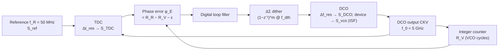

> **β**: This English translation is in beta — the Traditional-Chinese original is the authoritative version.

# All-digital PLL: TDC and DCO quantization noise are the same ISF bookkeeping

> **Prerequisites**: [pll_noise_budget](/06_design_insights/pll_noise_budget) (the five-source budget, the in-band floor $S_{ref}N^2+S_{cp}$, the four-step derivation of the fractional-N ΔΣ third term), [varactor_tuning_supply_pushing](/06_design_insights/varactor_tuning_supply_pushing) (the voltage → frequency → integrate-to-phase pipeline $K_{VCO}^2S_v/\Delta f^2$), [sampling_pll](/06_design_insights/sampling_pll) (the other way of kicking the divider out of the loop) | **Next**: [clock_chain_budget](/06_design_insights/clock_chain_budget), [serdes_clocking_connection](/06_design_insights/serdes_clocking_connection), [exercises](/06_design_insights/exercises)

## What this page answers

The budget table in [pll_noise_budget](/06_design_insights/pll_noise_budget) has five **analog**
noise sources: reference, PFD/charge-pump, divider, loop filter, VCO. Over the past two decades,
however, the mainstream has increasingly become the **ADPLL (all-digital PLL)**: the
"PFD + charge-pump + analog loop filter" is replaced by a **TDC (time-to-digital converter — a
circuit that measures the time difference between two edges as an integer)** plus a digital loop
filter, and the VCO is replaced by a **DCO (digitally controlled oscillator — tuned by a bank of
switched capacitors instead of a continuous varactor voltage)**. This page answers:

1. **How much in-band phase noise does the TDC's finite time resolution $\Delta t_{res}$ become?**
   It is the digital stand-in for the charge-pump's $S_{cp}$, sits in the same slot of the budget
   table, but its magnitude is set by "quantization" rather than by electronic noise.
2. **How much out-of-band phase noise does the DCO's finite frequency resolution $\Delta f_{res}$
   become?** It is the digital stand-in for the VCO and follows the
   [varactor page](/06_design_insights/varactor_tuning_supply_pushing) pipeline
   "frequency error → integrate to phase → $1/\Delta f^2$".
3. **How does ΔΣ dithering shape the DCO LSB away?** This is the $(1-z^{-1})^m$ shaping already
   derived in [pll_noise_budget](/06_design_insights/pll_noise_budget), reused in a new place.
4. **How the budget equation is rewritten**:
   $S_{out}=(S_{ref}N^2+S_{TDC})\lvert H_{lp}\rvert^2+(S_{DCO}+S_{vco})\lvert H_{hp}\rvert^2$,
   and why a 10 ps TDC makes the whole in-band budget lose to an ordinary charge-pump.

> **External-literature statement**: the ADPLL architecture and the two standard formulas for
> TDC and DCO quantization noise are **not in the 5 PDFs downloaded for this site** (external
> literature, not among this site's 5 PDFs). Classic sources: R. B. Staszewski, J. L. Wallberg,
> S. Rezeq, C.-M. Hung, O. E. Eliezer, S. K. Vemulapalli, C. Fernando, K. Maggio,
> R. Staszewski, N. Barton, M.-C. Lee, P. Cruise, M. Entezari, K. Muhammad, and D. Leipold,
> *"All-Digital PLL and Transmitter for Mobile Phones,"* IEEE J. Solid-State Circuits,
> vol. 39, no. 12, pp. 2278–2291, Dec. 2004; R. B. Staszewski and P. T. Balsara,
> *All-Digital Frequency Synthesizer in Deep-Submicron CMOS*, Wiley, 2006 (equation numbers in
> both to be verified). The derivations on this page are **fully self-contained**: both formulas
> are derived step by step from "uniform quantization error → whitening → into the same
> integrator", identical to the site's existing ΔΣ four steps and the varactor pipeline; all
> numbers are marked illustrative.

> **Physical intuition (conclusion first)**: the TDC "rounds" the phase error to the nearest
> $\Delta t_{res}$ and rolls that die once per reference period — this is a **white phase-error
> source sampled at $f_R$**, sitting exactly in the PFD's seat, **low-passed** by the loop and,
> like the reference, an in-band floor; its magnitude depends only on $\Delta t_{res}/T_V$ (the
> quantization step as a fraction of one output period), **independent of $N$**. The DCO rounds
> the control word to the nearest $\Delta f_{res}$ — a **white frequency-error source** sitting
> in the VCO's seat, **high-passed** by the loop; frequency error must be integrated once to
> become phase, so it looks like the VCO's $1/f^2$ skirt but is set by the "quantization step"
> rather than by device noise. Neither newcomer is "electronic noise" — both are **bit counts the
> designer chooses**. The term that ISF theory is responsible for (the DCO's own device noise
> $\Gamma_{rms}^2/q_{max}^2$) is unchanged; it simply gains two quantized neighbours.

## Step 1: ADPLL block diagram and the three noise entry points



Three things first, because the "no $N^2$" below depends entirely on them:

- **Phase in an ADPLL is counted in "VCO cycles".** Every reference period adds the "cycles
  that should have accumulated" $R_R$ (the running sum of the frequency command word, which may
  be fractional); a counter counts how many cycles the DCO actually ran, $R_V$ (an integer); the
  TDC supplies the sub-cycle fraction $\varepsilon=\Delta t/T_V$ ($\Delta t$ is the time from
  the reference edge to the next CKV edge, $T_V=1/f_0$ is the DCO period). The phase error
  $\phi_E=R_R-R_V-\varepsilon$ is in **output cycles**; times $2\pi$ it is rad of output phase —
  this is **the same fact** as "the error is counted in VCO cycles to begin with" in the ΔΣ third
  term of [pll_noise_budget](/06_design_insights/pll_noise_budget), so TDC noise is likewise
  **not multiplied by $N^2$**.
- **No charge-pump, no analog loop filter.** The $S_{cp}$ and $S_{lf}$ terms disappear, replaced
  by the TDC quantization $S_{TDC}$. The digital loop filter itself adds no noise (finite-word-length
  effects are a separate matter).
- **The DCO is controlled by a bank of switched unit capacitors.** The frequency step of the finest
  bank, $\Delta f_{res}$, is the "quantization step"; the DCO's device noise (tank loss, active
  devices) is exactly the VCO's and is still set by the ISF:
  $S_{vco}\propto\Gamma_{rms}^2/q_{max}^2\cdot S_i/f^2$.

## Step 2: TDC quantization → in-band floor (four steps, exactly like the ΔΣ third term)

A TDC quantizes $\Delta t$ into an integer number of $\Delta t_{res}$ using a chain of delay
elements (typically an inverter chain). As long as the phase error is "busy" enough (fractional-N,
or dithered), the quantization error can be treated as white noise. Step by step:

**(i) Uniform quantization error.** The quantization error $e_t$ is uniformly distributed over
$\pm\Delta t_{res}/2$:

$$
\sigma_{t}^2=\frac{\Delta t_{res}^2}{12}\qquad[\text{s}^2].
$$

(The same uniform-distribution formula as $\sigma_e^2=\Delta^2/12$ in the ΔΣ third term, except
that $\Delta$ there is in "cycles" and here it is in "seconds".)

**(ii) Time error → output phase.** One output period $T_V$ corresponds to $2\pi$ rad, so

$$
\phi_{TDC}=2\pi\,\frac{e_t}{T_V}\quad\Longrightarrow\quad
\sigma_\phi^2=\frac{(2\pi)^2}{12}\Big(\frac{\Delta t_{res}}{T_V}\Big)^2\qquad[\text{rad}^2].
$$

This step is where the "**no $N^2$**" lives: $T_V$ is the **output** period, so
$\phi_{TDC}$ is already rad of output phase. If you insist on referring it to the reference side
(dividing by $T_R=NT_V$), you get $\phi/N$, and going back to the output requires $\times N$
(power $\times N^2$) — which cancels exactly. The most common rookie budget mistake is to multiply
it by $N^2$ once more (the same trap as step (iv) of the ΔΣ section in
[pll_noise_budget](/06_design_insights/pll_noise_budget)).

**(iii) Whitening at $f_R$.** The TDC produces one sample per reference period; the white
sequence's power $\sigma_\phi^2$ spreads uniformly over $\pm f_R/2$ (two-sided bookkeeping) →
density $\sigma_\phi^2/f_R$ per Hz:

$$
\mathcal{L}_{TDC}=\frac{(2\pi)^2}{12}\Big(\frac{\Delta t_{res}}{T_V}\Big)^2\frac{1}{f_R},\qquad
S_{TDC}=2\,\mathcal{L}_{TDC}=\frac{(2\pi)^2}{6}\Big(\frac{\Delta t_{res}}{T_V}\Big)^2\frac{1}{f_R}
$$

($S_{TDC}$ in $\text{rad}^2/\text{Hz}$, single-sided, referred to the output, before the loop).
**Factor-of-2 bookkeeping flag (flagged every time)**: the literature's customary $1/12$ version
is **two-sided** bookkeeping, which numerically equals the SSB $\mathcal{L}$ (the $\tfrac12$ in
$\mathcal{L}\approx\tfrac12S_\phi$ cancels the $\times2$ of single-siding); this site's strict
**single-sided** $S_\phi$ convention needs the $\times2$ (giving $1/6$). This is the same class of
factor-of-2 issue as [P1] Eq.(21)'s /4 (SSB bookkeeping) vs the clean time-domain /2, and as the
ΔΣ third term's $1/12$ vs $1/6$.

**(iv) Into the loop.** It sits in the PFD's seat, shares the path of $S_{ref}N^2$ and is
low-passed by the same $\lvert H_{lp}\rvert^2$; for $f\ll f_n$ it is a **flat floor** (white, no
shaping), flat all the way to $f_R/2$. So the TDC is the ADPLL's "in-band floor setter" — just as
the charge-pump is for the analog PLL.

**Dimension check**: $(2\pi)^2$ [rad²] $\times(\Delta t_{res}/T_V)^2$ [s²/s² = dimensionless]
$\times1/f_R$ [s = 1/Hz] $=\text{rad}^2/\text{Hz}$ — checks out.

### Worked example (Example 1: 10 ps and 20 ps TDCs vs the charge-pump floor)

> **Example 1**: $f_0=5$ GHz ($T_V=200$ ps), $f_R=50$ MHz ($N=100$, as in Example 3 of
> [pll_noise_budget](/06_design_insights/pll_noise_budget)). Find $\mathcal{L}_{TDC}$ for
> $\Delta t_{res}=10$ ps and 20 ps, compare with that page's in-band floor of $-121.2$ dBc/Hz, and
> then solve for "how fine must the TDC be to break even with the charge-pump".

**Step-by-step substitution (10 ps):**

1. Quantization step as a fraction of the period: $\Delta t_{res}/T_V=10/200=0.05$; squared
   $2.5\times10^{-3}$ (dimensionless).
2. Prefactor: $(2\pi)^2/12=39.478/12=3.290$ [rad²].
3. Phase variance: $3.290\times2.5\times10^{-3}=8.225\times10^{-3}\ \text{rad}^2$
   ($\sigma_\phi=90.7$ mrad, i.e. $\sigma_t=\Delta t_{res}/\sqrt{12}=2.887$ ps rms).
4. Spread over $f_R$: $8.225\times10^{-3}/(5\times10^7)=1.645\times10^{-10}$ →
   $\mathcal{L}_{TDC}=10\log_{10}(1.645\times10^{-10})=-97.8$ dBc/Hz.
5. 20 ps: $(\Delta t_{res}/T_V)^2$ is 4 times larger ($+6.02$ dB) → $-91.8$ dBc/Hz.

**Result and interpretation:** a 10 ps TDC gives a flat in-band floor of $-97.8$ dBc/Hz,
**23.4 dB above** the analog PLL's $-121.2$ dBc/Hz (reference$\times N^2$ + CP). Solving
backwards: for $\mathcal{L}_{TDC}$ to equal $7.5\times10^{-13}$ (i.e. $-121.2$ dBc/Hz) requires
$\Delta t_{res}=T_V\sqrt{12\,\mathcal{L}\,f_R}/(2\pi)=0.675$ ps — finer than a single inverter
delay in an advanced process (a few ps), unreachable with a plain inverter chain. **This is the
main battlefield of ADPLL literature for the past decade**: (a) push $\Delta t_{res}$ below a
picosecond with interpolation, Vernier, or GRO (gated ring oscillator) techniques; (b) **DTC
assistance** (digital-to-time converter: first shift the reference edge by the "predicted
fractional phase", so the TDC only has to measure a tiny residual → a short, fine, linear TDC
suffices); (c) simply use a **bang-bang PD (1-bit TDC)** — the quantization error is then no
longer uniform white noise but is linearized by the input jitter (the $K_{bb}$ of the bang-bang
CDR in this site's SerDes chapter is exactly that mechanism). All three roads share one goal:
bring the $(\Delta t_{res}/T_V)^2$ term above down to the same order as $S_{ref}N^2$.

**Dimension check**: as above; after $10\log_{10}$ read as dBc/Hz — checks out; the inverse
formula $\text{s}\times\sqrt{[1/\text{Hz}]\cdot[\text{Hz}]}=\text{s}$ — checks out.

```python
import numpy as np
f0, fR = 5e9, 50e6
T_V = 1/f0
for dt_res in (10e-12, 20e-12):
    L_tdc = (2*np.pi)**2/12*(dt_res/T_V)**2/fR
    print(round(dt_res*1e12), "ps", f"{L_tdc:.4e}", round(10*np.log10(L_tdc), 2))
# -> 10 ps 1.6449e-10 -97.84
# -> 20 ps 6.5797e-10 -91.82
sigma_t = 10e-12/np.sqrt(12); sigma_phi = 2*np.pi*sigma_t/T_V
print(round(sigma_t*1e12, 3), round(sigma_phi*1e3, 2), f"{sigma_phi**2/fR:.4e}")
# -> 2.887 90.69 1.6449e-10 (sigma_t ps, sigma_phi mrad, sigma_phi^2/f_R = L_TDC)
L_cp = 0.5*1.5e-12
dt_eq = T_V*np.sqrt(12*L_cp*fR)/(2*np.pi)
print(round(10*np.log10(L_cp), 1), round(dt_eq*1e12, 3), round(10*np.log10(1.6449e-10/L_cp), 1))
# -> -121.2 0.675 23.4 (analog in-band floor ref×N² + CP in dBc/Hz, break-even dt_res ps, excess of the 10 ps TDC in dB)
```

## Step 3: DCO frequency quantization → $1/\Delta f^2$ skirt (varactor pipeline + ZOH)

The DCO control word is updated once per reference period, and its finest bank is
$\Delta f_{res}$. The frequency the loop wants lies between two steps; the DCO can only take the
nearest — the **frequency** quantization error $e_f$ is uniform over $\pm\Delta f_{res}/2$. From
here we follow Step 2 of the [varactor page](/06_design_insights/varactor_tuning_supply_pushing)
exactly, with the entry replaced from "$K_{VCO}v_n$" by "$e_f$":

**(i) Uniform frequency error.** $\sigma_f^2=\Delta f_{res}^2/12$ [Hz²].

**(ii) ZOH (zero-order hold) whitening at $f_R$.** The control word is constant within a
reference period (held for $T_R=1/f_R$), so $e_f(t)$ is "a white sequence at rate $f_R$ through a
ZOH": the power $\sigma_f^2$ spread over $\pm f_R/2$ (two-sided) gives density $\sigma_f^2/f_R$,
and the ZOH's squared magnitude response is $\mathrm{sinc}^2(f/f_R)$
($\mathrm{sinc}(x)=\sin(\pi x)/(\pi x)$):

$$
S_{\Delta f}(f)=\frac{\Delta f_{res}^2}{12}\,\frac{1}{f_R}\,\mathrm{sinc}^2\Big(\frac{f}{f_R}\Big)\qquad[\text{Hz}^2/\text{Hz}].
$$

**(iii) Frequency → phase: the same integrator.** $\phi(t)=2\pi\int^t e_f\,dt'$; in the power
domain multiply by $(2\pi)^2/\Delta\omega^2=1/\Delta f^2$ (varactor page Step 2.3, the $2\pi$
cancels top and bottom):

$$
\mathcal{L}_{DCO}(\Delta f)=\frac{1}{12}\Big(\frac{\Delta f_{res}}{\Delta f}\Big)^2\frac{1}{f_R}\,\mathrm{sinc}^2\Big(\frac{\Delta f}{f_R}\Big),\qquad
S_{DCO}=2\,\mathcal{L}_{DCO}
$$

(same factor-of-2 flag: $1/12$ is the two-sided reading = the SSB number; this site's single-sided
$S_\phi$ needs $\times2$.)

**(iv) Into the loop.** It sits in the VCO's seat and is **high-passed** by
$\lvert H_{hp}\rvert^2$ — inside $f_n$ the loop corrects it away (just as it corrects the VCO's
close-in drift), outside $f_n$ it leaks out unchanged. Shape: for $\Delta f\ll f_R$,
$\mathrm{sinc}^2\approx1$ and $\mathcal{L}_{DCO}\propto1/\Delta f^2$ — **20 dB down per
decade**, the same slope as the VCO's white-noise $1/f^2$ skirt; near $f_R/2$ the
$\mathrm{sinc}^2$ pushes it down a bit further.

**Dimension check**: $(\Delta f_{res}/\Delta f)^2$ [Hz²/Hz² = dimensionless] $\times1/f_R$
[1/Hz] $\times\mathrm{sinc}^2$ [dimensionless] $=1/\text{Hz}$; phase is dimensionless (rad), so
read as $\text{rad}^2/\text{Hz}$ — checks out (the same unit argument as the varactor page's
$K_{VCO}^2S_v/\Delta f^2$).

**Division of labour with the ISF (the same sentence as the varactor page)**: $\Gamma$ handles
"a current impulse $\Delta q$ hitting the tank at a given phase → how much phase";
$\Delta f_{res}$ handles "a quasi-static frequency step → how much phase after integration". Both
roads converge on the same $1/\Delta\omega^2$ integrator — that is what "the same bookkeeping" in
this page's title means. The ISF has two further appearances inside a DCO: the DCO's own device
noise $S_{vco}$ ($\Gamma_{rms}^2/q_{max}^2$, completely unchanged); and the charge kickback
$\Delta q$ injected into the tank when a unit capacitor switches — the phase at which it lands
($\Gamma(\omega_0\tau)$) decides how much phase jump and spur the dither causes ([P1]
operational definition $\Delta\phi=\Gamma\Delta q/q_{max}$).

### Worked example (Example 2: a DCO with $\Delta f_{res}=10$ kHz)

> **Example 2**: $f_0=5$ GHz, $f_R=50$ MHz, $\Delta f_{res}=10$ kHz (2 ppm). Find
> $\mathcal{L}_{DCO}$ at $\Delta f=0.1$, 1, 10 MHz; convert to the $\Delta C$ of the finest unit
> capacitor (tank $C=1$ pF).

**Step-by-step substitution (1 MHz):**

1. $(\Delta f_{res}/\Delta f)^2=(10^4/10^6)^2=10^{-4}$ (dimensionless).
2. $\times1/12=8.333\times10^{-6}$; $\times1/f_R=8.333\times10^{-6}/(5\times10^7)=1.667\times10^{-13}$.
3. ZOH: $\mathrm{sinc}^2(10^6/5\times10^7)=\mathrm{sinc}^2(0.02)=0.9987$ ($-0.006$ dB, negligible).
4. $\mathcal{L}_{DCO}(1\text{ MHz})=10\log_{10}(1.665\times10^{-13})=-127.8$ dBc/Hz.
5. 0.1 MHz: $\times100$ → $-107.8$; 10 MHz: $\times1/100$ times $\mathrm{sinc}^2(0.2)=0.875$
   ($-0.58$ dB) → $-148.4$ dBc/Hz. $-20$ dB per decade (plus the sinc extra as $\Delta f\to f_R/2$).
6. Unit capacitor: $f_0\propto1/\sqrt{LC}$ → $\Delta f_0/f_0=-\tfrac12\Delta C/C$ →
   $\Delta C=2C\,\Delta f_{res}/f_0=2\times10^{-12}\times10^4/(5\times10^9)=4.0$ aF.

**Result and interpretation:** $-127.8$ dBc/Hz at 1 MHz is 27.8 dB below the lab_20 ring VCO's
$-100$ dBc/Hz — a ring-DCO does not care at all; but it is **20 dB above** the site's canonical
LC value of $-148$ dBc/Hz (Example B): a good LC-DCO would be drowned by its own quantization
noise. And a 4 aF unit capacitor cannot be built physically (parasitics alone are two orders of
magnitude larger) — **so a DCO must be ΔΣ-dithered** (Step 4): a buildable, coarser unit cell
(tens of aF to fF) is toggled at a fast clock to buy fine "average" resolution.

**Dimension check**: $\Delta C=[\text{F}]\times[\text{Hz}]/[\text{Hz}]=\text{F}$ — checks out.

```python
import numpy as np
f0, fR, df_res, C = 5e9, 50e6, 10e3, 1e-12
for df in (1e5, 1e6, 1e7):
    L_dco = (1/12)*(df_res/df)**2/fR*np.sinc(df/fR)**2
    print(round(df/1e6, 1), f"{L_dco:.4e}", round(10*np.log10(L_dco), 2), round(10*np.log10(np.sinc(df/fR)**2), 2))
# -> 0.1 1.6666e-11 -107.78 -0.0
# -> 1.0 1.6645e-13 -127.79 -0.01
# -> 10.0 1.4586e-15 -148.36 -0.58 (MHz, linear, dBc/Hz, sinc^2 correction dB)
print(f"{2*C*df_res/f0*1e18:.1f}")
# -> 4.0 (finest unit capacitor, aF)
```

## Step 4: ΔΣ dithering — shaping the DCO LSB up to high frequency

Recipe: take a dither clock $f_{dth}$ much faster than $f_R$ (usually derived by dividing CKV,
e.g. $f_0/8$), and use an $m$-th-order ΔΣ modulator to turn the "desired fractional frequency"
into a 0/1 sequence for the finest unit cell. The algebra is exactly that of the ΔΣ third term in
[pll_noise_budget](/06_design_insights/pll_noise_budget), except that what is shaped is
**frequency** and the sampling rate is $f_{dth}$:

$$
e_f\ \to\ (1-z^{-1})^m e_f\quad\Longrightarrow\quad
S_{\Delta f}(f)=\frac{\Delta f_{res}^2}{12}\,\frac{1}{f_{dth}}\Big[2\sin\Big(\frac{\pi f}{f_{dth}}\Big)\Big]^{2m}\mathrm{sinc}^2\Big(\frac{f}{f_{dth}}\Big),
$$

then through the $1/\Delta f^2$ integrator of Step 3:

$$
\mathcal{L}_{DCO,\Delta\Sigma}(\Delta f)=\frac{1}{12}\Big(\frac{\Delta f_{res}}{\Delta f}\Big)^2\frac{1}{f_{dth}}\Big[2\sin\Big(\frac{\pi\Delta f}{f_{dth}}\Big)\Big]^{2m}\mathrm{sinc}^2\Big(\frac{\Delta f}{f_{dth}}\Big).
$$

Three effects stacked together (for $\Delta f\ll f_{dth}$,
$2\sin(\pi\Delta f/f_{dth})\approx2\pi\Delta f/f_{dth}$):

- **$m=0$ (just toggle faster, no shaping)**: the power $\Delta f_{res}^2/12$ is spread over the
  wider $\pm f_{dth}/2$, gaining $10\log_{10}(f_{dth}/f_R)$.
- **$m=1$**: the $+20$ dB/dec shaping exactly cancels the integrator's $-20$ dB/dec →
  $\mathcal{L}$ becomes **flat** in-band, with magnitude $\propto(\Delta f_{res}/f_{dth})^2/f_{dth}$,
  far below the unshaped version.
- **$m=2$**: a net $+20$ dB/dec climb — lower at low frequency, and at high frequency rely on
  $\lvert H_{hp}\rvert^2$? **No**: DCO noise enters the output **high-passed**, so the loop does
  **not** cut it at high frequency; the high-frequency hump of higher-order shaping leaks out
  unchanged and can only be tamed by the sinc and by downstream filtering. This is the **key
  difference** between DCO dither and fractional-N divider dither — the latter is a low-pass path
  where the loop cuts the high end; the former is a high-pass path where the loop does not. Hence
  the DCO side usually uses only first or second order and pushes $f_{dth}$ high.

**Dimension check**: as in Step 3; the extra $[2\sin(\cdot)]^{2m}$ is dimensionless — checks out.

### Worked example (Example 3: first-order dither at $f_0/8$)

> **Example 3**: continuing Example 2, $f_{dth}=f_0/8=625$ MHz; find
> $\mathcal{L}_{DCO,\Delta\Sigma}$ at $\Delta f=1$ MHz for $m=0,1,2$.

**Step-by-step substitution:**

1. Spreading: $f_{dth}/f_R=12.5$ → $+10.97$ dB; $m=0$: $-127.8-10.97=-138.8$ dBc/Hz.
2. Shaping factor: $2\sin(\pi\times10^6/6.25\times10^8)=2\sin(5.027\times10^{-3})=1.0053\times10^{-2}$;
   squared $1.011\times10^{-4}$ ($-40.0$ dB) → $m=1$: $-178.7$ dBc/Hz.
3. $m=2$: another $-40$ dB → $-218.7$ dBc/Hz (already far below any physical floor; in practice
   covered by the DCO's device noise, the dither clock's own jitter and kickback spurs — the
   formula only accounts for the "quantization" share).

**Result and interpretation:** first-order dither alone takes $-127.8$ down to $-178.7$ dBc/Hz
($-50.9$ dB), and the LC-DCO's $-148$ is once again the main actor. The price: the unit cell
switches every 1.6 ns, and each switching event is a $\Delta q$ hitting the tank — the ISF says the
phase at which it lands decides how much the phase jumps
($\Delta\phi=\Gamma(\omega_0\tau)\Delta q/q_{max}$); when $f_{dth}$ is synchronous with $f_0$
these jumps repeat at fixed phases, one of the sources of spurs.

```python
import numpy as np
f0, df_res, df = 5e9, 10e3, 1e6
f_dth = f0/8
for m in (0, 1, 2):
    L = (1/12)*(df_res/df)**2/f_dth*(2*np.sin(np.pi*df/f_dth))**(2*m)*np.sinc(df/f_dth)**2
    print(m, f"{L:.4e}", round(10*np.log10(L), 1))
# -> 0 1.3333e-14 -138.8
# -> 1 1.3475e-18 -178.7
# -> 2 1.3618e-22 -218.7 (m, linear, dBc/Hz at 1 MHz)
print(round(f_dth/1e6, 1), round(10*np.log10(f_dth/50e6), 2))
# -> 625.0 10.97 (f_dth MHz, spreading bonus dB)
```

## Step 5: the ADPLL budget equation and a worked example

Putting the two new sources into the framework of
[pll_noise_budget](/06_design_insights/pll_noise_budget):

$$
S_{out}(f)=\big(S_{ref}N^2+S_{TDC}\big)\lvert H_{lp}\rvert^2+\big(S_{DCO}+S_{vco}\big)\lvert H_{hp}\rvert^2 .
$$

- $S_{TDC}$ replaces $S_{cp}$ (same seat, same low-pass, same "no $N^2$"); $S_{DCO}$ sits
  beside $S_{vco}$ (same seat, same high-pass). The fractional-N ΔΣ third term **does not exist**
  in an ADPLL — the fractional frequency is handled directly by the fractional accumulation of
  $R_R$, with no divider dithering; but TDC **nonlinearity** turns the periodic pattern of the
  fractional part of $R_R$ into fractional spurs (see applicability and failure).
- $\lvert H_{lp}\rvert^2,\lvert H_{hp}\rvert^2$ are the type-II second-order closed loop of spec
  §10.2 (the digital loop filter's $z$-domain implementation agrees with its continuous-time
  approximation for $f\ll f_R$).

> **Example 4**: use the lab_20 $S_{ref}$ and $S_{vco}$ of
> [pll_noise_budget](/06_design_insights/pll_noise_budget) (ring toy,
> $\mathcal{L}_{vco}(1\text{ MHz})=-100$ dBc/Hz), $N=100$, $\zeta=0.707$, plus the $S_{TDC}$ of
> Example 1 (10 ps and 1 ps) and the $S_{DCO}$ of Example 2 (undithered). (a) Spot value at
> $\Delta f=1$ MHz with $f_n=1$ MHz; (b) integrated jitter (1 kHz–1 GHz) at $f_n=6.9$ MHz (the
> analog optimum); (c) the ADPLL's own optimum $f_n$.

**Step by step (spot, 10 ps):**

1. In-band term: $S_{ref}N^2=10^{-12}$, $S_{TDC}=2\times1.645\times10^{-10}=3.29\times10^{-10}$
   (single-sided); $\lvert H_{lp}(1\text{ MHz})\rvert^2=1.50$ (peaking) → $4.95\times10^{-10}$.
2. Out-of-band term: $S_{DCO}=2\times1.665\times10^{-13}=3.33\times10^{-13}$, $S_{vco}=2\times10^{-10}$;
   $\lvert H_{hp}\rvert^2=0.50$ → $1.00\times10^{-10}$.
3. Total $5.95\times10^{-10}$ → $\mathcal{L}=10\log_{10}(\tfrac12\times5.95\times10^{-10})=-95.3$ dBc/Hz.
   **The TDC term alone is 83%** — it even buries the ring VCO.
4. 1 ps: $S_{TDC}$ drops 100× → in-band $6.4\times10^{-12}$, the total is VCO-dominated →
   $-102.7$ dBc/Hz.

**Result (integrated jitter):**

| Architecture | $f_n$ | $\sigma_t$ | Reading |
|---|---|---|---|
| Analog CP-PLL ($S_{cp}=5\times10^{-13}$) | 6.9 MHz | 259 fs | pll_noise_budget optimum |
| ADPLL, $\Delta t_{res}=10$ ps | 6.9 MHz | 2773 fs | the TDC floor is fully passed by the wide BW |
| ADPLL, $\Delta t_{res}=10$ ps | 0.47 MHz (its own optimum) | 1001 fs | can only narrow the BW, then the VCO leaks: $3.9\times$ the analog value |
| ADPLL, $\Delta t_{res}=1$ ps | 6.9 MHz | 363 fs | close to the analog value |
| ADPLL, $\Delta t_{res}=1$ ps | 3.84 MHz (its own optimum) | 338 fs | optimum BW slightly narrower (TDC floor still 3.4 dB above the analog in-band floor of $-121.2$) |

**Interpretation:** this is the numerical version of "why an ADPLL needs a fine TDC / DTC
assistance / BB-PD". A 10 ps TDC pushes the optimum jitter from 259 fs to 1 ps and forces you to
narrow the BW by 15× — a disaster for a noisy ring-DCO; only a 1 ps TDC returns to the same
order of magnitude. Conversely, the (undithered) $S_{DCO}$ is invisible in this ring toy (28 dB
lower); it only surfaces with an LC-DCO, and that is when the dither of Step 4 is needed.

**Dimension check**: $\int S_{out}\,df$ [rad²] → $\sigma_\phi/(2\pi f_0)$: rad/(rad/s) = s —
checks out.

```python
import numpy as np
from simulations.common.pll_utils import H_lowpass_mag2, H_highpass_mag2
f0, fR, N = 5e9, 50e6, 100
T_V = 1/f0
f = np.logspace(3, 9, 3000)
S_ref = 1e-16 + 1e-18*(1e6/f)                       # same table as pll_noise_budget
S_vco = 2e-10*(1e6/f)**2                            # ring toy, L(1 MHz) = -100 dBc/Hz
S_dco = 2*(1/12)*(1e4/f)**2/fR*np.sinc(f/fR)**2     # single-sided = 2 L_DCO
def S_tdc(dt_res):
    return 2*(2*np.pi)**2/12*(dt_res/T_V)**2/fR     # single-sided = 2 L_TDC
def sigma_t(S_out):
    return np.sqrt(np.trapezoid(S_out, f))/(2*np.pi*f0)
fn = 1e6
lp1, hp1 = H_lowpass_mag2(np.array([1e6]), fn)[0], H_highpass_mag2(np.array([1e6]), fn)[0]
for dt in (10e-12, 1e-12):
    inb = (1e-12 + S_tdc(dt))*lp1
    outb = (S_dco[np.argmin(abs(f-1e6))] + 2e-10)*hp1
    print(round(dt*1e12), f"{inb:.3e}", f"{outb:.3e}", round(10*np.log10(0.5*(inb + outb)), 1))
# -> 10 4.950e-10 1.002e-10 -95.3
# -> 1 6.435e-12 1.002e-10 -102.7 (dt_res ps, in-band, out-of-band rad^2/Hz, L dBc/Hz)
fn = 6.9e6
lp, hp = H_lowpass_mag2(f, fn), H_highpass_mag2(f, fn)
print(round(sigma_t((S_ref*N**2 + 5e-13)*lp + S_vco*hp)*1e15))
# -> 259 (analog CP-PLL, fs)
for dt in (10e-12, 1e-12):
    print(round(dt*1e12), round(sigma_t((S_ref*N**2 + S_tdc(dt))*lp + (S_dco + S_vco)*hp)*1e15))
# -> 10 2773
# -> 1 363 (ADPLL at f_n = 6.9 MHz, fs)
fns = np.logspace(4.5, 7.5, 60)
for dt in (10e-12, 1e-12):
    jit = [sigma_t((S_ref*N**2 + S_tdc(dt))*H_lowpass_mag2(f, x) + (S_dco + S_vco)*H_highpass_mag2(f, x)) for x in fns]
    k = int(np.argmin(jit))
    print(round(dt*1e12), round(fns[k]/1e6, 2), round(jit[k]*1e15))
# -> 10 0.47 1001
# -> 1 3.84 338 (ADPLL's own optimum f_n MHz, sigma_t fs)
```

## Design knobs

| Knob | Effect | How to adjust |
|---|---|---|
| TDC resolution $\Delta t_{res}$ | in-band floor $\propto(\Delta t_{res}/T_V)^2$ ($-6$ dB per halving) | interpolation, Vernier, GRO; DTC assistance so the TDC only measures a residual; or switch to a BB-PD |
| Output period $T_V$ | the same TDC suffers more at high $f_0$ ($\Delta t_{res}/T_V$ grows) | high-frequency outputs need finer TDCs; or multiply after a lower-frequency DCO (see clock_chain_budget) |
| Reference frequency $f_R$ | $\mathcal{L}_{TDC}\propto1/f_R$, $\mathcal{L}_{DCO}\propto1/f_R$ ($-3$ dB per doubling each) | raising $f_R$ pays on both sides; $N$ shrinks too, lowering $S_{ref}N^2$ |
| DCO resolution $\Delta f_{res}$ | out-of-band $\propto\Delta f_{res}^2/\Delta f^2$ | finer unit cell (limited by parasitics) → must pair with ΔΣ dither |
| Dither clock $f_{dth}$, order $m$ | $m=0$ gains $10\log(f_{dth}/f_R)$; $m=1$ gains $[2\sin]^2$ on top and flattens in-band | push $f_{dth}$ high ($f_0/2^k$); $m$ usually 1–2 (high-pass path, the loop does not cut the high-frequency hump) |
| Loop BW $f_n$ | U-curve of TDC floor vs DCO/VCO leakage (same as analog) | a coarse TDC forces a narrow BW (Example 4: $0.47$ MHz); only a fine TDC allows a wide one |
| DCO device $\Gamma_{rms}/q_{max}$ | $S_{vco}$ (ISF!) | exactly as for a VCO: larger swing, lower $\Gamma_{rms}$, LC instead of ring |
| TDC linearity (DNL/INL) | fractional spurs, noise folding into band | calibration; DTC assistance shrinks the TDC's dynamic range |

## Connection to SerDes

The ADPLL's output $\sigma_t$ (Example 4) feeds the eye diagram and BER of
[serdes_clocking_connection](/06_design_insights/serdes_clocking_connection) exactly as an
analog PLL's does. Two ADPLL-specific reminders: (1) the TDC floor is **flat white noise** all the
way to $f_R/2$, so under a wide BW its contribution to integrated jitter grows linearly
$\propto f_n$ (less "afraid" of narrowing the BW than a $1/f^2$ source, more afraid of widening
it); (2) the **latency** of the digital loop (TDC conversion and digital filtering each take a few
reference periods) reduces phase margin and raises peaking — the "cascaded 0.1 dB" rule of
[pll_noise_budget](/06_design_insights/pll_noise_budget) must include latency in an ADPLL
(external literature, beyond this page). The bang-bang CDR in a SerDes is in fact an ADPLL with a
"1-bit TDC": the BB-PD linearized gain $K_{bb}$ mentioned in Example 1 is that road.

## Applicability and failure conditions

| Condition | When it holds | When it fails |
|---|---|---|
| TDC quantization error white and uniform | phase error "busy" (fractional, or dithered) → the flat floor above | **integer-N and locked**: the TDC input barely changes → the error is a constant / short-period pattern, not white (dead-zone-like behaviour, limit cycle); dither must be injected |
| TDC linear (small DNL/INL) | only the quantization share | nonlinearity turns the periodic pattern of the fractional part of $R_R$ into fractional spurs and folds high-frequency noise in-band |
| TDC dynamic range $\ge T_V$ | one TDC stage suffices ($T_V/\Delta t_{res}=20$ cells at 10 ps) | insufficient range → a DTC pre-shifts the reference edge, or coarse/fine two-stage TDC |
| DCO quantization error white | control word "busy" (dithered or fractional) | a static control word → neither noise nor averaging: the frequency parks on one step (static frequency error $\le\Delta f_{res}/2$ absorbed by the loop integrator) |
| Dither is a high-pass path | $m\le2$, high $f_{dth}$ → the high-frequency hump is held down by the sinc | high $m$ or low $f_{dth}$ → the hump leaks out unchanged (the loop does **not** cut it); the dither clock's jitter and kickback spurs are separate |
| Linear small-signal loop, $f_n\ll f_R$ | the type-II continuous-time $\lvert H\rvert^2$ approximation holds | $f_n$ approaching $f_R/10$ or above, or large digital latency → $z$-domain analysis, higher peaking |
| Illustrative numbers | structural conclusions (TDC sets in-band, DCO follows $1/f^2$, no $N^2$) are trustworthy | absolute dB values must **not** be benchmarked against any real process or published measurement |

## Key takeaways

- An ADPLL replaces PFD/CP with a TDC and the VCO with a DCO; phase is counted in VCO cycles,
  $\phi_E=R_R-R_V-\varepsilon$.
- **TDC quantization = in-band white floor** (PFD seat, low-pass, **no $N^2$**):
  $\mathcal{L}_{TDC}=\dfrac{(2\pi)^2}{12}\Big(\dfrac{\Delta t_{res}}{T_V}\Big)^2\dfrac{1}{f_R}$
  (two-sided reading = SSB number; this site's single-sided $S_\phi$ needs $\times2$).
  $f_0=5$ GHz, $f_R=50$ MHz: 10 ps → $-97.8$, 20 ps → $-91.8$ dBc/Hz; breaking even with the
  analog in-band floor of $-121.2$ (ref×N² + CP) needs $0.675$ ps.
- **DCO quantization = white frequency noise through a ZOH → integrate → $1/\Delta f^2$ skirt**
  (VCO seat, high-pass):
  $\mathcal{L}_{DCO}=\dfrac{1}{12}\Big(\dfrac{\Delta f_{res}}{\Delta f}\Big)^2\dfrac{1}{f_R}\mathrm{sinc}^2\Big(\dfrac{\Delta f}{f_R}\Big)$;
  10 kHz at 1 MHz → $-127.8$ dBc/Hz, $-20$ dB per decade; corresponds to $\Delta C=4$ aF
  (unbuildable → dither).
- **ΔΣ dither**: the same $(1-z^{-1})^m$ with the sampling rate swapped for $f_{dth}$; $m=1$ lets
  the $+20$ shaping cancel the $-20$ integration → flat in-band; example: $f_0/8$, $m=1$ →
  $-178.7$ dBc/Hz ($-50.9$ dB). **The DCO path is high-pass, the loop does not cut the
  high-frequency hump** — the key difference from fractional-N divider dither.
- Budget: $S_{out}=(S_{ref}N^2+S_{TDC})\lvert H_{lp}\rvert^2+(S_{DCO}+S_{vco})\lvert H_{hp}\rvert^2$;
  Example 4: a 10 ps TDC pushes the optimum $\sigma_t$ from 259 fs to 1001 fs and narrows the BW
  to 0.47 MHz; only 1 ps returns to 338 fs — the raison d'être of fine TDCs / DTC assistance /
  BB-PDs.
- The ISF term ($S_{vco}\propto\Gamma_{rms}^2/q_{max}^2$) is **unchanged, word for word**, inside a
  DCO; the ISF additionally decides how much spur the dither switching kickback $\Delta q$ causes
  depending on the phase at which it lands.
- Every time you write $1/12$, flag it: that is two-sided bookkeeping = the SSB number; this
  site's single-sided $S_\phi$ is $1/6$.

## Further reading

- The original five-source budget, optimum BW, ΔΣ four steps and "no $N^2$": [pll_noise_budget](/06_design_insights/pll_noise_budget)
- The original "frequency error → integrate → $1/\Delta f^2$" pipeline: [varactor_tuning_supply_pushing](/06_design_insights/varactor_tuning_supply_pushing)
- The other way of kicking the divider/CP out of the loop: [sampling_pll](/06_design_insights/sampling_pll)
- Phase bookkeeping for ×N/÷N (why "$T_V$ is the output period" means no $N^2$): [clock_chain_budget](/06_design_insights/clock_chain_budget)
- Where the DCO device-noise term comes from: [white_noise_to_phase_noise](/03_isf_core_theory/white_noise_to_phase_noise), [lc_vs_ring](/06_design_insights/lc_vs_ring)
- Feeding $\sigma_t$ into eye/BER: [serdes_clocking_connection](/06_design_insights/serdes_clocking_connection)
- Spurs vs random PN: [measurement_and_spurs](/06_design_insights/measurement_and_spurs)

## External literature (not among the 5 downloaded PDFs)

- R. B. Staszewski, J. L. Wallberg, S. Rezeq, C.-M. Hung, O. E. Eliezer, S. K. Vemulapalli,
  C. Fernando, K. Maggio, R. Staszewski, N. Barton, M.-C. Lee, P. Cruise, M. Entezari,
  K. Muhammad, and D. Leipold, *"All-Digital PLL and Transmitter for Mobile Phones,"*
  IEEE J. Solid-State Circuits, vol. 39, no. 12, pp. 2278–2291, Dec. 2004. (Original source of
  the TDC and DCO quantization-noise formulas; equation numbers to be verified.)
- R. B. Staszewski and P. T. Balsara, *All-Digital Frequency Synthesizer in Deep-Submicron
  CMOS*, Wiley, 2006. (ADPLL textbook; chapter and equation numbers to be verified.)
- T. A. D. Riley, M. A. Copeland, and T. A. Kwasniewski, "Delta-Sigma Modulation in
  Fractional-N Frequency Synthesis," IEEE J. Solid-State Circuits, vol. 28, no. 5,
  pp. 553–559, May 1993. (Classic source of the $(1-z^{-1})^m$ shaping, already cited in pll_noise_budget.)
- DTC assistance, GRO-TDC, bang-bang ADPLLs and later developments: to be verified (this page uses only their structural conclusions and cites no specific numbers).
