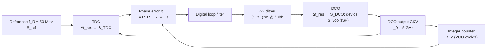

> **β**: This English translation is in beta — the Traditional-Chinese original is the authoritative version.

# All-digital PLL: TDC and DCO quantization noise are the same ISF bookkeeping

> **Prerequisites**: [pll_noise_budget](/06_design_insights/pll_noise_budget) (the five-source budget, the in-band floor $S_{ref}N^2+S_{cp}$, the four-step derivation of the fractional-N ΔΣ third term), [varactor_tuning_supply_pushing](/06_design_insights/varactor_tuning_supply_pushing) (the voltage → frequency → integrate-to-phase pipeline $K_{VCO}^2S_v/\Delta f^2$), [sampling_pll](/06_design_insights/sampling_pll) (the other way of kicking the divider out of the loop) | **Next**: [clock_chain_budget](/06_design_insights/clock_chain_budget), [serdes_clocking_connection](/06_design_insights/serdes_clocking_connection), [exercises](/06_design_insights/exercises)

## What this page answers

The budget table in [pll_noise_budget](/06_design_insights/pll_noise_budget) has five **analog**
noise sources: reference, PFD/charge-pump, divider, loop filter, VCO. Over the past two decades,
however, the mainstream has increasingly become the **ADPLL (all-digital PLL)**: the
"PFD + charge-pump + analog loop filter" is replaced by a **TDC (time-to-digital converter — a
circuit that measures the time difference between two edges as an integer)** plus a digital loop
filter, and the VCO is replaced by a **DCO (digitally controlled oscillator — tuned by a bank of
switched capacitors instead of a continuous varactor voltage)**. This page answers:

1. **How much in-band phase noise does the TDC's finite time resolution $\Delta t_{res}$ become?**
   It is the digital stand-in for the charge-pump's $S_{cp}$, sits in the same slot of the budget
   table, but its magnitude is set by "quantization" rather than by electronic noise.
2. **How much out-of-band phase noise does the DCO's finite frequency resolution $\Delta f_{res}$
   become?** It is the digital stand-in for the VCO and follows the
   [varactor page](/06_design_insights/varactor_tuning_supply_pushing) pipeline
   "frequency error → integrate to phase → $1/\Delta f^2$".
3. **How does ΔΣ dithering shape the DCO LSB away?** This is the $(1-z^{-1})^m$ shaping already
   derived in [pll_noise_budget](/06_design_insights/pll_noise_budget), reused in a new place.
4. **How the budget equation is rewritten**:
   $S_{out}=(S_{ref}N^2+S_{TDC})\lvert H_{lp}\rvert^2+(S_{DCO}+S_{vco})\lvert H_{hp}\rvert^2$,
   and why a 10 ps TDC makes the whole in-band budget lose to an ordinary charge-pump.

> **External-literature statement**: the ADPLL architecture and the two standard formulas for
> TDC and DCO quantization noise are **not in the 5 PDFs downloaded for this site** (external
> literature, not among this site's 5 PDFs). Classic sources: R. B. Staszewski, J. L. Wallberg,
> S. Rezeq, C.-M. Hung, O. E. Eliezer, S. K. Vemulapalli, C. Fernando, K. Maggio,
> R. Staszewski, N. Barton, M.-C. Lee, P. Cruise, M. Entezari, K. Muhammad, and D. Leipold,
> *"All-Digital PLL and Transmitter for Mobile Phones,"* IEEE J. Solid-State Circuits,
> vol. 40, no. 12, pp. 2469–2482, Dec. 2005, doi:10.1109/JSSC.2005.857417; R. B. Staszewski and P. T. Balsara,
> *All-Digital Frequency Synthesizer in Deep-Submicron CMOS*, Wiley, 2006 (equation numbers in
> both to be verified). The derivations on this page are **fully self-contained**: both formulas
> are derived step by step from "uniform quantization error → whitening → into the same
> integrator", identical to the site's existing ΔΣ four steps and the varactor pipeline; all
> numbers are marked illustrative.

> **Physical intuition (conclusion first)**: the TDC "rounds" the phase error to the nearest
> $\Delta t_{res}$ and rolls that die once per reference period — this is a **white phase-error
> source sampled at $f_R$**, sitting exactly in the PFD's seat, **low-passed** by the loop and,
> like the reference, an in-band floor; its magnitude depends only on $\Delta t_{res}/T_V$ (the
> quantization step as a fraction of one output period), **independent of $N$**. The DCO rounds
> the control word to the nearest $\Delta f_{res}$ — a **white frequency-error source** sitting
> in the VCO's seat, **high-passed** by the loop; frequency error must be integrated once to
> become phase, so it looks like the VCO's $1/f^2$ skirt but is set by the "quantization step"
> rather than by device noise. Neither newcomer is "electronic noise" — both are **bit counts the
> designer chooses**. The term that ISF theory is responsible for (the DCO's own device noise
> $\Gamma_{rms}^2/q_{max}^2$) is unchanged; it simply gains two quantized neighbours.

## Step 1: ADPLL block diagram and the three noise entry points


```mermaid
flowchart LR
  REF["Reference f_R = 50 MHz<br/>S_ref"] --> TDC["TDC<br/>Δt_res → S_TDC"]
  CKV["DCO output CKV<br/>f_0 = 5 GHz"] --> TDC
  CKV --> CNT["Integer counter<br/>R_V (VCO cycles)"]
  TDC --> PD["Phase error φ_E<br/>= R_R − R_V − ε"]
  CNT --> PD
  PD --> DLF["Digital loop filter"]
  DLF --> DSM["ΔΣ dither<br/>(1−z⁻¹)^m @ f_dth"]
  DSM --> DCO["DCO<br/>Δf_res → S_DCO; device → S_vco (ISF)"]
  DCO --> CKV
```

Three things first, because the "no $N^2$" below depends entirely on them:

- **Phase in an ADPLL is counted in "VCO cycles".** Every reference period adds the "cycles
  that should have accumulated" $R_R$ (the running sum of the frequency command word, which may
  be fractional); a counter counts how many cycles the DCO actually ran, $R_V$ (an integer); the
  TDC supplies the sub-cycle fraction $\varepsilon=\Delta t/T_V$ ($\Delta t$ is the time from
  the reference edge to the next CKV edge, $T_V=1/f_0$ is the DCO period). The phase error
  $\phi_E=R_R-R_V-\varepsilon$ is in **output cycles**; times $2\pi$ it is rad of output phase —
  this is **the same fact** as "the error is counted in VCO cycles to begin with" in the ΔΣ third
  term of [pll_noise_budget](/06_design_insights/pll_noise_budget), so TDC noise is likewise
  **not multiplied by $N^2$**.
- **No charge-pump, no analog loop filter.** The $S_{cp}$ and $S_{lf}$ terms disappear, replaced
  by the TDC quantization $S_{TDC}$. The digital loop filter itself adds no noise (finite-word-length
  effects are a separate matter).
- **The DCO is controlled by a bank of switched unit capacitors.** The frequency step of the finest
  bank, $\Delta f_{res}$, is the "quantization step"; the DCO's device noise (tank loss, active
  devices) is exactly the VCO's and is still set by the ISF:
  $S_{vco}\propto\Gamma_{rms}^2/q_{max}^2\cdot S_i/f^2$.

## Step 2: TDC quantization → in-band floor (four steps, exactly like the ΔΣ third term)

A TDC quantizes $\Delta t$ into an integer number of $\Delta t_{res}$ using a chain of delay
elements (typically an inverter chain). As long as the phase error is "busy" enough (fractional-N,
or dithered), the quantization error can be treated as white noise (the concrete threshold for
"busy enough", and what it looks like when it fails, are in the "Numerical verification" section
below). Step by step:

**(i) Uniform quantization error.** The quantization error $e_t$ is uniformly distributed over
$\pm\Delta t_{res}/2$:

$$
\sigma_{t}^2=\frac{\Delta t_{res}^2}{12}\qquad[\text{s}^2].
$$

(The same uniform-distribution formula as $\sigma_e^2=\Delta^2/12$ in the ΔΣ third term, except
that $\Delta$ there is in "cycles" and here it is in "seconds".)

**(ii) Time error → output phase.** One output period $T_V$ corresponds to $2\pi$ rad, so

$$
\phi_{TDC}=2\pi\,\frac{e_t}{T_V}\quad\Longrightarrow\quad
\sigma_\phi^2=\frac{(2\pi)^2}{12}\Big(\frac{\Delta t_{res}}{T_V}\Big)^2\qquad[\text{rad}^2].
$$

This step is where the "**no $N^2$**" lives: $T_V$ is the **output** period, so
$\phi_{TDC}$ is already rad of output phase. If you insist on referring it to the reference side
(dividing by $T_R=NT_V$), you get $\phi/N$, and going back to the output requires $\times N$
(power $\times N^2$) — which cancels exactly. The most common rookie budget mistake is to multiply
it by $N^2$ once more (the same trap as step (iv) of the ΔΣ section in
[pll_noise_budget](/06_design_insights/pll_noise_budget)).

**(iii) Whitening at $f_R$.** The TDC produces one sample per reference period; the white
sequence's power $\sigma_\phi^2$ spreads uniformly over $\pm f_R/2$ (two-sided bookkeeping) →
density $\sigma_\phi^2/f_R$ per Hz:

$$
\mathcal{L}_{TDC}=\frac{(2\pi)^2}{12}\Big(\frac{\Delta t_{res}}{T_V}\Big)^2\frac{1}{f_R},\qquad
S_{TDC}=2\,\mathcal{L}_{TDC}=\frac{(2\pi)^2}{6}\Big(\frac{\Delta t_{res}}{T_V}\Big)^2\frac{1}{f_R}
$$

($S_{TDC}$ in $\text{rad}^2/\text{Hz}$, single-sided, referred to the output, before the loop).
**Factor-of-2 bookkeeping flag (flagged every time)**: the literature's customary $1/12$ version
is **two-sided** bookkeeping, which numerically equals the SSB $\mathcal{L}$ (the $\tfrac12$ in
$\mathcal{L}\approx\tfrac12S_\phi$ cancels the $\times2$ of single-siding); this site's strict
**single-sided** $S_\phi$ convention needs the $\times2$ (giving $1/6$). This is the same class of
factor-of-2 issue as [P1] Eq.(21)'s /4 (SSB bookkeeping) vs the clean time-domain /2, and as the
ΔΣ third term's $1/12$ vs $1/6$.

**(iv) Into the loop.** It sits in the PFD's seat, shares the path of $S_{ref}N^2$ and is
low-passed by the same $\lvert H_{lp}\rvert^2$; for $f\ll f_n$ it is a **flat floor** (white, no
shaping), flat all the way to $f_R/2$. So the TDC is the ADPLL's "in-band floor setter" — just as
the charge-pump is for the analog PLL.

**Dimension check**: $(2\pi)^2$ [rad²] $\times(\Delta t_{res}/T_V)^2$ [s²/s² = dimensionless]
$\times1/f_R$ [s = 1/Hz] $=\text{rad}^2/\text{Hz}$ — checks out.

### Worked example (Example 1: 10 ps and 20 ps TDCs vs the charge-pump floor)

> **Example 1**: $f_0=5$ GHz ($T_V=200$ ps), $f_R=50$ MHz ($N=100$, as in Example 3 of
> [pll_noise_budget](/06_design_insights/pll_noise_budget)). Find $\mathcal{L}_{TDC}$ for
> $\Delta t_{res}=10$ ps and 20 ps, compare with that page's in-band floor of $-121.2$ dBc/Hz, and
> then solve for "how fine must the TDC be to break even with the charge-pump".

**Step-by-step substitution (10 ps):**

1. Quantization step as a fraction of the period: $\Delta t_{res}/T_V=10/200=0.05$; squared
   $2.5\times10^{-3}$ (dimensionless).
2. Prefactor: $(2\pi)^2/12=39.478/12=3.290$ [rad²].
3. Phase variance: $3.290\times2.5\times10^{-3}=8.225\times10^{-3}\ \text{rad}^2$
   ($\sigma_\phi=90.7$ mrad, i.e. $\sigma_t=\Delta t_{res}/\sqrt{12}=2.887$ ps rms).
4. Spread over $f_R$: $8.225\times10^{-3}/(5\times10^7)=1.645\times10^{-10}$ →
   $\mathcal{L}_{TDC}=10\log_{10}(1.645\times10^{-10})=-97.8$ dBc/Hz.
5. 20 ps: $(\Delta t_{res}/T_V)^2$ is 4 times larger ($+6.02$ dB) → $-91.8$ dBc/Hz.

**Result and interpretation:** a 10 ps TDC gives a flat in-band floor of $-97.8$ dBc/Hz,
**23.4 dB above** the analog PLL's $-121.2$ dBc/Hz (reference$\times N^2$ + CP). Solving
backwards: for $\mathcal{L}_{TDC}$ to equal $7.5\times10^{-13}$ (i.e. $-121.2$ dBc/Hz) requires
$\Delta t_{res}=T_V\sqrt{12\,\mathcal{L}\,f_R}/(2\pi)=0.675$ ps — finer than a single inverter
delay in an advanced process (a few ps), unreachable with a plain inverter chain. **This is the
main battlefield of ADPLL literature for the past decade**: (a) push $\Delta t_{res}$ below a
picosecond with interpolation, Vernier, or GRO (gated ring oscillator) techniques; (b) **DTC
assistance** (digital-to-time converter: first shift the reference edge by the "predicted
fractional phase", so the TDC only has to measure a tiny residual → a short, fine, linear TDC
suffices); (c) simply use a **bang-bang PD (1-bit TDC)** — the quantization error is then no
longer uniform white noise but is linearized by the input jitter (the $K_{bb}$ of the bang-bang
CDR in this site's SerDes chapter is exactly that mechanism). All three roads share one goal:
bring the $(\Delta t_{res}/T_V)^2$ term above down to the same order as $S_{ref}N^2$.

**Dimension check**: as above; after $10\log_{10}$ read as dBc/Hz — checks out; the inverse
formula $\text{s}\times\sqrt{[1/\text{Hz}]\cdot[\text{Hz}]}=\text{s}$ — checks out.

```python
import numpy as np
f0, fR = 5e9, 50e6
T_V = 1/f0
for dt_res in (10e-12, 20e-12):
    L_tdc = (2*np.pi)**2/12*(dt_res/T_V)**2/fR
    print(round(dt_res*1e12), "ps", f"{L_tdc:.4e}", round(10*np.log10(L_tdc), 2))
# -> 10 ps 1.6449e-10 -97.84
# -> 20 ps 6.5797e-10 -91.82
sigma_t = 10e-12/np.sqrt(12); sigma_phi = 2*np.pi*sigma_t/T_V
print(round(sigma_t*1e12, 3), round(sigma_phi*1e3, 2), f"{sigma_phi**2/fR:.4e}")
# -> 2.887 90.69 1.6449e-10 (sigma_t ps, sigma_phi mrad, sigma_phi^2/f_R = L_TDC)
L_cp = 0.5*1.5e-12
dt_eq = T_V*np.sqrt(12*L_cp*fR)/(2*np.pi)
print(round(10*np.log10(L_cp), 1), round(dt_eq*1e12, 3), round(10*np.log10(1.6449e-10/L_cp), 1))
# -> -121.2 0.675 23.4 (analog in-band floor ref×N² + CP in dBc/Hz, break-even dt_res ps, excess of the 10 ps TDC in dB)
```

## Step 3: DCO frequency quantization → $1/\Delta f^2$ skirt (varactor pipeline + ZOH)

The DCO control word is updated once per reference period, and its finest bank is
$\Delta f_{res}$. The frequency the loop wants lies between two steps; the DCO can only take the
nearest — the **frequency** quantization error $e_f$ is uniform over $\pm\Delta f_{res}/2$. From
here we follow Step 2 of the [varactor page](/06_design_insights/varactor_tuning_supply_pushing)
exactly, with the entry replaced from "$K_{VCO}v_n$" by "$e_f$":

**(i) Uniform frequency error.** $\sigma_f^2=\Delta f_{res}^2/12$ [Hz²].

**(ii) ZOH (zero-order hold) whitening at $f_R$.** The control word is constant within a
reference period (held for $T_R=1/f_R$), so $e_f(t)$ is "a white sequence at rate $f_R$ through a
ZOH": the power $\sigma_f^2$ spread over $\pm f_R/2$ (two-sided) gives density $\sigma_f^2/f_R$,
and the ZOH's squared magnitude response is $\mathrm{sinc}^2(f/f_R)$
($\mathrm{sinc}(x)=\sin(\pi x)/(\pi x)$):

$$
S_{\Delta f}(f)=\frac{\Delta f_{res}^2}{12}\,\frac{1}{f_R}\,\mathrm{sinc}^2\Big(\frac{f}{f_R}\Big)\qquad[\text{Hz}^2/\text{Hz}].
$$

**(iii) Frequency → phase: the same integrator.** $\phi(t)=2\pi\int^t e_f\,dt'$; in the power
domain multiply by $(2\pi)^2/\Delta\omega^2=1/\Delta f^2$ (varactor page Step 2.3, the $2\pi$
cancels top and bottom):

$$
\mathcal{L}_{DCO}(\Delta f)=\frac{1}{12}\Big(\frac{\Delta f_{res}}{\Delta f}\Big)^2\frac{1}{f_R}\,\mathrm{sinc}^2\Big(\frac{\Delta f}{f_R}\Big),\qquad
S_{DCO}=2\,\mathcal{L}_{DCO}
$$

(same factor-of-2 flag: $1/12$ is the two-sided reading = the SSB number; this site's single-sided
$S_\phi$ needs $\times2$.)

**(iv) Into the loop.** It sits in the VCO's seat and is **high-passed** by
$\lvert H_{hp}\rvert^2$ — inside $f_n$ the loop corrects it away (just as it corrects the VCO's
close-in drift), outside $f_n$ it leaks out unchanged. Shape: for $\Delta f\ll f_R$,
$\mathrm{sinc}^2\approx1$ and $\mathcal{L}_{DCO}\propto1/\Delta f^2$ — **20 dB down per
decade**, the same slope as the VCO's white-noise $1/f^2$ skirt; near $f_R/2$ the
$\mathrm{sinc}^2$ pushes it down a bit further.

**Dimension check**: $(\Delta f_{res}/\Delta f)^2$ [Hz²/Hz² = dimensionless] $\times1/f_R$
[1/Hz] $\times\mathrm{sinc}^2$ [dimensionless] $=1/\text{Hz}$; phase is dimensionless (rad), so
read as $\text{rad}^2/\text{Hz}$ — checks out (the same unit argument as the varactor page's
$K_{VCO}^2S_v/\Delta f^2$).

**Division of labour with the ISF (the same sentence as the varactor page)**: $\Gamma$ handles
"a current impulse $\Delta q$ hitting the tank at a given phase → how much phase";
$\Delta f_{res}$ handles "a quasi-static frequency step → how much phase after integration". Both
roads converge on the same $1/\Delta\omega^2$ integrator — that is what "the same bookkeeping" in
this page's title means. The ISF has two further appearances inside a DCO: the DCO's own device
noise $S_{vco}$ ($\Gamma_{rms}^2/q_{max}^2$, completely unchanged); and the charge kickback
$\Delta q$ injected into the tank when a unit capacitor switches — the phase at which it lands
($\Gamma(\omega_0\tau)$) decides how much phase jump and spur the dither causes ([P1]
operational definition $\Delta\phi=\Gamma\Delta q/q_{max}$).

### Worked example (Example 2: a DCO with $\Delta f_{res}=10$ kHz)

> **Example 2**: $f_0=5$ GHz, $f_R=50$ MHz, $\Delta f_{res}=10$ kHz (2 ppm). Find
> $\mathcal{L}_{DCO}$ at $\Delta f=0.1$, 1, 10 MHz; convert to the $\Delta C$ of the finest unit
> capacitor (tank $C=1$ pF).

**Step-by-step substitution (1 MHz):**

1. $(\Delta f_{res}/\Delta f)^2=(10^4/10^6)^2=10^{-4}$ (dimensionless).
2. $\times1/12=8.333\times10^{-6}$; $\times1/f_R=8.333\times10^{-6}/(5\times10^7)=1.667\times10^{-13}$.
3. ZOH: $\mathrm{sinc}^2(10^6/5\times10^7)=\mathrm{sinc}^2(0.02)=0.9987$ ($-0.006$ dB, negligible).
4. $\mathcal{L}_{DCO}(1\text{ MHz})=10\log_{10}(1.665\times10^{-13})=-127.8$ dBc/Hz.
5. 0.1 MHz: $\times100$ → $-107.8$; 10 MHz: $\times1/100$ times $\mathrm{sinc}^2(0.2)=0.875$
   ($-0.58$ dB) → $-148.4$ dBc/Hz. $-20$ dB per decade (plus the sinc extra as $\Delta f\to f_R/2$).
6. Unit capacitor: $f_0\propto1/\sqrt{LC}$ → $\Delta f_0/f_0=-\tfrac12\Delta C/C$ →
   $\Delta C=2C\,\Delta f_{res}/f_0=2\times10^{-12}\times10^4/(5\times10^9)=4.0$ aF.

**Result and interpretation:** $-127.8$ dBc/Hz at 1 MHz is 27.8 dB below the lab_20 ring VCO's
$-100$ dBc/Hz — a ring-DCO does not care at all; but it is **20 dB above** the site's canonical
LC value of $-148$ dBc/Hz (Example B): a good LC-DCO would be drowned by its own quantization
noise. And a 4 aF unit capacitor cannot be built physically (parasitics alone are two orders of
magnitude larger) — **so a DCO must be ΔΣ-dithered** (Step 4): a buildable, coarser unit cell
(tens of aF to fF) is toggled at a fast clock to buy fine "average" resolution.

**Dimension check**: $\Delta C=[\text{F}]\times[\text{Hz}]/[\text{Hz}]=\text{F}$ — checks out.

```python
import numpy as np
f0, fR, df_res, C = 5e9, 50e6, 10e3, 1e-12
for df in (1e5, 1e6, 1e7):
    L_dco = (1/12)*(df_res/df)**2/fR*np.sinc(df/fR)**2
    print(round(df/1e6, 1), f"{L_dco:.4e}", round(10*np.log10(L_dco), 2), round(10*np.log10(np.sinc(df/fR)**2), 2))
# -> 0.1 1.6666e-11 -107.78 -0.0
# -> 1.0 1.6645e-13 -127.79 -0.01
# -> 10.0 1.4586e-15 -148.36 -0.58 (MHz, linear, dBc/Hz, sinc^2 correction dB)
print(f"{2*C*df_res/f0*1e18:.1f}")
# -> 4.0 (finest unit capacitor, aF)
```

## Step 4: ΔΣ dithering — shaping the DCO LSB up to high frequency

Recipe: take a dither clock $f_{dth}$ much faster than $f_R$ (usually derived by dividing CKV,
e.g. $f_0/8$), and use an $m$-th-order ΔΣ modulator to turn the "desired fractional frequency"
into an on/off sequence for **one physical unit cell**. First separate two "resolutions" that are
easy to confuse:

- **Unit-cell step $\Delta f_u$**: how far the frequency jumps when the dithered physical capacitor
  toggles once. Use the conversion of Example 2, $\Delta f_u=f_0\,\Delta C_u/(2C)$ [Hz]. This is
  one step of the modulator **output**.
- **Averaged (effective) resolution $\Delta f_{eff}=\Delta f_u/2^{W}$**: a $W$-bit fractional
  control word lets the **duty** of the unit cell be trimmed finely, so the long-term average
  frequency can sit on a grid of $\Delta f_u/2^W$. It only decides "how accurately the average
  frequency can be placed" (the static frequency error); it **does not enter the noise formula**.

The shaped noise power is set by the **step of the modulator output**, i.e. $\Delta f_u$ — not by
the averaged $\Delta f_{eff}$. The reason is direct: in any one clock period the unit cell is
either fully on or fully off, so the instantaneous frequency error is of order $\Delta f_u$; the ΔΣ
modulator does not make this error smaller, it only **moves its spectrum to high frequency**.

**Step-by-step derivation (external literature, not among this site's 5 PDFs; the algebra is that
of the ΔΣ third term in [pll_noise_budget](/06_design_insights/pll_noise_budget), except that what
is shaped is frequency and the sampling rate is $f_{dth}$):**

**(i) Modulator output and error.** The input $x[k]$ is the desired fraction (unit: cell,
$0\le x\lt1$) and the output $v[k]$ is an integer number of cells. An $m$-th-order modulator
satisfies $v=x+(1-z^{-1})^m e$, where $e$ is the quantizer error, uniformly distributed over
$\pm\tfrac12$ cell in the white-noise model: $\sigma_e^2=1/12$ [cell²].

**(ii) Convert to frequency.** Each cell is worth $\Delta f_u$ [Hz/cell], so the variance of the
frequency error is $\sigma_f^2=\Delta f_u^2/12$ [Hz²].

**(iii) Whitening at $f_{dth}$, shaping, ZOH.** One sample per dither period spreads the power
over $\pm f_{dth}/2$ (two-sided) → density $\sigma_f^2/f_{dth}$; the squared magnitude of
$(1-z^{-1})^m$ is $\lvert1-e^{-j2\pi f/f_{dth}}\rvert^{2m}=[2\sin(\pi f/f_{dth})]^{2m}$
(dimensionless); the cell state is held for $1/f_{dth}$ (ZOH), which multiplies by
$\mathrm{sinc}^2(f/f_{dth})$:

$$
S_{\Delta f}(f)=\frac{\Delta f_{u}^2}{12}\,\frac{1}{f_{dth}}\Big[2\sin\Big(\frac{\pi f}{f_{dth}}\Big)\Big]^{2m}\mathrm{sinc}^2\Big(\frac{f}{f_{dth}}\Big)\qquad[\text{Hz}^2/\text{Hz}].
$$

**(iv) Frequency → phase.** Through the same $1/\Delta f^2$ integrator as in Step 3:

$$
\mathcal{L}_{DCO,\Delta\Sigma}(\Delta f)=\frac{1}{12}\Big(\frac{\Delta f_{u}}{\Delta f}\Big)^2\frac{1}{f_{dth}}\Big[2\sin\Big(\frac{\pi\Delta f}{f_{dth}}\Big)\Big]^{2m}\mathrm{sinc}^2\Big(\frac{\Delta f}{f_{dth}}\Big).
$$

(The same factor-of-2 flag: $1/12$ is the two-sided reading = the SSB number; this site's
single-sided $S_\phi$ needs $\times2$.)

**(v) Low-offset approximation.** For $\Delta f\ll f_{dth}$,
$2\sin(\pi\Delta f/f_{dth})\approx2\pi\Delta f/f_{dth}$ and $\mathrm{sinc}^2\approx1$:

$$
\mathcal{L}_{DCO,\Delta\Sigma}\approx\frac{(2\pi)^{2m}}{12}\,\frac{\Delta f_u^{2}\,\Delta f^{\,2m-2}}{f_{dth}^{\,2m+1}},\qquad
m=1:\ \ \mathcal{L}\approx\frac{\pi^2}{3}\,\frac{\Delta f_u^2}{f_{dth}^3}\ \ (\text{independent of }\Delta f).
$$

Three effects stacked together:

- **$m=0$ (just toggle faster, no shaping)**: the power $\Delta f_{u}^2/12$ is spread over
  $\pm f_{dth}/2$; it is still a $1/\Delta f^2$ skirt, only $10\log_{10}(f_{dth}/f_R)$ lower than
  "the same step updated once per $1/f_R$".
- **$m=1$**: the $+20$ dB/dec shaping exactly cancels the integrator's $-20$ dB/dec →
  $\mathcal{L}$ becomes a **flat floor** $\propto\Delta f_u^2/f_{dth}^3$: $-6$ dB per halving of the
  unit cell, $-9$ dB per doubling of $f_{dth}$. A flat floor set against the $1/\Delta f^2$ skirt of
  the DCO's thermal noise **always overtakes it beyond some offset**, so what matters is "where
  the crossover falls".
- **$m=2$**: a net $+20$ dB/dec climb — lower than $m=1$ at low offset, a higher hump at high
  offset. DCO quantization noise travels the **high-pass** path: beyond $f_n$ the loop does not
  attenuate it at all, the hump appears at the output unchanged, and only the sinc null at
  $f_{dth}$ and downstream filtering can hold it down. This is the **key difference** between DCO
  dither and fractional-N divider dither — the latter is a low-pass path where the loop cuts the
  high end. A second-order modulator (e.g. MASH 1-1) has an output spanning 4 levels, so 3 unit
  cells are dithered together; the step in the formula is still the single-cell $\Delta f_u$.
  Hence the DCO side usually uses only first or second order and pushes $f_{dth}$ high.

**Dimension check**: $\Delta f_u^2/\Delta f^2$ [dimensionless] $\times1/f_{dth}$ [1/Hz], all other
factors dimensionless → $\text{rad}^2/\text{Hz}$ — checks out; the approximation
$\text{Hz}^2\cdot\text{Hz}^{2m-2}/\text{Hz}^{2m+1}=1/\text{Hz}$ — checks out.

**Caveat on the white-noise model**: $e$ is white only when the modulator input is "busy" or
dither is added. A first-order modulator fed a **static** input produces idle tones (discrete
lines): the total power is unchanged but it is not a flat floor (see D3 in the numerical
verification).

### Worked example (Example 3: 40 aF and 1 fF unit cells, dither at $f_0/8$)

> **Example 3**: continue with the tank of Example 2 ($f_0=5$ GHz, $C=1$ pF). Two buildable unit
> cells: $\Delta C_u=40$ aF and $1$ fF. $f_{dth}=f_0/8=625$ MHz. Find
> $\mathcal{L}_{DCO,\Delta\Sigma}$ at $\Delta f=1$ MHz and 10 MHz for $m=0,1,2$, and compare with
> the thermal-noise skirt of the LC-DCO (Example B: $-148.0$ dBc/Hz at 1 MHz, $1/\Delta f^2$).

**Step-by-step substitution:**

1. Unit-cell step: $\Delta f_u=f_0\Delta C_u/(2C)$. 40 aF →
   $5\times10^9\times40\times10^{-18}/(2\times10^{-12})=100$ kHz; 1 fF → $2.5$ MHz.
   (The 10 kHz of Example 2 **does not appear** here: it is only a target for the averaged
   resolution; a 40 aF cell with $W=4$ bits gives $100/2^4=6.25$ kHz and a 1 fF cell with $W=8$
   bits gives $2500/2^8=9.77$ kHz, both reachable.)
2. $m=0$, 1 MHz, 40 aF: $(10^5/10^6)^2/12/(6.25\times10^8)=1.333\times10^{-12}$ → $-118.8$ dBc/Hz.
   The 1 fF step is 25 times larger ($+27.96$ dB) → $-90.8$ dBc/Hz.
3. Shaping factor: $2\sin(\pi\times10^6/6.25\times10^8)=2\sin(5.027\times10^{-3})=1.0053\times10^{-2}$;
   squared $1.011\times10^{-4}$ ($-40.0$ dB). $m=1$: 40 aF → $-158.7$, 1 fF → $-130.7$ dBc/Hz.
   Cross-check with the approximation: $(\pi^2/3)(10^5)^2/(6.25\times10^8)^3=1.347\times10^{-16}$ →
   $-158.7$ — checks out.
4. $m=2$: multiply by the shaping factor once more. 1 MHz: 40 aF → $-198.7$, 1 fF → $-170.7$;
   10 MHz (shaping factor $+20$ dB): 40 aF → $-178.7$, 1 fF → $-150.7$ dBc/Hz.
5. LC-DCO thermal noise (Example B): $-148.0$ at 1 MHz, $-168.0$ dBc/Hz at 10 MHz.
   **Bookkeeping-family flag**: this is the $/4$ (SSB bookkeeping) family of [P1] Eq.(21); the
   $/2$ family (that of [P2] Eq.(6)) gives $-145.0$. The table below uses the stricter $-148.0$;
   with the $/2$ family every difference moves 3 dB in the favourable direction and the
   conclusions are unchanged.

**Result (quantization noise − thermal noise; positive = quantization noise is higher):**

| Unit cell ($\Delta f_u$) | $m$ | 1 MHz | vs $-148.0$ | 10 MHz | vs $-168.0$ | Crossover with thermal noise |
|---|---|---|---|---|---|---|
| 40 aF (100 kHz) | 1 | $-158.7$ | $-10.7$ dB | $-158.7$ | $+9.3$ dB | overtakes beyond 3.43 MHz |
| 40 aF (100 kHz) | 2 | $-198.7$ | $-50.7$ dB | $-178.7$ | $-10.7$ dB | overtakes beyond 18.5 MHz |
| 1 fF (2.5 MHz) | 1 | $-130.7$ | $+17.3$ dB | $-130.8$ | $+37.3$ dB | overtakes beyond 0.14 MHz |
| 1 fF (2.5 MHz) | 2 | $-170.7$ | $-22.7$ dB | $-150.7$ | $+17.3$ dB | overtakes beyond 3.69 MHz |

**Interpretation (the honest version):**

- **Whether first-order dither is enough depends on how large the unit cell is.** A 40 aF cell
  sits 10.7 dB below the LC thermal noise at 1 MHz; a 1 fF cell sits **17.3 dB above** it —
  first-order dither cannot rescue a 1 fF cell, and the LC-DCO's $-148$ is buried by its own
  quantization noise.
- **How small is small enough?** Taking "10 dB below thermal noise" as the criterion: $f_0/8$,
  $m=1$ needs $\Delta f_u\le108$ kHz ($\Delta C_u\le43$ aF) at 1 MHz; if 10 MHz must hold as well,
  it needs $\Delta f_u\le10.8$ kHz (4.3 aF) — back to an unbuildable size.
- **How to rescue a 1 fF cell?** Raise the order and the dither frequency together: $m=2$,
  $f_{dth}=f_0/2=2.5$ GHz gives $-200.8$ at 1 MHz and $-180.8$ dBc/Hz at 10 MHz (12.8 dB below
  $-168.0$; under the same conditions the cell limit is 1.38 fF). Raising only the order ($m=2$,
  $f_0/8$) is overtaken beyond 3.69 MHz; raising only the frequency ($m=1$, $f_0/2$) gives a flat
  $-148.8$ dBc/Hz, just level with the thermal noise at 1 MHz.
- **The 40 aF cell**: $m=1$, $f_0/2$ relaxes the limit for holding 10 MHz to 35 aF (just short);
  $m=2$, $f_0/8$ is 10.7 dB below at 10 MHz, with the crossover at 18.5 MHz.
- **The price**: the unit cell switches every 1.6 ns ($f_0/8$), and each switching event is a
  $\Delta q$ hitting the tank — the ISF says the phase at which it lands decides how much the
  phase jumps ($\Delta\phi=\Gamma(\omega_0\tau)\Delta q/q_{max}$); when $f_{dth}$ is synchronous
  with $f_0$ these jumps repeat at fixed phases, one of the sources of spurs. The formula only
  accounts for the "quantization" share; the dither clock's own jitter, kickback spurs and
  cell-to-cell mismatch are separate.

**Dimension check**: $\Delta f_u=[\text{Hz}]\times[\text{F}]/[\text{F}]=\text{Hz}$ — checks out;
the rest as above.

```python
import numpy as np
f0, C = 5e9, 1e-12
f_dth = f0/8
def L_q(df_u, df, m, fd=f_dth):
    return (1/12)*(df_u/df)**2/fd*(2*np.sin(np.pi*df/fd))**(2*m)*np.sinc(df/fd)**2
def L_th(df):
    return 0.25/1e-12**2*1e-24/(4*(2*np.pi*df)**2)       # [P1] Eq.(21), /4 family
dB = lambda x: round(float(10*np.log10(x)), 1)
print(dB(L_th(1e6)), dB(L_th(1e7)), dB(2*L_th(1e6)))
# -> -148.0 -168.0 -145.0 (thermal noise at 1 MHz, 10 MHz; the /2 family at 1 MHz)
for dC in (40e-18, 1e-15):
    df_u = f0*dC/(2*C)
    print(round(dC*1e18), round(df_u/1e3), [dB(L_q(df_u, 1e6, m)) for m in (0, 1, 2)],
          [dB(L_q(df_u, 1e7, m)) for m in (1, 2)])
    print([dB(L_q(df_u, d, m)/L_th(d)) for m in (1, 2) for d in (1e6, 1e7)])
# -> 40 100 [-118.8, -158.7, -198.7] [-158.7, -178.7]
# -> [-10.7, 9.3, -50.7, -10.7]
# -> 1000 2500 [-90.8, -130.7, -170.7] [-130.8, -150.7]
# -> [17.3, 37.3, -22.7, 17.3] (aF, kHz, m=0,1,2 at 1 MHz, m=1,2 at 10 MHz; the following line is the difference to thermal noise in dB)
print(dB(np.pi**2/3*1e5**2/f_dth**3), dB(4), dB(8))
# -> -158.7 6.0 9.0 (m=1 approximation; dB gained per halving of the cell and per doubling of f_dth)
for fd, m, d in ((f0/8, 1, 1e6), (f0/8, 1, 1e7), (f0/2, 1, 1e7), (f0/2, 2, 1e7)):
    df_u = 1e5*np.sqrt(0.1*L_th(d)/L_q(1e5, d, m, fd))   # 10 dB below thermal
    print(round(fd/1e6), m, round(d/1e6), round(df_u/1e3, 1), round(2*C*df_u/f0*1e18, 1))
# -> 625 1 1 108.4 43.4
# -> 625 1 10 10.8 4.3
# -> 2500 1 10 86.7 34.7
# -> 2500 2 10 3450.4 1380.2 (f_dth MHz, m, offset MHz, step upper limit kHz, cell upper limit aF)
print(dB(L_q(2.5e6, 1e6, 2, f0/2)), dB(L_q(2.5e6, 1e7, 2, f0/2)), dB(L_q(2.5e6, 1e6, 1, f0/2)))
# -> -200.8 -180.8 -148.8 (1 fF: m=2 at f0/2 at 1 and 10 MHz; m=1 at f0/2)
print([round(x) for x in (1e5/2**4, 2.5e6/2**8)])
# -> [6250, 9766] (averaged resolution in Hz: 40 aF with 4 bits, 1 fF with 8 bits)
from scipy.optimize import brentq
print([round(brentq(lambda d: np.log(L_q(u, d, m)/L_th(d)), 1e4, 2e8)/1e6, 2)
       for u, m in ((1e5, 1), (1e5, 2), (2.5e6, 1), (2.5e6, 2))])
# -> [3.43, 18.5, 0.14, 3.69] (crossover offset with the thermal skirt, MHz)
```

## Step 5: the ADPLL budget equation and a worked example

Putting the two new sources into the framework of
[pll_noise_budget](/06_design_insights/pll_noise_budget):

$$
S_{out}(f)=\big(S_{ref}N^2+S_{TDC}\big)\lvert H_{lp}\rvert^2+\big(S_{DCO}+S_{vco}\big)\lvert H_{hp}\rvert^2 .
$$

- $S_{TDC}$ replaces $S_{cp}$ (same seat, same low-pass, same "no $N^2$"); $S_{DCO}$ sits
  beside $S_{vco}$ (same seat, same high-pass). The fractional-N ΔΣ third term **does not exist**
  in an ADPLL — the fractional frequency is handled directly by the fractional accumulation of
  $R_R$, with no divider dithering; but TDC **nonlinearity** turns the periodic pattern of the
  fractional part of $R_R$ into fractional spurs (see applicability and failure).
- $\lvert H_{lp}\rvert^2,\lvert H_{hp}\rvert^2$ are the type-II second-order closed loop of
  [pll_noise_budget](/06_design_insights/pll_noise_budget) (the digital loop filter's $z$-domain implementation agrees with its continuous-time
  approximation for $f\ll f_R$).

> **Example 4**: use the lab_20 $S_{ref}$ and $S_{vco}$ of
> [pll_noise_budget](/06_design_insights/pll_noise_budget) (ring toy,
> $\mathcal{L}_{vco}(1\text{ MHz})=-100$ dBc/Hz), $N=100$, $\zeta=0.707$, plus the $S_{TDC}$ of
> Example 1 (10 ps and 1 ps) and the $S_{DCO}$ of Example 2 (undithered). (a) Spot value at
> $\Delta f=1$ MHz with $f_n=1$ MHz; (b) integrated jitter (1 kHz–1 GHz) at $f_n=6.9$ MHz (the
> analog optimum); (c) the ADPLL's own optimum $f_n$.

**Step by step (spot, 10 ps):**

1. In-band term: $S_{ref}N^2=10^{-12}$, $S_{TDC}=2\times1.645\times10^{-10}=3.29\times10^{-10}$
   (single-sided); $\lvert H_{lp}(1\text{ MHz})\rvert^2=1.50$ (peaking) → $4.95\times10^{-10}$.
2. Out-of-band term: $S_{DCO}=2\times1.665\times10^{-13}=3.33\times10^{-13}$, $S_{vco}=2\times10^{-10}$;
   $\lvert H_{hp}\rvert^2=0.50$ → $1.00\times10^{-10}$.
3. Total $5.95\times10^{-10}$ → $\mathcal{L}=10\log_{10}(\tfrac12\times5.95\times10^{-10})=-95.3$ dBc/Hz.
   **The TDC term alone is 83%** — it even buries the ring VCO.
4. 1 ps: $S_{TDC}$ drops 100× → in-band $6.4\times10^{-12}$, the total is VCO-dominated →
   $-102.7$ dBc/Hz.

**Result (integrated jitter):**

| Architecture | $f_n$ | $\sigma_t$ | Reading |
|---|---|---|---|
| Analog CP-PLL ($S_{cp}=5\times10^{-13}$) | 6.9 MHz | 259 fs | pll_noise_budget optimum |
| ADPLL, $\Delta t_{res}=10$ ps | 6.9 MHz | 2773 fs | the TDC floor is fully passed by the wide BW |
| ADPLL, $\Delta t_{res}=10$ ps | 0.47 MHz (its own optimum) | 1001 fs | can only narrow the BW, then the VCO leaks: $3.9\times$ the analog value |
| ADPLL, $\Delta t_{res}=1$ ps | 6.9 MHz | 363 fs | close to the analog value |
| ADPLL, $\Delta t_{res}=1$ ps | 3.84 MHz (its own optimum) | 338 fs | optimum BW slightly narrower (TDC floor still 3.4 dB above the analog in-band floor of $-121.2$) |

**Interpretation:** this is the numerical version of "why an ADPLL needs a fine TDC / DTC
assistance / BB-PD". A 10 ps TDC pushes the optimum jitter from 259 fs to 1 ps and forces you to
narrow the BW by 15× — a disaster for a noisy ring-DCO; only a 1 ps TDC returns to the same
order of magnitude. Conversely, the (undithered) $S_{DCO}$ is invisible in this ring toy (28 dB
lower); it only surfaces with an LC-DCO, and that is when the dither of Step 4 is needed — and
the unit cell must be small enough (Example 3; the LC-DCO version of the budget is in the
numerical verification of the next section).

**Dimension check**: $\int S_{out}\,df$ [rad²] → $\sigma_\phi/(2\pi f_0)$: rad/(rad/s) = s —
checks out.

```python
import numpy as np
from simulations.common.pll_utils import H_lowpass_mag2, H_highpass_mag2
f0, fR, N = 5e9, 50e6, 100
T_V = 1/f0
f = np.logspace(3, 9, 3000)
S_ref = 1e-16 + 1e-18*(1e6/f)                       # same table as pll_noise_budget
S_vco = 2e-10*(1e6/f)**2                            # ring toy, L(1 MHz) = -100 dBc/Hz
S_dco = 2*(1/12)*(1e4/f)**2/fR*np.sinc(f/fR)**2     # single-sided = 2 L_DCO
def S_tdc(dt_res):
    return 2*(2*np.pi)**2/12*(dt_res/T_V)**2/fR     # single-sided = 2 L_TDC
def sigma_t(S_out):
    return np.sqrt(np.trapezoid(S_out, f))/(2*np.pi*f0)
fn = 1e6
lp1, hp1 = H_lowpass_mag2(np.array([1e6]), fn)[0], H_highpass_mag2(np.array([1e6]), fn)[0]
for dt in (10e-12, 1e-12):
    inb = (1e-12 + S_tdc(dt))*lp1
    outb = (S_dco[np.argmin(abs(f-1e6))] + 2e-10)*hp1
    print(round(dt*1e12), f"{inb:.3e}", f"{outb:.3e}", round(10*np.log10(0.5*(inb + outb)), 1))
# -> 10 4.950e-10 1.002e-10 -95.3
# -> 1 6.435e-12 1.002e-10 -102.7 (dt_res ps, in-band, out-of-band rad^2/Hz, L dBc/Hz)
fn = 6.9e6
lp, hp = H_lowpass_mag2(f, fn), H_highpass_mag2(f, fn)
print(round(sigma_t((S_ref*N**2 + 5e-13)*lp + S_vco*hp)*1e15))
# -> 259 (analog CP-PLL, fs)
for dt in (10e-12, 1e-12):
    print(round(dt*1e12), round(sigma_t((S_ref*N**2 + S_tdc(dt))*lp + (S_dco + S_vco)*hp)*1e15))
# -> 10 2773
# -> 1 363 (ADPLL at f_n = 6.9 MHz, fs)
fns = np.logspace(4.5, 7.5, 60)
for dt in (10e-12, 1e-12):
    jit = [sigma_t((S_ref*N**2 + S_tdc(dt))*H_lowpass_mag2(f, x) + (S_dco + S_vco)*H_highpass_mag2(f, x)) for x in fns]
    k = int(np.argmin(jit))
    print(round(dt*1e12), round(fns[k]/1e6, 2), round(jit[k]*1e15))
# -> 10 0.47 1001
# -> 1 3.84 338 (ADPLL's own optimum f_n MHz, sigma_t fs)
```

## Numerical verification (lab_44: time-domain simulation of the quantization noise)

Both quantization-noise formulas above rest on the model "the error is white".
`simulations/lab_44_adpll_quantization.py` generates the quantization-error sequences directly in
the time domain, estimates their PSD and compares with the formulas; it also puts the unit cells
of Example 3 into the budget of an **LC-DCO** (Example 4 uses the ring toy, where DCO quantization
is invisible).

![lab_44 three-panel figure: (a) simulated PSD of the TDC quantization phase noise — the busy input hugs the formula's horizontal line at −97.8 dBc/Hz while the noiseless fractional ramp is a set of discrete lines; (b) ΔΣ-shaped DCO quantization noise for 1 fF and 40 aF unit cells, first order (flat) and second order (+20 dB/dec climb), simulated curves on top of the dotted formula lines and crossing the 1/f² line of the LC-DCO thermal noise; (c) closed-loop budget of an LC-DCO ADPLL with reference, 1 ps TDC, DCO thermal noise, the 40 aF and 1 fF quantization floors and the total](/figures/adpll_quantization.png)

> **Translator's note**: this figure is generated by a script with Chinese text baked into the image. Labels/titles read: "(a) TDC 量化：Δt_res = 10 ps，白噪假設何時成立" = (a) TDC quantization: Δt_res = 10 ps, when the white-noise assumption holds; "T2 無雜訊分數斜坡：功率集中在離散線（spur）" = T2 noiseless fractional ramp: power concentrated in discrete lines (spurs); "T1 分數斜坡＋輸入 jitter（rms = Δt_res/2）" = T1 fractional ramp + input jitter (rms = Δt_res/2); "公式 L_TDC = …" = formula L_TDC = …; "offset 頻率 f [MHz]（取樣率 f_R = 50 MHz）" = offset frequency f [MHz] (sampling rate f_R = 50 MHz); "TDC 量化相位雜訊 [dBc/Hz]" = TDC quantization phase noise [dBc/Hz]; "(b) DCO dither：步距是 unit cell，不是平均後的解析度" = (b) DCO dither: the step is the unit cell, not the averaged resolution; "模擬 1 fF（2.5 MHz）、m = …" = simulated 1 fF (2.5 MHz), m = …; "模擬 40 aF（100 kHz）、m = …" = simulated 40 aF (100 kHz), m = …; "LC-DCO 熱雜訊 −148 @ 1 MHz（/4 族）" = LC-DCO thermal noise −148 at 1 MHz (/4 family); "公式（以 unit cell 步距 Δf_u 代入）" = formula (with the unit-cell step Δf_u substituted); "offset 頻率 Δf [MHz]（f_dth = f0/8 = 625 MHz）" = offset frequency Δf [MHz] (f_dth = f0/8 = 625 MHz); "ΔΣ 整形後 DCO 量化相位雜訊 [dBc/Hz]" = ΔΣ-shaped DCO quantization phase noise [dBc/Hz]; "(c) LC-DCO ADPLL 預算（最佳 f_n = 15 kHz、ζ = 0.707）" = (c) LC-DCO ADPLL budget (optimum f_n = 15 kHz, ζ = 0.707); "DCO 熱雜訊（ISF）" = DCO thermal noise (ISF); "DCO 量化：40 aF、m=1" / "DCO 量化：1 fF、m=1" = DCO quantization: 40 aF, m=1 / 1 fF, m=1; "合計（40 aF 版）" = total (40 aF version); "類比 in-band 地板 −121.2" = analog in-band floor −121.2; "offset 頻率 f [MHz]" = offset frequency f [MHz]; "閉迴路輸出相位雜訊 [dBc/Hz]" = closed-loop output phase noise [dBc/Hz].

**Simulation setup (everything is an open-loop, phase-domain toy):**

| Experiment | What is done | Sampling rate / length |
|---|---|---|
| T1 | TDC input = fractional ramp (fraction 0.381966) + random jitter of rms $=\Delta t_{res}/2$, uniform quantization ($\Delta t_{res}=10$ ps) | $f_R=50$ MHz, $2^{20}$ points |
| T2 | the same but with **no** jitter (fraction $6257/16384$, a purely deterministic ramp) | same |
| T3 | integer-N: static offset $0.3\,\Delta t_{res}$ + jitter of rms $0.02\,\Delta t_{res}$ | same |
| D1 | first-order ΔΣ, input perturbed uniformly over one full cell every clock (the idealization in which the white-noise model holds exactly); only the error $v-x$ is integrated to phase | $f_{dth}=625$ MHz, $2^{22}$ points |
| D2 | second-order MASH 1-1, **static** input (0.381966) | same |
| D3 | first order, **static** input ($1565/4096$), no dither | same |
| D4 | first order, static input + uniform dither one cell wide added before the quantizer | same |

**Results:**

| Item | Formula | Simulation | Simulation / formula |
|---|---|---|---|
| T1: TDC floor | $-97.84$ dBc/Hz | $-97.83$ dBc/Hz | 1.00 |
| D1: 40 aF, $m=1$ at 1 MHz | $-158.70$ | $-158.68$ | 1.01 |
| D2: 40 aF, $m=2$ at 1 MHz | $-198.66$ | $-198.63$ | 1.01 |
| D1: 1 fF, $m=1$ at 1 MHz | $-130.75$ | $-130.72$ | 1.01 |
| D2: 1 fF, $m=2$ at 1 MHz | $-170.70$ | $-170.67$ | 1.01 |
| D4: $m=1$ + quantizer dither | same as D1 | 3.0 dB higher | 1.99 |

- **When the white-noise model holds, the formulas are accurate to within 1%**, and the step
  that goes into them is indeed the unit-cell $\Delta f_u$ (100 kHz, 2.5 MHz) — the two sets of
  curves in panel (b) differ by $20\log_{10}25=28$ dB, exactly the square of the step ratio.
- **Three ways the white-noise assumption fails:**
  - **T2 (noiseless fractional ramp)**: the rms of the error is still $\Delta t_{res}/\sqrt{12}$
    (ratio 1.00), but it is a periodic sawtooth and **94% of the power sits in 10 lines**; the
    strongest is $-26.0$ dBc before loop filtering (sawtooth fundamental: peak phase
    $2\Delta t_{res}/T_V=0.1$ rad). This is a fractional spur — present even with a perfectly
    linear TDC; the "flat floor" requires a random component comparable to $\Delta t_{res}$ in the
    input, or dither.
  - **T3 (integer-N, static offset, jitter far below one step)**: the TDC output code takes
    **1 value** only — there is no quantization "noise", the TDC simply cannot see the phase
    moving (dead zone); a real loop drifts to a code boundary and turns into a bang-bang-like
    limit cycle, which is no longer what this formula describes.
  - **D3 (first-order ΔΣ, static input)**: the phase variance equals that of the white-noise
    model (ratio 1.00), but 94% of it sits in idle tones; the strongest is
    $20\log_{10}(\Delta f_u/f_{dth})$: 1 fF → $-48.0$ dBc, 40 aF → $-75.9$ dBc.
- **The lesson of D4**: a dither one cell wide added before the quantizer breaks the tones up into
  white noise, but the dither itself is shaped as part of the error and the power doubles
  ($1/12\to1/6$, $+3$ dB). Second order (D2) is already white enough even with a static input.

**LC-DCO budget (panel (c)).** Replace $S_{vco}$ with the site-canonical LC thermal noise
($-148.0$ dBc/Hz at 1 MHz, $/4$ family, $1/f^2$), keep everything else as in Example 4 ($S_{ref}$,
$N=100$, $\zeta=0.707$, integration 1 kHz–1 GHz), and find the optimum $f_n$ for each row:

| Architecture | DCO quantization | Optimum $f_n$ | $\sigma_t$ | Of which quantization alone |
|---|---|---|---|---|
| Analog CP-PLL ($S_{cp}=5\times10^{-13}$) | — | 25 kHz | 17.8 fs | — |
| ADPLL, 1 ps TDC | none (ideal DCO) | 15 kHz | 22.2 fs | — |
| ADPLL, 1 ps TDC | 40 aF, $m=1$, $f_0/8$ | 15 kHz | 23.5 fs | 7.5 fs |
| ADPLL, 1 ps TDC | 40 aF, $m=2$, $f_0/8$ | 15 kHz | 24.1 fs | 9.2 fs |
| ADPLL, 1 ps TDC | 1 fF, $m=1$, $f_0/8$ | 16 kHz | 189.8 fs | 188.5 fs |
| ADPLL, 1 ps TDC | 1 fF, $m=2$, $f_0/8$ | 15 kHz | 231.8 fs | 230.7 fs |
| ADPLL, 1 ps TDC | 1 fF, $m=1$, $f_0/2$ | 15 kHz | 49.4 fs | 44.2 fs |
| ADPLL, 1 ps TDC | 1 fF, $m=2$, $f_0/2$ | 15 kHz | 53.0 fs | 48.1 fs |

- The 40 aF cell hardly hurts (22.2 → 23.5 fs); the gap between the ADPLL and the analog loop
  (17.8 fs) comes from the 1 ps TDC floor ($-117.8$) being 3.4 dB above the analog in-band floor
  ($-121.2$).
- The 1 fF cell turns the integrated jitter into the 190 fs class — **the whole PLL is set by DCO
  quantization**.
- **Spot values and integrated values rank the options differently**: for the 1 fF cell, going to
  $m=2$ is 40 dB better at 1 MHz, yet the integrated jitter goes from 188.5 to 230.7 fs — the
  high-frequency hump travels the high-pass path, the loop does not cut it, and it is integrated
  all the way to 1 GHz. What lowers the integrated jitter is a smaller unit cell
  ($\sigma_t\propto\Delta f_u$) and a higher $f_{dth}$, not a higher order.
- A 10 ps TDC with this LC-DCO: the optimum $f_n$ lands on the lower scan limit of 1 kHz (equal to
  the lower integration limit), $\sigma_t=58.7$ fs — the floor is so high that the loop would
  rather barely lock; treat this row as qualitative only.

```python
import numpy as np
from simulations.lab_44_adpll_quantization import tdc_experiment, dco_experiment, budget_experiment
dB = lambda x: round(float(10*np.log10(x)), 2)
tdc = tdc_experiment()
print(dB(tdc["theory"]), dB(tdc["T1"]["L_band"]), round(tdc["T1"]["ratio"], 2))
# -> -97.84 -97.83 1.0 (L_TDC formula, T1 simulated dBc/Hz, simulated/formula)
print(round(tdc["T2"]["rms_ratio"], 2), round(100*tdc["T2"]["frac_top10"]), round(tdc["T2"]["spur_dbc"], 1), tdc["T3"]["codes"])
# -> 1.0 94 -26.0 1 (T2 rms ratio, power in the 10 strongest lines in %, strongest spur dBc; number of TDC output codes in T3)
dco = dco_experiment()
for tag in ("40aF", "1fF"):
    d = dco[tag]
    print(tag, [dB(d[k]["L_1M"]) for k in ("D1", "D2")], [round(d[k]["ratio"], 2) for k in ("D1", "D2", "D4")], round(d["D3"]["spur_dbc"], 1))
# -> 40aF [-158.68, -198.63] [1.01, 1.01, 1.99] -75.9
# -> 1fF [-130.72, -170.67] [1.01, 1.01, 1.99] -48.0 (m=1, m=2 simulated dBc/Hz at 1 MHz; simulated/formula for D1, D2, D4; D3 idle tone dBc)
bud = budget_experiment()
print([(round(fn/1e3), round(float(j)*1e15, 1)) for kind, dt, name, fn, j in bud["rows"] if dt != 10e-12])
# -> [(25, 17.8), (15, 22.2), (15, 23.5), (16, 189.8), (15, 231.8), (15, 53.0), (15, 49.4), (15, 24.1)]
print([round(float(j)*1e15, 1) for _, j in bud["q_only"]])
# -> [7.5, 188.5, 230.7, 48.1, 44.2, 9.2]
print([(round(fn/1e3), round(float(j)*1e15, 1)) for kind, dt, name, fn, j in bud["rows"] if dt == 10e-12][:1])
# -> [(1, 58.7)]
```

Order of the three lists: the first is (optimum $f_n$ kHz, $\sigma_t$ fs), in the order analog,
ideal DCO, 40 aF $m=1$ at $f_0/8$, 1 fF $m=1$ at $f_0/8$, 1 fF $m=2$ at $f_0/8$, 1 fF $m=2$ at
$f_0/2$, 1 fF $m=1$ at $f_0/2$, 40 aF $m=2$ at $f_0/8$; the second is the $\sigma_t$ of
quantization alone (fs, same order without the first two entries); the third is the 10 ps TDC
with an ideal DCO.

**Limitations (honest statement):**

- The simulation is an **open-loop** error sequence, not a closed-loop time-domain ADPLL
  simulation; panel (c) and the table above are the analytic formulas inserted into the type-II
  continuous-time $\lvert H\rvert^2$, with no digital latency and no $z$-domain effects.
- The quantizer is ideal (no DNL/INL, no metastability); the unit cell is ideal (no mismatch, no
  switching kickback, no jitter on the dither clock). In real circuits these often become the
  limit before the "quantization" share does.
- The simulated curves in panel (b) depart from the formula above 100 MHz: the simulation
  estimates the phase **sampled** at $f_{dth}$, aliasing included, while the formula is a
  continuous-time spectrum. The ratios are taken only inside the 0.5–2 MHz band.
- The integration runs to 1 GHz with no far-out white floor of an output buffer; the $1/f^2$ skirt
  of a real LC oscillator does not keep falling to $-200$ dBc/Hz, so the absolute 20 fs-class
  values in the table are optimistic — the **ranking and the order-of-magnitude gaps** are the
  trustworthy part.
- The thermal noise uses the $/4$ family's $-148.0$; with the $/2$ family ($-145.0$) the
  $\sigma_t$ of the thermal term is multiplied by $\sqrt2$ and the quantization rows are
  unchanged.

## Design knobs

| Knob | Effect | How to adjust |
|---|---|---|
| TDC resolution $\Delta t_{res}$ | in-band floor $\propto(\Delta t_{res}/T_V)^2$ ($-6$ dB per halving) | interpolation, Vernier, GRO; DTC assistance so the TDC only measures a residual; or switch to a BB-PD |
| Output period $T_V$ | the same TDC suffers more at high $f_0$ ($\Delta t_{res}/T_V$ grows) | high-frequency outputs need finer TDCs; or multiply after a lower-frequency DCO (see clock_chain_budget) |
| Reference frequency $f_R$ | $\mathcal{L}_{TDC}\propto1/f_R$, $\mathcal{L}_{DCO}\propto1/f_R$ ($-3$ dB per doubling each) | raising $f_R$ pays on both sides; $N$ shrinks too, lowering $S_{ref}N^2$ |
| DCO resolution $\Delta f_{res}$ (undithered) | out-of-band $\propto\Delta f_{res}^2/\Delta f^2$; the 10 kHz class needs a 4 aF cell, unbuildable | must pair with ΔΣ dither; once dithered this number is only the "averaged resolution" $\Delta f_u/2^W$ and does not enter the noise formula |
| Step of the dithered unit cell $\Delta f_u=f_0\Delta C_u/(2C)$ | shaped quantization noise $\propto\Delta f_u^2$ ($-6$ dB per halving); Example 3: 40 aF → 100 kHz, 1 fF → 2.5 MHz | shrink the unit cell (limited by parasitics and matching); $f_0/8$, $m=1$ needs $\Delta C_u\le43$ aF to sit 10 dB below the LC's $-148$ at 1 MHz |
| Dither clock $f_{dth}$, order $m$ | $m=1$: flat floor $\propto\Delta f_u^2/f_{dth}^3$ ($-9$ dB per doubling of $f_{dth}$); $m=2$: lower at low offset, higher hump at high offset | push $f_{dth}$ high ($f_0/2^k$); $m$ usually 1–2 (high-pass path, the loop does not cut the high-frequency hump). A 1 fF cell needs $m=2$ and $f_0/2$ to sit 10 dB below thermal noise over 1–10 MHz; integrated jitter depends on cell size and $f_{dth}$, raising the order does not help |
| Loop BW $f_n$ | U-curve of TDC floor vs DCO/VCO leakage (same as analog) | a coarse TDC forces a narrow BW (Example 4: $0.47$ MHz); only a fine TDC allows a wide one |
| DCO device $\Gamma_{rms}/q_{max}$ | $S_{vco}$ (ISF!) | exactly as for a VCO: larger swing, lower $\Gamma_{rms}$, LC instead of ring |
| TDC linearity (DNL/INL) | fractional spurs, noise folding into band | calibration; DTC assistance shrinks the TDC's dynamic range |

## Connection to SerDes

The ADPLL's output $\sigma_t$ (Example 4) feeds the eye diagram and BER of
[serdes_clocking_connection](/06_design_insights/serdes_clocking_connection) exactly as an
analog PLL's does. Two ADPLL-specific reminders: (1) the TDC floor is **flat white noise** all the
way to $f_R/2$, so under a wide BW its contribution to integrated jitter grows linearly
$\propto f_n$ (less "afraid" of narrowing the BW than a $1/f^2$ source, more afraid of widening
it); (2) the **latency** of the digital loop (TDC conversion and digital filtering each take a few
reference periods) reduces phase margin and raises peaking — the "cascaded 0.1 dB" rule of
[pll_noise_budget](/06_design_insights/pll_noise_budget) must include latency in an ADPLL
(external literature, beyond this page). The bang-bang CDR in a SerDes is in fact an ADPLL with a
"1-bit TDC": the BB-PD linearized gain $K_{bb}$ mentioned in Example 1 is that road.

## Applicability and failure conditions

| Condition | When it holds | When it fails |
|---|---|---|
| TDC quantization error white and uniform | phase error "busy": the input carries a random component comparable to $\Delta t_{res}$ (T1 of the numerical verification uses rms $=\Delta t_{res}/2$) or is dithered → the flat floor above | **integer-N and locked**: the TDC input barely changes → the output code does not move (dead zone), limit cycle; **noiseless fractional ramp**: the total power is still $\Delta t_{res}^2/12$ but concentrated into fractional spurs (T2); both need injected dither |
| TDC linear (small DNL/INL) | only the quantization share | nonlinearity turns the periodic pattern of the fractional part of $R_R$ into fractional spurs and folds high-frequency noise in-band |
| TDC dynamic range $\ge T_V$ | one TDC stage suffices ($T_V/\Delta t_{res}=20$ cells at 10 ps) | insufficient range → a DTC pre-shifts the reference edge, or coarse/fine two-stage TDC |
| DCO quantization error white | control word "busy" (dithered or fractional) | a static control word, undithered → neither noise nor averaging: the frequency parks on one step (static frequency error $\le\Delta f_{res}/2$ absorbed by the loop integrator); a first-order ΔΣ fed a static input → idle tones instead of a flat floor (D3) |
| Dither is a high-pass path | $m\le2$, high $f_{dth}$, small unit cell → the shaped noise stays below the DCO thermal noise over the offsets of interest | large unit cell, high $m$ or low $f_{dth}$ → the flat floor / hump leaks out unchanged (the loop does **not** cut it): the 1 fF, $m=2$, $f_0/8$ case of Example 3 overtakes the LC thermal noise beyond 3.69 MHz; the dither clock's jitter and kickback spurs are separate |
| Linear small-signal loop, $f_n\ll f_R$ | the type-II continuous-time $\lvert H\rvert^2$ approximation holds | $f_n$ approaching $f_R/10$ or above, or large digital latency → $z$-domain analysis, higher peaking |
| Illustrative numbers | structural conclusions (TDC sets in-band, DCO follows $1/f^2$, no $N^2$) are trustworthy | absolute dB values must **not** be benchmarked against any real process or published measurement |

## Key takeaways

- An ADPLL replaces PFD/CP with a TDC and the VCO with a DCO; phase is counted in VCO cycles,
  $\phi_E=R_R-R_V-\varepsilon$.
- **TDC quantization = in-band white floor** (PFD seat, low-pass, **no $N^2$**):
  $\mathcal{L}_{TDC}=\dfrac{(2\pi)^2}{12}\Big(\dfrac{\Delta t_{res}}{T_V}\Big)^2\dfrac{1}{f_R}$
  (two-sided reading = SSB number; this site's single-sided $S_\phi$ needs $\times2$).
  $f_0=5$ GHz, $f_R=50$ MHz: 10 ps → $-97.8$, 20 ps → $-91.8$ dBc/Hz; breaking even with the
  analog in-band floor of $-121.2$ (ref×N² + CP) needs $0.675$ ps.
- **DCO quantization = white frequency noise through a ZOH → integrate → $1/\Delta f^2$ skirt**
  (VCO seat, high-pass):
  $\mathcal{L}_{DCO}=\dfrac{1}{12}\Big(\dfrac{\Delta f_{res}}{\Delta f}\Big)^2\dfrac{1}{f_R}\mathrm{sinc}^2\Big(\dfrac{\Delta f}{f_R}\Big)$;
  10 kHz at 1 MHz → $-127.8$ dBc/Hz, $-20$ dB per decade; corresponds to $\Delta C=4$ aF
  (unbuildable → dither).
- **ΔΣ dither**: the same $(1-z^{-1})^m$ with the sampling rate swapped for $f_{dth}$, and **the
  step that goes into the formula is that of the dithered physical unit cell,
  $\Delta f_u=f_0\Delta C_u/(2C)$**, not the averaged resolution. $m=1$ lets the $+20$ shaping
  cancel the $-20$ integration → a flat floor $\propto\Delta f_u^2/f_{dth}^3$; example: $f_0/8$,
  $m=1$ at 1 MHz, 40 aF (100 kHz) → $-158.7$, 1 fF (2.5 MHz) → $-130.7$ dBc/Hz — the latter
  **17.3 dB above** the LC-DCO's $-148.0$ ($/4$ family), so first order is not enough; a 1 fF cell
  needs $m=2$ and $f_{dth}=f_0/2$ ($-200.8$ / $-180.8$ at 1 / 10 MHz), or the cell must shrink
  below 43 aF. **The DCO path is high-pass, the loop does not cut the high-frequency hump** — the
  key difference from fractional-N divider dither; a higher order improves the spot value yet can
  worsen the integrated jitter (188.5 → 230.7 fs).
- Numerical verification (lab_44): when the white-noise model holds the formulas are accurate to
  1%; a noiseless fractional ramp and a first-order ΔΣ with a static input give spurs / idle tones
  (94% of the power in 10 lines), not a flat floor.
- Budget: $S_{out}=(S_{ref}N^2+S_{TDC})\lvert H_{lp}\rvert^2+(S_{DCO}+S_{vco})\lvert H_{hp}\rvert^2$;
  Example 4: a 10 ps TDC pushes the optimum $\sigma_t$ from 259 fs to 1001 fs and narrows the BW
  to 0.47 MHz; only 1 ps returns to 338 fs — the raison d'être of fine TDCs / DTC assistance /
  BB-PDs.
- The ISF term ($S_{vco}\propto\Gamma_{rms}^2/q_{max}^2$) is **unchanged, word for word**, inside a
  DCO; the ISF additionally decides how much spur the dither switching kickback $\Delta q$ causes
  depending on the phase at which it lands.
- Every time you write $1/12$, flag it: that is two-sided bookkeeping = the SSB number; this
  site's single-sided $S_\phi$ is $1/6$.

## Further reading

- The original five-source budget, optimum BW, ΔΣ four steps and "no $N^2$": [pll_noise_budget](/06_design_insights/pll_noise_budget)
- The original "frequency error → integrate → $1/\Delta f^2$" pipeline: [varactor_tuning_supply_pushing](/06_design_insights/varactor_tuning_supply_pushing)
- The other way of kicking the divider/CP out of the loop: [sampling_pll](/06_design_insights/sampling_pll)
- Phase bookkeeping for ×N/÷N (why "$T_V$ is the output period" means no $N^2$): [clock_chain_budget](/06_design_insights/clock_chain_budget)
- Where the DCO device-noise term comes from: [white_noise_to_phase_noise](/03_isf_core_theory/white_noise_to_phase_noise), [lc_vs_ring](/06_design_insights/lc_vs_ring)
- Feeding $\sigma_t$ into eye/BER: [serdes_clocking_connection](/06_design_insights/serdes_clocking_connection)
- Spurs vs random PN: [measurement_and_spurs](/06_design_insights/measurement_and_spurs)

## External literature (not among the 5 downloaded PDFs)

- R. B. Staszewski, J. L. Wallberg, S. Rezeq, C.-M. Hung, O. E. Eliezer, S. K. Vemulapalli,
  C. Fernando, K. Maggio, R. Staszewski, N. Barton, M.-C. Lee, P. Cruise, M. Entezari,
  K. Muhammad, and D. Leipold, *"All-Digital PLL and Transmitter for Mobile Phones,"*
  IEEE J. Solid-State Circuits, vol. 40, no. 12, pp. 2469–2482, Dec. 2005,
  doi:10.1109/JSSC.2005.857417. (Original source of
  the TDC and DCO quantization-noise formulas; equation numbers to be verified.)
- R. B. Staszewski and P. T. Balsara, *All-Digital Frequency Synthesizer in Deep-Submicron
  CMOS*, Wiley, 2006. (ADPLL textbook; chapter and equation numbers to be verified.)
- T. A. D. Riley, M. A. Copeland, and T. A. Kwasniewski, "Delta-Sigma Modulation in
  Fractional-N Frequency Synthesis," IEEE J. Solid-State Circuits, vol. 28, no. 5,
  pp. 553–559, May 1993. (Classic source of the $(1-z^{-1})^m$ shaping, already cited in pll_noise_budget.)
- DTC assistance, GRO-TDC, bang-bang ADPLLs and later developments: to be verified (this page uses only their structural conclusions and cites no specific numbers).
