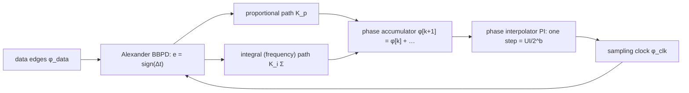

> **β**: This English translation is in beta — the Traditional-Chinese original is the authoritative version.

# Bang-bang CDR: turning the ISF's σ_t into K_bb, JTOL and SSC tracking

> **Prerequisites**: [serdes_clocking_connection](/06_design_insights/serdes_clocking_connection) (the loop high-pass intuition of §6, UI/eye/BER), [pll_noise_budget](/06_design_insights/pll_noise_budget) ($\lvert H_{lp}\rvert^2,\lvert H_{hp}\rvert^2$, the jitter-transfer vs jitter-tolerance distinction and the JTOL worked example — reused directly here), [dj_dual_dirac](/06_design_insights/dj_dual_dirac) ($Q^{-1}(10^{-12})=7.03$, TJ@BER) | **Next**: [exercises](/06_design_insights/exercises), [lab_13_pll_cdr_transfer](/04_simulation_labs/lab_13_pll_cdr_transfer)

[serdes_clocking_connection](/06_design_insights/serdes_clocking_connection) drew the CDR (clock and data
recovery) as a black box that "high-passes VCO noise and low-passes input jitter." A real SerDes receiver
is almost never that linear PLL: it is a **bang-bang** (binary, "early/late" only) digital loop whose
phase detector (PD) emits only $\pm1$ and whose clock phase is moved by a **phase interpolator (PI)** in
discrete steps of $\text{UI}/2^b$. This page answers three questions designers meet daily that none of the
earlier pages answered:

1. A bang-bang PD has no "gain" — so what sets the loop bandwidth? The answer: **the rms value of the
   jitter**, which is exactly the $\sigma_t$ this site has been computing all along. Here the ISF sets not
   only the noise but the loop dynamics.
2. Where does the datasheet **jitter-tolerance mask (JTOL)** — that broken line of "$-40$ dB/dec at low
   frequency, $-20$ dB/dec in the middle, a plateau at high frequency" — come from?
3. **SSC (spread-spectrum clocking)** is a **huge, deterministic** low-frequency phase excursion the CDR
   must track: how large, and why a first-order loop cannot follow it.

> **Physical intuition (conclusion first)**: a bang-bang PD is a comparator; the slope of
> $\text{sign}(\Delta t)$ versus $\Delta t$ is infinite at 0 — but **with noise present**, the expected
> output $E[\text{sign}(\Delta t+n)]$ is "smeared" into an error function whose slope is the finite
> $\sqrt{2/\pi}/\sigma_j$. More noise, less gain, slower loop: **this is a loop whose bandwidth scales
> itself with the jitter**. JTOL is "how much eye margin is left" divided by "the fraction the loop fails
> to track, $\lvert1-H\rvert$"; the triangular FM of SSC integrates to a parabolic phase of several hundred
> UI, and only a type-II loop with a frequency integrator can track it down to a few tenths of a UI.

## Step 1: the Alexander (bang-bang) phase detector outputs sign(Δt)

The **Alexander PD** (external literature, not among this site's five PDFs: J. D. H. Alexander, *Electron.
Lett.*, vol. 11, no. 22, pp. 541–542, Oct. 1975) decides whether the clock is early or late relative to the
data edge from three samples: the two bit-center samples $D_{k-1}, D_k$ and, between them, the sample $E_k$
aligned with the data edge. If $E_k=D_{k-1}\ne D_k$, the edge sample "looks like the previous bit" → the
clock is **late**; if $E_k=D_k\ne D_{k-1}$ → the clock is **early**; $D_{k-1}=D_k$ (no edge) → no output.
In terms of the timing error $\Delta t$ of the clock edge relative to the data edge (clock early positive):

$$
e_k=\begin{cases}\text{sign}(\Delta t_k), & \text{data transition present}\\ 0, & \text{no transition}\end{cases}
$$

Three key points:

- **The output is only $\pm1$ (and 0)**: there is no information about "how large" the error is, only its
  direction. So it has no PD gain $K_{PD}$ in the conventional sense (V/rad or 1/s) — exactly what Step 2
  resolves.
- **Updates only on transitions**: random NRZ data has transition density $\rho_T\approx0.5$; during long
  runs of 0s or 1s the loop is "blind," one reason specifications require 8b/10b, 64b/66b or scrambling to
  bound the run length.
- **It is simultaneously the data sampler**: $D_k$ is the recovered data. So the CDR's lock target "clock
  aligned to the data edge" automatically equals "data sample at the eye center" — connecting directly to
  the JTOL margin $\text{UI}-\text{TJ}_{eye}$ of Step 4.



## Step 2: linearization — Gaussian jitter smears sign into erf, gain K_bb = √(2/π)/σ_j

**Setup**: the real $\Delta t$ is not a constant but "nominal error $\Delta t$ plus a zero-mean Gaussian
term $n$," $n\sim\mathcal N(0,\sigma_j^2)$. This $\sigma_j$ is the total rms jitter **between the data
edge and the sampling clock**: the input data's RJ and the recovered clock's own jitter (the loop-shaped
VCO $\sigma_t$, the hunting of Step 3) are all included. The PD's **expected output** is:

$$
\begin{aligned}
\langle e\rangle(\Delta t)&=E\big[\text{sign}(\Delta t+n)\big]=P(n>-\Delta t)-P(n<-\Delta t)
=2\Phi\!\left(\frac{\Delta t}{\sigma_j}\right)-1 \\[4pt]
&=\operatorname{erf}\!\left(\frac{\Delta t}{\sqrt2\,\sigma_j}\right),
\qquad \Phi(x)=\tfrac12\Big[1+\operatorname{erf}\big(x/\sqrt2\big)\Big].
\end{aligned}
$$

**Step by step**: (i) the expectation of sign is $(+1)\cdot P(\text{positive})+(-1)\cdot P(\text{negative})$;
(ii) the probability of $n>-\Delta t$ is the Gaussian CDF $\Phi(\Delta t/\sigma_j)$; (iii) rewrite with the
standard relation between $\Phi$ and erf. The **linearized gain** is the slope of this curve at
$\Delta t=0$:

$$
\boxed{\ K_{bb}\equiv\frac{\partial\langle e\rangle}{\partial\Delta t}\bigg|_{\Delta t=0}
=\frac{2}{\sqrt\pi}\cdot\frac{1}{\sqrt2\,\sigma_j}=\sqrt{\frac{2}{\pi}}\,\frac{1}{\sigma_j}\ }
$$

(Using $\frac{d}{dx}\operatorname{erf}(x)=\frac{2}{\sqrt\pi}e^{-x^2}$, which equals $2/\sqrt\pi$ at $x=0$,
times the inner derivative $1/(\sqrt2\sigma_j)$.)

- **Dimension check**: $\langle e\rangle$ is dimensionless, $\Delta t$ is in seconds → $K_{bb}$ has units
  $\text{s}^{-1}$ ✓. Multiplying by UI gives the dimensionless gain $K_{bb}\cdot\text{UI}$ ("output per UI of
  error").
- **Physical meaning**: the larger $\sigma_j$, the flatter the erf and the smaller the gain. **The gain of a
  bang-bang loop is the reciprocal of the jitter** — the central result of Lee–Kundert–Razavi (external
  literature, not among this site's five PDFs: J. Lee, K. S. Kundert, and B. Razavi, "Analysis and Modeling
  of Bang-Bang Clock and Data Recovery Circuits," *IEEE J. Solid-State Circuits*, vol. 39, no. 9,
  pp. 1571–1580, Sep. 2004).
- **Linear region**: erf is approximately straight only for $\lvert\Delta t\rvert\lesssim\sigma_j$
  ($\langle e\rangle(\sigma_j)=0.683$, $\langle e\rangle(2\sigma_j)=0.954$ is already saturated); the
  tangent meets $\pm1$ at $\Delta t=\pm\sigma_j\sqrt{\pi/2}$. Larger errors enter the **slew-limited**
  region — where the $-20$ dB/dec JTOL segment of Step 4 lives.
- **Transition density**: only transitions update the loop, so the average gain is further multiplied by
  $\rho_T$ ($\approx0.5$ for random data).

> **Worked example (site values)**: take the rms jitter between data edge and clock as this site's canonical
> example C, $\sigma_t=447.9$ fs (free-running 5 GHz VCO, $-100$ dBc/Hz @ 1 MHz, integrated 1→100 MHz;
> used here as a representative $\sigma_j$), UI $=40$ ps (25 Gb/s NRZ, as in
> [final_exam](/04_simulation_labs/final_exam) problem 10).

$$
K_{bb}=\sqrt{\frac{2}{\pi}}\cdot\frac{1}{447.9\times10^{-15}\ \text{s}}
=\frac{0.7979}{4.479\times10^{-13}\ \text{s}}=1.78\times10^{12}\ \text{s}^{-1},
\qquad K_{bb}\cdot\text{UI}=1.78\times10^{12}\times40\times10^{-12}=71.3\ \text{(per UI)}.
$$

In other words the PD's expected output already hits $\pm1$ when the clock is off by
$1/71.3\ \text{UI}=0.014$ UI $=0.56$ ps — the linear region is only half a picosecond wide. **The smaller the
$\sigma_t$ the ISF gives (the cleaner the VCO), the larger $K_{bb}$ and the faster the loop — but the
narrower the linear region**: this is where bang-bang differs most from a linear PLL.

```python
import numpy as np
from scipy.special import erf
sigma_t = 447.9e-15   # s, canonical example C (free-running VCO, 1-100 MHz)
UI = 40e-12           # s, 25 Gb/s NRZ
K_bb = np.sqrt(2/np.pi)/sigma_t
print(f"{K_bb:.3e}", round(K_bb*UI, 1))
# -> 1.781e+12 71.3
d = 1e-18             # numerical derivative of erf(dt/(sqrt2 sigma)) at 0
slope = (erf(d/(np.sqrt(2)*sigma_t)) - erf(-d/(np.sqrt(2)*sigma_t)))/(2*d)
print(f"{slope:.3e}", round(sigma_t*np.sqrt(np.pi/2)*1e12, 3))
# -> 1.781e+12 0.561
```

## Step 3: the PI loop — φ[k+1] = φ[k] + K_p·sign(e), UI/2^b quantization, hunting limit cycle

Most modern SerDes CDRs have no VCO in the loop: a shared PLL generates fixed-frequency multi-phase clocks,
and the CDR uses a **phase interpolator (PI)** to interpolate the sampling clock between those phases. The
PI is driven by a $b$-bit phase code; one UI is divided into $2^b$ steps:

$$
\Delta\phi_{PI}=\frac{\text{UI}}{2^b}\qquad(b=6:\ \frac{40\ \text{ps}}{64}=0.625\ \text{ps}=0.0156\ \text{UI}).
$$

The simplest **first-order bang-bang loop** pushes the phase code one step in the direction the PD indicates
every update period $T_u=N_{dec}\cdot\text{UI}$ ($N_{dec}$ is the decimation/voting factor applied to the PD
output):

$$
\phi[k+1]=\phi[k]+K_p\,\text{sign}(e[k]),\qquad K_p=m\cdot\Delta\phi_{PI}\ (m\ \text{LSBs}).
$$

**Three consequences of discretization** (external literature, not among this site's five PDFs: R. C. Walker,
"Designing Bang-Bang PLLs for Clock and Data Recovery in Serial Data Transmission Systems," in
*Phase-Locking in High-Performance Systems*, B. Razavi, Ed., IEEE Press, 2003):

1. **Hunting (limit cycle)**: once locked, the PD still only says "early" or "late," so the phase code hops
   back and forth around the optimum, producing a deterministic jitter of peak-to-peak $K_p$; if the loop has
   a latency of $D$ update periods (the pipeline between decision and execution), the phase overshoots by
   $D$ extra steps before reversing and the limit cycle grows to **peak-to-peak $(2D+1)K_p$** (counted
   directly with the noise-free model in the Python below). This is a **DJ**: in the TJ budget it enters as
   $\text{DJ}_{pp}$, added directly, not scaled with BER (see [dj_dual_dirac](/06_design_insights/dj_dual_dirac)).
2. **Quantization noise**: treating the PI phase error as uniformly distributed, its rms is
   $\Delta\phi_{PI}/\sqrt{12}=0.18$ ps — the same order as $\sigma_t=0.45$ ps, not negligible.
3. **Linearized bandwidth**: substituting $K_{bb}$ from Step 2, the phase correction per update is
   $\approx K_p K_{bb}\rho_T\,\Delta t$, and the continuous-time approximation gives a first-order loop

$$
\frac{d\phi_{clk}}{dt}\approx\frac{K_pK_{bb}\rho_T}{T_u}\,(\phi_{data}-\phi_{clk})
\ \Rightarrow\ f_{BW}\approx\frac{K_pK_{bb}\rho_T f_u}{2\pi},\qquad f_u=\frac{1}{T_u}.
$$

- **Dimension check**: $K_p$ [s] $\times K_{bb}$ [1/s] $\times f_u$ [1/s] $=$ [1/s] ✓; $K_pK_{bb}$ is the
  (dimensionless) "loop gain per update"; the discrete loop needs $K_pK_{bb}\rho_T\lt2$ for stability, and
  the linearization itself holds only when $K_p\lesssim\sigma_j$ (step smaller than the noise).
- **Worked (site values)**: $K_p=1$ LSB $=0.625$ ps, $K_{bb}=1.78\times10^{12}$ s$^{-1}$, $\rho_T=0.5$.
  $N_{dec}=1$ (update every UI): $K_pK_{bb}=1.11$ per update — already beyond what the linearization can
  describe (the $0.625$ ps step exceeds $\sigma_j=0.448$ ps), so the nominal $f_{BW}=2.2$ GHz is
  meaningless; $N_{dec}=16$ ($f_u=1.5625$ GHz): $f_{BW}\approx0.5\times0.625\text{ ps}\times1.78\times10^{12}\text{ s}^{-1}
  \times1.5625\times10^9\text{ s}^{-1}/2\pi=138$ MHz, a typical CDR-bandwidth order of magnitude. Honest
  statement: here $K_p\approx\sigma_j$, so hunting pushes the effective $\sigma_j$ up and $K_{bb}$ down;
  the exact value needs Monte-Carlo (a v12 lab); this page gives only the order of magnitude.
- **Slew capability of the proportional path**: at most $(K_p/\text{UI})\,f_u$ UI per second, i.e. a
  trackable frequency offset of $(K_p/\text{UI})\,f_u/f_b$: $1/64=15\,625$ ppm for $N_{dec}=1$, $977$ ppm
  for $N_{dec}=16$. Step 5 compares this against the 5000 ppm of SSC.

```python
import numpy as np
fb, UI, b = 25e9, 40e-12, 6
Kp = UI/2**b
print(round(Kp*1e12, 3), round(Kp/UI, 4), round(Kp/np.sqrt(12)*1e12, 3))
# -> 0.625 0.0156 0.18
K_bb = np.sqrt(2/np.pi)/447.9e-15
for Ndec in (1, 16):
    fu = fb/Ndec
    f_bw = 0.5*Kp*K_bb*fu/(2*np.pi)     # rho_T = 0.5 (random data); one sign per update, no voting
    print(Ndec, f"{f_bw:.3e}", f"{(Kp/UI)*fu/fb*1e6:.0f}")
# -> 1 2.215e+09 15625
# -> 16 1.384e+08 977
def hunting_pp(D, n=400):               # noise-free limit cycle, latency D updates, units of Kp
    phi, q, hist = 0.3, [0.0]*D, []
    for k in range(n):
        q.append(-np.sign(phi) if phi != 0 else 1.0)
        phi += q.pop(0)
        hist.append(phi)
    h = np.array(hist[n//2:])
    return float(h.max() - h.min())
print([hunting_pp(D) for D in (0, 1, 2, 4)])
# -> [1.0, 3.0, 5.0, 9.0]
```

> **Sidebar: why a DLL does not "accumulate" jitter** (external literature, not among this site's five
> PDFs: J. G. Maneatis, "Low-Jitter Process-Independent DLL and PLL Based on Self-Biased Techniques," *IEEE
> J. Solid-State Circuits*, vol. 31, no. 11, pp. 1723–1732, Nov. 1996). The PI architecture above is really
> DLL (delay-locked loop) thinking: there is **no oscillator** in the loop, only "a delay relative to the
> reference clock." An oscillator's phase is the integral of its frequency, so white noise → phase random
> walk → $\sigma_{\Delta t}=\kappa\sqrt{\Delta t}$ ([P2] Eq.(8), p.792, see [lc_vs_ring](/06_design_insights/lc_vs_ring));
> a delay line's error is **re-zeroed by the reference edge every cycle**, so noise is added once and never
> accumulates. The price is that the output jitter inherits the reference clock's jitter directly (there is
> no high-pass to filter it) and there is no frequency degree of freedom — so "frequency tracking" in a
> PI-CDR relies entirely on the integral path of Step 5 accumulating the phase code digitally.

## Step 4: JTOL(f) = (UI − TJ_eye)/|1 − H(f)| and the −40 / −20 dB/dec mask segments

[pll_noise_budget](/06_design_insights/pll_noise_budget) already separated **jitter transfer**
($\lvert H_{lp}\rvert^2$) from **jitter tolerance** (set by the error transfer $1-H_{lp}=H_{hp}$): only the
part of the input jitter the CDR fails to track, $\phi_{err}=(1-H)\phi_{data}$, eats the eye. Given an eye
margin $\text{UI}-\text{TJ}_{eye}$, the tolerable single-tone sinusoidal input jitter is

$$
\boxed{\ \text{JTOL}_{pp}(f)=\frac{\text{UI}-\text{TJ}_{eye}}{\lvert1-H(f)\rvert}\ }
$$

> ⚠️ **Convention flag (peak vs peak-to-peak, a factor of 2)**: industry JTOL masks are specified
> **peak-to-peak** (UI pp). With the sample at the eye center, it may deviate by
> $(\text{UI}-\text{TJ}_{eye})/2$ either way, so a sinusoidal error of peak $\le(\text{UI}-\text{TJ}_{eye})/2$
> ⇔ peak-to-peak $\le\text{UI}-\text{TJ}_{eye}$ — the formula above therefore matches the mask when read as
> **peak-to-peak**; [pll_noise_budget](/06_design_insights/pll_noise_budget) calls the same expression a
> peak amplitude — same numbers, a 2× difference in reading, so say which one you mean when quoting it.

**Where the three mask segments come from** — approximate the type-II second-order
$1-H_{lp}=H_{hp}(s)=\dfrac{s^2}{s^2+2\zeta\omega_ns+\omega_n^2}$ piecewise:

| Band | $\lvert H_{hp}\rvert$ approximation | JTOL slope | Physics |
|---|---|---|---|
| $f\ll f_z=f_n/(2\zeta)$ | $(f/f_n)^2$ | $-40$ dB/dec | frequency integrator + phase integrator: two integrators track slow excursions |
| $f_z\ll f\ll2\zeta f_n$ (visible only for large $\zeta$) | $f/(2\zeta f_n)$ | $-20$ dB/dec | loop zero: only the proportional path is tracking |
| $f\gg f_n$ | $\to1$ | plateau $\text{UI}-\text{TJ}_{eye}$ | nothing is tracked; only the static eye margin remains |

A bang-bang loop adds one more **slew-limited $-20$ dB/dec line**: a sinusoidal phase of peak-to-peak
$A_{pp}$ at frequency $f$ has maximum slope $\pi A_{pp}f$, while the proportional path can move at most
$(K_p/\text{UI})f_u$ UI per second, so

$$
A_{pp}\le\frac{(K_p/\text{UI})\,f_u}{\pi f}\qquad(-20\ \text{dB/dec; Walker 2003, Lee–Kundert–Razavi 2004}).
$$

The actual mask is the lower envelope (min) of the three. This is why datasheet JTOL curves look the way
they do: **$-40$ at low frequency, $-20$ in the middle, a plateau at high frequency** — each segment
corresponds to a different mechanism in the loop.

> **Worked example (site values, the same set as pll_noise_budget)**: UI $=40$ ps, $\sigma_t=447.9$ fs,
> $\text{TJ}_{eye}=2Q^{-1}(10^{-12})\sigma_t=2\times7.03\times0.4479$ ps $=6.30$ ps $=0.157$ UI, margin
> $0.843$ UI; type-II, $f_n=1$ MHz, $\zeta=0.707$.

$$
\begin{aligned}
\text{JTOL}(10\ \text{kHz})&=\frac{0.843}{(10^4/10^6)^2}=\frac{0.843}{10^{-4}}=8.4\times10^{3}\ \text{UI},\\
\text{JTOL}(30\ \text{kHz})&=\frac{0.843}{9.0\times10^{-4}}=936\ \text{UI},\quad
\text{JTOL}(100\ \text{kHz})=84\ \text{UI},\quad
\text{JTOL}(1\ \text{MHz})=\frac{0.843}{0.707}=1.19\ \text{UI},\quad
\text{JTOL}(10\ \text{MHz})=0.84\ \text{UI}.
\end{aligned}
$$

10 kHz→100 kHz is exactly $-40$ dB/dec ($8426\to84.3$, $100\times$); with $\zeta=0.707$ the zero
$f_z=707$ kHz sits almost on $f_n$, so no $-20$ segment is visible; raising $\zeta$ to 4 ($f_z=125$ kHz)
turns the 100 kHz→1 MHz slope into $-24$ dB/dec — one origin of the $-20$ dB/dec mid-segment in
specifications.

```python
import numpy as np
from simulations.common.pll_utils import H_highpass_mag2
UI, sigma_t, qinv = 40e-12, 447.9e-15, 7.03
TJ_eye = 2*qinv*sigma_t
margin_UI = 1 - TJ_eye/UI
print(round(TJ_eye*1e12, 2), round(TJ_eye/UI, 3), round(margin_UI, 3))
# -> 6.3 0.157 0.843
fn, zeta = 1e6, 0.707
for f in [1e4, 3e4, 1e5, 1e6, 1e7]:
    H_hp = np.sqrt(H_highpass_mag2(np.array([f]), fn, zeta)[0])   # amplitude |1-H_lp|
    print(f"{f:.0e}", f"{H_hp:.3e}", round(margin_UI/H_hp, 2))
# -> 1e+04 1.000e-04 8425.63
# -> 3e+04 9.000e-04 936.18
# -> 1e+05 1.000e-02 84.26
# -> 1e+06 7.072e-01 1.19
# -> 1e+07 1.000e+00 0.84
def jtol_slope(zeta, fa, fb):           # dB per decade of JTOL between fa and fb = 10 fa
    Ha, Hb = (np.sqrt(H_highpass_mag2(np.array([x]), fn, zeta)[0]) for x in (fa, fb))
    return float(20*np.log10((margin_UI/Hb)/(margin_UI/Ha)))
for zeta in (0.707, 4.0):
    print(zeta, [round(jtol_slope(zeta, fa, 10*fa), 1) for fa in (1e4, 1e5, 1e6)])
# -> 0.707 [-40.0, -37.0, -3.0]
# -> 4.0 [-37.9, -24.0, -16.0]
```

**Dimension check**: $\text{UI}-\text{TJ}_{eye}$ [UI] ÷ a dimensionless amplitude transfer $=$ [UI] ✓; the
slew line $[\text{UI/s}]/[\text{1/s}]=[\text{UI}]$ ✓.

## Step 5: SSC — the triangular FM the CDR must track, 521 UI peak-to-peak phase

**Spread-spectrum clocking (SSC)** deliberately sweeps the transmitter clock frequency as a **triangle wave**
at $f_m\approx30$–$33$ kHz from nominal down to $-\delta$ (down-spread, PCIe-style $\delta=0.5\%$; PCI Express
Base Specification, version to be verified; external literature, not among this site's five PDFs) to
spread EMI energy. To the receiver's CDR this is not noise but **a deterministic FM that must be tracked** —
especially when the RX reference clock is not spread along with it (separate-reference architectures).

**Deriving the peak-to-peak phase step by step**. Let the bit rate be $f_b$; the frequency offset relative
to the center value is a triangle wave of amplitude $\pm\delta f_b/2$ and period $T_m=1/f_m$. The phase (in
UI) is the integral of the frequency offset; the area of the triangle's positive half-period is
$\tfrac12\cdot\tfrac{T_m}{2}\cdot\tfrac{\delta f_b}{2}=\dfrac{\delta f_bT_m}{8}$, which is the peak-to-peak phase:

$$
\boxed{\ \Delta\phi_{pp}=\frac{\delta\,f_b\,T_m}{8}\ \text{UI}
=\frac{1}{4}\,T_m\,\Delta f_{pk}\ \text{cycles}\ }\qquad(\Delta f_{pk}=\delta f_{clk}/2\ \text{is the clock's peak frequency deviation}).
$$

Substituting $f_b=25$ Gb/s (half-rate clock $f_{clk}=12.5$ GHz), $\delta=0.005$, $f_m=30$ kHz
($T_m=33.3$ µs):

$$
\Delta f_{pk}=\frac{0.005\times12.5\ \text{GHz}}{2}=31.25\ \text{MHz},\quad
\Delta\phi_{pp}=\tfrac14\times33.3\ \mu\text{s}\times31.25\ \text{MHz}=260\ \text{cycles}
=260\times80\ \text{ps}=20.8\ \text{ns}=521\ \text{UI}.
$$

- **Dimension check**: $[\text{s}]\times[\text{1/s}]=$ dimensionless (a cycle count) ✓; one 12.5 GHz cycle
  $=2$ UI ✓.
- **This is a phase excursion of over five hundred UI**, four orders of magnitude larger than any RJ. The
  Step-4 mask must give $\text{JTOL}\gt521$ UI at 30 kHz: type-II with $f_n=1$ MHz gives $936$ UI ✓ (and
  $8.4\times10^3$ UI at 10 kHz).
- **How large is the residual error**: each leg of the triangular FM is a **frequency ramp** = a phase
  parabola $\phi_{in}=\tfrac12at^2$ with $a=\delta f_b/(T_m/2)=7.5\times10^{12}$ UI/s². For a type-II
  second-order loop the final value of $E(s)=H_{hp}(s)\cdot a/s^3$ is
  $e_{ss}=a/\omega_n^2=7.5\times10^{12}/(2\pi\times10^6)^2=0.19$ UI — the ramp reverses every $T_m/2$, so the
  error is a square wave of $\pm0.19$ UI (peak-to-peak 0.38 UI). Frequency-domain cross-check: the
  peak-to-peak **fundamental** of the piecewise-parabolic phase is not 521 UI but
  $521\times32/\pi^3=538$ UI (the triangle wave's $8/\pi^2$ fundamental, integrated once more); times
  $\lvert H_{hp}(30\ \text{kHz})\rvert=9.0\times10^{-4}$ this gives $0.48$ UI pp $=0.38\times4/\pi$, exactly the
  fundamental of that square wave ✓. This 0.19 UI must be subtracted from
  the 0.843 UI margin — **SSC is a non-trivial DJ item in the CDR budget**.
- **A first-order (type-I) loop fails**: a first-order loop with the same 1 MHz bandwidth has
  $\lvert1-H\rvert=f/\sqrt{f^2+f_{BW}^2}=0.030$ @30 kHz → JTOL of only $28$ UI $\ll521$; more fundamentally,
  a type-I loop has a **static phase error** for a 5000 ppm frequency offset of
  $\Delta f/(2\pi f_{BW})=0.005\times25\times10^9/(2\pi\times10^6)=19.9$ UI — it simply loses lock.
- **Who tracks it inside the bang-bang PI loop**: Step 3 computed the proportional path's frequency-tracking
  ceiling of $977$ ppm ($N_{dec}=16$) $\lt5000$ ppm — the proportional path cannot follow SSC;
  **tracking SSC is the job of the integral (frequency) path**:
  $\phi[k+1]=\phi[k]+K_p\text{sign}(e)+\omega[k]$, $\omega[k+1]=\omega[k]+K_i\text{sign}(e)$, where the
  frequency register $\omega$ remembers "how many fractions of an LSB to advance per update," leaving the
  PD to handle only jitter. This is why digital CDRs are almost always type-II.

```python
import numpy as np
from simulations.common.pll_utils import H_highpass_mag2
fb, UI = 25e9, 40e-12         # bit rate, UI
delta, fm = 0.005, 30e3       # -0.5 % down-spread, 30 kHz triangle (PCIe-style)
Tm = 1/fm
pp_cycles = 0.25*Tm*(delta*12.5e9/2)   # half-rate 12.5 GHz clock: +-31.25 MHz around centre
pp_UI = delta*fb*Tm/8
print(round(pp_cycles, 1), round(pp_UI, 1))
# -> 260.4 520.8
fn, zeta = 1e6, 0.707
margin_UI = 1 - 2*7.03*447.9e-15/UI    # 0.843 UI eye margin (Step 4)
a = (delta*fb)/(Tm/2)                  # phase acceleration during each ramp, UI/s^2
e_ss = a/(2*np.pi*fn)**2
H30 = np.sqrt(H_highpass_mag2(np.array([fm]), fn, zeta)[0])
pp_fund = pp_UI*32/np.pi**3            # fundamental (pp) of the piecewise-parabolic phase, not its pp
print(round(pp_fund, 1), f"{a:.2e}", round(e_ss, 3), round(pp_fund*H30, 3), round(margin_UI/H30, 1))
# -> 537.5 7.50e+12 0.19 0.484 936.2
fbw1 = 1e6                             # first-order (type-I) loop with the same bandwidth
H1 = fm/np.sqrt(fm**2 + fbw1**2)
print(round(margin_UI/H1, 1), round(delta*fb/(2*np.pi*fbw1), 1))
# -> 28.1 19.9
```

## Design knobs

| Knob | Effect | Trade-off |
|---|---|---|
| VCO/reference $\sigma_t$ (ISF: $\Gamma_{rms}/q_{max}$) | $K_{bb}=\sqrt{2/\pi}/\sigma_j$ → loop gain and $f_{BW}$ | cleaner → faster loop but narrower linear region; hunting dominates once $\sigma_j\lesssim K_p$ |
| PI bit count $b$ | $\Delta\phi_{PI}=\text{UI}/2^b$: hunting DJ $(2D+1)K_p$, quantization rms $/\sqrt{12}$ | larger $b$ → smaller steps and DJ, but less frequency offset per step and harder PI linearity |
| Update rate $f_u=f_b/N_{dec}$ | $f_{BW}\propto f_u$, slew $\propto f_u$ | larger $N_{dec}$ saves power / eases latency, at the cost of bandwidth and tracking |
| Loop latency $D$ | hunting peak-to-peak $(2D+1)K_p$ | pipeline depth vs timing closure |
| Integral path $K_i$ | tracks SSC / frequency offset, sets the $-40$ dB/dec segment | too large → peaking, poor stability margin |
| $\zeta$ (zero location $f_z=f_n/2\zeta$) | length of the $-20$ dB/dec segment, jitter peaking | cascaded CDRs add their peaking in dB (see pll_noise_budget) |

## Validity and failure conditions

| Condition | Holds when | Fails when |
|---|---|---|
| Gaussian $\sigma_j$, linearized $K_{bb}$ | $K_p\lesssim\sigma_j$ and error $\lesssim\sigma_j$ | $K_p\gg\sigma_j$: hunting dominates, bandwidth set by $K_p f_u$; large errors enter the slew-limited region |
| Continuous-time loop approximation | $f_{BW}\ll f_u$ ($K_pK_{bb}\rho_T\ll1$) | gain per update $\gtrsim1$: use the discrete model (the $N_{dec}=1$ example) |
| JTOL via the amplitude transfer $\lvert1-H\rvert$ | single-tone sinusoid, small-signal linear loop | slew-limited region uses $A_{pp}\le(K_p/\text{UI})f_u/(\pi f)$ instead; peak vs peak-to-peak readings differ by 2× |
| $\text{TJ}_{eye}$ contains RJ only | clean eye without ISI/DJ | a real link must put ISI, DCD, the 0.19 UI SSC residual and the $(2D+1)K_p$ hunting into $\text{TJ}_{eye}$ |
| SSC must be tracked by the CDR | separate-reference architecture | common-clock architecture: the RX PLL spreads in step, the CDR sees only the residual |
| $\rho_T=0.5$ | scrambled / encoded data | long run lengths: the PD goes blind and the effective $f_{BW}$ drops |

## Key takeaways

- The Alexander PD outputs only $\text{sign}(\Delta t)$ (when a transition exists); Gaussian jitter smears
  it into $\langle e\rangle=\operatorname{erf}(\Delta t/\sqrt2\sigma_j)$ with linearized gain
  $K_{bb}=\sqrt{2/\pi}/\sigma_j$.
- Site values: $\sigma_t=447.9$ fs → $K_{bb}=1.78\times10^{12}$ s$^{-1}=71.3$/UI; the linear region is only
  $\pm0.56$ ps. **The $\sigma_t$ computed from the ISF sets the gain and bandwidth of a bang-bang CDR.**
- PI: $\text{UI}/2^b$ (6-bit → 0.625 ps); first-order BB update $\phi[k+1]=\phi[k]+K_p\text{sign}(e)$;
  hunting peak-to-peak $(2D+1)K_p$ is a DJ; linearized $f_{BW}=K_pK_{bb}\rho_Tf_u/2\pi$ ($N_{dec}=16$ →
  order of 138 MHz).
- $\text{JTOL}_{pp}(f)=(\text{UI}-\text{TJ}_{eye})/\lvert1-H(f)\rvert$: $-40$ (two integrators) / $-20$
  (zero, or slew: $A_{pp}\le(K_p/\text{UI})f_u/\pi f$) / plateau. Site values: $6.30$ ps $=0.157$ UI →
  $84/1.19/0.84$ UI @ 100 kHz/1 MHz/10 MHz.
- SSC ($-0.5\%$, 30 kHz, 25 Gb/s): $\Delta\phi_{pp}=\delta f_bT_m/8=521$ UI (260 cycles of the 12.5 GHz
  clock); type-II $f_n=1$ MHz leaves $\pm0.19$ UI, JTOL(30 kHz)$=936$ UI ✓; first-order loop 28 UI and a
  19.9 UI static error ✗.
- DLL/PI has no oscillator → jitter does not accumulate (Maneatis 1996), but it neither filters the
  reference nor tracks frequency — frequency tracking relies on the integral path.

## Further reading

- CDR black-box intuition and UI/eye/BER: [serdes_clocking_connection](/06_design_insights/serdes_clocking_connection)
- Transfer vs tolerance and the original JTOL worked example: [pll_noise_budget](/06_design_insights/pll_noise_budget)
- The two transfer functions: [lab_13_pll_cdr_transfer](/04_simulation_labs/lab_13_pll_cdr_transfer)
- TJ@BER and DJ accounting: [dj_dual_dirac](/06_design_insights/dj_dual_dirac)
- Accumulated jitter $\kappa\sqrt{\Delta t}$ (the contrast in the DLL sidebar): [lc_vs_ring](/06_design_insights/lc_vs_ring)
- External literature (not among this site's five PDFs): J. D. H. Alexander, "Clock Recovery from Random
  Binary Signals," *Electron. Lett.*, vol. 11, no. 22, pp. 541–542, Oct. 1975; J. Lee, K. S. Kundert, and
  B. Razavi, "Analysis and Modeling of Bang-Bang Clock and Data Recovery Circuits," *IEEE J. Solid-State
  Circuits*, vol. 39, no. 9, pp. 1571–1580, Sep. 2004; R. C. Walker, "Designing Bang-Bang PLLs for Clock
  and Data Recovery in Serial Data Transmission Systems," in *Phase-Locking in High-Performance Systems*,
  B. Razavi, Ed., IEEE Press, 2003; J. G. Maneatis, *IEEE J. Solid-State Circuits*, vol. 31, no. 11,
  pp. 1723–1732, Nov. 1996; PCI Express Base Specification (SSC 30–33 kHz, $-0.5\%$ down-spread; version to
  be verified).
- A Monte-Carlo lab and an interactive widget verifying $K_{bb}$, hunting and JTOL: deferred to v12.
