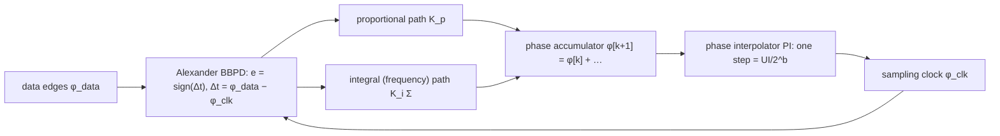

import NumericQuiz from "@site/src/components/NumericQuiz";
import BbCdrExplorer from "@site/src/components/BbCdrExplorer";

> **β**: This English translation is in beta — the Traditional-Chinese original is the authoritative version.

# Bang-bang CDR: turning the ISF's σ_t into K_bb, JTOL and SSC tracking

> **Prerequisites**: [serdes_clocking_connection](/06_design_insights/serdes_clocking_connection) (the loop high-pass intuition of §6, UI/eye/BER), [pll_noise_budget](/06_design_insights/pll_noise_budget) ($\lvert H_{lp}\rvert^2,\lvert H_{hp}\rvert^2$, the jitter-transfer vs jitter-tolerance distinction and the JTOL worked example — reused directly here), [dj_dual_dirac](/06_design_insights/dj_dual_dirac) ($Q^{-1}(10^{-12})=7.03$, TJ@BER) | **Next**: [exercises](/06_design_insights/exercises), [lab_13_pll_cdr_transfer](/04_simulation_labs/lab_13_pll_cdr_transfer)

[serdes_clocking_connection](/06_design_insights/serdes_clocking_connection) drew the CDR (clock and data
recovery) as a black box that "high-passes VCO noise and low-passes input jitter." A real SerDes receiver
is almost never that linear PLL: it is a **bang-bang** (binary, "early/late" only) digital loop whose
phase detector (PD) emits only $\pm1$ and whose clock phase is moved by a **phase interpolator (PI)** in
discrete steps of $\text{UI}/2^b$. This page answers three questions designers meet daily that none of the
earlier pages answered:

1. A bang-bang PD has no "gain" — so what sets the loop bandwidth? The answer: **the rms value of the
   jitter**, which is exactly the $\sigma_t$ this site has been computing all along. Here the ISF sets not
   only the noise but the loop dynamics.
2. Where does the datasheet **jitter-tolerance mask (JTOL)** — that broken line of "$-40$ dB/dec at low
   frequency, $-20$ dB/dec in the middle, a plateau at high frequency" — come from?
3. **SSC (spread-spectrum clocking)** is a **huge, deterministic** low-frequency phase excursion the CDR
   must track: how large, and why a first-order loop cannot follow it.

> **Physical intuition (conclusion first)**: a bang-bang PD is a comparator; the slope of
> $\text{sign}(\Delta t)$ versus $\Delta t$ is infinite at 0 — but **with noise present**, the expected
> output $E[\text{sign}(\Delta t+n)]$ is "smeared" into an error function whose slope is the finite
> $\sqrt{2/\pi}/\sigma_j$. More noise, less gain, slower loop: **this is a loop whose bandwidth scales
> itself with the jitter**. JTOL is "how much eye margin is left" divided by "the fraction the loop fails
> to track, $\lvert1-H\rvert$"; the triangular FM of SSC integrates to a parabolic phase of several hundred
> UI, and only a type-II loop with a frequency integrator can track it down to a few tenths of a UI.

## Step 1: the Alexander (bang-bang) phase detector outputs sign(Δt)

The **Alexander PD** (external literature, not among this site's five PDFs: J. D. H. Alexander, *Electron.
Lett.*, vol. 11, no. 22, pp. 541–542, Oct. 1975) decides whether the clock is early or late relative to the
data edge from three samples: the two bit-center samples $D_{k-1}, D_k$ and, between them, the edge sample
$E_k$ **nominally** aligned with the data transition. The whole decision rests on one sentence: **if the
edge sampler fires before the data transition it still sees the old bit; if it fires after the transition
it already sees the new bit.**

- Clock **early**: $E_k$ falls before the transition and still sees the old bit → $E_k=D_{k-1}\ne D_k$.
- Clock **late**: $E_k$ falls after the transition and already sees the new bit → $E_k=D_k\ne D_{k-1}$.
- $D_{k-1}=D_k$ (no transition) → no information, no output.

| $D_{k-1}$ | $E_k$ | $D_k$ | Decision | $e_k$ |
|---|---|---|---|---|
| 0 | 0 | 1 | early (edge sample is still the old bit) | $+1$ |
| 1 | 1 | 0 | early | $+1$ |
| 0 | 1 | 1 | late (edge sample is already the new bit) | $-1$ |
| 1 | 0 | 0 | late | $-1$ |
| 0 | any | 0 | no transition | $0$ |
| 1 | any | 1 | no transition | $0$ |

(In logic this is the difference of two XORs: $e_k=(E_k\oplus D_k)-(D_{k-1}\oplus E_k)$. A timing diagram of
the three samples is panel (a) of the figure in [Numerical check](#numerical-check) below.)

Define the timing error $\Delta t\equiv t_{\text{data}}-t_{\text{clk}}$: the instant of the data transition
minus the instant of the edge-sampling clock, **positive when the clock is early**. The truth table above is
then

$$
e_k=\begin{cases}\text{sign}(\Delta t_k), & \text{data transition present}\\ 0, & \text{no transition}\end{cases}
$$

Three key points:

- **The output is only $\pm1$ (and 0)**: there is no information about "how large" the error is, only its
  direction. So it has no PD gain $K_{PD}$ in the conventional sense (V/rad or 1/s) — exactly what Step 2
  resolves.
- **Updates only on transitions**: random NRZ data has transition density $\rho_T\approx0.5$; during long
  runs of 0s or 1s the loop is "blind," one reason specifications require 8b/10b, 64b/66b or scrambling to
  bound the run length.
- **It is simultaneously the data sampler**: $D_k$ is the recovered data. So the CDR's lock target "clock
  aligned to the data edge" automatically equals "data sample at the eye center" — connecting directly to
  the JTOL margin $\text{UI}-\text{TJ}_{eye}$ of Step 4.


```mermaid
flowchart LR
  D["data edges φ_data"] --> PD["Alexander BBPD: e = sign(Δt), Δt = φ_data − φ_clk"]
  PD --> P["proportional path K_p"]
  PD --> I["integral (frequency) path K_i Σ"]
  P --> ACC["phase accumulator φ[k+1] = φ[k] + …"]
  I --> ACC
  ACC --> PI["phase interpolator PI: one step = UI/2^b"]
  PI --> CLK["sampling clock φ_clk"]
  CLK --> PD
```

**Loop polarity**: in the diagram $\phi_{data},\phi_{clk}$ are the **time positions** (delays, in s or UI) of
the data transition and of the sampling-clock edge. Clock early ($\Delta t=\phi_{data}-\phi_{clk}\gt0$) →
$e=+1$ → the phase code **increases** $\phi_{clk}$ (moves the clock later) → $\Delta t$ shrinks: negative
feedback. With early/late swapped the same loop becomes positive feedback and locks to the eye edge instead
of the eye center.

## Step 2: linearization — Gaussian jitter smears sign into erf, gain K_bb = √(2/π)/σ_j

**Setup**: the real $\Delta t$ is not a constant but "nominal error $\Delta t$ plus a zero-mean Gaussian
term $n$," $n\sim\mathcal N(0,\sigma_j^2)$. This $\sigma_j$ is the total rms jitter **between the data
edge and the sampling clock**: the input data's RJ and the recovered clock's own jitter (the loop-shaped
VCO $\sigma_t$, the hunting of Step 3) are all included. The PD's **expected output** is:

$$
\begin{aligned}
\langle e\rangle(\Delta t)&=E\big[\text{sign}(\Delta t+n)\big]=P(n>-\Delta t)-P(n<-\Delta t)
=2\Phi\!\left(\frac{\Delta t}{\sigma_j}\right)-1 \\[4pt]
&=\operatorname{erf}\!\left(\frac{\Delta t}{\sqrt2\,\sigma_j}\right),
\qquad \Phi(x)=\tfrac12\Big[1+\operatorname{erf}\big(x/\sqrt2\big)\Big].
\end{aligned}
$$

**Step by step**: (i) the expectation of sign is $(+1)\cdot P(\text{positive})+(-1)\cdot P(\text{negative})$;
(ii) the probability of $n>-\Delta t$ is the Gaussian CDF $\Phi(\Delta t/\sigma_j)$; (iii) rewrite with the
standard relation between $\Phi$ and erf. The **linearized gain** is the slope of this curve at
$\Delta t=0$:

$$
\boxed{\ K_{bb}\equiv\frac{\partial\langle e\rangle}{\partial\Delta t}\bigg|_{\Delta t=0}
=\frac{2}{\sqrt\pi}\cdot\frac{1}{\sqrt2\,\sigma_j}=\sqrt{\frac{2}{\pi}}\,\frac{1}{\sigma_j}\ }
$$

(Using $\frac{d}{dx}\operatorname{erf}(x)=\frac{2}{\sqrt\pi}e^{-x^2}$, which equals $2/\sqrt\pi$ at $x=0$,
times the inner derivative $1/(\sqrt2\sigma_j)$.)

- **Dimension check**: $\langle e\rangle$ is dimensionless, $\Delta t$ is in seconds → $K_{bb}$ has units
  $\text{s}^{-1}$ ✓. Multiplying by UI gives the dimensionless gain $K_{bb}\cdot\text{UI}$ ("output per UI of
  error").
- **Physical meaning**: the larger $\sigma_j$, the flatter the erf and the smaller the gain. **The gain of a
  bang-bang loop is the reciprocal of the jitter** — the central result of Lee–Kundert–Razavi (external
  literature, not among this site's five PDFs: J. Lee, K. S. Kundert, and B. Razavi, "Analysis and Modeling
  of Bang-Bang Clock and Data Recovery Circuits," *IEEE J. Solid-State Circuits*, vol. 39, no. 9,
  pp. 1571–1580, Sep. 2004).
- **Linear region**: erf is approximately straight only for $\lvert\Delta t\rvert\lesssim\sigma_j$
  ($\langle e\rangle(\sigma_j)=0.683$, $\langle e\rangle(2\sigma_j)=0.954$ is already saturated); the
  tangent meets $\pm1$ at $\Delta t=\pm\sigma_j\sqrt{\pi/2}$. Larger errors enter the **slew-limited**
  region — where the $-20$ dB/dec JTOL segment of Step 4 lives.
- **Transition density**: only transitions update the loop, so the average gain is further multiplied by
  $\rho_T$ ($\approx0.5$ for random data).

> **Worked example (site values)**: take the rms jitter between data edge and clock as this site's canonical
> example C, $\sigma_t=447.9$ fs (free-running 5 GHz VCO, $-100$ dBc/Hz @ 1 MHz, integrated 1→100 MHz;
> used here as a representative $\sigma_j$), UI $=40$ ps (25 Gb/s NRZ, as in
> [final_exam](/04_simulation_labs/final_exam) problem 10).

$$
K_{bb}=\sqrt{\frac{2}{\pi}}\cdot\frac{1}{447.9\times10^{-15}\ \text{s}}
=\frac{0.7979}{4.479\times10^{-13}\ \text{s}}=1.78\times10^{12}\ \text{s}^{-1},
\qquad K_{bb}\cdot\text{UI}=1.78\times10^{12}\times40\times10^{-12}=71.3\ \text{(per UI)}.
$$

In other words the PD's expected output already hits $\pm1$ when the clock is off by
$1/71.3\ \text{UI}=0.014$ UI $=0.56$ ps — the linear region is only half a picosecond wide. **The smaller the
$\sigma_t$ the ISF gives (the cleaner the VCO), the larger $K_{bb}$ and the faster the loop — but the
narrower the linear region**: this is where bang-bang differs most from a linear PLL.

```python
import numpy as np
from scipy.special import erf
sigma_t = 447.9e-15   # s, canonical example C (free-running VCO, 1-100 MHz)
UI = 40e-12           # s, 25 Gb/s NRZ
K_bb = np.sqrt(2/np.pi)/sigma_t
print(f"{K_bb:.3e}", round(K_bb*UI, 1))
# -> 1.781e+12 71.3
d = 1e-18             # numerical derivative of erf(dt/(sqrt2 sigma)) at 0
slope = (erf(d/(np.sqrt(2)*sigma_t)) - erf(-d/(np.sqrt(2)*sigma_t)))/(2*d)
print(f"{slope:.3e}", round(sigma_t*np.sqrt(np.pi/2)*1e12, 3))
# -> 1.781e+12 0.561
```

## Step 3: the PI loop — φ[k+1] = φ[k] + K_p·sign(e), UI/2^b quantization, hunting limit cycle

Most modern SerDes CDRs have no VCO in the loop: a shared PLL generates fixed-frequency multi-phase clocks,
and the CDR uses a **phase interpolator (PI)** to interpolate the sampling clock between those phases. The
PI is driven by a $b$-bit phase code; one UI is divided into $2^b$ steps:

$$
\Delta\phi_{PI}=\frac{\text{UI}}{2^b}\qquad(b=6:\ \frac{40\ \text{ps}}{64}=0.625\ \text{ps}=0.0156\ \text{UI}).
$$

The simplest **first-order bang-bang loop** pushes the phase code one step in the direction the PD indicates
every update period $T_u=N_{dec}\cdot\text{UI}$ ($N_{dec}$ is the decimation/voting factor applied to the PD
output):

$$
\phi[k+1]=\phi[k]+K_p\,\text{sign}(e[k]),\qquad K_p=m\cdot\Delta\phi_{PI}\ (m\ \text{LSBs}).
$$

**Three consequences of discretization** (external literature, not among this site's five PDFs: R. C. Walker,
"Designing Bang-Bang PLLs for Clock and Data Recovery in Serial Data Transmission Systems," in
*Phase-Locking in High-Performance Systems*, B. Razavi, Ed., IEEE Press, 2003):

1. **Hunting (limit cycle)**: once locked, the PD still only says "early" or "late," so the phase code hops
   back and forth around the optimum, producing a deterministic jitter of peak-to-peak $K_p$; if the loop has
   a latency of $D$ update periods (the pipeline between decision and execution), the phase overshoots by
   $D$ extra steps before reversing and the limit cycle grows to **peak-to-peak $(2D+1)K_p$** (counted
   directly with the noise-free model in the Python below). This is a **DJ**: in the TJ budget it enters as
   $\text{DJ}_{pp}$, added directly, not scaled with BER (see [dj_dual_dirac](/06_design_insights/dj_dual_dirac)).
2. **Quantization noise**: treating the PI phase error as uniformly distributed, its rms is
   $\Delta\phi_{PI}/\sqrt{12}=0.18$ ps — the same order as $\sigma_t=0.45$ ps, not negligible.
3. **Linearized bandwidth**: substituting $K_{bb}$ from Step 2, the phase correction per update is
   $\approx K_p K_{bb}\rho_T\,\Delta t$, and the continuous-time approximation gives a first-order loop

$$
\frac{d\phi_{clk}}{dt}\approx\frac{K_pK_{bb}\rho_T}{T_u}\,(\phi_{data}-\phi_{clk})
\ \Rightarrow\ f_{BW}\approx\frac{K_pK_{bb}\rho_T f_u}{2\pi},\qquad f_u=\frac{1}{T_u}.
$$

- **Dimension check**: $K_p$ [s] $\times K_{bb}$ [1/s] $\times f_u$ [1/s] $=$ [1/s] ✓; $K_pK_{bb}$ is the
  (dimensionless) "loop gain per update"; the discrete loop needs $K_pK_{bb}\rho_T\lt2$ for stability, and
  the linearization itself holds only when $K_p\lesssim\sigma_j$ (step smaller than the noise).
- **Worked (site values)**: $K_p=1$ LSB $=0.625$ ps, $K_{bb}=1.78\times10^{12}$ s$^{-1}$, $\rho_T=0.5$.
  $N_{dec}=1$ (update every UI): $K_pK_{bb}=1.11$ per update — already beyond what the linearization can
  describe (the $0.625$ ps step exceeds $\sigma_j=0.448$ ps), so the nominal $f_{BW}=2.2$ GHz is
  meaningless; $N_{dec}=16$ ($f_u=1.5625$ GHz): $f_{BW}\approx0.5\times0.625\text{ ps}\times1.78\times10^{12}\text{ s}^{-1}
  \times1.5625\times10^9\text{ s}^{-1}/2\pi=138$ MHz ($0.55\%$ of the bit rate). This is the
  **small-signal bandwidth of the proportional path**, valid only inside the linear region (error
  $\lesssim\sigma_j$); it is **not** the type-II $f_n=1$ MHz template used to draw the mask in Steps 4–5 —
  the two differ by two orders of magnitude, and the slew line of Step 4 and the integral path of Step 5
  explain how they are related. Honest statement: here $K_p\approx\sigma_j$, so hunting pushes the effective
  $\sigma_j$ up and $K_{bb}$ down; the Monte-Carlo of the "Numerical check" section below measures an
  effective gain per update of $0.38$ (linearized $0.557$) and an effective bandwidth of $94$ MHz.
- **Slew capability of the proportional path**: at most $(K_p/\text{UI})\,f_u$ UI per second (the ceiling,
  reached when every update carries a decision), i.e. a trackable frequency offset of
  $(K_p/\text{UI})\,f_u/f_b$: $1/64=15\,625$ ppm for $N_{dec}=1$, $977$ ppm for $N_{dec}=16$. If, as in the
  linearized model above, each update uses only **one** PD decision, half of the updates of random data have
  no transition and do not move the phase, so the average slew is multiplied by $\rho_T$ ($N_{dec}=16$:
  $488$ ppm); a majority vote over the $N_{dec}$ decisions produces an output on almost every update and
  recovers $977$ ppm. Step 5 compares this against the 5000 ppm of SSC.

```python
import numpy as np
fb, UI, b = 25e9, 40e-12, 6
Kp = UI/2**b
print(round(Kp*1e12, 3), round(Kp/UI, 4), round(Kp/np.sqrt(12)*1e12, 3))
# -> 0.625 0.0156 0.18
K_bb = np.sqrt(2/np.pi)/447.9e-15
for Ndec in (1, 16):
    fu = fb/Ndec
    f_bw = 0.5*Kp*K_bb*fu/(2*np.pi)     # rho_T = 0.5 (random data); one sign per update, no voting
    print(Ndec, f"{f_bw:.3e}", f"{(Kp/UI)*fu/fb*1e6:.0f}")
# -> 1 2.215e+09 15625
# -> 16 1.384e+08 977
def hunting_pp(D, n=400):               # noise-free limit cycle, latency D updates, units of Kp
    phi, q, hist = 0.3, [0.0]*D, []
    for k in range(n):
        q.append(-np.sign(phi) if phi != 0 else 1.0)
        phi += q.pop(0)
        hist.append(phi)
    h = np.array(hist[n//2:])
    return float(h.max() - h.min())
print([hunting_pp(D) for D in (0, 1, 2, 4)])
# -> [1.0, 3.0, 5.0, 9.0]
```

> **Sidebar: why a DLL does not "accumulate" jitter** (external literature, not among this site's five
> PDFs: J. G. Maneatis, "Low-Jitter Process-Independent DLL and PLL Based on Self-Biased Techniques," *IEEE
> J. Solid-State Circuits*, vol. 31, no. 11, pp. 1723–1732, Nov. 1996). The PI architecture above is really
> DLL (delay-locked loop) thinking: there is **no oscillator** in the loop, only "a delay relative to the
> reference clock." An oscillator's phase is the integral of its frequency, so white noise → phase random
> walk → $\sigma_{\Delta t}=\kappa\sqrt{\Delta t}$ ([P2] Eq.(8), p.792, see [lc_vs_ring](/06_design_insights/lc_vs_ring));
> a delay line's error is **re-zeroed by the reference edge every cycle**, so noise is added once and never
> accumulates. The price is that the output jitter inherits the reference clock's jitter directly (there is
> no high-pass to filter it) and there is no frequency degree of freedom — so "frequency tracking" in a
> PI-CDR relies entirely on the integral path of Step 5 accumulating the phase code digitally.

## Step 4: JTOL(f) = (UI − TJ_eye)/|1 − H(f)| and the −40 / −20 dB/dec mask segments

[pll_noise_budget](/06_design_insights/pll_noise_budget) already separated **jitter transfer**
($\lvert H_{lp}\rvert^2$) from **jitter tolerance** (set by the error transfer $1-H_{lp}=H_{hp}$): only the
part of the input jitter the CDR fails to track, $\phi_{err}=(1-H)\phi_{data}$, eats the eye. Given an eye
margin $\text{UI}-\text{TJ}_{eye}$, the tolerable single-tone sinusoidal input jitter is

$$
\boxed{\ \text{JTOL}_{pp}(f)=\frac{\text{UI}-\text{TJ}_{eye}}{\lvert1-H(f)\rvert}\ }
$$

> ⚠️ **Convention flag (peak vs peak-to-peak, a factor of 2)**: industry JTOL masks are specified
> **peak-to-peak** (UI pp). With the sample at the eye center, it may deviate by
> $(\text{UI}-\text{TJ}_{eye})/2$ either way, so a sinusoidal error of peak $\le(\text{UI}-\text{TJ}_{eye})/2$
> ⇔ peak-to-peak $\le\text{UI}-\text{TJ}_{eye}$ — the formula above therefore matches the mask when read as
> **peak-to-peak**; [pll_noise_budget](/06_design_insights/pll_noise_budget) calls the same expression a
> peak amplitude — same numbers, a 2× difference in reading, so say which one you mean when quoting it.

**Where the three mask segments come from** — approximate the type-II second-order
$1-H_{lp}=H_{hp}(s)=\dfrac{s^2}{s^2+2\zeta\omega_ns+\omega_n^2}$ piecewise:

| Band | $\lvert H_{hp}\rvert$ approximation | JTOL slope | Physics |
|---|---|---|---|
| $f\ll f_z=f_n/(2\zeta)$ | $(f/f_n)^2$ | $-40$ dB/dec | frequency integrator + phase integrator: two integrators track slow excursions |
| $f_z\ll f\ll2\zeta f_n$ (visible only for large $\zeta$) | $f/(2\zeta f_n)$ | $-20$ dB/dec | loop zero: only the proportional path is tracking |
| $f\gg f_n$ | $\to1$ | plateau $\text{UI}-\text{TJ}_{eye}$ | nothing is tracked; only the static eye margin remains |

A bang-bang loop adds one more **slew-limited $-20$ dB/dec line**: a sinusoidal phase of peak-to-peak
$A_{pp}$ at frequency $f$ has maximum slope $\pi A_{pp}f$, while the proportional path can move at most
$(K_p/\text{UI})f_u$ UI per second, so

$$
A_{pp}\le\frac{(K_p/\text{UI})\,f_u}{\pi f}\qquad(-20\ \text{dB/dec; Walker 2003, Lee–Kundert–Razavi 2004}).
$$

**This line belongs to a proportional-only loop.** With the Step-3 numbers ($K_p=0.625$ ps, $N_{dec}=16$):
$(K_p/\text{UI})f_u=0.015625\times1.5625\times10^9=2.44\times10^7$ UI/s, so at 30 kHz
$A_{pp}\le2.44\times10^7/(\pi\times3\times10^4)=259$ UI (halved to $129.5$ UI with one decision per update
and $\rho_T=0.5$) — **below** the $521$ UI that SSC demands in Step 5. In other words the first-order loop of
Step 3 cannot follow SSC. The integral (frequency) path of Step 5 uses a frequency register to remember "how
far to move per update", which removes this **velocity limit** and replaces it by an **acceleration limit**
($-40$ dB/dec, derived in Step 5); only with it does the $-40$ dB/dec segment in the first table row exist.

**How the lines combine**: the three linear segments are the three terms of
$1/\lvert H_{hp}\rvert=\lvert1+2\zeta\omega_n/s+\omega_n^2/s^2\rvert$, and whichever term is largest
dominates; the large-signal limits of a bang-bang loop (slew line, acceleration line) are a separate
**upper bound**, so the actual tolerance is $\min(\text{linear value},\ \text{large-signal limit})$. This is why
datasheet JTOL curves look the way they do: **$-40$ at low frequency, $-20$ in the middle, a plateau at high
frequency** — each segment corresponds to a different mechanism in the loop.

> **Worked example (the linear template of the mask; site values, the same set as pll_noise_budget)**: UI $=40$ ps, $\sigma_t=447.9$ fs,
> $\text{TJ}_{eye}=2Q^{-1}(10^{-12})\sigma_t=2\times7.03\times0.4479$ ps $=6.30$ ps $=0.157$ UI, margin
> $0.843$ UI; type-II, $f_n=1$ MHz, $\zeta=0.707$.

$$
\begin{aligned}
\text{JTOL}(10\ \text{kHz})&=\frac{0.843}{(10^4/10^6)^2}=\frac{0.843}{10^{-4}}=8.4\times10^{3}\ \text{UI},\\
\text{JTOL}(30\ \text{kHz})&=\frac{0.843}{9.0\times10^{-4}}=936\ \text{UI},\quad
\text{JTOL}(100\ \text{kHz})=84\ \text{UI},\quad
\text{JTOL}(1\ \text{MHz})=\frac{0.843}{0.707}=1.19\ \text{UI},\quad
\text{JTOL}(10\ \text{MHz})=0.84\ \text{UI}.
\end{aligned}
$$

10 kHz→100 kHz is exactly $-40$ dB/dec ($8426\to84.3$, $100\times$); with $\zeta=0.707$ the zero
$f_z=707$ kHz sits almost on $f_n$, so no $-20$ segment is visible; raising $\zeta$ to 4 ($f_z=125$ kHz)
turns the 100 kHz→1 MHz slope into $-24$ dB/dec — one origin of the $-20$ dB/dec mid-segment in
specifications.

```python
import numpy as np
from simulations.common.pll_utils import H_highpass_mag2
UI, sigma_t, qinv = 40e-12, 447.9e-15, 7.03
TJ_eye = 2*qinv*sigma_t
margin_UI = 1 - TJ_eye/UI
print(round(TJ_eye*1e12, 2), round(TJ_eye/UI, 3), round(margin_UI, 3))
# -> 6.3 0.157 0.843
fn, zeta = 1e6, 0.707
for f in [1e4, 3e4, 1e5, 1e6, 1e7]:
    H_hp = np.sqrt(H_highpass_mag2(np.array([f]), fn, zeta)[0])   # amplitude |1-H_lp|
    print(f"{f:.0e}", f"{H_hp:.3e}", round(margin_UI/H_hp, 2))
# -> 1e+04 1.000e-04 8425.63
# -> 3e+04 9.000e-04 936.18
# -> 1e+05 1.000e-02 84.26
# -> 1e+06 7.072e-01 1.19
# -> 1e+07 1.000e+00 0.84
def jtol_slope(zeta, fa, fb):           # dB per decade of JTOL between fa and fb = 10 fa
    Ha, Hb = (np.sqrt(H_highpass_mag2(np.array([x]), fn, zeta)[0]) for x in (fa, fb))
    return float(20*np.log10((margin_UI/Hb)/(margin_UI/Ha)))
for zeta in (0.707, 4.0):
    print(zeta, [round(jtol_slope(zeta, fa, 10*fa), 1) for fa in (1e4, 1e5, 1e6)])
# -> 0.707 [-40.0, -37.0, -3.0]
# -> 4.0 [-37.9, -24.0, -16.0]
Kp, fu, rho_T = UI/64, 25e9/16, 0.5     # Step-3 loop: proportional path only
slew = (Kp/UI)*fu                       # UI/s when every update carries a decision
print(f"{slew:.3e}", round(slew/(np.pi*3e4), 1), round(rho_T*slew/(np.pi*3e4), 1), round(rho_T*slew/25e9*1e6))
# -> 2.441e+07 259.0 129.5 488
```

**Dimension check**: $\text{UI}-\text{TJ}_{eye}$ [UI] ÷ a dimensionless amplitude transfer $=$ [UI] ✓; the
slew line $[\text{UI/s}]/[\text{1/s}]=[\text{UI}]$ ✓.

## Step 5: SSC — the triangular FM the CDR must track, 521 UI peak-to-peak phase

**Spread-spectrum clocking (SSC)** deliberately sweeps the transmitter clock frequency as a **triangle wave**
at $f_m\approx30$–$33$ kHz from nominal down to $-\delta$ (down-spread, PCIe-style $\delta=0.5\%$; PCI Express
Base Specification, version to be verified; external literature, not among this site's five PDFs) to
spread EMI energy. To the receiver's CDR this is not noise but **a deterministic FM that must be tracked** —
especially when the RX reference clock is not spread along with it (separate-reference architectures).

**Deriving the peak-to-peak phase step by step**. Let the bit rate be $f_b$; the frequency offset relative
to the center value is a triangle wave of amplitude $\pm\delta f_b/2$ and period $T_m=1/f_m$. The phase (in
UI) is the integral of the frequency offset; the area of the triangle's positive half-period is
$\tfrac12\cdot\tfrac{T_m}{2}\cdot\tfrac{\delta f_b}{2}=\dfrac{\delta f_bT_m}{8}$, which is the peak-to-peak phase:

$$
\boxed{\ \Delta\phi_{pp}=\frac{\delta\,f_b\,T_m}{8}\ \text{UI}
=\frac{1}{4}\,T_m\,\Delta f_{pk}\ \text{cycles}\ }\qquad(\Delta f_{pk}=\delta f_{clk}/2\ \text{is the clock's peak frequency deviation}).
$$

Substituting $f_b=25$ Gb/s (half-rate clock $f_{clk}=12.5$ GHz), $\delta=0.005$, $f_m=30$ kHz
($T_m=33.3$ µs):

$$
\Delta f_{pk}=\frac{0.005\times12.5\ \text{GHz}}{2}=31.25\ \text{MHz},\quad
\Delta\phi_{pp}=\tfrac14\times33.3\ \mu\text{s}\times31.25\ \text{MHz}=260\ \text{cycles}
=260\times80\ \text{ps}=20.8\ \text{ns}=521\ \text{UI}.
$$

- **Dimension check**: $[\text{s}]\times[\text{1/s}]=$ dimensionless (a cycle count) ✓; one 12.5 GHz cycle
  $=2$ UI ✓.
- **This is a phase excursion of over five hundred UI**, four orders of magnitude larger than any RJ. The
  tolerance at 30 kHz must exceed $521$ UI, and the test must use the
  $\min(\text{linear value},\ \text{large-signal limit})$ of Step 4: the linear value of the type-II
  $f_n=1$ MHz template is $936$ UI ($8.4\times10^3$ UI at 10 kHz), but with the **proportional path only** the
  slew line gives just $259$ UI ✗ — the $936$ UI is reachable only with the integral path (last three bullets
  of this step).
- **How large is the residual error**: each leg of the triangular FM is a **frequency ramp** = a phase
  parabola $\phi_{in}=\tfrac12at^2$ with $a=\delta f_b/(T_m/2)=7.5\times10^{12}$ UI/s². For a type-II
  second-order loop the final value of $E(s)=H_{hp}(s)\cdot a/s^3$ is
  $e_{ss}=a/\omega_n^2=7.5\times10^{12}/(2\pi\times10^6)^2=0.19$ UI — the ramp reverses every $T_m/2$, so the
  error is a square wave of $\pm0.19$ UI (peak-to-peak 0.38 UI). Frequency-domain cross-check: the
  peak-to-peak **fundamental** of the piecewise-parabolic phase is not 521 UI but
  $521\times32/\pi^3=538$ UI (the triangle wave's $8/\pi^2$ fundamental, integrated once more); times
  $\lvert H_{hp}(30\ \text{kHz})\rvert=9.0\times10^{-4}$ this gives $0.48$ UI pp $=0.38\times4/\pi$, exactly the
  fundamental of that square wave ✓. This 0.19 UI must be subtracted from
  the 0.843 UI margin — **SSC is a non-trivial DJ item in the CDR budget**. (Note that this is the result
  for the **linear-PD** template: a bang-bang PD saturates at $\pm0.56$ ps, and an error of $0.19$ UI would
  require an average output of $K_{bb}\cdot0.19\ \text{UI}=13.5\gg1$, which cannot happen; the SSC residual of
  the bang-bang loop itself is in the last bullet.)
- **A first-order (type-I) loop fails**: a first-order loop with the same 1 MHz bandwidth has
  $\lvert1-H\rvert=f/\sqrt{f^2+f_{BW}^2}=0.030$ @30 kHz → JTOL of only $28$ UI $\ll521$; more fundamentally,
  a type-I loop has a **static phase error** for a 5000 ppm frequency offset of
  $\Delta f/(2\pi f_{BW})=0.005\times25\times10^9/(2\pi\times10^6)=19.9$ UI — it simply loses lock.
- **Who tracks it inside the bang-bang PI loop**: Step 3 computed the proportional path's frequency-tracking
  ceiling of $977$ ppm ($N_{dec}=16$; $488$ ppm with a single decision per update) $\lt5000$ ppm —
  equivalently the Step-4 slew line of $259$ UI $\lt521$ UI — so the proportional path cannot follow SSC;
  **tracking SSC is the job of the integral (frequency) path**:
  $\phi[k+1]=\phi[k]+K_p\text{sign}(e)+\omega[k]$, $\omega[k+1]=\omega[k]+K_i\text{sign}(e)$, where the
  frequency register $\omega$ remembers "how many fractions of an LSB to advance per update," leaving the
  PD to handle only jitter. This is why digital CDRs are almost always type-II.
- **The integral path trades the velocity limit for an acceleration limit**: $\omega$ changes by at most
  $K_i$ per update ($\rho_TK_i$ on average for random data), so the phase acceleration is bounded by
  $a_{max}=\rho_T(K_i/\text{UI})f_u^2$ (units: [UI/update²]×[update/s]² $=$ UI/s² ✓). A sinusoidal phase of
  peak-to-peak $A_{pp}$ has maximum acceleration $2\pi^2f^2A_{pp}$, hence $A_{pp}\le a_{max}/(2\pi^2f^2)$
  ($-40$ dB/dec). Take $K_i=K_p/1024=0.61$ fs/update² (the Step-3 loop plus this integral path):
  $a_{max}=1.86\times10^{13}$ UI/s². (i) The SSC ramp $a=7.5\times10^{12}$ UI/s² uses only $40\%$ of it ✓
  (the minimum for tracking SSC is $K_i\gt0.25$ fs/update²); (ii) the acceleration line at 30 kHz is
  $1048$ UI $\gt521$ UI ✓; (iii) written in the low-frequency form of the template,
  $(\text{UI}-\text{TJ}_{eye})\,f_{n,eq}^2/f^2$, it gives $f_{n,eq}=\sqrt{a_{max}/(2\pi^2\times0.843)}=1.06$ MHz.
  **This is how the Step-3 loop relates to the $f_n=1$ MHz template of Steps 4–5**: the template is an
  equivalent way of writing this bang-bang loop's **large-signal** $-40$ dB/dec line ($936$ UI versus
  $1048$ UI), not its small-signal transfer function — the small-signal loop has $f_n=5.8$ MHz,
  $\zeta=11.9$ (proportional-path bandwidth $2\zeta f_n=138$ MHz) and a linear value of $3.2\times10^4$ UI at
  30 kHz, so the acceleration line is what actually binds. Conversely, for the small-signal response itself
  to be 1 MHz / 0.707, $K_p$ would have to shrink to $6.4$ fs $\approx$ LSB/98, and the slew line of that loop
  at 30 kHz would be only a few UI.
- **SSC residual of the bang-bang loop**: while tracking a ramp the frequency register must change at the
  rate $a$, so the PD's average output must be
  $\rho_T\operatorname{erf}(\Delta t/\sqrt2\sigma_j)=\rho_T\,a/a_{max}$ and the mean error is
  $\Delta t=\sqrt2\,\sigma_j\operatorname{erf}^{-1}(a/a_{max})=0.24$ ps (with $\sigma_j$ alone; the simulation
  measures $0.38$ ps once the hunting is folded into $\sigma_j$) — **picoseconds**, not the $0.19$ UI
  $=7.6$ ps of the linear template.

```python
import numpy as np
from simulations.common.pll_utils import H_highpass_mag2
fb, UI = 25e9, 40e-12         # bit rate, UI
delta, fm = 0.005, 30e3       # -0.5 % down-spread, 30 kHz triangle (PCIe-style)
Tm = 1/fm
pp_cycles = 0.25*Tm*(delta*12.5e9/2)   # half-rate 12.5 GHz clock: +-31.25 MHz around centre
pp_UI = delta*fb*Tm/8
print(round(pp_cycles, 1), round(pp_UI, 1))
# -> 260.4 520.8
fn, zeta = 1e6, 0.707
margin_UI = 1 - 2*7.03*447.9e-15/UI    # 0.843 UI eye margin (Step 4)
a = (delta*fb)/(Tm/2)                  # phase acceleration during each ramp, UI/s^2
e_ss = a/(2*np.pi*fn)**2
H30 = np.sqrt(H_highpass_mag2(np.array([fm]), fn, zeta)[0])
pp_fund = pp_UI*32/np.pi**3            # fundamental (pp) of the piecewise-parabolic phase, not its pp
print(round(pp_fund, 1), f"{a:.2e}", round(e_ss, 3), round(pp_fund*H30, 3), round(margin_UI/H30, 1))
# -> 537.5 7.50e+12 0.19 0.484 936.2
fbw1 = 1e6                             # first-order (type-I) loop with the same bandwidth
H1 = fm/np.sqrt(fm**2 + fbw1**2)
print(round(margin_UI/H1, 1), round(delta*fb/(2*np.pi*fbw1), 1))
# -> 28.1 19.9
from scipy.special import erfinv
Kp, fu, rho_T = UI/64, fb/16, 0.5      # Step-3 loop (N_dec = 16) plus an integral path
K_bb = np.sqrt(2/np.pi)/447.9e-15
Ki = Kp/1024                           # s per update^2
a_max = rho_T*(Ki/UI)*fu**2            # UI/s^2: acceleration limit of the frequency register
print(f"{Ki*1e15:.4f}", f"{a_max:.3e}", round(a/a_max, 3), round(a_max/(2*np.pi**2*fm**2), 1),
      round(a*UI/(rho_T*fu**2)*1e15, 3))
# -> 0.6104 1.863e+13 0.403 1048.5 0.246
fn_eq = np.sqrt(a_max/(2*np.pi**2*margin_UI))            # large-signal equivalent of the template
fn_ss = np.sqrt(Ki*K_bb*rho_T)*fu/(2*np.pi)              # small-signal natural frequency
zeta_ss = Kp*K_bb*rho_T/(2*np.sqrt(Ki*K_bb*rho_T))
H_ss = np.sqrt(H_highpass_mag2(np.array([fm]), fn_ss, zeta_ss)[0])
print(round(fn_eq/1e6, 3), round(fn_ss/1e6, 2), round(zeta_ss, 1), round(2*zeta_ss*fn_ss/1e6, 1),
      f"{margin_UI/H_ss:.2e}")
# -> 1.058 5.8 11.9 138.4 3.17e+04
Kp_lin = 2*zeta*2*np.pi*fn/(K_bb*rho_T*fu)               # K_p whose small-signal loop IS 1 MHz / 0.707
print(round(Kp_lin*1e15, 2), round(Kp/Kp_lin, 1), round((Kp_lin/UI)*fu/(np.pi*fm), 2),
      round(0.19*UI*K_bb, 1), round(np.sqrt(2)*447.9e-15*erfinv(a/a_max)*1e12, 3))
# -> 6.38 97.9 2.65 13.5 0.237
```

## Numerical check: the Monte-Carlo and time-domain runs of lab_45 {#numerical-check}

Every formula of the five steps is a linearization or an asymptote; `simulations/lab_45_bb_cdr.py` checks
each of them with a behavioural model. The model uses exactly this page's numbers: 25 Gb/s, UI $=40$ ps,
$\sigma_j=447.9$ fs, $K_p=\text{UI}/64$, $N_{dec}=16$ ($f_u=1.5625$ GHz), one Alexander decision per update
($\rho_T=0.5$), $K_i=K_p/1024$; the pass/fail criterion is "the peak of the deterministic tracking error
$\le(\text{UI}-\text{TJ}_{eye})/2$", i.e. the $0.843$ UI peak-to-peak margin of Step 4.

![Six panels: (a) timing diagram of the three Alexander samples for an early and a late clock; (b) Monte-Carlo mean phase-detector output versus static offset, on top of the erf theory and the K_bb tangent; (c) hunting of the first-order bang-bang loop, 1 and 5 K_p peak-to-peak without noise and 0.81 K_p rms with jitter; (d) sinusoidal jitter tolerance versus frequency, the proportional-only points following the slew line and the proportional-plus-integral points following the acceleration line at low frequency, the slew line in the middle and a plateau at high frequency, with the 521 UI SSC requirement marked; (e) under triangular SSC the proportional-only loop error diverges to thousands of UI while proportional-plus-integral stays inside the margin; (f) zoom of the proportional-plus-integral SSC tracking error, mean error about plus or minus 0.37 ps](/figures/bb_cdr.png)

> **Translator's note**: this figure is generated by a script with Chinese text baked into the image. Labels/titles read: "(a) Alexander 三取樣：邊緣取樣看到舊位元還是新位元" = (a) the three Alexander samples: does the edge sample see the old bit or the new bit; "時脈早（Δt > 0）" = clock early (Δt > 0); "時脈晚（Δt < 0）" = clock late (Δt < 0); "舊位元 = 0" = old bit = 0; "新位元 = 1" = new bit = 1; "→ 早，e = +1" = → early, e = +1; "→ 晚，e = −1" = → late, e = −1; "時間 [UI]（0 = 資料轉態的名義位置）" = time [UI] (0 = nominal position of the data transition); "(b) PD 特性：轉態斜率／K_bb = …" = (b) PD characteristic: slope on transitions / K_bb = …; "理論（只算轉態）" = theory (transitions only); "理論（全部位元）" = theory (all bits); "Monte-Carlo（全部位元）" = Monte-Carlo (all bits); "切線 K_bb·Δt（±1 截止）" = tangent K_bb·Δt (clipped at ±1); "靜態偏移 Δt / σ_j（時脈早為正）" = static offset Δt / σ_j (clock early positive); "PD 平均輸出 ⟨e⟩" = mean PD output ⟨e⟩; "(c) 一階 bang-bang 迴路的 hunting" = (c) hunting of the first-order bang-bang loop; "無雜訊，延遲 D=…：峰峰 … K_p" = noise-free, latency D=…: peak-to-peak … K_p; "有 jitter：rms …" = with jitter: rms …; "更新次數 k" = update index k; "時脈相位誤差 [K_p]" = clock phase error [K_p]; "(d) 正弦 jitter 容忍度：模擬 vs 三條線" = (d) sinusoidal jitter tolerance: simulation vs three lines; "線性 type-II 樣板" = linear type-II template; "slew 線" = slew line; "加速度線" = acceleration line; "平台" = plateau; "模擬：只有比例路徑" = simulation: proportional path only; "模擬：比例＋積分路徑" = simulation: proportional + integral path; "SSC 需求 521 UI @ 30 kHz" = SSC requirement 521 UI @ 30 kHz; "正弦 jitter 頻率 f [Hz]" = sinusoidal jitter frequency f [Hz]; "可容忍輸入 jitter [UI 峰峰]" = tolerable input jitter [UI peak-to-peak]; "(e) SSC（−0.5 %、30 kHz 三角）追蹤誤差" = (e) SSC (−0.5 %, 30 kHz triangle) tracking error; "只有比例路徑（失鎖）" = proportional path only (lock lost); "比例＋積分路徑" = proportional + integral path; "時間 [µs]" = time [µs]; "追蹤誤差 Δt [UI]（symlog）" = tracking error Δt [UI] (symlog); "(f) 積分路徑追 SSC：誤差只有 ps 等級" = (f) the integral path tracking SSC: the error is only picoseconds; "比例＋積分：誤差 [ps]" = proportional + integral: error [ps]; "區塊平均" = block average; "追蹤誤差 Δt [ps]" = tracking error Δt [ps]; "SSC 頻偏 [ppm]" = SSC frequency offset [ppm].

**How to read the figure**

- **(a) The three samples**: the transition is at $t=0$. With the clock early (blue) all three samples shift
  left, $E_k$ falls before the transition and reads the old bit ($E_k=D_{k-1}$); with the clock late (red)
  $E_k$ falls after the transition and reads the new bit ($E_k=D_k$). This is the truth table of Step 1.
- **(b) PD characteristic**: applying the truth table literally to random NRZ data (edges carrying Gaussian
  jitter $\sigma_j$) and counting only bits with a transition, the slope at the origin is $0.99\,K_{bb}$;
  averaged over **all** bits it is $0.49\,K_{bb}$ — the transition density (measured $0.50$) is the $\rho_T$
  of the Step-3 $f_{BW}$ formula.
- **(c) Hunting**: without noise and with latency $D=0,1,2$ the limit cycle is exactly $1,3,5$ $K_p$
  peak-to-peak ($(2D+1)K_p$). With jitter it is no longer a tidy limit cycle but a noise-dithered random
  walk: the linearization gives $\sigma_{hunt}=\sqrt{K_p/(2K_{bb})}=419$ fs (from the variance recursion
  $2K_p\rho_TK_{bb}\sigma^2=K_p^2\rho_T$, independent of $\rho_T$), the simulation measures $509$ fs (ratio
  $1.22$). The gap is exactly the honest statement of Step 3: with $K_p\approx\sigma_j$ the erf has already
  bent, the effective gain per update is only $0.38$ (linearized $0.557$) and the effective bandwidth is
  $94$ MHz rather than $138$ MHz.
- **(d) Sinusoidal jitter tolerance**: the proportional-only loop (blue squares) hugs the slew line; at
  30 kHz it measures $126$ UI, $0.97$ of the $\rho_T$ slew line of $129.5$ UI (slightly lower because the
  random number of transitions makes the slewing itself fluctuate, so the loop needs some headroom); with a
  majority vote over 16 decisions it measures $262$ UI, $1.01$ of the $259$ UI line. Both are below the
  purple star at $521$ UI. With the integral path added (red circles) the low-frequency points follow the
  acceleration line: $972$ UI at 30 kHz ($0.93$ of the $1048$ UI acceleration line; linear template
  $936$ UI), the mid-band returns to the slew line and the high band is the plateau — the three segments
  are acceleration, slew and static margin.
- **The plateau of (d) is below 0.843 UI**: $0.54$ UI is measured at 100 MHz. A large high-frequency
  sinusoidal jitter drives the PD into saturation and lowers its effective gain, so the recovered clock
  itself acquires an extra slow wander that eats part of the margin; the formula's
  $\text{UI}-\text{TJ}_{eye}$ is the upper bound without that wander.
- **(e)(f) SSC**: the proportional-only loop loses lock on the first ramp and the error accumulates to about
  $5.9\times10^3$ UI; with the integral path the peak error is $0.08$ UI ($3.1$ ps) and the mean error on the
  ramps is $0.38$ ps, changing sign when the ramp reverses — consistent with the Step-5 prediction
  $\sqrt2\sigma\operatorname{erf}^{-1}(a/a_{max})$ (with $\sigma$ the effective value including hunting).

```python
import numpy as np
from simulations.lab_45_bb_cdr import (alexander_mc, limit_cycle, hunting_noisy, sj_tolerance, bb_loop,
    ssc_phase, KP, KP_UI, KI_UI, K_BB, SIGMA_J, RHO_T, FU, UI, MARGIN_UI, N_DEC)
rng = np.random.default_rng(45)
d0 = 0.1*SIGMA_J                       # (b) literal Alexander truth table on random NRZ data
(ap, tp, rho), (am, tm, _) = alexander_mc(+d0, 4_000_000, rng), alexander_mc(-d0, 4_000_000, rng)
print(round((tp - tm)/(2*d0)/K_BB, 2), round((ap - am)/(2*d0)/K_BB, 2), round(rho, 2))
# -> 0.99 0.49 0.5
phi = hunting_noisy(1_000_000, rng)[5000:]          # (c) first-order loop, sigma_j present
g_eff = KP**2*RHO_T/(2*phi.var())
print([float(np.ptp(limit_cycle(D)[200:])) for D in (0, 1, 2)], round(phi.std()*1e15),
      round(np.sqrt(KP/(2*K_BB))*1e15), round(g_eff, 2), round(g_eff*FU/(2*np.pi)/1e6))
# -> [1.0, 3.0, 5.0] 509 419 0.38 94
f = 30e3                                            # (d) sinusoidal-jitter tolerance at 30 kHz, UI pp
s1, sv = RHO_T*KP_UI*FU/(np.pi*f), KP_UI*FU/(np.pi*f)
acc = RHO_T*KI_UI*FU**2/(2*np.pi**2*f**2)
j1 = sj_tolerance(f, 0.0, s1 + MARGIN_UI, rng, n_amp=64, span=0.2)
jv = sj_tolerance(f, 0.0, sv + MARGIN_UI, rng, vote=N_DEC, n_amp=64, span=0.2)
j2 = sj_tolerance(f, KI_UI, acc + MARGIN_UI, rng, n_amp=64, span=0.3)
jh = sj_tolerance(1e8, 0.0, MARGIN_UI, rng, n_amp=64, span=0.3)   # far above the loop bandwidth
print(round(j1), round(j1/s1, 2), round(jv), round(jv/sv, 2), round(j2), round(j2/acc, 2), round(jh, 2))
# -> 126 0.97 262 1.01 972 0.93 0.54
n, per = int(3*FU/f), int(FU/f)                     # (e) SSC: -0.5 %, 30 kHz triangle, 3 periods
worst, tr = bb_loop(lambda k: np.repeat(ssc_phase(k)[:, None], 2, axis=1), n, 2,
                    np.array([0.0, KI_UI]), rng, eval_from=0, trace=True)
tau = np.mod(np.arange(n), per)/per                 # 0.15-0.45: settled part of the up-ramp
up = (tau > 0.15) & (tau < 0.45) & (np.arange(n) > per)
print(round(worst[0]), round(worst[1], 2), round(worst[1]*UI*1e12, 1), round(tr[up, 1].mean()*UI*1e12, 2))
# -> 5927 0.08 3.1 0.38
```

(The full script additionally sweeps 13 frequencies from 10 kHz to 100 MHz and draws the figure above; its
random sequence differs, so its numbers differ from those above within Monte-Carlo scatter, e.g. $985$ UI
for the proportional+integral loop at 30 kHz.)

**Limitations (honest statement)**

- This is a phase-domain **behavioural** model, not transistor level: ideal PI (no INL/DNL), no sampler
  metastability, no ISI, and the random jitter is only white Gaussian $\sigma_j$, independent from update
  to update.
- Tolerance is judged by "peak tracking error not exceeding $(\text{UI}-\text{TJ}_{eye})/2$", not by actually
  counting a $10^{-12}$ BER; each frequency point runs only 3 jitter periods (at least $3\times10^4$ updates)
  on an amplitude grid of about $3\%$, and the high-frequency plateau value drops slightly with longer
  observation.
- The JTOL and SSC experiments use loop latency $D=0$; real pipeline latency enlarges the hunting
  ($(2D+1)K_p$) and reduces the usable $K_i$.
- The majority vote is checked only at the single 30 kHz point for the slew ceiling; its small-signal gain
  is not $\rho_TK_{bb}$ and is not analysed on this page.
- SSC is an ideal $-0.5\%$ triangle starting at zero frequency offset; frequency acquisition is not
  simulated.

## Interactive explorer: pull σ_j, the PI bits and N_dec yourself {#interactive-explorer}

Every quantity in the five steps above is a function of $\sigma_j$, $b$ and $N_{dec}$; the widget below wires them together so that you can move one knob at a time and watch three plots and six readout cards:

1. **PD characteristic**: $\langle e\rangle=\operatorname{erf}(\Delta t/\sqrt2\sigma_j)$ with the tangent $K_{bb}\Delta t$ at the origin (green dashed, reaching $\pm1$ at $\pm\sigma_j\sqrt{\pi/2}$). The horizontal axis is fixed at $\pm3$ ps, so the curve really steepens or flattens as you change $\sigma_j$; the small red block is the width of one PI step $K_p$.
2. **Time-domain hunting**: the behavioural model of this page's numerical check (one Alexander decision per update, $\rho_T=0.5$, fixed seed, latency $D=0$) with the sinusoidal jitter you choose on top, drawn as the 200 updates around the largest error of the run. The band is $K_p$ wide; the yellow dashed lines are $\pm(\text{UI}-\text{TJ}_{eye})/2$.
3. **JTOL chart**: the linear curve, the slew line, the acceleration line (when the integral path is on), the tolerance actually used, and your operating point (dot = pass, cross = fail; the diamond is the SSC requirement of $521$ UI at 30 kHz).

The tolerance used in the chart writes the statements of Steps 4–5 as a single expression:

$$
\text{JTOL}(f)=\min\Big(\text{JTOL}_{lin}(f),\ \max\big(A_{slew}(f),\ A_{acc}(f),\ \text{UI}-\text{TJ}_{eye}\big)\Big),
$$

with $A_{slew}=\rho_T(K_p/\text{UI})f_u/(\pi f)$ and $A_{acc}=\rho_T(K_i/\text{UI})f_u^2/(2\pi^2f^2)$ ($A_{acc}=0$ for the proportional-only loop, $K_i=K_p/1024$); $\text{UI}-\text{TJ}_{eye}$ is the plateau left when the loop cannot follow at all. $\text{JTOL}_{lin}$ is the first-order $\text{margin}/\lvert1-H\rvert$ for the proportional-only loop ($f_{BW}$ from Step 3, $K_pK_{bb}\rho_Tf_u/2\pi$) and the type-II one when the integral path is on,
$f_n=\sqrt{K_iK_{bb}\rho_T}\,f_u/2\pi$, $\zeta=K_pK_{bb}\rho_T/\big(2\sqrt{K_iK_{bb}\rho_T}\big)$ (the small-signal formulas of the last points of Step 5).
**Does it track SSC?** With the integral path the widget checks whether $a_{ssc}=7.5\times10^{12}$ UI/s² stays below $a_{max}$ (the card shows $a/a_{max}$); proportional-only it checks whether the slew rate (in ppm) exceeds the $5000$ ppm of the SSC. The defaults are the worked example of this page, and "Reset to page values" brings you back:

<BbCdrExplorer />

**Things to try**

- **Reconcile the defaults**: at $\sigma_j=447.9$ fs, $K_{bb}=1.781\times10^{12}$ s$^{-1}$, $71.3$ per UI; the 6-bit PI gives $K_p=0.625$ ps; $N_{dec}=16$ gives $f_{BW}=138.4$ MHz; the linearized hunting rms is $419$ fs; the 30 kHz JTOL is the acceleration line, $1048$ UI; and $a/a_{max}=0.403$ — all consistent with Steps 2–5.
- **Switch the integral path off**: the 30 kHz JTOL drops to the slew line, $129.5$ UI, the SSC card turns to "no" ($488$ ppm against $5000$ ppm), the operating point turns from a dot into a cross, and the time-domain error runs away.
- **Push the PI bits towards 4**: $K_p$ grows and $K_p/\sigma_j$ rises further above 1 (the default 6 bits is already above 1, so the warning line is there from the start) — the erf has bent and the linearized $K_{bb}$ and $f_{BW}$ are optimistic; in the time-domain plot the band ($K_p$ wide) becomes wider than the noise and the hunting turns into a deterministic back-and-forth. Towards 8 bits $K_p$ shrinks below the noise, the warning disappears and the band sinks into the jitter.
- **Push $N_{dec}$ towards 1**: $f_u$ grows, and $f_{BW}$ and the slew line rise in proportion ($f_{BW}=2.2$ GHz at $N_{dec}=1$ is the nominal value Step 3 calls meaningless); towards 64 both fall in proportion and the JTOL and SSC cards flip to failure.
- **Increase $\sigma_j$**: $K_{bb}$ falls, the PD curve flattens and its linear range widens; but $\text{TJ}_{eye}=2\times7.03\,\sigma_j$ eats the margin and the high-frequency plateau drops. That is "the $\sigma_t$ computed from the ISF sets both the gain and the margin".

**Limitations**: the tolerance curve is an analytic model and the time-domain panel is a behavioural simulation; near the pass/fail boundary they can differ by a few percent (the lab measured $0.93$–$1.01$ times the lines). The simulation length is capped (600000 updates), so at low frequency or very small $N_{dec}$ it covers less than one jitter period, which the panel states; the other assumptions are those of the limitations list above (ideal PI, no ISI, white Gaussian $\sigma_j$, $D=0$).

<NumericQuiz
  prompt="Set the explorer to σ_j = 300 fs, a 7-bit PI, N_dec = 8, proportional + integral (K_i = K_p/1024) and a sinusoidal-jitter frequency of 300 kHz. Using the expression above (the linear value is far above the large-signal lines here), what is the JTOL at 300 kHz in UI peak-to-peak?"
  answer={20.97}
  tol={0.05}
  unit="UI pp"
  hint="First K_p = UI/2^b and f_u = 25 Gb/s ÷ N_dec; compute the slew line and the acceleration line and take the larger (the eye margin is only the plateau at higher frequency)."
  solutionNote="The slew line gives 12.95 UI and the acceleration line 20.97 UI; the larger one wins — at 300 kHz this setting is limited by the acceleration ceiling of the integral path."
/>

<details>
<summary><strong>Solution and Python check</strong> (σ_j = 300 fs, 7-bit, N_dec = 8, 300 kHz)</summary>

**(a) Loop parameters.** $K_p=\text{UI}/2^7=40\ \text{ps}/128=0.3125$ ps, $f_u=f_b/N_{dec}=25\ \text{Gb/s}/8=3.125$ GHz,
$K_{bb}=\sqrt{2/\pi}/\sigma_j=2.660\times10^{12}$ s$^{-1}$ ($106.4$ per UI).

**(b) The two large-signal lines** (Steps 4–5, $\rho_T=0.5$, $K_i=K_p/1024$):

$$
A_{slew}=\frac{\rho_T(K_p/\text{UI})f_u}{\pi f}=12.95\ \text{UI},\qquad
A_{acc}=\frac{\rho_T(K_i/\text{UI})f_u^2}{2\pi^2f^2}=20.97\ \text{UI}.
$$

**(c) Taking the value.** The eye margin $\text{UI}-\text{TJ}_{eye}=1-2\times7.03\times0.300/40=0.8945$ UI is far below both lines; the linear small-signal value ($f_n=10.02$ MHz, $\zeta=10.3$) is $1172$ UI, also far above the large-signal lines, so
$\text{JTOL}=\max(12.95,\ 20.97,\ 0.8945)=20.97$ UI peak-to-peak (the acceleration line dominates).

**Dimension check**: $[\text{UI/s}]/[\text{1/s}]=[\text{UI}]$ and $[\text{UI/s}^2]/[\text{1/s}^2]=[\text{UI}]$ ✓.

```python
import numpy as np
from simulations.common.pll_utils import H_highpass_mag2
fb, UI, rho_T, qinv = 25e9, 40e-12, 0.5, 7.03
sigma, b, Ndec, f = 0.300e-12, 7, 8, 300e3       # quiz setting: P + I with K_i = K_p/1024
Kp = UI/2**b
fu = fb/Ndec
K_bb = np.sqrt(2/np.pi)/sigma
print(round(Kp*1e12, 4), f"{fu:.4e}", f"{K_bb:.3e}", round(K_bb*UI, 1))
# -> 0.3125 3.1250e+09 2.660e+12 106.4
margin = 1 - 2*qinv*sigma/UI
slew = rho_T*(Kp/UI)*fu/(np.pi*f)                 # UI pp, proportional path
acc = rho_T*(Kp/1024/UI)*fu**2/(2*np.pi**2*f**2)  # UI pp, integral path
print(round(margin, 4), round(slew, 2), round(acc, 2))
# -> 0.8945 12.95 20.97
g_p, g_i = Kp*K_bb*rho_T, Kp/1024*K_bb*rho_T      # small-signal gains per update
fn, zeta = np.sqrt(g_i)*fu/(2*np.pi), g_p/(2*np.sqrt(g_i))
lin = margin/np.sqrt(H_highpass_mag2(np.array([f]), fn, zeta)[0])
print(round(fn/1e6, 2), round(zeta, 2), round(lin))
# -> 10.02 10.31 1172
print(round(max(slew, acc, margin), 2), round(min(lin, max(slew, acc, margin)), 2))
# -> 20.97 20.97
```

</details>

## Design knobs

| Knob | Effect | Trade-off |
|---|---|---|
| VCO/reference $\sigma_t$ (ISF: $\Gamma_{rms}/q_{max}$) | $K_{bb}=\sqrt{2/\pi}/\sigma_j$ → loop gain and $f_{BW}$ | cleaner → faster loop but narrower linear region; hunting dominates once $\sigma_j\lesssim K_p$ |
| PI bit count $b$ | $\Delta\phi_{PI}=\text{UI}/2^b$: hunting DJ $(2D+1)K_p$, quantization rms $/\sqrt{12}$ | larger $b$ → smaller steps and DJ, but less frequency offset per step and harder PI linearity |
| Update rate $f_u=f_b/N_{dec}$ | $f_{BW}\propto f_u$, slew $\propto f_u$ | larger $N_{dec}$ saves power / eases latency, at the cost of bandwidth and tracking |
| Loop latency $D$ | hunting peak-to-peak $(2D+1)K_p$ | pipeline depth vs timing closure |
| Integral path $K_i$ | tracks SSC / frequency offset; the acceleration limit $a_{max}=\rho_T(K_i/\text{UI})f_u^2$ sets the $-40$ dB/dec segment | too large → peaking, poor stability margin, larger hunting |
| $\zeta$ (zero location $f_z=f_n/2\zeta$) | length of the $-20$ dB/dec segment, jitter peaking | cascaded CDRs add their peaking in dB (see pll_noise_budget) |

## Validity and failure conditions

| Condition | Holds when | Fails when |
|---|---|---|
| Gaussian $\sigma_j$, linearized $K_{bb}$ | $K_p\lesssim\sigma_j$ and error $\lesssim\sigma_j$ | $K_p\gg\sigma_j$: hunting dominates, bandwidth set by $K_p f_u$; large errors enter the slew-limited region |
| Continuous-time loop approximation | $f_{BW}\ll f_u$ ($K_pK_{bb}\rho_T\ll1$) | gain per update $\gtrsim1$: use the discrete model (the $N_{dec}=1$ example) |
| JTOL via the amplitude transfer $\lvert1-H\rvert$ | single-tone sinusoid, small-signal linear loop | large signal: proportional-only uses the slew line $A_{pp}\le(K_p/\text{UI})f_u/(\pi f)$, with an integral path the acceleration line $a_{max}/(2\pi^2f^2)$; peak vs peak-to-peak readings differ by 2× |
| $\text{TJ}_{eye}$ contains RJ only | clean eye without ISI/DJ | a real link must put ISI, DCD, the 0.19 UI SSC residual and the $(2D+1)K_p$ hunting into $\text{TJ}_{eye}$ |
| SSC must be tracked by the CDR | separate-reference architecture | common-clock architecture: the RX PLL spreads in step, the CDR sees only the residual |
| $\rho_T=0.5$ | scrambled / encoded data | long run lengths: the PD goes blind and the effective $f_{BW}$ drops |

## Key takeaways

- The Alexander PD outputs only $\text{sign}(\Delta t)$ (when a transition exists); Gaussian jitter smears
  it into $\langle e\rangle=\operatorname{erf}(\Delta t/\sqrt2\sigma_j)$ with linearized gain
  $K_{bb}=\sqrt{2/\pi}/\sigma_j$.
- Site values: $\sigma_t=447.9$ fs → $K_{bb}=1.78\times10^{12}$ s$^{-1}=71.3$/UI; the linear region is only
  $\pm0.56$ ps. **The $\sigma_t$ computed from the ISF sets the gain and bandwidth of a bang-bang CDR.**
- PI: $\text{UI}/2^b$ (6-bit → 0.625 ps); first-order BB update $\phi[k+1]=\phi[k]+K_p\text{sign}(e)$;
  hunting peak-to-peak $(2D+1)K_p$ is a DJ; linearized $f_{BW}=K_pK_{bb}\rho_Tf_u/2\pi$ ($N_{dec}=16$ →
  138 MHz small-signal for the proportional path; Monte-Carlo effective value 94 MHz).
- $\text{JTOL}_{pp}(f)=(\text{UI}-\text{TJ}_{eye})/\lvert1-H(f)\rvert$: $-40$ (two integrators) / $-20$
  (zero, or slew: $A_{pp}\le(K_p/\text{UI})f_u/\pi f$) / plateau. Site values: $6.30$ ps $=0.157$ UI →
  $84/1.19/0.84$ UI @ 100 kHz/1 MHz/10 MHz.
- SSC ($-0.5\%$, 30 kHz, 25 Gb/s): $\Delta\phi_{pp}=\delta f_bT_m/8=521$ UI (260 cycles of the 12.5 GHz
  clock); the linear type-II $f_n=1$ MHz template leaves $\pm0.19$ UI, JTOL(30 kHz)$=936$ UI; first-order
  loop 28 UI and a 19.9 UI static error ✗.
- With the **proportional path only**, the Step-3 bang-bang loop has a slew line of just $259$ UI at 30 kHz
  ($129.5$ UI with a single decision) $\lt521$ UI ✗; adding the integral path ($K_i=K_p/1024$) replaces it
  by the acceleration line, $1048$ UI ✓, equivalent to a template with $f_n\approx1$ MHz — the $936$ UI is
  reachable only through the integral path. Simulation: $126$ / $262$ / $972$ UI.
- DLL/PI has no oscillator → jitter does not accumulate (Maneatis 1996), but it neither filters the
  reference nor tracks frequency — frequency tracking relies on the integral path.

## Further reading

- CDR black-box intuition and UI/eye/BER: [serdes_clocking_connection](/06_design_insights/serdes_clocking_connection)
- Transfer vs tolerance and the original JTOL worked example: [pll_noise_budget](/06_design_insights/pll_noise_budget)
- The two transfer functions: [lab_13_pll_cdr_transfer](/04_simulation_labs/lab_13_pll_cdr_transfer)
- TJ@BER and DJ accounting: [dj_dual_dirac](/06_design_insights/dj_dual_dirac)
- Accumulated jitter $\kappa\sqrt{\Delta t}$ (the contrast in the DLL sidebar): [lc_vs_ring](/06_design_insights/lc_vs_ring)
- External literature (not among this site's five PDFs): J. D. H. Alexander, "Clock Recovery from Random
  Binary Signals," *Electron. Lett.*, vol. 11, no. 22, pp. 541–542, Oct. 1975; J. Lee, K. S. Kundert, and
  B. Razavi, "Analysis and Modeling of Bang-Bang Clock and Data Recovery Circuits," *IEEE J. Solid-State
  Circuits*, vol. 39, no. 9, pp. 1571–1580, Sep. 2004; R. C. Walker, "Designing Bang-Bang PLLs for Clock
  and Data Recovery in Serial Data Transmission Systems," in *Phase-Locking in High-Performance Systems*,
  B. Razavi, Ed., IEEE Press, 2003; J. G. Maneatis, *IEEE J. Solid-State Circuits*, vol. 31, no. 11,
  pp. 1723–1732, Nov. 1996; PCI Express Base Specification (SSC 30–33 kHz, $-0.5\%$ down-spread; version to
  be verified).
- The Monte-Carlo and time-domain script of this page: `simulations/lab_45_bb_cdr.py` (figure `bb_cdr.png`).
