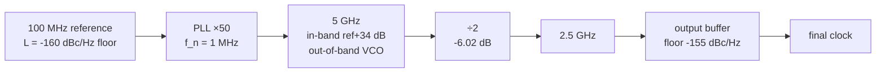

import NumericQuiz from "@site/src/components/NumericQuiz";

> **β**: This English translation is in beta — the Traditional-Chinese original is the authoritative version.

# Clock-chain noise accounting: ×N, ÷N, PLL, buffer — a one-page lookup table

> **Prerequisites**: [psd_phase_noise_jitter](/02_foundations/psd_phase_noise_jitter) ($S_\phi$, $\mathcal{L}$, phase↔time conversion), [pll_noise_budget](/06_design_insights/pll_noise_budget) ($\lvert H_{lp}\rvert^2,\lvert H_{hp}\rvert^2$ and the five-source budget — this page reuses them directly, **no re-derivation**), [white_noise_to_phase_noise](/03_isf_core_theory/white_noise_to_phase_noise) (where the VCO's $-148$ dBc/Hz comes from) | **Next**: [serdes_clocking_connection](/06_design_insights/serdes_clocking_connection), [exercises](/06_design_insights/exercises)

In a real system there is no such thing as "one oscillator, used directly": the reference crystal is multiplied up by a PLL, divided back down by dividers, and passes through several buffer stages before reaching the sampler. The system engineer's daily question is: **given the source $\mathcal{L}(f)$, what is $\mathcal{L}(f)$ at every node of the clock tree? What is the integrated jitter of the final clock?**
The good news: bookkeeping for the entire chain needs only **four rules**. This page derives each of the four rules **step by step** (no skipped steps, with units, with failure conditions), then strings them together in one complete worked chain, computed all the way to the end.

> **Physical intuition (conclusion first)**: only two kinds of things ever happen to phase along a clock chain —
> **(1) Deterministic phase scaling**: ×N multiplies phase by $N$ ($+20\log_{10}N$ dB), ÷N divides phase by $N$
> ($-20\log_{10}N$ dB), a PLL applies ×N to the reference in-band and low-passes it, and high-passes the VCO.
> Scaling acts on the **entire curve**; the offset axis does not move.
> **(2) Additive independent noise**: the buffer's and divider's own noise floor, uncorrelated with the input phase,
> **adds in power** (never in dB).
> There is also one beautiful **conserved quantity**: under ideal ×N/÷N, **the time jitter $\sigma_t$ in seconds is exactly unchanged** —
> what changes is only "what angular fraction of one period the same error in seconds occupies".

## Step 0: the one-page lookup table (conclusions first, derivations below)

| Component | Phase relation | $\mathcal{L}(f)$ accounting | Main failure conditions |
|---|---|---|---|
| Ideal ×N multiplier | $\phi_{out}=N\,\phi_{in}$ | $\mathcal{L}+20\log_{10}N$ (entire curve shifted) | small-angle approximation ($\sigma_\phi\times N$ grows), offset near $f_{ref}/2$ |
| Ideal ÷N divider | $\phi_{out}=\phi_{in}/N$ | $\mathcal{L}-20\log_{10}N$ | sampling foldover (offset near $f_{out}/2$), divider's own floor |
| Through a PLL (×N) | in-band follows ref, out-of-band follows VCO | $N^2S_{ref}\lvert H_{lp}\rvert^2+S_{vco}\lvert H_{hp}\rvert^2$ | the pure second-order loop's ref tail (computed in Step 6 of this page) |
| buffer / divider floor | $\phi_{out}=\phi_{in}+\phi_{add}$ | $10\log_{10}\big(10^{\mathcal{L}_{in}/10}+10^{\mathcal{L}_{buf}/10}\big)$ | correlated noise (shared supply/bias) cannot simply be power-added |

**Convention statement (factor-of-2 discipline, consistent throughout this page)**: every $\mathcal{L}$ on this page is **SSB (single-sideband) dBc/Hz**,
converted from $S_\phi$ via the small-angle approximation $\mathcal{L}=\tfrac12 S_\phi$ (canonical formula 16; `noise_utils` uses the same convention).
The worked chain's VCO anchor of $-148$ dBc/Hz @ 1 MHz is the site's canonical example B, using the
**"/4" SSB accounting** of [P1] Eq.(21), p.185; the clean time-domain derivation's "/2" version gives $-145$ (the famous 3 dB convention dispute, see
[white_noise_to_phase_noise](/03_isf_core_theory/white_noise_to_phase_noise)). The four rules on this page
($\pm20\log_{10}N$, power addition) are themselves **ratio operations**: as long as input and output use the same convention, /2 or /4 cancels,
and the rules' numbers are convention-independent — which is why the accounting rules can safely be used as a lookup table.

## Rule 1: ideal ×N multiplication — why it is $+20\log_{10}N$

**Step 1 (write the signal as a function of phase).** Using the decomposition of [P1] Eq.(1), p.181, take a sinusoidal waveform:

$$
V_{in}(t)=\cos\big(\Phi_{in}(t)\big),\qquad \Phi_{in}(t)=\omega_{ref}\,t+\phi_{in}(t)
$$

$\Phi_{in}$ is the **total phase** (rad), $\phi_{in}$ is the excess phase (rad), $\omega_{ref}=2\pi f_{ref}$ (rad/s).

**Step 2 (ideal multiplier = memoryless nonlinearity + bandpass).** Any memoryless nonlinearity $g(\cdot)$ acting on
$\cos\Phi$: because $g(\cos\Phi)$ is a $2\pi$-periodic function of $\Phi$, it can be expanded as a Fourier series in $\Phi$:

$$
g\big(\cos\Phi(t)\big)=\sum_{k=0}^{\infty}a_k\cos\big(k\,\Phi(t)+\theta_k\big)
$$

The key is the argument: every term is "**an integer multiple of the instantaneous total phase**, $k\Phi(t)$" — a memoryless element has no notion of time,
it can only act on "the phase right now", so the excess phase is carried along **completely intact**.

**Step 3 (bandpass selects the $N$-th harmonic).** A bandpass filter centered at $N f_{ref}$ picks the $k=N$ term:

$$
V_{out}(t)\propto\cos\big(N\Phi_{in}(t)\big)=\cos\big(N\omega_{ref}\,t+N\phi_{in}(t)\big)
\quad\Longrightarrow\quad \boxed{\ \phi_{out}(t)=N\,\phi_{in}(t)\ }
$$

This identity holds **instant by instant** — every frequency component of $\phi_{in}$ is multiplied by $N$, with no frequency selectivity whatsoever.

**Step 4 (convert to PSD and dB).** Phase multiplied by $N$ (amplitude), power spectral density multiplied by $N^2$:

$$
S_{\phi,out}(f)=N^2\,S_{\phi,in}(f)\ \ [\text{rad}^2/\text{Hz}],\qquad
\mathcal{L}_{out}(f)=\mathcal{L}_{in}(f)+20\log_{10}N\ \ [\text{dBc/Hz}]
$$

The second equation used $\mathcal{L}=\tfrac12 S_\phi$ — input and output use **the same convention**, the $\tfrac12$ cancels, so
$+20\log_{10}N$ is independent of the /2-vs-/4 convention. For $N=50$, $+20\log_{10}50=+33.98$ dB $\approx+34$ dB.

- **Physical meaning**: multiplication **creates no noise**. It magnifies "the same absolute time jitter" into an $N$-times larger **angle** —
  one output period is only $1/N$ as long as the input's, so the same error in seconds occupies $N$ times the fraction of an output period.
- **The offset axis does not move (common mistake)**: what gets multiplied by $N$ is the **phase amplitude**, not the rhythm of the phase fluctuations.
  The entire $\mathcal{L}$ curve shifts **vertically up** by $20\log_{10}N$; the horizontal axis (offset $f$) is completely unchanged.
- **Dimension check**: $N$ dimensionless, $\phi$ in rad, $S_\phi$ in rad²/Hz, $20\log_{10}N$ in dB ✓.
- **Time-jitter conservation**: $\Delta t_{out}=\dfrac{\phi_{out}}{2\pi N f_{ref}}=\dfrac{N\phi_{in}}{2\pi N f_{ref}}
  =\dfrac{\phi_{in}}{2\pi f_{ref}}=\Delta t_{in}$ — the edge error **in seconds** is unchanged (verified numerically in Step 5 below).

**Failure conditions**: (1) **small-angle approximation** — $\sigma_{\phi,out}=N\sigma_{\phi,in}$; for large $N$ (e.g.
$N=1000$, $+60$ dB) it can approach 1 rad, $\mathcal{L}\approx\tfrac12 S_\phi$ collapses, and the carrier energy redistributes
into a Lorentzian (the linewidth diffusion constant $D$ is magnified by $N^2$, see
[lorentzian_linewidth](/03_isf_core_theory/lorentzian_linewidth)); (2) **sideband overlap** — for offsets near
$f_{ref}/2$ the skirts of the $N\pm1$ harmonics mix into the bandpass; (3) real multipliers have their own additive floor (Rule 4).

## Rule 2: ideal ÷N division — the rigorous origin of $-20\log_{10}N$

The [quadrature_and_coupled_oscillators](/06_design_insights/quadrature_and_coupled_oscillators) page, in the
÷2-generates-I/Q section, directly cites $\mathcal{L}_{out}=\mathcal{L}_{in}-20\log_{10}N$; **this is the rigorous derivation's home
for that equation**, and the two pages' numbers agree (÷2 is $-6.02$ dB).

**Step 1 (timing of the input edges).** The $k$-th input rising zero crossing $t_k$ is defined by the total phase:
$\Phi_{in}(t_k)=2\pi k$. Substituting $\Phi_{in}=\omega_{ref}t+\phi_{in}(t)$ and solving:

$$
t_k=k\,T_{ref}-\frac{\phi_{in}(t_k)}{\omega_{ref}}
\qquad\Longrightarrow\qquad
\delta t_k=-\frac{\phi_{in}(kT_{ref})}{\omega_{ref}}
$$

The second equation used "$\phi$ slowly varying" (offset $\ll f_{ref}$) to replace $\phi_{in}(t_k)$ with $\phi_{in}(kT_{ref})$.
**Dimension check**: $[\text{rad}]/[\text{rad/s}]=[\text{s}]$ ✓.

**Step 2 (a divider only drops edges, never moves them).** An ideal ÷N is an edge-picking machine: for every $N$ input
edges it outputs one, and the output edge's time **is exactly** the time of the selected input edge. So the absolute time error
$\delta t$ passes to the output **completely intact**:

$$
\delta t^{(out)}_m=\delta t_{mN}
$$

**Step 3 (fold the time error back into the output carrier's phase).** The output carrier is $\omega_{out}=\omega_{ref}/N$. The output
excess phase follows from the same phase definition in reverse ($\Phi_{out}(t'_m)=2\pi m$, $t'_m=mT_{out}+\delta t_m$):

$$
\phi_{out}=-\,\omega_{out}\,\delta t^{(out)}
=\frac{\omega_{out}}{\omega_{ref}}\,\phi_{in}
\qquad\Longrightarrow\qquad
\boxed{\ \phi_{out}=\frac{\phi_{in}}{N}\ }
$$

**Step 4 (PSD and dB).**

$$
S_{\phi,out}(f)=\frac{S_{\phi,in}(f)}{N^2},\qquad
\mathcal{L}_{out}(f)=\mathcal{L}_{in}(f)-20\log_{10}N
$$

÷2 is $-20\log_{10}2=-6.02$ dB. **Physical meaning**: the same jitter in seconds, spread over a period $N$ times longer,
is an angle $N$ times smaller. Perfectly symmetric with Rule 1: ×N then ÷N brings $\mathcal{L}$ back to where it started, and $\sigma_t$ (seconds) is unchanged throughout.

<NumericQuiz
  prompt="Try it yourself first: the change in L(f) from an ideal ÷2 divider = ? (answer in dB, include the sign)"
  answer={-6.02}
  tol={0.01}
  unit="dB"
  hint="ΔL = −20·log₁₀N, with N=2."
  solutionNote="−20·log₁₀(2) ≈ −6.02 dB (perfectly symmetric with Rule 1's +20log₁₀N)."
/>

**Failure conditions (both matter)**:

1. **Sampling foldover (aliasing)**: $\phi_{out}$ is defined only at the output edge instants — this is a system sampled at $\sim f_{out}$.
   Components of the input phase noise at offsets above $\sim f_{out}/2$ **fold back** into the output band; for a flat
   wideband noise floor, division **does not earn the full** $20\log_{10}N$ (foldover stacks the power back).
   The clean $-20\log_{10}N$ holds only for close-in noise at offsets $\ll f_{out}$. (External literature, not among the five source PDFs; for the standard divider
   noise model see Egan at the end of this page.)
2. **The divider's own floor**: real dividers (CML latch, TSPC) have their own additive floor (Rule 4), often higher than
   "the cleanly divided-down signal" — after division **the output can never be better than the divider's own floor**.

> **Relation to [P4]**: an injection-locked frequency divider (ILFD) uses the ISF's 2nd harmonic to lock $2f_0$ to $f_0$, implementing ÷2
> ([P4], frequency division in Part II, see
> [paper_004](/05_paper_deep_dives/paper_004_injection_locking_part2)). The ÷N phase accounting
> ($\phi/N$) holds equally for the ILFD's carrier path; but an ILFD near the edge of its lock range has its own noise behavior,
> outside this page's ideal accounting.

## Rule 3: through a PLL — the reference goes "×N + lowpass", the VCO goes "highpass"

A PLL is the **closed-loop implementation** of Rule 1: the divider brings the output back to $f_{ref}$ for phase comparison, which forces "output phase
$=N\times$ reference phase" — so reference noise first takes $+20\log_{10}N$ (Rule 1), and is **then** shaped by the closed-loop
lowpass $\lvert H_{lp}\rvert^2$; the VCO's own noise is shaped by the highpass $\lvert H_{hp}\rvert^2$:

$$
S_{out}(f)=N^2\,S_{ref}(f)\,\lvert H_{lp}(f)\rvert^2+S_{vco}(f)\,\lvert H_{hp}(f)\rvert^2
\qquad[\text{rad}^2/\text{Hz}]
$$

The two transfer functions (type-II second order, $\omega_n,\zeta$) and the full five-source budget were derived step by step and verified in
[pll_noise_budget](/06_design_insights/pll_noise_budget); this page **reuses them directly without re-deriving**
(that page also includes the charge-pump floor $S_{cp}\lvert H_{lp}\rvert^2$; to keep this page's worked chain focused on the four rules,
the CP floor is folded conceptually into the "in-band floor" and omitted numerically, marked illustrative). The **brick-wall
accounting** used for the lookup table is its asymptotic version:

- **in-band ($f\ll f_n$)**: $\lvert H_{lp}\rvert^2\to1$, $\lvert H_{hp}\rvert^2\to0$ ⇒
  $\mathcal{L}_{out}\approx\mathcal{L}_{ref}+20\log_{10}N$.
- **out-of-band ($f\gg f_n$)**: $\lvert H_{lp}\rvert^2\to0$, $\lvert H_{hp}\rvert^2\to1$ ⇒
  $\mathcal{L}_{out}\approx\mathcal{L}_{vco}$ (the free-running VCO skirt).
- Take the crossover at the loop bandwidth $f_n$.

**Dimension check**: all $S$ in rad²/Hz, $N^2$ and $\lvert H\rvert^2$ dimensionless ✓.
The brick-wall version is convenient but has one famous trap — **the pure second-order loop's reference tail**, laid out numerically in Step 6.

## Rule 4: the buffer/divider additive floor — power addition, never dB addition

**Step 1 (why a buffer is "additive").** A buffer regenerates edges: at the instant the input waveform crosses
the switching threshold, the noise voltage $v_n$ (V) of the buffer's internal devices sits on top of the threshold and displaces the output edge by

$$
\Delta t_{add}=\frac{v_n(t_k)}{SR}\qquad
\Big[\frac{\text{V}}{\text{V/s}}=\text{s}\Big]\ \checkmark
$$

($SR$ = slew rate at the threshold crossing, V/s. This is the same physics as
[waveform_slope](/06_design_insights/waveform_slope)'s "most sensitive where the slope is small".)
$v_n$ comes from the buffer's own devices and is **uncorrelated** with the input clock's phase.

**Step 2 (uncorrelated ⇒ PSDs add).** In phase this is pure addition:

$$
\phi_{out}=\phi_{in}+\phi_{add}
\qquad\Longrightarrow\qquad
S_{\phi,out}(f)=S_{\phi,in}(f)+S_{buf}(f)
$$

(The cross term $\langle\phi_{in}\phi_{add}\rangle=0$.) Converting to dBc/Hz gives the lookup-table formula — note you must
**convert to linear first, add, then convert back to dB**:

$$
\boxed{\ \mathcal{L}_{out}(f)=10\log_{10}\Big(10^{\mathcal{L}_{in}(f)/10}+10^{\mathcal{L}_{buf}(f)/10}\Big)\ }
$$

Both $\mathcal{L}$ are SSB on the same carrier with the same convention; the $\tfrac12$ of $\mathcal{L}=\tfrac12 S_\phi$
cancels on both sides — so accounting directly in $\mathcal{L}$ is legitimate, independent of the /2-vs-/4 convention.

**Step 3 (multiplicative vs additive — the most important classification on this page).**
Rules 1–3 are **multiplicative**: they scale/shape the incoming phase curve as a whole; a clean source gives a clean output.
Rule 4 is **additive**: the buffer injects **new, independent** noise, and **the output can never be better than the buffer's own floor** —
however clean the source, one noisy buffer stage ruins it. That is what "floor dominates" means.

**Step 4 (when the floor takes over — the dB-addition table).** Let the signal sit $\Delta$ dB above the floor; the penalty is
$10\log_{10}(1+10^{-\Delta/10})$:

| $\Delta=\mathcal{L}_{in}-\mathcal{L}_{buf}$ | Output above $\mathcal{L}_{in}$ by | Who dominates |
|---|---|---|
| $+20$ dB (signal much higher) | $+0.04$ dB | floor completely invisible |
| $+10$ dB | $+0.41$ dB | floor starting to show |
| $+6$ dB | $+0.97$ dB | — |
| $+3$ dB | $+1.76$ dB | — |
| $0$ dB (equal) | $+3.01$ dB | half and half |
| $-10$ dB (signal below floor) | output $\approx\mathcal{L}_{buf}+0.41$ | **floor dominates, output is clamped** |

**Step 5 (flat floor ⇒ white phase noise ⇒ one easy-to-remember jitter formula).** A flat
$\mathcal{L}_{buf}$ is white phase noise; its own rms jitter contribution over an integration bandwidth $B$ (Hz):

$$
\sigma_{t,add}=\frac{1}{2\pi f_0}\sqrt{2\cdot10^{\mathcal{L}_{buf}/10}\cdot B}
$$

(The $2\times$ is the small-angle $\mathcal{L}\to S_\phi$ conversion, canonical formula 16; then integrate with canonical formula 19.)
Numbers: $\mathcal{L}_{buf}=-155$ dBc/Hz, $B\approx100$ MHz, $f_0=2.5$ GHz:
$\sigma_{t,add}=\sqrt{2\times3.16\times10^{-16}\times10^8}\,/(2\pi\times2.5\times10^9)
=2.51\times10^{-4}/1.571\times10^{10}=16.0$ fs.
**Dimension check**: $\sqrt{[\text{rad}^2/\text{Hz}]\cdot[\text{Hz}]}=[\text{rad}]$,
$[\text{rad}]/[\text{rad/s}]=[\text{s}]$ ✓. (This 16.0 fs will reappear, unchanged, in the worked chain's breakdown below.)

<NumericQuiz
  prompt="Try it yourself first: with a flat buffer floor L_buf=−155 dBc/Hz, integration bandwidth B=100 MHz, f₀=2.5 GHz, σ_t,add = ? (answer in fs)"
  answer={16.0}
  tol={0.02}
  unit="fs"
  hint="σ_t,add = √(2·10^(L_buf/10)·B) / (2π f₀)."
  solutionNote="√(2×3.16×10⁻¹⁶×10⁸)/(2π×2.5×10⁹) ≈ 16.0 fs (this number reappears in the worked chain's breakdown below)."
/>

The four rules' constants are first pinned down with a checkable Python block (the values after `# ->` are actual run output):

```python
import numpy as np
print(round(20*np.log10(50), 2))   # -> 33.98
print(round(20*np.log10(2), 2))    # -> 6.02
print(round(10*np.log10(1 + 10**(-20/10)), 2))  # -> 0.04
print(round(10*np.log10(1 + 10**(-10/10)), 2))  # -> 0.41
print(round(10*np.log10(1 + 10**(-6/10)), 2))   # -> 0.97
print(round(10*np.log10(1 + 10**(-3/10)), 2))   # -> 1.76
print(round(10*np.log10(1 + 10**(0/10)), 2))    # -> 3.01
```

## Step 5: the conserved quantity — under ideal ×N/÷N, $\sigma_t$ (seconds) is unchanged

Put the conclusions of Rules 1 and 2 side by side: ×N gives $\phi\times N$ while the carrier gets $f_0\times N$; ÷N gives $\phi/N$ while
$f_0/N$. Substituting into $\Delta t=\phi/(2\pi f_0)$ (canonical formula 17), the two $N$'s cancel:

$$
\sigma_{t,out}=\frac{\sigma_{\phi,out}}{2\pi f_{0,out}}
=\frac{N^{\pm1}\,\sigma_{\phi,in}}{2\pi\,N^{\pm1} f_{0,in}}=\sigma_{t,in}
$$

**Time jitter in seconds is the invariant of ideal multiplication/division.** The $\mathcal{L}$ that got worse (or better) is only
a change in the exchange rate "the same error in seconds converted to angle". This gives you an extremely useful sanity check: on any chain segment
that is "pure ×N/÷N with no additive floor", the $\sigma_t$ computed at both ends **over the same integration band** must be equal.
Verify with the worked chain's numbers (the 5 GHz stage vs the 2.5 GHz after ideal ÷2, both without the buffer):

```python
import numpy as np
from simulations.common.noise_utils import integrate_rms_jitter
f = np.logspace(4, 8, 20001)
L5G = np.where(f <= 1e6, -126.02, -148.0 - 20*np.log10(f/1e6))
st5, _ = integrate_rms_jitter(f, L5G, f0=5e9, fmin=1e4, fmax=1e8)
st25, _ = integrate_rms_jitter(f, L5G - 6.02, f0=2.5e9, fmin=1e4, fmax=1e8)
print(round(st5*1e15, 1))    # -> 22.5
print(round(st25*1e15, 1))   # -> 22.5
```

The two 22.5 fs values are identical — ÷2 improved $\mathcal{L}$ by 6 dB yet **saved not a single fs**.
For SerDes this is actually the flip side of bad news: converted to UI, $\sigma_t$ is unchanged while the UI gets longer,
so after division the "fraction of a UI" does shrink — what you save is a **ratio**, not seconds.

## Step 6: worked chain — 100 MHz → ×50 PLL → 5 GHz → ÷2 → 2.5 GHz → buffer

Now string the four rules into a realistically shaped chain. All values are representative/illustrative
(not a specific silicon process) but fully consistent with the site's canonical numbers.



**Parameter table:**

| Quantity | Value | Unit | Notes |
|---|---|---|---|
| $f_{ref}$ | 100 | MHz | reference frequency |
| $\mathcal{L}_{ref}$ | $-160$ (flat floor) | dBc/Hz | far-out floor of a clean reference (illustrative; a real crystal's close-in tilts up, this page only looks at $\ge10$ kHz) |
| $N$ | 50 | — | $100\ \text{MHz}\to5\ \text{GHz}$ |
| $f_n,\ \zeta$ | 1 MHz, 0.707 | Hz, — | type-II second-order loop (reused from [pll_noise_budget](/06_design_insights/pll_noise_budget)) |
| VCO | $\mathcal{L}(1\,\text{MHz})=-148$, $1/f^2$ | dBc/Hz | site canonical example B ([P1] Eq.(21), p.185, /4 SSB convention) |
| ÷N | 2 | — | $5\to2.5$ GHz |
| $\mathcal{L}_{buf}$ | $-155$ (flat floor) | dBc/Hz | the output buffer's additive floor |
| Integration band | $10^4$–$10^8$ | Hz | final jitter integration |

### 6.1 Per-stage $\mathcal{L}$: 100 kHz for in-band, 10 MHz for out-of-band

Step-by-step hand calculation (brick-wall accounting):

1. **Reference**: flat floor ⇒ $-160.00$ at both offsets.
2. **PLL output (5 GHz)**:
   - in-band ($100\ \text{kHz}\ll f_n$): Rule 3 ⇒ $-160+20\log_{10}50=-160+33.98=-126.02$.
   - out-of-band ($10\ \text{MHz}\gg f_n$): free-running VCO, $1/f^2$ extrapolated from the 1 MHz anchor:
     $-148-20\log_{10}(10)= -168.00$.
3. **÷2 (2.5 GHz)**: Rule 2, entire curve $-6.02$ dB ⇒ $-132.04$ and $-174.02$.
4. **Output buffer**: Rule 4, power-add against the $-155$ floor:
   - 100 kHz: signal $-132.04$ is 22.96 dB **above** the floor ⇒ penalty $\approx0.02$ dB ⇒ $-132.02$ (floor invisible).
   - 10 MHz: signal $-174.02$ is 19 dB **below** the floor ⇒ **floor dominates** ⇒ $-154.95$ (clamped near $-155$).

| Node | Carrier | $\mathcal{L}$(100 kHz) [dBc/Hz] | $\mathcal{L}$(10 MHz) [dBc/Hz] | Dominant rule |
|---|---|---|---|---|
| Reference | 100 MHz | $-160.00$ | $-160.00$ | — |
| PLL ×50 output | 5 GHz | $-126.02$ | $-168.00$ | Rule 3 (in-band ref+34; out-of-band VCO) |
| After ÷2 | 2.5 GHz | $-132.04$ | $-174.02$ | Rule 2 ($-6.02$) |
| + buffer (final) | 2.5 GHz | $-132.02$ | $-154.95$ | Rule 4 (floor dominates at 10 MHz) |

The same table pinned down with checkable Python:

```python
import numpy as np
L_ref = -160.0
L_in = L_ref + 20*np.log10(50)               # Rule 1/3: in-band = ref + 20logN
print(round(L_in, 2))                        # -> -126.02
L_vco_10M = -148.0 - 20*np.log10(10e6/1e6)   # VCO 1/f²: extrapolate from the 1 MHz anchor to 10 MHz
print(round(L_vco_10M, 2))                   # -> -168.0
div = -20*np.log10(2)                        # Rule 2
print(round(L_in + div, 2))                  # -> -132.04
print(round(L_vco_10M + div, 2))             # -> -174.02
def padd(*Ls): return 10*np.log10(sum(10**(L/10) for L in Ls))
print(round(padd(L_in + div, -155.0), 2))    # -> -132.02
print(round(padd(L_vco_10M + div, -155.0), 2))  # -> -154.95
```

### 6.2 Integrated jitter of the final 2.5 GHz clock (10 kHz–100 MHz)

Brick-wall model of the final curve: in-band floor $-132.04$ (up to $f_n=1$ MHz), then the ÷2'd VCO skirt
(1 MHz anchor $-148-6.02=-154.02$, $1/f^2$), all power-added with the $-155$ buffer floor throughout.
Hand-integrating with canonical formulas 18/19 ($\mathcal{L}\to S_\phi=2\times10^{\mathcal{L}/10}$):

$$
\begin{aligned}
\text{in-band floor:}\quad
\sigma_{\phi,1}^2&=2\times10^{-13.204}\times(10^6-10^4)=1.250\times10^{-13}\times9.9\times10^5
=1.238\times10^{-7}\ \text{rad}^2,\\[2pt]
\text{VCO skirt:}\quad
\sigma_{\phi,2}^2&=2\times10^{-15.402}\,(10^6)^2\!\left(\frac{1}{10^6}-\frac{1}{10^8}\right)
=7.9\times10^{-10}\ \text{rad}^2,\\[2pt]
\text{buffer floor:}\quad
\sigma_{\phi,3}^2&=2\times10^{-15.5}\times(10^8-10^4)=6.32\times10^{-8}\ \text{rad}^2,\\[4pt]
\sigma_\phi&=\sqrt{1.238\times10^{-7}+7.9\times10^{-10}+6.32\times10^{-8}}
=4.33\times10^{-4}\ \text{rad},\\[2pt]
\sigma_t&=\frac{\sigma_\phi}{2\pi\times2.5\times10^9}=27.6\ \text{fs}.
\end{aligned}
$$

**Dimension check**: $[\text{rad}^2/\text{Hz}]\times[\text{Hz}]=[\text{rad}^2]$ ✓;
$[\text{rad}]/[\text{rad/s}]=[\text{s}]$ ✓. Verified with `noise_utils` (same convention $S_\phi=2\mathcal{L}$):

```python
import numpy as np
from simulations.common.noise_utils import integrate_rms_jitter
f = np.logspace(4, 8, 20001)
L_core = np.where(f <= 1e6, -132.04, -154.02 - 20*np.log10(f/1e6))
L_tot = 10*np.log10(10**(L_core/10) + 10**(-155.0/10))
st, sp = integrate_rms_jitter(f, L_tot, f0=2.5e9, fmin=1e4, fmax=1e8)
print(round(st*1e15, 1))   # -> 27.6
print(round(sp*1e6, 1))    # -> 433.4
```

**Who contributed these 27.6 fs?** (breakdown from an actual run of `simulations/fig_clock_chain.py`, power ratios)

| Source | Standalone $\sigma_t$ | Share of $\sigma_\phi^2$ |
|---|---|---|
| in-band floor (reference $\times N^2$) | 22.4 fs | 65.9 % |
| buffer floor | 16.0 fs | 33.7 % |
| VCO skirt | 1.78 fs | 0.42 % |
| **RSS total** | **27.6 fs** | 100 % |

> **This table is the most important design message on this page**: this chain's jitter is split between "the in-band floor
> raised by $\times N^2$" and "the unremarkable buffer floor"; that beautiful $-148$ dBc/Hz VCO is nearly **invisible** (0.42 %).
> Spending effort improving the VCO further is wasted work — do the accounting first, so the effort goes where it counts.
> (The buffer's 16.0 fs is exactly the number from Rule 4's Step-5 formula.)

### 6.3 Corresponding simulation figure

**Full script: `simulations/fig_clock_chain.py`** (to run: from the project root,
`PYTHONPATH=. python3 simulations/fig_clock_chain.py` — it prints every `# ->` number on this page and produces the figure).


**How to read it**: in the left panel, the blue line is the 5 GHz brick-wall (in-band $-126$ plateau + VCO skirt past 1 MHz),
the green line is the same curve shifted down 6.02 dB (÷2), the orange dotted line is the $-155$ buffer floor, and the thick black line is the final output —
$-132.0$ at 100 kHz, clamped by the floor at $-154.9$ at 10 MHz. The right panel is the cumulative jitter "integrated from 10 kHz to $f$":
the in-band floor accumulates 22 fs before 1 MHz, after which the buffer floor slowly pushes the total to 27.6 fs;
the dashed red line (full type-II shaping) stays above the brick-wall around and beyond $f_n$ — that is the trap the next step lays open.

## Step 7: honest comparison — brick-wall lookup vs full type-II shaping

Brick-wall is lookup-table-grade approximation. Computing with
[pll_noise_budget](/06_design_insights/pll_noise_budget)'s actual $\lvert H_{lp}\rvert^2$
(`pll_utils`, $f_n=1$ MHz, $\zeta=0.707$), the difference at the two offsets is plain:

- **in-band (100 kHz)**: shaped $-131.9$ vs brick-wall $-132.0$ — only 0.1 dB apart
  (slight peaking of $\lvert H_{lp}\rvert^2$ at $f_n/10$). The lookup table is **reliable** ✓.
- **out-of-band (10 MHz)**: shaped $-148.0$ vs brick-wall $-154.9$ — **7 dB apart**!

The reason: the type-II second-order closed loop's zero makes $\lvert H_{lp}\rvert^2$ roll off at only $-20$ dB/dec for $f\gg f_n$
($\lvert H_{lp}\rvert^2\approx(2\zeta f_n/f)^2$), so the reference floor raised by $\times N^2$ leaks a
**$-20$ dB/dec tail** into the out-of-band region; and the VCO skirt is **also** $-20$ dB/dec — the two lines are parallel,
**the gap is constant and can never be closed**:

```python
import numpy as np
from simulations.common.pll_utils import H_lowpass_mag2
S_refN2 = 2 * 10**(-126.02/10)          # N²·S_ref (S_phi of the in-band floor) [rad²/Hz]
lp = H_lowpass_mag2(10e6, 1e6)          # |H_lp|² @ 10 MHz, fn = 1 MHz
L_refpath = 10*np.log10(0.5 * S_refN2 * lp)
print(round(L_refpath, 1))              # -> -143.0
print(round(L_refpath - (-168.0), 1))   # -> 25.0
```

The reference tail at 10 MHz is $-143.0$ dBc/Hz (5 GHz carrier), **25 dB above** the VCO's $-168$ —
and because both have the same slope, these 25 dB hold at **every** out-of-band offset. The lookup-table cell
"out-of-band = VCO" is, for a pure second-order loop, **simply unreachable**. The consequence for integrated jitter
(actual run of `fig_clock_chain.py`):

| Model | Final $\sigma_t$ (10 kHz–100 MHz) |
|---|---|
| brick-wall lookup | 27.6 fs |
| type-II second-order full shaping | 44.0 fs ($+59\%$) |
| second order + 3rd pole @ 3 MHz (illustrative) | 38.6 fs |

**How to fix it**: real synthesizers add a **third pole** to the loop filter (plus higher-order post-filters) precisely for this,
turning the ref tail into $-40$ dB/dec or steeper; the third row above shows one 3 MHz pole cutting the damage by a third
(the pole-placement vs loop-stability trade-off belongs to the standard PLL literature — external literature, not among the five source PDFs).

**One level more honest**: this chain's $f_n=1$ MHz was never the jitter-optimal choice to begin with — the crossover of the in-band floor ($-126$) and
the VCO skirt sits at $79.6$ kHz, far below 1 MHz. Sweeping $f_n$ for this chain with
[pll_noise_budget](/06_design_insights/pll_noise_budget)'s U-curve method
(shaped model, 3rd pole tracking at $3f_n$): the minimum is at $f_n^\*\approx53$ kHz, $\sigma_t\approx19.6$ fs.
**Lookup accounting (this page) tells you each stage's bill; loop optimization (that page) tells you how to change the bill** — two different things, don't mix them.

## Design-knobs checklist

| Knob | Which rule it acts on | How to turn it |
|---|---|---|
| Division ratio $N$ (reference frequency) | Rules 1/3: in-band floor $\propto N^2$ | 65.9% of this chain's jitter power comes from ref$\times N^2$; raising $f_{ref}$ to lower $N$ is the most effective move |
| Buffer floor $\mathcal{L}_{buf}$ | Rule 4 | 33.7% comes from one $-155$ floor stage; increase buffer current/slew ($\Delta t=v_n/SR$) to push the floor down; the fewer stages the better |
| Where to place the ÷N | Rules 2 + 4 | ÷N only divides the noise "upstream of it"; only when placed **after** the noisy source do you enjoy $-20\log_{10}N$, and downstream buffer floors still add at full value |
| Loop BW $f_n$ | Rule 3 | this chain's optimum is $f_n^\*\approx53$ kHz (not 1 MHz); the 79.6 kHz crossover is the first-order intuition |
| Loop order (3rd pole) | Rule 3 | the pure second-order ref tail runs parallel to the VCO (a constant $+25$ dB in this example); only higher-order poles let out-of-band truly hand over to the VCO |
| VCO $\Gamma_{rms}/q_{max}$ | Rule 3's $S_{vco}$ | this chain's VCO is only 0.42% — **do the accounting before deciding to touch it** (for ISF knobs see [tank_swing](/06_design_insights/tank_swing), [lc_vs_ring](/06_design_insights/lc_vs_ring)) |

## Connection to SerDes

The final 2.5 GHz clock's $\sigma_t=27.6$ fs feeds directly into
[serdes_clocking_connection](/06_design_insights/serdes_clocking_connection)'s eye/BER machinery:
if this clock drives a 5 Gb/s half-rate link (UI $=200$ ps), the RJ overhead at BER $=10^{-12}$ ($Q^{-1}\approx7.03$,
site canonical) is $2\times7.03\times27.6\ \text{fs}=0.39$ ps $=0.19\%$ UI — quite healthy;
but note every extra buffer stage in the clock tree adds another Rule-4 floor (power addition) — in a high-fan-out tree the buffers
alone can eat the whole budget. Accumulated jitter of the free-running segment ([P2] Eq.(8), p.792,
$\sigma_{\Delta t}=\kappa\sqrt{\Delta t}$) is high-pass truncated once it enters the PLL/CDR loop —
in this chain, "who free-runs and who is locked" determines which noise accumulates and which does not (Step 6 of that page).

## Applicability and failure conditions

| Condition | When it holds | When it fails |
|---|---|---|
| Small-angle approximation ($\sigma_\phi\ll1$ rad) | $\mathcal{L}=\tfrac12 S_\phi$ and the $\pm20\log_{10}N$ lookup hold | after large-$N$ multiplication $\sigma_\phi\times N$ grows → Lorentzian redistribution ([lorentzian_linewidth](/03_isf_core_theory/lorentzian_linewidth)) |
| offset $\ll f_{ref}/2$ (×N), $\ll f_{out}/2$ (÷N) | clean $\pm20\log_{10}N$ | sideband overlap / sampling foldover; a flat floor does not earn the full $-20\log_{10}N$ |
| Per-stage noise uncorrelated | Rule-4 power addition | correlated noise sharing supply/bias (e.g. PSIJ) needs the cross terms, may add in phase |
| Brick-wall PLL accounting | in-band lookup error $\sim0.1$ dB | pure second-order loop: ref tail parallel to VCO (constant 25 dB gap in this example), the out-of-band cell can be off by 7 dB, $\sigma_t$ underestimated by 59% |
| Ideal edge-picking divider | $-20\log_{10}N$ | real divider's own floor (Rule 4) dominates first; ILFD near the lock-range edge is a separate story ([P4]) |

## Key takeaways

- The four rules: **×N adds $20\log_{10}N$** ($\phi_{out}=N\phi_{in}$, offset axis unchanged);
  **÷N subtracts $20\log_{10}N$** (edge-picking, time error intact, angle divided by $N$);
  **PLL** = reference through $N^2\lvert H_{lp}\rvert^2$, VCO through $\lvert H_{hp}\rvert^2$
  (transfer functions reused from [pll_noise_budget](/06_design_insights/pll_noise_budget));
  **buffer/divider floor = power addition**, $\mathcal{L}_{out}=10\log_{10}(10^{\mathcal{L}_{in}/10}+10^{\mathcal{L}_{buf}/10})$.
- Conserved quantity: under ideal ×N/÷N, **$\sigma_t$ (seconds) is unchanged** (both ends 22.5 fs in this example); ÷N saves "fraction of a UI", not seconds.
- Worked chain (100 MHz→×50→5 GHz→÷2→2.5 GHz→buffer): at 100 kHz, $-160\to-126.02\to-132.04\to-132.02$;
  at 10 MHz, $-160\to-168.00\to-174.02\to-154.95$ (floor dominates).
- Final integrated jitter (10 kHz–100 MHz) = **27.6 fs**; breakdown = ref$\times N^2$ floor 65.9% + buffer floor 33.7% + VCO 0.42% —
  **accounting first, don't blindly upgrade the VCO**.
- Honest comparison: the pure type-II second-order loop's ref tail runs **parallel** to the VCO skirt (a constant $+25$ dB here),
  shaped $\sigma_t=44.0$ fs (59% above the lookup); adding a 3rd pole (3 MHz) → 38.6 fs;
  this chain's jitter-optimal loop BW is actually $f_n^\*\approx53$ kHz ($\sigma_t\approx19.6$ fs).
- Convention discipline: the rules are all ratio/addition operations, /2-vs-/4 cancels; the only convention-sensitive item is the VCO anchor
  ($-148$ = [P1] Eq.(21)'s /4 SSB; the time-domain /2 gives $-145$).

## Further reading

- PLL transfer functions and the five-source budget (where this page's Rule 3 is fully derived): [pll_noise_budget](/06_design_insights/pll_noise_budget), [lab_13_pll_cdr_transfer](/04_simulation_labs/lab_13_pll_cdr_transfer)
- ÷2 quadrature generation and ILFD (cites this page's Rule 2): [quadrature_and_coupled_oscillators](/06_design_insights/quadrature_and_coupled_oscillators), [paper_004](/05_paper_deep_dives/paper_004_injection_locking_part2)
- Connecting $\sigma_t$ to eye/BER: [serdes_clocking_connection](/06_design_insights/serdes_clocking_connection)
- Where the small-angle approximation goes after large-$N$ multiplication breaks it: [lorentzian_linewidth](/03_isf_core_theory/lorentzian_linewidth)
- Origin of the $-148$ dBc/Hz VCO anchor and /2-vs-/4: [white_noise_to_phase_noise](/03_isf_core_theory/white_noise_to_phase_noise)
- This page's simulation script: `simulations/fig_clock_chain.py`

## External literature (not among the five downloaded PDFs)

- **The $\pm20\log_{10}N$ of ×N/÷N, divider sampling foldover, additive floors**: standard frequency-synthesis accounting
  (external literature, not among the five source PDFs; found in any frequency-synthesis textbook). Standard references:
  W. F. Egan, *Frequency Synthesis by Phase Lock*, 2nd ed., Wiley, New York, 2000;
  B. Razavi, *RF Microelectronics*, 2nd ed., Prentice Hall, Upper Saddle River, NJ, 2012.
- What the site's five PDFs provide is the physics of the chain's "sources": [P1] (the VCO's $\mathcal{L}$ and the ISF),
  [P2] (the ring's $\kappa\sqrt{\Delta t}$ accumulation), [P3]/[P4] (injection locking and the ILFD division mechanism).
