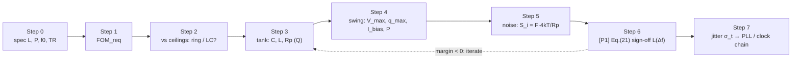

import NumericQuiz from "@site/src/components/NumericQuiz";

> **β**: This English translation is in beta — the Traditional-Chinese original is the authoritative version.

# Spec-Driven Design Recipe: 7 Steps from Spec to Jitter

> **Prerequisites**: [fom_limit](/06_design_insights/fom_limit) (the $\mathrm{FOM}=173.8-10\log_{10}F_{eff}$ ceiling family), [tank_Q_and_energy_restoration](/02_foundations/tank_Q_and_energy_restoration) (the three forms of $Q$, $4kT/R_p$), [tank_swing](/06_design_insights/tank_swing) ($q_{max}=CV_{max}$, current/voltage-limited regimes, $\tfrac{4}{\pi}I_{bias}R_p$), [white_noise_to_phase_noise](/03_isf_core_theory/white_noise_to_phase_noise) ([P1] Eq.(21) and the /2 vs /4 convention) | **Next**: [pll_noise_budget](/06_design_insights/pll_noise_budget), [clock_chain_budget](/06_design_insights/clock_chain_budget), [lab_09_design_tradeoffs](/04_simulation_labs/lab_09_design_tradeoffs)

Every other design page on this site runs **forward**: given $q_{max}$, $\Gamma_{rms}$, $S_i$, compute $\mathcal{L}(\Delta f)$;
or it does a **single-knob inversion**: how much must $q_{max}$ grow ([exercises](/06_design_insights/exercises) problem 1),
how high must $Q$ be ([fom_limit](/06_design_insights/fom_limit) example 2). Real design work runs the other way:
**all you have is a spec sheet** (phase noise, power, tuning range), and you must decide, in order, the topology,
the tank element values, the swing and the bias current, then loop back to verify the spec and convert the result into
the jitter the system asks for. This page writes that path down as a reusable **recipe**: 7 steps, one set of numbers
carried from start to finish, each step naming the formula it uses, checking units, and stating when it fails; and at the
end, iteration rules — which knob to turn when the margin is short, how many dB each turn buys, and what it costs in power.

> **Physical intuition (conclusion first)**: the three numbers on the spec sheet, $\mathcal{L}$, $P$ and $f_0/\Delta f$,
> collapse into **one** number — the required FOM. Compare that number with the ceiling family of
> [fom_limit](/06_design_insights/fom_limit) and **the topology is decided** (the ring ceiling of 168.3 dB is a hard wall).
> Once the topology is fixed, an LC oscillator's $\mathcal{L}$ is set by exactly four things:
> $Q$ (how small the $4kT/R_p$ noise source is), $q_{max}=CV_{max}$ (how much signal charge there is), $F$ (who else besides the
> tank is making noise), and $\Gamma_{rms}$ (the waveform shape) — precisely the four factors of [P1] Eq.(21). The recipe's job
> is to **pin each of those four factors to an element value or a bias**, then sign off with Eq.(21).



## Step 0: Write the spec as mathematics

Suppose the system engineer hands over this spec (used throughout the page):

| Spec item | Value | Reading |
|---|---|---|
| Carrier $f_0$ | $5$ GHz | The site's canonical frequency |
| SSB phase noise $\mathcal{L}(\Delta f)$ | $\le-120$ dBc/Hz @ $\Delta f=1$ MHz | One point in the white-noise $1/f^2$ region (assumes 1 MHz is already beyond the $1/f^3$ corner) |
| Total DC power $P$ | $\le5$ mW | Core plus bias, excluding buffers (see failure conditions) |
| Tuning range TR | $10\%$ ($4.75\sim5.25$ GHz) | Affects the varactor fraction and FOM$_T$ (end of page) |
| Temperature | $300$ K | $kT=4.142\times10^{-21}$ J |

- **Why one point of $\mathcal{L}$ suffices**: in the $1/f^2$ region $\mathcal{L}$ versus $\Delta f$ is a $-20$ dB/dec straight line
  (the $1/\Delta\omega^2$ of [P1] Eq.(21)), so one point fixes the whole segment. If the spec point lies in the $1/f^3$ (close-in)
  region, first use [symmetry](/06_design_insights/symmetry) to push the corner below the spec point, then come back to this recipe.
- **The three spec numbers are not independent**: a tighter $\mathcal{L}$ can be bought with $P$ (the
  "$\mathcal{L}\times P\approx$ constant" of [tank_swing](/06_design_insights/tank_swing) step 4), so the next step first merges
  them into a single power-independent number.

## Step 1: Spec → required FOM

Using the positive-valued convention of [fom_limit](/06_design_insights/fom_limit) step 0 (larger is better), merge the three spec
numbers into the **required FOM**:

$$
\mathrm{FOM}_{req}=-\mathcal{L}_{spec}+20\log_{10}\!\left(\frac{f_0}{\Delta f}\right)-10\log_{10}\!\left(\frac{P_{max}}{1\ \text{mW}}\right)
$$

Term by term (with units):

$$
\begin{aligned}
20\log_{10}\!\left(\frac{f_0}{\Delta f}\right)&=20\log_{10}\!\left(\frac{5\times10^{9}\ \text{Hz}}{10^{6}\ \text{Hz}}\right)=20\log_{10}(5000)=73.98\ \text{dB},\\[4pt]
10\log_{10}\!\left(\frac{P_{max}}{1\ \text{mW}}\right)&=10\log_{10}\!\left(\frac{5\ \text{mW}}{1\ \text{mW}}\right)=6.99\ \text{dB},\\[4pt]
\mathrm{FOM}_{req}&=120+73.98-6.99=186.99\approx187.0\ \text{dB}.
\end{aligned}
$$

- **Reading**: this is the **minimum** FOM needed to reach $-120$ dBc/Hz within a 5 mW budget. Using less than 5 mW, or doing
  better than $-120$, both require an actual FOM above 187.0.
- **Dimension check**: all three terms are $\log_{10}$ of dimensionless ratios ($\text{Hz}/\text{Hz}$, $\text{W}/\text{W}$, and
  $\mathcal{L}$ normalized to a 1 Hz bandwidth) → dB ✓.
- **Why $P_{max}$**: FOM carries $P$ with a negative sign — the power ceiling gives the **most lenient** FOM requirement; if the
  implementation later burns only 2.5 mW, the required FOM automatically rises by 3 dB (Step 6 shows this).

```python
import numpy as np
f0, df, L_spec, P_max = 5e9, 1e6, -120.0, 5e-3
print(round(20*np.log10(f0/df), 2))                       # -> 73.98
print(round(10*np.log10(P_max/1e-3), 2))                  # -> 6.99
FOM_req = -L_spec + 20*np.log10(f0/df) - 10*np.log10(P_max/1e-3)
print(round(FOM_req, 2))                                  # -> 186.99 (required FOM, dB)
```

<NumericQuiz
  prompt="Try it yourself: if the spec changes to L(1 MHz) ≤ −125 dBc/Hz and P ≤ 2 mW (f0 still 5 GHz), what is FOM_req? (dB)"
  answer={195.97}
  tol={0.01}
  unit="dB"
  hint="FOM_req = −L + 20log10(f0/Δf) − 10log10(P/1 mW); 20log10(5000)=73.98."
  solutionNote="125 + 73.98 − 10log10(2) = 125 + 73.98 − 3.01 = 195.97 dB — already closing in on the Q=10 LC ceiling of 197.6 dB; Step 2 would call it 'barely feasible'."
/>

## Step 2: Against the ceilings — ring or LC?

Compare $\mathrm{FOM}_{req}$ with the ceiling family of [fom_limit](/06_design_insights/fom_limit) step 4
($\mathrm{FOM}_{max}=173.83-10\log_{10}F_{eff}$, 300 K):

| Candidate topology | $F_{eff}$ | $\mathrm{FOM}_{max}$ | vs $\mathrm{FOM}_{req}=187.0$ | Verdict |
|---|---|---|---|---|
| ring ([P2] Eq.(25) bound: $V_T=0$, $\gamma=2/3$, $\eta=1$) | $16\gamma/(3\eta)=3.56$ | $168.32$ dB | $168.32-186.99=-18.67$ dB | **Infeasible** — even the ideal limit falls 18.7 dB short |
| LC, $Q=10$ ([P1] Eq.(21) SSB /4; $F=1+\gamma$, $\gamma=2/3$, $\Gamma_{rms}^2=\tfrac12$, $\eta_P=1$) | $4.17\times10^{-3}$ | $197.63$ dB | $197.63-186.99=+10.64$ dB | **Feasible**, ideal margin 10.6 dB |
| Same, time-domain /2 convention | $8.33\times10^{-3}$ | $194.62$ dB | $+7.63$ dB | Same physics, 3.01 dB more conservative bookkeeping |

- **Decision rule**: $\mathrm{FOM}_{max}-\mathrm{FOM}_{req}$ is the "**ideal margin**".
  [fom_limit](/06_design_insights/fom_limit) notes that good published LC designs sit about $5\sim10$ dB below their own $Q$ ceiling
  ($\eta_P\lt1$, $F\gt1+\gamma$, varactor loss), so **an ideal margin of at least 5 dB is needed before going further**;
  10.6 dB is comfortable. The ring is 18.7 dB short — no choice of $N$, swing or power can recover that
  ([P2] N-independence; FOM is already normalized to $P$).
- **Conclusion: choose LC, and the process must deliver a tank with $Q\approx10$**. If the process only gives $Q=5$, the ceiling
  drops $6$ dB to $191.6$ dB and the margin shrinks to 4.6 dB — which lands you in the iteration at the end of this page.

```python
import numpy as np
kB, T = 1.380649e-23, 300.0
Cref = -10*np.log10(kB*T*1.0/1e-3)                        # 173.83 dB (fom_limit step 1)
FOM_req = 186.99
gamma = 2/3
FOM_ring = Cref - 10*np.log10(16*gamma/3)                 # [P2] Eq.(25) bound
print(round(FOM_ring, 2), round(FOM_ring - FOM_req, 2))   # -> 168.32 -18.67 (ring ceiling, gap: infeasible)
FOM_lc10 = Cref - 10*np.log10((1+gamma)*0.5/(2*10**2))    # [P1] Eq.(21) /4 convention, Q=10
print(round(FOM_lc10, 2), round(FOM_lc10 - FOM_req, 2))   # -> 197.63 10.64 (LC Q=10 ceiling, ideal margin)
print(round(FOM_lc10 - 10*np.log10(2) - FOM_req, 2))      # -> 7.63 (margin under the time-domain /2 convention)
FOM_lc5 = Cref - 10*np.log10((1+gamma)*0.5/(2*5**2))
print(round(FOM_lc5, 2), round(FOM_lc5 - FOM_req, 2))     # -> 191.61 4.62 (Q=5 ceiling, ideal margin)
print(round(-10*np.log10(310/300), 2))                    # -> -0.14 (change of C_ref per +10 K, dB)
```

## Step 3: Tank — choose $C$, derive $L$ and $R_p$

The three tank quantities have only two degrees of freedom ($f_0$ ties $LC$ together); add the process-given $Q$ and everything
is fixed. **Choose $C$ first** (not $L$) — $C$ enters $q_{max}=CV_{max}$ directly and sets the varactor and parasitic fractions:

1. **Lower bound on $C$**: device, varactor and routing parasitics at 5 GHz already amount to a few hundred fF; too small a $C$
   lets the parasitics eat the tuning range.
2. **Upper bound on $C$**: larger $C$ → smaller $L$, smaller $R_p=Q\omega_0L$ → more current for the same swing (Step 4).

Take $C=1$ pF (the site's canonical value, and the same order as the example in
[tank_Q_and_energy_restoration](/02_foundations/tank_Q_and_energy_restoration)):

$$
\begin{aligned}
\omega_0&=2\pi f_0=2\pi\times5\times10^{9}=3.1416\times10^{10}\ \text{rad/s},\\[4pt]
L&=\frac{1}{\omega_0^2C}=\frac{1}{(3.1416\times10^{10})^2\times10^{-12}}
   =\frac{1}{9.870\times10^{20}\times10^{-12}}=1.013\times10^{-9}\ \text{H}=1.013\ \text{nH},\\[4pt]
R_p&=Q\,\omega_0L=10\times3.1416\times10^{10}\times1.013\times10^{-9}=318.3\ \Omega .
\end{aligned}
$$

- **Formulas used**: $\omega_0=1/\sqrt{LC}$ and $Q=R_p/(\omega_0L)=\omega_0R_pC=R_p\sqrt{C/L}$
  (the three equivalent forms from [tank_Q_and_energy_restoration](/02_foundations/tank_Q_and_energy_restoration) step 1;
  standard textbook material, external to the site's 5 PDFs). The three forms cross-check:
  $Q=\omega_0R_pC=3.1416\times10^{10}\times318.3\times10^{-12}=10.0$ ✓;
  $R_0=\sqrt{L/C}=\sqrt{1.013\times10^{-9}/10^{-12}}=31.83\ \Omega$, $R_p/R_0=10.0$ ✓.
- **Dimension check**: $[1/(\omega_0^2C)]=1/[(\text{s}^{-2})(\text{F})]=\text{s}^2/\text{F}=\text{H}$ ✓
  ($\text{H}\cdot\text{F}=\text{s}^2$); $[Q\omega_0L]=(\text{s}^{-1})(\text{H})=\Omega$ ✓.
- **Physical reading**: $R_p=318\ \Omega$ is where the tank leaks its energy every cycle — it simultaneously sets the Step 4 bias
  current (needed to "drive" this resistor to 1 V) and the Step 5 noise current $4kT/R_p$. $Q=10$ means a 3-dB bandwidth of
  $f_0/Q=500$ MHz; the resonance is not sharp at all.
- **What the tuning range costs at this step**: $f_0\propto1/\sqrt{C}$, so $4.75\sim5.25$ GHz requires
  $C_{max}/C_{min}=(f_{max}/f_{min})^2=(5.25/4.75)^2=1.222$ — the total tank capacitance must vary by 22%, and the finite $Q$ of
  that varactor (or switched-capacitor array) portion drags down the effective $Q$
  ([varactor_tuning_supply_pushing](/06_design_insights/varactor_tuning_supply_pushing);
  [tank_Q_and_energy_restoration](/02_foundations/tank_Q_and_energy_restoration) step 5). This page assumes $Q=10$ is already the
  **loaded $Q$ including the varactor**.

```python
import numpy as np
f0, Q, C = 5e9, 10.0, 1e-12
w0 = 2*np.pi*f0
L = 1/(w0**2*C)
Rp = Q*w0*L
print(round(L*1e9, 3))                       # -> 1.013 (nH)
print(round(Rp, 1))                          # -> 318.3 (Ω)
print(round(w0*Rp*C, 2), round(Rp/np.sqrt(L/C), 2))   # -> 10.0 10.0 (cross-check of the three forms of Q)
print(round((5.25/4.75)**2, 3))              # -> 1.222 (C_max/C_min required by 10% TR)
print(round(np.sqrt(L/C), 2), round(f0/Q/1e6, 0))   # -> 31.83 500.0 (R_0 Ω, 3-dB bandwidth MHz)
```

## Step 4: Swing → $q_{max}$, bias current, power

Now pin the denominator of [P1] Eq.(21), $q_{max}=CV_{max}$. The swing ceiling is set by **headroom**:
[tank_swing](/06_design_insights/tank_swing) step 4 — the single-ended swing of a differential LC oscillator in the current-limited
regime is about $\tfrac{4}{\pi}I_{bias}R_p$, capped near the supply $V_{DD}$ (voltage-limited). **The recipe's choice is to push the
bias exactly to the voltage-limited boundary**: any further current is wasted (the swing stops growing, $\mathcal{L}$ stops falling).

Take $V_{DD}=1$ V and $V_{max}=1$ V (single-ended peak):

$$
\begin{aligned}
q_{max}&=C\,V_{max}=10^{-12}\ \text{F}\times1\ \text{V}=10^{-12}\ \text{C}=1\ \text{pC},\\[4pt]
I_{bias}&=\frac{\pi}{4}\cdot\frac{V_{max}}{R_p}=\frac{\pi}{4}\cdot\frac{1\ \text{V}}{318.3\ \Omega}=0.7854\times3.142\times10^{-3}\ \text{A}=2.467\ \text{mA},\\[4pt]
P_{DC}&=V_{DD}\,I_{bias}=1\ \text{V}\times2.467\ \text{mA}=2.467\ \text{mW}\ \le\ 5\ \text{mW},\\[4pt]
P_{tank}&=\frac{V_{max}^2}{2R_p}=\frac{1}{2\times318.3}=1.571\ \text{mW},\qquad
\eta_P=\frac{P_{tank}}{P_{DC}}=\frac{1/(2R_p)}{(\pi/4)/R_p}=\frac{2}{\pi}=0.637 .
\end{aligned}
$$

- **The site's canonical value falls out naturally**: $C=1$ pF and $V_{max}=1$ V give $q_{max}=1$ pC — the number examples A/B
  have used all along was always "a 1 pF tank at 1 V swing".
- **Dimension check**: $[\text{F}][\text{V}]=[\text{C}]$ ✓; $[\text{V}]/[\Omega]=[\text{A}]$ ✓; $[\text{V}][\text{A}]=[\text{W}]$ ✓;
  $\eta_P$ dimensionless ✓.
- **The physics of $\eta_P=2/\pi$**: at the voltage-limited boundary the tank receives $V_{max}^2/(2R_p)$ while the supply pays
  $V_{DD}\times I_{bias}$; with $V_{DD}=V_{max}$ their ratio is exactly $\tfrac{1}{2}\big/\tfrac{\pi}{4}=2/\pi$.
  This $\eta_P\lt1$ will cost $-10\log_{10}(2/\pi)=1.96$ dB in the FOM bookkeeping of Step 6.
- ⚠️ **Convention warning (the $4/\pi$ coefficient)**: this swing–current relation is **standard LC design knowledge (external
  textbooks, not the site's 5 PDFs; Razavi, *RF Microelectronics*; the Hajimiri–Lee textbook)**, and this page follows the form used in
  [tank_swing](/06_design_insights/tank_swing). Textbooks differ on "single-ended vs differential swing" and on whether $R_p$ is the
  single-ended or differential equivalent, so the coefficient can differ by $2\times$; treat $I_{bias}$ and $P_{DC}$ as
  **order-of-magnitude estimates** ($2.5\sim5$ mW) — note that even a $2\times$ error stays within the 5 mW budget, which is one
  reason Step 2 insists on margin. Exact values need transistor-level simulation (this site does not run SPICE; see
  [python_environment](/99_appendix/python_environment)).

```python
import numpy as np
C, Vmax, VDD, Rp = 1e-12, 1.0, 1.0, 318.3
qmax = C*Vmax
Ibias = (np.pi/4)*Vmax/Rp
P_dc = VDD*Ibias
P_tank = Vmax**2/(2*Rp)
print(qmax*1e12)                                  # -> 1.0 (pC: the site's canonical value)
print(round(Ibias*1e3, 3), round(P_dc*1e3, 3))    # -> 2.467 2.467 (mA, mW; P≤5 mW ✓)
print(round(P_tank*1e3, 3), round(P_tank/P_dc, 3))  # -> 1.571 0.637 (P_tank mW, η_P=2/π)
```

## Step 5: Noise source — $S_i=F\cdot4kT/R_p$

The numerator of [P1] Eq.(21) needs "the total white-noise current PSD referred to the tank node". The tank loss itself contributes
$4kT/R_p$ ([tank_Q_and_energy_restoration](/02_foundations/tank_Q_and_energy_restoration) step 3); the active core's device noise,
weighted by its own $\Gamma_{eff}$, is collected through the **noise factor** $F$ as $F\cdot4kT/R_p$
([fom_limit](/06_design_insights/fom_limit) step 3). The bound for an ideal class-B cross-coupled pair (tail noise filtered out) is
$F=1+\gamma$ — the standard result of Hegazi–Sjöland–Abidi 2001 (external literature, not the site's 5 PDFs; see the end of the page).
This recipe takes the **short-channel** $\gamma=1$ (more conservative than the long-channel $2/3$ used for the Step 2 ceiling), so $F=2$:

$$
\begin{aligned}
\frac{4kT}{R_p}&=\frac{4\times1.380649\times10^{-23}\ \text{J/K}\times300\ \text{K}}{318.3\ \Omega}
   =\frac{1.6568\times10^{-20}\ \text{J}}{318.3\ \Omega}=5.205\times10^{-23}\ \text{A}^2/\text{Hz},\\[4pt]
S_i&=F\cdot\frac{4kT}{R_p}=2\times5.205\times10^{-23}=1.041\times10^{-22}\ \text{A}^2/\text{Hz}.
\end{aligned}
$$

- **Dimension check**: $\text{J}/\Omega=(\text{V}\cdot\text{A}\cdot\text{s})/(\text{V}/\text{A})=\text{A}^2\text{s}=\text{A}^2/\text{Hz}$ ✓
  (single-sided PSD, consistent with the site's notation).
- **Compared with the canonical example B, $S_i=10^{-24}$**: this is 100 times larger ($+20$ dB). Example B's $10^{-24}$ corresponds
  to $R_p=16.6$ kΩ, $Q\approx521$ (the "FOM catches it" point in [fom_limit](/06_design_insights/fom_limit) step 3);
  **the noise current of a real $Q=10$ tank is of order $10^{-22}$** — the biggest difference between this page and the teaching examples.
- **Where $F$ fails**: an unfiltered tail (2× upconversion through $c_0$, $c_2$; [real_oscillator_topologies](/06_design_insights/real_oscillator_topologies)),
  flicker in the bias current source, and AM-PM on the varactor all push $F$ above $1+\gamma$; late in the design, account for each
  source with the method of [device_noise_mapping](/06_design_insights/device_noise_mapping).

```python
kB, T, Rp, gamma = 1.380649e-23, 300.0, 318.3, 1.0
Si_tank = 4*kB*T/Rp
Si = (1+gamma)*Si_tank
print(f"{Si_tank:.3e}")                           # -> 5.205e-23 (the tank's own 4kT/Rp, A²/Hz)
print(f"{Si:.3e}")                                # -> 1.041e-22 (total S_i after F=1+γ=2)
Rp_B = 4*kB*T/1e-24
print(round(Rp_B/1e3, 1), round(Rp_B/31.83))      # -> 16.6 521 (R_p in kΩ and Q implied by example B's S_i=1e-24)
```

## Step 6: Sign-off — $\mathcal{L}(1\ \text{MHz})$ from [P1] Eq.(21)

All four factors are pinned: $\Gamma_{rms}=1/\sqrt2$ (true LC, $\Gamma=-\sin\theta$; [lab_02](/04_simulation_labs/lab_02_lc_oscillator_toy_model)),
$q_{max}=1$ pC, $S_i=1.041\times10^{-22}$ A²/Hz, $\Delta\omega=2\pi\times10^6$ rad/s. Substitute into [P1] Eq.(21), p.185 (checked against the rendered PDF page):

$$
\mathcal{L}\{\Delta\omega\}=10\log_{10}\!\left(\frac{\Gamma_{rms}^2}{q_{max}^2}\cdot\frac{\overline{i_n^2}/\Delta f}{4\,\Delta\omega^2}\right)
$$

$$
\begin{aligned}
\Delta\omega^2&=(6.2832\times10^{6})^2=3.948\times10^{13}\ (\text{rad/s})^2,\\[4pt]
\frac{\Gamma_{rms}^2}{q_{max}^2}&=\frac{0.5}{(10^{-12})^2}=5\times10^{23}\ \text{C}^{-2},\\[4pt]
\frac{S_i}{4\Delta\omega^2}&=\frac{1.041\times10^{-22}}{4\times3.948\times10^{13}}=6.592\times10^{-37},\\[4pt]
\text{bracket}&=5\times10^{23}\times6.592\times10^{-37}=3.296\times10^{-13},\\[4pt]
\mathcal{L}(1\ \text{MHz})&=10\log_{10}(3.296\times10^{-13})=-124.8\ \text{dBc/Hz}.
\end{aligned}
$$

- **Sign-off**: $-124.8\le-120$ ✓, **margin 4.8 dB**; power $2.47\le5$ mW ✓.
- **The same thing in FOM bookkeeping**: the implementation burns only $P_{DC}=2.467$ mW, so the required FOM rises from Step 1's 187.0 to
  $120+73.98-10\log_{10}(2.467)=190.06$ dB (up by $10\log_{10}(5/2.467)=3.07$ dB — the 3 dB Step 1 announced);
  $194.88-190.06=4.82$ dB, **identical** to the margin obtained by comparing $\mathcal{L}$ directly — the two bookkeepings confirm each other.
- **Dimension check** (as in [tank_swing](/06_design_insights/tank_swing)): $\dfrac{1}{[\text{C}]^2}\cdot\dfrac{[\text{A}^2/\text{Hz}]}{[\text{s}^{-2}]}$;
  with $\text{A}=\text{C/s}$ → $\dfrac{\text{C}^2\text{s}^{-2}/\text{Hz}}{\text{C}^2\text{s}^{-2}}=1/\text{Hz}$, normalized to 1 Hz → dimensionless → dBc/Hz ✓.
- **Actual FOM and distance to the ceiling**:
  $\mathrm{FOM}=124.82+73.98-10\log_{10}(2.467)=124.82+73.98-3.92=194.88$ dB.
  Distance to the $Q=10$ ceiling: $197.63-194.88=2.75$ dB, and it can be **accounted for term by term**:
  $F=2$ instead of $5/3$ → $10\log_{10}(2/(5/3))=0.79$ dB; $\eta_P=2/\pi$ instead of 1 → $-10\log_{10}(2/\pi)=1.96$ dB;
  total $2.75$ dB ✓ ($\Gamma_{rms}^2=\tfrac12$ on both sides).
  The same thing through the universal form of [fom_limit](/06_design_insights/fom_limit): $F_{eff}=F\Gamma_{rms}^2/(2Q^2\eta_P)=7.85\times10^{-3}$,
  $\mathcal{L}=10\log_{10}[F_{eff}(kT/P_{DC})(f_0/\Delta f)^2]=-124.8$ dBc/Hz — **identical digit for digit** with the direct Eq.(21) substitution.
- ⚠️ **Factor-of-2 convention**: the formula above is [P1]'s SSB "/4" bookkeeping; the clean time-domain "/2" derivation gives $-121.8$ dBc/Hz
  and only 1.8 dB of margin ([white_noise_to_phase_noise](/03_isf_core_theory/white_noise_to_phase_noise)). **Sign off with the conservative one**,
  or at least confirm that the instrument's definition of $\mathcal{L}$ belongs to the same family as your formula.

```python
import numpy as np
kB, T, f0, df = 1.380649e-23, 300.0, 5e9, 1e6
grms2, qmax, Si, Q, P_dc = 0.5, 1e-12, 1.041e-22, 10.0, 2.467e-3
dw = 2*np.pi*df
L_db = 10*np.log10(grms2/qmax**2 * Si/(4*dw**2))       # [P1] Eq.(21), p.185 (SSB /4)
print(round(L_db, 2), round(-120.0 - L_db, 2))         # -> -124.82 4.82 (dBc/Hz, margin to spec in dB)
print(round(10*np.log10(grms2/qmax**2 * Si/(2*dw**2)), 2))   # -> -121.81 (time-domain /2 convention)
FOM = -L_db + 20*np.log10(f0/df) - 10*np.log10(P_dc/1e-3)
print(round(FOM, 2))                                   # -> 194.88 (actual FOM, dB)
FOM_req_actual = 120.0 + 20*np.log10(f0/df) - 10*np.log10(P_dc/1e-3)
print(round(FOM_req_actual, 2), round(FOM - FOM_req_actual, 2))   # -> 190.06 4.82 (required FOM at 2.467 mW, margin: consistent with above)
print(round(10*np.log10(5.0/2.467), 2))                # -> 3.07 (dB by which burning less power raises the required FOM)
Cref = -10*np.log10(kB*T/1e-3)
FOM_lc10 = Cref - 10*np.log10((5/3)*0.5/(2*Q**2))
print(round(FOM_lc10 - FOM, 2))                        # -> 2.75 (distance to the Q=10 ceiling)
print(round(10*np.log10(2/(5/3)), 2), round(-10*np.log10(2/np.pi), 2))   # -> 0.79 1.96 (F term, η_P term; sum = 2.75)
Feff = 2.0*grms2/(2*Q**2*(2/np.pi))
print(round(10*np.log10(Feff*(kB*T/P_dc)*(f0/df)**2), 2))   # -> -124.82 (cross-check through the universal form)
```

## Step 7: Hand-off — $\mathcal{L}(\Delta f)$ → rms jitter

The system side wants jitter, not dBc/Hz. Use the $1/f^2$ closed form ([lab_08](/04_simulation_labs/lab_08_jitter_integration),
[serdes_clocking_connection](/06_design_insights/serdes_clocking_connection) step 2), integrating from $f_1=1$ MHz to $f_2=100$ MHz:

$$
\begin{aligned}
S_\phi(1\ \text{MHz})&=2\times10^{\mathcal{L}/10}=2\times10^{-12.482}=6.59\times10^{-13}\ \text{rad}^2/\text{Hz},\\[4pt]
\sigma_\phi^2&=S_\phi(f_{ref})\,f_{ref}^2\left(\frac{1}{f_1}-\frac{1}{f_2}\right)
  =6.59\times10^{-13}\times(10^{6})^2\times(10^{-6}-10^{-8})=6.53\times10^{-7}\ \text{rad}^2,\\[4pt]
\sigma_\phi&=8.08\times10^{-4}\ \text{rad}=0.808\ \text{mrad},\\[4pt]
\sigma_t&=\frac{\sigma_\phi}{2\pi f_0}=\frac{8.08\times10^{-4}}{3.1416\times10^{10}}=2.57\times10^{-14}\ \text{s}=25.7\ \text{fs}.
\end{aligned}
$$

- **Dimension check**: $[\text{rad}^2/\text{Hz}][\text{Hz}^2][1/\text{Hz}]=\text{rad}^2$ ✓; $\text{rad}\div(\text{rad/s})=\text{s}$ ✓.
- **Against example C**: example C is $-100$ dBc/Hz → $447.9$ fs; this design is 24.8 dB better, so $\sigma_t$ shrinks by
  $10^{-24.82/20}=0.0574$ → $25.7$ fs ✓ (for the same integration band and $1/f^2$ slope, $\sigma_t\propto10^{\Delta\mathcal{L}/20}$;
  [lab_09](/04_simulation_labs/lab_09_design_tradeoffs)). The spec point $-120$ dBc/Hz itself corresponds to $44.8$ fs — jitter
  margin and dB margin are the same thing written two ways.
- **Hand-off conditions**: 25.7 fs is the number for a **free-running VCO, $1/f^2$ only, integrated over 1–100 MHz**. Inside a PLL the
  VCO contribution is high-passed by $\lvert H_{hp}\rvert^2$ and the reference/CP take over in-band; the integration limits are set by
  the loop bandwidth and the data rate (the optimum BW of [pll_noise_budget](/06_design_insights/pll_noise_budget); the full clock-chain
  27.6 fs example of [clock_chain_budget](/06_design_insights/clock_chain_budget)); flicker ($1/f^3$) and the floor must also be added.
  **This page's output is the $S_{vco}$ input to that chain**.

```python
import numpy as np
f0, L_db, f1, f2 = 5e9, -124.82, 1e6, 1e8
Sphi_ref = 2*10**(L_db/10)                     # single-sided S_phi(1 MHz), rad²/Hz
sphi2 = Sphi_ref*(1e6)**2*(1/f1 - 1/f2)         # 1/f² closed form
sigma_t = np.sqrt(sphi2)/(2*np.pi*f0)
print(round(np.sqrt(sphi2)*1e3, 3))             # -> 0.808 (mrad)
print(round(sigma_t*1e15, 1))                   # -> 25.7 (fs, 1–100 MHz, 1/f²)
print(round(10**((L_db + 100.0)/20), 4))        # -> 0.0574 (σ_t scaling factor relative to example C)
print(round(447.9*10**((L_db + 100.0)/20), 1))  # -> 25.7 (dB-scaling from example C's 447.9 fs, cross-check)
print(round(447.9*10**((-120.0 + 100.0)/20), 1))  # -> 44.8 (fs corresponding to the spec point −120 dBc/Hz)
```

## Iteration rules: which knob, how many dB, at what power

If Step 6 yields a **negative margin** (or the ideal margin of Step 2 is under 5 dB), do not add current on instinct. Combining Eq.(21)
with the Step 3–5 chain ($L=1/(\omega_0^2C)$, $R_p=Q\omega_0L$, $q_{max}=CV_{max}$, $I_{bias}=\tfrac{\pi}{4}V_{max}/R_p$, $S_i=F\cdot4kT/R_p$)
gives $\mathcal{L}_{lin}\propto\dfrac{F\,\Gamma_{rms}^2}{C\,V_{max}^2\,Q\,\omega_0}$ and $P_{DC}\propto\dfrac{V_{DD}V_{max}C\omega_0}{Q}$,
so the effect of each knob on $\mathcal{L}$, $P$ and FOM can be tabulated at once (**everything else fixed, staying on the voltage-limited boundary**):

| Knob (×2) | $\Delta\mathcal{L}$ | $\Delta P_{DC}$ | $\Delta\mathrm{FOM}$ | Reading |
|---|---|---|---|---|
| tank $Q$ ($R_p$ doubles; $C$, $V_{max}$ unchanged) | $-3.0$ dB | $\times\tfrac12$ | $+6.0$ dB | **The only knob that lowers noise and saves power at once** — $S_i\propto1/R_p$, $I_{bias}\propto1/R_p$; locked by the process inductor/varactor $Q$ |
| tank $C$ ($L$ halves, $R_p$ halves) | $-3.0$ dB | $\times2$ | $0$ | $q_{max}$ doubling buys $-6$ dB but $S_i$ doubling gives back $+3$ dB; buys dB with power, FOM unchanged |
| swing $V_{max}$ (needs $V_{DD}$ to double too) | $-6.0$ dB | $\times4$ | $0$ | $q_{max}$ doubles; $I_{bias}$ and $V_{DD}$ both double → 4× power; limited by breakdown |
| $I_{bias}$ alone (already voltage-limited) | $0$ | $\times2$ | $-3.0$ dB | **Pure waste**: the swing no longer grows ([tank_swing](/06_design_insights/tank_swing) step 4) |
| noise factor $F$: $2\to5/3$ (tail filter) | $-0.8$ dB | $\times1$ | $+0.8$ dB | The Hegazi family of techniques; costs no power |
| $\Gamma_{rms}$ (waveform / class-F shaping) | $1\sim2$ dB | $\times1$ | $1\sim2$ dB | [fom_limit](/06_design_insights/fom_limit) knobs table; [lab_09](/04_simulation_labs/lab_09_design_tradeoffs) |

- **Iteration order**: (1) first ask whether the process has any more $Q$ (each doubling is $-3$ dB and halves the power);
  (2) then push the swing to the headroom limit ($-6$ dB per doubling, but 4× power and it hits $V_{DD}$);
  (3) only then use $C$ (or, equivalently, current) to **trade power budget for dB at constant FOM** — the limit of that step is $P_{max}$.
- **The constant-FOM "power for dB" limit**: at $Q=10$, $\mathrm{FOM}=194.9$ dB, the lowest $\mathcal{L}$ the full 5 mW budget can buy is
  $-\mathrm{FOM}+73.98-10\log_{10}(5)=-194.88+73.98+6.99=-127.9$ dBc/Hz. **Any spec tighter than $-127.9$ at $Q=10$ and 5 mW must come from $Q$, $F$, $\Gamma_{rms}$ (or a relaxed power budget).**
- **One concrete iteration**: if the spec becomes $-127$ dBc/Hz (the current design's margin is $-2.2$ dB): raise $C$ to 2 pF ($L=0.507$ nH,
  $R_p=159$ Ω, $q_{max}=2$ pC, $S_i=2.08\times10^{-22}$) → $\mathcal{L}=-127.8$ dBc/Hz (margin 0.8 dB), $I_{bias}=4.93$ mA, $P_{DC}=4.93$ mW
  (still $\le5$ mW, but the budget is now fully used). This is exactly the table's "$C\times2$: $-3$ dB, 2× power, FOM unchanged" row in action.

```python
import numpy as np
kB, T, f0, df, Q, Vmax, VDD, F, grms2 = 1.380649e-23, 300.0, 5e9, 1e6, 10.0, 1.0, 1.0, 2.0, 0.5
w0, dw = 2*np.pi*f0, 2*np.pi*df
def design(C, Q=Q, Vmax=Vmax, VDD=VDD, F=F):
    L = 1/(w0**2*C); Rp = Q*w0*L
    qmax = C*Vmax; Ib = (np.pi/4)*Vmax/Rp; P = VDD*Ib
    Si = F*4*kB*T/Rp
    Ldb = 10*np.log10(grms2/qmax**2 * Si/(4*dw**2))
    return Ldb, P, -Ldb + 20*np.log10(f0/df) - 10*np.log10(P/1e-3), Rp, Ib
L0, P0, F0, _, _ = design(1e-12)
Lq, Pq, Fq, _, _ = design(1e-12, Q=20.0)
print(round(Lq-L0, 2), round(Pq/P0, 2), round(Fq-F0, 2))   # -> -3.01 0.5 6.02 (Q×2: ΔL, P ratio, ΔFOM)
Lc, Pc, Fc, Rp2, Ib2 = design(2e-12)
print(round(Lc-L0, 2), round(Pc/P0, 2), round(Fc-F0, 2))   # -> -3.01 2.0 0.0 (C×2)
Lv, Pv, Fv, _, _ = design(1e-12, Vmax=2.0, VDD=2.0)
print(round(Lv-L0, 2), round(Pv/P0, 2), round(Fv-F0, 2))   # -> -6.02 4.0 0.0 (V_max×2 with V_DD×2)
print(round(-F0 + 20*np.log10(f0/df) - 10*np.log10(5.0), 2))   # -> -127.89 (lowest L at Q=10 with the full 5 mW)
print(round(-127.0 - L0, 2))                                  # -> -2.18 (margin of the current design if the spec becomes −127)
print(round(Lc, 2), round(Pc*1e3, 2), round(Rp2, 1), round(Ib2*1e3, 2))   # -> -127.83 4.93 159.2 4.93 (C=2 pF iteration: L, P mW, Rp Ω, I_bias mA)
```

## FOM$_T$: folding the tuning range in

So far the TR of Step 0 has only appeared in Step 3 as "the varactor drags $Q$ down". When comparing wide-tuning VCOs the literature
commonly uses a **tuning-range-normalized FOM** (an external convention, not the site's 5 PDFs; its first appearance is yet to be verified,
and the form is widely used in recent JSSC VCO papers):

$$
\mathrm{FOM}_T=\mathrm{FOM}+20\log_{10}\!\left(\frac{\mathrm{TR}\,[\%]}{10}\right)
$$

- **Reading**: 10% tuning range is the reference; every doubling of TR adds $6$ dB — the rationale is that at a given $Q$, tuning wider
  raises the varactor fraction and lowers the attainable effective $Q$, so "same FOM, wider TR" deserves credit. This is an **empirical
  convention**, not an identity derived from Eq.(21) the way FOM is; always confirm the other side uses the same definition when comparing.
- **This design**: TR $=10\%$ → $\mathrm{FOM}_T=194.88+20\log_{10}(1)=194.88$ dB (the reference point, zero credit). If the same
  oscillator reached TR $=20\%$ without losing $Q$, $\mathrm{FOM}_T=200.9$ dB.

```python
import numpy as np
FOM = 194.88
print(round(FOM + 20*np.log10(10/10), 2), round(FOM + 20*np.log10(20/10), 2))   # -> 194.88 200.9 (TR=10%, 20%)
```

## Applicability and failure conditions

| Condition | When it holds | When it fails |
|---|---|---|
| Spec point in the $1/f^2$ white-noise region | One point fixes the segment; FOM is meaningful | Spec point in the $1/f^3$ region: first push the corner down with [symmetry](/06_design_insights/symmetry); the floor region is a separate calculation |
| Small-perturbation LTV ([P1] framework), $\Gamma=-\sin\theta$ | $\Gamma_{rms}^2=\tfrac12$ can be used directly | Large-swing waveform distortion, class-F shaping: re-extract $\Gamma_{rms}$ with the method of [lab_04](/04_simulation_labs/lab_04_impulse_injection_sweep) |
| $F=1+\gamma$ (tail filtered, clean bias) | The Step 5 $S_i$ holds | Tail $c_0/c_2$ upconversion, bias flicker, varactor AM-PM → $F$ rises ([real_oscillator_topologies](/06_design_insights/real_oscillator_topologies)) |
| Current-limited up to the voltage-limited boundary | $V_{max}\approx\tfrac{4}{\pi}I_{bias}R_p\approx V_{DD}$ | Beyond the boundary, more current does nothing; the $4/\pi$ coefficient can differ by $2\times$ depending on single-ended/differential definitions (external textbooks) |
| $Q$ is the loaded $Q$ including the varactor | $R_p$, $S_i$, $I_{bias}$ consistent | Using the inductor's unloaded $Q$ overestimates the margin ([tank_Q_and_energy_restoration](/02_foundations/tank_Q_and_energy_restoration) step 5) |
| $P$ is total DC power, $T=300$ K | FOM comparable across designs | Omitting buffers/bias inflates FOM; at other temperatures $C_{ref}$ drops $0.14$ dB per $+10$ K |
| Consistent convention (/4 vs /2) | Margin of 4.8 dB or 1.8 dB, each valid on its own | Mixing them conjures a phantom 3 dB — sign off with the conservative /2 |
| Jitter integrated 1–100 MHz, free-running | $25.7$ fs holds | Inside a PLL the limits and transfer functions change; hand over to [pll_noise_budget](/06_design_insights/pll_noise_budget) |

## Key takeaways

- **7 steps**: spec → $\mathrm{FOM}_{req}$ → topology against the ceilings → $C\to L,R_p$ → $V_{max}\to q_{max},I_{bias},P$ → $S_i=F\cdot4kT/R_p$ → [P1] Eq.(21) sign-off → $\sigma_t$ hand-off.
- This example: $\mathrm{FOM}_{req}=187.0$ dB; the ring ceiling 168.3 is 18.7 dB short, infeasible; the LC $Q=10$ ceiling 197.6 leaves 10.6 dB.
- $C=1$ pF → $L=1.013$ nH, $R_p=318$ Ω; $V_{max}=1$ V → $q_{max}=1$ pC (the site's canonical value), $I_{bias}=2.47$ mA, $P=2.47$ mW, $\eta_P=2/\pi$.
- $S_i=2\times4kT/R_p=1.04\times10^{-22}$ A²/Hz (20 dB above example B's $10^{-24}$ — the order of magnitude of a real $Q=10$ tank).
- $\mathcal{L}(1\ \text{MHz})=-124.8$ dBc/Hz (/4; /2 gives $-121.8$), margin 4.8 dB; $\mathrm{FOM}=194.9$ dB, 2.75 dB below the ceiling $=0.79$ ($F$) $+1.96$ ($\eta_P$).
- $\sigma_t(1\text{–}100\ \text{MHz})=25.7$ fs (the spec point corresponds to 44.8 fs).
- Iteration: $Q\times2$ → $-3$ dB and half the power (FOM $+6$); $C\times2$ or $V_{max}\times2$ buy dB with power (FOM unchanged); adding current past the voltage-limited point is pure waste. The limit at $Q=10$, 5 mW is $-127.9$ dBc/Hz.
- $\mathrm{FOM}_T=\mathrm{FOM}+20\log_{10}(\mathrm{TR}\%/10)$ is an external empirical convention, not an identity.

## Further reading

- The ceiling family and the $F_{eff}$ derivation: [fom_limit](/06_design_insights/fom_limit)
- The three forms of $Q$, $R_p$ and $4kT/R_p$: [tank_Q_and_energy_restoration](/02_foundations/tank_Q_and_energy_restoration)
- Swing, $q_{max}$, current/voltage-limited regimes: [tank_swing](/06_design_insights/tank_swing)
- [P1] Eq.(21) derivation and /2 vs /4: [white_noise_to_phase_noise](/03_isf_core_theory/white_noise_to_phase_noise)
- The dB-per-knob mental-arithmetic table: [lab_09_design_tradeoffs](/04_simulation_labs/lab_09_design_tradeoffs)
- $\mathcal{L}$ → jitter integration: [lab_08_jitter_integration](/04_simulation_labs/lab_08_jitter_integration), [serdes_clocking_connection](/06_design_insights/serdes_clocking_connection)
- Hand-off targets: [pll_noise_budget](/06_design_insights/pll_noise_budget), [clock_chain_budget](/06_design_insights/clock_chain_budget)
- Single-knob inversion practice: [exercises](/06_design_insights/exercises) problem 1; forward end-to-end: [capstone_lc_end_to_end](/03_isf_core_theory/capstone_lc_end_to_end)

## External literature (not among the 5 downloaded PDFs)

- **[E-Hegazi]** E. Hegazi, H. Sjöland, and A. A. Abidi, *"A Filtering Technique to Lower LC Oscillator Phase Noise,"*
  IEEE J. Solid-State Circuits, vol. 36, no. 12, pp. 1921–1930, Dec. 2001. (Noise-factor bound $F\to1+\gamma$; already cited and verified in [fom_limit](/06_design_insights/fom_limit).)
- Swing $\approx\tfrac{4}{\pi}I_{bias}R_p$ and the current/voltage-limited regimes: standard LC-oscillator textbook material
  (B. Razavi, *RF Microelectronics*; T. H. Lee, *The Design of CMOS Radio-Frequency Integrated Circuits*), following the labelling in [tank_swing](/06_design_insights/tank_swing).
- The $20\log_{10}(\mathrm{TR}\%/10)$ form of $\mathrm{FOM}_T$: a common comparison convention in recent VCO papers; its first appearance is **yet to be verified**.
