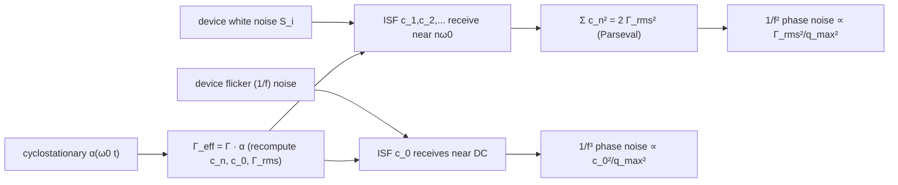

# Device noise → ISF harmonics mapping

> **β**: This English translation is in beta — the Traditional-Chinese original is the authoritative version.

> **Prerequisites**: [white_noise_to_phase_noise](/03_isf_core_theory/white_noise_to_phase_noise) (white → 1/f²), [flicker_noise_upconversion](/03_isf_core_theory/flicker_noise_upconversion) (flicker → 1/f³), [fourier_series_of_isf](/03_isf_core_theory/fourier_series_of_isf) ($c_0$, $c_n$) | **Next**: [symmetry](/06_design_insights/symmetry), [tank_swing](/06_design_insights/tank_swing), [serdes_clocking_connection](/06_design_insights/serdes_clocking_connection)

This page **collects the scattered design intuition from earlier pages into a single map**: how does the
noise (white and flicker) of one transistor end up as the oscillator's phase noise? The key is two things —
**which frequency band of device noise is picked up by which ISF harmonic**, and **the device does not leak
noise throughout the entire period (cyclostationary)**, so what actually matters is the
**effective ISF $\Gamma_{eff}=\Gamma\cdot\alpha$**.

> **Physical intuition (conclusion first)**: think of the ISF as a **multi-channel radio**. Its Fourier
> coefficients $c_n$ are the antenna gains of each channel: $c_0$ picks up device flicker "near DC"
> (upconverted to 1/f³); $c_1$ picks up device white noise "near $\omega_0$", $c_2$ "near $2\omega_0$", and so
> on (downconverted to 1/f²). But the device only actually conducts — only actually leaks noise — during
> **certain phases of the waveform**. This "when does it leak" switching function $\alpha(\omega_0 t)$ must be
> multiplied into $\Gamma$ first, becoming the effective ISF, before it is the radio's true antenna.

## Step 1: two "bands" of device noise

The drain current noise of a MOS device (referred to the injection node) splits roughly into two bands
([P1] Eqs.(19),(22), p.185):

$$
S_i(f)=\underbrace{\frac{\overline{i_n^2}}{\Delta f}}_{\text{white (flat)}}\;+\;\underbrace{\frac{\overline{i_n^2}}{\Delta f}\cdot\frac{\omega_{1/f}}{2\pi f}}_{\text{flicker (1/f)}}
$$

- **White noise**: thermal ($4kT\gamma g_m$-type) + shot, **flat with frequency**, energy spread over all
  frequencies, including near $\omega_0,2\omega_0,\dots$.
- **Flicker (1/f) noise**: slow trap/release processes in the channel, energy **concentrated at low
  frequency** ($\Delta\omega\ll\omega_0$), significant below the device's 1/f corner $\omega_{1/f}$.
- **Units**: both bands are A²/Hz.

## Step 2: ISF harmonics are "receive channels" — who picks up what

Substitute the ISF Fourier expansion ([P1] Eq.(12)) into the phase response ([P1] Eq.(13)): each $c_n$ term
is a mixer that shifts "noise near $n\omega_0$" down to baseband phase:

| ISF harmonic | Device-noise band received | Shifted to | Resulting phase-noise region |
|---|---|---|---|
| $c_0$ (DC term, value $c_0/2$) | **Low-frequency flicker** (near DC) | Pure integration, no shift | close-in **1/f³** ([P1] Eq.(23)) |
| $c_1$ | White at $\omega_0\pm\Delta\omega$ | Downconverted to $\Delta\omega$ | Main **1/f²** contribution |
| $c_2,c_3,\dots$ | White at $n\omega_0\pm\Delta\omega$ | Downconverted to $\Delta\omega$ | Also feeds **1/f²** (via $\sum c_n^2$) |

- **White noise → 1/f²**: all $c_n$ (the white part, $n\ge0$) contribute together, and via Parseval collapse
  to $\sum_{n=0}^{\infty}c_n^2=2\Gamma_{rms}^2$ ([P1] Eq.(20), p.185), giving
  $\mathcal{L}\propto\Gamma_{rms}^2/q_{max}^2$ ([P1] Eq.(21)). **So 1/f² is set by $\Gamma_{rms}$.**
- **Flicker → 1/f³**: only the DC channel $c_0$ receives it, giving $\mathcal{L}\propto c_0^2/q_{max}^2$
  ([P1] Eq.(23)). **So 1/f³ is set by $c_0$.**
- One-line summary: **$\Gamma_{rms}$ governs white (1/f²); $c_0$ governs flicker (1/f³).** This is the
  skeleton of the whole map.

The clearest way to see this "multi-channel radio" is a figure: the top half is the device's current-noise
PSD $S_i(f)$ (a near-DC flicker bump plus a flat white plateau); three shaded bands mark the frequency
ranges the ISF actually "listens to" (DC, $f_0$, $2f_0$); the bottom half is the same ISF's Fourier
coefficients $|c_n|$ as a stem plot, aligned under the bands above, with arrows showing each band folding
back to the carrier weighted by that harmonic's $c_n$ — $c_0$ **upconverts** near-DC flicker into close-in
1/f³, while $c_1,c_2$ **downconvert** white noise near $f_0,2f_0$ into 1/f².


> The $|c_n|$ in the figure are computed by `simulations/fig_device_noise_bands.py` using
> `compute_fourier_coefficients` on a toy asymmetric ISF ($\Gamma=-\sin\theta+0.35\sin2\theta+0.25$), giving
> $c_0=0.50$, $c_1=1.00$, $c_2=0.35$. This is a **pedagogical toy model (not transistor-level)**: it only
> illustrates the "harmonic = channel" mapping structure; the $S_i(f)$ vertical axis is in arb. units.
> Corresponds to [P1] Eq.(12),(13) (Fourier expansion → per-harmonic phase response) and Eq.(19),(23)
> (white/flicker summation).

Turning this map's "radio gain" into concrete algebra (this page has had relatively few equations so far;
here we fill in the three core relations, all from [P1] and consistent with the site's formula table):

**(M1) White → 1/f² phase noise** ([P1] Eq.(21), p.185; numerator is $\Gamma_{rms}$):

$$
\mathcal{L}_{1/f^2}\{\Delta\omega\}=10\log_{10}\!\left(\frac{\Gamma_{rms}^2}{q_{max}^2}\cdot\frac{\overline{i_n^2}/\Delta f}{4\,\Delta\omega^2}\right)
$$

**(M2) Flicker → 1/f³ phase noise** ([P1] Eq.(23), p.185; numerator is $c_0$):

$$
\mathcal{L}_{1/f^3}\{\Delta\omega\}=10\log_{10}\!\left(\frac{c_0^2}{q_{max}^2}\cdot\frac{\overline{i_n^2}/\Delta f}{8\,\Delta\omega^2}\cdot\frac{\omega_{1/f}}{\Delta\omega}\right)
$$

**(M3) Relative height of the two regions (same offset, divide the linear bracket of (M2) by (M1))**:

$$
\frac{\mathcal{L}_{1/f^3}}{\mathcal{L}_{1/f^2}}\bigg|_{\text{linear}}
=\frac{c_0^2/(8\,\Delta\omega^2)}{\Gamma_{rms}^2/(4\,\Delta\omega^2)}\cdot\frac{\omega_{1/f}}{\Delta\omega}
=\frac{c_0^2}{2\,\Gamma_{rms}^2}\cdot\frac{\omega_{1/f}}{\Delta\omega}
$$

- **Use of (M3)**: at any given offset, this ratio $> 1$ means flicker (1/f³) dominates, $< 1$ means white
  (1/f²) dominates; setting it $=1$ solves for the 1/f³ corner
  $\Delta\omega_{1/f^3}=\omega_{1/f}\cdot c_0^2/(2\Gamma_{rms}^2)$ ([P1] Eq.(24), derivation in
  [symmetry](/06_design_insights/symmetry)).
- **Dimension check**: the right-hand side of (M3) is $\dfrac{\text{dimensionless}^2}{\text{dimensionless}^2}\cdot\dfrac{[\text{rad/s}]}{[\text{rad/s}]}$
  = dimensionless ✓ (a pure ratio, correct).

## Step 3: cyclostationary — the device does not leak noise all the time

The $\Gamma$ above is the "bare ISF" — it assumes the noise is equally large at every instant. But a real
device's noise strength is **periodically varying (cyclostationary)**: e.g. a tail current source conducts
only during part of the cycle, and a switching pair's $g_m$ peaks only during transitions. Hajimiri–Lee
describe "when the device is leaking noise" with a **noise-modulating function (NMF)** $\alpha(\omega_0 t)$
($0\le\alpha\le1$, periodic), folded into the ISF ([P1] Sec. II-D, Eq.(25)–(27), p.186;
$i_n(t)=i_{n0}(t)\cdot\alpha(\omega_0 t)$ is Eq.(25), $\Gamma_{eff}=\Gamma\cdot\alpha$ is Eq.(27)):

$$
\boxed{\ \Gamma_{eff}(\omega_0\tau)=\Gamma(\omega_0\tau)\cdot\alpha(\omega_0\tau)\ }
$$

- **Meaning**: what actually enters the phase-noise formulas is not $\Gamma$ but $\Gamma_{eff}$. All of
  $c_n$, $c_0$, $\Gamma_{rms}$ must be recomputed using $\Gamma_{eff}$.
- **A design-critical consequence**: even if waveform symmetry makes the bare $\Gamma$'s $c_0=0$, if the
  device leaks noise only during half the cycle ($\alpha$ asymmetric), $\Gamma_{eff}=\Gamma\cdot\alpha$ can
  **regrow a nonzero $c_0$** → flicker gets upconverted again. Conversely, aligning the device's "conduction
  window $\alpha$" with the low-value phase of the bare $\Gamma$ can **simultaneously lower $c_0$ and
  $\Gamma_{rms}$**.
- A more rigorous mathematical foundation (PPV / adjoint / Floquet) **is not in the five downloaded PDFs and
  is supplemented from standard literature** (Demir–Mehrotra–Roychowdhury 2000, etc.); see
  [effective_isf](/03_isf_core_theory/effective_isf).

A toy calculation using the built-in functions (**pedagogical toy model, not transistor-level**):

```python
import numpy as np
from simulations.common.isf_utils import (
    gamma_lc_ideal, effective_isf, compute_fourier_coefficients, gamma_rms)

theta = np.linspace(0, 2*np.pi, 2048, endpoint=False)
gamma = gamma_lc_ideal(theta)            # bare ISF = -sin(theta), c0 = 0
# Asymmetric NMF: device conducts only in the first half-cycle (alpha=1 for theta<pi, else 0)
alpha = np.where(theta < np.pi, 1.0, 0.0)
gamma_eff = effective_isf(gamma, alpha)       # multiply by NMF (positional: gamma_values, alpha_values)
a0, a, b, c, ph = compute_fourier_coefficients(theta, gamma_eff, n_harmonics=8)
print("c0 =", a0, " Gamma_rms =", gamma_rms(theta, gamma_eff))
# -> c0 ≈ -0.637 (bare Γ had c0=0; regrown by the asymmetric α), Gamma_rms ≈ 0.500
```

(Full API in `simulations/common/isf_utils.py`; `effective_isf` and `gamma_rms` are real functions.)

## Step 4: two independent levers — which knobs move $\Gamma_{rms}$, which move $q_{max}$

The core phase-noise ratios are $\dfrac{\Gamma_{rms}^2}{q_{max}^2}$ (white, [P1] Eq.(21)) and
$\dfrac{c_0^2}{q_{max}^2}$ (flicker, [P1] Eq.(23)). The numerator (ISF shape) and denominator (charge swing)
are **two mutually independent** knobs. Classifying every design knob by "which quantity it moves":

| Move **$\Gamma_{rms}$ / $c_0$** (ISF shape) | Move **$q_{max}$** (charge swing) |
|---|---|
| Waveform symmetry (matched rise/fall) → lowers $c_0$ | Increase voltage swing $V_{max}$ |
| Fast transitions (steep edges) → lowers $\Gamma_{rms}$ | Raise tank $Q$/$R_p$ (larger swing at the same current) |
| Ring stage count $N\uparrow$ → $\Gamma_{rms}\propto N^{-3/2}$ (below) | Increase node capacitance $C$ (ties to $f_0$; use with care) |
| Symmetric load, differential → lowers even harmonics, lowers $c_0$ | Differential → 2× effective swing |
| Align device conduction window $\alpha$ with low-$\Gamma$ phase (cyclostationary) → lowers effective $\Gamma_{rms}$, $c_0$ | Push bias to the headroom limit (current/voltage limited) |
| Lower device $\omega_{1/f}$ (larger area, PMOS) → lowers 1/f³ height (does not change $c_0$) | — |

> The ring's $\Gamma_{rms}\propto N^{-3/2}$ comes from [P2] Eq.(16), p.794 (re-verified in v7: the square
> root covers only the constant, $\Gamma_{rms} \propto N^{-3/2}$; triple-checked against the main text's
> 4/N^{1.5}@η=0.75 and Appendix B Eq.(55). v3 had misread this as N^{-3/4}):
> $\Gamma_{rms}=\sqrt{\dfrac{2\pi^2}{3\eta^3}}\cdot\dfrac{1}{N^{1.5}}$ ($\eta\approx1$ is the stage-delay
> proportionality constant), and at fixed $f_0$ and fixed power ring phase noise is roughly
> **independent of $N$** (the device count growing with $N$ offsets the drop in $\Gamma_{rms}$) — see
> [lc_vs_ring](/06_design_insights/lc_vs_ring).

## Numerical example (building intuition)

> Map a single device's two noise bands onto the two phase-noise regions.

Take canonical values: $f_0=5$ GHz, $q_{max}=1$ pC, $\Gamma_{rms}=0.5$, $S_i=10^{-24}$ A²/Hz, asymmetric
$c_0=0.4$, device $f_{1/f}=1$ MHz.

- **White → 1/f²** (@ $\Delta f=1$ MHz, [P1] Eq.(21)): as in Example B, $\mathcal{L}=-148.0$ dBc/Hz.
- **Flicker → 1/f³** (@ $\Delta f=1$ MHz, [P1] Eq.(23)): relative to 1/f² there is an extra factor
  $\dfrac{c_0^2}{2\Gamma_{rms}^2}\cdot\dfrac{\omega_{1/f}}{\Delta\omega}$.
  At $\Delta f=1$ MHz $=f_{1/f}$ the two regions cross ($\omega_{1/f}/\Delta\omega=1$); 1/f³ is
  $10\log_{10}(c_0^2/(2\Gamma_{rms}^2))=10\log_{10}(0.32)=-4.9$ dB relative to 1/f² — i.e. at this offset the
  flicker contribution is still slightly below white; the crossover point (1/f³ corner) falls at
  $f_{1/f^3}=f_{1/f}\cdot c_0^2/(2\Gamma_{rms}^2)=320$ kHz (see [symmetry](/06_design_insights/symmetry)).
  Only below 320 kHz does flicker dominate.
- **Intuition**: at 1 MHz offset flicker is barely visible (masked by white); to see 1/f³ you need to look
  below 100 kHz. If a SerDes loop bandwidth filters out the close-in region, the 1/f³ impact shrinks (see
  [serdes_clocking_connection](/06_design_insights/serdes_clocking_connection)).

## The full map (mermaid)



## Validity and breakdown conditions

| Condition | Holds when | Breaks down when |
|---|---|---|
| Small perturbation, linear LTV | Per-band $c_n$ mapping holds | Strong nonlinearity, large injection — the ISF itself changes |
| Noise separable into white + 1/f | Two regions cleanly separated | RTS/burst/correlated noise needs separate treatment |
| Cyclostationary via $\Gamma_{eff}=\Gamma\cdot\alpha$ | First-order correction is sufficient | When rigorous PPV/adjoint treatment is needed (external literature) |

## Worked examples

The following two problems map **white** and **flicker** device noise onto phase noise respectively,
demonstrating the two independent knobs $\Gamma_{rms}$ (governing white) and $c_0$ (governing flicker).
Using canonical values: $f_0=5$ GHz, $q_{max}=1$ pC, $\Gamma_{rms}=0.5$,
$S_i=\overline{i_n^2}/\Delta f=10^{-24}$ A²/Hz, asymmetric $c_0=0.4$, device $f_{1/f}=1$ MHz.

> **Example 1 (mapping white noise onto $\Gamma_{rms}$ → 1/f² height)**
> Use (M1) to compute the 1/f² phase noise at $\Delta f=1$ MHz; then ask how much it drops (in dB) if
> $\Gamma_{rms}$ is halved ($0.5\to0.25$).

**Step-by-step substitution (with units)**:

$$
\begin{aligned}
\Delta\omega&=2\pi\times10^{6}=6.283\times10^{6}\ \text{rad/s},\quad \Delta\omega^2=3.948\times10^{13}, \\[4pt]
\text{bracket}&=\frac{(0.5)^2}{(10^{-12})^2}\cdot\frac{10^{-24}}{4\times3.948\times10^{13}}
=\frac{0.25}{10^{-24}}\cdot\frac{10^{-24}}{1.579\times10^{14}}=1.583\times10^{-15}, \\[4pt]
\mathcal{L}_{1/f^2}&=10\log_{10}(1.583\times10^{-15})=-148.0\ \text{dBc/Hz}.
\end{aligned}
$$

Halving $\Gamma_{rms}$ → $\Gamma_{rms}^2$ becomes $\tfrac14$ →
$\Delta\mathcal{L}=10\log_{10}(0.25^2/0.5^2)=10\log_{10}(1/4)=-6.02$ dB → new value $-154.0$ dBc/Hz.

- **Result**: white noise's 1/f² height $=-148.0$ dBc/Hz; halving $\Gamma_{rms}$ → 6 dB improvement.
  **White depends only on $\Gamma_{rms}$, not on $c_0$ at all.**
- **Dimension check**: same as tank_swing Example 1 — the bracket reduces to a dimensionless per-Hz power
  ratio → dBc/Hz ✓.
- **One-line Python check**:

```python
import numpy as np
def L_white(grms, qmax, Si, dw): return 10*np.log10(grms**2/qmax**2 * Si/(4*dw**2))
dw = 2*np.pi*1e6
print(round(L_white(0.5,1e-12,1e-24,dw),1),
      round(L_white(0.25,1e-12,1e-24,dw)-L_white(0.5,1e-12,1e-24,dw),2))  # -> -148.0 -6.02
```

> **Example 2 (mapping flicker noise onto $c_0$ → 1/f³ height, using (M3) to determine which region dominates)**
> Use (M2) to compute the 1/f³ phase noise at $\Delta f=100$ kHz, and use (M3) to determine whether that
> offset is dominated by flicker or white.

**Step-by-step substitution (with units)**, first computing the (M3) ratio to determine which dominates
($\Delta f=100$ kHz $\Rightarrow\omega_{1/f}/\Delta\omega=f_{1/f}/\Delta f=10$):

$$
\frac{\mathcal{L}_{1/f^3}}{\mathcal{L}_{1/f^2}}\bigg|_{\text{linear}}
=\frac{c_0^2}{2\Gamma_{rms}^2}\cdot\frac{f_{1/f}}{\Delta f}
=\frac{0.4^2}{2\times0.5^2}\cdot\frac{10^6}{10^5}
=0.32\times10=3.2\;(>1).
$$

Ratio $3.2 > 1$ → at 100 kHz **flicker already dominates** (consistent with the corner
$f_{1/f^3}=320$ kHz $>100$ kHz). The flicker height itself:

$$
\begin{aligned}
\Delta\omega&=2\pi\times10^{5}=6.283\times10^{5}\ \text{rad/s},\quad\Delta\omega^2=3.948\times10^{11}, \\[4pt]
\text{bracket}&=\frac{(0.4)^2}{(10^{-12})^2}\cdot\frac{10^{-24}}{8\times3.948\times10^{11}}\cdot\frac{2\pi\times10^6}{2\pi\times10^5} \\[4pt]
&=\frac{0.16}{10^{-24}}\cdot\frac{10^{-24}}{3.158\times10^{12}}\cdot 10
=\frac{0.16\times10}{3.158\times10^{12}}=5.066\times10^{-13}, \\[4pt]
\mathcal{L}_{1/f^3}&=10\log_{10}(5.066\times10^{-13})=-122.95\approx-123.0\ \text{dBc/Hz}.
\end{aligned}
$$

- **Result**: at 100 kHz, 1/f³ (flicker) is about $-123.0$ dBc/Hz and **dominant** (ratio 3.2).
  **Flicker depends only on $c_0$**: if symmetrizing the waveform brings $c_0\to0.04$ (10× smaller), this
  1/f³ curve drops by $10\log_{10}(0.04^2/0.4^2)=-20$ dB overall.
- **Dimension check**: the (M3) ratio is dimensionless ✓; (M2)'s bracket has an extra dimensionless factor
  $\omega_{1/f}/\Delta\omega$, changing the slope to $1/\Delta\omega^3$ (1/f³) ✓.
- **One-line Python check**:

```python
import numpy as np
c0, grms, qmax, Si, f1f = 0.4, 0.5, 1e-12, 1e-24, 1e6
df = 1e5; dw = 2*np.pi*df
ratio = c0**2/(2*grms**2) * (f1f/df)
L_1f3 = 10*np.log10(c0**2/qmax**2 * Si/(8*dw**2) * (f1f/df))
print(round(ratio,2), round(L_1f3,1))   # -> 3.2  -123.0  (ratio>1 => flicker dominates)
```

> Both problems are **pedagogical toys (not transistor-level)**: $c_0$ and $\Gamma_{rms}$ use assumed values.
> A real circuit must recompute $c_0$, $\Gamma_{rms}$ using the effective ISF $\Gamma_{eff}=\Gamma\cdot\alpha$
> (see Step 3 and [effective_isf](/03_isf_core_theory/effective_isf)).

## Key takeaways

- Device noise has two bands: white (spread over all frequencies), flicker (concentrated at low frequency).
- ISF harmonics are receive channels: **$c_0$ receives flicker → 1/f³**; **$c_1,c_2,\dots$ receive white →
  1/f²** (collapsed to $\Gamma_{rms}$ via Parseval).
- What actually matters is the **effective ISF $\Gamma_{eff}=\Gamma\cdot\alpha$** (cyclostationary); a
  symmetric bare $\Gamma$ can regrow $c_0$ because of an asymmetric $\alpha$.
- Two independent levers: move $\Gamma_{rms}$/$c_0$ (waveform symmetry, fast edges, differential, $\alpha$
  alignment) vs. move $q_{max}$ (swing, $Q$, differential).
- Ring $\Gamma_{rms}\propto N^{-3/2}$ ([P2] Eq.(16), p.794, re-verified in v7: the square root covers only
  the constant); at fixed $f_0$/power, phase noise is roughly independent of $N$.

## Further reading

- Effective ISF and PPV/adjoint: [effective_isf](/03_isf_core_theory/effective_isf)
- White → 1/f²: [white_noise_to_phase_noise](/03_isf_core_theory/white_noise_to_phase_noise)
- Flicker → 1/f³: [flicker_noise_upconversion](/03_isf_core_theory/flicker_noise_upconversion)
- $\Gamma_{rms}$ and Parseval: [rms_isf](/03_isf_core_theory/rms_isf)
- $q_{max}$ lever: [tank_swing](/06_design_insights/tank_swing); symmetry: [symmetry](/06_design_insights/symmetry)
- Correlated supply/substrate noise shuts down $N-1$ channels of this map at once, leaving only DC and $k\cdot N\cdot f_0$ ([P2] Eqs.(37)–(38) selection rule): [lab_34_correlated_supply](/04_simulation_labs/lab_34_correlated_supply)
