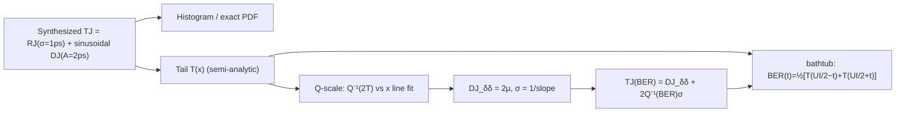

> **β**: This English translation is in beta — the Traditional-Chinese original is the authoritative version.

import DualDiracFitter from "@site/src/components/DualDiracFitter";

# DJ and the Dual-Dirac Model: The Industry-Standard Tool for TJ@BER

> **Prerequisites**: [serdes_clocking_connection](/06_design_insights/serdes_clocking_connection) (first appearance of RJ/DJ/TJ, eye and BER), [lab_12](/04_simulation_labs/lab_12_serdes_eye_ber) (RJ-only bathtub), [lab_08](/04_simulation_labs/lab_08_jitter_integration) ($\sigma_t$ integrated from phase noise) | **Next**: [exercises](/06_design_insights/exercises), [lab_13](/04_simulation_labs/lab_13_pll_cdr_transfer)

[serdes_clocking_connection](/06_design_insights/serdes_clocking_connection) already gave the shorthand
"TJ $=$ DJ $+\,2Q\cdot$RJ". This page builds that formula **rigorously from scratch**: what RJ is, what DJ is,
which integral $Q$ comes from, how the bathtub curve is derived from the CDF (cumulative distribution function) of jitter,
and the **dual-Dirac model** the industry actually uses (SerDes specs from Fibre Channel MJSQ onward)
— including its most misunderstood and most important honesty note: **the model parameter $\mathrm{DJ}_{\delta\delta}$ is inherently
less than or equal to the actual peak-to-peak DJ**, and this "under-report" is **deliberate** — it is precisely what makes the TJ extrapolation accurate.

> **Physical intuition (conclusion first)**: jitter has two fundamentally different components. **RJ (random jitter)**
> is the time-domain incarnation of oscillator phase noise — Gaussian, **unbounded**; the longer you wait (the tighter the BER target), the larger it "grows",
> so it must be booked as $\sigma$ times a multiplier that increases with the BER target. **DJ (deterministic jitter)**
> is driven by deterministic physical mechanisms (inter-symbol interference, duty-cycle distortion, supply ripple); its amplitude has a **physical upper bound**,
> so it is booked peak-to-peak and does not grow with BER. The dual-Dirac model compresses "bounded DJ of arbitrary shape"
> into **two Diracs** and keeps RJ as a Gaussian, in exchange for a straight line that can be extrapolated to $10^{-12}$.
> Measuring a BER of $10^{-12}$ requires waiting for $10^{12}$ bits — even at 10 Gb/s that is 100 s just to "see one error on average",
> and statistical confidence takes hours; **extrapolation is not laziness, it is an engineering necessity**.

## Step 1: RJ — unbounded Gaussian, all the way from phase noise (this site's chain)

RJ is the endpoint of the chain built over this site's first six chapters; a step-by-step recap (each step has its own page):

1. **Device white noise → 1/f² phase noise**: [P1] Eq.(21), p.185 gives
   $\mathcal{L}\{\Delta\omega\}=10\log_{10}\!\big(\tfrac{\Gamma_{rms}^2}{q_{max}^2}\cdot\tfrac{\overline{i_n^2}/\Delta f}{4\Delta\omega^2}\big)$
   ($\Gamma_{rms}$ dimensionless, $q_{max}$ in C, $\overline{i_n^2}/\Delta f$ in A²/Hz).
   See [white_noise_to_phase_noise](/03_isf_core_theory/white_noise_to_phase_noise).
2. **Phase-noise integration → rms jitter**: $\sigma_t=\frac{1}{2\pi f_0}\sqrt{\int_{f_1}^{f_2}S_\phi(f)\,df}$
   (unit: s; canonical example C: $f_0=5$ GHz, $\mathcal{L}(1\text{MHz})=-100$ dBc/Hz, 1/f², integrate 1→100 MHz
   → $\sigma_t=447.9$ fs). See [lab_08](/04_simulation_labs/lab_08_jitter_integration).
3. **Time-domain view — random walk**: [P2] Eq.(8), p.792 gives the accumulated **phase** jitter
   $\sigma_{\Delta\phi}=\kappa\sqrt{\Delta t}$ ($\kappa$ in $1/\sqrt{\text{s}}$, from [P2]
   Eq.(11)/(12), p.793 $\kappa=\tfrac{\Gamma_{rms}}{q_{max}}\sqrt{\tfrac12\overline{i_n^2}/\Delta f}$;
   note the expression contains **no** $\omega_0$ — converting to the time version requires dividing by $\omega_0$ once more).
4. **Why Gaussian**: every period the oscillator absorbs a large number of **mutually independent** tiny noise kicks; the total phase error is
   a sum of independent increments → central limit theorem → Gaussian. [lab_11](/04_simulation_labs/lab_11_monte_carlo_jitter)
   verified directly by Monte Carlo that the histogram is Gaussian and $\sigma\propto\sqrt{\Delta N}$.

**RJ's key property: no upper bound.** The Gaussian tail is never zero — there is no "guaranteed never to cross" margin;
you can only ask "how small is the crossing probability". This is why RJ must be booked as $\sigma$ paired with a target BER (the $Q$ function of Step 3).

## Step 2: DJ — bounded, driven by deterministic mechanisms

DJ is the half that ISF theory "cannot see" (it does not come from the oscillator's random noise), yet it is often the largest component of the TJ measured in a SerDes.
Three main sources, each with clear physics and a clear upper bound:

| DJ type | Physical mechanism | PDF shape | Why bounded |
|---|---|---|---|
| **ISI** (inter-symbol interference) | Finite channel bandwidth with memory: edge position depends on the preceding bit pattern | Multiple discrete spikes (one per pattern) | Channel impulse response has finite length |
| **DCD** (duty-cycle distortion) | Rise/fall asymmetry, threshold offset: rising edges systematically early, falling edges late | **Exactly two Diracs** | The asymmetry is a fixed amount |
| **PJ/SJ** (periodic/sinusoidal jitter; supply spurs, crosstalk) | Supply ripple modulates the VCO via supply pushing (see [varactor_tuning_supply_pushing](/06_design_insights/varactor_tuning_supply_pushing)); coupling from adjacent clocks | arcsine (double-horn) distribution | Sinusoid amplitude is fixed |

Note that **DCD's PDF is inherently two Diracs** — the dual-Dirac model is **exact** for it;
the model's name and shape come precisely from this "worst-case shape".

**PDF of sinusoidal DJ (the arcsine distribution), derived step by step.** This is the DJ used in lab_31 and the standard model for supply spurs.
Let the edge's time offset be $x=A\sin\theta$, with $A$ the amplitude (unit: s); the spur is asynchronous with the data,
so the sampled phase $\theta$ is uniform on $[0,2\pi)$, $p_\Theta(\theta)=\tfrac{1}{2\pi}$ (unit: 1/rad).
Change of variables: within one period each $x\in(-A,A)$ corresponds to **two** $\theta$ branches, each contributing
$p_\Theta/\vert dx/d\theta\vert$, and $\vert dx/d\theta\vert=A\vert\cos\theta\vert=\sqrt{A^2-x^2}$:

$$
p_{DJ}(x)=2\cdot\frac{1}{2\pi}\cdot\frac{1}{\sqrt{A^2-x^2}}=\frac{1}{\pi\sqrt{A^2-x^2}},\qquad \vert x\vert\lt A
$$

- **Units**: $1/\sqrt{[\text{s}^2]}=1/[\text{s}]$ ✓ (the PDF integrated over $x$ is dimensionless).
- **Normalization check**: $\int_{-A}^{A}\frac{dx}{\pi\sqrt{A^2-x^2}}=\frac{1}{\pi}\big[\arcsin\tfrac{x}{A}\big]_{-A}^{A}=\frac{1}{\pi}\big(\tfrac{\pi}{2}+\tfrac{\pi}{2}\big)=1$ ✓.
- **Physics**: the sinusoid dwells longest near its turning points → the probability density **diverges** at the two ends $\pm A$ (an integrable "double horn").
  Both horns are clearly visible in the histogram of lab_31 panel (a).
- **Bounded**: $\mathrm{DJ}_{pp}=2A$ (peak-to-peak, unit: s). **Applicability**: the spur is asynchronous with the data
  (uniform phase); if the spur is locked to the data (synchronous), the PDF degenerates into discrete spikes — still bounded.

## Step 3: The $Q$ function — Gaussian tail integral, and where $Q^{-1}(10^{-12})=7.03$ comes from

RJ's bookkeeping tool is the Gaussian tail probability. For a standard normal $X\sim\mathcal{N}(0,1)$ (dimensionless):

$$
Q(x)\equiv P(X\gt x)=\int_x^{\infty}\frac{1}{\sqrt{2\pi}}\,e^{-u^2/2}\,du
$$

**Step-by-step reduction to erfc** (this is what connects it to `scipy` and this site's `serdes_utils.Q`). Substitute $u=\sqrt2\,s$, $du=\sqrt2\,ds$;
the lower limit becomes $x/\sqrt2$:

$$
Q(x)=\frac{\sqrt2}{\sqrt{2\pi}}\int_{x/\sqrt2}^{\infty}e^{-s^2}\,ds=\frac{1}{\sqrt\pi}\int_{x/\sqrt2}^{\infty}e^{-s^2}\,ds=\frac12\,\mathrm{erfc}\!\Big(\frac{x}{\sqrt2}\Big)
$$

The last step used the definition $\mathrm{erfc}(z)=\tfrac{2}{\sqrt\pi}\int_z^\infty e^{-s^2}ds$.
For a general Gaussian (mean $\mu$, standard deviation $\sigma$, both in s), substitute once more with $u=(v-\mu)/\sigma$ to get
$P(V\gt v)=Q\!\big(\tfrac{v-\mu}{\sigma}\big)$ — **the argument of $Q$ is always "how many $\sigma$ from the mean", dimensionless** ✓.

**Deep-tail asymptotic form (one integration by parts)**:

$$
Q(x)\approx\frac{e^{-x^2/2}}{x\sqrt{2\pi}}\quad(x\gg1,\ \text{相對誤差約}\ 1/x^2)
$$

Use it to estimate $Q(7.03)$ by hand: exponent $7.034^2/2=24.7$, $e^{-24.7}\approx1.8\times10^{-11}$,
divide by $7.03\times2.507\approx17.6$ → $\approx1.0\times10^{-12}$ ✓. This is the
"BER $10^{-12}$ ↔ $7.03\sigma$" correspondence used throughout this site's jitter chapters (consistent with the $Q$ table in [06 exercises](/06_design_insights/exercises)):

| Target BER | $Q^{-1}(\text{BER})$ | RJ peak-to-peak $=2Q^{-1}\sigma$ |
|---|---|---|
| $10^{-9}$ | $5.998$ | $12.0\,\sigma$ |
| $10^{-12}$ | $7.034$ (written 7.03 on this site) | $14.07\,\sigma$ |
| $10^{-15}$ | $7.941$ (written 7.94 on this site) | $15.88\,\sigma$ |

One-line Python verification (using this site's real API; $Q^{-1}$ inverts the tail integral above via `erfcinv`):

```python
import numpy as np
from scipy.special import erfcinv
from simulations.common.serdes_utils import Q
q = np.sqrt(2) * erfcinv(2 * 1e-12)              # inverse of Q (inverting the tail integral)
print("Qinv(1e-12) =", round(float(q), 3))       # -> 7.034
print("Q(7.034)    =", float(Q(7.034)))          # -> 1.0e-12
```

## Step 4: The dual-Dirac model — definition and PDF

The model does two things (external literature, not among the five source PDFs; methodology references at the bottom of the page):

1. **The TJ PDF is the convolution of the DJ PDF with the Gaussian RJ** (RJ and DJ statistically independent):
   $p_{TJ}=p_{DJ}*g_\sigma$, where $g_\sigma(x)=\tfrac{1}{\sigma\sqrt{2\pi}}e^{-x^2/2\sigma^2}$ (unit: 1/s).
2. **Compress the bounded $p_{DJ}$ of arbitrary shape into two equal-weight Diracs**, with spacing denoted $\mathrm{DJ}_{\delta\delta}$:

$$
p_{DJ}(x)\ \longrightarrow\ \frac12\,\delta(x-\mu_R)+\frac12\,\delta(x-\mu_L),\qquad \mathrm{DJ}_{\delta\delta}\equiv\mu_R-\mu_L
$$

The convolution uses the Dirac sampling property $\int\delta(v-\mu)g_\sigma(x-v)dv=g_\sigma(x-\mu)$, giving the model PDF in one step:

$$
p_{\delta\delta}(x)=\frac12\,g_\sigma(x-\mu_R)+\frac12\,g_\sigma(x-\mu_L)
$$

— **two Gaussians with the same $\sigma$, each carrying half the probability**. In the symmetric case (this page and lab_31), $\mu_R=-\mu_L=\mu=\mathrm{DJ}_{\delta\delta}/2$.

**The tail function, integrated step by step.** Define $T(x)\equiv P(\text{jitter}\gt x)=1-F(x)$ ($F$ is the CDF).
Apply Step 3's result term by term to the model PDF, $\int_x^\infty g_\sigma(v-\mu)\,dv=Q\big(\tfrac{x-\mu}{\sigma}\big)$:

$$
T_{\delta\delta}(x)=\frac12\,Q\!\Big(\frac{x-\mu_R}{\sigma}\Big)+\frac12\,Q\!\Big(\frac{x-\mu_L}{\sigma}\Big)
$$

**Only one term survives in the deep tail.** The ratio of the two terms (asymptotic form, symmetric case):

$$
\frac{Q\big(\tfrac{x+\mu}{\sigma}\big)}{Q\big(\tfrac{x-\mu}{\sigma}\big)}\approx\exp\!\Big(-\frac{(x+\mu)^2-(x-\mu)^2}{2\sigma^2}\Big)=\exp\!\Big(-\frac{2\mu x}{\sigma^2}\Big)=\exp\!\Big(-\frac{\mathrm{DJ}_{\delta\delta}\,x}{\sigma^2}\Big)
$$

With lab_31's numbers ($\mathrm{DJ}_{\delta\delta}=3.16$ ps, $\sigma=1.03$ ps, region of interest $x\approx8.6$ ps),
this ratio is $\approx e^{-25.6}\approx8\times10^{-12}$ — completely negligible. So **the deep tail is just a single Gaussian with weight ½**:

$$
T_{\delta\delta}(x)\approx\frac12\,Q\!\Big(\frac{x-\mu}{\sigma}\Big)\qquad(x\ \text{在右深尾})
$$

**The Q-scale straight line — the principle behind extracting $(\mathrm{DJ}_{\delta\delta},\sigma)$.** Invert the expression above:

$$
Q^{-1}\big(2\,T(x)\big)=\frac{x-\mu}{\sigma}
$$

— on the "Q-scale" (vertical axis $Q^{-1}(2T)$, horizontal axis $x$), the deep tail is **a straight line**: slope $1/\sigma$,
horizontal-axis intercept $\mu=\mathrm{DJ}_{\delta\delta}/2$. Instruments (a BERT scan or an oscilloscope's TIE histogram) perform exactly this
**straight-line fit** to the measured tail. Note the **factor 2** inside $Q^{-1}$: it books the fact that "each Dirac carries only half the probability"
— the first factor-of-2 to keep an eye on in this page (Step 7 has two more).

## Step 5: The bathtub curve — derived step by step from the jitter CDF

Assume NRZ data with UI (unit interval) $=T_b$ (unit: s). Take the eye center as the time origin and let the sampling-instant offset be $t$;
the left data edge sits nominally at $-UI/2$, the right edge at $+UI/2$, each carrying jitter $x$ (identically distributed, tail $T$, CDF $F$).

1. **Error event one (left edge late)**: the left edge actually lands at $-UI/2+x$; if it arrives **later** than the sampling instant,
   i.e. $-UI/2+x\gt t\Leftrightarrow x\gt UI/2+t$, the sampler reads the **previous bit**. Probability $=T(UI/2+t)$.
2. **Error event two (right edge early)**: the right edge actually lands at $+UI/2+x$; if it arrives **earlier** than the sampling instant,
   i.e. $UI/2+x\lt t\Leftrightarrow x\lt-(UI/2-t)$, probability $=F(-(UI/2-t))$,
   which for a symmetric distribution $=T(UI/2-t)$.
3. **Only a transition can produce an error**: for random data the probability that adjacent bits differ is $\tfrac12$ (transition density
   $\rho_T=\tfrac12$). Both events are rare, so the probability of the union $\approx$ the sum (the intersection is second-order small):

$$
\boxed{\ \mathrm{BER}(t)=\frac12\Big[T\!\Big(\frac{UI}{2}-t\Big)+T\!\Big(\frac{UI}{2}+t\Big)\Big]\ }
$$

**Consistency check**: for pure RJ, $T(x)=Q(x/\sigma_t)$ and the expression reduces to
$\mathrm{BER}(t)=\tfrac12[Q(\tfrac{UI/2-t}{\sigma_t})+Q(\tfrac{UI/2+t}{\sigma_t})]$
— exactly the formula of [lab_12](/04_simulation_labs/lab_12_serdes_eye_ber) and `serdes_utils.ber_bathtub`
✓. **The bathtub's two "walls" are just the left and right tails of the jitter CDF**, replotted with the horizontal axis
changed from "jitter magnitude" to "sampling position". DJ's effect is immediately visible: it **shifts** the entire tail by $\approx\mu$ → both walls move inward;
RJ sets the walls' **slope** (on a log-BER axis, the slope is set by $\sigma$).

- **Dimension check**: the argument of $T$ is $[\text{s}]$, its output a probability (dimensionless); BER dimensionless ✓.
- **Applicability**: rare events ($\mathrm{BER}\ll1$); edge jitter stationary and data-independent (strictly speaking, ISI **is data-correlated** —
  see the failure conditions in Step 8).

## Step 6: The TJ(BER) extrapolation formula — derivation and factor audit

**Derivation.** Goal: at a specified BER, how much eye width does jitter "eat"? Define the right-wall position $x_R$ as the point where the dominant Gaussian
of the right deep tail drops to the target BER (industry convention books the per-Gaussian tail $=$ BER directly; audit below):

$$
Q\!\Big(\frac{x_R-\mu}{\sigma}\Big)=\mathrm{BER}\ \Longrightarrow\ x_R=\mu+\sigma\,Q^{-1}(\mathrm{BER})
$$

Symmetrically, the left wall $x_L=-\mu-\sigma Q^{-1}(\mathrm{BER})$. Total jitter is defined as the total width eaten by the two walls:

$$
\boxed{\ \mathrm{TJ}(\mathrm{BER})=x_R-x_L=\mathrm{DJ}_{\delta\delta}+2\,Q^{-1}(\mathrm{BER})\,\sigma\ }
$$

At BER $=10^{-12}$, $\mathrm{TJ}=\mathrm{DJ}_{\delta\delta}+14.07\,\sigma$. Horizontal eye opening
$=UI-\mathrm{TJ}(\mathrm{BER})$.

- **Dimension check**: $[\text{s}]+[\text{無因次}]\times[\text{s}]=[\text{s}]$ ✓.
- **Physical meaning**: the DJ part **does not change with BER** (bounded, eaten once); the RJ part grows slowly as $Q^{-1}$
  while the BER tightens ($10^{-12}\to10^{-15}$ only moves from $14.07\sigma$ to $15.88\sigma$ — the logarithmic
  growth of the Gaussian tail).

> **Factor-of-2 audit (site convention: spell out every 2)**. The formula above uses $Q^{-1}(\mathrm{BER})=7.034$,
> which implicitly books "**the tail of each Gaussian** $=$ BER". Strictly following the bookkeeping of Steps 4 and 5 there are two more ½'s:
> the Dirac weight ½ (per-side tail $T=\tfrac12Q$) and the transition density $\rho_T=\tfrac12$ (the bathtub multiplies by ½ again).
> With everything counted, the wall position is set by $Q=4\times\mathrm{BER}$:
>
> | Convention | Wall condition | Multiplier (BER $=10^{-12}$) | lab_31 resulting TJ |
> |---|---|---|---|
> | per-Gaussian (industry formula) | $Q=\mathrm{BER}$ | $7.034$ | $17.65$ ps |
> | per-side tail $T=\mathrm{BER}$ | $Q=2\,\mathrm{BER}$ | $6.937$ | $17.43$ ps |
> | bathtub ($\rho_T=\tfrac12$, this site's lab_12 convention) | $Q=4\,\mathrm{BER}$ | $6.839$ | $17.23$ ps |
>
> The three differ by $Q^{-1}(10^{-12})-Q^{-1}(4\times10^{-12})=0.196\,\sigma$/side — $0.40$ ps total in this example,
> about 2% of TJ; the industry formula is **conservative**. In practice this is not a problem, because $(\mathrm{DJ}_{\delta\delta},\sigma)$
> are fitted from the tail and substituted back for extrapolation under **one and the same convention** — with a consistent convention the errors nearly cancel;
> but **when comparing DJ/RJ reports from different instruments, always first ask which convention each one uses**. (lab_31 prints all three numbers.)

## Step 7: The honesty note — $\mathrm{DJ}_{\delta\delta}\le\mathrm{DJ}_{pp}$, and the under-report is deliberate

This is the most commonly misunderstood point about dual-Dirac: **$\mathrm{DJ}_{\delta\delta}$ is a model parameter, not the actual
peak-to-peak DJ**. lab_31's numbers: the true sinusoidal DJ has $\mathrm{DJ}_{pp}=4.0$ ps, while the fit gives
$\mathrm{DJ}_{\delta\delta}=3.16$ ps.

**Why it is necessarily smaller (derivation).** The total jitter tail is the average of the Gaussian tail over the DJ distribution
(obtained by swapping the order of integration in the convolution once):

$$
T(x)=P(u+n\gt x)=\int_{-A}^{A}p_{DJ}(u)\,Q\!\Big(\frac{x-u}{\sigma}\Big)\,du
$$

Because $u\le A$ and $Q$ is strictly decreasing, the integrand satisfies pointwise $Q\big(\tfrac{x-u}{\sigma}\big)\le Q\big(\tfrac{x-A}{\sigma}\big)$.
Split the integral into the right half ($u\gt0$, total mass ½) and the left half ($u\le0$, whose deep-tail contribution is smaller by another factor of $e^{-Ax/\sigma^2}$):

$$
T(x)\ \le\ \frac12\,Q\!\Big(\frac{x-A}{\sigma}\Big)+\underbrace{\frac12\,Q\!\Big(\frac{x}{\sigma}\Big)}_{\text{指數小}}
$$

Equality holds only when the entire right-half mass is concentrated at $u=A$ (i.e. a two-point distribution like DCD). Flip to the Q-scale:
$Q^{-1}(2T(x))\ \ge\ \tfrac{x-A}{\sigma}$ — **the true tail curve always lies above the line with "Diracs placed at the true extreme $A$"**
(blue line vs gray dashed line in lab_31 panel (b)). A straight-line fit to the true curve therefore necessarily has intercept
$\mu\le A$, i.e.:

$$
\mathrm{DJ}_{\delta\delta}=2\mu\ \le\ 2A=\mathrm{DJ}_{pp}
$$

**Why the under-report actually makes TJ accurate.** For the extrapolation to be accurate, what is needed is that "over the few decades around the target BER, the line hugs
**the true tail height**" — and the fit is anchored exactly that way (lab_31: the dual-Dirac extrapolated eye opening is
$82.76$ ps vs $82.77$ ps for the exact composite — a $0.01$ ps difference). Conversely, forcing the Diracs onto the true extremes
$\pm A$ (using $\mathrm{DJ}_{pp}=4.0$ ps as $\mathrm{DJ}_{\delta\delta}$) over-reports the DJ term alone by
$4.0-3.16=0.84$ ps: plugging into the formula (true $\sigma=1.0$ ps) gives $\mathrm{TJ}=4.0+14.07\times1.0=18.07$ ps,
**pessimistic by $0.84$ ps** compared with the exact bathtub's $17.23$ ps — margin thrown away for nothing.
Intuition: the DJ distribution carries only **finite probability mass** near its extremes (the sinusoid's double horns are still integrable singularities),
so the deep tail is effectively a "discounted Gaussian" and the equivalent center naturally pulls inward.

**The costs (also stated honestly)**:

- $\mathrm{DJ}_{\delta\delta}$ **depends on the fit depth**. lab_31 sweeps three fit windows:
  $T\in[10^{-8},10^{-4}]\to3.07$ ps, $[10^{-10},10^{-6}]\to3.16$ ps,
  $[10^{-14},10^{-10}]\to3.27$ ps — the deeper the window, the closer to (but never exceeding) $\mathrm{DJ}_{pp}$.
  A DJ/RJ decomposition report should state its fit window; the spec documents (the MJSQ family) provide explicit methodology for this.
- **DJ "leaks" into $\sigma$**: the fit gives $\sigma=1.03$ ps, slightly larger than the true RJ's $1.00$ ps —
  the residual curvature of the DJ tail is absorbed by the straight line into its slope. So **do not take the instrument-reported RJ directly as
  the integral of the oscillator's phase noise** when cross-checking (a few % discrepancy is normal); to cross-check, isolate DJ with a clean clock pattern.

## Step 8: lab_31 numerical verification

Full script: `simulations/lab_31_dual_dirac.py` (dependencies: `Q` from `simulations/common/serdes_utils.py`,
`savefig` from `simulations/common/plot_utils.py`; running `python scripts/run_all_sims.py`
re-runs it along with everything else). Synthesize RJ ($\sigma=1$ ps Gaussian) $+$ sinusoidal DJ ($A=2$ ps → $\mathrm{DJ}_{pp}=4$ ps)
at $UI=100$ ps (10 Gb/s, same as lab_12). The tail $T(x)$ is computed semi-analytically ("averaging over the sinusoid's phase") down to a depth of
$10^{-15}$ (no Monte-Carlo noise); the fit follows Step 4's Q-scale straight line.



| Parameter | Variable | Value | Unit | Notes |
|---|---|---|---|---|
| RJ rms | `sigma_rj` | $1\times10^{-12}$ | s | Gaussian, unbounded (exaggerated for teaching; the canonical example-C clock is 447.9 fs) |
| DJ amplitude | `a_dj` | $2\times10^{-12}$ | s | Sinusoidal (supply-spur type), $\mathrm{DJ}_{pp}=2A=4$ ps |
| Unit interval | `ui` | $100\times10^{-12}$ | s | 10 Gb/s NRZ |
| Target BER | `ber_target` | $10^{-12}$ | — | Common SerDes spec |
| Fit window | `t_deep, t_shallow` | $[10^{-10},10^{-6}]$ | — (tail probability) | Q-scale line-fit region |
| MC sample count | `n_mc` | $2\times10^6$ | — | Used for the histogram only |

Run output (excerpt; `# ->` marks verifiable numbers):

```text
extracted DJ_dd = 3.16 ps      # -> 3.16 (< DJ_pp = 4.0)
extracted sigma = 1.03 ps      # -> 1.03 (true RJ rms 1.0)
TJ@1e-12 (formula)  = 17.65 ps # -> 17.65
TJ@1e-12 (bathtub)  = 17.23 ps # -> 17.23
eye opening @1e-12: composite 82.77 ps vs dual-Dirac 82.76 ps
```


**How to read this figure**:

- **(a) PDF**: the blue (true) curve has arcsine double horns smeared round by the Gaussian; the red dashed curve (dual-Dirac) visibly
  **does not fit in the mid-section** — the model never claims to fit the PDF; it is responsible only for the **deep tail**. The red dash-dot lines (Dirac positions $\pm\mu=\pm1.58$ ps)
  sit **inside** the gray dotted lines (true extremes $\pm2$ ps): this is $\mathrm{DJ}_{\delta\delta}\lt\mathrm{DJ}_{pp}$.
- **(b) Q-scale**: in the deep-tail region the blue curve is dead straight → Gaussian dominated; the red dashed line is the fitted line (slope $1/\sigma$, intercept $\mu$);
  the gray dotted line is the pessimistic prediction with "Diracs forced at $\pm A$", lying **below** the true curve (a larger tail probability at the same $x$).
- **(c) bathtub**: blue (exact) and red dashed (dual-Dirac extrapolation) nearly coincide at $10^{-12}$ (0.01 ps difference in opening)
  — the model doing its proper job; the green dotted line (RJ-only, no DJ) opens far wider: **DJ shifts the walls, RJ sets the slope**.

**Interactive: fit one yourself.** The widget below lets you directly control the RJ σ and the sinusoidal
DJ amplitude $A$ (synthesized population, seeded PRNG, $N=20{,}000$), and switch between two BER-decade fit
windows (shallow: $[10^{-3},10^{-6}]$; deep: $[10^{-6},10^{-9}]$) to watch $\mathrm{DJ}_{\delta\delta}$,
$\sigma_{fit}$, their difference $\Delta=\mathrm{DJ}_{pp}-\mathrm{DJ}_{\delta\delta}$, and the extrapolated
$\mathrm{TJ}@10^{-12}$ move in real time as the fit depth changes — this is the quantitative version of
Step 7's "the deeper the fit, the closer $\mathrm{DJ}_{\delta\delta}$ gets to (but never exceeds)
$\mathrm{DJ}_{pp}$", and it holds for whatever $\sigma,A$ you pick yourself.

<DualDiracFitter />

One-liner verification (uses lab_31's real functions; a run takes a few seconds):

```python
from simulations.lab_31_dual_dirac import fit_dual_dirac, q_inv
dj_dd, sigma_fit, _ = fit_dual_dirac(a_dj=2e-12, sigma_rj=1e-12)
print("DJ_dd =", round(dj_dd * 1e12, 2), "ps")                    # -> 3.16
print("sigma =", round(sigma_fit * 1e12, 2), "ps")                # -> 1.03
tj = dj_dd + 2 * q_inv(1e-12) * sigma_fit
print("TJ@1e-12 =", round(float(tj) * 1e12, 2), "ps")             # -> 17.65
```

> This is a **pedagogical model (not transistor-level)**: DJ is a single sinusoid only, and RJ is the equivalent Gaussian after integrating white noise;
> a real link's DJ is a superposition of ISI+DCD+PJ, and ISI is correlated with the data pattern.

## Worked examples

> **Example 1 (TJ budget: canonical clock + given DJ)**
> 10 Gb/s ($UI=100$ ps). Clock RJ from canonical example C: $\sigma_t=447.9$ fs
> ($f_0=5$ GHz, $\mathcal{L}(1\text{MHz})=-100$ dBc/Hz, 1/f², integrated 1→100 MHz).
> The link measures $\mathrm{DJ}_{\delta\delta}=3$ ps. Find the TJ and eye opening at BER $=10^{-12}$.

**Step-by-step substitution (with units)**:

$$
\begin{aligned}
\mathrm{TJ}&=\mathrm{DJ}_{\delta\delta}+2\,Q^{-1}(10^{-12})\,\sigma_t=3\ \text{ps}+14.07\times0.4479\ \text{ps}\\
&=3\ \text{ps}+6.30\ \text{ps}=9.30\ \text{ps},\\[4pt]
\text{eye 開度}&=UI-\mathrm{TJ}=100-9.30=90.7\ \text{ps}=0.907\ UI.
\end{aligned}
$$

The RJ term $6.30$ ps matches Step 4 of [serdes_clocking_connection](/06_design_insights/serdes_clocking_connection),
"448 fs → RJ eats $6.3$ ps" ✓. **Dimension check**: $[\text{s}]+[-]\times[\text{s}]=[\text{s}]$ ✓.

```python
sigma_t = 447.9e-15; dj_dd = 3e-12; ui = 100e-12
tj = dj_dd + 14.07 * sigma_t
print("TJ@1e-12 =", round(tj * 1e12, 2), "ps")            # -> 9.3
print("eye opening =", round((ui - tj) * 1e12, 1), "ps")  # -> 90.7
```

> **Example 2 (working an RJ spec backward into a phase-noise spec)**
> Same link; the system allocates a TJ budget of $30$ ps ($0.3\,UI$) to the clock path, and the link DJ takes
> $\mathrm{DJ}_{\delta\delta}=20$ ps. Question: how much clock RJ is allowed at most? And converted back into an $\mathcal{L}(1\text{MHz})$
> spec (assuming example C's 1/f² shape and 1→100 MHz integration bandwidth), what does that become?

**Step-by-step substitution (with units)**:

$$
\sigma_{t,max}=\frac{\mathrm{TJ}-\mathrm{DJ}_{\delta\delta}}{2\,Q^{-1}(10^{-12})}=\frac{30-20\ \text{ps}}{14.07}=0.7107\ \text{ps}=710.7\ \text{fs}
$$

With the 1/f² shape fixed, $\sigma_t\propto10^{\mathcal{L}(1\text{MHz})/20}$ (proportional to amplitude),
and example C's anchor is $-100$ dBc/Hz $\to447.9$ fs, so the allowed relaxation is:

$$
\Delta\mathcal{L}=20\log_{10}\frac{710.7}{447.9}=+4.0\ \text{dB}\ \Longrightarrow\ \mathcal{L}(1\text{MHz})\le-96.0\ \text{dBc/Hz}
$$

**Dimension check**: $[\text{s}]/[-]=[\text{s}]$ ✓; the dB conversion acts on a dimensionless ratio ✓.
**Design message**: once DJ eats two-thirds of the budget, the RJ spec immediately drops to sub-ps — this is why
SerDes teams track DJ (layout/supply/equalization) and RJ (oscillator phase noise — ISF's territory) separately.

```python
import numpy as np
ui, tj_budget, dj_dd = 100e-12, 30e-12, 20e-12
sigma_max = (tj_budget - dj_dd) / 14.07
print("sigma_max =", round(sigma_max * 1e15, 1), "fs")     # -> 710.7
dL = 20 * np.log10(sigma_max / 447.9e-15)
print("L(1MHz) max =", round(-100 + dL, 1), "dBc/Hz")      # -> -96.0
```

## Applicability and failure conditions

| Assumption | Holds when | Fails when |
|---|---|---|
| RJ Gaussian and stationary | Thermal noise dominates; free-running or measured in-loop | Deep tail contaminated by spurs, or non-stationary (temperature drift) → Q-scale no longer a straight line |
| DJ bounded and independent of RJ | Supply spurs, DCD, fixed-channel ISI | DJ amplitude drifts slowly (supply load transients) → the decomposition drifts over time |
| Deep tail dominated by a single Gaussian | Fit window deep enough ($T\lesssim10^{-6}$) | Fit window too shallow: residual DJ curvature → $\sigma$ over-estimated, $\mathrm{DJ}_{\delta\delta}$ under-estimated even more |
| Edge jitter independent of data | Clock jitter, asynchronous spurs | **ISI is pattern-correlated**: a strict treatment bins by pattern (conditioning the CDF) and then recombines |
| Rare events add (union $\approx$ sum) | $\mathrm{BER}\ll1$ | With the eye nearly closed (BER approaching 0.5), higher-order terms are no longer negligible |
| Consistent convention | Comparisons within one instrument / one $Q$ convention | Comparing DJ/RJ numbers across instruments: per-Gaussian vs $\rho_T$ conventions differ by $\approx0.2\sigma$/side (Step 6 audit table) |

## Relation to ISF / this site's chain, and design knobs

- **ISF owns RJ**: every knob for $\sigma_t$ lives in the earlier chapters — lower $\Gamma_{rms}$ (waveform symmetry,
  [symmetry](/06_design_insights/symmetry)), raise $q_{max}$ ([tank_swing](/06_design_insights/tank_swing)),
  lower $S_i$, use the loop high-pass to cut the lower integration limit ([serdes_clocking_connection](/06_design_insights/serdes_clocking_connection) Step 6).
- **ISF cannot see DJ**: DJ's knobs are power integrity (LDO/decoupling, against PJ), equalization (CTLE/DFE, against ISI),
  and duty-cycle correction (against DCD). For how spurs are distinguished from random phase noise in the spectrum, see
  [measurement_and_spurs](/06_design_insights/measurement_and_spurs).
- **Making the shorthand precise**: the serdes page's $\mathrm{TJ}=\mathrm{DJ}_{pp}+2Q\cdot\mathrm{RJ}_{rms}$
  is engineering shorthand (conservative); the strict version replaces $\mathrm{DJ}_{pp}$ with the fitted $\mathrm{DJ}_{\delta\delta}$,
  and Step 7 of this page quantifies the difference between the two (here 4.0 vs 3.16 ps → TJ over-reported by 0.84 ps).

## Key takeaways

- **RJ**: Gaussian, unbounded, from phase noise ([P1] Eq.(21) → integration → $\sigma_t$; [P2] Eq.(8) random walk);
  booked as $\sigma$ × $Q^{-1}(\mathrm{BER})$. **DJ**: bounded (ISI/DCD/PJ); booked peak-to-peak.
- $Q(x)=\tfrac12\mathrm{erfc}(x/\sqrt2)$ comes from the Gaussian tail integral; $Q^{-1}(10^{-12})=7.03$,
  $Q^{-1}(10^{-15})=7.94$.
- dual-Dirac: $p_{\delta\delta}=\tfrac12 g_\sigma(x-\mu)+\tfrac12 g_\sigma(x+\mu)$;
  deep tail $T\approx\tfrac12Q(\tfrac{x-\mu}{\sigma})$ → Q-scale straight-line fit yields $(\mathrm{DJ}_{\delta\delta},\sigma)$.
- The bathtub $\mathrm{BER}(t)=\tfrac12[T(\tfrac{UI}{2}-t)+T(\tfrac{UI}{2}+t)]$ is just the two tails of the jitter CDF replotted.
- $\mathrm{TJ}(\mathrm{BER})=\mathrm{DJ}_{\delta\delta}+2Q^{-1}(\mathrm{BER})\sigma$;
  the conventions (per-Gaussian / per-side / $\rho_T$) differ by $\approx0.2\sigma$/side — align conventions before comparing instrument numbers.
- **$\mathrm{DJ}_{\delta\delta}\le\mathrm{DJ}_{pp}$, and the under-report is deliberate**: the fit is anchored to the true deep tail →
  accurate extrapolation (lab_31: 0.01 ps difference in opening); forcing $\mathrm{DJ}_{pp}$ in is pessimistic instead and wastes margin.
  lab_31: $\mathrm{DJ}_{pp}=4.0$ ps → $\mathrm{DJ}_{\delta\delta}=3.16$ ps, $\sigma=1.03$ ps,
  TJ@$10^{-12}=17.65$ ps.

> **Methodology references (external literature, not among the five source PDFs)**: dual-Dirac is the industry-standard method; see
> INCITS T11.2, *Fibre Channel — Methodologies for Jitter and Signal Quality Specification
> (MJSQ)*, Technical Report Rev 14.0, June 2005; and R. Stephens, *"Jitter Analysis: The
> Dual-Dirac Model, RJ/DJ, and Q-Scale,"* Agilent Technologies Whitepaper, Dec. 2004.
> The jitter clauses of modern SerDes specs (PCIe, the OIF-CEI family) all inherit this model.
> The theory of phase noise / RJ itself comes from [P1]/[P2].

## Further reading

- The full SerDes clocking chain and the choice of integration bandwidth: [serdes_clocking_connection](/06_design_insights/serdes_clocking_connection)
- RJ-only bathtub and eye diagram: [lab_12_serdes_eye_ber](/04_simulation_labs/lab_12_serdes_eye_ber)
- $\sigma_t$ integrated from $\mathcal{L}(f)$: [lab_08_jitter_integration](/04_simulation_labs/lab_08_jitter_integration)
- Why RJ is Gaussian (Monte-Carlo): [lab_11_monte_carlo_jitter](/04_simulation_labs/lab_11_monte_carlo_jitter)
- Separating spurs from random phase noise in measurement: [measurement_and_spurs](/06_design_insights/measurement_and_spurs)
- End-to-end capstone (LC → phase noise → jitter → BER): [capstone_lc_end_to_end](/03_isf_core_theory/capstone_lc_end_to_end)
