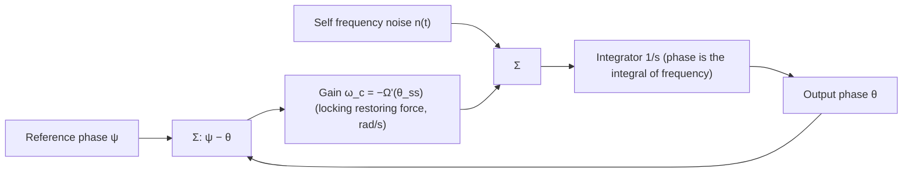

import AdlerWashboard from "@site/src/components/AdlerWashboard";
import PullingSpectrumExplorer from "@site/src/components/PullingSpectrumExplorer";

> **β**: This English translation is in beta — the Traditional-Chinese original is the authoritative version.

# Noise shaping under injection locking and the injection-pulling spectrum

> **Prerequisites**: [paper_003](/05_paper_deep_dives/paper_003_injection_locking_part1) ([P3] generalized Adler,
> lock characteristic), [white_noise_to_phase_noise](/03_isf_core_theory/white_noise_to_phase_noise) (the
> machine that turns white noise into $1/f^2$), [lorentzian_linewidth](/03_isf_core_theory/lorentzian_linewidth)
> (what a free-running oscillator is doing near the carrier) | **Next**:
> [quadrature_and_coupled_oscillators](/06_design_insights/quadrature_and_coupled_oscillators) (mutual injection
> = two coupled Adler equations), [pll_noise_budget](/06_design_insights/pll_noise_budget) (how a second-order
> loop keeps the books).

[paper_003](/05_paper_deep_dives/paper_003_injection_locking_part1) covered "**whether it locks at all**"
(lock range, stability). This page covers the other two dividends left in that [P3] equation:

> **What this page answers**:
> 1. Once locked, **where does the oscillator's own phase noise go**? How much is it suppressed, and up
>    to what frequency? (Part A)
> 2. Why does "still locked" not mean "still clean" — what is this **vanishing suppression at the lock
>    edge**? (Part A)
> 3. When it does **not** lock ($\lvert\Delta\omega\rvert \gt \omega_L$), what does the spectrum look
>    like? Why a comb of **spacing $\omega_b$, growing on only one side**? Where does
>    $\omega_b=\sqrt{\Delta\omega^2-\omega_L^2}$ come from? (Part B)

> **Physical intuition (conclusion first)**: an injection-locked oscillator is a **first-order PLL** —
> the injection supplies a restoring force that pulls the phase back to the lock point, and the strength
> of that restoring force (units rad/s) *is* the loop bandwidth. So: **self**-noise below the frequency
> the restoring force can track gets flattened (high-pass shaping), **reference** noise below that same
> frequency is copied through wholesale (low-pass); the restoring force $\omega_c=\omega_L\cos\theta_{ss}$
> is strongest dead center in the lock range and vanishes at the edges. When it fails to lock, the
> restoring force loses to the detuning, and the phase slides around in a "dwell-then-slip" sawtooth,
> spitting out one sideband per revolution — that's the pulling comb spectrum.

> **Where this page sits**: an advanced design page. The phase equation itself
> ([P3] Eq.(26)/(28)–(30)/(33)–(35)/(38)–(40)) and the beat frequency ([P4] Eq.(31)–(34)) have both been
> verified against the original PDFs; **putting noise into the Adler equation and reading off the shaped
> PSD** is textbook-standard but **is not in the derivations of the five source PDFs on this site**
> ([P4] p.2130 explicitly points its noise analysis to its own reference [29, Ch. 7], i.e. Hong's PhD
> thesis; the classic source is Kurokawa 1973, see the external-literature list at the end); this page
> derives it from scratch and cross-checks with simulation.

---

## Part A — Noise shaping of a locked oscillator (a first-order PLL)

### Step 0: degenerating from [P3]'s generalized Adler to the classical Adler (mapping the notation cleanly)

Start from this site's already-verified **time-averaged generalized Adler equation** ([P3] Eq.(30),
p.2113, plus sign in front of the averaged term):

$$
\frac{d\theta}{dt}=(\omega_0-\omega_{inj})+\underbrace{\frac{1}{T_{inj}}\int_{T_{inj}}\tilde\Gamma(\omega_{inj}t+\theta)\,i_{inj}(t)\,dt}_{\equiv\ \Omega(\theta)\ \text{(lock characteristic, [P3] Eq.(33), p.2114)}}
$$

Units of each quantity: $\theta$ [rad] (oscillator phase relative to the injection phase),
$\omega_0,\omega_{inj}$ [rad/s], $\tilde\Gamma=\Gamma/q_{max}$ [rad/C] (the dimensioned ISF, [P3]
Eq.(26), p.2113), $i_{inj}$ [A]. Integrand $\tilde\Gamma\cdot i_{inj}$: rad/C × C/s = rad/s ✓;
$\Omega(\theta)$ is "the average frequency offset induced by the injection."

**Substitute a sinusoidal injection + ideal-LC ISF.** Take $i_{inj}(t)=I_{inj}\cos(\omega_{inj}t)$,
$\tilde\Gamma(x)=-\sin(x)/q_{max}$ (the exact ISF of an ideal LC, see
[isf_definition](/03_isf_core_theory/isf_definition)). Work through the average step by step:

$$
\begin{aligned}
\Omega(\theta)&=\frac{1}{T_{inj}}\int_{T_{inj}}\Big[-\frac{\sin(\omega_{inj}t+\theta)}{q_{max}}\Big]\,I_{inj}\cos(\omega_{inj}t)\,dt\\[4pt]
&=-\frac{I_{inj}}{q_{max}}\cdot\frac{1}{T_{inj}}\int_{T_{inj}}\big[\sin(\omega_{inj}t)\cos\theta+\cos(\omega_{inj}t)\sin\theta\big]\cos(\omega_{inj}t)\,dt\\[4pt]
&=-\frac{I_{inj}}{q_{max}}\Big[\cos\theta\cdot\underbrace{\langle\sin\cos\rangle}_{=0}+\sin\theta\cdot\underbrace{\langle\cos^2\rangle}_{=1/2}\Big]
=-\frac{I_{inj}}{2q_{max}}\sin\theta .
\end{aligned}
$$

Define $\Delta\omega\equiv\omega_0-\omega_{inj}$ (detuning) and
$\omega_L\equiv\dfrac{I_{inj}}{2q_{max}}$ (half the lock range), giving the **classical Adler form**:

$$
\boxed{\ \frac{d\theta}{dt}=\Delta\omega-\omega_L\sin\theta\ }
$$

**Notation/convention mapping (bookkeeping the factor and sign)**:

| This page | [P3] | Note |
|---|---|---|
| $\Omega(\theta)=-\omega_L\sin\theta$ | Eq.(34): $\Omega=\tfrac12 I_{inj}\lvert\tilde\Gamma_1\rvert\cos(\theta+\angle\tilde\Gamma_1)$ | $-\sin x=\cos(x+90^\circ)$, so $\angle\tilde\Gamma_1=+90^\circ$, $\lvert\tilde\Gamma_1\rvert=1/q_{max}$ ✓ |
| $\omega_L=I_{inj}/(2q_{max})$ | Eq.(35): $\omega_L=\tfrac12 I_{inj}\lvert\tilde\Gamma_1\rvert$ | Fully consistent; **the minus sign comes from the ideal-LC ISF's own $-\sin$**, not a convention flip |
| $\Delta\omega=\omega_0-\omega_{inj}$ | Eq.(38) uses $\Delta\omega_{[P3]}=\omega_{inj}-\omega_0$ | Off by an overall sign; [P4] Eq.(34) also uses $\omega_{inj}/N-\omega_0$. All results on this page depend only on $\Delta\omega^2$ or state the branch explicitly, so this is harmless |

**Units/magnitude check**: $\omega_L=I_{inj}/(2q_{max})$: A/C = 1/s (rad/s) ✓. With this site's
canonical numbers $f_0=5$ GHz, $q_{max}=1$ pC, to get $f_L=\omega_L/2\pi=5$ MHz we need
$I_{inj}=2q_{max}\omega_L=2\times10^{-12}\times(2\pi\times5\times10^6)=62.8\ \mu$A.
Checking the validity of weak-injection linearization ([P3] Eq.(36)–(37), p.2115):
$I_{max}=\omega_0 q_{max}=2\pi\times5\times10^9\times10^{-12}=31.4$ mA,
$I_{inj}/I_{max}=0.002\ll1$ ✓ — comfortably inside [P3]'s linear regime.

### Step 1: lock point and the stable branch

Steady state $d\theta/dt=0$ requires $\sin\theta_{ss}=\Delta\omega/\omega_L$, which exists provided
$\lvert\Delta\omega\rvert\le\omega_L$ (this is the lock range). There are two solutions:

$$
\theta_{ss}=\arcsin\!\Big(\frac{\Delta\omega}{\omega_L}\Big)\quad\text{or}\quad\pi-\arcsin\!\Big(\frac{\Delta\omega}{\omega_L}\Big).
$$

Which one is stable? Following [P3]'s stability criterion (Eq.(38)–(39), p.2115): substitute
$\theta=\theta_0+\hat\theta$, expand to first order in Taylor series, giving
$d\hat\theta/dt=\Omega'(\theta_0)\hat\theta$; stable ⟺ $\Omega'(\theta_0)\lt0$. Here
$\Omega'(\theta)=-\omega_L\cos\theta$, so **the stable branch is $\cos\theta_{ss}\gt0$**, i.e. the
principal value $\theta_{ss}=\arcsin(\Delta\omega/\omega_L)\in(-\pi/2,\pi/2)$; the other solution is
unstable.

**Mechanical analogy: the tilted washboard.** The classical Adler equation
$d\theta/dt=\Delta\omega-\omega_L\sin\theta$ is exactly the equation of motion of a ball rolling
under **overdamped** dynamics (inertia negligible, velocity proportional to force) in the potential
$U(\theta)=-\Delta\omega\cdot\theta-\omega_L\cos\theta$ — overdamped particles obey
$d\theta/dt=-dU/d\theta$, and substituting confirms $-dU/d\theta=\Delta\omega-\omega_L\sin\theta$ ✓.
$U(\theta)$ is a "cosine corrugation" riding on a linear ramp: the ramp's slope is set by
$\Delta\omega$, the corrugation depth by $\omega_L$ — hence "tilted washboard." When
$r\equiv\Delta\omega/\omega_L\lt1$ the ramp is not steep enough to wash out the corrugation, so local
dips (wells) remain and the ball falls into one and stops — this is exactly the geometric meaning of
$\theta_{ss}$ above. When $r\gt1$ the ramp overwhelms the corrugation, the wells vanish entirely, and
the ball never stops rolling — corresponding to the pulling case in Part B below. The animation below
turns this intuition into something you can drive interactively and watch cycle slips happen live:

<AdlerWashboard />

### Step 2: putting noise in and linearizing

The oscillator's own device noise current $i_n(t)$ runs through **the same ISF machine** ([P1] Eq.(11);
[P3] Eq.(28)'s $\tilde\Gamma\cdot i$ holds equally for a noise current). For white noise, after ISF-weighted
averaging over one period it becomes equivalent to a **white frequency-noise (white FM) drive** $n(t)$
added to the right-hand side of the Adler equation:

$$
\frac{d\theta}{dt}=\Delta\omega-\omega_L\sin\theta+n(t),
$$

where $n(t)$ [rad/s] has **one-sided** PSD denoted $S_n$, units rad²/s (= (rad/s)²/Hz). This is exactly
the drive that grows the $1/f^2$ skirt of a **free-running** oscillator: remove the injection
($\omega_L=0$), so $\phi=\int n\,dt$, and the transfer-function bookkeeping (one-sided in, one-sided out)
gives

$$
S_{\phi,free}(\omega)=\frac{S_n}{\omega^2},\qquad
S_n=\frac{\Gamma_{rms}^2}{q_{max}^2}\,\frac{\overline{i_n^2}}{\Delta f}
$$

(the same result as the time-domain derivation in
[white_noise_to_phase_noise](/03_isf_core_theory/white_noise_to_phase_noise),
$S_\phi=\Gamma_{rms}^2 S_i/(q_{max}^2\omega^2)$ — the time-domain-$/2$-convention branch of it).
Canonical numbers (true LC: $\Gamma_{rms}=1/\sqrt2$, $S_i=10^{-24}$ A²/Hz, $q_{max}=1$ pC):
$S_n=0.5\times10^{-24}/10^{-24}=0.5$ rad²/s — this is exactly the value used by lab_26 (with the
representative value $\Gamma_{rms}=0.5$ it would be $S_n=0.25$ rad²/s).
Unit check: $\dfrac{(-)^2}{\text{C}^2}\cdot\dfrac{\text{A}^2}{\text{Hz}}=\dfrac{\text{A}^2\text{s}}{\text{C}^2}=\dfrac{1}{\text{s}}$
(i.e. rad²/s) ✓.

**Linearization.** When solidly locked, $\theta$ only dithers a little around $\theta_{ss}$. Let
$\theta=\theta_{ss}+\delta\theta$, $\sin(\theta_{ss}+\delta\theta)\approx\sin\theta_{ss}+\cos\theta_{ss}\cdot\delta\theta$,
and $\Delta\omega-\omega_L\sin\theta_{ss}=0$ cancels the constant term:

$$
\boxed{\ \frac{d(\delta\theta)}{dt}=-\omega_c\,\delta\theta+n(t),\qquad
\omega_c\equiv\omega_L\cos\theta_{ss}=\sqrt{\omega_L^2-\Delta\omega^2}\ }
$$

(the second equality uses $\cos\theta_{ss}=\sqrt{1-(\Delta\omega/\omega_L)^2}$, taking the positive root
on the stable branch.)

This $\omega_c$ **is not a new object**: it is exactly the **pull-in frequency**
$\omega_p:=-\Omega'(\theta_0)$ defined at [P3] Eq.(40), p.2115 (substitute $\Omega'=-\omega_L\cos\theta$
to get it), and it is also $\omega_p=N\sqrt{\omega_L^2-\Delta\omega^2}$ at [P4] Eq.(32), p.2130, with
$N=1$. **[P3] uses it to describe "how fast a perturbation decays"** ($\hat\theta\propto e^{-t/\tau_p}$,
$\tau_p=1/\omega_p$); **what we're saying now is: the same frequency is the corner of the noise
shaping.** And this correspondence is general: for any injection waveform, any topology, the noise-shaping
corner $=-\Omega'(\theta_{ss})$ — the slope of the lock characteristic at the lock point.

### Step 3: the shaped PSD (a first-order Lorentzian)

Fourier-transforming the linearized equation ($\delta\theta\to\Theta(\omega)$, $n\to N(\omega)$):

$$
j\omega\,\Theta=-\omega_c\,\Theta+N
\quad\Longrightarrow\quad
\Theta(\omega)=\frac{N(\omega)}{\omega_c+j\omega}
\quad\Longrightarrow\quad
\boxed{\ S_\theta(\omega)=\frac{S_n}{\omega_c^2+\omega^2}\ }
$$

This is the Lorentzian PSD of an Ornstein–Uhlenbeck process. **Dimension check**:
$\dfrac{\text{rad}^2/\text{s}}{1/\text{s}^2}=\text{rad}^2\cdot\text{s}=\text{rad}^2/\text{Hz}$ ✓.

> **Factor-of-2 discipline**: $S_\theta=S_n/(\omega_c^2+\omega^2)$ is transfer-function bookkeeping
> "same side in, same side out" — $S_n$ one-sided in gives $S_\theta$ one-sided out (this page and its
> simulations are one-sided throughout); switch to two-sided and both sides just pick up a factor of
> $1/2$, the formula shape is unchanged. And the **suppression ratio**
> $S_\theta/S_{\phi,free}=\omega^2/(\omega_c^2+\omega^2)$ cancels $S_n$ entirely — **it is independent
> of any one-sided/two-sided or $/2$/$/4$ convention** — the simulation measures the corner from this
> ratio, which is the cleanest way.

Three limits, three sentences:

- **$\omega\gg\omega_c$**: $S_\theta\to S_n/\omega^2=S_{\phi,free}$ — **far from the carrier, it is
  identical to free-running**. The restoring force from the injection (bandwidth $\omega_c$) can't
  track fast jitter — it has no effect there.
- **$\omega\ll\omega_c$**: $S_\theta\to S_n/\omega_c^2$ = a **finite plateau**. The free-running
  $1/f^2$ divergence as $\omega\to0$ has been "cured" by locking: the phase no longer random-walks —
  it's pinned to $\theta_{ss}$ with finite dither. (Compare with
  [lorentzian_linewidth](/03_isf_core_theory/lorentzian_linewidth): the free-running case turns the
  divergence into a finite Lorentzian peak via "linewidth," but the variance still grows without bound
  over time; locking genuinely pins the variance to a constant — two different "cures.")
- **Crossover $\omega=\omega_c$**: the suppression ratio is exactly $1/2$ ($-3$ dB) — the **operational
  definition of the corner**, and the simulation measures it this way.

Total phase variance (one-sided integral):

$$
\sigma_\theta^2=\int_0^\infty \frac{S_n}{\omega_c^2+(2\pi f)^2}\,df
=\frac{S_n}{2\pi}\cdot\frac{\pi}{2\omega_c}=\frac{S_n}{4\omega_c}.
$$

Numerically (lab_26 case A: $S_n=0.5$ rad²/s, $\omega_c=2\pi\times5\times10^6$ rad/s):
$\sigma_\theta^2=0.5/(4\times3.14\times10^7)=3.98\times10^{-9}$ rad² → $\sigma_\theta=63.1\ \mu$rad;
converting to time jitter ($f_0=5$ GHz), $\sigma_t=\sigma_\theta/(2\pi f_0)=2.0$ fs.
Dimension check: rad²/s ÷ rad/s = rad² ✓; rad ÷ (rad/s) = s ✓.
**This is the power of locking an oscillator to a clean reference: unbounded accumulated jitter becomes
a finite 2 fs dither.**

### Step 4: what about the reference's noise? (the other half of the first-order PLL)

If the injection's own phase wanders: $i_{inj}=I_{inj}\cos(\omega_{inj}t+\psi(t))$ ($\psi$ slowly
varying), redo the Step-0 average (product-to-sum, fast term averages out) to get
$\Omega=-\omega_L\sin(\theta-\psi)$, and linearize:

$$
\frac{d(\delta\theta)}{dt}=-\omega_c(\delta\theta-\psi)+n
\quad\Longrightarrow\quad
\Theta(\omega)=\underbrace{\frac{\omega_c}{\omega_c+j\omega}}_{\text{low-pass}}\Psi(\omega)+\underbrace{\frac{1}{\omega_c+j\omega}}_{\text{self FM}\to\text{shaped}}N(\omega)
$$

$$
S_{\theta,out}=\frac{\omega_c^2}{\omega_c^2+\omega^2}\,S_\psi+\frac{1}{\omega_c^2+\omega^2}\,S_n .
$$

- **Reference phase noise is low-passed** (corner is again $\omega_c$): below $\omega_c$ it's copied
  through fully (faithfully reproducing the reference), above $\omega_c$ it's rejected.
- **Self-noise is high-passed**: relative to free-running $N/(j\omega)$, the ratio is
  $j\omega/(\omega_c+j\omega)$, $\lvert\cdot\rvert^2=\omega^2/(\omega_c^2+\omega^2)$.

This is **exactly the transfer-function pair of a first-order (type-I) PLL** — the same logic as the
second-order $\lvert H_{lp}\rvert^2/\lvert H_{hp}\rvert^2$ in this site's
[lab_13](/04_simulation_labs/lab_13_pll_cdr_transfer), just with the loop degenerated to first order and
bandwidth $\omega_c$. Block diagram:



> **Honesty note**: $\omega_c$ as the pull-in frequency is a native result of [P3] Eq.(40). Hanging
> $n(t)$ and $\psi(t)$ on it and reading off the high-pass/low-pass PSD is standard injection-locking
> noise theory (**external literature, not among the five source PDFs**: Kurokawa 1973; Razavi 2004 also
> has an accessible derivation; [P4] p.2130 points its noise analysis to its own reference [29, Ch. 7]).

### Degradation at the lock edge (the real design insight)

$\omega_c=\sqrt{\omega_L^2-\Delta\omega^2}$'s dependence on $\Delta\omega$ is an **arc**: highest at
center, dropping vertically at the edges.

- $\Delta\omega=0$: $\omega_c=\omega_L$ (corner = the entire half lock range, maximum suppression
  bandwidth). This also gives [P3] Eq.(35) a second reading: **$\omega_L$ is not just "the range over
  which it locks" — it is also "the ceiling on the noise-suppression bandwidth"**
  ($\omega_c\le\omega_L$, equality at dead center).
- $\Delta\omega=0.95\,\omega_L$: $\cos\theta_{ss}=\sqrt{1-0.95^2}=0.312$, $\omega_c$ is down to 31%,
  the low-frequency plateau is raised by $1/\cos^2\theta_{ss}=10.3\times$ ($+10.1$ dB) — **still locked,
  but already dirty**.
- $\Delta\omega\to\pm\omega_L$: $\cos\theta_{ss}\to0$, $\omega_c\to0$, **suppression vanishes entirely**;
  and the linearization itself breaks down (the potential well of the restoring force shallows out,
  noise starts kicking out cycle slips, transitioning toward Part B's pulling spectrum).

In one sentence: **the edge of the lock range is not a wall, it's a ramp** — you start paying the
phase-noise price well before you actually lose lock. When PVT drifts $\omega_0$, $\Delta\omega$ quietly
walks toward the edge, and the phase-noise plateau rises as $1/\cos^2\theta_{ss}$ — this often bites
earlier than "losing lock" itself. What you want to watch in design is the **margin** in
$\Delta\omega/\omega_L$, e.g. $\lvert\Delta\omega\rvert\le0.5\,\omega_L$ keeps $\omega_c\ge0.87\,\omega_L$
(plateau penalty only $+1.2$ dB).

### lab_26: SDE simulation vs. first-order theory

Model: Euler–Maruyama integration of $d\theta/dt=\Delta\omega-\omega_L\sin\theta+n(t)$ (clean injection,
self white-noise FM), the same noise sequence fed simultaneously to a free-running case
($\omega_L=0$) as a control, one-sided PSD estimated via Welch.

| Parameter | Value | Unit | Note |
|---|---|---|---|
| $f_L=\omega_L/2\pi$ | 5.0 | MHz | half lock range ($I_{inj}=62.8\ \mu$A @ $q_{max}=1$ pC) |
| $S_n$ | 0.5 | rad²/s | one-sided white FM drive (true-LC $\Gamma_{rms}=1/\sqrt2$, $S_i=10^{-24}$ A²/Hz) |
| $\Delta\omega$ | 0 and $0.95\,\omega_L$ | rad/s | case A (center) / case B (lock edge) |
| $f_s$ | 400 | MHz | sample rate of the phase SDE (integrates only slow dynamics, not the 5 GHz carrier) |
| Length | $2^{22}$ points ≈ 10.5 ms | — | Welch, $2^{15}$ points/segment, 256 segments averaged |

Core code (full script: `simulations/lab_26_injlock_noise.py`):

```python
n  = white_noise(2**22, S_n, fs)                  # white FM drive [rad/s], one-sided PSD = S_n
th = 0.0
for k in range(n.size):                           # Euler–Maruyama
    th += (dw - wL*np.sin(th) + n[k])*dt          # [P3] Eq.(30) sinusoidal reduction + noise
    theta[k] = th
f, S_lock = estimate_psd(theta[trans:], fs)       # one-sided PSD [rad^2/Hz]
ratio = S_lock / S_free                           # suppression ratio (convention-independent)
```

Verified output numbers (`PYTHONPATH=. python3 simulations/lab_26_injlock_noise.py`):

```python
print(mean_ratio_free)                # -> 1.004 free-run PSD / (S_n/ω²), averaged 0.5-5 MHz
print(theta_mean_B)                   # -> 1.2532 rad, = asin(0.95), the theoretical lock phase
print(plateau_A_ratio)               # -> 0.969 measured plateau / (S_n/ω_c²), case A
print(plateau_B_ratio)               # -> 0.995 measured plateau / (S_n/ω_c²), case B
print(edge_penalty)                  # -> 10.53 plateau B / plateau A (theory 1/cos²θ_ss = 10.26, +10.1 dB)
print(fc_meas_A, ratio_A)            # -> 4.816 MHz, 0.963 corner A (theory 5.000 MHz)
print(fc_meas_B, ratio_B)            # -> 1.543 MHz, 0.988 corner B (theory 1.561 MHz)
print(suppression_100kHz)            # -> -34.0 dB (theory -34.2 dB)
```

The measured corner runs about 3-4% below theory, from Euler discretization
($\omega_c\,dt\approx0.08$) and Welch-bin averaging — an expected numerical bias; the plateau,
suppression amount, and lock phase all match.


**How to read this figure**: (a) the gray line is free-running $1/f^2$; blue/orange are the locked
$S_\theta$ — the three curves overlap at high frequency (the injection has no reach there), and are
flattened into the $S_n/\omega_c^2$ plateau at low frequency; the dashed line is first-order theory,
matching throughout. (b) dividing the two locked PSDs by the free-running one gives a clean first-order
high-pass $\omega^2/(\omega_c^2+\omega^2)$; the $-3$ dB crossing is the corner — case B
($\Delta\omega=0.95\,\omega_L$)'s corner shrinks from 5 MHz to 1.56 MHz and the plateau rises 10 dB:
**the degradation at the lock edge is visible to the eye**.

---

## Part B — When it doesn't lock: the injection-pulling spectrum

### Step 1: no steady state, only "dwell-then-slip"

When $\lvert\Delta\omega\rvert\gt\omega_L$ (discuss $\Delta\omega\gt\omega_L\gt0$),

$$
\frac{d\theta}{dt}=\Delta\omega-\omega_L\sin\theta\ \ge\ \Delta\omega-\omega_L\ \gt\ 0
$$

is positive everywhere: $\theta$ **rises monotonically, never stopping** — locking fails, but the rise
is **highly non-uniform**:

- Slowest near $\theta=\pi/2$ ($\sin\theta=1$): $d\theta/dt=\Delta\omega-\omega_L$. The oscillator
  "almost locks" and **dwells** at the phase closest to lock (quasi-lock) — the description at [P3]
  Sec. V-G, p.2115–2116: *spends a considerable amount of time "trying" to lock*.
- Fastest near $\theta=-\pi/2$: $d\theta/dt=\Delta\omega+\omega_L$ — **rapid slip**, sweeping through
  a full revolution in one burst.

So $\theta(t)$ is a **sawtooth staircase** of "plateau + steep ramp" (see the simulation plot (a)
below), net-sliding $2\pi$ per "beat."

### Step 2: the beat frequency $\omega_b$ — derived step by step

The period of one beat is the time for $\theta$ to traverse $2\pi$. Separate variables:

$$
T_b=\int_0^{T_b}dt=\int_{-\pi}^{\pi}\frac{d\theta}{\Delta\omega-\omega_L\sin\theta}.
$$

Use the Weierstrass half-angle substitution $u=\tan(\theta/2)$ ($\theta:-\pi\to\pi$ corresponds to
$u:-\infty\to\infty$), $\sin\theta=\dfrac{2u}{1+u^2}$, $d\theta=\dfrac{2\,du}{1+u^2}$:

$$
\begin{aligned}
T_b&=\int_{-\infty}^{\infty}\frac{1}{\Delta\omega-\omega_L\frac{2u}{1+u^2}}\cdot\frac{2\,du}{1+u^2}
=\int_{-\infty}^{\infty}\frac{2\,du}{\Delta\omega(1+u^2)-2\omega_L u}\\[4pt]
&=\int_{-\infty}^{\infty}\frac{2\,du}{\Delta\omega\,u^2-2\omega_L u+\Delta\omega}
\qquad\text{(complete the square in the denominator)}\\[4pt]
&=\int_{-\infty}^{\infty}\frac{2\,du}{\Delta\omega\Big(u-\frac{\omega_L}{\Delta\omega}\Big)^2+\frac{\Delta\omega^2-\omega_L^2}{\Delta\omega}}
=\frac{2}{\sqrt{\Delta\omega^2-\omega_L^2}}\Big[\arctan\Big(\frac{\Delta\omega\,u-\omega_L}{\sqrt{\Delta\omega^2-\omega_L^2}}\Big)\Big]_{-\infty}^{\infty}\\[4pt]
&=\frac{2}{\sqrt{\Delta\omega^2-\omega_L^2}}\cdot\pi .
\end{aligned}
$$

(The second-to-last step uses
$\int\frac{du}{a(u-u_0)^2+c}=\frac{1}{\sqrt{ac}}\arctan\big(\sqrt{a/c}\,(u-u_0)\big)$, with
$a=\Delta\omega\gt0$, $c=(\Delta\omega^2-\omega_L^2)/\Delta\omega\gt0$, and $\arctan$ spans $\pi$ over
the full range.)

$$
\boxed{\ \omega_b\equiv\frac{2\pi}{T_b}=\sqrt{\Delta\omega^2-\omega_L^2}\ }
\qquad\text{([P4] Eq.(34), p.2130, taking }N=1\text{)}
$$

The same substitution also gives the closed-form solution in the unlocked regime (equivalent to the
ideal-LC special case of [P4] Eq.(33), p.2130):

$$
\tan\frac{\theta(t)}{2}=\frac{\omega_L}{\Delta\omega}+\frac{\omega_b}{\Delta\omega}\tan\frac{\omega_b (t-t_0)}{2}.
$$

**Units**: rad/s ✓ ($\Delta\omega,\omega_L$ share units, take the square root of the squared
difference). **Two limits**:

- $\Delta\omega\gg\omega_L$: $\omega_b\to\Delta\omega$ — the sideband spacing approaches the detuning
  itself, the injection degenerates into a single small spur, the oscillator is essentially free-running
  ✓ (self-consistency check).
- $\Delta\omega\to\omega_L^+$: $\omega_b\to0$ — **critical slowing down**: the dwell segment stretches
  without bound, the beat frequency vanishes, all comb teeth collapse toward the injection frequency —
  this is the instant of "locking." Note it and Part A's $\omega_c=\sqrt{\omega_L^2-\Delta\omega^2}$ are
  two sides of the same square root: **inside lock it's called the pull-in frequency, outside lock it's
  called the beat frequency** ([P4] Eq.(32) vs Eq.(34) — a Pythagorean pair).

**Numerically (lab_27 uses a 3-4-5 right triangle, verifiable by mental arithmetic)**:
$\Delta f=100$ kHz, $f_L=60$ kHz → $f_b=\sqrt{100^2-60^2}=80$ kHz.

### Step 3: spectral structure — comb spacing $\omega_b$, one edge pinned to the injection

$\theta$ nets $2\pi$ every $T_b$, so $\theta(t)=\omega_b t+p(t)$, with $p$ periodic of period $T_b$. The
output voltage

$$
V(t)=\cos\big(\omega_{inj}t+\theta(t)\big)
$$

has an analytic signal containing $e^{j\theta}=e^{j\omega_b t}e^{jp(t)}$, and the Fourier series of
$e^{jp(t)}$ has only components at $k\omega_b$ — so the **spectrum is a comb of spacing $\omega_b$**,
with lines at

$$
\omega=\omega_{inj}+k\,\omega_b,\qquad k\in\mathbb{Z},
$$

where the $k=0$ line **falls exactly at the injection frequency** ([P4] Sec. V-B, p.2130: *the tone at
one edge of the spectrum always occurs right at the injection frequency*). The oscillator's **average**
frequency is $\omega_{inj}+\omega_b$ (near the $k=1$ main line), which lies **between** $\omega_{inj}$
and $\omega_0$: it has been "pulled" away from free-running by $\Delta\omega-\omega_b$ (lab_27 numbers:
$100-80=20$ kHz) — **this is exactly where the name "pulling" comes from**. Detail worth noting ([P3]
footnote 18, p.2116): unless $\omega_{inj}$ happens to be an integer multiple of $\omega_b$, $V(t)$
itself is **not** a periodic signal — pulling fundamentally destroys the oscillator's periodicity.

The interactive widget below integrates the Adler ODE right in your browser (RK2), takes an FFT of
$V(t)=\cos(\omega_{inj}t+\theta(t))$, and lets you slide $r=\Delta\omega/\omega_L$ from locked into
pulling with your own hands, watching the spectrum morph from "a single tone" into "a one-sided comb";
the measured $\omega_b$ is compared live against the closed form $\sqrt{\Delta\omega^2-\omega_L^2}$
derived above:

<PullingSpectrumExplorer />

### Step 4: why is it "one-sided"?

**Physical argument.** The instantaneous frequency is

$$
\omega_{osc}(t)=\omega_{inj}+\frac{d\theta}{dt}\in[\,\omega_{inj}+\Delta\omega-\omega_L,\ \omega_{inj}+\Delta\omega+\omega_L\,],
$$

and the entire range sits on the **same side** of the injection ($\Delta\omega\gt\omega_L$ guarantees a
positive lower bound). And the time-weighting is extremely skewed: $\theta$ dwells longest in the
dwell segment ($\omega_{osc}\approx\omega_{inj}+\Delta\omega-\omega_L$, closest to the injection), while
the slip segment flashes by — so spectral energy piles up on "the side of the injection frequency toward
$\omega_0$," hugging the injection and decaying outward; the **other side of the injection is nearly
empty**. This contrasts sharply with symmetric FM (sinusoidal phase modulation → symmetric Bessel
sidebands): **the phase-modulating waveform of pulling is a sawtooth, not a sinusoid**.

**Rigorous argument (advanced, one paragraph).** Let $z=e^{j\theta}$; the Adler equation becomes the
Riccati equation $\dot z=j\Delta\omega\,z-\tfrac{\omega_L}{2}(z^2-1)$. The Riccati solution is a Möbius
(fractional-linear) transform of coefficients, letting us write the periodic solution as
$z=\dfrac{c+d\,w}{1+b\,w}$ ($w=e^{j\omega_b t}$, $\lvert b\rvert\lt1$); expanding the geometric series
$\dfrac{1}{1+bw}=\sum_k(-b)^k w^k$ leaves **only powers $k\ge0$** — so in this idealized Adler model the
comb is **strictly one-sided**, and the amplitudes decay **geometrically**, with ratio

$$
r=\frac{\omega_L}{\Delta\omega+\omega_b}
$$

(power drops by $r^2$ per line). This closed-form spectrum is a standard result (**external literature,
not among the five source PDFs**: Armand 1969, see the end of this page); the rest of this page verifies
it numerically with simulation. lab_27's 3-4-5 parameters: $r=60/(100+80)=1/3$, i.e.
$20\log_{10}3=9.54$ dB per line.

### lab_27: integrating the unlocked Adler ODE → FFT

Model: RK4 integration of $d\theta/dt=\Delta\omega-\omega_L\sin\theta$ (deterministic; noise turned off
to isolate the pulling comb itself), building $V(t)=\cos(\omega_{inj}t+\theta(t))$, then a Hann-windowed
FFT.

| Parameter | Value | Unit | Note |
|---|---|---|---|
| $f_{inj}$ | 1.000 | MHz | injection frequency (toy scale — the Adler equation is already the averaged slow dynamic) |
| $f_0$ | 1.100 | MHz | free-running frequency ($\Delta f=+100$ kHz) |
| $f_L$ | 60 | kHz | half lock range ($\Delta f\gt f_L$ → fails to lock) |
| $f_b$ (theory) | 80.000 | kHz | $\sqrt{100^2-60^2}$ (3-4-5) |
| $f_s$, length | 16 MHz, $2^{21}$ points | — | 131 ms ≈ 10486 beats, FFT resolution 7.6 Hz |

Core code (full script: `simulations/lab_27_pulling_spectrum.py`):

```python
def rhs(th):                                   # unlocked Adler ([P3] Eq.(30) sinusoidal reduction)
    return DW - OMEGA_L*np.sin(th)             # [rad/s]
# ... RK4 integration to get theta[k] ...
V    = np.cos(OMEGA_INJ*t + theta)             # the pulled output voltage
spec = np.abs(np.fft.rfft(V*np.hanning(V.size)))**2
```

Verified output numbers (`PYTHONPATH=. python3 simulations/lab_27_pulling_spectrum.py`):

```python
print(f_b_from_slope)                 # -> 79.999 kHz from ⟨dθ/dt⟩, theory 80.000 -> ratio 1.0000
print(f_b_from_fft)                   # -> 80.000 kHz from spectral comb spacing -> ratio 1.0000
print(step_k1_k2, step_k2_k3)         # -> -9.54 dB, -9.54 dB adjacent comb-line power step (theory 20log10(3)=-9.54)
print(mirror_side)                    # -> -194.1 dB f_inj-f_b vs f_inj+f_b: mirror side = numerical zero (strictly one-sided)
print(edge_tone)                      # -> -8.52 dB the edge line at the injection frequency relative to the k=+1 main line
print(pulled_by)                      # -> 20.0 kHz average frequency 1.080 MHz, pulled away from f_0=1.100 MHz
```

Main spectral lines (relative to the strongest line): 1.080 MHz (0 dB, $k{=}1$), 1.000 MHz
($-8.2$ dB, $k{=}0$ = injection), 1.160 ($-10.5$), 1.240 ($-19.2$), 1.320 ($-28.3$), 1.400 MHz
($-38.1$ dB) — from $k\ge2$ onward each line drops exactly 9.54 dB, matching the geometric ratio
$r^2=(1/3)^2$ to the digit.


**How to read this figure**: (a) $\theta/2\pi$ climbs one step per beat, the flat segments are the
quasi-lock dwell; (b) the instantaneous frequency spends most of its time pinned near 1.04 MHz
($f_{inj}+\Delta f-f_L$, the "dwell frequency" closest to injection), with brief excursions to
1.16 MHz; (c) spectrum: the red dashed line = injection at 1.000 MHz (the comb's **edge**), the gray
dashed line = free-running at 1.100 MHz (**no line there anymore** — it's been pulled away), green
▽ = theoretical positions $f_{inj}+k\,f_b$; the injection's left side is completely clean — the
**one-sided comb** is the clearest fingerprint of pulling.

---

## Injection waveform design: the ceiling on the lock range ([P3] Sec. VI, Cauchy–Schwarz)

One of Part A's conclusions is that $\omega_L$ is not just "the range within which you can lock" —
it is also the ceiling on the noise-suppression bandwidth ($\omega_c\le\omega_L$). So "for the same
injection power, how far can $\omega_L$ be pushed" is a real-money design question. [P3] Sec. VI
(pp. 2119–2120) gives an answer clean enough to memorize; this section re-derives it step by step,
following the paper, and verifies it numerically on three ISFs.

> **Physical intuition (conclusion first)**: the ISF is the dashboard showing "how persuadable the
> oscillator is right now." A fixed current budget should be **spent entirely at the phases where
> $\lvert\tilde\Gamma\rvert$ is large** (where the node voltage transitions are steepest and the phase
> is easiest to push), and not a cent at the phases where $\tilde\Gamma\approx0$. A sinusoidal
> injection cannot do this — it is forced to spread its money uniformly across the whole period. The
> optimum is to "shape the injection waveform like the ISF itself" ([P3] Fig. 18, p.2118's concept
> cartoon).

### Step 0: define "how big" the injection is — why rms?

To compare waveforms of different **shapes**, you first need a common measuring stick for "equally
big." A multi-harmonic waveform has no unique "amplitude," so [P3] uses the **rms injection
current** ([P3] Eq.(43), p.2119, verbatim):

$$
I_{rms}\equiv\sqrt{\langle i_{inj}^2\rangle}:=\sqrt{\frac{1}{T_{inj}}\int_{T_{inj}}i_{inj}(t)^2\,dt}\ .
$$

Units: $\sqrt{\text{A}^2}=\text{A}$ ✓. Why is rms the right proxy for "power"? [P3] p.2119 +
Fig. 17: a practical injection circuit is usually a differential pair commutating a static tail
current $I_{bias}$; the instantaneous $\lvert i_{inj}\rvert$ is capped by the tail current, so
$I_{rms}\le I_{bias}$, and the injection circuit's average power consumption is at least
$I_{rms}V_{DD}$ — **fixing $I_{rms}$ ≈ fixing the floor of the injection circuit's power**, and it
is well-defined for any waveform.

### The three-step derivation: inner product → Cauchy–Schwarz → equality condition

**Step 1: the lock range is the extremum of an inner product.** The starting point is again the
verified lock characteristic ([P3] Eq.(33), p.2114):

$$
\Omega(\theta)=\frac{1}{T_{inj}}\int_{T_{inj}}\tilde\Gamma(\omega_{inj}t+\theta)\,i_{inj}(t)\,dt .
$$

At fixed $\theta$ this is precisely the **time-averaged inner product** of two periodic signals,
$\langle u,v\rangle=\frac{1}{T}\int_T uv\,dt$, with $u_\theta(t)=\tilde\Gamma(\omega_{inj}t+\theta)$
[rad/C] and $v(t)=i_{inj}(t)$ [A]. The lock condition (the generalization of Part A's Step 1; the
steady state of [P3] Eq.(38)) is that $\Delta\omega$ falls within the range of $\Omega$: **the
upper/lower lock edges are $\max_\theta\Omega$ and $\min_\theta\Omega$**. So "make the lock range
big" = "make the extrema of this inner product big" — the circuit problem has become a functional
inequality.

**Step 2: the Cauchy–Schwarz bound.** For every $\theta$ and every waveform (the integral form of
Cauchy–Schwarz: $\lvert\langle u,v\rangle\rvert\le\lVert u\rVert\,\lVert v\rVert$):

$$
\lvert\Omega(\theta)\rvert\;\le\;\underbrace{\sqrt{\tfrac{1}{T_{inj}}\!\int_{T_{inj}}\!\tilde\Gamma^2(\omega_{inj}t+\theta)\,dt}}_{=\ \tilde\Gamma_{rms}\ \text{(independent of }\theta\text{)}}\cdot\underbrace{\sqrt{\tfrac{1}{T_{inj}}\!\int_{T_{inj}}\!i_{inj}^2(t)\,dt}}_{=\ I_{rms}\ \text{(Eq.(43))}}
$$

The first factor is independent of $\theta$: one injection period sweeps the entire $2\pi$ of
$\tilde\Gamma$ exactly once, and a mean square does not care at which phase the sweep starts.
Units: $\text{rad/C}\times\text{A}=\text{rad/s}$ ✓. Therefore, **no matter what shape you give the
waveform**, the lock range can never exceed ([P3] Eq.(45), p.2120, verbatim)

$$
\omega_L^*=I_{rms}\tilde\Gamma_{rms}\ .
$$

**Step 3: the equality condition — the waveform = the shape of the ISF.** Cauchy–Schwarz holds with
equality ⟺ the two "vectors" are parallel: $i_{inj}(t)=\lambda\,\tilde\Gamma(\omega_{inj}t+\text{const})$.
Normalizing the size of $\lambda$ to the given $I_{rms}$ via Eq.(43) gives the optimal injection
waveform ([P3] Eq.(44), p.2119, verbatim; $x=\omega_{inj}t$ is the linear injection phase):

$$
i_{inj,0}^{*}(x)=\pm\frac{I_{rms}}{\tilde\Gamma_{rms}}\,\tilde\Gamma(x)\ .
$$

Three key points:

- With the **+** sign, $\Omega(\theta)$ becomes the ISF's autocorrelation
  $\times\,I_{rms}/\tilde\Gamma_{rms}$, reaching $+I_{rms}\tilde\Gamma_{rms}$ at the aligned point —
  **optimizing the upper lock edge**; the **−** sign likewise optimizes the lower edge ([P3] p.2120
  states it explicitly: the positive solution for the upper edge, the negative for the lower).
  **One waveform cannot push both edges to the ceiling simultaneously** — see the numbers in
  Check 2 below.
- **No manual alignment needed**: $\theta$ is the oscillator's own degree of freedom; the locking
  mechanism adjusts it onto the stable branch satisfying $\Delta\omega=\Omega(\theta)$. Waveform
  design only needs the shape right — the phase is found by the physics itself.
- **Factor bookkeeping**: Eq.(45) contains **no** 2 and no 4 — both sides are rms quantities. The
  $\tfrac12$ in the classical sinusoidal result $\omega_L=\tfrac12 I_{inj}\lvert\tilde\Gamma_1\rvert$
  ([P3] Eq.(35)) is the projection integral $\langle\cos^2\rangle=\tfrac12$, with $I_{inj}$ a
  **peak** value; rewritten in rms ($I_{rms}=I_{inj}/\sqrt2$) it reads
  $\omega_{L,sine}=I_{rms}\lvert\tilde\Gamma_1\rvert/\sqrt2$. All of these $\sqrt2$'s and $2$'s are
  peak↔rms conversions and projection constants — nothing to do with the SSB $/2$, $/4$
  bookkeeping conventions.

### Check 1: pure-sine ISF — a sinusoidal injection is "already" optimal (the ratio must be 1)

The ideal LC's $\tilde\Gamma(x)=-\sin(x)/q_{max}$ is itself a single-tone sinusoid, so the waveform
"shaped like the ISF" is a sine — the theorem predicts a sinusoidal injection already sits at the
ceiling. Compute both sides (the true-LC $\Gamma_{rms}=1/\sqrt2$ branch, not the representative
value 0.5):

$$
\omega_{L,sine}=\frac{I_{rms}\lvert\tilde\Gamma_1\rvert}{\sqrt2}=\frac{I_{rms}}{\sqrt2\,q_{max}},\qquad
\omega_L^*=I_{rms}\tilde\Gamma_{rms}=\frac{I_{rms}}{\sqrt2\,q_{max}}\quad\Rightarrow\quad\text{ratio}=1 .
$$

Numbers (reusing Part A's canonical case: $q_{max}=1$ pC, peak $62.83\ \mu$A i.e.
$I_{rms}=44.43\ \mu$A): $\omega_L^*=4.443\times10^{-5}\times0.7071/10^{-12}=3.14\times10^7$ rad/s →
$f_L^*=5.000$ MHz, identical to Part A's sinusoidal lock range. Dimension check:
A × rad/C = (C/s)(rad/C) = rad/s ✓. (The simulation prints f_L sine = 5.0000 MHz,
f_L matched = 5.0000 MHz, gain = 1.0000.)

**Teaching point**: this is no coincidence — it is forced by "the ISF has only one harmonic." The
only thing a sinusoidal injection can buy is $\tilde\Gamma_1$, and a pure-sine ISF keeps all of its
rms in $\tilde\Gamma_1$. For waveform design to "make money," the ISF must hide energy where a sine
cannot reach: DC ($c_0$) or higher harmonics. The next two checks demonstrate one of each.

### Check 2: asymmetric toy ISF — matched injection profits at DC (and only on one edge)

The site toy $\Gamma(\theta)=\cos\theta+0.3$ ($\alpha=0.3$, DC value $c_0/2=0.3$):
$\Gamma_{rms}=\sqrt{\alpha^2+\tfrac12}=0.7681$, $c_1=1$. Closed-form gain:

$$
G=\frac{\omega_L^*}{\omega_{L,sine}}=\frac{I_{rms}\Gamma_{rms}/q_{max}}{I_{rms}\,c_1/(\sqrt2\,q_{max})}=\frac{\sqrt2\,\Gamma_{rms}}{c_1}=\sqrt{1+2\alpha^2}=1.0863 .
$$

(Simulation: gain = 1.0863, $f_L$ from 5.0000 → 5.4314 MHz.) The matched waveform is just the shape
of $\cos+\alpha$ — **the extra DC share of the current** couples to the ISF's $c_0$, something a
zero-mean sine can never buy. But note the one-sidedness (the $\pm$ choice): in units of
$I_{rms}/q_{max}$, the simulation prints matched(+) upper/lower edges $=+0.7681$/$-0.5338$, versus
the sine's $\pm0.7071$ — **the upper edge gains 8.6% while the lower edge loses 24%**; for the lower
edge, switch to the $-$ sign. The DC injection shifts the whole lock characteristic upward — exactly
the mechanism by which "the upper and lower lock edges can have the same sign," as the caption of
[P3] Fig. 10 notes.

### Check 3: ring-style narrow-pulse ISF — gain $\approx\sqrt{\eta N/3}$, ≈ ×2 at 17 stages

A ring's ISF energy concentrates at the transitions. As a toy, use the [P2] App.B triangular-pulse
construction ($A=1$, symmetric rise/fall): two opposite-sign triangular pulses, height $h=1/f'$,
half-width $w=1/f'$ rad, with $f'=\eta N/\pi$ (from [P2] Eq.(54), p.803 with $A=1$). Sanity check:
this construction's $\Gamma_{rms}$ lands exactly back on [P2] Eq.(55) ($A=1$): the simulation prints
0.05634 = the closed form $\sqrt{2\pi^2/3\eta^3}/N^{1.5}=$ 0.05634 ✓.

The narrow-pulse closed-form gain (three lines): a single pulse of area $hw$ gives
$c_1\approx 2hw/\pi$ (the two opposite-sign pulses sit $\pi$ apart, so their projections onto
$\sin$ add with the same sign); $\Gamma_{rms}^2=\tfrac{1}{2\pi}\cdot2\cdot\tfrac23h^2w=\tfrac{2h^2w}{3\pi}$; substituting $h=w=1/f'$, $f'=\eta N/\pi$:

$$
G=\frac{\sqrt2\,\Gamma_{rms}}{c_1}\approx\sqrt{\frac{2\cdot\frac{2h^2w}{3\pi}}{\frac{4h^2w^2}{\pi^2}}}=\sqrt{\frac{\pi}{3w}}=\sqrt{\frac{\eta N}{3}}\ .
$$

$N=17$, $\eta=0.75$: $G=\sqrt{4.25}=2.0616$ (full numerical simulation 2.0720; the 0.5% difference
is the $\mathrm{sinc}^2$ correction for the pulses' finite width). With units attached: for the same
$I_{rms}=44.43\ \mu$A and $q_{max}=1$ pC, sine 192.3 kHz → matched 398.4 kHz.

**This ×2 is not the toy congratulating itself**: [P3] Fig. 19 (p.2119) runs transistor-level
simulations of a 17-stage single-ended ring — injecting pulses shaped close to the ISF
(Fig. 19(b), not a strict ISF replica), and p.2120 states verbatim: *"the lock range is almost
doubled compared to a sinusoidal injection of the same power."* The toy's
$\sqrt{\eta N/3}\approx2.06$ agrees with the real circuit's "almost doubled" at the level of the
factor 2, not the decimals (the real ISF's details differ). **The gain is $\propto\sqrt N$**: more
stages → transitions occupy a smaller fraction of the phase → the sine wastes more — long rings are
where waveform design pays off the most.

An honest toy footnote: the site's cruder `gamma_triangular` toy is $\pi$-periodic (the rising and
falling triangles repeat perfectly symmetrically), so it has even harmonics only — the simulation
prints its $c_1=0.000000$, $c_2=0.3625$: **a fundamental-frequency sine cannot lock it at all**
(effectively only superharmonic injection would work). This is a toy artifact (a real ring's rising
and falling edges are never so symmetric that only even harmonics survive), but it demonstrates the
same lesson in the most extreme way: **a sine can only buy $c_1$; if the ISF puts no energy in
$c_1$, the money is wasted**.

### lab_33: numerical verification + figure

Model: on a 4096-point phase grid, write the periodic average of [P3] Eq.(33) as a circular
correlation; for each of the three ISFs compute the lock characteristic under a sinusoidal and a
matched injection (same $I_{rms}$); the extrema are the lock edges.

Core code (full script: `simulations/lab_39_optimal_injection.py`):

```python
def lock_characteristic(gt, i_wave):                  # [P3] Eq.(33): circular correlation
    Gf, If = np.fft.rfft(gt), np.fft.rfft(i_wave)
    return np.fft.irfft(np.conj(If) * Gf, gt.size) / gt.size   # Ω(θ) [rad/s]

i_sine = np.sqrt(2)*I_RMS*np.cos(X)                   # sine of the same I_rms
i_star = (I_RMS/gt_rms) * gt_p                        # [P3] Eq.(44), + sign
wl_sine = lock_characteristic(gt_p, i_sine).max()     # upper lock edge [rad/s]
wl_star = lock_characteristic(gt_p, i_star).max()     # should touch I_rms·Γ̃_rms
```

Verified output numbers (`PYTHONPATH=. python3 simulations/lab_39_optimal_injection.py`):

```python
print(fL_sine_LC, fL_matched_LC)      # -> 5.0000 MHz, 5.0000 MHz pure-sine ISF: sine already optimal (gain = 1.0000)
print(gain_asym)                      # -> 1.0863 cos+0.3 matched gain = analytic sqrt(1+2α²)=1.0863
print(edges_asym)                     # -> +0.7681/-0.5338 matched(+) upper/lower edges (units of I_rms/q_max; sine ±0.7071)
print(gamma_rms_ring)                 # -> 0.05634 = [P2] Eq.(55) closed form 0.05634 (construction sanity check)
print(fL_sine_ring, fL_matched_ring)  # -> 0.1923 MHz, 0.3984 MHz N=17 ring toy, same I_rms=44.43 μA
print(gain_ring)                      # -> 2.0720 closed form sqrt(ηN/3)=2.0616 (0.5% difference = sinc² correction)
print(matched_over_bound)             # -> 1.0000 the matched injection exactly touches the Cauchy–Schwarz bound (all three cases)
print(c1_site_triangular)             # -> 0.000000 the site toy gamma_triangular is π-periodic: a fundamental sine cannot lock it (artifact)
```


**How to read this figure**: (a) the two waveforms have exactly the same rms (both 44.43 μA); the
only difference is **where the money goes** — the matched injection (red) concentrates the current
into narrow pulses shaped like the ISF, while the sine (blue dashed) spends most of its current in
the dead zone where $\tilde\Gamma\approx0$; (b) the corresponding lock characteristics: the extrema
are the lock edges, and the red curve exactly touches the dotted theoretical bound
$\pm I_{rms}\tilde\Gamma_{rms}/2\pi=\pm398$ kHz, while the sine only reaches 192 kHz — the same
power, ×2.07 the lock range (and Part A's noise-suppression-bandwidth ceiling
$\omega_c\le\omega_L$ scales by ×2.07 along with it).

### Conditions for validity and failure modes (this section)

| Condition | When it holds | What happens when it fails |
|---|---|---|
| Weak-injection linearity ([P3] Eq.(36)–(37): $I_{inj}\ll I_{max}=\omega_0 q_{max}$) | Eq.(33) linear in $i_{inj}$; the Cauchy–Schwarz argument holds | Strong injection: $\Omega$ departs from the linear prediction; [P3] Fig. 19's simulations use $I_{rms}$ beyond $I_{max}=0.72$ mA and still roughly agree (the Sec. V-H observation) |
| "Size" measured by $I_{rms}$ (Eq.(43)) | Optimum = Eq.(44), ceiling = Eq.(45) | Change the constraint and the optimum changes: if the **peak** current is limited, $\lvert i_{inj}\rvert\le I_{pk}$, the optimum becomes the square-like $i=I_{pk}\,\mathrm{sign}(\tilde\Gamma)$ with ceiling $I_{pk}\langle\lvert\tilde\Gamma\rvert\rangle$ (this site's extension, not in [P3]) |
| The injector can generate the waveform | Full $G$ collected | Narrow pulses need bandwidth up to $\sim N$ harmonics: at $f_0=5$ GHz, a 17-stage pulse needs spectral content out to ~85 GHz — in practice the pulses are widened and $G$ degrades smoothly along the ISF autocorrelation (no cliff) |
| ISF known and stable | Waveform can be designed offline | The ISF must come from simulation ([P3] Sec. V-H's impulse-response method) or closed forms ([P2] App.B); when PVT drifts the ISF, $G$ is discounted, but the locked phase $\theta_{ss}$ re-aligns automatically |
| The goal is the **maximum** lock range | All of this section | Sometimes you want to **minimize** it (multiple oscillators interfering, reducing coupling) — the same framework run in reverse ([P3] p.2120 closing explicitly flags this direction) |

**Three design sentences**: (i) for LC (near-sine ISF), don't bother — a sinusoidal injection is
already at the ceiling (exactly gain 1.0000 for a pure sine; the residual gain for near-sine ISFs
is second-order small); (ii) ring/relaxation (pulse-type ISFs) benefit the most from waveform
design, with gain $\approx\sqrt{\eta N/3}$ growing as the square root of the stage count;
(iii) this gain simultaneously scales Part A's $\omega_c$ — **at the same power the
noise-suppression-bandwidth ceiling also gains ×G**, which is the number SerDes ILO deskew actually
cares about.

---

## Design knobs (rolling both parts into an actionable checklist)

1. **Push $\Delta\omega$ to the center of the lock range**: the noise-suppression bandwidth
   $\omega_c=\sqrt{\omega_L^2-\Delta\omega^2}$ is only maximal at $\Delta\omega=0$. The goal of a
   calibration/tuning loop is not just "get locked," it's "get locked in the middle."
2. **Two ways to increase $\omega_L$** ([P3] Eq.(35): $\omega_L=\tfrac12 I_{inj}\lvert\tilde\Gamma_1\rvert$):
   raise the injection current (at the cost of power and spurs), or use **waveform design** to align
   injection harmonics with ISF harmonics ([P3] Sec. VI's injection waveform design — effectively a free
   boost to $\omega_L$ and $\omega_c$; for the quantitative ceiling and the optimal waveform see the
   "Injection waveform design" section above: $\omega_L^*=I_{rms}\tilde\Gamma_{rms}$, with gain
   $\approx\sqrt{\eta N/3}$ for ring-type ISFs). Ceiling to watch: $I_{inj}\ll I_{max}=\omega_0 q_{max}$
   ([P3] Eq.(36)–(37)).
3. **Leave edge margin**: the plateau penalty is $1/\cos^2\theta_{ss}$.
   $\lvert\Delta\omega\rvert/\omega_L=0.5$ only costs $+1.2$ dB; $0.95$ costs $+10.1$ dB. Budget for
   PVT drift should be counted against $\Delta\omega/\omega_L$.
4. **Recognize the fingerprint of pulling**: a comb next to the carrier that is **one-sided**, evenly
   spaced by $\omega_b$, with one edge pinned exactly at some fixed frequency → that fixed frequency
   is the aggressor's frequency. Countermeasures, in order: add isolation (layout, guard ring,
   supply/substrate filtering); move the frequency plan (pull $\Delta\omega$ larger, so the comb
   spacing $\omega_b\to\Delta\omega$ moves further out and the amplitude $r\to0$ shrinks); or, conversely,
   **just lock onto it deliberately** (make $\omega_L$ larger than $\lvert\Delta\omega\rvert$, so the spur
   comb collapses into a clean locked carrier). **The most dangerous case is neither near nor far**: when
   $\Delta\omega$ is only slightly above $\omega_L$, $\omega_b$ is tiny, the spur sits right next to the
   carrier (in-band, can't be filtered out) and $r\to1$ (slow decay, a dense, tall comb).
5. **Connection to SerDes**: injection-locked clock distribution (forwarded-clock / multi-lane ILO
   deskew) is using $\omega_c$ as the **jitter tracking bandwidth** — reference jitter below $\omega_c$
   is copied through (a benefit for lanes with common jitter: shared source, correlated cancellation),
   while above $\omega_c$ cleanliness relies on the local oscillator itself (the same old homework of
   $q_{max}$, $\Gamma_{rms}$, [design_tradeoffs](/04_simulation_labs/lab_09_design_tradeoffs)). The
   trade-off structure is exactly isomorphic to a CDR: see
   [serdes_clocking_connection](/06_design_insights/serdes_clocking_connection),
   [lab_13](/04_simulation_labs/lab_13_pll_cdr_transfer).

## Conditions for validity and failure modes

| Condition | When it holds | What happens when it fails |
|---|---|---|
| Weak injection $I_{inj}\ll I_{max}=\omega_0q_{max}$ ([P3] Eq.(36)–(37), p.2115) | Generalized Adler / lock characteristic linear in $i_{inj}$ | Strong injection: prediction error of $\Omega(\theta)$ grows (though [P3] Sec. V-H simulations show $I_{inj}\sim I_{max}$ is still roughly usable) |
| $\theta$ slowly varying (near-constant over one period) | Time-synchronous averaging (Eq.(30)) holds | Detuning too large, or $\omega_b$ close to $\omega_{inj}$: the averaging breaks down |
| Sinusoidal injection + ideal-LC ISF | This page's closed form $-\omega_L\sin\theta$ | Arbitrary waveform/topology: fall back to the general $\Omega(\theta)$; **the corner generalizes to $\omega_c=-\Omega'(\theta_{ss})$ ([P3] Eq.(40)), and the geometric ratio of the one-sided comb no longer has a simple closed form** |
| Small noise, $\lvert\Delta\omega\rvert$ well clear of the edge | Linearization (OU) holds, $S_\theta=S_n/(\omega_c^2+\omega^2)$ | Near the edge: the potential well shallows → cycle slips → the spectrum grows pulling-like residual spurs, the OU formula fails |
| Amplitude dynamics ignored | Pure-phase model (this entire page) | Strong-injection LC: needs [P4]'s APF/AM correction ([paper_004](/05_paper_deep_dives/paper_004_injection_locking_part2)); [P4] Fig. 14(c) shows adding APF substantially improves accuracy of the pulled spectrum |
| The noise-shaping derivation itself | Standard injection-locking noise theory | **Not in the five source PDFs** (Kurokawa 1973; [P4] points to [29, Ch. 7]); this page derives it from scratch and cross-checks with simulation |

## Key takeaways

- **Injection locking = a first-order PLL**: linearizing [P3]'s generalized Adler gives
  $d(\delta\theta)/dt=-\omega_c\delta\theta+n$, loop bandwidth
  $\omega_c=\omega_L\cos\theta_{ss}=\sqrt{\omega_L^2-\Delta\omega^2}$ — **exactly the pull-in frequency
  of [P3] Eq.(40)** (general topology: $\omega_c=-\Omega'(\theta_{ss})$).
- **Self-noise is high-passed, reference noise is low-passed**, sharing the corner
  $\omega_c\le\omega_L$; under a white FM drive, $S_\theta=S_n/(\omega_c^2+\omega^2)$, low-frequency
  plateau $S_n/\omega_c^2$, finite total variance $S_n/(4\omega_c)$ (simulation: corner and plateau both
  match theory to within 0.96-1.00×).
- **Suppression vanishes at the lock edge**: as $\Delta\omega\to\omega_L$, $\cos\theta_{ss}\to0$, the
  plateau rises as $1/\cos^2\theta_{ss}$ ($+10.1$ dB at $0.95\,\omega_L$) — locked doesn't mean clean;
  margin must be budgeted.
- **When it doesn't lock**: $\theta$ slides in a sawtooth (dwell + slip), beat frequency
  $\omega_b=\sqrt{\Delta\omega^2-\omega_L^2}$ (derived step by step; [P4] Eq.(34)); the spectrum is a
  **one-sided** comb: lines at $\omega_{inj}+k\omega_b$, one edge exactly at the injection frequency
  ([P4] Sec. V-B), amplitude decaying geometrically as $r=\omega_L/(\Delta\omega+\omega_b)$ (external,
  Armand 1969; simulation matches $-9.54$ dB/line to the digit).
- **Two faces of the same square root**: inside lock, $\sqrt{\omega_L^2-\Delta\omega^2}$ = the
  noise-suppression corner; outside lock, $\sqrt{\Delta\omega^2-\omega_L^2}$ = the spur comb spacing.
  In design, you want one of them large (wide suppression) and the other either large or zero
  (spur far away, or locked out entirely).
- **The ceiling of waveform design**: at fixed $I_{rms}$ (= the proxy for injection power,
  [P3] Eq.(43)), the Cauchy–Schwarz ceiling of the lock range is
  $\omega_L^*=I_{rms}\tilde\Gamma_{rms}$ ([P3] Eq.(45)), with equality ⟺
  $i_{inj}\propto\tilde\Gamma$ (Eq.(44), the $\pm$ selecting the upper/lower edge). Pure-sine ISF:
  a sine is already optimal (gain = 1.0000); ring-type pulse ISF: $G\approx\sqrt{\eta N/3}$, ×2.07
  at $N=17$ — the same order as [P3] Fig. 19's "almost doubled."

## Further reading
- **[lab_36_lock_acquisition](/04_simulation_labs/lab_36_lock_acquisition)** (v8): lock-acquisition transients, critical slowing, and noise-induced cycle slips (SDE experiments).

- Source and verification of the generalized Adler and lock characteristic:
  [paper_003](/05_paper_deep_dives/paper_003_injection_locking_part1) ([P3] Eq.(26)/(30)/(33)/(35)/(38)–(40))
- Original source of the optimal injection waveform and the rms constraint: [P3] Sec. VI,
  Eq.(43)–(45), pp.2119–2120 (Fig. 17: rms = power proxy; Fig. 18: concept cartoon; Fig. 19: the ×2
  demonstration on a 17-stage ring); triangular-pulse ring-ISF construction: [P2] App.B
  Eq.(52)–(55), p.803
- Original source of the closed-form beat frequency and pulled spectrum (with APF correction):
  [paper_004](/05_paper_deep_dives/paper_004_injection_locking_part2) ([P4] Eq.(31)–(34), p.2130; Fig. 14)
- Mutual injection = two coupled Adler equations (QVCO's $90^\circ$ and 3 dB bookkeeping):
  [quadrature_and_coupled_oscillators](/06_design_insights/quadrature_and_coupled_oscillators)
- The same story in a second-order-loop version (reference low-pass / VCO high-pass, optimal
  bandwidth): [pll_noise_budget](/06_design_insights/pll_noise_budget), [lab_13](/04_simulation_labs/lab_13_pll_cdr_transfer)
- The "other cure" for a free-running oscillator near the carrier (Lorentzian linewidth):
  [lorentzian_linewidth](/03_isf_core_theory/lorentzian_linewidth)
- Source of the white FM drive $S_n=\Gamma_{rms}^2S_i/q_{max}^2$:
  [white_noise_to_phase_noise](/03_isf_core_theory/white_noise_to_phase_noise)

### External literature (not among the five downloaded source PDFs)

- **[E-Adler]** R. Adler, *"A Study of Locking Phenomena in Oscillators,"* Proc. IRE, vol. 34,
  no. 6, pp. 351–357, Jun. 1946. (The original paper on the classical Adler equation and the beat
  phenomenon.)
- **[E-Kurokawa]** K. Kurokawa, *"Injection Locking of Microwave Solid-State Oscillators,"*
  Proc. IEEE, vol. 61, no. 10, pp. 1386–1410, Oct. 1973. (Noise shaping of injection-locked
  oscillators — the classic source for this page's Part A high-pass/low-pass result.)
- **[E-Armand]** M. Armand, *"On the Output Spectrum of Unlocked Driven Oscillators,"*
  Proc. IEEE, vol. 57, no. 5, pp. 798–799, May 1969. (Closed-form one-sided geometric comb spectrum
  of an unlocked driven oscillator — this page's Part B $r=\omega_L/(\Delta\omega+\omega_b)$.)
- **[E-Razavi04]** B. Razavi, *"A Study of Injection Locking and Pulling in Oscillators,"*
  IEEE J. Solid-State Circuits, vol. 39, no. 9, pp. 1415–1424, Sep. 2004. (An accessible modern
  derivation and picture of the pulled spectrum; complements the ISF generalization of [P3]/[P4].)
- Also: [P4] p.2130 points the noise analysis of locked/free-running oscillators to its own
  reference **[29, Ch. 7]** (B. Hong's PhD thesis).
