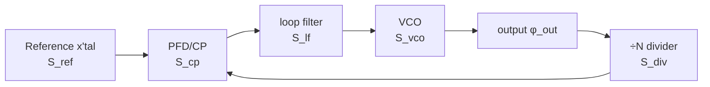

> **β**: This English translation is in beta — the Traditional-Chinese original is the authoritative version.

# Complete PLL phase-noise budget and optimal loop BW

> **Prerequisites**: [white_noise_to_phase_noise](/03_isf_core_theory/white_noise_to_phase_noise) (where the VCO term $S_{vco}\propto\Gamma_{rms}^2/q_{max}^2\cdot S_i/f^2$ comes from), [serdes_clocking_connection](/06_design_insights/serdes_clocking_connection) (the CDR/PLL's high-pass on the VCO, jitter integration bandwidth), [lc_vs_ring](/06_design_insights/lc_vs_ring) (why ring's $S_{vco}$ is high and LC's is low) | **Next**: [exercises](/06_design_insights/exercises), [lab_13_pll_cdr_transfer](/04_simulation_labs/lab_13_pll_cdr_transfer)

This page answers a question a system-design engineer faces every day: **for a phase-locked
loop (PLL — a negative-feedback loop that locks an oscillator's phase to a reference clock),
which sources contribute how much to the output phase noise, and which one dominates at which
offset band? How wide should the loop bandwidth (the highest offset the feedback can still
track) be chosen to minimize total jitter?** We write out the transfer function of each of the
five noise sources to the output, sum them as

$$
S_{out}=(S_{ref}N^2+S_{cp})\,\lvert H_{lp}\rvert^2+S_{vco}\,\lvert H_{hp}\rvert^2
$$

(canonical Section 11.2, "PLL output noise budget"), then minimize $\int S_{out}\,df$
(integrated phase variance, proportional to rms jitter squared) to find that **famous U-shaped
curve** and its minimum.

> **Physical intuition (conclusion first)**: a PLL is a low-pass tracker. Within the loop
> bandwidth $f_n$, the feedback reacts fast enough that the output **follows the reference** —
> so the noise of the reference and the loop's front end (PFD, charge-pump, divider) is
> **amplified and low-passed** onto the output (and the reference is also multiplied by $N$,
> so its power is multiplied by $N^2$); meanwhile the VCO's own close-in drift is **corrected
> away** by the feedback (VCO high-pass). Beyond $f_n$, the feedback can't keep up, and the
> output **follows the free-running VCO** — the VCO's $1/f^2$ noise leaks straight through. So
> **in-band tracks ref/CP, out-of-band tracks VCO**, with the crossover at $f_n$. Set $f_n$ too
> narrow → too much VCO leaks through (U-shape's left arm rises); too wide → too much ref/CP
> gets carried through (right arm rises). There must be an optimal $f_n$ in between.

This page's PLL closed-loop transfer function (loop transfer / open-loop gain / type-II
stability — the higher-order details) belongs to **standard PLL literature** (Gardner, Razavi,
Best), **not among the five source PDFs downloaded for this site**; we only cite its type-II
second-order closed-loop result (already recorded in canonical Section 10.2), and focus on "the
ISF determines the VCO term $S_{vco}$" and "how the budget sums up and how the optimal BW is
found." The microscopic origin of the VCO term ($\Gamma_{rms}^2/q_{max}^2$) is precisely the
output of this site's whole ISF theory built up so far.

## Why do a "noise budget"

Phase noise is not a single number — it's a curve that varies with offset, and different
sources dominate different segments of that curve. **Doing a budget = plotting each source as
one curve, and seeing where each one pokes up and what the total looks like.** The value of
doing this:

- **Find the bottleneck**: close-in too high? Usually the reference or the charge-pump
  (amplified by $N^2$). Far-out too high? It's the VCO. Treat the actual cause, don't swap
  parts blindly.
- **Choose the loop BW**: the crossover point and total jitter are both strongly tied to $f_n$;
  the budget lets you **quantify** this trade-off.
- **Connect to system metrics**: integrate $S_{out}$ to get rms jitter $\sigma_t$, and feed it
  directly into the SerDes eye/BER (see
  [serdes_clocking_connection](/06_design_insights/serdes_clocking_connection)).

## PLL block diagram and the five noise sources

The skeleton of an integer-N PLL: reference clock → phase detector (PFD, phase-frequency
detector) + charge-pump (turns the phase error into current pulses) → loop filter (integrates
the current into a control voltage) → VCO (voltage-controlled oscillator) → divider (÷N, pulls
the output back down to the reference frequency for comparison). The five noise injection
points, shown below:



Each source takes a different path to the output, so **the shaping differs**:

| Source | Symbol | Physical origin | Transfer to output | Shaping at output |
|---|---|---|---|---|
| reference | $S_{ref}$ | crystal/reference phase noise | $\times N$ then low-pass | $N^2\lvert H_{lp}\rvert^2$ (in-band, amplified by $N^2$) |
| PFD/charge-pump | $S_{cp}$ | CP current noise, PFD dead-zone, mismatch | low-pass | $\lvert H_{lp}\rvert^2$ (in-band, flat floor) |
| divider | $S_{div}$ | jitter of the ÷N logic | low-pass (same path as ref) | $\lvert H_{lp}\rvert^2$ (in-band; often folded into $S_{cp}$) |
| loop filter | $S_{lf}$ | filter resistor thermal noise modulating the VCO | band-pass (peaks near $f_n$) | $\propto\lvert H_{lp}\rvert^2$ (usually small, omitted) |
| VCO | $S_{vco}$ | tank/tail thermal noise via ISF (this site's main thread) | high-pass | $\lvert H_{hp}\rvert^2$ (dominates out-of-band) |

**Why the reference is multiplied by $N^2$.** The divider pulls the output frequency
$f_{out}=N f_{ref}$ back down to $f_{ref}$ for comparison — equivalent to requiring **output
phase = $N\times$ reference phase** (phase is also multiplied up). Phase amplified by $N$ means
power spectral density amplified by $N^2$. So a clean crystal ($S_{ref}$ very low) combined with
a large $N$ (e.g. $N=100$) has its equivalent in-band noise floor at the output raised by
$20\log_{10}N=40$ dB — this is why **an integer-N PLL's in-band noise is usually determined
jointly by the reference $\times N^2$ and the charge-pump**, not the VCO.

> **Design takeaway**: the in-band floor $\approx(S_{ref}N^2+S_{cp})$; to suppress it, either
> lower $N$ (use fractional-N or a higher-frequency reference), or lower the charge-pump's
> current noise. The VCO **contributes nothing** in-band (it's corrected away by the high-pass).

## Step 1: each source's transfer function (type-II second-order)

Using the closed-loop power transfer of canonical Section 10.2, "PLL (type-II 2nd order)."
With natural frequency $\omega_n=2\pi f_n$, damping ratio $\zeta$ (this page uses near-critical
$\zeta=0.707$), and $\omega=2\pi f$ ($f$ the offset frequency):

$$
\lvert H_{lp}\rvert^2=\frac{(2\zeta\omega_n\omega)^2+\omega_n^4}{(\omega_n^2-\omega^2)^2+(2\zeta\omega_n\omega)^2},\qquad
\lvert H_{hp}\rvert^2=\frac{\omega^4}{(\omega_n^2-\omega^2)^2+(2\zeta\omega_n\omega)^2}.
$$

- **Low-frequency limit $\omega\to0$**: $\lvert H_{lp}\rvert^2\to\omega_n^4/\omega_n^4=1$
  (reference/CP fully pass), $\lvert H_{hp}\rvert^2\to0$ (VCO suppressed). Confirms "in-band
  tracks ref/CP."
- **High-frequency limit $\omega\to\infty$**: $\lvert H_{lp}\rvert^2\to(2\zeta\omega_n\omega)^2/\omega^4\to0$,
  $\lvert H_{hp}\rvert^2\to\omega^4/\omega^4=1$ (VCO fully passes). Confirms "out-of-band tracks
  VCO."
- **Complementarity**: in the standard form $H_{hp}(s)=1-H_{lp}(s)$, so the output is the sum of
  the two paths with no double-counting.
- **Dimension check**: $\omega,\omega_n$ are both rad/s, numerator and denominator are the same
  order ($\omega^4$ or $\omega_n^4$), $\lvert H\rvert^2$ is dimensionless — confirmed.

The detailed derivation of these two transfer functions (writing the open-loop gain
$G(s)=K_dK_vF(s)/s$ from the PFD gain $K_d$, VCO gain $K_v$, and loop filter $F(s)$, then taking
the closed loop) is in
[lab_13_pll_cdr_transfer](/04_simulation_labs/lab_13_pll_cdr_transfer); that derivation chain
and type-II stability belong to standard PLL literature (not among the five source PDFs).

## Step 2: summing into the output budget

The reference and charge-pump/divider take the same low-pass path (with the reference first
multiplied by $N$), the VCO takes the high-pass path, and the three segments are uncorrelated —
their powers add (canonical Section 11.2):

$$
S_{out}(f)=\big(S_{ref}(f)\,N^2+S_{cp}(f)\big)\,\lvert H_{lp}(f)\rvert^2+S_{vco}(f)\,\lvert H_{hp}(f)\rvert^2 .
$$

- **Dimension check**: $S_{ref},S_{cp},S_{vco},S_{out}$ are all $\text{rad}^2/\text{Hz}$, $N$ and
  $\lvert H\rvert^2$ are dimensionless, so the three terms add in the same units — confirmed.
- **Where did the divider go**: $S_{div}$ takes the same low-pass path as the charge-pump and is
  shaped identically by $\lvert H_{lp}\rvert^2$ at the output, so in practice $S_{div}$ is often
  folded into $S_{cp}$ as "the loop front end's equivalent in-band floor." This page's $S_{cp}$
  is the combined total of "PFD + charge-pump + divider."
- **The loop-filter term**: $S_{lf}$'s (loop-filter resistor thermal noise modulating the VCO)
  transfer has a small peak near $f_n$, usually smaller in magnitude than ref/CP and VCO; this
  page's toy budget omits it (marked illustrative). A real design needs to include it and
  optimize resistor noise.

### The VCO term is precisely this site's ISF result

$S_{vco}$ doesn't come out of thin air — it **is exactly the output of this site's whole ISF
theory**. In the $1/f^2$ region (white-noise upconversion),

$$
S_{vco}(f)=\frac{\Gamma_{rms}^2}{q_{max}^2}\cdot\frac{\overline{i_n^2}/\Delta f}{(2\pi f)^2}\quad[\text{rad}^2/\text{Hz}]
$$

(clean time-domain version, see
[white_noise_to_phase_noise](/03_isf_core_theory/white_noise_to_phase_noise); corresponds to
[P1] Eq.(21), p.185, off by an SSB factor-of-2). So the answer to "why is the VCO term $1/f^2$
in the PLL budget, why $\propto\Gamma_{rms}^2/q_{max}^2$" is entirely in the ISF. **A ring VCO
has a large $\Gamma_{rms}$ and small $q_{max}$, so $S_{vco}$ is high** (see
[lc_vs_ring](/06_design_insights/lc_vs_ring)) — this is exactly the root reason a ring-PLL needs
to open up $f_n$ to suppress the VCO.

## Step 3: the in-band vs out-of-band handoff

Break $S_{out}$ into three segments:

1. **Deep in-band ($f\ll f_n$)**: $\lvert H_{lp}\rvert^2\approx1$, $\lvert H_{hp}\rvert^2\approx0$.
   $S_{out}\approx S_{ref}N^2+S_{cp}$ — a **flat floor** set by the reference$\times N^2$ and the
   charge-pump (if the reference contains $1/f$, this segment tilts up slightly toward
   close-in).
2. **Out-of-band ($f\gg f_n$)**: $\lvert H_{lp}\rvert^2\approx0$, $\lvert H_{hp}\rvert^2\approx1$.
   $S_{out}\approx S_{vco}\propto1/f^2$ — the **VCO's $-20$ dB/decade skirt** leaks straight
   through.
3. **Crossover ($f\approx f_n$)**: the two segments meet. At $\zeta=0.707$, at $f_n$
   $\lvert H_{lp}\rvert^2\approx1.5$ ($+1.76$ dB), $\lvert H_{hp}\rvert^2\approx0.5$
   ($-3$ dB), and their sum $\approx2$ ($+3$ dB) — this is the slight **peaking**, also the
   origin of the common "bump near the loop BW" seen in PLL output (the two curves are actually
   equal at $f\approx1.55\,f_n$, each about $0.85$, $-0.7$ dB, not at $f_n$). Too small a
   $\zeta$ (underdamped) makes the peaking sharp.

> **Reading a PN plot at a glance**: see a flat close-in floor → measure in-band, back out
> $S_{ref}N^2+S_{cp}$; see the floor start falling at $-20$ dB/dec from some offset → that
> knee is $f_n$, beyond it is VCO. A sharp peak in the middle → insufficient damping or an
> overshooting loop-BW design.

## Step 4: reference spur (brief)

Besides **random** phase noise (a continuous skirt), PLL output also commonly has **discrete
spurs (single-frequency spikes)**. The most common is the **reference spur**: the charge-pump
injects a current pulse every reference period, and this periodic disturbance appears at the
output at integer multiples of $f_{ref}$ (i.e. offset $=\pm f_{ref},\pm2f_{ref},\dots$). Its
source is CP current mismatch, leakage, and PFD dead-zone, which impose a small $f_{ref}$
ripple on the control voltage, converted by the VCO's $K_v$ into phase-modulation sidebands.

- **Spur vs. random PN**: a spur is a **deterministic, narrow** line (a needle in the spectrum),
  random PN is a **continuous** skirt; in measurement, the spur's height doesn't change with
  resolution bandwidth RBW (its power is concentrated in one bin), whereas random PN's dBc/Hz is
  genuinely "per-Hz."
- **Relation to loop BW**: the reference spur at offset $f_{ref}$, if $f_{ref}>f_n$, is
  attenuated by $\lvert H_{lp}\rvert^2$'s low-pass (narrower loop BW → more spur suppression);
  this is consistent with "narrow BW favors random in-band noise," but it sacrifices VCO
  suppression — the same trade-off again.
- This page's budget only covers the **random** part (continuous $S_{out}$); a quantitative
  spur analysis belongs to standard PLL literature (not among the five source PDFs) — here it's
  only a conceptual link.

## Step 5: optimal loop BW — minimizing ∫S_out df

Write out the output's **integrated phase variance** (canonical Eq. 18):

$$
\sigma_\phi^2(f_n)=\int_{f_1}^{f_2}S_{out}(f;f_n)\,df,\qquad
\sigma_t(f_n)=\frac{1}{2\pi f_0}\sqrt{\sigma_\phi^2(f_n)} .
$$

$\sigma_\phi^2$ is a function of $f_n$, because $S_{out}$ depends on $f_n$ through
$\lvert H_{lp}\rvert^2,\lvert H_{hp}\rvert^2$. Split it into in-band and out-of-band pieces to
see the trend:

$$
\sigma_\phi^2(f_n)\approx\underbrace{\int (S_{ref}N^2+S_{cp})\,\lvert H_{lp}\rvert^2\,df}_{\uparrow\ \text{as }f_n\uparrow\ (\text{wider passband, more ref/CP carried through})}+\underbrace{\int S_{vco}\,\lvert H_{hp}\rvert^2\,df}_{\downarrow\ \text{as }f_n\uparrow\ (\text{more VCO close-in suppressed})} .
$$

- **First term (ref/CP) increases monotonically with $f_n$**: the larger $f_n$, the wider the
  low-pass passband, carrying more of the in-band floor (including the $N^2$-amplified
  reference) through to the output. Roughly $\propto(S_{ref}N^2+S_{cp})\cdot f_n$ (flat floor
  times passband width).
- **Second term (VCO) decreases monotonically with $f_n$**: the larger $f_n$, the more of the
  VCO's $1/f^2$ close-in the high-pass corrects away. For $S_{vco}=k/f^2$ passed through the
  high-pass, the residual integral $\propto k/f_n$ (wider BW → less leakage).

One increasing, one decreasing → a **U-shape**. Setting the derivative with respect to $f_n$ to
zero gives a unique minimum:

$$
\frac{d\,\sigma_\phi^2}{d f_n}=0\quad\Longrightarrow\quad
\text{(marginal increase in ref/CP leakage)}=\text{(marginal decrease in VCO suppression)}.
$$

Using the two rough estimates above (of the form $a\,f_n+b/f_n$, with $a\propto S_{ref}N^2+S_{cp}$
and $b\propto S_{vco}$'s coefficient) to find the minimum:

$$
\frac{d}{df_n}\!\left(a f_n+\frac{b}{f_n}\right)=a-\frac{b}{f_n^2}=0\ \Longrightarrow\ f_n^\*=\sqrt{\frac{b}{a}}\ \propto\ \sqrt{\frac{S_{vco}\text{ coefficient}}{S_{ref}N^2+S_{cp}}} .
$$

- **Physical meaning**: **the noisier the VCO ($b$ large) → the larger the optimal BW** (a
  wider loop is needed to suppress the VCO); **the noisier the ref/CP, or the larger $N$
  ($a$ large) → the smaller the optimal BW** (you can't afford to carry too much of the in-band
  floor through). This relation $f_n^\*\propto\sqrt{b/a}$ is the core intuition of PLL design,
  though the coefficients must be pinned down by numerical integration.
- **Toy-model note**: the $af_n+b/f_n$ above is a **heuristic estimate** that approximates the
  shaping as an ideal brick-wall filter; the real integral needs the full $\lvert H\rvert^2$
  (including the peaking near $f_n$), so below we use lab_20's numerical integration to give the
  exact minimum.

## Corresponding simulation figure (lab_20)

**lab_20** (`simulations/lab_20_pll_budget.py`) uses the type-II second-order budget above. The
left panel, at fixed $f_n=1$ MHz, plots three curves (ref$\times N^2$+CP low-pass, VCO
high-pass, and the sum); the right panel sweeps $f_n$ and plots $\sigma_t(f_n)$ as a U-shape,
marking its minimum.


**Parameter table (lab_20, representative levels, not a specific silicon process, illustrative):**

| Quantity | Value | Description |
|---|---|---|
| $f_0$ | 5 GHz | VCO/output frequency |
| $N$ | 100 | division ratio (reference $\times N^2=40$ dB amplification) |
| $\zeta$ | 0.707 | damping ratio (near critical, small peaking) |
| $S_{ref}$ | $10^{-16}+10^{-18}(10^6/f)$ | clean crystal: low flat floor + slight $1/f$ |
| $S_{cp}$ | $5\times10^{-13}$ (flat) | combined PFD/charge-pump/divider in-band floor |
| $S_{vco}$ | $2\times10^{-10}(10^6/f)^2$ | ring VCO, $-100$ dBc/Hz @ 1 MHz, $1/f^2$ |
| Integration range | $10^3$–$10^9$ Hz | 1 kHz to 1 GHz |

**Units table:**

| Quantity | Unit |
|---|---|
| $f,f_0,f_n$ | Hz |
| $\omega,\omega_n$ | rad/s |
| $S_{ref},S_{cp},S_{vco},S_{out}$ | $\text{rad}^2/\text{Hz}$ |
| $\lvert H_{lp}\rvert^2,\lvert H_{hp}\rvert^2,N,\zeta$ | dimensionless |
| $\sigma_\phi$ | rad |
| $\sigma_t$ | s |

**How to read the figure:**

- **Left panel**: the blue dotted curve (ref$\times N^2$+CP) is a flat floor at
  $\approx1.5\times10^{-12}\ \text{rad}^2/\text{Hz}$ in-band
  ($S_{ref}N^2+S_{cp}=10^{-16}\cdot100^2+5\times10^{-13}=1.5\times10^{-12}$), pulled down by the
  low-pass beyond $f_n$; the red dotted curve (VCO high-pass) is suppressed in-band and leaks
  out along $1/f^2$ out-of-band; the black curve (the sum) = flat close-in, following the VCO's
  $1/f^2$ far-out, with the crossover near $f_n$ and a slight peaking.
- **Right panel**: $\sigma_t$ vs. $f_n$ is U-shaped. $f_n$ too narrow (left arm) → too much VCO
  close-in leaks through → jitter blows up; $f_n$ too wide (right arm) → too much
  ref$\times N^2$/CP carried through → jitter rises again. **The minimum lands at
  $f_n^\*\approx6.90$ MHz, $\sigma_t\approx259$ fs** (lab_20's measured printed values).

**Core Python (full script: `simulations/lab_20_pll_budget.py`):**

```python
import numpy as np
from simulations.common.pll_utils import H_lowpass_mag2, H_highpass_mag2

def output_psd(f, fn, N, zeta=0.707):
    lp = H_lowpass_mag2(f, fn, zeta)
    hp = H_highpass_mag2(f, fn, zeta)
    S_ref = 1e-16 + 1e-18 * (1e6 / f)   # clean crystal
    S_cp  = 5e-13 * np.ones_like(f)     # PFD/CP/divider flat floor
    S_vco = 2e-10 * (1e6 / f) ** 2      # ring VCO -100 dBc/Hz @1MHz, 1/f^2
    return (S_ref * N**2 + S_cp) * lp + S_vco * hp   # budget sum

f = np.logspace(3, 9, 3000); f0 = 5e9; N = 100
fns = np.logspace(4.5, 7.5, 60)
jit = [np.sqrt(np.trapezoid(output_psd(f, fn, N), f)) / (2*np.pi*f0) for fn in fns]
k = int(np.argmin(jit))
print(fns[k]/1e6, "MHz", jit[k]*1e15, "fs")   # -> ~6.90 MHz, ~259 fs
```

## Worked examples

Format: **problem → step-by-step substitution (with units) → result → dimension check → one
line of Python verification**. Uses lab_20's representative values throughout ($f_0=5$ GHz,
$N=100$, $\zeta=0.707$, the three $S$'s from the table above).

> **Example 1 (in-band floor + the cost of the reference's $\times N^2$)**: find the deep
> in-band ($f\ll f_n$) output phase-noise floor, convert it to dBc/Hz, and compare how much
> difference (in dB) it makes if $N$ drops from 100 to 10.

**Step by step:**

1. Deep in-band, $\lvert H_{lp}\rvert^2\approx1$, $\lvert H_{hp}\rvert^2\approx0$; take the flat
   part (ignoring the reference's $1/f$):

$$
S_{out,\,\text{in-band}}\approx S_{ref}N^2+S_{cp}=10^{-16}\times100^2+5\times10^{-13}.
$$

2. Compute the reference term: $10^{-16}\times10^{4}=10^{-12}\ \text{rad}^2/\text{Hz}$.
3. Add the CP term: $10^{-12}+5\times10^{-13}=1.5\times10^{-12}\ \text{rad}^2/\text{Hz}$.
4. Convert to dBc/Hz ($\mathcal{L}\approx\tfrac12 S_\phi$, canonical Eq. 16):
   $\mathcal{L}=10\log_{10}(\tfrac12\times1.5\times10^{-12})=10\log_{10}(7.5\times10^{-13})$.

**Result:** the in-band floor $S_{out}\approx1.5\times10^{-12}\ \text{rad}^2/\text{Hz}$, i.e.
$\mathcal{L}\approx-121.2$ dBc/Hz. Of this, the reference contributes $10^{-12}$ and the CP
contributes $0.5\times10^{-12}$ — **the reference$\times N^2$ is the dominant player in-band**.
If $N$ drops from 100 to 10, the reference term drops from $10^{-12}$ to
$10^{-16}\times100=10^{-14}$ (a drop of $100\times=20$ dB), and in-band is now dominated by
$S_{cp}=5\times10^{-13}$, with the total floor $\approx5.1\times10^{-13}$ — an improvement of
about $10\log_{10}(1.5\times10^{-12}/5.1\times10^{-13})\approx4.7$ dB.

**Dimension check:** $S_{ref}\,[\text{rad}^2/\text{Hz}]\times N^2\,[\text{dimensionless}]+S_{cp}\,[\text{rad}^2/\text{Hz}]
=[\text{rad}^2/\text{Hz}]$ — confirmed; taking $10\log_{10}$ reads as dBc/Hz — confirmed.

```python
import numpy as np
S_ref, N, S_cp = 1e-16, 100, 5e-13
S_in = S_ref*N**2 + S_cp
print(S_in, "rad^2/Hz", round(10*np.log10(0.5*S_in), 1), "dBc/Hz")  # 1.5e-12, -121.2
print("N=10:", round(10*np.log10(0.5*(S_ref*10**2 + S_cp)), 1), "dBc/Hz")  # -125.9
```

> **Example 2 (the U-shape and optimal BW: narrow, optimal, wide — three points compared)**:
> using lab_20's complete budget, numerically integrate from 1 kHz–1 GHz, and compare the rms
> jitter at $f_n=0.3$ MHz (too narrow), $f_n^\*\approx6.9$ MHz (optimal), and $f_n=30$ MHz (too
> wide), to verify the U-shape and its minimum.

**Steps (concept + numerics):**

1. For each $f_n$, compute $S_{out}(f;f_n)=(S_{ref}N^2+S_{cp})\lvert H_{lp}\rvert^2+S_{vco}\lvert H_{hp}\rvert^2$ frequency by frequency.
2. Integrate to get $\sigma_\phi^2=\int_{10^3}^{10^9}S_{out}\,df$ (trapezoid rule), then take the
   square root to get $\sigma_\phi$.
3. Convert to $\sigma_t=\sigma_\phi/(2\pi f_0)$, with $f_0=5$ GHz.

**Result (lab_20 numerics):**

| $f_n$ | $\sigma_t$ | What leaks through |
|---|---|---|
| 0.30 MHz (too narrow) | $\approx867$ fs | large VCO close-in leakage (U-shape's left arm) |
| 6.90 MHz (optimal) | $\approx259$ fs | balanced on both sides, the minimum |
| 30 MHz (too wide) | $\approx396$ fs | ref$\times N^2$/CP carried through (U-shape's right arm) |

Moving from the optimum toward narrow ($6.9\to0.3$ MHz), jitter rises to $3.3\times$; moving
toward wide ($6.9\to30$ MHz), it rises to $1.5\times$. **The U-shape's left arm is steeper than
the right** — because this is a ring VCO ($S_{vco}$ large, its $1/f^2$ leakage very sensitive to
BW), so "better to open it a bit wide than too narrow." This is exactly the design rule behind
ring-PLLs' preference for **large loop BW**.

**Dimension check:** $\int S_{out}\,df$: $[\text{rad}^2/\text{Hz}]\times[\text{Hz}]=[\text{rad}^2]$
→ $\sigma_\phi\,[\text{rad}]$; $\sigma_\phi/(2\pi f_0)$: $\text{rad}/(\text{rad/s})=\text{s}$ —
confirmed.

```python
import numpy as np
from simulations.common.pll_utils import H_lowpass_mag2, H_highpass_mag2
f = np.logspace(3, 9, 3000); f0 = 5e9; N = 100
def Sout(fn):
    lp, hp = H_lowpass_mag2(f, fn), H_highpass_mag2(f, fn)
    S_ref = 1e-16 + 1e-18*(1e6/f); S_cp = 5e-13; S_vco = 2e-10*(1e6/f)**2
    return (S_ref*N**2 + S_cp)*lp + S_vco*hp
for fn in [0.3e6, 6.9e6, 30e6]:
    st = np.sqrt(np.trapezoid(Sout(fn), f))/(2*np.pi*f0)
    print(f"fn={fn/1e6:5.2f} MHz -> sigma_t={st*1e15:.0f} fs")  # 867 / 259 / 396 fs
```

## Design-knobs list

| Knob | Effect | How to tune |
|---|---|---|
| loop BW $f_n$ | U-shape minimum; in/out crossover | $f_n^\*\propto\sqrt{S_{vco}\text{ coefficient}/(S_{ref}N^2+S_{cp})}$; VCO noisy → open it wider |
| division ratio $N$ | in-band floor $\times N^2$ | lower $N$ (higher-frequency reference, fractional-N) to suppress in-band; but must manage fractional spurs |
| charge-pump current noise | in-band flat floor $S_{cp}$ | increase CP current, reduce mismatch; too much costs power |
| damping ratio $\zeta$ | peaking near $f_n$ | $\zeta\approx0.7$–$1$ suppresses the bump; too small is underdamped and peaky |
| VCO $\Gamma_{rms}/q_{max}$ | how high $S_{vco}$ is (the ISF!) | increase swing $q_{max}$, reduce $\Gamma_{rms}$ (LC instead of ring) → can relax $f_n$ |
| reference $1/f$ | close-in tilt | choose a low-$1/f$ crystal; a narrow BW can't suppress the ref $1/f$ once it's amplified by $N^2$ |
| CP current mismatch | reference spur | trim/calibrate the charge-pump; a narrow BW attenuates the spur but hurts VCO suppression |

## Connection to SerDes

The PLL output's $\sigma_t$ (this page's right-panel minimum, $\approx259$ fs) is exactly the
**jitter budget** fed to a high-speed serializer/deserializer (SerDes)'s sampling clock. In
[serdes_clocking_connection](/06_design_insights/serdes_clocking_connection), this $\sigma_t$
directly determines the eye diagram's horizontal closure and BER (bit error rate): the shorter
the UI (unit interval, i.e. the higher the data rate), the larger the fraction of the eye width
the same $\sigma_t$ eats up. So **choosing the right loop BW to minimize PLL jitter is the
source of the entire SerDes link's budget**. The CDR (clock-data recovery) itself is also a
PLL, and its jitter-tolerance transfer for input jitter is exactly this page's
$\lvert H_{lp}\rvert^2$ (low-frequency jitter can be tracked → tolerated, high-frequency →
relies on eye margin), see
[lab_13_pll_cdr_transfer](/04_simulation_labs/lab_13_pll_cdr_transfer).

## Conditions of validity and failure

| Condition | Holds when | Fails when |
|---|---|---|
| sources uncorrelated | powers add directly (this page's sum formula) | if CP and divider are correlated, cross terms are needed |
| linear PLL (small phase error) | type-II second-order closed loop is valid | large unlock/slew → nonlinear, transfer function no longer holds |
| VCO is $1/f^2$ (white-noise upconversion) | $S_{vco}=k/f^2$, this page's U-shape | with flicker ($1/f^3$ close-in) present → optimal BW shifts, re-integration needed |
| ignoring loop-filter and spur | toy budget is adequate | precise design must include $S_{lf}$, reference spur, fractional spurs |
| integer-N | reference $\times N^2$ | fractional-N: quantization noise counted separately, $\Delta\Sigma$ shaping |

## Key takeaways

- PLL output budget: $S_{out}=(S_{ref}N^2+S_{cp})\lvert H_{lp}\rvert^2+S_{vco}\lvert H_{hp}\rvert^2$ (canonical 11.2).
- **In-band tracks ref/CP** (amplified by $N^2$, low-passed), **out-of-band tracks VCO** (high-passed, $1/f^2$ leakage), with the crossover at $f_n$.
- The VCO term is exactly this site's ISF result $S_{vco}\propto\Gamma_{rms}^2/q_{max}^2\cdot S_i/f^2$.
- The reference spur is a discrete spike (the $f_{ref}$ ripple from CP mismatch/leakage), suppressed by a narrow BW but at the cost of VCO suppression.
- **Optimal loop BW**: minimize $\int S_{out}df$, $f_n^\*\propto\sqrt{S_{vco}/(S_{ref}N^2+S_{cp})}$;
  too narrow leaks VCO, too wide leaks ref/CP. lab_20 numerics: $f_n^\*\approx6.90$ MHz, $\sigma_t\approx259$ fs.
- This ring-PLL's U-shape has a steeper left arm than right → favors a somewhat larger loop BW.

## Further reading

- Derivation of the two transfer functions and jitter transfer: [lab_13_pll_cdr_transfer](/04_simulation_labs/lab_13_pll_cdr_transfer)
- Where the VCO term comes from (ISF→$1/f^2$): [white_noise_to_phase_noise](/03_isf_core_theory/white_noise_to_phase_noise)
- Why ring's $S_{vco}$ is high and LC's is low: [lc_vs_ring](/06_design_insights/lc_vs_ring)
- Feeding $\sigma_t$ into eye/BER: [serdes_clocking_connection](/06_design_insights/serdes_clocking_connection)
- The budget's simulation script: `simulations/lab_20_pll_budget.py`
