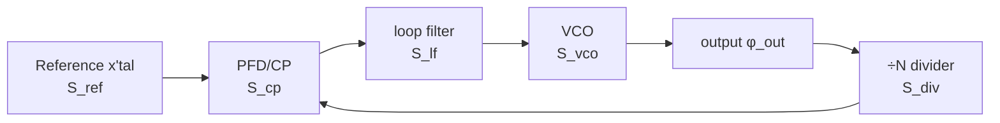

> **β**: This English translation is in beta — the Traditional-Chinese original is the authoritative version.

# Complete PLL phase-noise budget and optimal loop BW

> **Prerequisites**: [white_noise_to_phase_noise](/03_isf_core_theory/white_noise_to_phase_noise) (where the VCO term $S_{vco}\propto\Gamma_{rms}^2/q_{max}^2\cdot S_i/f^2$ comes from), [serdes_clocking_connection](/06_design_insights/serdes_clocking_connection) (the CDR/PLL's high-pass on the VCO, jitter integration bandwidth), [lc_vs_ring](/06_design_insights/lc_vs_ring) (why ring's $S_{vco}$ is high and LC's is low) | **Next**: [exercises](/06_design_insights/exercises), [lab_13_pll_cdr_transfer](/04_simulation_labs/lab_13_pll_cdr_transfer)

This page answers a question a system-design engineer faces every day: **for a phase-locked
loop (PLL — a negative-feedback loop that locks an oscillator's phase to a reference clock),
which sources contribute how much to the output phase noise, and which one dominates at which
offset band? How wide should the loop bandwidth (the highest offset the feedback can still
track) be chosen to minimize total jitter?** We write out the transfer function of each of the
five noise sources to the output, sum them as

$$
S_{out}=(S_{ref}N^2+S_{cp})\,\lvert H_{lp}\rvert^2+S_{vco}\,\lvert H_{hp}\rvert^2
$$

(canonical Section 11.2, "PLL output noise budget"; for a **fractional-N** loop a third term —
the ΔΣ quantization noise $S_{\Delta\Sigma}\,\lvert H_{lp}\rvert^2$ — must be added, see the
section "The third term for fractional-N" on this page; it is zero for integer-N), then minimize
$\int S_{out}\,df$
(integrated phase variance, proportional to rms jitter squared) to find that **famous U-shaped
curve** and its minimum.

> **Physical intuition (conclusion first)**: a PLL is a low-pass tracker. Within the loop
> bandwidth $f_n$, the feedback reacts fast enough that the output **follows the reference** —
> so the noise of the reference and the loop's front end (PFD, charge-pump, divider) is
> **amplified and low-passed** onto the output (and the reference is also multiplied by $N$,
> so its power is multiplied by $N^2$); meanwhile the VCO's own close-in drift is **corrected
> away** by the feedback (VCO high-pass). Beyond $f_n$, the feedback can't keep up, and the
> output **follows the free-running VCO** — the VCO's $1/f^2$ noise leaks straight through. So
> **in-band tracks ref/CP, out-of-band tracks VCO**, with the crossover at $f_n$. Set $f_n$ too
> narrow → too much VCO leaks through (U-shape's left arm rises); too wide → too much ref/CP
> gets carried through (right arm rises). There must be an optimal $f_n$ in between.

This page's PLL closed-loop transfer function (loop transfer / open-loop gain / type-II
stability — the higher-order details) belongs to **standard PLL literature** (Gardner, Razavi,
Best), **not among the five source PDFs downloaded for this site**; we only cite its type-II
second-order closed-loop result (already recorded in canonical Section 10.2), and focus on "the
ISF determines the VCO term $S_{vco}$" and "how the budget sums up and how the optimal BW is
found." The microscopic origin of the VCO term ($\Gamma_{rms}^2/q_{max}^2$) is precisely the
output of this site's whole ISF theory built up so far.

## Why do a "noise budget"

Phase noise is not a single number — it's a curve that varies with offset, and different
sources dominate different segments of that curve. **Doing a budget = plotting each source as
one curve, and seeing where each one pokes up and what the total looks like.** The value of
doing this:

- **Find the bottleneck**: close-in too high? Usually the reference or the charge-pump
  (amplified by $N^2$). Far-out too high? It's the VCO. Treat the actual cause, don't swap
  parts blindly.
- **Choose the loop BW**: the crossover point and total jitter are both strongly tied to $f_n$;
  the budget lets you **quantify** this trade-off.
- **Connect to system metrics**: integrate $S_{out}$ to get rms jitter $\sigma_t$, and feed it
  directly into the SerDes eye/BER (see
  [serdes_clocking_connection](/06_design_insights/serdes_clocking_connection)).

## PLL block diagram and the five noise sources

The skeleton of an integer-N PLL: reference clock → phase detector (PFD, phase-frequency
detector) + charge-pump (turns the phase error into current pulses) → loop filter (integrates
the current into a control voltage) → VCO (voltage-controlled oscillator) → divider (÷N, pulls
the output back down to the reference frequency for comparison). The five noise injection
points, shown below:



Each source takes a different path to the output, so **the shaping differs**:

| Source | Symbol | Physical origin | Transfer to output | Shaping at output |
|---|---|---|---|---|
| reference | $S_{ref}$ | crystal/reference phase noise | $\times N$ then low-pass | $N^2\lvert H_{lp}\rvert^2$ (in-band, amplified by $N^2$) |
| PFD/charge-pump | $S_{cp}$ | CP current noise, PFD dead-zone, mismatch | low-pass | $\lvert H_{lp}\rvert^2$ (in-band, flat floor) |
| divider | $S_{div}$ | jitter of the ÷N logic | low-pass (same path as ref) | $\lvert H_{lp}\rvert^2$ (in-band; often folded into $S_{cp}$) |
| loop filter | $S_{lf}$ | filter resistor thermal noise modulating the VCO | band-pass (peak exactly at $f_n$) | $4kTR\,K_{vco}^2/(2\pi f)^2\cdot\lvert H_{hp}\rvert^2$ (closed form in Step 2; not negligible for small $I_{cp}$ / large $R$) |
| VCO | $S_{vco}$ | tank/tail thermal noise via ISF (this site's main thread) | high-pass | $\lvert H_{hp}\rvert^2$ (dominates out-of-band) |

**Why the reference is multiplied by $N^2$.** The divider pulls the output frequency
$f_{out}=N f_{ref}$ back down to $f_{ref}$ for comparison — equivalent to requiring **output
phase = $N\times$ reference phase** (phase is also multiplied up). Phase amplified by $N$ means
power spectral density amplified by $N^2$. So a clean crystal ($S_{ref}$ very low) combined with
a large $N$ (e.g. $N=100$) has its equivalent in-band noise floor at the output raised by
$20\log_{10}N=40$ dB — this is why **an integer-N PLL's in-band noise is usually determined
jointly by the reference $\times N^2$ and the charge-pump**, not the VCO.

> **Design takeaway**: the in-band floor $\approx(S_{ref}N^2+S_{cp})$; to suppress it, either
> lower $N$ (use fractional-N or a higher-frequency reference), or lower the charge-pump's
> current noise. The VCO **contributes nothing** in-band (it's corrected away by the high-pass).

## Step 1: each source's transfer function (type-II second-order)

Using the closed-loop power transfer of canonical Section 10.2, "PLL (type-II 2nd order)."
With natural frequency $\omega_n=2\pi f_n$, damping ratio $\zeta$ (this page uses near-critical
$\zeta=0.707$), and $\omega=2\pi f$ ($f$ the offset frequency):

$$
\lvert H_{lp}\rvert^2=\frac{(2\zeta\omega_n\omega)^2+\omega_n^4}{(\omega_n^2-\omega^2)^2+(2\zeta\omega_n\omega)^2},\qquad
\lvert H_{hp}\rvert^2=\frac{\omega^4}{(\omega_n^2-\omega^2)^2+(2\zeta\omega_n\omega)^2}.
$$

- **Low-frequency limit $\omega\to0$**: $\lvert H_{lp}\rvert^2\to\omega_n^4/\omega_n^4=1$
  (reference/CP fully pass), $\lvert H_{hp}\rvert^2\to0$ (VCO suppressed). Confirms "in-band
  tracks ref/CP."
- **High-frequency limit $\omega\to\infty$**: $\lvert H_{lp}\rvert^2\to(2\zeta\omega_n\omega)^2/\omega^4\to0$,
  $\lvert H_{hp}\rvert^2\to\omega^4/\omega^4=1$ (VCO fully passes). Confirms "out-of-band tracks
  VCO."
- **Complementarity**: in the standard form $H_{hp}(s)=1-H_{lp}(s)$, so the output is the sum of
  the two paths with no double-counting.
- **Dimension check**: $\omega,\omega_n$ are both rad/s, numerator and denominator are the same
  order ($\omega^4$ or $\omega_n^4$), $\lvert H\rvert^2$ is dimensionless — confirmed.

The detailed derivation of these two transfer functions (writing the open-loop gain
$G(s)=\frac{I_{cp}}{2\pi}(R+\frac{1}{sC})\frac{K_{vco}}{s}\frac{1}{N}$ from the charge-pump $K_{cp}=I_{cp}/2\pi$, the
loop filter $R+1/sC$, the VCO $K_{vco}/s$ and the divider $1/N$, then taking the closed loop to get
$\omega_n=\sqrt{I_{cp}K_{vco}/(2\pi NC)}$, $\zeta=\frac{R}{2}\sqrt{I_{cp}K_{vco}C/(2\pi N)}$, with a worked $R$, $C$
design and the third pole $C_3$) is in
[lab_13_pll_cdr_transfer](/04_simulation_labs/lab_13_pll_cdr_transfer) §2; that derivation chain
and type-II stability belong to standard PLL literature (not among the five source PDFs).

## Step 2: summing into the output budget

The reference and charge-pump/divider take the same low-pass path (with the reference first
multiplied by $N$), the VCO takes the high-pass path, and the three segments are uncorrelated —
their powers add (canonical Section 11.2):

$$
S_{out}(f)=\big(S_{ref}(f)\,N^2+S_{cp}(f)\big)\,\lvert H_{lp}(f)\rvert^2+S_{vco}(f)\,\lvert H_{hp}(f)\rvert^2 .
$$

- **Dimension check**: $S_{ref},S_{cp},S_{vco},S_{out}$ are all $\text{rad}^2/\text{Hz}$, $N$ and
  $\lvert H\rvert^2$ are dimensionless, so the three terms add in the same units — confirmed.
- **Where did the divider go**: $S_{div}$ takes the same low-pass path as the charge-pump and is
  shaped identically by $\lvert H_{lp}\rvert^2$ at the output, so in practice $S_{div}$ is often
  folded into $S_{cp}$ as "the loop front end's equivalent in-band floor." This page's $S_{cp}$
  is the combined total of "PFD + charge-pump + divider."
- **The loop-filter term (closed form)**: the thermal noise voltage of the filter resistor $R$ (PSD $4kTR$)
  adds directly onto $V_{ctrl}$, passes through the VCO's $K_{vco}/s$, and is then corrected by the loop as
  $1/(1+G)=H_{hp}$ (derivation in [lab_13](/04_simulation_labs/lab_13_pll_cdr_transfer) §2):

$$
S_{lf}(f)=S_{\phi,R}(f)=\frac{4kTR\,K_{vco}^{2}}{(2\pi f)^{2}}\,\lvert H_{hp}(f)\rvert^{2}\quad[\text{rad}^2/\text{Hz}],
\qquad S_{\phi,R}(f_n)=\frac{4kTR\,K_{vco}^{2}}{(2\zeta\omega_n)^{2}}
$$

  ($K_{vco}$ in rad/s/V; rising $\propto f^2$ at low frequency, falling $\propto1/f^2$ at high frequency —
  **band-pass, peak exactly at $f_n$**). **It is not necessarily small**: with lab_13's worked design ($f_n=1$ MHz,
  $\zeta=0.707$, $N=100$, $K_{vco}=50$ MHz/V, $I_{cp}=100\ \mu$A → $R=178$ kΩ, $C=1.27$ pF),
  $S_{\phi,R}(1\ \text{MHz})=3.68\times10^{-12}\ \text{rad}^2/\text{Hz}$ ($-117.4$ dBc/Hz) — **2.5× above** this
  page's in-band floor of $1.5\times10^{-12}$, but 27× below the ring VCO's $10^{-10}$ at $f_n$; integrated alone
  over 1 kHz–1 GHz it gives $\sigma_{t,R}=91$ fs (compare the 259 fs optimum). At fixed $f_n,\zeta$,
  $R\propto1/I_{cp}$, so **raising the CP current** suppresses the resistor term and the CP term
  $(2\pi N/I_{cp})^2S_{i,cp}$ together (cost: power, capacitor area). The lab_20 figure (below) does not include
  this term (its $I_{cp}$ is unspecified; marked illustrative); a real design must.

```python
import numpy as np
from simulations.common.pll_utils import design_type2, H_highpass_mag2
R, C = design_type2(1e6, 0.707, 100, 50e6, 100e-6)     # lab_13 worked design: Hz, -, -, Hz/V, A
kv = 2*np.pi*50e6                                       # rad/s/V
Sv = 4*1.380649e-23*300*R                               # V^2/Hz
f = np.logspace(3, 9, 200001)
S_R = Sv*kv**2/(2*np.pi*f)**2*H_highpass_mag2(f, 1e6, 0.707)
i = np.argmin(abs(f - 1e6))
print(round(R/1e3, 1), f"{S_R[i]:.2e}", round(10*np.log10(0.5*S_R[i]), 1),
      round(np.sqrt(np.trapezoid(S_R, f))/(2*np.pi*5e9)*1e15, 0))
# -> 177.7 3.68e-12 -117.4 91.0
```

- **The fractional-N third term**: if the divider modulus is dithered by a ΔΣ modulator
  (fractional-N), the quantization noise enters the budget as
  $S_{\Delta\Sigma}(f)\,\lvert H_{lp}\rvert^2$ — same low-pass path as the CP, but **not
  multiplied by $N^2$**, and shaped as a rising ramp of $+20(m-1)$ dB/dec. Full derivation and
  worked example in the section "The third term for fractional-N: ΔΣ quantization noise" on
  this page. For integer-N (this page's lab_20 setup) this term is zero.

### The VCO term is precisely this site's ISF result

$S_{vco}$ doesn't come out of thin air — it **is exactly the output of this site's whole ISF
theory**. In the $1/f^2$ region (white-noise upconversion),

$$
S_{vco}(f)=\frac{\Gamma_{rms}^2}{q_{max}^2}\cdot\frac{\overline{i_n^2}/\Delta f}{(2\pi f)^2}\quad[\text{rad}^2/\text{Hz}]
$$

(clean time-domain version, see
[white_noise_to_phase_noise](/03_isf_core_theory/white_noise_to_phase_noise); corresponds to
[P1] Eq.(21), p.185, off by an SSB factor-of-2). So the answer to "why is the VCO term $1/f^2$
in the PLL budget, why $\propto\Gamma_{rms}^2/q_{max}^2$" is entirely in the ISF. **A ring VCO
has a large $\Gamma_{rms}$ and small $q_{max}$, so $S_{vco}$ is high** (see
[lc_vs_ring](/06_design_insights/lc_vs_ring)) — this is exactly the root reason a ring-PLL needs
to open up $f_n$ to suppress the VCO.

## Step 3: the in-band vs out-of-band handoff

Break $S_{out}$ into three segments:

1. **Deep in-band ($f\ll f_n$)**: $\lvert H_{lp}\rvert^2\approx1$, $\lvert H_{hp}\rvert^2\approx0$.
   $S_{out}\approx S_{ref}N^2+S_{cp}$ — a **flat floor** set by the reference$\times N^2$ and the
   charge-pump (if the reference contains $1/f$, this segment tilts up slightly toward
   close-in).
2. **Out-of-band ($f\gg f_n$)**: $\lvert H_{lp}\rvert^2\approx0$, $\lvert H_{hp}\rvert^2\approx1$.
   $S_{out}\approx S_{vco}\propto1/f^2$ — the **VCO's $-20$ dB/decade skirt** leaks straight
   through.
3. **Crossover ($f\approx f_n$)**: the two segments meet. At $\zeta=0.707$, at $f_n$
   $\lvert H_{lp}\rvert^2\approx1.5$ ($+1.76$ dB), $\lvert H_{hp}\rvert^2\approx0.5$
   ($-3$ dB), and their sum $\approx2$ ($+3$ dB) — this is the slight **peaking**, also the
   origin of the common "bump near the loop BW" seen in PLL output (the two curves are actually
   equal at $f\approx1.55\,f_n$, each about $0.85$, $-0.7$ dB, not at $f_n$). Too small a
   $\zeta$ (underdamped) makes the peaking sharp. The **exact** location and height of the peak
   actually have a closed-form solution — see the next section.

> **Reading a PN plot at a glance**: see a flat close-in floor → measure in-band, back out
> $S_{ref}N^2+S_{cp}$; see the floor start falling at $-20$ dB/dec from some offset → that
> knee is $f_n$, beyond it is VCO. A sharp peak in the middle → insufficient damping or an
> overshooting loop-BW design.

## Supplementary derivation: the closed-form peaking — a type-II with a zero is destined to bump

Step 3 measured $\lvert H_{lp}\rvert^2\approx1.5$ ($+1.76$ dB) at $f=f_n$ — but that is **not
the maximum**. This section solves analytically for the **peak frequency and peak magnitude**
of the type-II second-order $\lvert H_{lp}\rvert^2$ (the canonical Section-10.2 form). The
derivation itself is pure algebra (self-contained); the "$\zeta\leftrightarrow$ phase margin
mapping" and the "cascaded 0.1-dB rule" belong to standard control/telecom literature, each
labeled as such (external literature, not among this site's five source PDFs).

### Normalization

Let $x=\omega/\omega_n=f/f_n$ (dimensionless; rad/s ÷ rad/s — checks out). Divide the numerator
and denominator of the canonical Section-10.2 $\lvert H_{lp}\rvert^2$ by $\omega_n^4$:

$$
\lvert H_{lp}\rvert^2=\frac{(2\zeta\omega_n\omega)^2+\omega_n^4}{(\omega_n^2-\omega^2)^2+(2\zeta\omega_n\omega)^2}
=\frac{1+4\zeta^2x^2}{(1-x^2)^2+4\zeta^2x^2}\equiv g(x) .
$$

### Finding the extremum: a beautiful quadratic

Let $u=x^2$ ($u\ge0$). Numerator $N(u)=1+4\zeta^2u$, denominator
$D(u)=(1-u)^2+4\zeta^2u=u^2+(4\zeta^2-2)u+1$, derivatives $N'=4\zeta^2$, $D'=2u+4\zeta^2-2$.
The extremum condition of the quotient is $N'D-ND'=0$; expand term by term:

$$
\begin{aligned}
N'D-ND'&=4\zeta^2\big[u^2+(4\zeta^2-2)u+1\big]-(1+4\zeta^2u)\big[2u+4\zeta^2-2\big]\\
&=\big[4\zeta^2u^2+(16\zeta^4-8\zeta^2)u+4\zeta^2\big]-\big[8\zeta^2u^2+(16\zeta^4-8\zeta^2)u+2u+4\zeta^2-2\big]\\
&=-4\zeta^2u^2-2u+2\;=\;-2\big(2\zeta^2u^2+u-1\big).
\end{aligned}
$$

(The two $16\zeta^4$ cross terms **cancel exactly**, leaving a quadratic with no $\zeta^4$.)
Setting it to zero and taking the positive root:

$$
2\zeta^2u^2+u-1=0\quad\Longrightarrow\quad
u^\*=\frac{\sqrt{1+8\zeta^2}-1}{4\zeta^2}=\frac{2}{\sqrt{1+8\zeta^2}+1},\qquad
f_{pk}=f_n\sqrt{u^\*}.
$$

(The two forms are equal: multiply numerator and denominator by $\sqrt{1+8\zeta^2}+1$ and use
$8\zeta^2=(\sqrt{1+8\zeta^2})^2-1$.)

### Why it "always" peaks

At $u=0$ (DC), $N'D-ND'=4\zeta^2-(4\zeta^2-2)=+2$ — **positive for every $\zeta$**. The DC gain
is 1 and the slope points up, so for any finite $\zeta$, $u^\*>0$ always holds and the peak is
necessarily above 0 dB. The physical reason: a type-II loop has two integrators (open-loop
phase starts at $-180^\circ$) and can only be stabilized by the loop filter's zero
($f_z=f_n/(2\zeta)$) pulling the phase back early; that zero first **lifts** the closed-loop
gain above 1 before the double pole pushes it down — **peaking is the price of type-II
stability**, not a design mistake. Contrast: an ordinary second-order low-pass without a zero
has no resonance peak for $\zeta\ge1/\sqrt2$; a type-II with a zero **always** peaks, the peak
merely getting lower and sliding toward lower frequency as $\zeta$ grows.

### Peak magnitude: substitute back and simplify

Let $s=\sqrt{1+8\zeta^2}$ (dimensionless). Three intermediate quantities, simplified step by
step (using $8\zeta^2=s^2-1$ repeatedly):

$$
\begin{aligned}
N(u^\*)&=1+4\zeta^2u^\*=1+(s-1)=s,\\
1-u^\*&=1-\frac{2}{s+1}=\frac{s-1}{s+1},\\
D(u^\*)&=\Big(\frac{s-1}{s+1}\Big)^2+(s-1)
=\frac{(s-1)\big[(s-1)+(s+1)^2\big]}{(s+1)^2}
=\frac{s\,(s-1)(s+3)}{(s+1)^2}.
\end{aligned}
$$

(The last step uses $(s-1)+(s+1)^2=s^2+3s=s(s+3)$.) Therefore

$$
\lvert H_{lp}\rvert^2_{max}=\frac{N(u^\*)}{D(u^\*)}=\frac{(s+1)^2}{(s-1)(s+3)},\qquad
f_{pk}=f_n\sqrt{\frac{2}{s+1}},\qquad s=\sqrt{1+8\zeta^2}.
$$

Peaking (dB) $=10\log_{10}\lvert H_{lp}\rvert^2_{max}$. **dB bookkeeping note**: this is
$10\log_{10}$ of a power transfer, numerically equal to $20\log_{10}$ of the magnitude
transfer — the same number; there is **no** SSB /2 or /4 bookkeeping here (that only arises when
converting $S_\phi$ to $\mathcal{L}$ — see canonical Eq. 16 and the [P1] Eq.(21) discussion).

**Dimension check**: $x,u,\zeta,s$ are all dimensionless; $f_{pk}=f_n\times$(dimensionless)
$=$ Hz — checks out; $\lvert H_{lp}\rvert^2_{max}$ is a dimensionless power ratio — checks out.

> **Golden-ratio easter egg**: at $\zeta=1/\sqrt2$ ($\zeta^2=\tfrac12$), $s=\sqrt5$,
> $u^\*=2/(\sqrt5+1)=(\sqrt5-1)/2=1/\varphi=0.618$, and
> $\lvert H_{lp}\rvert^2_{max}=(\sqrt5+1)/2=\varphi=1.618$ — **the peak is exactly the golden
> ratio**, peaking $=10\log_{10}1.618=2.09$ dB, located at $f_{pk}=0.786\,f_n$. The $+1.76$ dB
> read at $f_n$ in Step 3 is only the right shoulder of this peak.

### ζ → peaking table (with phase margin)

| $\zeta$ | $f_{pk}/f_n$ | peaking (dB) | phase margin |
|---|---|---|---|
| 0.5 | 0.856 | 3.33 | 51.8° |
| 0.707 | 0.786 | **2.09** | 65.5° |
| 1.0 | 0.707 | 1.25 | 76.3° |
| 1.5 | 0.611 | 0.65 | 83.7° |
| 4.32 | 0.388 | 0.10 | 89.2° |

Where the $\zeta\leftrightarrow$PM mapping comes from: back out the open loop from $H_{lp}$,
$G(s)=H_{lp}/(1-H_{lp})=(2\zeta\omega_n s+\omega_n^2)/s^2$; setting
$\lvert G(j\omega_c)\rvert=1$ gives the crossover frequency
$\omega_c=\omega_n\sqrt{2\zeta^2+\sqrt{4\zeta^4+1}}$; and
$\angle G=-180^\circ+\arctan(2\zeta\omega_c/\omega_n)$, hence

$$
\mathrm{PM}=\arctan\!\Big(2\zeta\sqrt{2\zeta^2+\sqrt{4\zeta^4+1}}\Big).
$$

This expression is **identical in form** to the textbook "standard second-order system
(no-zero prototype)" $\zeta\leftrightarrow$PM mapping (the algebraic identity
$(\sqrt{4\zeta^4+1}-2\zeta^2)(\sqrt{4\zeta^4+1}+2\zeta^2)=1$ makes the two $\arctan$ arguments
equal), so the common rule of thumb $\mathrm{PM}\approx100\,\zeta$ degrees (valid for
$\zeta\lesssim0.7$) carries over as well (the standard $\zeta\leftrightarrow$PM mapping and the
$100\zeta$ rule are external literature, not among this site's five source PDFs:
F. M. Gardner, *Phaselock Techniques*, 3rd ed., Wiley, 2005; B. Razavi,
*Design of CMOS Phase-Locked Loops*, Cambridge Univ. Press, 2020).

### The cascade rule: why telecom specs obsess over 0.1 dB

Cascade $M$ loops with identical transfers (a chain of repeaters/CDRs on a long-haul link, each
regenerating and re-transmitting the clock): the total jitter transfer is $H_{lp}^M$ — **the dBs
add directly**: the peak becomes $M\times P$ dB.

- 2.09 dB per stage ($\zeta=0.707$) $\times$ 20 stages $=$ **41.8 dB**: jitter near $f_{pk}$ is
  amplified more than a hundredfold — the link is dead.
- 0.1 dB per stage $\times$ 20 stages $=$ 2 dB: manageable.

This is why the SONET/SDH era pinned the regenerator jitter-transfer peaking spec at the
**0.1 dB** level (external standards literature: Telcordia GR-253-CORE and the ITU-T
G.783/G.958 family of telecom specs; this site has not verified the individual clause numbers —
we cite the magnitude and the spirit). Inverting the closed form, 0.1 dB requires
$\zeta\approx4.32$ (PM $\approx89.2^\circ$, heavily overdamped) — completely different from the
$\zeta\approx0.7$–$1$ that minimizes a single PLL's integrated jitter: **single-loop optimal is
not cascade optimal**; a CDR's $\zeta$ is a system spec set by "which stage of the chain you
are."

Rigor note: adding dBs assumes every stage has the same $f_n,\zeta$ (peaks aligned — worst
case); in practice the stages' $f_n$ are slightly staggered and the compounding is milder than
$M\times P$, but specs are written for the worst case.

### Numerical cross-check (repo `pll_utils`)

Closed form vs `H_lowpass_mag2` from `simulations/common/pll_utils.py` (a 4-million-point fine
sweep):

```python
import numpy as np
from simulations.common.pll_utils import H_lowpass_mag2

def peak_closed(zeta):                      # closed form: f_pk/f_n and |H_lp|^2_max
    s = np.sqrt(1 + 8*zeta**2)
    return np.sqrt((s - 1)/(4*zeta**2)), (s + 1)**2/((s - 1)*(s + 3))

x = np.linspace(0.001, 5, 4_000_001)        # x = f/f_n (take f_n = 1 Hz)
for z in (0.5, 0.707, 1.0, 1.5):
    xpk, g = peak_closed(z)
    m2 = H_lowpass_mag2(x, 1.0, z)
    k = int(np.argmax(m2))
    print(f"{z}: closed {xpk:.4f}/{10*np.log10(g):.4f} dB, "
          f"numeric {x[k]:.4f}/{10*np.log10(m2[k]):.4f} dB")
# -> 0.707: closed 0.7862/2.0903 dB, numeric 0.7862/2.0903 dB (others: zeta=0.5→3.3339, 1.0→1.2494, 1.5→0.6514; closed = numeric to 4 decimals)

zg = np.linspace(2, 8, 600001)              # sweep zeta to invert for 0.1 dB peaking
pk = 10*np.log10(peak_closed(zg)[1])
z01 = zg[int(np.argmin(np.abs(pk - 0.1)))]
print(round(z01, 3))                        # -> 4.319 (zeta required for 0.1 dB)
```

**Conditions of validity and failure (this section's closed form):**

- Valid only for the **ideal type-II second-order** closed loop of canonical Section 10.2
  (linearized charge-pump PLL, no extra poles). Real loops usually add 1–2 high-frequency
  poles in the loop filter (third/fourth-order loops); the peak location and height shift and
  must be computed numerically.
- The PM mapping assumes the crossover happens on the ideal $G(s)$; extra poles eat PM, and
  $\mathrm{PM}\approx100\zeta$ loses accuracy accordingly.
- This peak is a bump of the **transfer function**; the actual PN bump near $f_n$ at the output
  must still be multiplied by each source's PSD (see Step 3).

## Step 4: reference spur (brief)

Besides **random** phase noise (a continuous skirt), PLL output also commonly has **discrete
spurs (single-frequency spikes)**. The most common is the **reference spur**: the charge-pump
injects a current pulse every reference period, and this periodic disturbance appears at the
output at integer multiples of $f_{ref}$ (i.e. offset $=\pm f_{ref},\pm2f_{ref},\dots$). Its
source is CP current mismatch, leakage, and PFD dead-zone, which impose a small $f_{ref}$
ripple on the control voltage, converted by the VCO's $K_v$ into phase-modulation sidebands.

- **Spur vs. random PN**: a spur is a **deterministic, narrow** line (a needle in the spectrum),
  random PN is a **continuous** skirt; in measurement, the spur's height doesn't change with
  resolution bandwidth RBW (its power is concentrated in one bin), whereas random PN's dBc/Hz is
  genuinely "per-Hz."
- **Relation to loop BW**: the reference spur at offset $f_{ref}$, if $f_{ref}>f_n$, is
  attenuated by $\lvert H_{lp}\rvert^2$'s low-pass (narrower loop BW → more spur suppression);
  this is consistent with "narrow BW favors random in-band noise," but it sacrifices VCO
  suppression — the same trade-off again.
- This page's budget only covers the **random** part (continuous $S_{out}$); a quantitative
  spur analysis belongs to standard PLL literature (not among the five source PDFs) — here it's
  only a conceptual link.

## Step 5: optimal loop BW — minimizing ∫S_out df

Write out the output's **integrated phase variance** (canonical Eq. 18):

$$
\sigma_\phi^2(f_n)=\int_{f_1}^{f_2}S_{out}(f;f_n)\,df,\qquad
\sigma_t(f_n)=\frac{1}{2\pi f_0}\sqrt{\sigma_\phi^2(f_n)} .
$$

$\sigma_\phi^2$ is a function of $f_n$, because $S_{out}$ depends on $f_n$ through
$\lvert H_{lp}\rvert^2,\lvert H_{hp}\rvert^2$. Split it into in-band and out-of-band pieces to
see the trend:

$$
\sigma_\phi^2(f_n)\approx\underbrace{\int (S_{ref}N^2+S_{cp})\,\lvert H_{lp}\rvert^2\,df}_{\uparrow\ \text{as }f_n\uparrow\ (\text{wider passband, more ref/CP carried through})}+\underbrace{\int S_{vco}\,\lvert H_{hp}\rvert^2\,df}_{\downarrow\ \text{as }f_n\uparrow\ (\text{more VCO close-in suppressed})} .
$$

- **First term (ref/CP) increases monotonically with $f_n$**: the larger $f_n$, the wider the
  low-pass passband, carrying more of the in-band floor (including the $N^2$-amplified
  reference) through to the output. Roughly $\propto(S_{ref}N^2+S_{cp})\cdot f_n$ (flat floor
  times passband width).
- **Second term (VCO) decreases monotonically with $f_n$**: the larger $f_n$, the more of the
  VCO's $1/f^2$ close-in the high-pass corrects away. For $S_{vco}=k/f^2$ passed through the
  high-pass, the residual integral $\propto k/f_n$ (wider BW → less leakage).

One increasing, one decreasing → a **U-shape**. Setting the derivative with respect to $f_n$ to
zero gives a unique minimum:

$$
\frac{d\,\sigma_\phi^2}{d f_n}=0\quad\Longrightarrow\quad
\text{(marginal increase in ref/CP leakage)}=\text{(marginal decrease in VCO suppression)}.
$$

Using the two rough estimates above (of the form $a\,f_n+b/f_n$, with $a\propto S_{ref}N^2+S_{cp}$
and $b\propto S_{vco}$'s coefficient) to find the minimum:

$$
\frac{d}{df_n}\!\left(a f_n+\frac{b}{f_n}\right)=a-\frac{b}{f_n^2}=0\ \Longrightarrow\ f_n^\*=\sqrt{\frac{b}{a}}\ \propto\ \sqrt{\frac{S_{vco}\text{ coefficient}}{S_{ref}N^2+S_{cp}}} .
$$

- **Physical meaning**: **the noisier the VCO ($b$ large) → the larger the optimal BW** (a
  wider loop is needed to suppress the VCO); **the noisier the ref/CP, or the larger $N$
  ($a$ large) → the smaller the optimal BW** (you can't afford to carry too much of the in-band
  floor through). This relation $f_n^\*\propto\sqrt{b/a}$ is the core intuition of PLL design,
  though the coefficients must be pinned down by numerical integration.
- **Toy-model note**: the $af_n+b/f_n$ above is a **heuristic estimate** that approximates the
  shaping as an ideal brick-wall filter; the real integral needs the full $\lvert H\rvert^2$
  (including the peaking near $f_n$), so below we use lab_20's numerical integration to give the
  exact minimum.

## Corresponding simulation figure (lab_20)

**lab_20** (`simulations/lab_20_pll_budget.py`) uses the type-II second-order budget above. The
left panel, at fixed $f_n=1$ MHz, plots three curves (ref$\times N^2$+CP low-pass, VCO
high-pass, and the sum); the right panel sweeps $f_n$ and plots $\sigma_t(f_n)$ as a U-shape,
marking its minimum.


> **Translator's note**: this figure is generated by a script with Chinese text baked into the image. Titles read: "(a) PLL 輸出雜訊預算（畫在最佳 loop BW）：in-band 跟 ref/CP、out-of-band 跟 VCO" = (a) the PLL output noise budget (plotted at the optimal loop bandwidth): in-band tracks ref/CP, out-of-band tracks the VCO; "(b) 存在最佳 loop BW：太窄→VCO 漏出、太寬→ref/CP 漏出" = (b) an optimal loop bandwidth exists: too narrow → VCO noise leaks through, too wide → ref/CP noise leaks through.

**Parameter table (lab_20, representative levels, not a specific silicon process, illustrative):**

| Quantity | Value | Description |
|---|---|---|
| $f_0$ | 5 GHz | VCO/output frequency |
| $N$ | 100 | division ratio (reference $\times N^2=40$ dB amplification) |
| $\zeta$ | 0.707 | damping ratio (near critical, small peaking) |
| $S_{ref}$ | $10^{-16}+10^{-18}(10^6/f)$ | clean crystal: low flat floor + slight $1/f$ |
| $S_{cp}$ | $5\times10^{-13}$ (flat) | combined PFD/charge-pump/divider in-band floor |
| $S_{vco}$ | $2\times10^{-10}(10^6/f)^2$ | ring VCO, $-100$ dBc/Hz @ 1 MHz, $1/f^2$ |
| Integration range | $10^3$–$10^9$ Hz | 1 kHz to 1 GHz |

**Units table:**

| Quantity | Unit |
|---|---|
| $f,f_0,f_n$ | Hz |
| $\omega,\omega_n$ | rad/s |
| $S_{ref},S_{cp},S_{vco},S_{out}$ | $\text{rad}^2/\text{Hz}$ |
| $\lvert H_{lp}\rvert^2,\lvert H_{hp}\rvert^2,N,\zeta$ | dimensionless |
| $\sigma_\phi$ | rad |
| $\sigma_t$ | s |

**How to read the figure:**

- **Left panel**: the blue dotted curve (ref$\times N^2$+CP) is a flat floor at
  $\approx1.5\times10^{-12}\ \text{rad}^2/\text{Hz}$ in-band
  ($S_{ref}N^2+S_{cp}=10^{-16}\cdot100^2+5\times10^{-13}=1.5\times10^{-12}$), pulled down by the
  low-pass beyond $f_n$; the red dotted curve (VCO high-pass) is suppressed in-band and leaks
  out along $1/f^2$ out-of-band; the black curve (the sum) = flat close-in, following the VCO's
  $1/f^2$ far-out, with the crossover near $f_n$ and a slight peaking.
- **Right panel**: $\sigma_t$ vs. $f_n$ is U-shaped. $f_n$ too narrow (left arm) → too much VCO
  close-in leaks through → jitter blows up; $f_n$ too wide (right arm) → too much
  ref$\times N^2$/CP carried through → jitter rises again. **The minimum lands at
  $f_n^\*\approx6.90$ MHz, $\sigma_t\approx259$ fs** (lab_20's measured printed values).

**Core Python (full script: `simulations/lab_20_pll_budget.py`):**

```python
import numpy as np
from simulations.common.pll_utils import H_lowpass_mag2, H_highpass_mag2

def output_psd(f, fn, N, zeta=0.707):
    lp = H_lowpass_mag2(f, fn, zeta)
    hp = H_highpass_mag2(f, fn, zeta)
    S_ref = 1e-16 + 1e-18 * (1e6 / f)   # clean crystal
    S_cp  = 5e-13 * np.ones_like(f)     # PFD/CP/divider flat floor
    S_vco = 2e-10 * (1e6 / f) ** 2      # ring VCO -100 dBc/Hz @1MHz, 1/f^2
    return (S_ref * N**2 + S_cp) * lp + S_vco * hp   # budget sum

f = np.logspace(3, 9, 3000); f0 = 5e9; N = 100
fns = np.logspace(4.5, 7.5, 60)
jit = [np.sqrt(np.trapezoid(output_psd(f, fn, N), f)) / (2*np.pi*f0) for fn in fns]
k = int(np.argmin(jit))
print(fns[k]/1e6, "MHz", jit[k]*1e15, "fs")   # -> ~6.90 MHz, ~259 fs
```

## Worked examples

Format: **problem → step-by-step substitution (with units) → result → dimension check → one
line of Python verification**. Uses lab_20's representative values throughout ($f_0=5$ GHz,
$N=100$, $\zeta=0.707$, the three $S$'s from the table above).

> **Example 1 (in-band floor + the cost of the reference's $\times N^2$)**: find the deep
> in-band ($f\ll f_n$) output phase-noise floor, convert it to dBc/Hz, and compare how much
> difference (in dB) it makes if $N$ drops from 100 to 10.

**Step by step:**

1. Deep in-band, $\lvert H_{lp}\rvert^2\approx1$, $\lvert H_{hp}\rvert^2\approx0$; take the flat
   part (ignoring the reference's $1/f$):

$$
S_{out,\,\text{in-band}}\approx S_{ref}N^2+S_{cp}=10^{-16}\times100^2+5\times10^{-13}.
$$

2. Compute the reference term: $10^{-16}\times10^{4}=10^{-12}\ \text{rad}^2/\text{Hz}$.
3. Add the CP term: $10^{-12}+5\times10^{-13}=1.5\times10^{-12}\ \text{rad}^2/\text{Hz}$.
4. Convert to dBc/Hz ($\mathcal{L}\approx\tfrac12 S_\phi$, canonical Eq. 16):
   $\mathcal{L}=10\log_{10}(\tfrac12\times1.5\times10^{-12})=10\log_{10}(7.5\times10^{-13})$.

**Result:** the in-band floor $S_{out}\approx1.5\times10^{-12}\ \text{rad}^2/\text{Hz}$, i.e.
$\mathcal{L}\approx-121.2$ dBc/Hz. Of this, the reference contributes $10^{-12}$ and the CP
contributes $0.5\times10^{-12}$ — **the reference$\times N^2$ is the dominant player in-band**.
If $N$ drops from 100 to 10, the reference term drops from $10^{-12}$ to
$10^{-16}\times100=10^{-14}$ (a drop of $100\times=20$ dB), and in-band is now dominated by
$S_{cp}=5\times10^{-13}$, with the total floor $\approx5.1\times10^{-13}$ — an improvement of
about $10\log_{10}(1.5\times10^{-12}/5.1\times10^{-13})\approx4.7$ dB.

**Dimension check:** $S_{ref}\,[\text{rad}^2/\text{Hz}]\times N^2\,[\text{dimensionless}]+S_{cp}\,[\text{rad}^2/\text{Hz}]
=[\text{rad}^2/\text{Hz}]$ — confirmed; taking $10\log_{10}$ reads as dBc/Hz — confirmed.

```python
import numpy as np
S_ref, N, S_cp = 1e-16, 100, 5e-13
S_in = S_ref*N**2 + S_cp
print(S_in, "rad^2/Hz", round(10*np.log10(0.5*S_in), 1), "dBc/Hz")  # 1.5e-12, -121.2
print("N=10:", round(10*np.log10(0.5*(S_ref*10**2 + S_cp)), 1), "dBc/Hz")  # -125.9
```

> **Example 2 (the U-shape and optimal BW: narrow, optimal, wide — three points compared)**:
> using lab_20's complete budget, numerically integrate from 1 kHz–1 GHz, and compare the rms
> jitter at $f_n=0.3$ MHz (too narrow), $f_n^\*\approx6.9$ MHz (optimal), and $f_n=30$ MHz (too
> wide), to verify the U-shape and its minimum.

**Steps (concept + numerics):**

1. For each $f_n$, compute $S_{out}(f;f_n)=(S_{ref}N^2+S_{cp})\lvert H_{lp}\rvert^2+S_{vco}\lvert H_{hp}\rvert^2$ frequency by frequency.
2. Integrate to get $\sigma_\phi^2=\int_{10^3}^{10^9}S_{out}\,df$ (trapezoid rule), then take the
   square root to get $\sigma_\phi$.
3. Convert to $\sigma_t=\sigma_\phi/(2\pi f_0)$, with $f_0=5$ GHz.

**Result (lab_20 numerics):**

| $f_n$ | $\sigma_t$ | What leaks through |
|---|---|---|
| 0.30 MHz (too narrow) | $\approx867$ fs | large VCO close-in leakage (U-shape's left arm) |
| 6.90 MHz (optimal) | $\approx259$ fs | balanced on both sides, the minimum |
| 30 MHz (too wide) | $\approx396$ fs | ref$\times N^2$/CP carried through (U-shape's right arm) |

Moving from the optimum toward narrow ($6.9\to0.3$ MHz), jitter rises to $3.3\times$; moving
toward wide ($6.9\to30$ MHz), it rises to $1.5\times$. **The U-shape's left arm is steeper than
the right** — because this is a ring VCO ($S_{vco}$ large, its $1/f^2$ leakage very sensitive to
BW), so "better to open it a bit wide than too narrow." This is exactly the design rule behind
ring-PLLs' preference for **large loop BW**.

**Dimension check:** $\int S_{out}\,df$: $[\text{rad}^2/\text{Hz}]\times[\text{Hz}]=[\text{rad}^2]$
→ $\sigma_\phi\,[\text{rad}]$; $\sigma_\phi/(2\pi f_0)$: $\text{rad}/(\text{rad/s})=\text{s}$ —
confirmed.

```python
import numpy as np
from simulations.common.pll_utils import H_lowpass_mag2, H_highpass_mag2
f = np.logspace(3, 9, 3000); f0 = 5e9; N = 100
def Sout(fn):
    lp, hp = H_lowpass_mag2(f, fn), H_highpass_mag2(f, fn)
    S_ref = 1e-16 + 1e-18*(1e6/f); S_cp = 5e-13; S_vco = 2e-10*(1e6/f)**2
    return (S_ref*N**2 + S_cp)*lp + S_vco*hp
for fn in [0.3e6, 6.9e6, 30e6]:
    st = np.sqrt(np.trapezoid(Sout(fn), f))/(2*np.pi*f0)
    print(f"fn={fn/1e6:5.2f} MHz -> sigma_t={st*1e15:.0f} fs")  # 867 / 259 / 396 fs
```

## The third term for fractional-N: ΔΣ quantization noise

The budget so far is **integer-N**: $f_{out}=Nf_{ref}$, so the frequency step can only be an
integer multiple of $f_{ref}$. For fine steps (e.g. a 200-kHz channel spacing) without
sacrificing $f_{ref}$, you need **fractional-N** (fractional division): dither the modulus
between integers (÷$N$ this reference period, ÷$(N{+}1)$ the next, …) so the **average**
modulus is $N+\alpha$ ($0\le\alpha<1$). This pays a double dividend — $f_{ref}$ can be raised
and $N$ shrinks, so the in-band $S_{ref}N^2$ floor drops directly — but the modulus dithering
is itself a **quantization error** and becomes a new noise source. Generating the modulus
sequence with a ΔΣ modulator (delta-sigma modulator — a feedback quantizer that shapes the
quantization error toward high frequencies) pushes the error power out to high offsets where
the loop's low-pass filters it away. This section writes it up as the budget's **third term**.

The shaped result in this section belongs to standard ΔΣ frequency-synthesis theory (external
literature, not among this site's five source PDFs); the classic source: T. A. D. Riley,
M. A. Copeland, and T. A. Kwasniewski, "Delta-Sigma Modulation in Fractional-N Frequency
Synthesis," *IEEE J. Solid-State Circuits*, vol. 28, no. 5, pp. 553–559, May 1993. The
derivation below is self-contained, step by step.

### From modulus dithering to phase noise (four steps)

**(i) The MASH-m output.** An $m$-th-order MASH (MASH-1-1-1 means $m=3$: three cascaded
first-order accumulators) produces the modulus-control sequence

$$
y[k]=\alpha+(1-z^{-1})^m\,e[k],
$$

where $e[k]$ is the last stage's quantization error, modeled as white: uniformly distributed
over $\pm\Delta/2$, variance $\sigma_e^2=\Delta^2/12$, with $\Delta=1$ LSB (note: this $\Delta$
is the quantization step $=$ 1 VCO cycle per reference period — **not** the $\Delta$ of the
offset $\Delta f$). The $(1-z^{-1})^m$ is the ΔΣ **noise shaping**: it pushes the error power
toward high frequencies.

**(ii) The error accumulates into phase (one integration).** In reference period $k$ the
divider swallows $y[k]-\alpha$ extra VCO cycles; each cycle is $2\pi$ rad of output phase, and
phase is the **accumulation** of frequency error:

$$
\phi_{\Delta\Sigma}[k]=2\pi\sum_{j\le k}\big(y[j]-\alpha\big)=2\pi\,(1-z^{-1})^{m-1}e[k]\quad[\text{rad}] .
$$

(Accumulation is $1/(1-z^{-1})$ in the $z$-domain, which eats exactly one order of shaping:
$m$-th-order **frequency** shaping → $(m-1)$-th-order **phase** shaping.)

**(iii) PSD of the white sequence.** A white sequence at sampling rate $f_{ref}$ spreads its
power $\sigma_e^2$ uniformly over $\pm f_{ref}/2$ (two-sided bookkeeping) → density
$\sigma_e^2/f_{ref}=\Delta^2/(12f_{ref})$ per Hz; the discrete difference has magnitude response
$\lvert1-e^{-j2\pi f/f_{ref}}\rvert=2\lvert\sin(\pi f/f_{ref})\rvert$. Putting it together
(referred to the output phase, before the loop):

$$
\mathcal{L}_{\Delta\Sigma}(f)=\frac{(2\pi\Delta)^2}{12\,f_{ref}}\Big[2\sin\Big(\frac{\pi f}{f_{ref}}\Big)\Big]^{2(m-1)},\qquad
S_{\Delta\Sigma}(f)=2\,\mathcal{L}_{\Delta\Sigma}(f)=\frac{(2\pi\Delta)^2}{6\,f_{ref}}\Big[2\sin\Big(\frac{\pi f}{f_{ref}}\Big)\Big]^{2(m-1)}
$$

($S_{\Delta\Sigma}$ in $\text{rad}^2/\text{Hz}$, single-sided). **Factor-of-2 bookkeeping flag
(flagged every time)**: the literature's customary $1/12$ version is **two-sided** bookkeeping,
which numerically happens to equal the SSB $\mathcal{L}$ (because the $\tfrac12$ in
$\mathcal{L}\approx\tfrac12S_\phi$ cancels the $\times2$ of single-siding); this site's strict
**single-sided** $S_\phi$ convention needs the $\times2$ (giving $1/6$). Both notations appear
in the literature — always state which one you are reading. This is the same class of
factor-of-2 issue as [P1] Eq.(21)'s /4 (SSB bookkeeping) vs the clean time-domain /2.

**(iv) No $\times N^2$!** This term enters the loop at the PFD like $S_{ref}$ and is low-passed
by the same $\lvert H_{lp}\rvert^2$, but it is **not multiplied by $N^2$**: the error is counted
in "VCO cycles" to begin with, so the $2\pi$ is already rad of output phase. If you insist on
referring it to the divider output (only $2\pi/N$ rad per cycle), you must multiply by $N$
(power $\times N^2$) to get back to the output — the $N^2$ cancels exactly. The most common
rookie budget mistake is multiplying this term by $N^2$ anyway.

**Dimension check**: $(2\pi\Delta)^2$ [rad²] ($\Delta$ is a dimensionless cycle count)
$\times$ $1/(12f_{ref})$ [1/Hz] $\times$ shaping factor [dimensionless]
$=\text{rad}^2/\text{Hz}$ — checks out.

### Into the budget: the third term

$$
S_{out}(f)=\big(S_{ref}N^2+S_{cp}\big)\lvert H_{lp}\rvert^2+S_{vco}\lvert H_{hp}\rvert^2+S_{\Delta\Sigma}(f)\,\lvert H_{lp}\rvert^2 .
$$

It shares the CP noise's path (low-pass) but has a completely different shape: for
$f\ll f_{ref}$, $2\sin(\pi f/f_{ref})\approx2\pi f/f_{ref}$, so

$$
S_{\Delta\Sigma}\propto f^{\,2(m-1)}
$$

— a **rising ramp of $20(m-1)$ dB/dec** (MASH-1-1-1: $+40$ dB/dec), capping out at $f_{ref}/2$
(shaping factor at most $2^{2(m-1)}=16$, i.e. $+12.0$ dB). It is not a floor — it is a wall
climbing up from low frequency; the loop must chop it with $\lvert H_{lp}\rvert^2$ before the
wall climbs high enough to hurt.

**The two suppression knobs (why higher $f_{ref}$ and narrower BW work):**

- **Raise $f_{ref}$**: at fixed $f\ll f_{ref}$,
  $\mathcal{L}_{\Delta\Sigma}\propto f^{2(m-1)}/f_{ref}^{\,2m-1}$ — doubling $f_{ref}$ drops it
  by $(2m-1)\times3.01\approx15.05$ dB ($m=3$). Intuition: the total quantization power
  $\Delta^2/12$ is fixed but spread over a wider Nyquist bandwidth, and the $f_{ref}$ in the
  shaping denominator grows.
- **Narrow the loop BW**: the in-band spot value doesn't change
  ($\lvert H_{lp}\rvert^2\approx1$), but the low-pass intercepts the ramp earlier — the third
  term's peak lands near $\sim f_n$ with magnitude $\propto f_n^{2(m-1)}$ ($m=3$: halving $f_n$
  drops the peak 12 dB); a brick-wall estimate of its integrated power scales as
  $\propto f_n^{2m-1}$ ($f_n^5$ — extremely sensitive to BW). This pushes in the same direction
  as the U-shape's right arm ("narrow BW suppresses in-band"), but **directly conflicts with a
  ring VCO's need for wide BW** — fractional-N + a noisy VCO is the hardest budget combination,
  and one reason low-noise fractional-N synthesizers prefer LC VCOs.

> **Honest toy-model warning (important)**: this page's type-II second-order
> $\lvert H_{lp}\rvert^2$ only falls $-20$ dB/dec beyond $f_n$ — it cannot catch the $+40$
> dB/dec rise of $m=3$. So in this toy model the third term keeps climbing at a net $+20$
> dB/dec past $f_n$ until the $\sin$ caps: with $f_n=100$ kHz the peak is $-103.6$ dBc/Hz at
> $\approx18.6$ MHz, about 22 dB **above** the VCO term at the same offset ($-125.4$ dBc/Hz).
> Real fractional-N loops therefore **must add high-frequency loop-filter poles** (third/
> fourth-order loops) so the out-of-band rolloff beats $20(m-1)$ dB/dec (external standard
> practice — see the Gardner and Razavi textbooks; not among this site's five source PDFs). The design
> equation for that third pole ($C_3$ in parallel with the $R$–$C$ branch, $\omega_{p3}=(C+C_3)/(RCC_3)$; $C_3\approx C/10$
> gives $f_{p3}=11f_z$) and the phase margin it costs ($65.5^\circ\to53.1^\circ$) are in
> [lab_13](/04_simulation_labs/lab_13_pll_cdr_transfer) §2 — note that a third-order loop only **flattens** the
> $+40$ dB/dec of $m=3$; a net decline needs a fourth-order loop.
> This is the classic origin of "the third term looks harmless on paper, then a high-frequency
> hump pops up in silicon."

### Worked example (Example 3: the MASH-1-1-1 spot contribution)

> **Example 3**: MASH-1-1-1 ($m=3$), $f_{ref}=50$ MHz, $\Delta=1$, $\zeta=0.707$. Find
> $\mathcal{L}_{\Delta\Sigma}$ at $f=1$ MHz (first without the loop, then through
> $\lvert H_{lp}\rvert^2$ with $f_n=1$ MHz and 100 kHz respectively), and compare against this
> page's in-band floor of $-121.2$ dBc/Hz.

**Step by step:**

1. Prefactor: $\dfrac{(2\pi\times1)^2}{12\times50\times10^6}=\dfrac{39.478}{6\times10^8}=6.580\times10^{-8}\ \text{rad}^2/\text{Hz}$.
2. Shaping factor: $2\sin\big(\pi\times10^6/(5\times10^7)\big)=2\sin(0.06283\ \text{rad})=0.12558$;
   raised to the $2(m-1)=4$ → $2.487\times10^{-4}$ (dimensionless).
3. Before the loop: $6.580\times10^{-8}\times2.487\times10^{-4}=1.636\times10^{-11}$ →
   $\mathcal{L}_{\Delta\Sigma}(1\text{ MHz})=-107.9$ dBc/Hz.
4. $f_n=1$ MHz: $\lvert H_{lp}(1\text{ MHz})\rvert^2=1.50$ ($+1.76$ dB) → $-106.1$ dBc/Hz —
   **15 dB above** the $-121.2$ dBc/Hz floor; the in-band budget is wrecked: the BW is too
   wide, the ramp has already climbed to its top at 1 MHz and gets a boost from the peaking.
5. $f_n=100$ kHz: $\lvert H_{lp}\rvert^2=0.0201$ ($-17.0$ dB) → $-124.8$ dBc/Hz — pushed 3.6 dB
   below the floor, safe on a spot basis (but the high-frequency hump still needs checking —
   see the toy-model warning above).
6. Alternatively, leave the BW alone and raise $f_{ref}$ to 100 MHz: before the loop it becomes
   $-122.9$ dBc/Hz, a 15.04-dB improvement (theoretical asymptote $15.05$ dB — checks out).

**Dimension check**: $\text{rad}^2/\text{Hz}\times$ dimensionless $=\text{rad}^2/\text{Hz}$;
after $10\log_{10}$ it reads as dBc/Hz — checks out.

```python
import numpy as np
from simulations.common.pll_utils import H_lowpass_mag2

fref, m, Delta, f = 50e6, 3, 1.0, 1e6
P = (2*np.pi*Delta)**2/(12*fref)
shape = (2*np.sin(np.pi*f/fref))**(2*(m - 1))
raw = P*shape
print(f"{P:.4e}", f"{shape:.4e}", round(10*np.log10(raw), 2))
# -> 6.5797e-08 2.4871e-04 -107.86 (prefactor rad^2/Hz, shaping factor, before-loop dBc/Hz)
for fn in (1e6, 1e5):
    lp = H_lowpass_mag2(np.array([f]), fn, 0.707)[0]
    print(round(fn/1e3), round(10*np.log10(raw*lp), 2))
# -> 1000 -106.1, 100 -124.83 (L_dSigma(1 MHz) for fn=1 MHz vs 100 kHz, dBc/Hz)
raw2 = (2*np.pi*Delta)**2/(12*100e6)*(2*np.sin(np.pi*f/100e6))**(2*(m - 1))
print(round(10*np.log10(raw/raw2), 2))
# -> 15.04 (improvement in dB for f_ref 50→100 MHz; asymptote (2m-1)x3.01=15.05)

fs = np.logspace(3, np.log10(25e6), 200_000)
LdS = P*(2*np.sin(np.pi*fs/fref))**(2*(m - 1))*H_lowpass_mag2(fs, 1e5, 0.707)
k = int(np.argmax(LdS))
print(round(10*np.log10(LdS[k]), 2), round(fs[k]/1e6, 2))
# -> -103.6 18.55 (the third term's high-frequency hump under the toy 2nd-order loop: dBc/Hz, MHz)
```

### Conditions of validity and failure (the ΔΣ white-noise model)

| Condition | Holds when | Fails when |
|---|---|---|
| $e[k]$ white, uniform | $\alpha$ is "busy" (no short limit cycle) or dithered | $\alpha$ a simple fraction (e.g. $1/8$) → periodic pattern → **fractional spurs** (discrete spikes, not a continuous spectrum) |
| PFD/CP linear | high-frequency shaped noise gets filtered by the loop | CP up/down mismatch, nonlinearity → high-frequency noise **folds back** in-band (noise folding); silicon measures worse than the formula |
| loop rolloff beats the ramp | integral under control, no hump | a 2nd-order loop's $-20$ dB/dec is not enough for $m=3$ (this section's toy demonstrated the $-103.6$ dBc/Hz hump) |
| quantization error dominant | the formula above is the third term | DTC-assisted, digital PLLs and other fractional techniques have their own residuals (external literature) |

## Design-knobs list

| Knob | Effect | How to tune |
|---|---|---|
| loop BW $f_n$ | U-shape minimum; in/out crossover | $f_n^\*\propto\sqrt{S_{vco}\text{ coefficient}/(S_{ref}N^2+S_{cp})}$; VCO noisy → open it wider |
| division ratio $N$ | in-band floor $\times N^2$ | lower $N$ (higher-frequency reference, fractional-N) to suppress in-band; but must manage fractional spurs |
| charge-pump current noise | in-band flat floor $S_{cp}$ | increase CP current, reduce mismatch; too much costs power |
| damping ratio $\zeta$ | peaking near $f_n$ | $\zeta\approx0.7$–$1$ suppresses the bump; too small is underdamped and peaky |
| VCO $\Gamma_{rms}/q_{max}$ | how high $S_{vco}$ is (the ISF!) | increase swing $q_{max}$, reduce $\Gamma_{rms}$ (LC instead of ring) → can relax $f_n$ |
| reference $1/f$ | close-in tilt | choose a low-$1/f$ crystal; a narrow BW can't suppress the ref $1/f$ once it's amplified by $N^2$ |
| CP current mismatch | reference spur | trim/calibrate the charge-pump; a narrow BW attenuates the spur but hurts VCO suppression |
| ΔΣ order $m$, $f_{ref}$ (fractional-N) | third-term ramp $+20(m-1)$ dB/dec, magnitude $\propto1/f_{ref}^{2m-1}$ | doubling $f_{ref}$ gives $-15$ dB ($m=3$); narrowing $f_n$ chops the ramp; add loop-filter poles to kill the high-frequency hump |

## Connection to SerDes

The PLL output's $\sigma_t$ (this page's right-panel minimum, $\approx259$ fs) is exactly the
**jitter budget** fed to a high-speed serializer/deserializer (SerDes)'s sampling clock. In
[serdes_clocking_connection](/06_design_insights/serdes_clocking_connection), this $\sigma_t$
directly determines the eye diagram's horizontal closure and BER (bit error rate): the shorter
the UI (unit interval, i.e. the higher the data rate), the larger the fraction of the eye width
the same $\sigma_t$ eats up. So **choosing the right loop BW to minimize PLL jitter is the
source of the entire SerDes link's budget**. The CDR (clock-data recovery) itself is also a
PLL, but two different quantities must be kept apart: the CDR's **jitter transfer** for input
data jitter (how much of the input jitter the recovered clock "follows") is exactly this page's
low-pass $\lvert H_{lp}\rvert^2$ (the same $S_{out}=S_{ref}\lvert H_{lp}\rvert^2+
S_{vco}\lvert H_{hp}\rvert^2$ on this page; see
[lab_13_pll_cdr_transfer](/04_simulation_labs/lab_13_pll_cdr_transfer)). But how much input
jitter the CDR can **tolerate** without erroring (**jitter tolerance**, next section) is a
different question, set by the complementary high-pass $H_{hp}=1-H_{lp}$, not by
$\lvert H_{lp}\rvert^2$.

### CDR jitter tolerance: set by $1-H_{lp}=H_{hp}$, not by $\lvert H_{lp}\rvert^2$

**Common mislabeling**: writing the CDR's jitter tolerance as $\lvert H_{lp}\rvert^2$ too — that
is actually the jitter transfer from the paragraph above. Tolerance asks a different question:
the CDR's sampling clock $\phi_{clk}(f)\approx H_{lp}(f)\,\phi_{data}(f)$ tracks the input data's
jitter $\phi_{data}(f)$, but the part it fails to track (the error) is what eats into the eye:

$$
\phi_{err}(f)=\phi_{data}(f)-\phi_{clk}(f)=\big[1-H_{lp}(f)\big]\,\phi_{data}(f)=H_{hp}(f)\,\phi_{data}(f).
$$

**JTOL criterion**: let the eye's own margin (after subtracting DJ, sampling uncertainty, etc.)
be $\text{UI}-\text{TJ}_{eye}$. The maximum single-tone sinusoidal input jitter (peak amplitude)
the CDR can tolerate is

$$
\text{JTOL}(f)\approx\frac{\text{UI}-\text{TJ}_{eye}}{\lvert H_{hp}(f)\rvert}.
$$

> **Convention flag (peak vs peak-to-peak, a factor of 2)**: here the same formula is read as
> **peak** amplitude; [cdr_bang_bang_jtol](/06_design_insights/cdr_bang_bang_jtol) calls the same
> expression **peak-to-peak**, which is what matches an industry JTOL mask — the numbers are
> identical, only the reading differs by 2×, so be explicit about which one you mean.

Here $\lvert H_{hp}(f)\rvert=\sqrt{\lvert H_{hp}(f)\rvert^2}$ is the **linear (amplitude)
transfer** — a single-frequency sinusoidal disturbance goes through the amplitude transfer, not
the power transfer $\lvert H_{hp}\rvert^2$ this page uses for summing PSDs; keep the units
straight. At low frequency ($f\ll f_n$) a type-II second-order loop has $\lvert H_{hp}\rvert
\propto(f/f_n)^2$ (the textbook $-40$ dB/dec slope), so the CDR tracks well and tolerance
diverges as frequency drops; at high frequency ($f\gg f_n$) $\lvert H_{hp}\rvert\to1$, the CDR
cannot track at all, and tolerance caps out at $\text{UI}-\text{TJ}_{eye}$ itself (the static
eye margin alone).

> **Worked example (site values)**: UI $=40$ ps (the 25 Gb/s NRZ link in
> [final_exam](/04_simulation_labs/final_exam) problem 10), free-running VCO $\sigma_t=447.9$ fs
> (Example C, this site's canonical value), CDR loop at this page's/lab_13's $f_n=1$ MHz,
> $\zeta=0.707$. Find JTOL at 100 kHz, 1 MHz, and 10 MHz.

**Step by step:**

1. Using the per-Gaussian convention $Q^{-1}(10^{-12})\approx7.03$ (same as final_exam
   problem 10), the eye margin this RJ alone consumes is
   $\text{TJ}_{eye}=2\,Q^{-1}(10^{-12})\,\sigma_t=2\times7.03\times0.4479\ \text{ps}=6.30\ \text{ps}
   =0.157\ \text{UI}$.
2. The margin left for input jitter: $\text{UI}-\text{TJ}_{eye}=40-6.30=33.70\ \text{ps}
   =0.843$ UI.
3. Take the square root of this page's $\lvert H_{hp}\rvert^2$ formula to get the amplitude
   transfer $\lvert H_{hp}(f)\rvert$, and substitute into
   $\text{JTOL}(f)=0.843\ \text{UI}/\lvert H_{hp}(f)\rvert$.

**Result:** JTOL $\approx84$ UI @100 kHz (almost fully tolerated at low frequency), $1.19$ UI
@1 MHz (near the loop bandwidth, $\lvert H_{hp}\rvert^2\approx0.5$), $0.84$ UI @10 MHz (capped
near the static eye margin at high frequency). This is exactly the shape of an industry JTOL
mask: a $-40$ dB/dec slope at low frequency, capped at a constant at high frequency.

**Dimension check:** $\text{UI}-\text{TJ}_{eye}$ and $\text{JTOL}$ share the same unit (UI, a
dimensionless time ratio); $\lvert H_{hp}(f)\rvert$ is dimensionless (an amplitude transfer
function); the quotient is still UI ✓.

```python
import numpy as np
from simulations.common.pll_utils import H_highpass_mag2

UI = 40e-12          # s, 25 Gb/s NRZ (final_exam problem 10)
sigma_t = 447.9e-15  # s, site canonical free-running jitter (Example C)
qinv = 7.03          # per-Gaussian Q^-1(1e-12), site convention (final_exam problem 10)
TJ_eye = 2 * qinv * sigma_t
frac_UI = TJ_eye / UI
margin_UI = 1 - frac_UI
print(round(TJ_eye * 1e12, 2), round(frac_UI, 3), round(margin_UI, 3))
# -> 6.3 0.157 0.843

fn, zeta = 1e6, 0.707   # Hz; this page's/lab_13's f_n, zeta
for f in [1e5, 1e6, 1e7]:
    H_hp = np.sqrt(H_highpass_mag2(np.array([f]), fn, zeta)[0])
    jtol_UI = margin_UI / H_hp
    print(f, round(H_hp, 4), round(jtol_UI, 2))
# -> 100000.0 0.01 84.26
# -> 1000000.0 0.7072 1.19
# -> 10000000.0 1.0 0.84
```

**External literature** (external literature, not one of this site's 5 PDFs): B. Razavi,
*Design of Integrated Circuits for Optical Communications*, 2nd ed., Wiley, 2012 (the CDR
jitter tolerance chapter; section number TBD).

## The PLL jitter–power FOM

Oscillators have a FOM ([fom_limit](/06_design_insights/fom_limit): it normalizes $\mathcal{L}$,
$(f_0/\Delta f)^2$ and $P$); a whole PLL has a commonly used quality metric too. A PLL's natural output
quantity is not $\mathcal{L}$ at some offset but the **integrated rms jitter** $\sigma_t$ (Step 5; it already
absorbs $f_0$: $\sigma_t=\sigma_\phi/2\pi f_0$), paired with the **total power** $P$:

$$
\mathrm{FOM}_{jitter}=20\log_{10}\!\Big(\frac{\sigma_t}{1\ \text{s}}\Big)+10\log_{10}\!\Big(\frac{P}{1\ \text{mW}}\Big)\qquad[\text{dB}]
$$

(External convention, not among this site's 5 PDFs; the definition was popularized by X. Gao,
E. A. M. Klumperink, M. Bohsali, and B. Nauta, *"A Low Noise Sub-Sampling PLL in Which Divider Noise Is
Eliminated and PD/CP Noise Is Not Multiplied by N²,"* IEEE J. Solid-State Circuits, vol. 44, no. 12,
pp. 3253–3263, Dec. 2009, already cited in [sampling_pll](/06_design_insights/sampling_pll).)

- **Why $\sigma_t^2\times P$ ($20\log\sigma_t+10\log P$)**: in a thermal-noise-dominated PLL every term is
  $\propto1/P$ — the VCO term $S_{vco}\propto F_{eff}\,kT/P$ (the universal form of Step 1 in
  [fom_limit](/06_design_insights/fom_limit)), the CP term $(2\pi N/I_{cp})^2S_{i,cp}\propto1/I_{cp}$
  ($S_{i,cp}\propto I_{cp}$), the loop-filter resistor term $\propto R\propto1/I_{cp}$ (Step 2 / lab_13). Hence
  $\sigma_\phi^2\propto1/P$ and $\sigma_t^2\cdot P\approx$ const — taking $10\log_{10}$ gives the expression above.
  **Doubling the power only buys $\sigma_t/\sqrt2$.**
- **Sign-convention flag**: this expression is **always negative, more negative is better** ($\sigma_t\ll1$ s);
  the opposite of fom_limit's oscillator FOM ("positive, bigger is better"). The two can neither be swapped nor
  added — one normalizes $f_0/\Delta f$, the other folds $f_0$ into $\sigma_t$.
- **Dimension check**: $\sigma_t/1\ \text{s}$ and $P/1\ \text{mW}$ are both dimensionless → dB ✓.

> **Worked example (this page's optimum)**: $\sigma_t=259$ fs (the minimum of the Step 5 right panel,
> integrated 1 kHz–1 GHz), assumed whole-PLL power $P=10$ mW (lab_20 does not model power; this value is an
> illustrative assumption). Find $\mathrm{FOM}_{jitter}$, and the improvement from halving $\sigma_t$ or halving $P$.

**Step by step:**

1. $20\log_{10}(259\times10^{-15})=20\times(\log_{10}2.59-13)=20\times(0.4133-13)=20\times(-12.587)=-251.7$ dB.
2. $10\log_{10}(10\ \text{mW}/1\ \text{mW})=+10.0$ dB.
3. $\mathrm{FOM}_{jitter}=-251.7+10.0=\mathbf{-241.7}$ dB.
4. Halving $\sigma_t$: $20\log_{10}(0.5)=-6.02$ dB (better); halving $P$: $10\log_{10}(0.5)=-3.01$ dB.
   **Halving the jitter is worth twice as much as halving the power** — a direct consequence of the $\sigma_t^2P$ bookkeeping.
5. **Distance to state of the art**: the literature often quotes $\approx-250$ dB as the order of magnitude of
   recent best PLLs (external convention; value to be verified, and it drifts with year and with the integration
   bandwidth definition). Reaching $-250$ dB at the same 10 mW needs
   $\sigma_t=10^{(-250-10)/20}=10^{-13}$ s $=100$ fs; this page's $-241.7$ dB is 8.3 dB away — equivalent to a
   2.6× larger $\sigma_t$ at equal power, or 6.8× more power at equal jitter. The way forward is this page's knobs:
   lower $S_{vco}$ (LC instead of ring, the $Q$ of [fom_limit](/06_design_insights/fom_limit)), lower the
   in-band floor (sub-sampling avoids the $\times N^2$, [sampling_pll](/06_design_insights/sampling_pll)), then
   re-optimize $f_n$.

```python
import numpy as np
sigma_t, P = 259e-15, 10e-3          # s (lab_20 optimum), W (assumed PLL power, illustrative)
FOM_j = 20*np.log10(sigma_t/1.0) + 10*np.log10(P/1e-3)
print(round(20*np.log10(sigma_t), 1), round(FOM_j, 1))      # -> -251.7 -241.7
print(round(20*np.log10(0.5), 2), round(10*np.log10(0.5), 2))   # -> -6.02 -3.01
print(round(10**((-250 - 10)/20)*1e15, 1), round(-241.7 - (-250), 1))   # -> 100.0 8.3
print(round(10**(8.3/20), 1), round(10**(8.3/10), 1))     # -> 2.6 6.8
```

**Applicability and failure ($\mathrm{FOM}_{jitter}$):** before comparing two PLLs, align three things —
(i) the **integration bandwidth** (this page: 1 kHz–1 GHz; the literature commonly uses 1 kHz–100 MHz or
10 kHz–40 MHz, and numbers with different bandwidths are not comparable); (ii) whether $\sigma_t$ includes spurs
(this page counts random PN only); (iii) whether $P$ includes the reference and the output buffers. It also does
**not normalize $f_{out}$ or the tuning range**, so it is meaningful only within the same architecture class and
frequency band; the thermal-noise-dominated $\propto1/P$ assumption fails when flicker or digital power (an
[ADPLL](/06_design_insights/adpll_tdc_dco)'s logic, TDC) dominates.

## Conditions of validity and failure

| Condition | Holds when | Fails when |
|---|---|---|
| sources uncorrelated | powers add directly (this page's sum formula) | if CP and divider are correlated, cross terms are needed |
| linear PLL (small phase error) | type-II second-order closed loop is valid | large unlock/slew → nonlinear, transfer function no longer holds |
| VCO is $1/f^2$ (white-noise upconversion) | $S_{vco}=k/f^2$, this page's U-shape | with flicker ($1/f^3$ close-in) present → optimal BW shifts, re-integration needed |
| ignoring loop-filter and spur | toy budget is adequate (lab_20 figure) | $S_{lf}$ now has a closed form (Step 2; it can exceed the in-band floor for small $I_{cp}$); reference spur and fractional spurs must all be included |
| integer-N | reference $\times N^2$ | fractional-N: ΔΣ quantization-noise third term (now covered in this page's "The third term for fractional-N" section) |

## Key takeaways

- PLL output budget: $S_{out}=(S_{ref}N^2+S_{cp})\lvert H_{lp}\rvert^2+S_{vco}\lvert H_{hp}\rvert^2$ (canonical 11.2).
- **In-band tracks ref/CP** (amplified by $N^2$, low-passed), **out-of-band tracks VCO** (high-passed, $1/f^2$ leakage), with the crossover at $f_n$.
- The VCO term is exactly this site's ISF result $S_{vco}\propto\Gamma_{rms}^2/q_{max}^2\cdot S_i/f^2$.
- The reference spur is a discrete spike (the $f_{ref}$ ripple from CP mismatch/leakage), suppressed by a narrow BW but at the cost of VCO suppression.
- **Optimal loop BW**: minimize $\int S_{out}df$, $f_n^\*\propto\sqrt{S_{vco}/(S_{ref}N^2+S_{cp})}$;
  too narrow leaks VCO, too wide leaks ref/CP. lab_20 numerics: $f_n^\*\approx6.90$ MHz, $\sigma_t\approx259$ fs.
- This ring-PLL's U-shape has a steeper left arm than right → favors a somewhat larger loop BW.
- The loop-filter resistor term has a closed form $S_{\phi,R}=4kTR\,K_{vco}^2/(2\pi f)^2\cdot\lvert H_{hp}\rvert^2$ (band-pass, peak at $f_n$);
  lab_13's worked design ($R=178$ kΩ) gives $-117.4$ dBc/Hz @1 MHz, $\sigma_{t,R}=91$ fs — "omitted" does not always hold,
  and raising $I_{cp}$ suppresses it together with the CP term.
- A type-II with a zero **always peaks**: $f_{pk}=f_n\sqrt{2/(s+1)}$,
  $\lvert H_{lp}\rvert^2_{max}=(s+1)^2/[(s-1)(s+3)]$, $s=\sqrt{1+8\zeta^2}$;
  $\zeta=0.707\to2.09$ dB @ $0.786f_n$ (the peak is exactly the golden ratio $\varphi$). In a
  cascade the peak dBs add → the 0.1-dB telecom spec (needs $\zeta\approx4.3$): single-loop
  optimal $\ne$ cascade optimal.
- The fractional-N third term:
  $\mathcal{L}_{\Delta\Sigma}=\frac{(2\pi\Delta)^2}{12f_{ref}}[2\sin(\pi f/f_{ref})]^{2(m-1)}\lvert H_{lp}\rvert^2$
  (SSB reading; this site's single-sided $S_\phi$ needs $\times2$), **no $\times N^2$**,
  climbing at $+40$ dB/dec ($m=3$); doubling $f_{ref}$ gives $-15$ dB, a narrow BW chops the
  ramp; a 2nd-order loop cannot contain the $m=3$ high-frequency hump (add filter poles).
- **CDR jitter transfer and jitter tolerance are two different things**: transfer (how much
  input jitter shows up unchanged in the recovered clock) $=\lvert H_{lp}\rvert^2$; tolerance
  (how much input jitter the CDR can take without erroring) is set by the error transfer
  $H_{hp}=1-H_{lp}$: $\text{JTOL}(f)\approx(\text{UI}-\text{TJ}_{eye})/\lvert H_{hp}(f)\rvert$ —
  high tolerance at $-40$ dB/dec low frequency, capped at the static eye margin at high frequency.
- **The PLL jitter–power FOM**: $\mathrm{FOM}_{jitter}=20\log_{10}(\sigma_t/1\ \text{s})+10\log_{10}(P/1\ \text{mW})$ (more negative is better;
  $\sigma_t^2P$ is the invariant); this page's 259 fs, 10 mW → $-241.7$ dB; halving $\sigma_t$ gives $-6$ dB, halving $P$ gives $-3$ dB;
  align the integration bandwidth, spurs and power scope before comparing.

## Further reading

- Derivation of the two transfer functions, the charge-pump type-II design equations ($R$, $C$, $C_3$) and the loop-filter resistor noise: [lab_13_pll_cdr_transfer](/04_simulation_labs/lab_13_pll_cdr_transfer)
- The oscillator FOM and its ceiling (convention contrast with $\mathrm{FOM}_{jitter}$): [fom_limit](/06_design_insights/fom_limit)
- How digital power (an ADPLL's TDC quantization, DCO update) replaces the analog CP/loop-filter noise terms: [adpll_tdc_dco](/06_design_insights/adpll_tdc_dco)
- Source of the $\mathrm{FOM}_{jitter}$ definition: X. Gao, E. A. M. Klumperink, M. Bohsali, and B. Nauta, *"A Low Noise
  Sub-Sampling PLL in Which Divider Noise Is Eliminated and PD/CP Noise Is Not Multiplied by N²,"*
  IEEE J. Solid-State Circuits, vol. 44, no. 12, pp. 3253–3263, Dec. 2009 (external literature, not among this site's five source PDFs)
- Standard reference for CDR jitter tolerance: B. Razavi, *Design of Integrated Circuits for
  Optical Communications*, 2nd ed., Wiley, 2012 (external literature, not one of this site's 5
  PDFs; section number TBD)
- Where the VCO term comes from (ISF→$1/f^2$): [white_noise_to_phase_noise](/03_isf_core_theory/white_noise_to_phase_noise)
- Why ring's $S_{vco}$ is high and LC's is low: [lc_vs_ring](/06_design_insights/lc_vs_ring)
- Feeding $\sigma_t$ into eye/BER: [serdes_clocking_connection](/06_design_insights/serdes_clocking_connection)
- The budget's simulation script: `simulations/lab_20_pll_budget.py`
- The classic source for fractional-N ΔΣ shaping: T. A. D. Riley, M. A. Copeland, and
  T. A. Kwasniewski, "Delta-Sigma Modulation in Fractional-N Frequency Synthesis," IEEE
  J. Solid-State Circuits, vol. 28, no. 5, pp. 553–559, May 1993 (external literature, not
  among this site's five source PDFs)
- Standard textbooks for type-II loops, the PM mapping, and jitter-peaking specs:
  F. M. Gardner, *Phaselock Techniques*, 3rd ed., Wiley, 2005; B. Razavi, *Design of CMOS
  Phase-Locked Loops*, Cambridge Univ. Press, 2020 (external literature, not among this site's
  five source PDFs)
