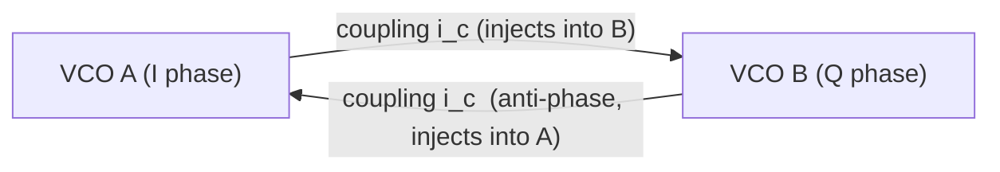

> **β**: This English translation is in beta — the Traditional-Chinese original is the authoritative version.

# Quadrature generation and coupled-oscillator phase noise

> **Where this page sits (up front)**: this is an **advanced** design page. It takes the need every
> SerDes/transceiver designer faces daily — generating a clock pair with a
> $90^\circ$ phase offset (**quadrature**, i.e. I/Q) — and explains it inside this site's existing
> **ISF + generalized Adler** machinery. **Prerequisites**: first understand
> the ISF of [P1] ([isf_definition](/03_isf_core_theory/isf_definition), [effective_isf](/03_isf_core_theory/effective_isf)),
> the generalized-Adler injection locking of [P3] ([paper_003](/05_paper_deep_dives/paper_003_injection_locking_part1)),
> and the ILFD / frequency division of [P4] ([paper_004](/05_paper_deep_dives/paper_004_injection_locking_part2)).
> Without those three pages, the equations here will look like they appear out of nowhere.

**Quadrature (a pair of signals I and Q with a $90^\circ$ phase offset)** is a basic building block of
modern transceivers: image-reject mixers, single-sideband modulation, 4-phase sampling in half-rate
SerDes, phase detection in CDRs — all of them need a clean I/Q pair with small phase error. The
problem: **generating quadrature itself carries a phase-noise cost**, and the cost structure differs
completely between generation methods. This page answers:

> **What this page answers**: (1) What does the **phase-noise cost** of each of the three mainstream
> quadrature generation methods look like?
> (2) In a coupled QVCO (coupled quadrature VCO), why is **coupling strength ↔ I/Q phase error
> ↔ phase noise** a triangular trade-off? (3) For the coupled oscillator pair,
> is their noise **common-mode or differential-mode correlated**, and how does that determine the famous
> **$\sim 3$ dB**? (4) How do you **rigorously wire the "coupling injection" back to the ISF / generalized Adler of [P3]**?

> **Physical intuition (conclusion first)**: a coupled QVCO is just "**two oscillators injection-locking
> each other**" — A's output injects into B, B's output injects into A. Once you see it that way, the
> entire [P3] machinery applies immediately: the coupling current $i_{c}$ sees
> an effective ISF $\tilde\Gamma$, "pulls" the other oscillator's phase through the harmonics $c_n$ of
> $\tilde\Gamma$, and the locking dynamics
> obey the generalized Adler equation ([P3] Eq.(30)). The stronger the coupling, the more tightly the two
> phases are bound (smaller phase error), but the coupling
> device also injects extra noise and pulls the frequency away from the tank resonance — that is where the triangular trade-off comes from.

---

## 1. The three quadrature generation methods and their phase-noise costs

Put the three routes side by side first. Each route's "cost" is different; understanding the differences matters more than memorizing conclusions.

### (a) Coupled QVCO (coupled quadrature VCO)

Two identical LC VCOs, with a pair of **coupling transistors** injecting A's output into B and B's
output (inverted) into A, forcing the two to lock at a fixed $90^\circ$ phase offset.

- **How it generates quadrature**: under the constraint "total loop phase $=0$", the coupling arrangement forces the two oscillators to $90^\circ$ (derivation in Section 4; this is the steady-state solution of the [P3] generalized Adler equation in the "mutual injection" case).
- **Phase-noise cost**: in theory it **can be better than a single oscillator** — differential/anti-phase
  coupling of two identical VCOs averages out the **uncorrelated**
  noise portion (a potential $\sim 3$ dB benefit, Section 3); but the **coupling device's own noise**
  gets in, and
  strong coupling pulls the frequency off the tank peak, lowering the effective $Q$ and raising phase noise instead. **Whether the net is a gain or a loss depends on the coupling strength**
  (the triangular trade-off of Section 2).

### (b) Divide-by-2 (÷2) from a $2f_0$ source (ILFD / static divider)

Run a $2f_0$ oscillator, then divide by 2. A master-slave flip-flop divider natively outputs two clocks
$90^\circ$ apart
(because $\div 2$ maps one input period onto an output half-period $=90^\circ$); or use an **ILFD (injection-locked
frequency divider)** — inject $2f_0$ into an $f_0$ oscillator and lock via the **2nd harmonic** of the ISF
down to $f_0$ (this is exactly the ILFD of
[paper_004](/05_paper_deep_dives/paper_004_injection_locking_part2),
subharmonic locking). The full lock-range derivation ($\omega_L=I_{inj}\vert\tilde\Gamma_N\vert/2$) and
the "half-wave symmetry can't divide by 2" payoff have their own page:
[injection_locked_division](/06_design_insights/injection_locked_division).

- **How it generates quadrature**: the two complementary outputs of the $\div 2$ (or the four nodes of a differential ÷2) are naturally $90^\circ$ apart;
  **quadrature accuracy is set by circuit symmetry, independent of tank detuning** — its biggest advantage over the QVCO.
- **Phase-noise cost**: **an ideal $\div N$ improves phase noise by $20\log_{10}N$ dB**. Reason: division divides the phase by
  $N$, so the phase error is divided by $N$ too, and the phase power ($\propto\phi^2$) by $N^2$:

$$
\mathcal{L}_{out}(\Delta f)=\mathcal{L}_{2f_0}(\Delta f)-20\log_{10}N
$$

  For $\div 2$ that is $-20\log_{10}2=-6.02$ dB. **But** this only accounts for the "source" noise; you still have to **build a clean
  $2f_0$ oscillator first** (high-frequency VCOs usually have lower $Q$, smaller $q_{max}$, and are inherently noisier), and the divider (especially a CML
  latch) adds its own noise floor. **The net benefit is the "$-6$ dB improvement" minus "the noisier $2f_0$ source + divider noise"**.
  This formula is a standard frequency-synthesis result (**external literature, not among the five source PDFs**), but its physical basis — the phase being divided by $N$ —
  is consistent with this site's [P1] phase definition; the ILFD locking mechanism is the subharmonic injection locking of [P4].

> **Dimension / order-of-magnitude check**: if a $2f_0=10$ GHz source has $\mathcal{L}(1\text{MHz})=-110$ dBc/Hz,
> an ideal $\div 2$ gives $5$ GHz, $\mathcal{L}=-116$ dBc/Hz. But if that 10 GHz VCO's $\Gamma_{rms}/q_{max}$
> is more than 6 dB worse than a VCO built directly at 5 GHz, the $\div 2$ gains nothing — a common practical trap.

### (c) RC-CR polyphase filter

Purely passive: an RC low-pass on one path (phase $-45^\circ$), a CR high-pass on the other (phase $+45^\circ$); at
$\omega=1/RC$ the two paths differ by $90^\circ$. Cascading multiple stages (polyphase) widens the bandwidth.

- **How it generates quadrature**: passive phase shift, $90^\circ$ set by $R$, $C$ matching; no second oscillator needed.
- **Phase-noise cost**: **a passive network generates no new phase noise** (in theory), but it has two costs: (1)
  **insertion loss** — each RC-CR stage attenuates $\sim 3$ dB, requiring a buffer stage whose
  thermal noise becomes **additive noise** (degrading SNR, raising the far-out noise floor); (2)
  **quadrature accuracy is sensitive to the absolute values of $R$, $C$ and to frequency** — off $1/RC$ you get I/Q phase and amplitude error, requiring multiple stages
  and calibration. It **does not change the close-in $1/f^2$, $1/f^3$ phase noise** (that is set by the PLL/VCO),
  only raising the **far-out** floor slightly via buffer additive noise.

### The three methods compared

| Dimension | coupled QVCO | $\div 2$ (ILFD/static) | RC-CR polyphase |
|---|---|---|---|
| Source of quadrature | coupling forces $90^\circ$ | $\div 2$ natively $90^\circ$ | passive phase shift $\pm45^\circ$ |
| What sets quadrature accuracy | tank detuning + coupling symmetry | circuit symmetry (**independent of detuning**) | $R,C$ matching + frequency |
| Close-in PN | can beat or lose to a single VCO (depends on coupling) | $-20\log_{10}N$ (**minus the noisier source**) | unchanged (VCO-determined) |
| Extra noise sources | coupling device | high-frequency source + divider | buffer additive noise |
| Main trap | strong coupling pulls frequency, drops $Q$ | $2f_0$ source inherently noisier | insertion loss + narrow bandwidth |
| Link back to this site's machinery | [P3] generalized Adler (Section 4) | [P4] ILFD (subharmonic) | purely linear network (no ISF involved) |

> The **qualitative comparison and design trade-offs** of the three methods are oscillator-design common knowledge (**external literature, not among the five source PDFs**; standard references such as
> Razavi's transceiver texts, Behbahani polyphase 1999). The ILFD locking dynamics and the $\div 2$ subharmonic
> injection mechanism belong **strictly to [P4]** (see [paper_004](/05_paper_deep_dives/paper_004_injection_locking_part2));
> the $20\log_{10}N$ improvement of $\div N$ is a standard frequency-synthesis result.

---

## 2. Coupled QVCO: coupling strength ↔ I/Q phase error ↔ phase noise

This is the **core triangular trade-off** of QVCO design. Define the coupling strength first, then show how the three quantities pull against each other.

### Definition of the coupling strength $m$

Let each VCO's core (−$G_m$) transconductance sustain its own oscillation, providing current $I_{core}$; the coupling transistors inject the other oscillator's signal
into this one with injection-current amplitude $I_{c}$. Define the **coupling factor**

$$
m\equiv\frac{I_{c}}{I_{core}}
$$

$m$ is the dimensionless "how strong the coupling is relative to the core". As $m\to 0$ the two decouple and run independently; large $m$ binds them tightly.

### How the three pull against each other (physics)

**(i) coupling ↑ → I/Q phase error ↓**: the coupling provides the restoring force that pulls the pair back to $90^\circ$. Any mismatch
that makes the two free-running frequencies differ (process variation in $L$, $C$, $g_m$) tries to push the phase offset away from $90^\circ$;
the stronger the coupling, the larger the restoring force and the smaller the residual phase error. Intuition and order of magnitude (**external literature, standard QVCO result**):

$$
\Delta\phi_{IQ}\ \approx\ \frac{Q}{m}\,\frac{\Delta\omega_0}{\omega_0}\quad\text{(order of magnitude; stronger coupling }m\text{ shrinks the error; larger }Q\text{ enlarges it)}
$$

where $\Delta\omega_0/\omega_0$ is the relative detuning of the two tanks (caused by mismatch). An equivalent form is $\Delta\phi_{IQ}\approx\Delta\omega_0/\omega_L$,
where $\omega_L=\dfrac{m\,\omega_0}{2Q}$ is the Adler lock range of the mutual injection (the [P3] Eq.(35) form; external QVCO literature).
Intuition: stronger coupling (large $m$) widens the lock range and strengthens the restoring force, so the residual I/Q error shrinks; but a sharper tank (large $Q$)
makes the lock range **narrower**, so the same mismatch is **harder** to pull back to $90^\circ$ and the I/Q phase error is **larger**.

> **Numerical example (order of magnitude)**: take $m=0.3$, $Q=10$, tank mismatch $\Delta\omega_0/\omega_0=0.1\%$; then
> $$
> \Delta\phi_{IQ}\approx\frac{Q}{m}\,\frac{\Delta\omega_0}{\omega_0}=\frac{10}{0.3}\times0.001\approx0.033\ \text{rad}\approx1.9^\circ.
> $$
> That is, for a sharp high-$Q$ ($Q=10$) tank, even with mismatch squeezed to $0.1\%$, coupling of $m\sim0.3$ only brings the I/Q error
> down to about $1.9^\circ$; to go smaller you must **strengthen the coupling** (larger $m$) or **reduce the mismatch** (smaller $\Delta\omega_0/\omega_0$).
> Unit check: $\dfrac{(\text{dimensionless})}{(\text{dimensionless})}\times(\text{dimensionless})=$ dimensionless $=$ rad ✓.
> Conversely, to get within $0.5^\circ\approx8.7\times10^{-3}$ rad (same $\Delta\omega_0/\omega_0=0.1\%$), you need $Q/m\lesssim 8.7$,
> i.e. $m\gtrsim Q/8.7\approx1.15$ — for a $Q=10$ tank that means quite strong coupling, which is exactly the quantitative bound behind "high-$Q$ QVCOs are hungrier for coupling strength".

**(ii) coupling ↑ → phase noise ↑ (two mechanisms)**:

- **The coupling device injects its own noise**: like the core devices, the coupling transistors have thermal/flicker noise; it **hits the
  tank node directly**, sees an effective ISF, and contributes extra phase noise (quantified via the ISF in Section 4). The stronger the coupling (larger coupling
  device, larger current), the larger this noise.
- **The coupling pulls the oscillation frequency off the tank peak, lowering the effective $Q$**: the coupling injection is a current **out of phase** with the tank voltage,
  so the oscillator must shift away from the tank resonance to keep the total loop phase $=0$ (this is the steady state of injection pulling). Off resonance
  → the tank's phase slope at the operating frequency (i.e. the effective $Q$) shrinks → by Leeson/ISF, phase noise $\propto 1/Q^2$
  rises. **This is the main phase-noise penalty of a strongly coupled QVCO**.

**(iii) net trade-off**: so QVCO design is finding the sweet spot between "**coupling strong enough to suppress I/Q phase error**" and "**coupling so strong it
raises phase noise**". Practical experience (**external literature**): there is an optimum $m$ (typically of order $m\sim 0.2\!-\!0.5$,
topology-dependent); too small and the I/Q error and unlock risk grow, too large and the effective-$Q$ degradation dominates the phase noise.

### Parallel vs series coupling (the two hookups)

| | **parallel coupling** | **series coupling** |
|---|---|---|
| How the coupling device connects | **in parallel** with the core −$G_m$ device at the tank node | **in series** between the core device and the tail |
| Current allocation | coupling and core **compete for the same tank-node current** | coupling current flows through the core, **sharing the bias current** |
| Phase-noise intuition | coupling device adds noise directly; larger frequency pulling | coupling burns no extra current, smaller frequency pulling → generally **better PN** |
| Cost | noisier but simpler to design | tighter headroom, harder to design |

> **Series coupling usually has better phase noise**: it opens no extra noisy current branch into the tank, has smaller frequency
> pulling, and preserves more of the effective $Q$. This is one of the core conclusions of the QVCO literature (**external literature, not among the five source PDFs**;
> standard references such as the Andreani QVCO series, Romanò *parallel vs series QVCO*). This site does not redraw their schematics.

> **Design knobs (coupled QVCO)**:
> 1. **Coupling strength $m$**: trade I/Q error (wants large $m$) against phase noise (wants small $m$) → pick the optimum in between.
> 2. **Coupling hookup**: series generally beats parallel (smaller frequency pulling, no extra current).
> 3. **Reduce coupling-device noise**: use large-size, low-$g_m$ / low-flicker coupling transistors to cut the $\Gamma_{rms}$ they inject.
> 4. **Reduce mismatch**: good layout, common-centroid → smaller I/Q error at the same $m$, allowing weaker coupling.

---

## 3. Noise correlation: common-mode vs differential-mode and the ~3 dB

A QVCO is "two identical oscillators", so you must distinguish **which noise is correlated between the two and which is not** — that determines whether
the famous $\sim 3$ dB is a gain or a loss.

### Bookkeeping of the two noise types

Think of the second oscillator (Q) as a "replica" of the first (I). For the phase-noise power of each of the I/Q paths:

- **Differential-mode / uncorrelated noise** (each VCO core device's own thermal noise, **independent** between the two):
  the phase noise of the two is **uncorrelated**. When you **bind the two strongly into one oscillating system**, the output phase is set **jointly** by both
  — two uncorrelated power contributions average, and the output phase noise is $\sim 3$ dB ($10\log_{10}2$) lower than a **single** oscillator. This is the
  QVCO's theoretical "two oscillators buy 3 dB" benefit.

$$
\mathcal{L}_{QVCO}\ \approx\ \mathcal{L}_{single}-10\log_{10}2\ =\ \mathcal{L}_{single}-3.01\ \text{dB}\quad\text{(uncorrelated core noise only)}
$$

- **Common-mode / correlated noise** (noise hitting both oscillators simultaneously, or shared by the coupling path — e.g. shared tail, shared bias,
  coupling devices): the perturbations on the two are **fully correlated**, and averaging does **not** reduce it — correlated power gets no $\sqrt{N}$ averaging.
  This noise **cancels part of the 3 dB benefit**.

### How to do the accounting (key caveat)

> **The honest version of the $\sim 3$ dB**: "two oscillators → $-3$ dB" holds only for **uncorrelated** noise, and **only if the coupling devices introduce no
> significant correlated noise and do not drag down the effective $Q$**. In practice:
> 1. Uncorrelated thermal noise of the core devices: enjoys $-3$ dB ✓.
> 2. Noise injected by the coupling devices: it is **added**, and often **correlated** (shared coupling path) → cancels part of the benefit.
> 3. Effective $Q$ reduced by coupling-induced frequency pulling: phase noise $\propto 1/Q^2$ rises → eats some more.
>
> **So a real QVCO is not necessarily 3 dB better than a single oscillator — often only 1–2 dB, and under strong coupling even worse**. The $\sim 3$ dB is the
> **upper bound** of "averaging two uncorrelated sources", not a guaranteed value (**external literature, not among the five source PDFs**).

> **Accounting mnemonic**: **correlated ↔ amplitudes add (total power $\propto N^2$, no reduction relative to a single source) → no averaging benefit;
> uncorrelated ↔ powers add (total power $\propto N$) → enjoys $-10\log_{10}N$.** This is the same correlation-accounting logic as the Section 1 $\div N$ improvement of $20\log_{10}N$ (phase divided by $N$, a
> deterministic correlated scaling) — two faces of one bookkeeping rule.

---

## 4. Wiring the coupling injection back to the ISF / generalized Adler ([P3])

This is the mathematical core of the page: **the locking dynamics of a coupled QVCO are just the [P3] generalized Adler equation applied to "mutual injection"**.
We invent no new theory; we use the equations of this site's
[paper_003](/05_paper_deep_dives/paper_003_injection_locking_part1) directly.

### Step 1: the effective ISF seen by the coupling current

The coupling current $i_{c}(t)$ injected from A into B, like any injection current, drives B's phase through the **unit-bearing ISF**
$\tilde\Gamma(x)=\Gamma(x)/q_{max}$ (units rad/C, [P3] Eq.(26), p.2113). In other words,
the coupling injection is **nothing special** — it sees B's effective $\tilde\Gamma$ at the injection node, and "receives" the other oscillator's signal through
the Fourier harmonics $c_n$ of $\tilde\Gamma$ ([P1] Eq.(12)): the better the harmonic alignment, the more effective the coupling
(locking).

The coupling device's own noise $i_{c,n}(t)$ travels the **same** $\tilde\Gamma$, so its phase-noise contribution follows
the [P1] recipe: $\mathcal{L}\propto\Gamma_{rms}^2/q_{max}^2$ ([P1] Eq.(21), p.185, with $\Gamma$ replaced by the effective ISF seen by the coupling
injection). **This is the quantitative outlet for Section 2's "the coupling device injects extra noise"**.

### Step 2: generalized Adler for mutual injection

Now write B's injection into A as well. For oscillator A, the relative phase $\theta_A=\phi_A-\phi_{ref}$ obeys **the time-averaged
generalized Adler equation of [P3]** ([P3] Eq.(30), p.2113, with a **plus sign** in front of the averaged term):

$$
\frac{d\theta_A}{dt}=(\omega_{0,A}-\omega_{ref})+\frac{1}{T}\int_{T}\tilde\Gamma\big(\omega_{ref}t+\theta_A\big)\,i_{c,B\to A}(t)\,dt
$$

where $i_{c,B\to A}$ is the coupling current B injects into A (proportional to B's output $\propto\cos(\omega_{ref}t+\theta_B)$).
Write the symmetric equation for B. **Key point**: a coupled QVCO is nothing but **two such Adler equations coupled to each other** —
$\theta_B$ appears in A's equation and $\theta_A$ in B's. Rearranged into the **lock characteristic** form of [P3]
([P3] Eq.(33), p.2114):

$$
\frac{d\theta_A}{dt}=(\omega_{0,A}-\omega_{ref})+\Omega(\theta_A-\theta_B)
$$

$\Omega(\cdot)$ is the coupling-induced average frequency shift as a function of the **relative phase difference** (the stronger the coupling, the wider the range of $\Omega$,
the firmer the lock).

### Step 3: steady-state solution → why $90^\circ$

The QVCO's coupling arrangement (A injects into B in phase, B injects into A **inverted**, differing by a minus sign) means that in steady state
($d\theta_A/dt=d\theta_B/dt=0$, both at the same frequency), the two Adler equations are self-consistent **only at the phase difference**

$$
\theta_A-\theta_B=\pm 90^\circ
$$

— the plus or minus sign (I leading or lagging Q) is one of two symmetric stable solutions, decided at start-up. **The $90^\circ$ is not
patched in; it is the steady-state constraint of the mutually injecting Adler equations**. Any tank detuning ($\omega_{0,A}\ne\omega_{0,B}$) nudges this
$90^\circ$ off a little, and how much is resisted by the slope of $\Omega$ (i.e. the coupling strength) — this is exactly the differential-equation version of Section 2's
$\Delta\phi_{IQ}\propto Q/m$.

> **Order-of-magnitude / dimension check**: $\Omega(\theta)$ has the same units as $(\omega_0-\omega_{ref})$, rad/s ✓.
> Strong coupling → wide range of $\Omega$ → the same detuning $(\omega_{0,A}-\omega_{0,B})$ needs only a tiny phase shift to be
> compensated by $\Omega(\theta_A-\theta_B)$ → small I/Q error. Weak coupling → narrow $\Omega$ → once the detuning grows there is no solution (unlock:
> the two no longer share a frequency, the phase slips periodically — exactly the injection **pulling** of [P3]).

### Step 4: stitching the three pieces into one picture

| Design phenomenon (Sections 2, 3) | Corresponding [P3] / ISF quantity |
|---|---|
| Coupling strength $m$ | width of the range of $\Omega(\theta)$ (= lock range; [P3] Eq.(33)) |
| I/Q phase error vs mismatch | detuning divided by the slope of $\Omega$ (strong coupling → steep slope → small error) |
| Extra phase noise from the coupling device | effective $\Gamma_{rms}$ seen by the coupling injection, via [P1] Eq.(21) |
| Strong coupling pulls frequency, drops $Q$ | steady state $\theta^\*\ne 0$ → operating frequency off the tank peak |
| $90^\circ$ appears naturally | steady-state constraint of the anti-phase mutually injecting Adler equations |

**One sentence**: a coupled QVCO = two oscillators locking each other via the generalized Adler of [P3]; the coupling current travels
the ISF of [P1], so "locking (quadrature)" and "extra phase noise" are **two faces of the same $\tilde\Gamma$**
— fully consistent with [P3]'s point that "the same ISF accounts for both phase noise and injection locking".

---

## Validity and failure conditions

| Condition | When it holds | What happens when it fails |
|---|---|---|
| Weak-to-moderate coupling, phase linearity | generalized Adler ([P3] Eq.(30)) holds, $90^\circ$ steady-state solution exists | strong coupling → amplitude modulation (needs the APF of [P4]), the ISF itself is altered |
| Two nearly identical VCOs, small mismatch | I/Q error $\propto Q/m$, the $\sim 3$ dB bound is approachable | large mismatch → large I/Q error, even unlock (pulling) |
| Coupling-device noise / correlation negligible | $-3$ dB (averaging of uncorrelated core noise) holds | correlated coupling/shared noise → cancels the 3 dB, possibly worse |
| Operating frequency still near the tank peak | effective $Q$ preserved, PN not penalized by $1/Q^2$ | strong coupling pulls frequency → effective $Q$ drops, close-in PN rises |
| Clean $\div 2$ source | the $-20\log_{10}N$ improvement is a net gain | $2f_0$ source too noisy / divider noise → the improvement is eaten up |

---

## Key takeaways

- **The three quadrature generation methods have different cost structures**: the coupled QVCO pays with coupling-device noise + pulling-induced $Q$ drop (net value depends on coupling strength);
  $\div 2$ (ILFD) ideally improves by $-20\log_{10}N$ but needs a clean $2f_0$ source first; RC-CR polyphase generates no new close-in PN,
  paying instead with insertion loss + buffer additive noise + narrow bandwidth.
- **The coupled-QVCO triangular trade-off**: coupling ↑ → I/Q phase error ↓ (stronger restoring force), but phase noise ↑ (coupling device injects noise +
  pulling drops the effective $Q$) → an optimum coupling strength $m$ exists. **Series coupling generally beats parallel** (smaller frequency pulling, no extra current).
- **The $\sim 3$ dB is an upper bound, not a guarantee**: only the **uncorrelated** core-device noise enjoys $-10\log_{10}2$; coupling/shared noise is **correlated**,
  canceling part of the benefit; the pulling-induced $Q$ drop eats some more → real QVCOs are often only 1–2 dB better, and under strong coupling even worse.
- **Wiring back to [P3]**: coupled QVCO = two mutually injecting **generalized Adler equations** ([P3] Eq.(30), p.2113); the coupling current travels the
  unit-bearing ISF $\tilde\Gamma=\Gamma/q_{max}$ ([P3] Eq.(26)); the $90^\circ$ is the steady-state constraint of anti-phase mutual injection;
  the lock range = the range of $\Omega(\theta)$ ([P3] Eq.(33)). Locking and extra phase noise are two faces of the same $\tilde\Gamma$.
- **Honesty note**: the QVCO topology comparison, the $\Delta\phi_{IQ}$ order-of-magnitude formula, the $\sim 3$ dB, and the parallel/series conclusion are all
  **external literature (not among the five source PDFs)**; the locking dynamics are strictly tied to [P3], and the $\div 2$/ILFD subharmonic mechanism strictly to [P4].

## Further reading

- Generalized Adler / injection locking (source of this page's locking dynamics): [paper_003](/05_paper_deep_dives/paper_003_injection_locking_part1) ([P3] Eq.(30))
- ILFD / frequency division / subharmonic locking (the $\div 2$ route): [paper_004](/05_paper_deep_dives/paper_004_injection_locking_part2)
- How quadrature is used in SerDes (half-rate sampling, CDR phase detection): [serdes_clocking_connection](/06_design_insights/serdes_clocking_connection)
- Effective ISF $\Gamma_{eff}=\Gamma\cdot\alpha$ (the ISF seen by the coupling injection): [effective_isf](/03_isf_core_theory/effective_isf)
- ISF of real topologies (tank/tail noise of the cross-coupled LC VCO): [real_oscillator_topologies](/06_design_insights/real_oscillator_topologies)
- Geometry of phase vs amplitude noise (why strong coupling requires looking at amplitude): [phase_vs_amplitude_noise](/02_foundations/phase_vs_amplitude_noise)

## External literature (not in the five downloaded PDFs)

- **[E-Andreani-QVCO]** P. Andreani, A. Bonfanti, L. Romanò, C. Samori, *"Analysis and Design of a 1.8-GHz
  CMOS LC Quadrature VCO,"* IEEE J. Solid-State Circuits, vol. 37, no. 12, pp. 1737–1747, Dec. 2002.
  (Authoritative analysis of the QVCO coupling-strength vs phase-noise vs I/Q-error triangular trade-off; basis of Sections 2 and 3 of this page.
  Volume/issue/pages verified.)
- **[E-Romano-QVCO]** L. Romanò, S. Levantino, C. Samori, A. L. Lacaita, *"Multiphase LC Oscillators,"*
  IEEE Trans. Circuits Syst. I, vol. 53, no. 7, pp. 1579–1588, Jul. 2006 (and the related parallel-vs-series
  QVCO literature). (Basis of the parallel vs series coupling phase-noise comparison. Volume/issue/pages verified.)
- **[E-Behbahani-PPF]** F. Behbahani, Y. Kishigami, J. Leete, A. A. Abidi, *"CMOS Mixers and Polyphase
  Filters for Large Image Rejection,"* IEEE JSSC, vol. 36, no. 6, pp. 873–887, Jun. 2001.
  (Basis of the RC-CR polyphase filter design and insertion-loss/bandwidth trade-off. Volume/issue/pages verified.)
- **$\div N$ improvement of $20\log_{10}N$ dB**: standard frequency-synthesis result (see any PLL / frequency-synthesis text,
  e.g. Razavi *RF Microelectronics*). **Not in the five PDFs**; its physical basis (phase divided by $N$) is consistent with this site's [P1]
  phase definition.
