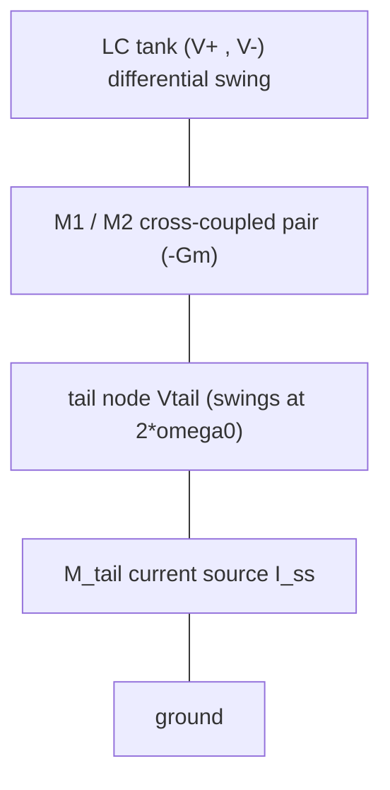
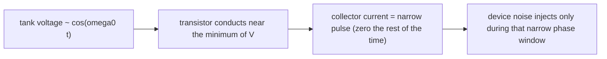

> **β**: This English translation is in beta — the Traditional-Chinese original is the authoritative version.

# ISF in real topologies: cross-coupled LC VCO, Colpitts, CMOS ring stage

> **Prerequisites**: [effective_isf](/03_isf_core_theory/effective_isf) (cyclostationary effective ISF $\Gamma_{eff}=\Gamma\cdot\alpha$, the common skeleton for all three topologies on this page), [symmetry](/06_design_insights/symmetry) ($c_0$ sets $1/f^3$; why the tail's $c_0$ is the real trouble), [waveform_slope](/06_design_insights/waveform_slope) (deriving the ring stage's ISF from switching slope) | **Next**: [lc_vs_ring](/06_design_insights/lc_vs_ring), [measurement_and_spurs](/06_design_insights/measurement_and_spurs)

The preceding pages all used the ideal-LC $\Gamma(\theta)=-\sin\theta$ as the lead character to lay out the mechanism white noise → $1/f^2$, flicker → $1/f^3$. But a real oscillator on silicon **is not a clean LC plus a single white-noise source** — it is several transistors, a tail (bias) current source, a tank, plus switching action. **Different devices inject their noise at different nodes and different phase windows**, so every noise source "sees" a different effective ISF. This page answers:

> **What this page answers**: in three of the most common topologies — the **cross-coupled LC VCO**, **Colpitts**, and the **CMOS inverter ring stage** — what does the ISF **actually seen by each device-noise source** look like? Where do its Fourier harmonics ($c_0,c_1,c_2,\dots$) land? And how do those harmonics set the close-in $1/f^3$ and $1/f^2$? We walk all of this by **hand calculation plus order-of-magnitude estimation** (not Spectre / not transistor-level netlist extraction), stringing device noise → ISF harmonics → close-in PN into one complete chain for each topology.

> **Physical intuition (conclusion first)**: the ISF is "the shape of phase sensitivity to charge injected at some node." But **the noise source does not inject uniformly over the whole cycle** — the tail transistor only conducts during the switching instant, the Colpitts transistor only conducts during one narrow current pulse, and a ring's inverter only carries large current during transition. Multiplying "how much noise the device injects, and in which phase window" (i.e., the cyclostationary noise modulating function $\alpha(\theta)$) by "that node's ISF $\Gamma(\theta)$" gives the **effective ISF** $\Gamma_{eff}(\theta)=\Gamma(\theta)\,\alpha(\theta)$. The Fourier harmonics of this product — especially **$c_0$ (which sets flicker upconversion to $1/f^3$) and $c_2$ (which folds noise near $2\omega_0$ back onto the carrier)** — are what actually drive real close-in phase noise.

This page uses two signature close-in formulas from [P1] (verified verbatim):

Flicker upconversion to $1/f^3$ ([P1] Eq.(23), p.185):

$$
\mathcal{L}\{\Delta\omega\}=10\log_{10}\!\left(\frac{c_0^2}{q_{max}^2}\cdot\frac{\overline{i_n^2}/\Delta f}{8\,\Delta\omega^2}\cdot\frac{\omega_{1/f}}{\Delta\omega}\right)
$$

$1/f^3$ corner ([P1] Eq.(24), p.185):

$$
\Delta\omega_{1/f^3}=\omega_{1/f}\cdot\frac{c_0^2}{2\,\Gamma_{rms}^2}\approx\omega_{1/f}\left(\frac{c_0}{c_1}\right)^2
$$

The white-noise $1/f^2$ signature result ([P1] Eq.(21), p.185), used here to compute the floor:

$$
\mathcal{L}\{\Delta\omega\}=10\log_{10}\!\left(\frac{\Gamma_{rms}^2}{q_{max}^2}\cdot\frac{\overline{i_n^2}/\Delta f}{4\,\Delta\omega^2}\right)
$$

The cyclostationary effective ISF ([P1] Eq.(27), p.186 — replace $\Gamma$ with $\Gamma_{eff}=\Gamma\cdot\alpha$, where $\alpha$ is the noise modulating function, an amplitude-modulation function):

$$
\Gamma_{eff}(x)=\Gamma(x)\,\alpha(x),\qquad \alpha(x)\in[0,1]
$$

> Wherever a numeric $c_n$ value is marked *illustrative*, it is a **pedagogical constructed model** (not extracted from a transistor netlist), whose purpose is to walk through the order of magnitude of a **known mechanism**; the ideal-LC $\Gamma=-\sin$ is exact. The specific mechanism behind the tail's effective ISF comes from the Hajimiri–Lee cyclostationary analysis ([P1] §IV.D) and from Andreani et al.'s tail-noise analysis (**external literature, not among the five source PDFs** — see end of page).

---

## (a) Cross-coupled LC VCO: clean tank, troublesome tail

### Circuit and the two key noise sources

The skeleton of a cross-coupled LC VCO: an LC tank across the two differential nodes $V^+,V^-$; below it, a cross-coupled NMOS pair ($M_1,M_2$, gates tied to each other's drains) supplies $-G_m$ (negative conductance) to compensate tank loss; at the bottom, a **tail current source** $M_{tail}$ sets the bias current $I_{ss}$.



Two fundamentally different noise-injection points:

1. **The differential tank nodes** ($M_1,M_2$'s channel thermal noise lands directly on the tank) → sees the **tank's ISF**.
2. **The tail node** ($M_{tail}$'s thermal + flicker noise) → sees the **tail's effective ISF**, because the tail current must first be "commutated" by the switching pair before it reaches the tank.

### Tank ISF: pure $c_1$, a $-\sin\theta$

The differential tank is a near-ideal LC resonator, with the two terminal voltages approximately $V^\pm=\pm A\cos\omega_0 t$. Injecting charge into the differential node gives the ideal-LC phase-sensitivity result (see [impulse_to_phase_shift](/03_isf_core_theory/impulse_to_phase_shift)):

$$
\Gamma_{tank}(\theta)=-\sin\theta .
$$

Its Fourier series has **only one term, $c_1=1$**, with all other $c_0=c_2=\dots=0$. $\Gamma_{rms}=1/\sqrt2\approx0.707$.

- **Physical meaning**: $-\sin\theta$ is most sensitive at the zero crossings ($\theta=0,\pi$) and zero at the peaks ($\theta=\pi/2$) — the classic "a kick is most effective where the slope is steepest."
- **Key benefit**: $c_0=0$. From [P1] Eq.(23), $1/f^3$ strength is proportional to $c_0^2$; $c_0=0$ means **differential tank noise barely upconverts flicker at all**. This is why a differential LC VCO's close-in phase noise is cleaner than a ring's — provided the waveform is symmetric so $c_0$ stays near 0.

### The tail's effective ISF: rich in $c_0$ and $c_2$

The story for tail noise is entirely different, because the **tail node voltage swings at $2\omega_0$**, and the switching pair applies **full-wave-rectifier-like commutation** to the tail current. Intuitively:

- On each half cycle, $M_1$ or $M_2$ alternately steers the entire $I_{ss}$ (including its noise) to one side of the tank; over one full RF period the tail current is "flipped" twice → the tail sees a $2\omega_0$-periodic modulation → this naturally produces **$c_2$ (second harmonic)**.
- The tail current's **low-frequency/DC noise** (especially flicker) gets averaged by switching into a common-mode swing, leaving a **nonzero $c_0$** (DC term) — this is the gateway for flicker upconversion.

We write this shape down with an *illustrative* model (taken from `lab_21_topology_isf.py`, marked as a constructed model):

$$
\Gamma_{tail}(\theta)=\frac{c_0}{2}+c_{1,res}\cos\theta+c_2\cos 2\theta,\qquad c_0=0.30,\ c_{1,res}=0.10,\ c_2=0.55 .
$$

- $c_0=0.30$: the DC term — **the culprit behind flicker upconversion** ([P1] Eq.(23) is proportional to $c_0^2$).
- $c_2=0.55$: the second harmonic — folds **tail thermal noise near $2\omega_0$** back onto the carrier at offset $\Delta\omega$.
- $c_{1,res}=0.10$: a residual fundamental (should be 0 under ideal symmetry; asymmetry leaks a little through).
- This ISF's $\Gamma_{rms}=\sqrt{(c_0/2)^2+\tfrac12(c_{1,res}^2+c_2^2)}=\sqrt{0.0225+\tfrac12(0.01+0.3025)}\approx0.42$ (Parseval; see figure caption).

> **Mechanism of the $2\omega_0$ fold-back (hand-calc intuition)**: tail thermal noise carries power $\overline{i_n^2}/\Delta f$ near $2\omega_0\pm\Delta\omega$. The ISF's $c_2\cos2\theta$ term acts as a "mixer that down-converts at $2\omega_0$" (see [white_noise_to_phase_noise](/03_isf_core_theory/white_noise_to_phase_noise), step 3a): it moves noise at $2\omega_0$ to phase at offset $\Delta\omega$. This is exactly why **designers raise the tail current source's impedance at $2f_0$ (a tail filter)**: placing an LC trap or a large capacitor at $2f_0$ makes the tail node high-impedance (ideally open) at $2\omega_0$, so tail noise at $2\omega_0$ can no longer inject into the tank → the $c_2$ fold-back is choked off.

### Figure: tank vs. tail ISF and harmonics


> **Translator's note**: this figure is generated by a script with Chinese text baked into the image. Titles read: "(a) cross-coupled VCO：tank 乾淨、tail 有效 ISF 富含諧波（illustrative）" = (a) cross-coupled VCO: the tank is clean, the tail's effective ISF is harmonic-rich (illustrative); "(b) tail 的 c0（flicker 上轉）與 c2（2ω0 折回）才是麻煩" = (b) it is the tail's c0 (flicker upconversion) and c2 (2ω0 fold-back) that matter.

(Full script: `simulations/lab_21_topology_isf.py`, **marked illustrative** — the tank's $-\sin$ is exact; the tail's $c_0,c_2$ values are a constructed pedagogical model used to demonstrate a known mechanism.)

| Item | Tank ISF | Tail effective ISF |
|---|---|---|
| Formula | $\Gamma=-\sin\theta$ | $\Gamma=\tfrac{c_0}{2}+c_{1,res}\cos\theta+c_2\cos2\theta$ |
| Dominant harmonics | $c_1=1$ (pure fundamental) | $c_0=0.30$, $c_2=0.55$, $c_{1,res}=0.10$ |
| $\Gamma_{rms}$ | $0.707$ | $\approx0.42$ (illustrative) |
| Close-in risk | Almost no $1/f^3$ ($c_0\approx0$) | Large $c_0$ → strong $1/f^3$; large $c_2$ → $2\omega_0$ fold-back |
| Countermeasure | Maintain waveform symmetry | Waveform symmetry lowers $c_0$ + **tail filter tuned to $2f_0$** lowers $c_2$ |
| Model | Exact (ideal LC) | Illustrative (constructed) |

### Device noise → ISF harmonics → close-in PN: the tail's full chain (worked example 1)

> **Example 1 (tail flicker upconversion → $1/f^3$ corner, by hand)**: cross-coupled LC VCO, $f_0=5$ GHz, $q_{max}=1$ pC. The tail's effective ISF uses the illustrative model above ($c_0=0.30$, $\Gamma_{rms}\approx0.42$). Tail transistor white noise $S_i=\overline{i_n^2}/\Delta f=2\times10^{-23}\ \text{A}^2/\text{Hz}$, flicker corner $f_{1/f}=1$ MHz ($\omega_{1/f}=2\pi\times10^6$ rad/s). Find the $1/f^3$ corner $\Delta\omega_{1/f^3}$, and compute $\mathcal{L}$ at $\Delta f=10$ kHz (in the $1/f^3$ region).

**Chain link 1 (device noise → ISF harmonics)**: the tail's noise sees the effective ISF with $c_0=0.30$.

**Chain link 2 ($1/f^3$ corner, [P1] Eq.(24))**:

$$
\Delta\omega_{1/f^3}=\omega_{1/f}\cdot\frac{c_0^2}{2\,\Gamma_{rms}^2}=2\pi\times10^6\times\frac{0.30^2}{2\times0.42^2}=2\pi\times10^6\times\frac{0.09}{0.353}=2\pi\times10^6\times0.255 .
$$

$$
\Delta\omega_{1/f^3}=1.603\times10^6\ \text{rad/s}\quad\Rightarrow\quad \Delta f_{1/f^3}=\frac{\Delta\omega_{1/f^3}}{2\pi}=2.55\times10^5\ \text{Hz}=255\ \text{kHz}.
$$

- **Meaning**: the $1/f^3$ region extends to about **255 kHz** offset — smaller than the device flicker corner (1 MHz) by a factor $c_0^2/(2\Gamma_{rms}^2)=0.255$. This is exactly [P1]'s key design message — **the $1/f^3$ corner is not the same as the device's $1/f$ corner; it can be substantially shrunk by waveform symmetry (suppressing $c_0$)**.

**Chain link 3 (close-in $\mathcal{L}$, [P1] Eq.(23))**: at $\Delta f=10$ kHz:

1. $\Delta\omega=2\pi\times10^4=6.283\times10^4$ rad/s, $\Delta\omega^2=3.948\times10^9$.
2. $\dfrac{c_0^2}{q_{max}^2}=\dfrac{0.09}{(10^{-12})^2}=9\times10^{22}\ \text{C}^{-2}$.
3. $\dfrac{S_i}{8\Delta\omega^2}=\dfrac{2\times10^{-23}}{8\times3.948\times10^9}=\dfrac{2\times10^{-23}}{3.158\times10^{10}}=6.333\times10^{-34}$.
4. $\dfrac{\omega_{1/f}}{\Delta\omega}=\dfrac{2\pi\times10^6}{2\pi\times10^4}=100$.
5. Linear value inside parentheses $=9\times10^{22}\times6.333\times10^{-34}\times100=5.70\times10^{-9}$.
6. $\mathcal{L}=10\log_{10}(5.70\times10^{-9})=-82.4\ \text{dBc/Hz}$.

**Result**: $\Delta f_{1/f^3}\approx255$ kHz; $\mathcal{L}(10\,\text{kHz})\approx-82.4$ dBc/Hz (in the $1/f^3$ region).

**Dimension check (the bracket in [P1] Eq.(23) must be dimensionless)**: $\dfrac{c_0^2}{q_{max}^2}$ carries $\text{C}^{-2}$; $\dfrac{S_i}{8\Delta\omega^2}$ carries $\dfrac{\text{A}^2/\text{Hz}}{(\text{rad/s})^2}=\text{A}^2\text{s}^3=\text{C}^2\text{s}$; $\omega_{1/f}/\Delta\omega$ is dimensionless. Multiplying gives $\text{C}^{-2}\cdot\text{C}^2\text{s}=\text{s}$ → per-Hz ✓.

```python
import numpy as np
c0, qmax, Si = 0.30, 1e-12, 2e-23
gamma_rms = 0.42
w1f = 2*np.pi*1e6
# 1/f^3 corner (Eq.24)
dw_corner = w1f * c0**2 / (2*gamma_rms**2)
print(round(dw_corner/(2*np.pi)/1e3, 1), "kHz")     # -> 255.1 kHz
# L at 10 kHz (Eq.23)
dw = 2*np.pi*1e4
L = 10*np.log10((c0**2/qmax**2) * (Si/(8*dw**2)) * (w1f/dw))
print(round(L, 1), "dBc/Hz")                          # -> -82.4 dBc/Hz
```

> **Design knobs (cross-coupled LC VCO)**:
> 1. **Waveform symmetry** (matched rise/fall edges) → suppresses $c_0$ → directly shrinks the $1/f^3$ corner (Eq.(24) is proportional to $c_0^2$).
> 2. **Tail filter tuned to $2f_0$** (an LC trap / large capacitor at the tail node) → makes the tail node high-impedance at $2\omega_0$ → suppresses $c_2$ fold-back.
> 3. **Increase $q_{max}$ (tank swing)** → suppresses both $1/f^2$ (Eq.(21)) and $1/f^3$ (Eq.(23)) simultaneously, via the $q_{max}^2$ denominator.
> 4. **Reduce tail flicker** (large tail-device sizing, PMOS tail) → lowers the flicker portion of $S_i$.

---

## (b) Colpitts: why the ISF concentrates in a narrow phase window

### Circuit and current pulse

The Colpitts oscillator forms positive feedback with a single transistor plus a capacitive divider ($C_1,C_2$) and a tank inductor. Its signature feature: **the collector (drain) current is not sinusoidal but a series of narrow, large current pulses followed by a long "quiet" interval**. This is exactly what [P1] Fig. 13 shows — the collector voltage and collector current of the Colpitts oscillator of Fig. 5(a): the current is "a short period of large current followed by a quiet interval" ([P1] §IV.D, p.186).



### Key point: pulse timing vs. ISF shape

Two independent periodic functions are multiplied here:

1. **The tank's own ISF** $\Gamma(\theta)\approx-\sin\theta$ (the Colpitts tank is also near-sinusoidal), spread over the full cycle.
2. **The noise modulating function** $\alpha(\theta)$: the device only conducts — and only injects noise — during the current pulse, so $\alpha(\theta)$ is a **narrow pulse** concentrated at some phase $\theta_p$.

The effective ISF is the product of the two ([P1] Eq.(27)):

$$
\Gamma_{eff}(\theta)=\Gamma(\theta)\,\alpha(\theta).
$$

Because $\alpha(\theta)$ is a narrow pulse, **$\Gamma_{eff}$ is also "windowed" down to a narrow phase interval around $\theta_p$** — this is the mathematical statement of "the Colpitts ISF concentrates in a narrow phase window (the current-pulse injection instant)," corresponding to [P1] Fig. 14 (which plots $\Gamma$, $\Gamma_{eff}$, and $\alpha$ together).

### Why this is good news for Colpitts

[P1] §IV.D's key observation (quoted verbatim): **"The surge of current occurs at the minimum of the voltage across the tank where the ISF is small."** That is, the current pulse lands right at the tank voltage's **minimum** — and $\Gamma=-\sin\theta$ is relatively small there (away from the zero crossings, in the low-sensitivity region). A well-designed Colpitts aligns noise injection **with the phase window where ISF is small**, so even though the device noise is large at that instant, multiplying by a small $\Gamma$ keeps $\Gamma_{eff}$ small; $\Gamma_{eff,rms}$ stays low → close-in phase noise is low.

> **This is one of the core reasons Colpitts phase noise is excellent**: not because its devices are quieter, but because it **aligns the noise-injection instant with the least phase-sensitive window**. Compare [P1] §IV.D: the ring oscillator's misfortune is that "the device current is largest at transition (where the ISF is also largest)" — the two peaks **overlap**, so $\Gamma_{eff}\approx\Gamma$ and cyclostationary effects offer no help — this is one reason ring phase noise is worse.

### Device noise → ISF harmonics → close-in PN: Colpitts' full chain (worked example 2)

> **Example 2 (how a narrow window suppresses $\Gamma_{eff,rms}$, order-of-magnitude by hand)**: Colpitts, tank ISF $\Gamma(\theta)=-\sin\theta$. The device current pulse width is about $\delta=10\%$ of the period (conduction angle $\approx36^\circ$), centered on where the ISF is small (take the representative value of $\Gamma$ within the pulse window as $\lvert\Gamma\rvert_{win}\approx0.3$). Compare $\Gamma_{eff,rms}^2$ for "noise injected uniformly over the full cycle" versus "noise injected only in the narrow window."

**Case A (stationary, uniform over the full cycle)**: $\Gamma_{eff}=\Gamma$,

$$
\Gamma_{eff,rms}^2=\frac{1}{2\pi}\int_0^{2\pi}\sin^2\theta\,d\theta=\frac12=0.5 .
$$

**Case B (cyclostationary, narrow window)**: model $\alpha(\theta)$ as a window of width $2\pi\delta$ and height $1/\delta$ (normalized so the average noise power inside the window is unchanged), located where $\lvert\Gamma\rvert_{win}\approx0.3$. Within the window $\Gamma_{eff}=\Gamma\cdot\alpha$, with mean square:

$$
\Gamma_{eff,rms}^2\approx\frac{1}{2\pi}\int_{window}\big(\Gamma(\theta)\,\alpha(\theta)\big)^2 d\theta\approx \lvert\Gamma\rvert_{win}^2\cdot\frac{1}{\delta}\approx 0.3^2\times\frac{1}{0.1}\times\delta=0.09\times1=0.09 .
$$

(This is an order-of-magnitude approximation: window height $1/\delta$, window width $\delta\cdot2\pi$; after normalization, the average $\Gamma^2$ inside the window is taken as roughly the center value $\lvert\Gamma\rvert_{win}^2=0.09$. An exact value would require numerical integration — here we take only the order of magnitude.)

**Comparison**: $\Gamma_{eff,rms}^2$ drops from $0.5$ to $\approx0.09$, **an improvement of about $7.4$ dB** ($10\log_{10}(0.5/0.09)=7.4$ dB).

**Chain closure (→ close-in PN)**: $\mathcal{L}\propto\Gamma_{eff,rms}^2/q_{max}^2$ ([P1] Eq.(21) with $\Gamma_{rms}$ replaced by $\Gamma_{eff,rms}$), so **aligning noise injection with a small-ISF window directly cuts close-in PN by about 7 dB** — this is the order of magnitude of Colpitts' advantage.

- **Dimension check**: $\Gamma_{eff,rms}^2$ is dimensionless ($\Gamma$ and $\alpha$ are both dimensionless) ✓.
- **Honesty note**: $\delta=10\%$ and $\lvert\Gamma\rvert_{win}=0.3$ are **order-of-magnitude estimates** (not precise values extracted from a netlist); the goal is to demonstrate how "a narrow window aligned with small ISF" suppresses $\Gamma_{eff,rms}$. See [P1] Fig. 14 for the exact curve.

```python
import numpy as np
theta = np.linspace(0, 2*np.pi, 20000, endpoint=False)
gamma = -np.sin(theta)
# Case A: stationary
g2_A = np.mean(gamma**2)                       # ~0.5
# Case B: narrow window alpha aligned with small-ISF region (centered near theta_p ~ 1.5*pi, |Gamma|~0.3 region)
alpha = np.zeros_like(theta)
mask = (theta > 1.40*np.pi) & (theta < 1.50*np.pi)   # ~10% window
alpha[mask] = 1.0/0.05                          # normalized height
g2_B = np.mean((gamma*alpha)**2) * 0.05         # order of magnitude
print(round(g2_A,3), round(g2_B,3))             # ~0.5  vs  ~0.09 order of magnitude
print(round(10*np.log10(g2_A/0.09),1), "dB")    # ~7.4 dB improvement
```

> **Design knobs (Colpitts)**:
> 1. **Align the current pulse with the tank-voltage trough (where ISF is small)** — shrink the conduction angle, adjust bias so the pulse lands in the small-$\Gamma$ phase window.
> 2. **Narrower pulse (smaller conduction angle)** — the narrower the window, the better it avoids the large-ISF zero crossings.
> 3. Unlike cross-coupled: Colpitts is single-ended, single-device, and has no tail-switching $c_2$ fold-back problem, but waveform asymmetry will make $c_0\neq0$ (still watch for flicker upconversion).

---

## (c) CMOS inverter ring stage: deriving the ISF from switching slope

### From transition slope to ISF shape

A ring oscillator is a chain of $N$ CMOS inverter stages in a loop. Each stage's output is "parked" at a rail ($V_{DD}$ or GND) most of the time, flipping rapidly only during the brief **switching transition**. Question: what does this stage's ISF $\Gamma(\theta)$ look like?

**Hand-calc reasoning (slope → sensitivity)**: phase sensitivity $\Gamma$ fundamentally measures "how far the phase is pushed by a kick at this phase." For a threshold-crossing digital stage, **phase = when the edge crosses the threshold**. A small charge $\Delta q$ injected at the node produces a voltage jump $\Delta V=\Delta q/C$, which shifts the edge-crossing instant by

$$
\Delta t=\frac{\Delta V}{\lvert dV/dt\rvert}=\frac{\Delta q}{C\,\lvert dV/dt\rvert},
$$

converting to phase via $\Delta\phi=\omega_0\Delta t$. Comparing with the operational ISF definition $\Delta\phi=\Gamma\,\Delta q/q_{max}$ gives

$$
\Gamma(\theta)\ \propto\ \frac{1}{\lvert dV/dt\rvert}\bigg|_{\theta}\quad\text{(at the phase where the edge crosses the threshold)}.
$$

- **Intuition**: a large $dV/dt$ (steep transition) → the edge instant is shifted very little → local $\Gamma$ is small; but **the edge only exists during the transition** — on the rail ($dV/dt\approx0$), a charge kick just gets "reshaped" by the next stage's threshold and barely shifts the edge timing → $\Gamma\approx0$ on the rail.
- **Conclusion**: a ring stage's ISF is **concentrated in the narrow phase window of the transition**, near zero on the rails. Idealize it as a **triangular toy** shape — peak at the transition, width roughly equal to the fraction of the period the transition occupies.

This agrees with the triangular toy in [lc_vs_ring](/06_design_insights/lc_vs_ring) (`gamma_triangular(theta, n_stages)`, see `simulations/common/isf_utils.py`):

$$
\Gamma_{ring}(\theta)\approx\text{triangular pulse, peak}\sim\frac{1}{\sqrt N},\ \text{width}\sim\frac{1}{N},\ \text{concentrated at the transition}.
$$

Comparison figure (ideal LC's $-\sin$ vs. ring's triangle):


> **Translator's note**: this figure is generated by a script with Chinese text baked into the image. Title reads: "LC vs ring ISF (toy)：敏感度集中在 transition，N 越大 rms 越小" = LC vs. ring ISF (toy): sensitivity concentrates at the transition; the larger N, the smaller the rms.

### Why the transition is both the most sensitive and the noisiest instant

Turning observation (b) around: a ring's device carries its largest current during transition (it must rapidly charge/discharge the node capacitance), so **the noise modulating function $\alpha(\theta)$'s peak also lands at the transition**. And the ISF $\Gamma(\theta)$'s peak **also** lands at the transition (just derived above). The two peaks **overlap** → $\Gamma_{eff}=\Gamma\cdot\alpha$ is barely reduced by windowing ([P1] §IV.D: the ring's $\Gamma$ and $\Gamma_{eff}$ are "almost identical") → cyclostationary effects cannot rescue the ring.

> **This is one of two main reasons ring phase noise is worse** ([P1] states this explicitly): (1) the noise peak overlaps the ISF peak, so cyclostationary effects cannot move noise into an insensitive window; (2) a ring dissipates all its stored energy every cycle (no high-$Q$ tank to store energy). Compare with Colpitts: its pulse aligns with a **small**-ISF region — the two peaks are **offset** — which is why Colpitts is clean.

### Device noise → ISF harmonics → close-in PN: the ring stage's full chain (worked example 3)

> **Example 3 (a ring stage's $\Gamma_{rms}$ and $1/f^2$ floor, order-of-magnitude by hand)**: a 5-stage CMOS ring, $f_0=5$ GHz, $q_{max}=1$ pC, each inverter stage's equivalent white noise $S_i=4\times10^{-23}\ \text{A}^2/\text{Hz}$. Estimate $\Gamma_{rms}$ using the triangular toy, then compute $\mathcal{L}(\Delta f=1\text{MHz})$ in the $1/f^2$ region (single-stage contribution, order of magnitude).

**Chain link 1 (slope → ISF)**: triangular toy, $N=5$. From the [P2] Eq.(16) scaling (see convention §3), $\Gamma_{rms}\propto N^{-3/2}$; for the $N=5$ triangular toy, we take $\Gamma_{rms}\approx0.30$ numerically (toy-level order of magnitude; `gamma_rms(theta, gamma_triangular(theta, 5))` computes to about $0.26$ — this example rounds to $0.30$ for an integer-order estimate).

**Chain link 2 (ISF → close-in PN, [P1] Eq.(21))**: at $\Delta f=1$ MHz:

1. $\Delta\omega=2\pi\times10^6=6.283\times10^6$ rad/s, $\Delta\omega^2=3.948\times10^{13}$.
2. $\dfrac{\Gamma_{rms}^2}{q_{max}^2}=\dfrac{0.30^2}{(10^{-12})^2}=\dfrac{0.09}{10^{-24}}=9\times10^{22}\ \text{C}^{-2}$.
3. $\dfrac{S_i}{4\Delta\omega^2}=\dfrac{4\times10^{-23}}{4\times3.948\times10^{13}}=\dfrac{10^{-23}}{3.948\times10^{13}}=2.533\times10^{-37}$.
4. Linear value inside parentheses $=9\times10^{22}\times2.533\times10^{-37}=2.28\times10^{-14}$.
5. $\mathcal{L}=10\log_{10}(2.28\times10^{-14})=-136.4\ \text{dBc/Hz}$ (single-stage order of magnitude).

**Chain link 3 (summing over stages)**: $N=5$ uncorrelated stages each contribute one share, so total power $\times5$ → $+10\log_{10}5=+7$ dB:

$$
\mathcal{L}_{total}(1\,\text{MHz})\approx-136.4+7.0=-129.4\ \text{dBc/Hz}.
$$

**Result**: single stage $\approx-136$ dBc/Hz; 5-stage total $\approx-129$ dBc/Hz @ 1 MHz (order of magnitude).

- **Intuition**: much worse than (a)'s LC VCO ($\Gamma_{rms}=0.707$, single source $\sim-148$ dBc/Hz) — but note the ring's $\Gamma_{rms}$ has already been suppressed by $N^{-3/2}$; **the real penalty comes from summing over stages plus the lack of tank energy storage** (only the $+7$ dB multi-stage-summing part is demonstrated here).
- **Dimension check**: same as [P1] Eq.(21) — the bracket reduces to $\text{s}$ (per-Hz) ✓.

```python
import numpy as np
import sys, os
sys.path.insert(0, "simulations/common")
from simulations.common.isf_utils import gamma_triangular, gamma_rms
theta = np.linspace(0, 2*np.pi, 4000, endpoint=False)
g_rms = gamma_rms(theta, gamma_triangular(theta, 5))   # computes to ~0.26 (hand calc rounds to integer order 0.30)
qmax, Si = 1e-12, 4e-23
dw = 2*np.pi*1e6
L1 = 10*np.log10((g_rms**2/qmax**2) * (Si/(4*dw**2)))   # single stage
L5 = L1 + 10*np.log10(5)                                 # 5-stage sum
print(round(L1,1), round(L5,1), "dBc/Hz")               # computed ~ -137.7 / -130.7 (hand calc with 0.30 -> -136 / -129)
```

> **Design knobs (CMOS ring stage)**:
> 1. **Steep transition (high slew rate)** → smaller local $\Gamma$, narrower transition window → lowers $\Gamma_{rms}$.
> 2. **More stages $N$** → $\Gamma_{rms}\propto N^{-3/2}$ decreases (but power, area, and per-stage noise summing all increase — needs trade-off).
> 3. **Symmetric rising/falling edges** (NMOS/PMOS matched) → suppresses $c_0$, curbs flicker upconversion (see [symmetry](/06_design_insights/symmetry)).
> 4. A ring has no tank energy storage, and cyclostationary effects offer no help → for the same $q_{max}$, close-in performance is inherently worse than LC.

## (d) Waveform engineering: class-C / class-D / class-F told with the ISF

(a)–(c) were about "in which phase window the device injects, and how large a $\Gamma$ it sees there." The designer actually holds two independent knobs: **change the injection window** (act on $\alpha(\theta)$) and **change the waveform itself** (act on the shape of $\Gamma(\theta)$ and on $q_{max}$). Andreani's class-C / class-D and Staszewski's class-F are the three classic topologies that push each of these knobs to its limit (**all external literature, not among the five source PDFs**; volume / pages / DOI at the end of the page). This section stays at the topology level — no PDK, no transistor-level extraction; every number is produced by `simulations/lab_43_classc_classf_isf.py`.

### (d-1) class-C: moving the Colpitts "pulse lands on an ISF null" into the cross-coupled pair

**Circuit**: the gate bias $V_{bias}$ of the cross-coupled pair is pushed below threshold ($V_{bias}<V_{th}$), and a large tail capacitor hangs on the common-source node (an AC ground, so the tail current can swing widely within a cycle). Each transistor therefore conducts only during the short interval when "its own gate (= the opposite drain) is highest, i.e. **its own drain (tank voltage) is lowest**"; the drain current is a train of narrow pulses — exactly as in the Colpitts of §(b): the pulse lands at a tank-voltage extremum, which is precisely a **null** of $\Gamma=-\sin\theta$ (the same [P1] §IV.D sentence quoted in §(b)).

**First mechanism (injection window aligned with the ISF null)**: with the [P1] Eq.(27) convention ($\alpha=1$ while conducting, $\alpha=0$ while cut off), give each of the two transistors of the differential pair a window of half-width $\phi$ (conduction angle $2\phi$), centred on $\theta=0$ and $\theta=\pi$:

$$
\Gamma_{eff,rms}^2=\frac{1}{2\pi}\left[\int_{-\phi}^{\phi}\sin^2\theta\,d\theta+\int_{\pi-\phi}^{\pi+\phi}\sin^2\theta\,d\theta\right]
=\frac{1}{\pi}\int_{-\phi}^{\phi}\sin^2\theta\,d\theta=\frac{\phi-\sin\phi\cos\phi}{\pi}.
$$

- **Check 1**: $2\phi=180^\circ$ (class-B hard switching, each device conducts half a cycle) → $\Gamma_{eff,rms}^2=\tfrac{\pi/2}{\pi}=\tfrac12$, exactly the stationary value (§(b) case A) ✓.
- **Check 2**: $2\phi=60^\circ$ ($\phi=\pi/6$) → $\dfrac{0.5236-0.5\times0.8660}{\pi}=\dfrac{0.0906}{\pi}=0.0288$,
  i.e. $10\log_{10}(0.5/0.0288)=12.4$ dB below $\tfrac12$ (lab_43 numeric value 0.0288 ✓).
- **Compare the worst alignment** (windows centred on the zero crossings $\theta=\pi/2,3\pi/2$): $\Gamma_{eff,rms}^2=(\phi+\sin\phi\cos\phi)/\pi$,
  which at $60^\circ$ is $0.3045$ — the same narrow window in the wrong phase buys only 2.2 dB. **The narrow window itself is not the point; the narrow window aligned with the null is.**
- **Dimension check**: $\phi$ is in rad and $\sin\phi\cos\phi$ is dimensionless, so the two are commensurate and can be subtracted; after dividing by $\pi$ the result is dimensionless ✓.

> **Honesty note (geometric window factor ≠ full $F$ bookkeeping)**: the expression above assumes "the noise density while conducting does not change with the conduction angle." In reality, at the same $I_{bias}$ a narrower pulse means a higher peak current and a higher $g_m$, so the peak of $\alpha^2\propto g_m(t)$ from step 1 of
> [effective_isf](/03_isf_core_theory/effective_isf) rises as well — the narrow window is no free lunch. Mazzanti–Andreani 2008 close that bookkeeping;
> their abstract frames the phase-noise relations of all specific LC topologies as special cases of one very general and very simple result, and under that bookkeeping
> the net advantage of class-C over class-B at the **same current** comes from amplitude — the second mechanism below.

**Second mechanism (fundamental tank current $\times\pi/2$ at the same $I_{bias}$)**. Single-ended, per-transistor bookkeeping (take care not to mix single-ended and differential):

1. **class-B**: each drain current is a $0\leftrightarrow I_{bias}$ square wave (mean $I_{bias}/2$). Square-wave Fourier series:
   $I_{bias}\big[\tfrac12+\tfrac{2}{\pi}\cos\theta-\tfrac{2}{3\pi}\cos3\theta+\dots\big]$ → fundamental amplitude $I_1^{B}=\dfrac{2I_{bias}}{\pi}$.
2. **class-C limit**: each drain current is an impulse train of area $Q=\tfrac{I_{bias}}{2}T$ (mean still $I_{bias}/2$). Impulse-train Fourier series:
   $\tfrac{Q}{T}\big[1+2\sum_n\cos n\theta\big]$ → fundamental amplitude $I_1^{C}=\dfrac{2Q}{T}=I_{bias}$.
3. (Differential bookkeeping gives $4I_{bias}/\pi$ versus $2I_{bias}$; the ratio is the same $\pi/2$.)
4. The tank keeps only the fundamental: $A=R_p I_1$ → $\dfrac{A_C}{A_B}=\dfrac{I_{bias}}{2I_{bias}/\pi}=\dfrac{\pi}{2}=1.571$; $q_{max}=C\,A$ scales by the same factor.
5. [P1] Eq.(21) has $\mathcal{L}\propto\Gamma_{rms}^2 S_i/q_{max}^2$; assuming $\Gamma_{rms}$ and $S_i$ unchanged:

$$
\Delta\mathcal{L}=-20\log_{10}\!\left(\frac{\pi}{2}\right)=-3.92\ \text{dB}.
$$

This is the "theoretical 3.9 dB phase noise improvement" of the Mazzanti–Andreani abstract (at the same current consumption).
Applied to example B ($f_0=5$ GHz, $\Gamma_{rms}=1/\sqrt2$, $q_{max}=1$ pC, $S_i=10^{-24}$ A²/Hz, [P1] Eq.(21) SSB "/4" → $-148.0$ dBc/Hz @ 1 MHz):
class-C at the same bias $\to-148.0-3.92=-151.9$ dBc/Hz; with the time-domain "/2" convention ($-145.0$) it is $-148.9$ dBc/Hz —
**the factor of 2 between the two conventions has nothing to do with this section; the $-3.92$ dB difference is the same on both sides**.

- **Dimension check**: $I_1\,[\text{A}]\times R_p\,[\Omega]=[\text{V}]$; $C\,[\text{F}]\times A\,[\text{V}]=[\text{C}]$ ✓; $\Delta\mathcal{L}$ is the dB of a ratio, dimensionless ✓.
- **Failure conditions**: the amplitude is bounded by $V_{DD}$ and by "the transistors must stay in saturation" ($V_{bias}+A$ must not push the device into triode, or the class-C behaviour is lost);
  $V_{bias}<V_{th}$ makes the small-signal $g_m$ tiny, so **start-up and bias stability are the engineering price of class-C** (the original paper treats this specifically; not transcribed here).

### (d-2) class-D: pushing $q_{max}$ to the limit, with $F$ bounded by $\gamma$

The class-D of Fanori–Andreani 2013 removes the tail current source; the cross-coupled pair is used as a **switch**, driven rail-to-rail: each drain node
is clamped to ground by the switch for half a cycle and flung upward by the tank for the other half, with a single-ended swing well above $V_{DD}$ (the original derives a peak of about $3V_{DD}$, **not re-derived on this site, unverified**). In ISF language:

- **$\Gamma\approx0$ during the clamped half cycle**: the node is pinned to ground through $r_{on}$, $dV/dt\approx0$, and injected charge is simply eaten by the switch instead of entering the tank —
  the same argument as "$\Gamma\approx0$ on the rail" in §(c). Phase sensitivity is concentrated in the released half cycle and the switching instants.
- **$q_{max}=C\,A$ is the largest attainable at a given $V_{DD}$**: the denominator of [P1] Eq.(21) is pushed to its limit, which is the main reason class-D phase noise stays good at 0.4–1 V supplies;
  in the language of [fom_limit](/06_design_insights/fom_limit), the knob being turned is the $\eta_P$ term.
- **Price**: $F$ is set by the switch's channel noise ($4kT\gamma g_m$, at the switching instants) and by the loading of the tank through $r_{on}$ — **$\gamma$ is the ceiling**;
  the amplitude is proportional to $V_{DD}$ → large supply pushing (see [varactor_tuning_supply_pushing](/06_design_insights/varactor_tuning_supply_pushing));
  the waveform is far from sinusoidal, so rise/fall asymmetry gives $c_0\neq0$ and $1/f^3$ has to be suppressed by symmetric design ([symmetry](/06_design_insights/symmetry)).

This section gives no numbers for class-D: its amplitude, frequency and $F$ expressions are the core contribution of the original paper and cannot be re-derived by this site's toy.

### (d-3) class-F: simultaneous resonance at $\omega_0$ and $3\omega_0$ → pseudo-square wave → lower $\Gamma_{rms}^2$ (numbers from lab_43)

Babaie–Staszewski 2013 use a transformer-based tank with an additional impedance peak at $3\omega_0$, so the third harmonic of the drain current is no longer filtered out by the tank and
the tank voltage becomes $V=V_{p1}\sin\omega_0t+V_{p3}\sin(3\omega_0t+\Delta\phi)$, $\zeta\equiv V_{p3}/V_{p1}$ (original §II; that PDF is not among the site's five, equation / page numbers unverified).
This site writes it as the dimensionless waveform $f(\theta)=\sin\theta+\zeta\sin3\theta$ and **derives the ISF from the waveform** (method C of [isf_from_waveform](/03_isf_core_theory/isf_from_waveform) / the [P1] Eq.(38) shape,
slope normalised to its own maximum — also the engine behind [Tool 7 IsfSandbox](/04_simulation_labs/interactive_calculator)):

$$
f'(\theta)=\cos\theta+3\zeta\cos3\theta,\qquad \Gamma(\theta)=\frac{f'(\theta)}{f'_{max}},\qquad f'_{max}=f'(0)=1+3\zeta .
$$

$$
\Gamma_{rms}^2=\frac{\overline{f'^{\,2}}}{f'^{\,2}_{max}}=\frac{\tfrac12(1+9\zeta^2)}{(1+3\zeta)^2}
\quad\Rightarrow\quad \frac{d\Gamma_{rms}^2}{d\zeta}=0\ \text{at}\ 18\zeta(1+3\zeta)=6(1+9\zeta^2)\ \Rightarrow\ \zeta=\frac13,\quad \Gamma_{rms}^2\Big|_{\zeta=1/3}=\frac{\tfrac12\cdot2}{4}=\frac14 .
$$

This agrees with the closed form in Babaie–Staszewski's §II ($\Gamma_{rms}^2=\tfrac12\tfrac{1+9\zeta^2}{(1+3\zeta)^2}$, minimum $1/4$ at $\zeta=1/3$; derived independently here with the [P1] waveform method — matches the original's Eq.(3), p.3121 term-for-term (external literature, checked against the original's abstract/equation numbers));
lab_43's numeric sweep ($\zeta\in[0,0.6]$) differs from this closed form by at most $\sim10^{-16}$ (floating-point zero; the lab prints $1.7\times10^{-16}$, and the in-page block below, which integrates with trapezoid, gets the same $\sim10^{-16}$ order), with the minimum at $\zeta=0.335$ (grid resolution 0.005).
**Conclusion produced by the lab**: $\Gamma_{rms}^2$ drops from the sinusoidal $0.5$ to $0.25$, i.e. **$-3.01$ dB**.

Why it works, in ISF terms (two things happen at once):

1. **Steeper zero crossings**: the switching pair commutates at the zero crossings and injects its noise there; at the same $V_{max}$ the pseudo-square wave's zero-crossing slope is
   $f'(0)/\max\lvert f\rvert=2/0.943=2.12$ times the sinusoid's, and in the slope-dominated region the sensitivity is $\approx1/\text{slope}$ ([P1] Eq.(37), p.193 reduces to $1/f'$ where $f''=0$) → $\lvert\Gamma\rvert$ at the injection point drops from $1$ to $0.471$.
2. **$\Gamma\approx0$ on the flat top**: the flat top where $f'\approx0$ is exactly when the $g_m$ devices enter triode and, together with the loaded tank, inject a lot of noise —
   but $\Gamma\approx0$, so the noise gets in and the phase does not move (the argument of the original §II, corresponding to the ISF≈0 flat-top of Fig. 2(b); external literature, checked against the original's abstract/equation numbers).

lab_43 then applies a $\pm30^\circ$ zero-crossing injection window to get $\Gamma_{eff}$: sinusoid $0.3045$ → class-F $0.2212$, a difference of $1.39$ dB (toy order of magnitude).


> **Translator's note**: this figure is generated by a script with Chinese text baked into the image. Titles read: "(a) class-C：電流脈衝落在 ISF 零點（tank 電壓極值）" = (a) class-C: the current pulse lands on the ISF's zero (the tank voltage extremum); "(b) class-C：Γeff,rms² 隨導通角（α=1 導通時，幾何窗因子）" = (b) class-C: Γeff,rms² vs. conduction angle (a geometric window factor when α=1 conducts); "(c) class-F：ω0+3ω0 諧振 → 準方波 → ISF 峰變窄、平頂處 ISF≈0（斜率歸一）" = (c) class-F: ω0+3ω0 resonance → a quasi-square wave → the ISF peak narrows, ISF≈0 on the flat top (slope-normalized); "(d) class-F：Γrms² 隨 ζ（ζ=1/3 時 1/2→1/4，−3.0 dB）" = (d) class-F: Γrms² vs. ζ (at ζ=1/3, 1/2→1/4, i.e. −3.0 dB).

(Full script: `simulations/lab_43_classc_classf_isf.py`, run with `PYTHONPATH=. python3 simulations/lab_43_classc_classf_isf.py`, about 1 s.
**All topology-level toys**: the class-C $-\sin$ is exact and the window follows the [P1] Eq.(27) $\alpha\le1$ convention; the class-F ISF is the slope-normalised
"from the waveform" approximation, and panel (d) also plots the [P1] Eq.(37), p.193 second-order closed form as a cross-check — it has a pathological point at $\zeta=1/9$ where $f'=f''=0$ and shows spurious bumps at the flat-top inflection
points of the fourth-order tank, exactly the failure case isf_from_waveform warns about, so it is kept as a reference and not as a conclusion.)

> **The two normalisation conventions differ (be honest about it)**: slope normalisation (the Babaie–Staszewski closed form) and [P1]'s $V_{max}$-normalised $q_{max}$ use different reference points —
> the former pins $\Gamma(\text{zero crossing})$ at 1, the latter lets it fall to $0.471$. Both agree on the conclusion "$\Gamma_{rms}^2$ drops by about 3 dB",
> but adding that 3 dB straight onto $\mathcal{L}$ takes care: at the same $V_{p1}$ the $\zeta=1/3$ waveform peaks at only $0.943$, so the $q_{max}$ bookkeeping changes with it.
> Measured results of the original (external literature, checked against the original's abstract/equation numbers; Babaie–Staszewski, *IEEE JSSC*, vol. 48, no. 12, Dec. 2013, DOI 10.1109/JSSC.2013.2273823):
> 65 nm CMOS, 5.9–7.6 GHz, measured phase noise $-142.2$ dBc/Hz @ 3 MHz offset (measured from the 3.7 GHz carrier, after the on-chip ÷2 — **not** about $-136$),
> FoM 192.2 dB, 1.25 V / 12 mA.
> Engineering price: the $3\omega_0$ impedance peak has to be placed precisely via the transformer coupling coefficient, and the loop gain at $3\omega_0$ is not small either, so oscillation at the auxiliary peak must be prevented (discussed in the original §II).

```python
import numpy as np
# --- class-C: geometric window factor (phi - sin phi cos phi)/pi, conduction angle 60 deg ---
phi = np.deg2rad(60.0)/2
g2_null  = (phi - np.sin(phi)*np.cos(phi))/np.pi
g2_worst = (phi + np.sin(phi)*np.cos(phi))/np.pi
print(round(g2_null, 4), round(10*np.log10(0.5/g2_null), 1), "dB")   # -> 0.0288 12.4 dB (null-aligned)
print(round(g2_worst, 4))                                             # -> 0.3045 (zero-crossing-aligned, worst case)
# --- class-C: same I_bias, fundamental x pi/2 -> q_max x pi/2 -> Eq.(21) ---
dL = -20*np.log10(np.pi/2)
print(round(dL, 2), round(-148.0 + dL, 1), round(-145.0 + dL, 1))     # -> -3.92 -151.9 -148.9 (dB; SSB /4; time-domain /2)
# --- class-F: ISF from the waveform (slope normalised), Gamma_rms^2 vs zeta ---
th = np.linspace(0, 2*np.pi, 20001)
def g2(z):
    f1 = np.cos(th) + 3*z*np.cos(3*th)
    g = f1/np.max(np.abs(f1))
    return np.trapezoid(g**2, th)/(2*np.pi)
zs = np.linspace(0, 0.6, 121)
vals = np.array([g2(z) for z in zs])
print(round(g2(1/3), 4), round(10*np.log10(0.5/g2(1/3)), 2), "dB")   # -> 0.25 3.01 dB (zeta=1/3)
print(round(zs[np.argmin(vals)], 3))                                  # -> 0.335 (numeric minimum location, grid 0.005)
eq3 = 0.5*(1+9*zs**2)/(1+3*zs)**2
print(round(np.max(np.abs(vals-eq3))*1e12, 3))                        # -> 0.0 (vs the Babaie–Staszewski closed form; the difference is still 0 after ×1e12: floating-point zero)
vmax = np.max(np.abs(np.sin(th) + np.sin(3*th)/3))
print(round(vmax, 3), round(vmax/2, 3))                               # -> 0.943 0.471 (zero-crossing 1/slope at the same V_max)
```

> **Design knobs (waveform-engineering summary table)**:
>
> | Topology | Which knob | ISF mechanism | Order of magnitude (this section) | Price |
> |---|---|---|---|---|
> | class-B (baseline) | — | $\Gamma=-\sin$, each device conducts half a cycle | $\Gamma_{eff,rms}^2=\tfrac12$ | — |
> | class-C | narrow $\alpha$ window + fundamental $\times\pi/2$ | pulse lands on the ISF null; $q_{max}$ enlarged | $-3.92$ dB at the same current | start-up / bias, saturation limits the amplitude |
> | class-D | $q_{max}$ pushed to rail-to-rail | clamped half cycle has $\Gamma\approx0$ | no numbers given (original paper) | $F$ bounded by $\gamma$, supply pushing, $c_0$ |
> | class-F | waveform ($3\omega_0$ resonance) | steeper zero crossings, flat top has $\Gamma\approx0$ | $\Gamma_{rms}^2$ $0.5\to0.25$ ($-3.01$ dB) | transformer placement, risk of oscillating at the auxiliary peak |

---

## Comparison table across the three topologies

| Dimension | Cross-coupled LC VCO | Colpitts | CMOS ring stage |
|---|---|---|---|
| Tank ISF | $-\sin\theta$ (differential, pure $c_1$) | $\approx-\sin\theta$ (near-sinusoidal) | Triangular, concentrated at transition |
| Main noise sources | $M_{1,2}$ (tank), $M_{tail}$ (tail) | Single device (narrow current pulse) | Each inverter stage (large current at transition) |
| Effective ISF $\Gamma_{eff}$ | Tank clean; tail rich in $c_0,c_2$ | Narrow window (pulse aligned with **small**-ISF region) | $\approx\Gamma$ (peak **overlaps** noise peak) |
| Flicker upconversion ($c_0$) | Tank $c_0\approx0$; tail $c_0$ large | Depends on symmetry | Depends on rise/fall symmetry |
| $2\omega_0$ fold-back ($c_2$) | Tail has it (needs tail filter) | Weak | Weak |
| Does cyclostationary help? | Tail: no ($c_0,c_2$ are the trouble) | **Yes** (two peaks offset) | **No** (two peaks overlap) |
| Close-in order of magnitude (hand-calc worked example) | Tail $1/f^3$ corner $\approx255$ kHz | $\Gamma_{eff,rms}^2$ drops by about 7 dB | 5-stage $\approx-129$ dBc/Hz @1MHz |
| Key design knob | Symmetry + **tail filter @ $2f_0$** + large $q_{max}$ | Align pulse with ISF trough + narrow conduction angle | Steep transition + stage count + symmetric edges |
| Model honesty note | Tank exact / tail illustrative | $\alpha$ narrow-window order-of-magnitude estimate | Triangular toy + order of magnitude |

---

## Validity and failure conditions

| Condition | When it holds | What happens when it fails |
|---|---|---|
| Small perturbation, linear phase | $\Gamma_{eff}=\Gamma\alpha$, Eq.(21)/(23) hold | Large injection → AM–PM, the ISF itself gets altered |
| Effective ISF uses the correct $\alpha(\theta)$ | Close-in prediction is accurate (including cyclostationary effects) | Using stationary $\Gamma$ under/overestimates close-in |
| Tail filter is genuinely high-impedance at $2f_0$ | $c_2$ fold-back is choked off | Mistuning or insufficient $Q$ → residual $2\omega_0$ fold-back |
| Waveform symmetry ($c_0\to0$) | Small $1/f^3$ corner | Asymmetry → large $c_0$ → close-in raised |
| This page's $c_n$ values are illustrative | Demonstrates mechanism and order of magnitude | Precise design needs transistor-level / PSS+PNOISE (Spectre) |
| §(d)'s class-C window factor uses the $\alpha=1$ convention; the class-F ISF is a slope-normalised approximation | Gives topology-level orders of magnitude ($-3.92$ dB, a 3 dB-class drop in $\Gamma_{rms}^2$) | Full $F$ bookkeeping (narrower pulse → higher $g_m$ peak) and the $q_{max}$ reference point must go back to the original papers; [P1] Eq.(37) is distorted on a fourth-order tank |

---

## Key takeaways

- The key point for real topologies: **each device-noise source sees a different effective ISF $\Gamma_{eff}=\Gamma\cdot\alpha$**; close-in behavior is set by $\Gamma_{eff}$'s harmonics $c_0$ ($1/f^3$) and $c_2$ ($2\omega_0$ fold-back).
- **Cross-coupled LC VCO**: differential tank ISF $=-\sin\theta$ (pure $c_1$, $c_0\approx0$, clean); the **tail**'s effective ISF is rich in $c_0$ (flicker upconversion) and $c_2$ (tail swings at $2\omega_0$, folded back by switching commutation) → the countermeasure is **waveform symmetry + a tail filter tuned to $2f_0$** ([P1] §IV.D; Andreani tail-noise, external literature).
- **Colpitts**: the device current is a narrow pulse; $\alpha$ windows $\Gamma_{eff}$ down to a narrow phase interval; the pulse aligns with the tank-voltage trough (**small**-ISF region) → low $\Gamma_{eff,rms}$ → clean close-in ([P1] Fig. 13/14, Eq.(27)).
- **CMOS ring stage**: deriving $\Gamma\propto1/\lvert dV/dt\rvert$ from transition slope shows it concentrates at the transition (triangular toy); the ISF peak **overlaps** the noise peak → cyclostationary effects offer no help, and there's no energy storage → close-in is inherently worse.
- The three worked examples each walk the full chain (device noise → ISF harmonics → close-in PN): tail $1/f^3$ corner $\approx255$ kHz, Colpitts narrow-window suppression of $\Gamma_{eff,rms}^2$ by about 7 dB, 5-stage ring $\approx-129$ dBc/Hz @1MHz (all hand-calculated order of magnitude).
- **Waveform engineering (§(d))**: class-C aligns the current pulses with the nulls of $-\sin$ (geometric window factor $0.0288$ at a $60^\circ$ conduction angle, versus only $0.3045$ when aligned with the zero crossings) and
  raises the fundamental by $\times\pi/2$ at the same $I_{bias}$ → $-3.92$ dB (example B $-148.0\to-151.9$ dBc/Hz); class-D pushes $q_{max}$ to rail-to-rail with $F$ bounded by $\gamma$;
  class-F builds a pseudo-square wave with a $3\omega_0$ resonance, and lab_43 derives from the waveform that $\Gamma_{rms}^2$ falls from $0.5$ to $0.25$ at $\zeta=1/3$ ($-3.01$ dB, consistent with the Babaie–Staszewski closed form).
- Sources: [P1] Eq.(21),(23),(24) p.185, Eq.(27) p.186, Fig. 5/13/14; figures `cross_coupled_vco_isf.png` (lab_21, illustrative), `lc_vs_ring_isf_comparison.png` (lab_03), `classc_classf_isf.png` (lab_43, topology-level toy).

## Further reading

- Effective ISF and cyclostationary effects: [effective_isf](/03_isf_core_theory/effective_isf)
- Flicker upconversion to $1/f^3$: [flicker_noise_upconversion](/03_isf_core_theory/flicker_noise_upconversion)
- How symmetry suppresses $c_0$: [symmetry](/06_design_insights/symmetry)
- Comprehensive LC vs. ring comparison: [lc_vs_ring](/06_design_insights/lc_vs_ring)
- Waveform slope and sensitivity: [waveform_slope](/06_design_insights/waveform_slope)
- Tank swing and $q_{max}$: [tank_swing](/06_design_insights/tank_swing)
- Mapping device noise to the ISF: [device_noise_mapping](/06_design_insights/device_noise_mapping)

## External literature (not among the five source PDFs)

- **[E-Andreani]** P. Andreani, X. Wang, L. Vandi, and A. Fard, *"A Study of Phase Noise in Colpitts
  and LC-Tank CMOS Oscillators,"* IEEE J. Solid-State Circuits, vol. 40, no. 5, pp. 1107–1118, May 2005.
  (The authoritative analysis of tail noise and cross-coupled vs. Colpitts phase noise; the basis for this page's arguments about tail $c_2$ fold-back and the tail filter. Volume/issue/pages verified (DOI 10.1109/JSSC.2005.845991).)
- The classic source for the tail filter @ $2f_0$ is also E. Hegazi, H. Sjöland, A. A. Abidi, *"A Filtering Technique to
  Lower LC Oscillator Phase Noise,"* IEEE JSSC, vol. 36, no. 12, pp. 1921–1930, Dec. 2001.
  (**Not among the five source PDFs**; volume/issue/pages verified.)
- **[E-Mazzanti]** A. Mazzanti and P. Andreani, *"Class-C Harmonic CMOS VCOs, With a General Result on Phase Noise,"*
  IEEE J. Solid-State Circuits, vol. 43, no. 12, pp. 2716–2729, Dec. 2008 (DOI 10.1109/JSSC.2008.2004867).
  (Source of the class-C topology of §(d-1), the 3.9 dB at the same current and the "general result"; volume/issue/pages/DOI verified.)
- **[E-Fanori]** L. Fanori and P. Andreani, *"Class-D CMOS Oscillators,"* IEEE J. Solid-State Circuits, vol. 48, no. 12,
  pp. 3105–3119, Dec. 2013 (DOI 10.1109/JSSC.2013.2271531). (The class-D topology of §(d-2); the amplitude / frequency / $F$ expressions are in the original and are not re-derived here. Volume/issue/pages/DOI verified.)
- **[E-Babaie]** M. Babaie and R. B. Staszewski, *"A Class-F CMOS Oscillator,"* IEEE J. Solid-State Circuits, vol. 48, no. 12,
  pp. 3120–3133, Dec. 2013 (DOI 10.1109/JSSC.2013.2273823). (Source of the pseudo-square wave and the $\Gamma_{rms}^2$ closed form of §(d-3) (original §II);
  this site's lab_43 re-derives that closed form independently with the [P1] waveform method. Volume/issue/pages/DOI verified; the original's Eq.(3), p.3121 and Fig. 2(b) checked against the original's abstract/equation numbers (external literature).)
