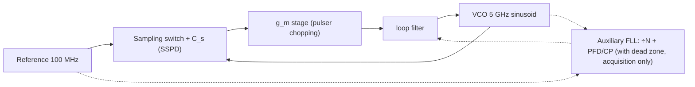

> **β**: This English translation is in beta — the Traditional-Chinese original is the authoritative version.

import SubSamplingPllExplorer from "@site/src/components/SubSamplingPllExplorer";

# Sampling / sub-sampling PLL — kicking the divider out of the loop

> **Prerequisites**: [pll_noise_budget](/06_design_insights/pll_noise_budget) (the five-source budget, where the in-band floor $S_{ref}N^2+S_{cp}$ comes from), [clock_chain_budget](/06_design_insights/clock_chain_budget) (the $+20\log_{10}N$ bookkeeping for ×N, $\phi_{out}=N\phi_{in}$), [adc_aperture_jitter](/06_design_insights/adc_aperture_jitter) (aperture math: sampling error = slope × timing error) | **Next**: [serdes_clocking_connection](/06_design_insights/serdes_clocking_connection), [exercises](/06_design_insights/exercises)

The conclusion of [pll_noise_budget](/06_design_insights/pll_noise_budget) was: for the classic
charge-pump PLL, the **in-band floor is set jointly by reference$\times N^2$ and the
PFD/charge-pump/divider — a cleaner VCO doesn't help at all**. This page asks the next
question: **is the loop's front end (PFD, charge-pump, divider) a physical limit, or an
architectural choice?** The answer is the latter — **the sub-sampling PLL (an architecture
that samples the high-speed VCO sinusoid directly with a low-speed reference)** removes the
divider from the phase-detection path entirely, boosting the phase-detector gain ($K_{PD}$)
from "$I_{cp}/2\pi$ divided further by $N$" to "$g_m\cdot A$." As a result, **the divider
noise term vanishes, and CP noise is no longer amplified by $\times N^2$** — the in-band
floor drops until only the reference term remains. This is one of the most important
architectural breakthroughs in PLL design over the last fifteen years.

> **External-literature note**: the sub-sampling PLL architecture and the standard result
> "divider noise eliminated, PD/CP noise not multiplied by $N^2$" are **not among the five
> PDFs downloaded for this site** (external literature, not among the five source PDFs).
> Classic reference: X. Gao, E. A. M. Klumperink, M. Bohsali, and B. Nauta, *"A Low Noise
> Sub-Sampling PLL in Which Divider Noise Is Eliminated and PD/CP Noise Is Not Multiplied
> by N²,"* IEEE J. Solid-State Circuits, vol. 44, no. 12, pp. 3253–3263, Dec. 2009. This
> page's derivation is self-contained, and every numeric value is labeled "illustrative";
> the five source PDFs supply the other half of the physics — "sensitivity at the sampling
> point" ([P1]'s ISF).

> **Intuition first (the punchline up front)**: in the classic PLL, phase comparison means
> "divide 5 GHz down to 100 MHz, then compare phase" — dividing shrinks the phase by a
> factor of $N$ (the signal weakens by $N$), while PFD/CP noise enters unscaled, so the
> SNR takes an inherent $N\times$ hit; the divider then tacks on its own noise on top.
> Sub-sampling flips this: "**don't touch the VCO — sample the 5 GHz sinusoid directly with
> the 100 MHz reference edge**." At lock, the sampling instant lands on the sinusoid's
> **zero crossing** — where the slope is steepest ($A\omega_0$, V/s) — so a tiny VCO phase
> shift produces a large change in the sampled voltage. The phase-detector gain is
> "volt-scale" ($A$, V/rad), several orders of magnitude larger than the charge-pump's
> "microamp-scale" gain. The same electronic noise (in A/√Hz or V/√Hz) divided by a much
> larger $K_{PD}$ converts to phase noise that is orders of magnitude smaller. The price:
> the sampler hangs directly off the VCO (reference spur, kT/C folding), and every zero
> crossing of the sinusoid looks identical (can't lock in $N$ without an auxiliary loop).

## Step 1: the classic CP-PLL's in-band ceiling — noise divided by $K_{PD}$, then multiplied by $N^2$

First write "how front-end noise becomes output phase noise" as a chain whose units can be
checked. The classic integer-N PLL's PFD (phase-frequency detector) compares $\phi_{ref}$
against $\phi_{out}/N$ (the divider divides the output phase by $N$; see
[clock_chain_budget](/06_design_insights/clock_chain_budget) rule 2), and the charge-pump
converts the phase difference into an average current:

$$
\bar i_{cp}=K_{cp}\Big(\phi_{ref}-\frac{\phi_{out}}{N}\Big)+i_n,
\qquad K_{cp}=\frac{I_{cp}}{2\pi}\ \ \Big[\frac{\text{A}}{\text{rad}}\Big]
$$

Where $K_{cp}=I_{cp}/2\pi$ comes from: a phase difference $\Delta\phi$ makes the CP conduct
for a fraction $\Delta\phi/2\pi$ of each reference period, so the average current
$=I_{cp}\cdot\Delta\phi/2\pi$.
**Dimension check**: A × dimensionless = A ✓; $K_{cp}$ is A/rad ✓.

**How the noise gets amplified.** At lock, the loop drives the average current to zero, so
the noise current $i_n$ is "converted" into an equivalent phase error and absorbed by the
output:

$$
0=K_{cp}\Big(\phi_{ref}-\frac{\phi_{out}}{N}\Big)+i_n
\quad\Longrightarrow\quad
\phi_{out}=N\phi_{ref}+\frac{N}{K_{cp}}\,i_n .
$$

Converting to PSD (in-band, $\lvert H_{lp}\rvert^2\approx1$):

$$
S_{\phi,out}\Big|_{\text{in-band}}=N^2 S_{ref}+N^2 S_{div}+\frac{N^2}{K_{cp}^2}\,S_{i,cp}
\qquad[\text{rad}^2/\text{Hz}]
$$

- **Dimension check**: $S_{i,cp}$ [A²/Hz] ÷ $K_{cp}^2$ [A²/rad²] = rad²/Hz ✓; $N^2$ dimensionless ✓.
- **Two amplification mechanisms stack**: (1) CP noise is first divided by a **small**
  $K_{cp}$ (illustrative: $I_{cp}=1$ mA →
  $K_{cp}=159.2\ \mu$A/rad; the equivalent gain referred to **output** phase is further
  divided by $N$, leaving only $3.183\ \mu$A/rad);
  (2) once converted to output phase it's multiplied by $N^2$ ($N=50$ gives $+33.98$ dB).
  Divider noise $S_{div}$ is injected at the PFD input, and likewise takes the $\times N^2$
  hit.
- This is exactly the microscopic origin of the $S_{out}=(S_{ref}N^2+S_{cp})\lvert H_{lp}\rvert^2+\cdots$
  term in [pll_noise_budget](/06_design_insights/pll_noise_budget) (that page lumps CP+divider
  together as $S_{cp}$, already referred to the output). **There are only three ways to
  suppress in-band noise: lower $N$, lower front-end noise, or — this page's topic —
  make $K_{PD}$ larger.**

## Step 2: the sub-sampling idea — sample the VCO sinusoid directly with the reference edge



The **sub-sampling phase detector (SSPD)** is simply a track-and-hold: every rising edge of
the reference samples the VCO's sinusoidal voltage onto a capacitor $C_s$. "Sub-sampling"
refers to the sampling rate $f_{ref}\ll f_0$ — sampling a 5 GHz sinusoid at 100 MHz is severe
undersampling, but we **only care about the phase error**, and the phase error is exactly
what gets aliased down near DC — which is what we want. (The idea of using a sampling phase
detector for microwave synthesis is itself old — the step-recovery-diode sampler has long
been a staple of microwave instrumentation (external literature, not separately cited); what
turned it into an integrated CMOS PLL with a full noise analysis is the Gao et al. 2009 paper
cited above.)

**Deriving $K_{PD}$.** At lock, $\omega_0 T_{ref}=2\pi N$ (the VCO completes an integer
number of cycles per reference period). Let the $k$-th reference edge land at
$t_k=kT_{ref}+\delta t_k$ ($\delta t_k$ being the reference's own timing error, in s), with
VCO output $V(t)=A\sin(\omega_0 t+\phi_{out})$. The sampled voltage:

$$
V_k=A\sin\big(\omega_0 kT_{ref}+\omega_0\,\delta t_k+\phi_{out}\big)
=A\sin\big(\underbrace{2\pi Nk}_{\text{integer cycles, drops out}}+\ \phi_{out}+\omega_0\,\delta t_k\big)
\approx A\big(\phi_{out}+\omega_0\,\delta t_k\big)
$$

The last step uses the small-angle approximation (the lock point sits near the zero of
$\sin$). This one equation immediately gives us three facts:

1. **Phase-detector gain**: $K_{PD}=\partial V_k/\partial\phi_{out}=A$ [V/rad] — **direct
   phase detection on the 5 GHz output phase, no division by $N$**. It's just the zero-crossing
   slope converted: slope $A\omega_0$ [V/s] divided by $\omega_0$ [rad/s] gives $A$ [V/rad].
   **Dimension check**: (V/s)÷(rad/s)=V/rad ✓.
   Illustrative numbers: $A=0.5$ V, $f_0=5$ GHz → slope $A\omega_0=15.71$ mV/ps,
   $K_{PD}=0.5$ V/rad.
2. **Back end**: the sampled voltage passes through a $g_m$ stage (transconductor, replacing
   the charge-pump) and becomes a current, with total gain (referred to output phase)
   $K_{SS}=g_m A$. **Dimension check**:
   $[\text{A/V}]\times[\text{V/rad}]=[\text{A/rad}]$ ✓.
   Illustrative: $g_m=5$ mS → $K_{SS}=2.5$ mA/rad — **785× larger** than the classic
   $3.183\ \mu$A/rad. (In practice the $g_m$ stage is chopped by a pulser (duty cycle) to
   control loop gain and stability; this page illustrates with a continuous $g_m$ — see the
   original paper for details.)
3. **Reference noise still gets $\times N$**: the $\delta t_k$ term enters as
   $\omega_0\delta t_k=N\cdot\omega_{ref}\delta t_k=N\cdot\phi_{ref,k}$
   — the reference's phase error is multiplied by $N$ through the slope itself.
   Illustrative: a 1 ps reference edge error → $15.71$ mV → $31.42$ mrad $=50\times0.628$ mrad.
   This confirms
   [clock_chain_budget](/06_design_insights/clock_chain_budget) rules 1/3: $\phi_{out}=N\phi_{ref}$
   is an intrinsic property of "multiplying the frequency by $N$" itself, **independent of
   whether a divider is present** — what sub-sampling removes is the divider's "noise," not
   the reference's $\times N^2$.

## Step 3: deriving the in-band advantage — divider term vanishes, CP noise no longer $\times N^2$

Line up steps 1 and 2. Take the same noise current PSD $S_{i}$ (A²/Hz) and refer it to
output phase:

$$
S_{\phi,out}^{\text{classic}}=\frac{N^2}{K_{cp}^2}\,S_i=\Big(\frac{2\pi N}{I_{cp}}\Big)^2 S_i,
\qquad
S_{\phi,out}^{\text{SS}}=\frac{S_i}{(g_m A)^2},
$$

Dividing the two gives sub-sampling's **suppression ratio** for front-end current noise:

$$
\frac{S_{\phi,out}^{\text{classic}}}{S_{\phi,out}^{\text{SS}}}
=\Big(\frac{2\pi N\,g_m A}{I_{cp}}\Big)^2
\quad\Longrightarrow\quad
\underbrace{20\log_{10}N}_{\text{removal of the divider multiplier}}
+\underbrace{20\log_{10}\!\frac{2\pi g_m A}{I_{cp}}}_{K_{PD}\text{ gain bonus}}\ \ [\text{dB}]
$$

- **Dimension check**: $2\pi N g_m A/I_{cp}$ = dimensionless×(A/rad)/(A) — rad is
  dimensionless, so the whole ratio is dimensionless ✓, and the log is valid.
- Illustrative numbers ($N=50$, $g_m A=2.5$ mA/rad, $I_{cp}=1$ mA): $33.98+23.92=57.9$ dB.
- **The first term is exactly the "$\sim20\log_{10}N$ removal of the divider multiplier"**:
  CP/PD noise in sub-sampling is no longer amplified by $\times N^2$ (external standard
  result, Gao et al. 2009, cited above). The second term is the extra bonus from $K_{PD}$
  changing from $I_{cp}/2\pi$ to $g_m A$, and it varies by design.
- **The divider noise term $N^2S_{div}$ disappears entirely** — there is no divider in the
  loop at all. (There's still a divider on-chip, but it only handles frequency acquisition
  inside the **auxiliary FLL**; once locked, it's silenced by the dead zone and is off the
  phase-noise path — see Step 5.)
- What remains of the in-band floor is $\approx N^2S_{ref}$ + the sampler's own noise —
  it **becomes reference-limited**. To go further, the only options are a cleaner
  reference or a higher $f_{ref}$ to lower $N$
  (there's no free lunch, per rule 1 of [clock_chain_budget](/06_design_insights/clock_chain_budget)).

## Step 4: the ISF connection — sampling the zero crossing = sampling where $\lvert\Gamma\rvert$ is largest

This step is where this site's main thread and sub-sampling elegantly intersect. The ISF of
an ideal LC oscillator with output $V=A\cos(\omega_0 t)$ is
$\Gamma(\omega_0\tau)=-\sin(\omega_0\tau)$ ([lab_02](/04_simulation_labs/lab_02_lc_oscillator_toy_model),
corresponding to [P1]'s LC example) — $\lvert\Gamma\rvert$ is **largest at the zero crossing
(=1) and zero at the peak**. The SSPD happens to fire exactly at the zero crossing, so this
single location has **two faces**:

**(a) Maximum efficiency at reading phase, and naturally AM-rejecting.** At the zero
crossing, $V=A\sin(\phi_{err})\approx A\phi_{err}$: the voltage carries phase information
"one-to-one" (the gain $A$ V/rad is the maximum anywhere on the sinusoid); meanwhile an
amplitude error $\delta A$ enters as $\delta A\sin(\phi_{err})\approx\delta A\cdot\phi_{err}$
— a second-order small quantity, so **it doesn't enter at first order**. Conversely, if
sampling happened at the peak: $\partial V/\partial\phi=0$ (no phase readout at all), while
$\delta A$ enters at full strength. This matches exactly the decomposition in
[phase_vs_amplitude_noise](/02_foundations/phase_vs_amplitude_noise): the zero crossing is a
"pure phase" window. **The geometry of sampling is the same thread as the aperture math**:
step 1 of
[adc_aperture_jitter](/06_design_insights/adc_aperture_jitter), "sampling error = slope ×
timing error," is **noise** on the ADC page (clock jitter dirtying the sample), but on this
page it's flipped around and **used as the signal** (the reference edge's timing offset is
converted into a measurable voltage via the slope $A\omega_0$) — the same equation, one side
is a liability, the other a phase detector.

**(b) Also maximum efficiency at hitting phase — kickback becomes a spur.** Every time the
sampling switch closes, it exchanges a small packet of charge $\Delta q$ with the VCO node
(charge sharing / switch feedthrough). Using [P1]'s operational ISF definition (canonical
formula 5):

$$
\Delta\phi=\frac{\Gamma(\omega_0\tau)}{q_{max}}\,\Delta q
$$

Hitting at the zero crossing → $\lvert\Gamma\rvert=1$ (maximum) → **every kick lands with
full force**. Illustrative (following the scale of canonical example A, taking
$\lvert\Gamma\rvert=1$): $\Delta q=1$ fC, $q_{max}=1$ pC → $\Delta\phi=1$ mrad per reference
period. This disturbance is **deterministic, periodic at $f_{ref}$**, so it isn't a
continuous spectrum but a **reference spur** (canonical section 10.2's small-angle PM: a
residual phase ripple of fundamental amplitude $\phi_p$ produces a sideband
$=20\log_{10}(\phi_p/2)$ dBc; $\phi_p=1$ mrad → $-66.0$ dBc, and if the loop suppresses it to
0.5 mrad → $-72.0$ dBc, illustrative). **The same $\lvert\Gamma\rvert_{max}$ that gives you
maximum phase-detector gain also gives you maximum kickback damage** — this is
sub-sampling's core trade-off, unpacked in the next step.
(Distinguishing spurs from random PN is covered in [measurement_and_spurs](/06_design_insights/measurement_and_spurs).)

## Step 5: the price — aliasing, reference spur, lock range

**(1) Aliasing: wideband noise folds into $\pm f_{ref}/2$.** The SSPD is a system that
samples at $f_{ref}$ (the same math as the ADC in
[adc_aperture_jitter](/06_design_insights/adc_aperture_jitter)). The **wideband** voltage
noise at the sampler input (thermal noise of the VCO buffer, PSD $S_v$ V²/Hz, bandwidth
$B_n\gg f_{ref}$) folds back into the single-sided band $f_{ref}/2$ with power conserved:

$$
S_{v,fold}=\frac{S_v\,B_n}{f_{ref}/2}=\frac{2S_v B_n}{f_{ref}}
\qquad\Longrightarrow\qquad
S_{\phi,fold}=\frac{S_{v,fold}}{A^2}\ \ [\text{rad}^2/\text{Hz}]
$$

**Dimension check**: $[\text{V}^2/\text{Hz}]\times[\text{Hz}]\div[\text{Hz}]=[\text{V}^2/\text{Hz}]$ ✓;
dividing by $A^2$ [V²/rad²] gives rad²/Hz ✓.

(Dividing by $A^2$: the voltage-to-phase gain at the zero crossing is $A$ V/rad.) For the
sampling capacitor itself, the total noise power is the famous $kT/C_s$ (independent of
bandwidth); once folded, $S_v=2kT/(C_s f_{ref})$. Illustrative: $C_s=100$ fF →
$\sqrt{kT/C_s}=204\ \mu$V rms → $\mathcal{L}=-147.8$ dBc/Hz — much lower than the $-126$
reference floor (good news), but **you have to account for folding before buying a wideband
buffer**: every doubling of $B_n$ adds 3 dB to this term.

**(2) The reference-spur see-saw.** The kickback from step 4(b) lands exactly where
$\lvert\Gamma\rvert$ is largest, so the spur is inherently worse than in a classic PLL. Every
countermeasure is a trade: adding an **isolation buffer** (spur ↓, but the buffer's own
noise folds in per (1), and it costs power); shrinking $C_s$ ($\Delta q$ ↓ → spur ↓, but
$kT/C_s$ ↑ — noise and spur sit on opposite ends of the same see-saw); dummy-sampler
cancellation. The same team's follow-up paper deals specifically with spur reduction:
X. Gao, E. A. M. Klumperink, G. Socci, M. Bohsali, and B. Nauta, *"Spur Reduction Techniques
for Phase-Locked Loops Exploiting a Sub-Sampling Phase Detector,"* IEEE J. Solid-State
Circuits, vol. 45, no. 9, pp. 1809–1821, Sep. 2010 (external literature, not among the five
source PDFs; TODO: manual verification needed — volume/issue/page numbers should be
manually verified before citing in a formal document).

**(3) Lock range: $\sin$ can't tell which cycle you're on.** $\sin$ is $2\pi$-periodic —
**every** zero crossing of the VCO looks identical to the SSPD, so the SSPD has zero
discrimination against "frequency error," and there's **no hardware that defines $N$** at
all: any integer $k$ satisfying $f_0=k\,f_{ref}$ is a valid lock point (harmonic lock —
locking to the wrong harmonic). So an SSPLL always pairs with an **auxiliary FLL**
(frequency-locked loop: a conventional ÷N + PFD/CP) responsible for pulling the frequency
close to the correct $N f_{ref}$; it carries a **dead zone** — once locked, the phase error
is tiny, the auxiliary loop goes completely silent, and the divider's noise never enters the
main loop. In an SSPLL, the number $N$ is defined by the **auxiliary loop**.

**(4) Effect on the optimal loop BW (tying back to the budget page).** Using the
$af_n+b/f_n$ toy model from [pll_noise_budget](/06_design_insights/pll_noise_budget): if the
in-band floor $a$ drops by 7.1 dB (power $\times1/5.12$, the illustrative numbers from the
worked example below) → the optimum $f_n^\*\propto\sqrt{b/a}$ **widens by
$\sqrt{5.12}=2.26\times$**, and the minimum integrated jitter $\propto(ab)^{1/4}$ improves by
$5.12^{1/4}=1.5\times$ — **a lower floor isn't just a lower floor, it also lets you open the
loop bandwidth wider and suppress more of the VCO**, so the total-jitter payoff is larger
than the floor's dB number alone suggests.

## Worked example (illustrative): ×50 classic CP-PLL vs. sub-sampling in-band floor

Format: **problem → step-by-step substitution (with units) → result → dimension check →
Python verification**. All component values are representative / **illustrative** (not tied
to any specific silicon process); bookkeeping conventions match
[clock_chain_budget](/06_design_insights/clock_chain_budget) (SSB, $\mathcal{L}=\tfrac12S_\phi$;
this page compares only **ratios**, so the /2-vs-/4 convention cancels out).

> **Problem**: $f_{ref}=100$ MHz, $N=50$ ($f_0=5$ GHz). Reference floor
> $\mathcal{L}_{ref}=-160$ dBc/Hz, divider's own floor $-160$ dBc/Hz (at its output), CP and
> $g_m$-stage equivalent noise current both $i_n=4$ pA/√Hz, $I_{cp}=1$ mA, $g_m=5$ mS,
> $A=0.5$ V, $C_s=100$ fF (300 K). Find the deep in-band output phase-noise floor for both
> architectures, and convert the in-band portion (brick-wall, 10 kHz–1 MHz, $f_n=1$ MHz)
> into rms jitter.

**Step by step (classic CP-PLL):**

1. reference: $-160+20\log_{10}50=-160+33.98=-126.02$ dBc/Hz.
2. charge-pump: $K_{cp}=I_{cp}/2\pi=1\ \text{mA}/2\pi=159.2\ \mu$A/rad. At the reference-input
   phase, $S=(4\times10^{-12})^2/(1.592\times10^{-4})^2=6.32\times10^{-16}$ rad²/Hz; $\times N^2=2500$
   → $1.58\times10^{-12}$ rad²/Hz → $\mathcal{L}=10\log_{10}(\tfrac12\times1.58\times10^{-12})=-121.03$ dBc/Hz.
3. divider: $-160+33.98=-126.02$ dBc/Hz.
4. power-sum ([clock_chain_budget](/06_design_insights/clock_chain_budget) rule 4):
   $\mathcal{L}_{classic}=-118.9$ dBc/Hz — **CP dominates**.

**Step by step (sub-sampling):**

5. reference: **unchanged**, $-126.02$ dBc/Hz (step 2, item 3: the $\times N$ is hidden
   inside the slope).
6. $g_m$ stage: $K_{SS}=g_mA=2.5$ mA/rad →
   $S=(4\times10^{-12})^2/(2.5\times10^{-3})^2=2.56\times10^{-18}$ rad²/Hz →
   $\mathcal{L}=-178.93$ dBc/Hz.
   Cross-check against step 2: $-121.03-57.9=-178.93$ ✓ ($57.9=33.98+23.92$).
7. sampler ($kT/C$ folding): $S_\phi=2kT/(C_sf_{ref})/A^2=3.31\times10^{-15}$ rad²/Hz →
   $\mathcal{L}=-147.81$ dBc/Hz.
8. power-sum: $\mathcal{L}_{SS}=-125.99$ dBc/Hz — **reference-limited**, an improvement of
   **7.1 dB**.

| In-band contribution (@ 5 GHz output) | Classic ×50 CP-PLL | sub-sampling |
|---|---|---|
| reference $\times N^2$ | $-126.02$ | $-126.02$ (unchanged) |
| PFD/CP (SS: $g_m$ stage) | $-121.03$ | $-178.93$ (÷$K_{PD}^2$, $-57.9$ dB) |
| divider $\times N^2$ | $-126.02$ | — (removed from loop) |
| sampler $kT/C$ folding | — | $-147.81$ |
| **Total [dBc/Hz]** | $\mathbf{-118.9}$ | $\mathbf{-125.99}$ |

**Converting to jitter (brick-wall, 10 kHz–1 MHz)**: $\sigma_\phi^2=2\times10^{\mathcal{L}/10}\times(10^6-10^4)$,
$\sigma_t=\sigma_\phi/(2\pi f_0)$ (canonical formulas 18/19) → classic $50.9$ fs, sub-sampling
$22.5$ fs (a $2.26\times$ savings in the in-band portion).

**Dimension check (overview)**: A²/Hz ÷ (A/rad)² = rad²/Hz ✓; rad²/Hz × Hz = rad² ✓;
rad ÷ (rad/s) = s ✓; every argument to a dB operation is dimensionless ✓.

**Python verification (runs as-is; `# ->` shows actual output):**

```python
import numpy as np
N, f_ref = 50, 100e6
f0 = N*f_ref                                        # 5 GHz
padd = lambda *L: 10*np.log10(sum(10**(x/10) for x in L))
# --- (a) classic charge-pump PLL: the three in-band terms (illustrative) ---
L_ref_out = -160.0 + 20*np.log10(N)
print(round(L_ref_out, 2))                          # -> -126.02 (ref ×N²)
K_cp = 1e-3/(2*np.pi)                               # I_cp=1 mA -> 159.2 uA/rad
Si = (4e-12)**2                                     # (4 pA/√Hz)²
L_cp = 10*np.log10(0.5*Si/K_cp**2*N**2)
print(round(L_cp, 2))                               # -> -121.03 (CP, ÷K_cp² then ×N²)
L_div_out = -160.0 + 20*np.log10(N)
print(round(L_div_out, 2))                          # -> -126.02 (divider ×N²)
L_classic = padd(L_ref_out, L_cp, L_div_out)
print(round(L_classic, 1))                          # -> -118.9 (CP dominates)
# --- (b) sub-sampling PLL (illustrative) ---
K_ss = 5e-3*0.5                                     # g_m·A = 2.5 mA/rad (referred to output phase)
print(round(20*np.log10(K_ss/(K_cp/N)), 1))         # -> 57.9 (= 33.98 + 23.92 dB)
L_gm = 10*np.log10(0.5*Si/K_ss**2)
print(round(L_gm, 2))                               # -> -178.93 (same i_n, ÷K_SS²)
L_smp = 10*np.log10(0.5*(2*1.380649e-23*300/(100e-15*f_ref))/0.5**2)
print(round(L_smp, 2))                              # -> -147.81 (kT/C folded into f_ref/2)
L_ss = padd(L_ref_out, L_gm, L_smp)
print(round(L_ss, 2))                               # -> -125.99 (reference-limited)
print(round(L_classic - L_ss, 1))                   # -> 7.1 (in-band improvement, dB)
# --- (c) convert the in-band portion into jitter (brick-wall 10 kHz–1 MHz) ---
for L in (L_classic, L_ss):
    st = np.sqrt(2*10**(L/10)*(1e6-1e4))/(2*np.pi*f0)
    print(round(st*1e15, 1))                        # -> 50.9 / 22.5 (fs)
```

**Honesty note**: these illustrative numbers were chosen so the classic architecture is
"CP-dominated" and sub-sampling is "reference-dominated" — a deliberately typical teaching
scenario; in a real design $i_n$, $I_{cp}$, duty cycle, and auxiliary-loop residuals would
all shift the relative ranking of the terms, but the **structural** result — "the divider
term vanishes and the CP term is no longer $\times N^2$" — does not change (Gao et al. 2009's
measurements indeed show the in-band floor approaching the reference-limited value).

## Interactive exploration: drag each term around

<SubSamplingPllExplorer />

Try it: (1) increase $N$ — both sides' reference terms rise together (the $\times N^2$ hit
is unavoidable), but the classic architecture's CP term rises too, while SS's $g_m$ term
**stays put**; (2) increase $g_m$ or $A$ — only SS's front-end term drops; (3) shrink
$C_s$ — the sampler term rises (the noise side of the kT/C see-saw).

## Design-knobs checklist

| Knob | Effect | Trade-off |
|---|---|---|
| $K_{PD}=g_mA$ | front-end noise ÷$K_{PD}^2$ | $A$ is set by VCO swing (the same knob as [tank_swing](/06_design_insights/tank_swing): larger swing → lower ISF phase noise **and** higher phase-detector gain, a double bonus); larger $g_m$ → more power |
| $N$ / $f_{ref}$ | reference $\times N^2$ (the only floor SS has left) | SSPLL floor is reference-limited → only a higher-frequency, lower-noise reference helps; divider/CP terms no longer stand in the way |
| $C_s$ | kT/C folding vs. kickback spur | small $C_s$: spur ↓, noise ↑; large $C_s$: the reverse — a see-saw |
| isolation buffer | spur ↓ | buffer noise folds in via aliasing ($\propto B_n/f_{ref}$), power ↑ |
| pulser duty cycle | loop gain / stability | the chopping ratio adjusts both $K$ and the noise duty cycle simultaneously — must be tracked together |
| loop BW $f_n$ | lower floor → $f_n^\*\propto\sqrt{b/a}$ widens | illustrative: floor $-7.1$ dB → $f_n^\*\times2.26$, $\sigma_{t,min}\times1/1.5$ (the U-shape from [pll_noise_budget](/06_design_insights/pll_noise_budget)) |
| auxiliary-FLL dead zone | divider silent once locked | dead zone too narrow → FLL keeps butting in and disturbing phase; too wide → frequency drift goes unmanaged |

## Connection to SerDes

In a SerDes sampling-clock jitter budget, the in-band floor is often the dominant term
([clock_chain_budget](/06_design_insights/clock_chain_budget)'s worked chain: 65.9% comes
from the in-band floor raised by $\times N^2$). This page's illustrative numbers compress the
in-band portion from 50.9 fs to 22.5 fs ($2.26\times$), and the optimal loop BW can then also
widen by $2.26\times$ to suppress more of the VCO — a direct credit to
[serdes_clocking_connection](/06_design_insights/serdes_clocking_connection)'s eye/BER
accounting (RJ overhead $=2Q^{-1}\sigma_t$). On the cost side: the reference spur is
**deterministic** jitter (DJ, see [dj_dual_dirac](/06_design_insights/dj_dual_dirac)), which
shows up on the eye diagram as a dual peak rather than a Gaussian tail — the "lower RJ,
higher DJ risk" trade that sub-sampling buys is exactly what the system level needs to watch.

## Applicability and failure conditions

| Condition | When it holds | When it fails |
|---|---|---|
| Small-angle linearization (sampling point near zero crossing) | $K_{PD}=A$, AM doesn't enter at first order | large phase error (during acquisition) → $\sin$ saturates, gain drops; the auxiliary FLL pulls it back |
| Sampling point exactly at zero crossing | maximum gain, best AM rejection | DC offset / delay shifts the sampling point → $K_{PD}=A\cos\phi_{dc}$ drops, AM starts to leak in |
| Sources uncorrelated, white | power-sum and folding formulas hold | supply-correlated noise, $g_m$-stage flicker (close-in, handled separately) |
| Divider confined to the auxiliary FLL, silenced by dead zone | divider noise never enters the main loop | poorly designed dead zone → FLL intervenes intermittently, divider/CP noise leaks back in |
| Illustrative values | the structural conclusion (what vanishes, what stays) is trustworthy | the absolute dB values **must not** be benchmarked against any real process/paper measurement |
| $f_0=Nf_{ref}$ integer relation | SSPD always samples the same phase point every cycle | fractional-N requirements → need extra techniques like DTC/interpolation (external literature, beyond this page) |

## Key takeaways

- Classic CP-PLL front-end noise referred to output: $S_{\phi,out}=N^2S_i/K_{cp}^2$,
  $K_{cp}=I_{cp}/2\pi$ — **small gain in the denominator, then $\times N^2$** — this is why
  the in-band floor is stuck at CP+divider (the microscopic version of
  [pll_noise_budget](/06_design_insights/pll_noise_budget)).
- Sub-sampling: the reference edge directly samples the VCO sinusoid's **zero crossing**,
  giving $K_{PD}=A$ V/rad (slope $A\omega_0$ ÷ $\omega_0$), paired with a $g_m$ stage to give
  $K_{SS}=g_mA$ A/rad — phase detection referred to **output** phase, no ÷N.
- The advantage = $20\log_{10}N$ (removal of the divider multiplier) + $20\log_{10}(2\pi
  g_mA/I_{cp})$ (gain bonus); illustrative $33.98+23.92=57.9$ dB; the divider noise term
  vanishes entirely (external standard result, Gao et al. JSSC 2009).
- **Reference $\times N^2$ is present in both** — the $\times N$ is hidden in the sampling
  slope ($\omega_0\delta t=N\omega_{ref}\delta t$), an intrinsic property of frequency
  multiplication, not the divider's fault. The SSPLL floor is therefore reference-limited.
- ISF duality: sampling the zero crossing = sampling where $\lvert\Gamma\rvert$ is largest —
  maximum gain for reading phase ($A$ V/rad, AM-resistant), and maximum severity for hitting
  phase via kickback ($\Delta\phi=\Gamma\Delta q/q_{max}$, [P1]'s operational definition) →
  the reference spur is inherently worse; noise (kT/C ↑) and spur ($\Delta q$ ↓) share the
  same $C_s$ see-saw.
- Aliasing: wideband noise at the sampler input folds into $\pm f_{ref}/2$
  ($S_{fold}=2S_vB_n/f_{ref}$); the kT/C version is illustratively $-147.8$ dBc/Hz.
- The SSPD can't tell which cycle it's on (harmonic lock) → needs an auxiliary FLL
  (÷N + PFD/CP + dead zone) to define $N$ and manage acquisition.
- Worked example (illustrative): in-band floor $-118.9\to-125.99$ dBc/Hz ($+7.1$ dB),
  in-band jitter $50.9\to22.5$ fs; the lower floor also lets the optimal loop BW widen by
  $2.26\times$, gaining another $1.5\times$ on total jitter.

## Further reading

- Full in-band floor and optimal loop BW budget: [pll_noise_budget](/06_design_insights/pll_noise_budget)
- The four ×N/÷N/PLL/buffer bookkeeping rules (source of the reference $\times N^2$ term): [clock_chain_budget](/06_design_insights/clock_chain_budget)
- The aperture math for sampling error = slope × timing error: [adc_aperture_jitter](/06_design_insights/adc_aperture_jitter)
- Source of the zero-crossing sensitivity result (ISF): [isf_definition](/03_isf_core_theory/isf_definition), [lab_02](/04_simulation_labs/lab_02_lc_oscillator_toy_model)
- Distinguishing and measuring spurs vs. random PN: [measurement_and_spurs](/06_design_insights/measurement_and_spurs)
- The other half of the swing knob (the ISF side): [tank_swing](/06_design_insights/tank_swing), [waveform_slope](/06_design_insights/waveform_slope)

## External literature (not among the five downloaded PDFs)

- X. Gao, E. A. M. Klumperink, M. Bohsali, and B. Nauta, *"A Low Noise Sub-Sampling PLL
  in Which Divider Noise Is Eliminated and PD/CP Noise Is Not Multiplied by N²,"*
  IEEE J. Solid-State Circuits, vol. 44, no. 12, pp. 3253–3263, Dec. 2009. (the classic
  sub-sampling PLL paper; source of this page's "divider vanishes + PD/CP not multiplied
  by $N^2$" result)
- X. Gao, E. A. M. Klumperink, G. Socci, M. Bohsali, and B. Nauta, *"Spur Reduction
  Techniques for Phase-Locked Loops Exploiting a Sub-Sampling Phase Detector,"*
  IEEE J. Solid-State Circuits, vol. 45, no. 9, pp. 1809–1821, Sep. 2010.
  (TODO: manual verification needed — volume/issue/page numbers should be manually verified)
- The classic CP-PLL's $K_{cp}=I_{cp}/2\pi$ and loop-noise bookkeeping: standard PLL
  literature (Gardner, *Phaselock Techniques*; B. Razavi, *RF Microelectronics*, 2nd ed.,
  2012), the same sources cited in
  [pll_noise_budget](/06_design_insights/pll_noise_budget).
- The part supplied by this site's five source PDFs: [P1] (the ISF operational definition
  $\Delta\phi=\Gamma\Delta q/q_{max}$, the LC oscillator's $\Gamma=-\sin$, maximum
  sensitivity at the zero crossing — all the physics in this page's Step 4).
