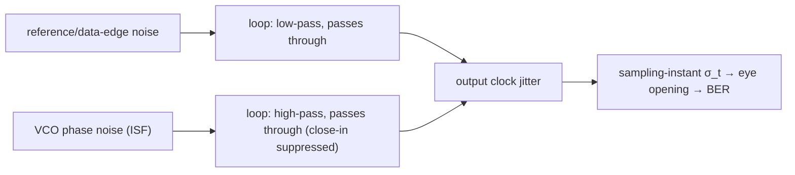

> **β**: This English translation is in beta — the Traditional-Chinese original is the authoritative version.

# From ISF to SerDes Clocking

> **Prerequisites**: [psd_phase_noise_jitter](/02_foundations/psd_phase_noise_jitter) ($S_\phi$, $\mathcal{L}$, the four jitter "dialects," and phase↔time conversion), [tank_swing](/06_design_insights/tank_swing) ($\mathcal{L}\propto\Gamma_{rms}^2/q_{max}^2$ sets the VCO's own noise), [lc_vs_ring](/06_design_insights/lc_vs_ring) (accumulated jitter $\sigma_{\Delta t}=\kappa\sqrt{\Delta t}$ and the LC/ring trade-off) | **Next**: [pll_noise_budget](/06_design_insights/pll_noise_budget), [exercises](/06_design_insights/exercises)

This is the **capstone page** of Chapter 06: it connects everything said so far about ISF / phase noise
to what a **SerDes (serializer/deserializer, high-speed serial transceiver)** designer looks at every
day — **clock jitter, eye opening, BER (bit error rate)**. We derive, step by step, the two phase→time
conversions, clarify how to choose the integration bandwidth, the difference between RJ and DJ, and why
a CDR/PLL behaves like a high-pass filter that removes the VCO's close-in noise — which is why "the same
VCO behaves completely differently under different loops."

> **Physical intuition (conclusion first)**: an oscillator's phase noise is "the phase jittering."
> What a SerDes designer cares about is "**how much the edge jitters on the time axis**" and "**the
> probability that the sampling instant lands near the center of the eye**." Phase jitter → time jitter
> ($\Delta t=\Delta\phi/2\pi f_0$) → the sampling point drifts off the eye center → the eye narrows → BER
> worsens. But not all phase noise, regardless of frequency, is harmful: the CDR/PLL **tracks** slow
> phase drift (low-frequency noise is absorbed by the loop), leaving only the **fast** noise the loop
> cannot follow to become jitter. So "integration bandwidth" and "loop bandwidth" are the two central
> knobs of SerDes clocking.

## Step 1: phase → time (a single phase error)

How does an oscillator's excess phase $\Delta\phi$ turn into an edge timing error? One period $T=1/f_0$
corresponds to $2\pi$ rad of phase, so phase and time are proportional ([notation](/00_overview/notation),
Eq. 17):

$$
\boxed{\ \Delta t=\frac{\Delta\phi}{2\pi f_0}\ }
$$

**Step-by-step derivation**: the signal is $V=A\cos(2\pi f_0 t+\phi)$. Treat a perturbation $\Delta\phi$ of
$\phi$ as a time shift $\Delta t$: requiring $2\pi f_0(t+\Delta t)=2\pi f_0 t+\Delta\phi$ and solving gives
$2\pi f_0\,\Delta t=\Delta\phi$, i.e.

$$
\Delta t=\frac{\Delta\phi}{2\pi f_0}.
$$

- **Dimension check**: $[\text{rad}]/[\text{rad/s}]=[\text{s}]$ ✓ ($2\pi f_0$ has units of rad/s, not Hz).
- **Intuition (5 GHz)**: 1 mrad → 31.8 fs; 1 rad → 31.8 ps (≈ $T/6.28$, sensible).

## Step 2: phase PSD → rms jitter (needs an integral)

A single $\Delta\phi$ is not useful — jitter is the **sum of phase noise across all frequencies**. First
integrate the phase PSD to get phase variance (Eq. 18):

$$
\sigma_\phi^2=\int_{f_1}^{f_2}S_\phi(f)\,df
$$

Then use Step 1 to convert rms phase to rms time (Eq. 19):

$$
\boxed{\ \sigma_t=\frac{\sigma_\phi}{2\pi f_0}=\frac{1}{2\pi f_0}\sqrt{\int_{f_1}^{f_2}S_\phi(f)\,df}\ }
$$

**Step-by-step explanation**:

1. **Why integrate**: $S_\phi(f)$ is "phase power per Hz" (rad²/Hz). Phase jitter at different offset
   frequencies is **independent**, so the powers add — integrating over $f$ gives the total phase
   variance $\sigma_\phi^2$ (rad²).
2. **Dimension check**: $[\text{rad}^2/\text{Hz}]\cdot[\text{Hz}]=[\text{rad}^2]$ ✓ → take the square root to get rad.
3. **Convert to time**: divide by $2\pi f_0$ (rad/s) → s.
4. **Connecting to measurement**: a phase-noise analyzer reports $\mathcal{L}(f)$ (dBc/Hz); use the
   small-angle approximation $S_\phi=2\cdot10^{\mathcal{L}/10}$ (the factor-of-2 for single-sided →
   double-sided, Eq. 16) to convert $\mathcal{L}$ to $S_\phi$ before integrating.

The figure below shows rms jitter obtained by integrating $\mathcal{L}(f)$ (5 GHz, $-100$ dBc/Hz @ 1 MHz,
1/f², integrated 1→100 MHz):


> This figure is **not a toy model** (it is the standard SerDes jitter-integration procedure). Full
> script: `simulations/lab_08_jitter_integration.py`. Numerical integration matches the closed-form
> result exactly.

## Step 3: numerical example (canonical example C)

> $f_0=5$ GHz, $\mathcal{L}(1\text{MHz})=-100$ dBc/Hz, 1/f² slope, integrated 1→100 MHz.

- **dBc/Hz→$S_\phi$**: $\mathcal{L}=-100$ dBc/Hz $\Rightarrow10^{-10}$; $S_\phi(1\text{MHz})=2\times10^{-10}$ rad²/Hz.
- **1/f² shape**: $S_\phi(f)=2\times10^{-10}(10^6/f)^2$.
- **Integral**: $\sigma_\phi^2=2\times10^{-10}(10^6)^2\int_{10^6}^{10^8}f^{-2}df=200(10^{-6}-10^{-8})=1.98\times10^{-4}$ rad²
  → $\sigma_\phi=14.07$ mrad.
- **Convert to jitter**: $\sigma_t=\dfrac{14.07\times10^{-3}}{2\pi\cdot5\times10^9}=447.9$ fs.

**Key intuition**: the 1/f² integral is **dominated by the lower limit $f_1$** (the $1/f_1$ term is
largest) — so "where you start integrating from" is critical. This is exactly the meaning of "integration
bandwidth" and "CDR high-pass" discussed below. See [numerical_feeling](/04_simulation_labs/numerical_feeling)
Example 3 for the full mental-math walkthrough.

## Step 4: how jitter eats into eye opening and BER

The SerDes receiver samples at the center of each bit. Let the bit period (UI, unit interval) be $T_b$.
Timing jitter $\sigma_t$ at the sampling instant directly "eats into" the eye's horizontal opening from
both sides. For the case of **RJ (Gaussian) only**, the BER at an offset $t$ from the eye center is a
**bathtub curve** (standard SerDes model, §10.2 of the spec):

$$
\text{BER}(t)=\frac{1}{2}\left[Q\!\left(\frac{\text{UI}/2-t}{\sigma_t}\right)+Q\!\left(\frac{\text{UI}/2+t}{\sigma_t}\right)\right],\qquad
Q(x)=\frac{1}{2}\,\mathrm{erfc}\!\left(\frac{x}{\sqrt2}\right)
$$

- **How to read it**: the two $Q$ terms are, respectively, the probability that "the left edge (at
  $-\text{UI}/2$) jitters past the sample point on the right" and that "the right edge (at $+\text{UI}/2$)
  jitters past the sample point on the left." At the exact eye center $t=0$ the two terms are equal and
  BER is lowest (the bottom of the bathtub).
- **Solving for eye opening from BER**: to meet a target BER (e.g. $10^{-12}$), the one-sided margin at
  the bottom ($t=0$) must satisfy $\text{UI}/2-Q^{-1}(\text{BER})\cdot\sigma_t > 0$. With
  $Q^{-1}(10^{-12})\approx7.03$:

- **Eye horizontal opening** (one-sided) $\approx0.5\,\text{UI}-(\text{opposite-side ISI})-Q^{-1}(\text{BER})\cdot\sigma_t$,
  where $Q^{-1}(\text{BER})$ is the inverse Gaussian Q-function value for the target BER (e.g. BER
  $=10^{-12}$ → $Q^{-1}\approx7.03$, total RJ ≈ $14\sigma_t$ peak-to-peak).
- **Intuition**: RJ is Gaussian and unbounded, so the stricter the BER target (the smaller the
  probability), the more margin must be reserved (larger $Q$). Each increment of $\sigma_t$ eats
  $\sim Q\sigma_t$ off each side of the eye.
- **Order of magnitude**: in the example above, $\sigma_t=448$ fs; at $f_0=5$ GHz, if the data rate is
  10 Gb/s ($T_b=100$ ps), the RJ overhead for BER $10^{-12}$ is $\approx14\times448\,\text{fs}=6.3$ ps
  $=0.063$ UI — **clock RJ alone eats 6.3% of the eye**. This is why high-speed links are so sensitive to
  VCO phase noise.

> ⚠️ The $Q$-value and $0.5$-UI-opening eye/BER model is **standard SerDes/communications knowledge (not
> in the five downloaded PDFs; supplemented from standard literature, e.g. the dual-Dirac jitter model,
> OIF-CEI, Razavi)**. [P1]/[P2] provide phase noise/jitter itself; they do not cover link budget.

## Step 5: the difference between RJ / DJ / accumulated jitter

What a SerDes measures as "jitter" is actually several components stacked together, and **they are
treated completely differently** (see the "four dialects" in [notation](/00_overview/notation)):

| Type | Source | Statistics | How it enters BER |
|---|---|---|---|
| **RJ (random jitter)** | oscillator phase noise, thermal | Gaussian, unbounded, characterized by $\sigma$ | peak-to-peak $\approx2Q\sigma_t$; margin grows with stricter BER |
| **DJ (deterministic jitter)** | ISI, duty-cycle distortion, crosstalk, PSIJ | bounded, characterized by peak-to-peak | added directly (bounded), does not scale with BER |
| **period jitter** | single-period length deviation $T_k-T$ | — | clock internal spec |
| **cycle-to-cycle** | adjacent-period difference $T_{k+1}-T_k$ | — | sensitive to PLL stability |
| **accumulated / long-term** | free-running drift, $\sigma_{\Delta t}=\kappa\sqrt{\Delta t}$ | random walk | open-loop only; suppressed once CDR/PLL is locked |

- **total jitter (TJ) @ BER**: $\text{TJ}=\text{DJ}_{pp}+2Q(\text{BER})\cdot\text{RJ}_{rms}$ (dual-Dirac
  approximation; for the rigorous version and the gap between $DJ_{\delta\delta}\le DJ_{pp}$, see
  [dj_dual_dirac](/06_design_insights/dj_dual_dirac)).
- **ISF directly governs RJ and accumulated jitter** (they originate from phase noise); DJ is mostly a
  link/pattern issue that ISF cannot see.

## Step 6: CDR/PLL high-pass filtering of VCO phase noise (the key point)

This is the single most important idea on this page, and the answer to "why the free-running
$\sigma_{\Delta t}=\kappa\sqrt{\Delta t}$ does not grow without bound in practice."

- Put the VCO inside a PLL (locked to a clean reference) or a CDR (locked to data edges), and the loop
  **tracks** the VCO's slow phase drift: as long as the drift is slow enough (offset frequency below the
  loop bandwidth $f_{BW}$), the loop corrects it.
- The result is that **the VCO's own phase noise experiences a high-pass transfer function**:

$$
\big|H_{VCO\to out}(f)\big|^2\approx\frac{f^2}{f^2+f_{BW}^2}\quad\Rightarrow\quad\begin{cases}\text{below }f_{BW}:\text{ suppressed (loop keeps up)}\\ \text{above }f_{BW}:\text{ passes unchanged}\end{cases}
$$

- Conversely, **the reference clock (or the CDR's input data-edge) noise experiences a low-pass**: low
  frequencies pass unchanged, high frequencies are filtered out.
- **Design consequences**:
  - **The integration lower limit $f_1$ should be taken near the loop bandwidth** (not DC) — because VCO
    noise below $f_{BW}$ has already been absorbed by the loop. This directly answers "how to choose the
    integration bandwidth": closed-loop jitter is integrated from $f_{BW}$ to $f_2$ (Nyquist or half the
    data rate).
  - **Accumulated jitter is truncated**: the free-running random walk ($\propto\sqrt{\Delta t}$, energy
    concentrated at very low frequency) falls exactly in the high-pass stopband → it is suppressed into a
    bounded tracking error. So once locked, it no longer drifts without bound.
  - **Loop bandwidth is a trade-off**: raising $f_{BW}$ → filters out more VCO close-in noise (good), but
    lets more reference/input noise and the loop's own noise through (bad). The optimal $f_{BW}$ sits near
    the crossover point of the VCO-noise and reference-noise curves.



> ⚠️ The PLL/CDR high-pass/low-pass transfer function is **standard PLL theory (not in the five
> downloaded PDFs; supplemented from standard literature, e.g. Gardner, Razavi, Best)**. [P1]/[P2] cover
> open-loop oscillator phase noise theory; this section is the bridge to closed-loop clocking. TODO:
> manual verification needed — for an exact loop transfer function (including charge-pump and loop-filter
> order), consult standard PLL literature.

## Step 7: practical intuition for TX PLL / RX PLL / LC-VCO / ring-VCO

| Scenario | Intuition | LC or ring? |
|---|---|---|
| **TX PLL** (generates the transmit clock) | Directly sets transmit jitter; usually narrow loop BW (absorbs ref noise), so **VCO close-in noise matters** | High-speed lanes use **LC-VCO** (low phase noise); jitter requirements are strict |
| **RX CDR** (recovers clock from data) | Loop BW is set by data/jitter tolerance; high-passes away VCO close-in | Commonly uses **ring-VCO** (wide tuning, multi-phase, small area — and close-in is filtered by the CDR, so it is less fatal) |
| **LC-VCO** | Low $\Gamma_{rms}/q_{max}$, low phase noise, slow drift; large area, narrow tuning | TX, reference, high performance |
| **ring-VCO** | Worse phase noise, faster jitter accumulation; but wide tuning, naturally multi-phase, small area; close-in is suppressed once inside a fast loop | RX CDR, low-power/area-sensitive, multi-phase needs |

- **Core trade-off**: the ring's weakness (close-in 1/f³, fast random walk) falls exactly in the loop's
  high-pass stopband — **if the loop bandwidth is wide enough, the ring-VCO's close-in weakness is largely
  compensated**. This is why many RX CDRs use ring instead of LC.
- Conversely, a TX PLL often uses a narrow loop to filter out reference spurs, so VCO close-in noise
  appears directly at the output → LC is preferred.

## The spec's 10 required design questions — summary table (with cross-page links)

| # | Question | One-line answer | Details |
|---|---|---|---|
| 1 | Why does symmetry affect flicker upconversion? | Only the ISF's $c_0$ upconverts flicker; a symmetric waveform has $c_0\to0$ | [symmetry](/06_design_insights/symmetry) |
| 2 | Why does swing lower phase sensitivity? | $\mathcal{L}\propto1/q_{max}^2$, $q_{max}=CV_{max}$; doubling swing → −6 dB | [tank_swing](/06_design_insights/tank_swing) |
| 3 | Why is injection dangerous where the slope is small? | $\Gamma\propto1/\dot V$; small slope → large $\vert \Gamma\vert$ → high phase sensitivity | [waveform_slope](/06_design_insights/waveform_slope) |
| 4 | How do LC and ring compare? | LC: high $Q$/large $q_{max}$/low noise; ring: more devices/ISF concentrated at transitions; at fixed $f_0$/P, ring is ~independent of $N$ | [lc_vs_ring](/06_design_insights/lc_vs_ring) |
| 5 | How is ISF related to jitter? | $\Gamma_{rms}^2/q_{max}^2$ sets both phase noise and $\kappa$ ($\sigma_{\Delta t}=\kappa\sqrt{\Delta t}$) | [lc_vs_ring](/06_design_insights/lc_vs_ring), this page §2 |
| 6 | How is phase noise integrated into jitter? | $\sigma_t=\frac{1}{2\pi f_0}\sqrt{\int_{f_1}^{f_2}S_\phi df}$; 1/f² dominated by the lower limit | this page §2–3, [numerical_feeling](/04_simulation_labs/numerical_feeling) |
| 7 | Knobs to change $\Gamma_{rms}$? | Waveform symmetry, fast edges, differential, aligning cyclostationary $\alpha$, increasing ring $N$ | [device_noise_mapping](/06_design_insights/device_noise_mapping) |
| 8 | Knobs to change $q_{max}$? | Increase swing $V_{max}$, raise tank $Q$/$R_p$, differential, push toward headroom | [tank_swing](/06_design_insights/tank_swing) |
| 9 | How to lower white-noise (1/f²) phase noise? | Lower $\Gamma_{rms}$, raise $q_{max}$, lower $S_i$ ([P1] Eq.21) | [tank_swing](/06_design_insights/tank_swing), [device_noise_mapping](/06_design_insights/device_noise_mapping) |
| 10 | How to lower flicker close-in (1/f³)? | Lower $c_0$ (symmetric/differential/50% duty/$\alpha$ alignment), lower device $\omega_{1/f}$, rely on loop high-pass | [symmetry](/06_design_insights/symmetry), this page §6 |

## Validity and failure conditions

| Condition | Holds when | Fails when |
|---|---|---|
| Small-angle approximation $\mathcal{L}\approx\frac12 S_\phi$ | $\sigma_\phi\ll1$ rad | large phase jitter (near 1 rad): SSB↔PSD diverges |
| RJ Gaussian and independent of DJ | dual-Dirac TJ model valid | non-Gaussian RJ or correlated jitter: needs jitter decomposition |
| loop transfer is first-order high-pass | intuitive estimate of the integration lower limit $\approx f_{BW}$ | higher-order loop or peaking: need the full transfer function |
| open-loop ISF theory | computing the VCO's own phase noise | closed-loop: must stack loop filtering on top |

## Worked examples

The following two examples work through this page's two core operations in detail: (1) using $\sigma_t$
and the Q-function to compute the **BER bathtub opening** (UI=100 ps); (2) **integration-bandwidth
choice** — how much jitter differs when the lower limit is taken at DC vs. the loop bandwidth. We reuse
the canonical case: $f_0=5$ GHz, $\mathcal{L}(1\text{MHz})=-100$ dBc/Hz, 1/f² slope, example C gives
$\sigma_t=447.9$ fs.

> **Example 1 (compute the BER bathtub opening from $\sigma_t$, UI=100 ps)**
> Data rate 10 Gb/s → UI $=100$ ps. Clock RJ $\sigma_t=448$ fs (example C, assuming no ISI/DJ). Find:
> (a) the BER at the exact eye center $t=0$; (b) the bathtub's horizontal opening (eye opening) needed
> to guarantee BER $\le10^{-12}$.

**Step-by-step substitution (with units)**. First compute how many $\sigma$'s the center-to-edge distance is
relative to $\sigma_t$:

$$
\begin{aligned}
\frac{\text{UI}/2}{\sigma_t}&=\frac{100\ \text{ps}/2}{0.448\ \text{ps}}=\frac{50}{0.448}=111.6, \\[4pt]
\text{(a)}\quad\text{BER}(0)&=\frac12\big[Q(111.6)+Q(111.6)\big]=Q(111.6)\;\approx\;0
\;(\ll10^{-300},\ \text{far below floating-point precision}).
\end{aligned}
$$

(b) The opening is set by "how far from center BER rises to $10^{-12}$." $Q^{-1}(10^{-12})\approx7.03$, so
the tolerable one-sided offset $t_{edge}$ satisfies $(\text{UI}/2-t_{edge})/\sigma_t=7.03$:

$$
\begin{aligned}
t_{edge}&=\frac{\text{UI}}{2}-7.03\,\sigma_t=50\ \text{ps}-7.03\times0.448\ \text{ps}=50-3.15=46.85\ \text{ps}, \\[4pt]
\text{eye horizontal opening}&=2\,t_{edge}=2\times46.85\ \text{ps}=93.7\ \text{ps}=0.937\ \text{UI}.
\end{aligned}
$$

- **Result**: (a) center BER is astronomically small ($\sigma_t$ is only $1/112$ of half a UI); (b) the
  BER $10^{-12}$ bathtub opening $\approx93.7$ ps $=0.937$ UI — i.e., **clock RJ eats $7.03\sigma_t\approx3.15$ ps
  from each side, $\approx6.3$ ps $=0.063$ UI total**. Consistent with Step 4's "448 fs RJ ≈ 0.063 UI."
- **Dimension check**: $Q$'s argument $\dfrac{[\text{s}]}{[\text{s}]}$ is dimensionless ✓; opening $[\text{s}]$
  divided by UI $[\text{s}]$ gives a UI count (dimensionless) ✓.
- **One-line Python check** (using the real `Q` and `ber_bathtub` from `simulations/common/serdes_utils.py`):

```python
import numpy as np
from simulations.common.serdes_utils import Q, ber_bathtub
ui, sigma_t = 100e-12, 447.9e-15
print("BER(0) =", ber_bathtub(0.0, sigma_t, ui))          # -> ~0 (1e-300 floor)
t_edge = ui/2 - 7.03*sigma_t
print("opening =", 2*t_edge*1e12, "ps =", 2*t_edge/ui, "UI")  # -> 93.7 ps = 0.937 UI
```

> **Example 2 (integration-bandwidth choice: lower limit at DC vs. loop bandwidth)**
> Same VCO (example C's 1/f² skirt, $S_\phi(f)=2\times10^{-10}(10^6/f)^2$ rad²/Hz), upper limit $f_2=100$ MHz.
> Compare rms jitter from "open-loop, integrated from $f_1=10$ kHz" vs. "closed-loop, integrated from
> loop bandwidth $f_1=1$ MHz." This is the numerical version of "why CDR/PLL high-pass reduces jitter."

**Step-by-step substitution (with units)**. The 1/f² phase-variance integral has closed form
$\sigma_\phi^2=S_\phi(f_{ref})f_{ref}^2\big(\tfrac{1}{f_1}-\tfrac{1}{f_2}\big)$; here
$S_\phi(f_{ref})f_{ref}^2=2\times10^{-10}\times(10^6)^2=2\times10^{2}$:

$$
\begin{aligned}
\text{(open-loop, }f_1=10\ \text{kHz)}:\quad
\sigma_\phi^2&=2\times10^{2}\left(\frac{1}{10^4}-\frac{1}{10^8}\right)=200\times(10^{-4}-10^{-8})\approx2.0\times10^{-2}\ \text{rad}^2 \\[2pt]
&\Rightarrow\ \sigma_\phi=0.1413\ \text{rad},\quad
\sigma_t=\frac{0.1413}{2\pi\times5\times10^9}=4.50\times10^{-12}\ \text{s}=4.50\ \text{ps}, \\[6pt]
\text{(closed-loop, }f_1=1\ \text{MHz)}:\quad
\sigma_\phi^2&=2\times10^{2}\left(\frac{1}{10^6}-\frac{1}{10^8}\right)=200\times9.9\times10^{-7}=1.98\times10^{-4}\ \text{rad}^2 \\[2pt]
&\Rightarrow\ \sigma_\phi=14.07\ \text{mrad},\quad
\sigma_t=447.9\ \text{fs}\quad(\text{i.e., example C}).
\end{aligned}
$$

- **Result**: raising the integration lower limit from 10 kHz (open-loop) to 1 MHz (loop BW) → rms jitter
  drops from **4.50 ps to 448 fs** (roughly a $10\times$ reduction). Because the 1/f² jitter is
  **dominated by the lower limit $1/f_1$**, the loop's high-pass removes VCO close-in noise below
  $f_{BW}$, equivalent to raising the integration lower limit to $f_{BW}$ — this is the quantitative
  answer to "how to choose the integration bandwidth": **closed-loop jitter is integrated from $f_{BW}$ to
  $f_2$**.
- **Dimension check**: $[\text{rad}^2/\text{Hz}]\cdot[\text{Hz}^2]\cdot[\text{1/Hz}]=[\text{rad}^2]$ ✓;
  $[\text{rad}]/[\text{rad/s}]=[\text{s}]$ ✓.
- **One-line Python check** (using `simulations/common/noise_utils.py`):

```python
import numpy as np
from simulations.common.noise_utils import leeson_one_over_f2, integrate_rms_jitter
for f1 in (1e4, 1e6):
    f = np.logspace(np.log10(f1), 8, 6000)
    L = leeson_one_over_f2(f, L_ref_dbc=-100, f_ref=1e6)
    st, sp = integrate_rms_jitter(f, L, f0=5e9, fmin=f1, fmax=100e6)
    print(f"f1={f1:.0e}: sigma_t = {st*1e15:.1f} fs")
# f1=1e+04: sigma_t = ~4500 fs ; f1=1e+06: sigma_t = 447.9 fs
```

> Example 1's BER/Q model is **standard SerDes knowledge (not in the five PDFs; supplemented from
> standard literature, e.g. dual-Dirac, OIF-CEI)**; Example 2's loop high-pass truncation is **standard
> PLL theory (not in the five PDFs)**. The phase noise/jitter itself comes from [P1]/[P2].

## Key takeaways

- $\Delta t=\Delta\phi/(2\pi f_0)$; $\sigma_t=\frac{1}{2\pi f_0}\sqrt{\int_{f_1}^{f_2}S_\phi df}$ (1/f² is dominated by the lower integration limit).
- Example C: $-100$ dBc/Hz @ 1 MHz, 5 GHz, 1/f², 1→100 MHz → $\sigma_\phi=14.07$ mrad, $\sigma_t=447.9$ fs.
- Jitter eats the eye from both sides: $\sim Q\sigma_t$/side; at 10 Gb/s, BER $10^{-12}$: 448 fs RJ ≈ 0.063 UI.
- RJ (Gaussian, from phase noise, governed by ISF) vs. DJ (bounded, ISI/crosstalk, invisible to ISF); TJ $=$ DJ$_{pp}+2Q\cdot$RJ$_{rms}$.
- CDR/PLL is **high-pass** to VCO noise: close-in/accumulated jitter is suppressed → integration lower limit ≈ $f_{BW}$.
- Practice: TX PLL favors LC-VCO (close-in matters); RX CDR often uses ring-VCO (close-in filtered by the loop).

## Further reading

- Jitter types and PSD: [psd_phase_noise_jitter](/02_foundations/psd_phase_noise_jitter)
- Mental-math exercises: [numerical_feeling](/04_simulation_labs/numerical_feeling)
- LC vs. ring and accumulated jitter: [lc_vs_ring](/06_design_insights/lc_vs_ring)
- Design knobs: [symmetry](/06_design_insights/symmetry), [waveform_slope](/06_design_insights/waveform_slope), [tank_swing](/06_design_insights/tank_swing), [device_noise_mapping](/06_design_insights/device_noise_mapping)
- Notation and units: [notation](/00_overview/notation)
