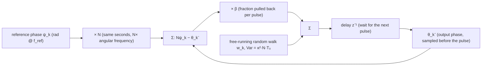

import NumericQuiz from "@site/src/components/NumericQuiz";
import SubharmonicInjectionExplorer from "@site/src/components/SubharmonicInjectionExplorer";

> **β**: This English translation is in beta — the Traditional-Chinese original is the authoritative version.

# Subharmonic Injection: From the Impulse Train to ×N Multiplication (ILCM / ILFM)

> **Prerequisites**: [paper_003](/05_paper_deep_dives/paper_003_injection_locking_part1) ([P3] Sec. IV impulse train, Eq.(19)–(23), generalized Adler), [paper_004](/05_paper_deep_dives/paper_004_injection_locking_part2) (the M:N time-synchronous average of [P4] Eq.(28)–(30)), [injection_locked_division](/06_design_insights/injection_locked_division) (the other half of the duality: division rides on the ISF's $N$-th harmonic), [injection_locking_noise](/06_design_insights/injection_locking_noise) (a locked oscillator is a first-order PLL, corner $=-\Omega'(\theta_{ss})$) | **Next**: [lab_40_subharmonic_injection](/04_simulation_labs/lab_40_subharmonic_injection) (independent simulation), [sampling_pll](/06_design_insights/sampling_pll), [clock_chain_budget](/06_design_insights/clock_chain_budget)

> **What this page answers**:
> 1. Fire $f_{ref}$ pulses into an oscillator running at $f_0=N f_{ref}$ — why does it lock? On **whose** harmonics? Why can a **pure sinusoid** at $f_0/N$ not lock?
> 2. Why is the lock range $\propto 1/N$? How do the two routes — the [P4] Fourier average and the [P3] impulse-train arithmetic — **agree term by term**?
> 3. How much phase does each pulse "pull back" — what is the realignment factor $\beta$, what sets it, how large may it be, how many pulses to settle?
> 4. How is the phase noise of the locked output budgeted: reference $\times N^2$, own noise shaped by a first-order **discrete-time** loop, closed-form output jitter, where the reference spur comes from?
> 5. Design knobs: pulse width, ring vs LC, $N$, $\beta$; how does an ILCM compare with a classic PLL and a sub-sampling PLL?

> **Physical intuition (conclusion first)**: an injection-locked clock multiplier (ILCM) is not a "multiplier circuit" — it is an oscillator that
> already runs at $f_0\approx N f_{ref}$ and **gets kicked by a reference pulse once every $N$ of its own periods**. One kick = one ISF phase step
> $\Delta\phi=\tilde\Gamma(\theta)\,q_{inj}$; between pulses the oscillator free-runs, its phase drifts with the detuning and random-walks with noise.
> Locking = each kick exactly repays the phase owed over those $N$ periods; noise suppression = each kick pulls the accumulated random phase back
> by a fraction $\beta$. **What makes the lock possible is the injection waveform's own $N$-th harmonic** (the oscillator's ISF fundamental only
> hears things near $f_0$) — the mirror image of the divider (ILFD): division rides on ISF harmonics, multiplication on injection harmonics.

> **Scope of this page**: advanced design page. The text, equations and footnotes of [P3] Sec. IV (p.2112) and [P4] Sec. IV (p.2129) were re-read
> from the enlarged PDF pages word by word (Section 0). **[P4] writes out the closed form Eq.(30) only for the superharmonic case ($M=1$, a sinusoid
> at $N\omega_{osc}$); for the subharmonic (multiplier) side the paper gives only the general statement and footnote 10** — this page derives the
> multiplier closed form from Eq.(29) step by step, derives the $1/N$ law and the realignment factor from the discrete arithmetic of [P3] Sec. IV,
> and reconciles the two routes. Section 4, "putting noise into the discrete loop", is the textbook-level ILCM / realignment result (**external
> literature, not in the site's 5 PDFs**; two verified classics are listed at the end), derived here and checked term by term against this page's
> own Monte-Carlo. Every model is a **phase-only, weak-injection pedagogical toy**.

---

## 0. What the papers say — and do not say (verbatim check of [P3] p.2112 and [P4] p.2129)

### 0.1 [P3] Sec. IV "Locking to an Impulse Train" (p.2112)

[paper_003](/05_paper_deep_dives/paper_003_injection_locking_part1) already teaches this section step by step: an ideal parallel LC fed by a train of
current impulses of period $T_{inj}\equiv2\pi/\omega_{inj}$, each dumping a fixed charge $q_{inj}$ (Fig. 3(a); the paper takes $q_{inj}\ge0$ by
convention, with the sign selecting Fig. 3(b) speed-up or Fig. 3(c) slow-down; the state-space impulse arrows in the figure are deliberately enlarged,
not to scale). Four core equations:

$$
\Delta\phi=\pm\frac{q_{inj}}{q_{max}}\ \ (19),\qquad
\frac{\Delta\phi}{2\pi}=-\frac{\Delta T}{T_0}=\frac{\Delta\omega}{\omega_{inj}}\ \ (20),\qquad
\Delta\omega=\frac{\Delta\phi}{T_{inj}}=\pm\frac{1}{T_{inj}}\frac{q_{inj}}{q_{max}}\ \ (21),\qquad
I_{inj}=\frac{2q_{inj}}{T_{inj}}\ \ (23)
$$

The text states that for each $q_{inj}$ there is an injection period $T_{inj}$ that makes the next impulse always land at the same place on the
waveform, so the period is sustainedly lengthened or shortened while the amplitude never changes. **That sentence carries two footnotes**, both
directly relevant here:

- **footnote 7** (verified verbatim): the injection can also happen "every $M$ periods ($M$ a positive integer) … corresponding to subharmonic
  locking" — **this is the starting point of this page**: replace "one pulse per period" with "one pulse every $N$ periods". The paper gives only
  this sentence; the arithmetic is completed in Section 2.
- **footnote 8**: injections that no longer preserve the amplitude (pulses not at the zero crossing) are left to the companion paper [P4] Sec. III-B —
  i.e. the APF / amplitude modulation of [P4] ([paper_004](/05_paper_deep_dives/paper_004_injection_locking_part2)). The phase-only model of this
  page ignores it; Section 3 points out where it bites.

### 0.2 [P4] Sec. IV "Superharmonic and Subharmonic Injections" (p.2129)

[P4] redefines the relative phase as (Eq.(28), $M,N$ positive coprime integers)

$$
\varphi(t)\equiv\frac{M}{N}\,\omega_{inj}t+\theta(t)
$$

and obtains the generalized pulling equation (Eq.(29))

$$
\frac{d\theta}{dt}=\omega_0-\frac{M}{N}\omega_{inj}+\frac{1}{NT_{inj}}\int_{NT_{inj}}\tilde\Gamma\!\left(\frac{M}{N}\omega_{inj}t+\theta\right)i_{inj}(t)\,dt .
$$

The text then says that this $M{:}N$ framework covers any rational ratio $M\omega_{inj}=N\omega_{osc}$ under lock, and that a Fourier series shows
at a glance that locking "requires the $M$th-multiple harmonics of the injection to interact with the $N$th-multiple harmonics of the oscillator's
ISF"; it also notes that relative phases $2\pi/N$ apart are indistinguishable, so $\Omega(\theta)$ has period $2\pi/N$. Then — **only for a
superharmonic sinusoidal injection** (at the $N$th superharmonic, amplitude $I_{inj}$) — the closed form is written out (Eq.(30)):

$$
\Omega(\theta)=\frac{1}{2}I_{inj}\vert\tilde\Gamma_N\vert\cos\!\big(N\theta+\angle\tilde\Gamma_N\big).
$$

**What the paper does not write**: a subharmonic ($M\neq1$, multiplier) closed form for a sinusoid or a pulse. Footnote 10 honestly explains why:
for $M\neq1$ the higher-order harmonics the injection needs are often generated by **mixing inside the oscillator**, a nonlinear phenomenon "not
explicitly captured by our framework", partly handled by the model of its reference [25] (which was used to design subharmonic injection-locked
frequency multipliers). This page therefore **assumes the injection waveform itself carries enough $N$-th harmonic** (that is what a pulse generator
is for), so that the first-order average of Eq.(29) applies directly, without relying on internal mixing outside the framework.

### 0.3 Notation map (this page vs [P4])

| Quantity | [P4] notation | This page (multiplier $\times N$) | Note |
|---|---|---|---|
| Lock relation | $M\omega_{inj}=N\omega_{osc}$ | $\omega_{osc}=N\omega_{inj}$, i.e. $M_{[P4]}=N$, $N_{[P4]}=1$ | Here $N$ is the **multiplication ratio** (as in [clock_chain_budget](/06_design_insights/clock_chain_budget)) |
| Averaging window | $N_{[P4]}T_{inj}$ | $T_{inj}=NT_0$ | one reference period = $N$ oscillator periods |
| Relative phase | $\theta=\varphi-\tfrac{M}{N}\omega_{inj}t$ | $\theta=\varphi-N\omega_{inj}t$ | [rad], slowly varying |
| Detuning | $\omega_0-\tfrac{M}{N}\omega_{inj}$ | $\Delta\omega_0\equiv\omega_0-N\omega_{inj}$ | on the **output** frequency axis [rad/s] |
| Unit-bearing ISF | $\tilde\Gamma$ | $\tilde\Gamma(\theta)=\Gamma(\theta)/q_{max}$ | [rad/C]; $\vert\tilde\Gamma_m\vert=c_m/q_{max}$ ($c_m$ of [P1] Eq.(12)) |
| ISF vs injection | ÷$N$: $\vert\tilde\Gamma_N\vert$ carries the lock | ×$N$: $\vert\tilde\Gamma_1\vert$ carries the lock, the injection's $\vert I_N\vert$ supplies the harmonic | the duality of Section 1 |

---

## 1. Route 1: from [P4] Eq.(29) to "multiplication rides on the injection's $N$-th harmonic"

**Step 1 (substitute $M_{[P4]}=N$, $N_{[P4]}=1$)**. The averaging window becomes $T_{inj}$:

$$
\frac{d\theta}{dt}=\Delta\omega_0+\underbrace{\frac{1}{T_{inj}}\int_{T_{inj}}\tilde\Gamma\big(N\omega_{inj}t+\theta\big)\,i_{inj}(t)\,dt}_{\equiv\ \Omega(\theta)}
$$

Units: $\tilde\Gamma\,i_{inj}$ = rad/C × C/s = rad/s ✓. Inside the window the ISF argument advances $N\omega_{inj}T_{inj}=2\pi N$ ($N$ full turns) and
the injection one full turn — the [P4] p.2129 requirement "an integer number of cycles each" is met.

**Step 2 (Fourier expansion, term-by-term average)**. Expand both periodic functions (the same expansion as [P1] Eq.(12); the injection has a DC term):

$$
\tilde\Gamma(\varphi)=\tilde\Gamma_{dc}+\sum_{m\ge1}\vert\tilde\Gamma_m\vert\cos\!\big(m\varphi+\angle\tilde\Gamma_m\big),\qquad
i_{inj}(t)=I_0+\sum_{k\ge1}\vert I_k\vert\cos\!\big(k\omega_{inj}t+\angle I_k\big)
$$

Multiply the $(m,k)$ term and use the product-to-sum identity ($\cos A\cos B=\tfrac12[\cos(A-B)+\cos(A+B)]$):

$$
\begin{aligned}
&\vert\tilde\Gamma_m\vert\vert I_k\vert\cos\!\big(mN\omega_{inj}t+m\theta+\angle\tilde\Gamma_m\big)\cos\!\big(k\omega_{inj}t+\angle I_k\big)\\
&=\frac{\vert\tilde\Gamma_m\vert\vert I_k\vert}{2}\Big[\cos\!\big((mN-k)\omega_{inj}t+m\theta+\angle\tilde\Gamma_m-\angle I_k\big)+\cos\!\big((mN+k)\omega_{inj}t+m\theta+\angle\tilde\Gamma_m+\angle I_k\big)\Big]
\end{aligned}
$$

Over one $T_{inj}$ window the difference term completes $(mN-k)$ turns and the sum term $(mN+k)$ turns — **everything averages to exactly zero except
the difference term with $k=mN$** (an identity, not an approximation). The DC×DC term survives separately. Hence

$$
\boxed{\ \Omega(\theta)=I_0\,\tilde\Gamma_{dc}+\frac12\sum_{m\ge1}\vert\tilde\Gamma_m\vert\,\vert I_{mN}\vert\cos\!\big(m\theta+\angle\tilde\Gamma_m-\angle I_{mN}\big)\ }
$$

**Selection rule $k=mN$**: the $m$-th ISF harmonic pairs only with the $mN$-th injection harmonic. This is exactly the [P4] sentence for
$M_{[P4]}=N$, $N_{[P4]}=1$ — the injection's "multiples of $N$" harmonics ↔ the ISF's "multiples of 1" (all) harmonics.

**Step 3 (fundamental dominates → lock range)**. Most ISF energy sits in $m=1$ (the ideal-LC $-\sin\theta$ has **only** $m=1$); keeping $m=1$:

$$
\boxed{\ \Omega(\theta)\approx\frac12\vert I_N\vert\vert\tilde\Gamma_1\vert\cos\!\big(\theta+\angle\tilde\Gamma_1-\angle I_N\big),\qquad
\omega_L=\frac12\vert I_N\vert\,\vert\tilde\Gamma_1\vert\ }
$$

Dimension check: A × rad/C = rad/s ✓. Placed next to [P4] Eq.(30)'s $\omega_L=\tfrac12 I_{inj}\vert\tilde\Gamma_N\vert$, **the subscripts have
swapped places**:

| | Division ÷$N$ ([P4] Eq.(30), verified) | Multiplication ×$N$ (derived here from Eq.(29)) |
|---|---|---|
| Who supplies the harmonic | the oscillator ISF's $\vert\tilde\Gamma_N\vert$ | the injection waveform's $\vert I_N\vert$ |
| Who needs only the fundamental | the injection: $I_{inj}\cos(\omega_{inj}t)$ suffices | the ISF: only $\vert\tilde\Gamma_1\vert$ is used |
| Lock range | $\tfrac12 I_{inj}\vert\tilde\Gamma_N\vert$ | $\tfrac12\vert I_N\vert\vert\tilde\Gamma_1\vert$ |
| Lock-phase degeneracy | $N$ phases $2\pi/N$ apart, indistinguishable | $\Omega(\theta)$ has period $2\pi$: **unique lock phase** |
| Pure sinusoidal injection | works (the harmonic comes from the ISF) | **cannot lock to first order** ($\vert I_N\vert=0$ for $N\ge2$) |

**Step 4 (a pure sinusoid cannot lock — the most important sentence on this page)**. $i_{inj}=I_{inj}\cos(\omega_{inj}t)$ has only $k=1$; for
$N\ge2$, $\vert I_N\vert=0$ ⟹ $\Omega(\theta)\equiv0$ (first order) ⟹ **no restoring force, no lock range**. If a real circuit occasionally does
lock to a pure sinusoid at $f_0/N$, that is the oscillator's own nonlinearity mixing $f_{ref}$ up to its $N$-th harmonic ([P4] footnote 10 says
explicitly that this is outside the framework). The design answer is **don't rely on the oscillator to make your harmonics**: use a pulse generator
(or an edge-triggered narrow pulse) to create $\vert I_N\vert$, so that the first-order theory applies directly — Section 5.1 computes how the pulse
width sets $\vert I_N\vert$.

**Step 5 (site inference: what the DC term is)**. A unipolar pulse train has DC: $I_0=q_{inj}/T_{inj}\neq0$. If the ISF is asymmetric
($\tilde\Gamma_{dc}=(c_0/2)/q_{max}\neq0$ — the very same $c_0$ that upconverts $1/f$ into $1/f^3$ in [P1] Eq.(23)–(24)), $\Omega(\theta)$ acquires a
**$\theta$-independent constant frequency shift** $I_0\tilde\Gamma_{dc}$ — it does not help locking, it only moves the centre of the lock range.
Toy number: $q_{inj}=50$ fC, $T_{inj}=4$ ns ⟹ $I_0=12.5\ \mu$A; the site's asymmetric toy $\Gamma=\cos\theta+0.3$ has $c_0/2=0.3$, $q_{max}=1$ pC ⟹
$I_0\tilde\Gamma_{dc}=12.5\times10^{-6}\times0.3/10^{-12}=3.75\times10^{6}$ rad/s = a **597 kHz** static shift (units: A × rad/C = rad/s ✓).
Inference: slow drift of the pulse **amplitude** (low-frequency noise on $q_{inj}$) becomes frequency noise through $c_0$ — the same door as $1/f$
upconversion. For the ideal LC, $c_0=0$ and this term vanishes.

---

## 2. Route 2: an impulse train with one pulse every $N$ periods ([P3] Sec. IV + footnote 7)

**Setup**: $i_{inj}(t)=q_{inj}\sum_k\delta(t-kT_{inj})$, $T_{inj}=NT_0$. Let $\theta_k$ be the relative phase at the instant the $k$-th pulse arrives.

**Step 1 (the kick of one pulse)**: the [P1] operational definition $\Delta\phi=\Gamma(\theta)\Delta q/q_{max}=\tilde\Gamma(\theta)\,q_{inj}$ [rad].
([P3] Eq.(19) is the special case $\Gamma=-\sin$ with the pulse at the zero crossing, $\vert\Gamma\vert=1$.)

**Step 2 (drift between pulses)**: free-running $d\theta/dt=\Delta\omega_0$, accumulated over $N$ periods: $\Delta\omega_0\,T_{inj}=\Delta\omega_0\,NT_0$ [rad].
This is the only difference from [P3] Sec. IV ($N=1$) — **the phase owed is multiplied by $N$, the kick that repays it is not**.

**Step 3 (per-pulse map and fixed point)**:

$$
\boxed{\ \theta_{k+1}=\theta_k+\Delta\omega_0\,NT_0+q_{inj}\,\tilde\Gamma(\theta_k)\ }
$$

Lock = fixed point $\theta_{k+1}=\theta_k=\theta_{ss}$:

$$
q_{inj}\,\tilde\Gamma(\theta_{ss})=-\Delta\omega_0\,NT_0
$$

The left side is "the phase one pulse repays", the right side "the phase owed over $N$ periods". A fixed point exists ⟺ the right side lies within the
range of the left:

$$
\boxed{\ \vert\Delta\omega_0\vert\le\Delta\omega_L=\frac{q_{inj}\,\vert\tilde\Gamma\vert_{max}}{NT_0}\ \xrightarrow{\ \Gamma=-\sin\ }\ \frac{q_{inj}}{q_{max}}\cdot\frac{1}{NT_0}=\frac{q_{inj}}{q_{max}}\cdot\frac{f_0}{N}\ }
$$

Dimension check: rad/C × C ÷ s = rad/s ✓; $N=1$ recovers [P3] Eq.(21) ✓. **$\Delta\omega_L\propto1/N$**: the same pulse has to pay for $N$ times as
much time. The fractional lock range is $\Delta f_L/f_0=(q_{inj}/q_{max})/(2\pi N)$.

> **Example 1 (canonical)**: $f_0=5$ GHz ($T_0=200$ ps), $q_{max}=1$ pC, $N=20$ ($f_{ref}=250$ MHz, $T_{inj}=4$ ns), $q_{inj}=50$ fC.
> 1. Kick budget: $q_{inj}/q_{max}=0.05$ rad (weak injection $\ll1$ ✓; exact form $2\sin^{-1}(0.025)=0.05003$, difference $5\times10^{-5}$).
> 2. $\Delta\omega_L=0.05/(4\times10^{-9}\ \text{s})=1.25\times10^{7}$ rad/s ⟹ $\Delta f_L=1.989$ MHz.
> 3. Fractional lock range $=0.05/(2\pi\times20)=3.98\times10^{-4}$ = **398 ppm** — two orders of magnitude below the PVT uncertainty of the
>    free-running frequency (percent level). This is why real ILCMs almost always carry a frequency-tracking loop (FLL); Section 5.4 returns to it.
> 4. One line of Python: `50e-15/1e-12/(20*200e-12)/(2*3.141592653589793)/1e6` → $1.989$.

**Step 4 (reconciling the two routes — they must agree exactly)**. The Fourier series of a delta train is
$\frac{q_{inj}}{T_{inj}}\big[1+2\sum_{k\ge1}\cos(k\omega_{inj}t)\big]$: $I_0=q_{inj}/T_{inj}$, **all** $k\ge1$ have $\vert I_k\vert=2q_{inj}/T_{inj}$
($k=1$ is [P3] Eq.(23)), $\angle I_k=0$. Insert into the general formula of Section 1:

$$
\Omega(\theta)=\frac{q_{inj}}{T_{inj}}\Big[\tilde\Gamma_{dc}+\sum_{m\ge1}\vert\tilde\Gamma_m\vert\cos\!\big(m\theta+\angle\tilde\Gamma_m\big)\Big]=\frac{q_{inj}}{T_{inj}}\,\tilde\Gamma(\theta)
$$

— the Fourier sum reassembles the ISF **as it is**, which is precisely the map's "kick per unit time" $q_{inj}\tilde\Gamma(\theta)/T_{inj}$. For
$\Gamma=-\sin$: route 1 gives $\tfrac12\cdot\frac{2q_{inj}}{T_{inj}}\cdot\frac{1}{q_{max}}=\frac{q_{inj}}{q_{max}T_{inj}}$ = route 2 ✓. **The two
routes are two spellings of one identity**: all harmonics of a delta train have equal weight, so "injection $N$-th harmonic × ISF fundamental"
and "one kick ÷ $NT_0$" are the same number.

**Step 5 (finite pulse width)**. For a rectangular pulse of width $\tau_p$ and area $q_{inj}$,
$\vert I_k\vert=\frac{2q_{inj}}{T_{inj}}\big\vert\mathrm{sinc}(k f_{ref}\tau_p)\big\vert$ ($\mathrm{sinc}(x)=\sin(\pi x)/(\pi x)$). The lock uses
$k=N$, whose argument is $Nf_{ref}\tau_p=f_0\tau_p$ — **the pulse width is compared with the oscillation period, not the reference period**. The
same thing in the time domain: during the pulse the ISF argument advances $2\pi f_0\tau_p$, the kick is the average of $\tilde\Gamma$ over that
span, and for $-\sin$ that is again $\times\mathrm{sinc}(f_0\tau_p)$. $\tau_p=10$ ps: $\mathrm{sinc}(0.05)=0.99589$,
$\vert I_{20}\vert=25.00\times0.99589=24.90\ \mu$A, $\omega_L=\tfrac12\times24.90\times10^{-6}\times10^{12}=1.245\times10^{7}$ rad/s ⟹ $1.981$ MHz
(0.4% below the delta train).

**Numerical verification (this page's script `simulations/fig_subharmonic_injection.py`)**: iterate the map directly, sweep $\Delta f_0$ and find
the largest detuning that still converges; for $N=5,10,20,40$ the measured/theory ratio is $0.997$ throughout (the 0.3% comes from critical slowing
at the edge and the sweep grid), log-log slope $-1.000$ (panel (b)).

<NumericQuiz
  prompt="Same LC (f₀ = 5 GHz, q_max = 1 pC), same pulse q_inj = 50 fC: at N = 20 the half lock range is f_L = 1.989 MHz. With a 125 MHz reference instead (N = 40), what is f_L in MHz?"
  answer={0.995}
  unit="MHz"
  hint="Δω_L = q_inj·|Γ̃|max/(N·T₀) ∝ 1/N: doubling N halves the lock range."
  solutionNote="f_L = (q_inj/q_max)/(2π·N·T₀) = 0.05/(2π×40×200 ps) = 0.995 MHz; the same kick has to pay for 40 periods."
/>

---

## 3. Realignment factor $\beta$: how much phase one pulse pulls back

**Linearize the per-pulse map**. Put $\theta_k=\theta_{ss}+\delta\theta_k$, $\tilde\Gamma(\theta_{ss}+\delta\theta)\approx\tilde\Gamma(\theta_{ss})+\tilde\Gamma'(\theta_{ss})\delta\theta$,
and let the fixed-point condition cancel the constant:

$$
\delta\theta_{k+1}=\delta\theta_k+q_{inj}\tilde\Gamma'(\theta_{ss})\,\delta\theta_k=(1-\beta)\,\delta\theta_k,\qquad
\boxed{\ \beta\equiv-q_{inj}\,\tilde\Gamma'(\theta_{ss})\ }
$$

$\beta$ = injected charge × ISF slope at the lock point, dimensionless (C × rad/C/rad ✓). It is "the fraction of the current phase error that one
pulse pulls back": $\beta=1$ realigns in one step (an MDLL-style hard reset), $\beta\ll1$ pulls a little each time.

- **Stability**: $\vert1-\beta\vert\lt1\iff0\lt\beta\lt2$. $\beta\gt1$ overshoots and swings back (alternating convergence); $\beta\ge2$ diverges.
  For weak injection $\beta\ll1$ the condition reduces to $\tilde\Gamma'(\theta_{ss})\lt0$ — the same statement as the discrete stability in
  [paper_003](/05_paper_deep_dives/paper_003_injection_locking_part1) and the continuous "$\Omega'(\theta_0)\lt0$" of [P3] Eq.(38)–(39).
- **Settling**: the error is $\propto(1-\beta)^k=e^{k\ln(1-\beta)}$; $1/e$ needs $k_e=-1/\ln(1-\beta)\approx1/\beta$ injections ($\beta\ll1$).
- **Relation to the continuous corner**: pulling back $\beta$ every $T_{inj}$ ⟺ a restoring rate $\omega_c=\beta/T_{inj}$. Compare with the
  continuous limit of the map, $\Omega(\theta)=q_{inj}\tilde\Gamma(\theta)/T_{inj}$: $-\Omega'(\theta_{ss})=-q_{inj}\tilde\Gamma'(\theta_{ss})/T_{inj}=\beta/T_{inj}$ ✓ —
  **$\beta/T_{inj}$ is the $\omega_c=-\Omega'(\theta_{ss})$ of [injection_locking_noise](/06_design_insights/injection_locking_noise) and the pull-in
  frequency of [P3] Eq.(40)**, restated in discrete time.

**$\beta$ of the LC toy** ($\tilde\Gamma=-\sin\theta/q_{max}$, $\tilde\Gamma'=-\cos\theta/q_{max}$):

$$
\beta=\frac{q_{inj}}{q_{max}}\cos\theta_{ss}=\frac{q_{inj}}{q_{max}}\sqrt{1-\Big(\frac{\Delta\omega_0}{\Delta\omega_L}\Big)^2}
$$

(lock condition $\sin\theta_{ss}=-\Delta\omega_0/\Delta\omega_L$, stable branch $\cos\theta_{ss}\gt0$). At zero detuning $\theta_{ss}=0$ and
$\beta=q_{inj}/q_{max}$; towards the edge of the lock range $\beta$ falls to zero along a **circular arc** — the same arc as
$\omega_c=\sqrt{\omega_L^2-\Delta\omega^2}$ in injection_locking_noise. A pleasant identity: for the LC at centre,
$\beta/T_{inj}=(q_{inj}/q_{max})/T_{inj}=\Delta\omega_L$ — **the loop bandwidth (rad/s) equals the half lock range**, the old first-order PLL / Adler
rule, because the "maximum slope" and "maximum amplitude" of $-\sin$ are both 1.

> **Example 2 ($\beta$ and settling)**: $q_{inj}=50$ fC, $q_{max}=1$ pC, $\Delta\omega_0=0$ ⟹ $\beta=0.0500$ (times sinc for the 10 ps pulse: $0.0498$).
> $k_e=-1/\ln(0.95)=19.5$ injections = $19.5\times4$ ns = **78 ns**; $1/\beta=20$ ✓. At detuning $0.5\,\Delta\omega_L$, $\beta=0.0433$; at
> $0.95\,\Delta\omega_L$ only $0.0156$ — still locked, but almost no restoring force left. $\beta/T_{inj}=0.05/4\ \text{ns}=1.25\times10^{7}$ rad/s = $\Delta\omega_L$ ✓.

**Where on the waveform is the lock point? (an APF reminder)** The LC's $\Gamma=-\sin\theta$ is zero at $\theta=0$ (the voltage **peak**) with
maximum slope. So at zero detuning the pulse lands exactly on the peak — no phase shift, maximum $\beta$, but that is where the [P4] APF
$\vert\tilde\Lambda\vert$ is largest (ISF/APF quadrature, [paper_004](/05_paper_deep_dives/paper_004_injection_locking_part2)): each pulse **kicks the
amplitude**, which then relaxes with $\tau_0=2Q/\omega_0$. The phase-only model cannot see this; for $q_{inj}\ll q_{max}$ it is second order, for
strong injection go back to the [P4] correction. Conversely, at the edge of the lock range the pulse lands on the zero crossing ($\vert\Gamma\vert=1$,
$\tilde\Lambda\approx0$) — which is exactly how [P3] Fig. 3 is drawn: **Fig. 3 depicts the edge of the lock range, not its centre**.

### Ring vs LC: whose $\beta$ is larger? (an honest calculation)

Using the [P2] App. B triangular ISF construction (same as lab_39: two opposite-sign triangular pulses, height $1/f'$, half-width $1/f'$ rad,
$f'=\eta N_{st}/\pi$; $N_{st}=17$, $\eta=0.75$):

| | LC toy $\Gamma=-\sin\theta$ | ring toy ([P2] App. B, $N_{st}=17$) |
|---|---|---|
| $\vert\Gamma\vert_{max}$ | 1 | $1/f'=0.246$ |
| $\vert\Gamma'\vert$ at the lock point [1/rad] | 1 (centre), falling along the arc | **1.000** (triangle slope $h/w=1$, constant over the whole flank) |
| $\beta$, same $q_{inj}$, same $q_{max}=1$ pC | $q_{inj}/q_{max}$ | $q_{inj}/q_{max}$ (**a tie**) |
| $\beta$, same $q_{inj}=1$ fC, each with its own $q_{max}$ | $10^{-3}$ (1 pC) | $0.100$ (lab_32's $q_{max}=C_LV_{DD}=10$ fC) |
| Zero-detuning point | the peak, maximum slope | the **dead zone** between the triangles ($\Gamma\equiv0$, $\Gamma'=0$): $\beta=0$ |

The conclusion has to be stated plainly: **in this triangular construction the ring does not win by having a "steeper ISF"** — $h/w=(1/f')/(1/f')=1$,
the same as the peak slope of $-\sin$, and $\vert\Gamma\vert_{max}$ is even smaller than the LC's (4× less lock range per $q_{inj}$). What makes
rings easy to realign in practice is a **$q_{max}$ two orders of magnitude smaller** (10 fF × 1 V = 10 fC vs pC-level for the LC): for the same 1 fC
pulse, $\beta$ differs by 100×; $\beta\sim0.5$–$1$ is routine for a ring and nearly impossible for an LC (50 fC into a 10 fC node is
$q_{inj}/q_{max}=5$, already outside the linear model). Two further ring features: (i) $\beta$ is **constant** across the whole flank, without the
LC's arc that decays towards the edge (but it flips sign abruptly past the triangle tip); (ii) a pulse landing in the dead zone does nothing — so a
ring ILCM's pulses must be aimed at the switching edge.

The interactive widget below wires the Section 2–3 formulas (pulse harmonic $I_k$, lock range $\Delta\omega_L$, realignment factor $\beta$)
together with the Section 4 discrete-time noise shaping ($H_{ref},H_{osc},S_{out}$) and the closed-form output jitter: drag $N$, the pulse
width, $q_{inj}/q_{max}$, and the assumed reference noise floor, and watch the injection harmonic comb (the $k=N$ line is the one that
actually locks) and the $S_{out}(f)$ spectrum update live. The defaults are exactly the page's opening worked example ($N=20$, 10 ps pulse,
$q_{inj}=50$ fC, assumed reference floor $-160$ dBc/Hz):

<SubharmonicInjectionExplorer />

---

## 4. Noise: a first-order discrete-time loop (one update per $T_{inj}=NT_0$)

### 4.1 Model and transfer functions

Two noise sources: the oscillator's own white frequency noise (between pulses, i.e. over each $T_{inj}$, the phase random-walks with variance growth rate $\kappa^2$ [rad²/s],
canonical $\kappa^2=0.125$ rad²/s, see [diffusion_dictionary](/03_isf_core_theory/diffusion_dictionary)), and the phase error of the reference edges
$\psi_k$ (in rad at $f_{ref}$). One rad of the reference is $N$ rad at the output (same seconds, $N$ times the angular frequency —
[clock_chain_budget](/06_design_insights/clock_chain_budget) rule 1), so the pulse pulls the oscillator towards $N\psi_k$. Taking the phase **just
before** each pulse, $\theta_k^-$, as the state:

$$
\theta_k^+=\theta_k^--\beta\big(\theta_k^--N\psi_k\big),\qquad
\theta_{k+1}^-=\theta_k^++w_{k+1},\qquad
\mathrm{Var}[w]=\sigma_w^2=\kappa^2T_{inj}=\kappa^2NT_0
$$

Combined: $\theta_{k+1}^-=(1-\beta)\theta_k^-+\beta N\psi_k+w_{k+1}$. Taking the $z$-transform ($z=e^{j2\pi fT_{inj}}$):

$$
\Theta^-(z)\big[1-(1-\beta)z^{-1}\big]=\beta N z^{-1}\Psi(z)+W(z)
$$

Writing $w$ as the first difference of the free-running random walk $\phi_{osc}$, $W=(1-z^{-1})\Phi_{osc}$, gives

$$
\boxed{\ H_{ref}(z)=\frac{\beta}{1-(1-\beta)z^{-1}},\qquad H_{osc}(z)=\frac{1-z^{-1}}{1-(1-\beta)z^{-1}},\qquad
S_{out}(f)=\vert H_{ref}\vert^2N^2S_{ref}(f)+\vert H_{osc}\vert^2S_{osc}(f)\ }
$$

(the reference path carries an extra pure delay $z^{-1}$ that leaves $\vert H_{ref}\vert$ unchanged; $S_{osc}=2\kappa^2/\omega^2$ is the
free-running single-sided $1/f^2$ skirt, $S_{ref}$ the reference's single-sided phase PSD at $f_{ref}$ [rad²/Hz]).



### 4.2 Three frequency regions (meaningful only for $f\ll f_{ref}/2$)

At low frequency $x\equiv2\pi fT_{inj}\ll1$, $z^{-1}\approx1-jx$, so $1-(1-\beta)z^{-1}\approx\beta+j(1-\beta)x$ and $1-z^{-1}\approx jx$:

- **In-band ($f\ll f_c$)**: $\vert H_{ref}\vert\to1$ ⟹ $S_{out}\to N^2S_{ref}$ — the reference is **passed through multiplied by $N^2$**
  ($+20\log_{10}N$; $+26.0$ dB for $N=20$). Own noise: $\vert H_{osc}\vert^2S_{osc}\to\dfrac{x^2}{\beta^2}\cdot\dfrac{2\kappa^2}{\omega^2}=\dfrac{2\kappa^2T_{inj}^2}{\beta^2}$ —
  a **plateau** (white PM); the random walk is pinned.
- **Corner**: $\vert\beta+j(1-\beta)x\vert$ turns over at $(1-\beta)x=\beta$:
  $$
  f_c=\frac{\beta}{1-\beta}\cdot\frac{f_{ref}}{2\pi}\approx\frac{\beta f_{ref}}{2\pi}=\frac{\omega_c}{2\pi}
  $$
  — Section 3's $\omega_c=\beta/T_{inj}$ in Hz; for the LC at centre, $f_c=\Delta f_L$. (The **definition** of the corner differs at $O(\beta)$:
  this page takes the $-3$ dB point relative to the high-frequency asymptote $1/(1-\beta)^2$; defining it instead by "$\vert H_{osc}\vert^2=1/2$
  relative to free-running", the exact discrete closed form is
  $f_c'=\frac{f_{ref}}{2\pi}\arccos\!\big(1-\frac{\beta^2}{2(1+\beta)}\big)\approx\frac{\beta f_{ref}}{2\pi}(1-\beta/2)$ —
  [lab_40](/04_simulation_labs/lab_40_subharmonic_injection) measures 1.934 MHz with that definition. For small $\beta$ both are $\beta f_{ref}/2\pi$.)
- **Out-of-band ($f_c\ll f\ll f_{ref}/2$)**: $\vert H_{osc}\vert^2\to1/(1-\beta)^2$ — the free-running noise passes essentially unchanged, with an
  extra $1/(1-\beta)^2$ ($\beta=0.05$: $+0.45$ dB; a folding effect of the discrete update, vanishing as $\beta\to0$); the reference is rejected by
  $\vert H_{ref}\vert^2\approx\beta^2/((1-\beta)^2x^2)$.

Compared with the continuous version $S_\theta=S_n/(\omega_c^2+\omega^2)$ ($S_n=2\kappa^2$) of
[injection_locking_noise](/06_design_insights/injection_locking_noise): the low-frequency plateau $S_n/\omega_c^2=2\kappa^2T_{inj}^2/\beta^2$ is the
same, the corner is the same — **for $f\ll f_{ref}$ the discrete loop is that first-order PLL**; the only difference is the sampling effect as $f$
approaches $f_{ref}/2$.

> **Example 3 (canonical numbers)**: $\beta=0.05$, $f_{ref}=250$ MHz, $\kappa^2=0.125$ rad²/s.
> 1. $f_c=\dfrac{0.05}{0.95}\cdot\dfrac{250\ \text{MHz}}{2\pi}=2.094$ MHz (small-$\beta$ approximation $1.989$ MHz = $\Delta f_L$ ✓).
> 2. Plateau $2\kappa^2T_{inj}^2/\beta^2=2\times0.125\times(4\times10^{-9})^2/0.0025=1.60\times10^{-15}$ rad²/Hz ⟹ $\mathcal{L}=10\log_{10}(\tfrac12\times1.6\times10^{-15})=-151.0$ dBc/Hz
>    (units: rad²/s × s² = rad²·s = rad²/Hz ✓; $\mathcal{L}\approx\tfrac12S_\phi$ is the site's small-angle convention).
> 3. If the reference is white at $-160$ dBc/Hz (an **assumed** value, used to demonstrate the bookkeeping): $S_{ref}=2\times10^{-16}$ rad²/Hz,
>    in-band output $N^2S_{ref}=8\times10^{-14}$ ⟹ $-134.0$ dBc/Hz. **The reference floor sits 17 dB above the oscillator plateau** — this LC is so
>    good that in-band is entirely reference-limited; $\beta$ should be reduced (Section 5.4).

### 4.3 Closed-form output jitter (derived step by step from the map)

Own noise only: $\theta_{k+1}^-=(1-\beta)\theta_k^-+w_{k+1}$ unrolls into the geometric series $\theta_k^-=\sum_{j\ge0}(1-\beta)^jw_{k-j}$, with
independent $w$:

$$
\sigma_-^2=\sigma_w^2\sum_{j\ge0}(1-\beta)^{2j}=\frac{\sigma_w^2}{1-(1-\beta)^2}=\frac{\kappa^2NT_0}{\beta(2-\beta)}
$$

After the pulse $\theta^+=(1-\beta)\theta^-$: $\sigma_+^2=(1-\beta)^2\sigma_-^2$. Between pulses the phase random-walks again, adding $\kappa^2t$ after
$t$ seconds, i.e. $\kappa^2T_{inj}/2=\sigma_w^2/2$ on average over the interval. **Time-averaged output phase variance**:

$$
\boxed{\ \sigma_{out}^2=\sigma_w^2\Big[\frac{(1-\beta)^2}{\beta(2-\beta)}+\frac12\Big]=\kappa^2NT_0\cdot\frac{1-\beta+\beta^2/2}{\beta(2-\beta)}\ }
$$

Limit checks: $\beta\to1$: $\sigma_w^2/2$ (each pulse realigns perfectly, only the intra-interval random walk remains) ✓; $\beta\to0$:
$\sigma_w^2/(2\beta)=\kappa^2T_{inj}/(2\beta)$ = the continuous $S_n/(4\omega_c)$ with $S_n=2\kappa^2$, $\omega_c=\beta/T_{inj}$ ✓. The reference
path (white $\psi$, variance $\sigma_\psi^2$): $\sigma_{ref,out}^2=\beta^2N^2\sigma_\psi^2\sum(1-\beta)^{2j}\cdot[\cdots]=\dfrac{\beta N^2\sigma_\psi^2}{2-\beta}$
(sampled after the pulse; it does not grow within the interval).

**Monte-Carlo verification** (`fig_subharmonic_injection.py`, $2^{20}$ pulses, $\sigma_w^2=\kappa^2T_{inj}=5.0\times10^{-10}$ rad²,
$\sigma_\psi^2=S_{ref}f_{ref}/2=2.5\times10^{-8}$ rad² for the assumed $-160$ dBc/Hz):

| Quantity | Closed form | MC / closed form | Value ($\beta=0.05$, $N=20$) |
|---|---|---|---|
| $\sigma_-^2$ (before the pulse) | $\sigma_w^2/(\beta(2-\beta))$ | 0.999 | $5.13\times10^{-9}$ rad² → 71.6 μrad → **2.28 fs** |
| $\sigma_+^2$ (after the pulse) | $(1-\beta)^2\sigma_-^2$ | 0.999 | $4.63\times10^{-9}$ rad² → **2.17 fs** |
| $\sigma_{out}^2$ (time-averaged) | $\sigma_w^2(1-\beta+\beta^2/2)/(\beta(2-\beta))$ | 0.999 | $4.88\times10^{-9}$ rad² → 69.8 μrad → **2.22 fs** |
| Continuous-time comparison | $S_n/(4\omega_c)$ | — | $5.00\times10^{-9}$ rad² (2.4% apart, $O(\beta)$) |
| Reference path $\sigma_{ref,out}^2$ | $\beta N^2\sigma_\psi^2/(2-\beta)$ | 1.008 | $2.56\times10^{-7}$ rad² → 506 μrad → **16.1 fs** |
| Plateau $S_\theta(f\to0)$ | $2\kappa^2T_{inj}^2/\beta^2$ | 0.997 | $1.60\times10^{-15}$ rad²/Hz |
| Corner $f_c$ | $\beta f_{ref}/(2\pi(1-\beta))$ | 2.075 / 2.094 MHz | — |

(rad → fs via $\sigma_t=\sigma_\phi/(2\pi f_0)$, $f_0=5$ GHz.) **The exact forms verified on this page are**: before the pulse
$\kappa^2NT_0/(\beta(2-\beta))$, after the pulse times $(1-\beta)^2$, time-averaged $\kappa^2NT_0(1-\beta+\beta^2/2)/(\beta(2-\beta))$ — all three
agree to 0.1%. [lab_40_subharmonic_injection](/04_simulation_labs/lab_40_subharmonic_injection) redoes the same numbers independently with the
**unaveraged time-synchronous ODE** plus the map ($\beta=0.0498$, including the 10 ps pulse width): before the pulse $\sigma_\theta=71.57\ \mu$rad
= 2.278 fs (this page 2.28), all-edge $\sigma_t=2.226$ fs (this page's time-averaged closed form 2.228 fs), plateau $1.613\times10^{-15}$ rad²/Hz,
slope of $\sigma_t$ vs $N$ at fixed $\beta$ $0.497$ ($\sqrt N$ ✓), spur $-67.96$ dBc — two scripts, one set of closed forms. lab_40 also measures the
second-order correction to $\beta$: the step response of the unaveraged ODE gives $\beta_{ODE}\approx1-e^{-\beta}\approx\beta(1-\beta/2)$ ($0.0486$
vs first-order $0.0498$), because the phase already moves during the pulse — the accuracy of the first-order map is $O(q_{inj}/q_{max})$.

> **Factor-of-2 discipline**: $\kappa^2$ is "variance growth per second" ($\mathrm{Var}[\Delta\phi]=\kappa^2t$, convention A); the free-running
> single-sided $S_\phi=2\kappa^2/\omega^2$, $S_n=2\kappa^2$; this page's $\sigma_w^2=\kappa^2T_{inj}$ carries no 2. $\mathcal{L}\approx\tfrac12S_\phi$
> appears only when quoting dBc/Hz. All ratios (MC / closed form, $\vert H\vert^2$) are convention-independent.

### 4.4 Reference spur (the fingerprint of periodic realignment, first-order estimate)

Locked but detuned ($\Delta\omega_0\neq0$), the steady-state phase is a **sawtooth**: linear drift $\Delta\omega_0T_{inj}$ between pulses, a jump
back at each pulse. Peak-to-peak $\Delta\theta_{pp}=\vert\Delta\omega_0\vert T_{inj}$. The $k$-th harmonic of a sawtooth has amplitude
$\Delta\theta_{pp}/(\pi k)$, and for small-angle PM each sideband's power is (amplitude/2)², so

$$
\boxed{\ \text{spur}_k\approx20\log_{10}\!\Big(\frac{\Delta\theta_{pp}}{2\pi k}\Big)\ \text{dBc},\qquad
\text{spur}_1=20\log_{10}\!\Big(\frac{\vert\Delta f_0\vert}{f_{ref}}\Big)\ }
$$

The second equality uses $\Delta\theta_{pp}=2\pi\Delta f_0T_{inj}$. In the linearized form often quoted: the fixed-point condition linearized gives
$\beta\,\vert\theta_{ss}-\theta_0\vert=\vert\Delta\omega_0\vert T_{inj}$ ($\theta_0$ the zero-kick phase), so $\Delta\theta_{pp}=\beta\vert\Delta\theta\vert$ —
**the step at each pulse = $\beta$ × the offset of the lock point from the zero-kick point**.

> **Example 4**: $\Delta f_0=100$ kHz, $f_{ref}=250$ MHz ⟹ $\Delta\theta_{pp}=2\pi\times10^{5}\times4\times10^{-9}=2.51$ mrad,
> $\text{spur}_1=20\log_{10}(4\times10^{-4})=-68.0$ dBc (FFT of the sawtooth PM in the script: $-67.95$ dBc; at $2f_{ref}$ $-73.97$ vs theory $-73.98$ ✓).
> $\Delta f_0=10$ kHz → $-88$ dBc; 1 MHz → $-48$ dBc. With $\beta=0.05$, a 100 kHz detuning corresponds to a lock point $50.3$ mrad from the zero-kick point.

Honest label: this is a **first-order** estimate — it assumes a linear phase ramp within the interval and ignores direct coupling (feedthrough) of the
pulse itself, APF-induced AM, pulse-width effects and nonlinear kicks. What it says: **the spur is set by the residual detuning and is independent of
$\beta$** (for a fixed detuning the kick must equal the drift); $\beta$ enters through how far the FLL / calibration can push $\Delta f_0$ down, and
through spur $\propto\beta$ when a fixed **phase** offset (e.g. a path-delay mismatch) is present.

### Figure: four panels


**How to read the figure**: (a) the horizontal axis of the three sinc envelopes is the harmonic index $k$; the black dashed line $k=N=20$ is the one
harmonic the lock actually uses: the 10 ps pulse still has 0.996 there, 100 ps (half a $T_0$) only 0.64, 200 ps (a full $T_0$) zero; the red star is a
pure sinusoid — only $k=1$, nothing at $k=20$. (b) The four map-sweep points sit on the $1/N$ line. (c) Grey is the free-running $2\kappa^2/\omega^2$,
blue the MC PSD after locking, black dashed $\vert H_{osc}\vert^2S_{free}$: low frequencies are pressed into a $-151$ dBc/Hz plateau, the turnover is at
$2.09$ MHz, high frequencies return to free-running; the red dotted line is $N^2\vert H_{ref}\vert^2S_{ref}$ for the assumed $-160$ dBc/Hz reference —
17 dB above the oscillator plateau in-band. (d) $(1-\beta)^k$: $\beta=0.05$ needs 20 pulses to reach $1/e$, $\beta=0.5$ only 1.4, $\beta=1$ one step.

| Parameter | Value | Unit | Note |
|---|---|---|---|
| $f_0$, $T_0$ | 5 GHz, 200 ps | Hz, s | canonical LC |
| $q_{max}$ | 1 pC | C | canonical |
| $\Gamma$ | $-\sin\theta$ | — | ideal-LC ISF, $\vert\tilde\Gamma_1\vert=1/q_{max}$ |
| $N$, $f_{ref}$, $T_{inj}$ | 20, 250 MHz, 4 ns | —, Hz, s | multiplication ratio |
| $q_{inj}$, $\tau_p$ | 50 fC, 10 ps | C, s | charge and width of each pulse |
| $\kappa^2$ | 0.125 | rad²/s | canonical (diffusion_dictionary) |
| $\mathcal{L}_{ref}$ | $-160$ | dBc/Hz | **assumed** white reference floor (bookkeeping demo only) |
| MC length | $2^{20}$ pulses, Welch $2^{14}$ | — | about 4.2 ms |

Full script: `simulations/fig_subharmonic_injection.py` (`PYTHONPATH=. python3 simulations/fig_subharmonic_injection.py`, about 2 s).
Pedagogical toy model: phase-only, weak injection, no transistors.

---

## 5. Design takeaways

### 5.1 Pulse width vs harmonic content

Fixed **area** $q_{inj}$: $\vert I_N\vert=\dfrac{2q_{inj}}{T_{inj}}\big\vert\mathrm{sinc}(f_0\tau_p)\big\vert$.

| $\tau_p$ | $f_0\tau_p$ | $\mathrm{sinc}$ | $\vert I_{20}\vert$ ($q_{inj}=50$ fC) |
|---|---|---|---|
| 10 ps | 0.05 | 0.996 | 24.90 μA |
| 50 ps | 0.25 | 0.900 | 22.51 μA |
| 100 ps ($T_0/2$) | 0.5 | 0.637 | 15.92 μA |
| 200 ps ($T_0$) | 1 | **0** | 0 |

The null at $\tau_p=T_0$ has a physical meaning: the pulse spans a whole oscillation period, the positive and negative half-cycles of the ISF cancel,
and **the locking force vanishes** — not "a wider pulse is slightly less efficient", a cliff. Design rule: $\tau_p\ll T_0$ (compared with the
**output** period; larger $N$ means shorter $T_0$ and harder pulses — one of the hard limits of pushing ILCMs to high frequency). The fixed
**height** $I_p$ view (a current-limited driver): $q_{inj}=I_p\tau_p$, $\vert I_N\vert=\frac{2I_p}{\pi N}\sin(\pi f_0\tau_p)$, maximal at
$\tau_p=T_0/2$ with $2I_p/(\pi N)$ ($I_p=5$ mA, $N=20$: 159 μA) — the kick efficiency is then 0.64, but the total charge is 10× larger. Both views
say: **make the pulse a small fraction of $T_0$, but there is no need to push it to the limit** — 10 ps already captures 99.6%.

**The ring caveat (lab_40 (b))**: the single sinc above holds only for "an ISF with just a fundamental". In general the kick is the **box average**
of the ISF over the pulse window, and the $m$-th ISF harmonic is weighted by $\mathrm{sinc}(mf_0\tau_p)$. A ring-type ISF concentrates its energy in
triangular pulses about $1/f'$ rad wide ($N_{st}=17$ toy: $0.246$ rad = $0.246/(2\pi)\times200$ ps $\approx7.8$ ps), so the pulse must also be
narrower than **that width**: at the same 10 ps, the LC loses 0.4% while the ring toy's lock range drops to 0.68× (lab_40's unaveraged ODE agrees
with the box-average prediction). A ring ILCM needs much narrower pulses than an LC — the flip side of the same node property as "rings win on
$q_{max}$".

### 5.2 Ring vs LC

Section 3's conclusion: $\beta=(q_{inj}/q_{max})\,\vert\Gamma'(\theta_{ss})\vert$. The triangular ISF ties $-\sin$ on slope; the ring's advantage is
all in $q_{max}$ ($\times100$). Practical meaning: a ring ILCM can run $\beta\sim0.5$–$1$ (nearly hard realignment every pulse, in-band almost purely
reference), an LC only $\beta\sim10^{-2}$ (to stay in weak injection, and because a large $q_{inj}$ kicks the amplitude). An LC ILCM relies on the
oscillator being clean (small $\kappa^2$); a ring ILCM relies on frequent, forceful realignment. Section 5.4 quantifies this.

### 5.3 Choosing $N$ (fixed $f_0$)

Write Section 4's two terms together (time-averaged; the full form for small $\beta$):

$$
\sigma_{out}^2(N,\beta)=\underbrace{\kappa^2NT_0\cdot\frac{1-\beta+\beta^2/2}{\beta(2-\beta)}}_{\text{own: random walk between pulses}\ \propto N}
+\underbrace{N^2\sigma_\psi^2\cdot\frac{\beta}{2-\beta}}_{\text{reference}\times N^2}
$$

- **Own term $\propto N$** ($\sigma\propto\sqrt N$): the further apart the pulses, the further the random walk wanders.
- **Reference term**: $\times N^2$ in the phase domain; but in seconds, $N\sigma_\psi/(2\pi f_0)=\sigma_\psi/(2\pi f_{ref})=\sigma_{t,ref}$ — **the
  reference's time jitter is passed 1:1 to the output, independent of $N$** (rule 1 restated: $\times N$ in phase = the same seconds).
- So for fixed $f_0$ and fixed reference time jitter **there is no interior optimum in $N$**: smaller $N$ is always better. With $\beta$ re-optimized
  for each $N$ the script gives, for $N=5,10,20,40,80$, $\sigma_{t,min}=5.99,7.12,8.46,10.07,11.97$ fs, log-log slope $+0.250$ —
  **$\sigma_{t,min}\propto N^{1/4}$** (small-$\beta$ closed form: $\sigma_{min}^2\approx\sigma_w N\sigma_\psi$, $\sigma_w\propto\sqrt N$, $N\sigma_\psi$
  fixed ⟹ $\propto N^{1/2}$, then square-root). Doubling $N$ costs only 19% more jitter — **the noise penalty of $N$ is mild**.
- What really limits $N$ is elsewhere: (i) the **lock range $\propto1/N$** (398 ppm at $N=20$) is far below PVT drift ⟹ an FLL is mandatory;
  (ii) the pulse must be $\ll T_0$; (iii) a clean, high-$f_{ref}$ reference costs money (if the reference is itself multiplied up from a crystal,
  $S_{ref}\propto f_{ref}^2$ and $N^2S_{ref}$ is independent of $N$ — same conclusion). If an "optimum $N$" exists it is a system-level cost/power
  optimum, not an extremum of this noise equation.

### 5.4 The $\beta$ trade-off: noise optimum vs lock range vs spur

Extremize over $\beta$ (small $\beta$: $\sigma_w^2/(2\beta)+N^2\sigma_\psi^2\beta/2$):

$$
\beta_{opt}\approx\sqrt{\frac{\sigma_w^2}{N^2\sigma_\psi^2}}=\frac{\sigma_w}{N\sigma_\psi},\qquad
\sigma_{out,min}^2\approx\sigma_wN\sigma_\psi
$$

— isomorphic to the "optimum loop bandwidth" of [pll_noise_budget](/06_design_insights/pll_noise_budget): VCO noise wants a wide loop, reference
noise a narrow one.

> **Example 5 ($\beta_{opt}$, assumed $-160$ dBc/Hz reference)**: LC: $\sigma_w=22.4$ μrad, $N\sigma_\psi=20\times158$ μrad ⟹ $\beta_{opt}=0.0071$
> (numerical minimization $0.0070$), $\sigma_{out,min}=8.46$ fs (16.3 fs at $\beta=0.05$); corresponding $q_{inj,opt}=7.07$ fC, $\Delta f_L=280$ kHz —
> **a lock range too small to acquire frequency with**; this is "the noise-optimal $\beta$ forces you to add an FLL". Ring
> ($\mathcal{L}(1\text{ MHz})=-100$ dBc/Hz ⟹ $\kappa^2=S_\phi\omega^2/2=3948$ rad²/s, $\sigma_w=3.97$ mrad = 126 fs per $T_{inj}$): $\beta_{opt}=0.695$,
> $\sigma_{out,min}=123$ fs; 395 fs at $\beta=0.05$, 135 fs at $\beta=1$ — **the ring wants a large $\beta$**, and its small $q_{max}$ can afford it.

On the spur side (Section 4.4): at fixed detuning the spur is independent of $\beta$; a larger $\beta$ does not worsen it, and a larger $\beta$ =
larger lock range = an easier job for the FLL to squeeze $\Delta f_0$. What really grows with $\beta$ is the pulse's direct coupling / AM disturbance
(more visible as $q_{inj}$ grows) — outside the first-order phase-only model, honestly left open.

### 5.5 ILCM vs classic PLL vs sub-sampling PLL

| | ILCM (this page) | Classic charge-pump PLL | Sub-sampling PLL ([sampling_pll](/06_design_insights/sampling_pll)) |
|---|---|---|---|
| Loop | first-order, **discrete** (one kick per $T_{ref}$) | type-II second-order, continuous approximation | type-II (+ auxiliary FLL) |
| In-band reference | $N^2S_{ref}$ (rule 1) | $N^2S_{ref}$ | $N^2S_{ref}$ (the same) |
| Divider / CP noise | **no divider, no CP**; the pulse generator's timing noise enters 1:1 in seconds | $N^2S_{div}+N^2S_{cp}/K_{cp}^2$ | divider term gone, CP no longer $\times N^2$ |
| VCO suppression bandwidth | $f_c\approx\beta f_{ref}/2\pi$; with $\beta\to1$ a large fraction of $f_{ref}$ | stability-limited to a small fraction of $f_{ref}$ (standard textbook rule of thumb, see pll_noise_budget) | as PLL, but high $K_{PD}$ |
| Frequency acquisition | **narrow**: $\Delta f_L\propto1/N$ (398 ppm example) ⟹ needs an FLL | wide (the PFD detects frequency) | needs an FLL, harmonic-lock risk |
| Reference spur | detuning sawtooth $20\log_{10}(\Delta f_0/f_{ref})$, pulse coupling | CP mismatch / leakage | sampler kickback, BW |
| Lock phase | unique ($\Omega$ has period $2\pi$) | unique | degenerate over $N$ VCO zero crossings (harmonic lock) |
| Best suited | clean reference + narrow pulses available; ring VCOs with large $\beta$ | general purpose | low in-band, FLL budget available |

### 5.6 Connection to SerDes

Forwarded-clock architectures often take a low-rate forwarded clock (e.g. $f_0/4$ or $f_0/8$) and multiply it back to full rate at the receiver with
an ILO / ILCM: this page's $f_c$ is the jitter-tracking bandwidth — reference (forwarded-clock) jitter below $f_c$ is copied onto the local clock (good
for common jitter: transmitter and receiver correlate and cancel), above $f_c$ the local oscillator is on its own ($\kappa^2$, i.e. the old
$\Gamma_{rms}/q_{max}$ homework). The trade-off has the same structure as item 5 of
[injection_locking_noise](/06_design_insights/injection_locking_noise) and [serdes_clocking_connection](/06_design_insights/serdes_clocking_connection),
only with $N\gt1$ and discrete updates.

---

## 6. Worked numbers: one Python block computes everything (canonical values)

```python
import numpy as np
f0, qmax, kappa2 = 5e9, 1e-12, 0.125          # Hz, C, rad^2/s (canonical)
N, qinj, tau_p = 20, 50e-15, 10e-12           # multiplication ratio, injected charge [C], pulse width [s]
fref = f0/N; Tinj = 1/fref                    # 250 MHz, 4 ns
I_N = 2*qinj/Tinj*abs(np.sinc(N*fref*tau_p))  # N-th injection harmonic amplitude [A] (sinc argument = f0*tau_p)
wL  = 0.5*I_N*(1/qmax)                        # route 1: (1/2)|I_N||Gt_1| [rad/s]
beta = qinj/qmax*abs(np.sinc(f0*tau_p))       # realignment factor (lock-range centre, incl. pulse width)
fc  = beta*fref/(2*np.pi*(1-beta))            # corner [Hz]
sw2 = kappa2*Tinj                             # phase variance accumulated per T_inj [rad^2]
var_avg = sw2*(1-beta+beta**2/2)/(beta*(2-beta))
S_ref = 2*10**(-160/10); sig_psi2 = S_ref*fref/2   # assumed -160 dBc/Hz white reference
var_ref = beta*N**2*sig_psi2/(2-beta)
b_opt = np.sqrt(sw2/(N**2*sig_psi2))
print(I_N*1e6)                                # -> 24.90 μA
print(wL, wL/2/np.pi/1e6)                     # -> 1.245e7 rad/s, 1.981 MHz
print(qinj/(qmax*Tinj)/2/np.pi/1e6)           # -> 1.989 MHz (impulse route, sinc=0.996 apart)
print(beta, -1/np.log(1-beta))                # -> 0.0498, 19.58 injections (to 1/e)
print(fc/1e6)                                 # -> 2.085 MHz
print(np.sqrt(var_avg)*1e6, np.sqrt(var_avg)/(2*np.pi*f0)*1e15)  # -> 69.99 μrad, 2.228 fs
print(10*np.log10(2*kappa2*Tinj**2/beta**2/2))                    # -> -150.9 dBc/Hz own-noise plateau
print(np.sqrt(var_ref)/(2*np.pi*f0)*1e15, 10*np.log10(N**2*S_ref/2))  # -> 16.08 fs, -134.0 dBc/Hz reference in-band
print(b_opt, b_opt*qmax*1e15)                 # -> 0.00707, 7.07 fC
print(20*np.log10(100e3/fref))                # -> -67.96 dBc (f_ref spur for a 100 kHz detuning)
```

($\beta=0.0498$ includes the sinc of the 10 ps pulse; the table in Section 4 uses the delta train's $\beta=0.05$, 0.4% apart.)

---

## Applicability and failure conditions

| Condition | When it holds | When it fails |
|---|---|---|
| Weak injection $q_{inj}\ll q_{max}$ ($\beta\ll1$) | linear kick, $\Delta\phi=\tilde\Gamma q_{inj}$, first-order average of [P4] Eq.(29) valid | large kicks: use the $2\sin^{-1}$ of [P3] footnote 9, asymmetric lock range; hard realignment at $\beta\to1$ (ring / MDLL) is still described by the map, but the linear $\Omega(\theta)$ loses accuracy |
| Injection carries its own $N$-th harmonic (pulses) | $\omega_L=\tfrac12\vert I_N\vert\vert\tilde\Gamma_1\vert$ | pure sinusoid: $\vert I_N\vert=0$, no first-order lock; locking via internal mixing is outside the framework, as [P4] footnote 10 states |
| $\theta$ slowly varying within one $T_{inj}$ | time-synchronous average / discrete bookkeeping of the map valid | large detuning (beyond $\Delta\omega_L$): cycle slips, pulling comb ([injection_locking_noise](/06_design_insights/injection_locking_noise) Part B) |
| Phase-only | everything on this page | the zero-detuning LC lock point is the waveform peak, where pulses kick the amplitude ([P4] APF); large $q_{inj}$ needs the AM correction |
| White frequency noise ($\kappa^2$) | $\sigma_w^2=\kappa^2T_{inj}$, closed-form variances | flicker FM: intra-interval variance no longer $\propto t$, the closed forms need a different kernel; minor when in-band is reference-limited |
| $f\ll f_{ref}/2$ | discrete $\vert H\vert^2$ = continuous first-order PLL | near $f_{ref}/2$: sampling effects, $\vert1-z^{-1}\vert^2\to4$; this page compares only for $f\lt f_{ref}/8$ (MC/theory 1.03) |
| First-order sawtooth spur | $20\log_{10}(\Delta f_0/f_{ref})$ | pulse feedthrough, AM, pulse width, nonlinear kicks not included; measured spurs are often dominated by these |
| Triangular ring ISF toy | slope $=1$, dead zone | real ring ISF flanks are not strictly triangular, dead zones not strictly zero; the $q_{max}$ order-of-magnitude conclusion ($\times100$) stands |

## Key takeaways

- **[P4] writes out only the superharmonic Eq.(30)**; the subharmonic (multiplier) closed form follows from Eq.(29): selection rule $k=mN$,
  $\Omega(\theta)=I_0\tilde\Gamma_{dc}+\tfrac12\sum_m\vert\tilde\Gamma_m\vert\vert I_{mN}\vert\cos(m\theta+\cdots)$, fundamental-dominated
  $\omega_L=\tfrac12\vert I_N\vert\vert\tilde\Gamma_1\vert$. **Division rides on ISF harmonics, multiplication on injection harmonics**; a pure
  sinusoid at $f_0/N$ cannot lock to first order.
- **The arithmetic of [P3] footnote 7**: one kick every $N$ periods, $\Delta\omega_L=q_{inj}\vert\tilde\Gamma\vert_{max}/(NT_0)\propto1/N$; a delta
  train's harmonics have equal weight ⟹ exactly equal to the Fourier route ($\Omega=q_{inj}\tilde\Gamma(\theta)/T_{inj}$). A finite pulse width
  multiplies by $\mathrm{sinc}(f_0\tau_p)$ — compared with $T_0$, not $T_{inj}$.
- **$\beta=-q_{inj}\tilde\Gamma'(\theta_{ss})$**: the fraction one pulse pulls back; stable for $0\lt\beta\lt2$, settles in $\approx1/\beta$ injections;
  $\beta/T_{inj}=\omega_c=-\Omega'(\theta_{ss})$ (the pull-in frequency of [P3] Eq.(40)), $=\Delta\omega_L$ for the LC at centre. The ring does not win
  on slope (the triangular toy ties at slope $=1$); it wins on a 100× smaller $q_{max}$.
- **Noise**: $H_{ref}=\beta/(1-(1-\beta)z^{-1})$, $H_{osc}=(1-z^{-1})/(1-(1-\beta)z^{-1})$; in-band reference $\times N^2$ ($+26$ dB at $N=20$),
  own-noise plateau $2\kappa^2T_{inj}^2/\beta^2$, corner $\approx\beta f_{ref}/2\pi$, out-of-band back to free-running ($\times1/(1-\beta)^2$).
  Closed-form output variance $\kappa^2NT_0(1-\beta+\beta^2/2)/(\beta(2-\beta))$ (MC ratio 0.999; canonical 2.22 fs).
- **Spur**: detuning sawtooth $20\log_{10}(\Delta f_0/f_{ref})$ (100 kHz → $-68$ dBc), first order, independent of $\beta$.
- **Design**: pulse width $\ll T_0$; $\beta_{opt}=\sigma_w/(N\sigma_\psi)$ is often so small that the lock range cannot cover PVT ⟹ add an FLL; the
  noise penalty of $N$ is only $N^{1/4}$ — what limits $N$ is the $1/N$ lock range, pulse speed and reference cost.

## Further reading

- The impulse-train thought experiment and Eq.(19)–(23) step by step: [paper_003](/05_paper_deep_dives/paper_003_injection_locking_part1) ([P3] Sec. IV, p.2112; footnotes 7, 9)
- Origin of the M:N averaging equation and the superharmonic closed form: [paper_004](/05_paper_deep_dives/paper_004_injection_locking_part2) ([P4] Eq.(28)–(30), p.2129; footnote 10)
- The other half of the duality — division rides on the ISF's $N$-th harmonic, half-wave symmetry cannot divide by 2: [injection_locked_division](/06_design_insights/injection_locked_division)
- Locked oscillator = first-order PLL, corner $=-\Omega'(\theta_{ss})$, pulling comb: [injection_locking_noise](/06_design_insights/injection_locking_noise)
- The $+20\log_{10}N$ of ×$N$ and the PLL's $N^2S_{ref}$: [clock_chain_budget](/06_design_insights/clock_chain_budget) rules 1, 3
- The other way to kick the divider out of the loop: [sampling_pll](/06_design_insights/sampling_pll); the second-order version of the optimum loop bandwidth: [pll_noise_budget](/06_design_insights/pll_noise_budget)
- ÷2 ILFD for quadrature and the first appearance of the ILFD / multiplier duality: [quadrature_and_coupled_oscillators](/06_design_insights/quadrature_and_coupled_oscillators)
- The five costumes of $\kappa^2$ (source of this page's $\sigma_w^2=\kappa^2T_{inj}$): [diffusion_dictionary](/03_isf_core_theory/diffusion_dictionary)
- Independent simulation: [lab_40_subharmonic_injection](/04_simulation_labs/lab_40_subharmonic_injection)

### External literature (not in the 5 downloaded PDFs; authorship, volume and pages verified separately)

- **[E-Ye02]** S. Ye, L. Jansson, and I. Galton, *"A Multiple-Crystal Interface PLL With VCO Realignment to Reduce Phase Noise,"*
  IEEE J. Solid-State Circuits, vol. 37, no. 12, pp. 1795–1803, Dec. 2002. (The classic on VCO realignment: periodically injection-locking a PLL's
  VCO to a buffered reference, effectively widening the loop bandwidth; one of the standard sources for this page's $\beta$ and first-order
  discrete noise shaping.)
- **[E-Lee09]** J. Lee and H. Wang, *"Study of Subharmonically Injection-Locked PLLs,"* IEEE J. Solid-State Circuits, vol. 44, no. 5,
  pp. 1539–1553, May 2009. (A complete analysis of subharmonically injection-locked PLLs: noise shaping, lock range, PVT tolerance and
  pseudo-locking — the practical background for Section 5.4's "the noise-optimal $\beta$ forces you to add an FLL".)
- **[E-Gao09]** X. Gao, E. A. M. Klumperink, M. Bohsali, and B. Nauta, *"A Low Noise Sub-Sampling PLL in Which Divider Noise Is
  Eliminated and PD/CP Noise Is Not Multiplied by N²,"* IEEE J. Solid-State Circuits, vol. 44, no. 12, pp. 3253–3263, Dec. 2009.
  (The sub-sampling column of the table in Section 5.5; already cited on the site's [sampling_pll](/06_design_insights/sampling_pll).)
