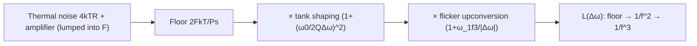

> **β**: This English translation is in beta — the Traditional-Chinese original is the authoritative version.

# Leeson Model Derivation and ISF Comparison

> **Prerequisites / See also**: [tank_Q_and_energy_restoration](/02_foundations/tank_Q_and_energy_restoration) (the energy definition of $Q$, why the tank shapes $1/f^2$), [psd_phase_noise_jitter](/02_foundations/psd_phase_noise_jitter) ($4kTR$ thermal noise and PSD basics), [white_noise_to_phase_noise](/03_isf_core_theory/white_noise_to_phase_noise) (the ISF-version $1/f^2$ derivation) | **Next**: [symmetry](/06_design_insights/symmetry) (using $c_0$ symmetry to suppress the $1/f^3$ corner), [references](/99_appendix/references) (external literature [E1])

Before Hajimiri–Lee's ISF theory ([P1], 1998) appeared, engineers estimated oscillator phase noise using the **Leeson model** (1966). It is a **semi-empirical** formula: the physical skeleton (tank filtering + feedback) is correct, but it packs in a noise factor $F$ that is "unknown where it comes from — has to be fit from measurement." This page derives Leeson from scratch, then maps it **term by term** onto the closed-form ISF result — you'll see that ISF theory "explains why Leeson looks the way it does, and replaces that mysterious $F$ with a computable physical quantity."

> **Honesty note (read first)**: **the Leeson model comes from [E1] D. B. Leeson, "A Simple Model of Feedback Oscillator Noise Spectrum," Proc. IEEE, vol. 54, no. 2, pp. 329–330, Feb. 1966**, **not among the five source PDFs downloaded for this site**. This page relies only on standard-literature knowledge for background and comparison; the volume/issue/pages/DOI have been **verified online** (DOI 10.1109/PROC.1966.4682); $F$ (noise figure) is inherently an **empirically fitted parameter** of the Leeson model (implementation-dependent), not a fixed constant. By contrast, the ISF formulas in the right half of this page ([P1] Eqs.(21),(23),(24)) are authoritative, verified expressions from within the five source PDFs.

This page answers:

1. Physically, where does each term of the Leeson expression (floor, $1/f^2$, $1/f^3$) come from?
2. Why are the slopes $1/f^2$ and $1/f^3$, and where is the corner?
3. Which ISF quantities do Leeson's $Q$, $F$, $\omega_{1/f^3}$ correspond to? Which ones does ISF explain more clearly?
4. How does [P1] itself prove that "existing LTI models are simplified cases of ISF" (Sec.III-F Eq.(28)–(29))? Where does the famous 2× difference come from?

> **Physical intuition (conclusion first)**: Leeson treats the oscillator as "a feedback system continuously fed by thermal noise and narrowband-filtered by a high-$Q$ tank." Three things stack up: (1) the amplifier/tank injects a **white noise floor** ($2FkT/P_s$); (2) because it is an **autonomous oscillator**, phase perturbations near the carrier have no restoring force, so the closed loop multiplies the noise by a $(\omega_0/2Q\Delta\omega)^2$ "phase-integration" transfer function, producing the $1/f^2$ skirt; (3) the device's $1/f$ flicker noise gets upconverted by one more order, producing the $1/f^3$ closest to the carrier. ISF theory tells **the same three-part story**, only it replaces $1/2Q$ with $\Gamma_{rms}/q_{max}$, and replaces $F$ with a physical quantity computable from $\Gamma_{eff}$.

## The full formula (state it first, then derive step by step)

Leeson model (spec 10.2, **external literature, not one of the five PDFs**):

$$
\mathcal{L}(\Delta\omega)=10\log_{10}\!\left[\frac{2FkT}{P_s}\left(1+\Big(\frac{\omega_0}{2Q\,\Delta\omega}\Big)^2\right)\left(1+\frac{\omega_{1/f^3}}{\lvert\Delta\omega\rvert}\right)\right]
$$

Symbols: $F$ = amplifier **noise figure** (empirical quantity, dimensionless); $k$ = Boltzmann constant (J/K); $T$ = temperature (K); $P_s$ = oscillation signal power (W); $Q$ = tank quality factor (dimensionless); $\omega_0$ = carrier angular frequency (rad/s); $\Delta\omega$ = offset angular frequency (rad/s); $\omega_{1/f^3}$ = flicker corner (rad/s).

Below, the three factors inside the brackets are derived one at a time.

## Step 1: tank thermal noise — the noise floor $2FkT/P_s$

Treat the oscillator as a "feedback loop of amplifier + resonant tank." The thermal-noise source in the loop is the tank's loss resistance $R$ (parallel-equivalent), whose single-sided thermal-noise voltage PSD (Johnson–Nyquist) is:

$$
\frac{\overline{v_n^2}}{\Delta f}=4kTR.
$$

- **Physics used**: resistor thermal noise $4kTR$ (standard result; see [psd_phase_noise_jitter](/02_foundations/psd_phase_noise_jitter)).
- **Dimension check**: $[kT]=\text{J}=\text{V·C}$, $[kTR]=\text{V·C·}\Omega=\text{V}^2\text{·s}=\text{V}^2/\text{Hz}$ ✓.

The amplifier itself also adds noise; the whole thing is lumped into a single **noise figure $F$** (which packages "actual total noise" over "input thermal noise alone" into one ratio). Normalizing the noise power against the carrier power $P_s$ gives the **phase-noise floor near the carrier**:

$$
\mathcal{L}_{\text{floor}}=\frac{2FkT}{P_s}.
$$

- **$F$ is Leeson's "empirical escape hatch"**: it absorbs all the noise that isn't explicitly modeled (amplifier, conversion loss, cyclostationary effects, ...) into a single measurement-fit number. **This is exactly what ISF later replaces** (see Step 5's comparison).
- **Where the 2 comes from**: this is a bookkeeping convention of the Leeson model (not the only way to write it — it varies by reference). Physically there are actually **two factors, pulling in opposite directions**: (1) **AM/PM equipartition** — thermal noise perturbs amplitude and phase simultaneously, and phase gets only half the power ($\times\tfrac12$); (2) **single-sideband (SSB) accounting** converts double-sided power to single-sided ($\times2$). The two cancel, so the "cleanest" way to write the floor is actually $FkT/P_s$; writing it as $2FkT/P_s$ leaves the SSB convention **explicit in the leading constant** without folding the AM/PM $\tfrac12$ into $F$. This is the same kind of SSB/double-sided bookkeeping difference as [P1] Eq.(21)'s $4\Delta\omega^2$ vs. the time-domain $2\Delta\omega^2$ (see the factor-of-2 discussion in [white_noise_to_phase_noise](/03_isf_core_theory/white_noise_to_phase_noise)). ($F$ is an empirically fitted parameter, and the leading constant varies slightly by reference — this is precisely what ISF later replaces with $\Gamma_{rms}/q_{max}$.)
- **Dimension check**: $[2FkT/P_s]=\text{J}/\text{W}=\text{J}/(\text{J/s})=\text{s}=1/\text{Hz}$ ✓ ($\mathcal{L}$ is relative power per hertz, dBc/**Hz**).

## Step 2: narrowband filtering by the high-$Q$ tank → the $1/f^2$ skirt

The tank is a narrowband filter. Near the carrier, at offset $\Delta\omega$, the phase/amplitude response slope of the parallel RLC is set by $Q$. The standard result: the (half-power) transfer of the tank at offset $\Delta\omega$ can be written as

$$
\left|H(\Delta\omega)\right|^2\;\propto\;\left(\frac{\omega_0}{2Q\,\Delta\omega}\right)^2\qquad(\Delta\omega\ll\omega_0/2Q).
$$

- **The physics of $Q$**: $Q=\omega_0/\Delta\omega_{3dB}$ = "how sharp the resonance peak is" = stored/dissipated energy ratio per cycle $\times2\pi$. The higher the $Q$, the narrower the tank bandwidth, the steeper the phase slope, and the stronger the suppression of offset noise.
- **Why $1/\Delta\omega^2$ (i.e., $-20$ dB/dec)**: an autonomous oscillator's phase is a **neutral direction** (no restoring force, echoing $\lambda_1=0$ in [derivation_floquet_ppv](/99_appendix/derivation_floquet_ppv)). The closed loop is equivalent to one **integration** of the phase perturbation, which in the frequency domain is $\times 1/\Delta\omega$; squaring for power gives $1/\Delta\omega^2$. This is the fundamental reason phase noise must be $1/f^2$ in the mid-band, slope $-20$ dB/dec — **it shares the same origin as ISF's $1/\Delta\omega^2$** ([P1] Eq.(21)).
- **Dimension check**: $\omega_0/(2Q\Delta\omega)$ is dimensionless (rad/s ÷ rad/s) ✓, so the whole transfer is dimensionless.

Multiplying Steps 1 and 2 (floor × tank shaping) gives the first two terms in the brackets:

$$
\mathcal{L}_{1/f^2+\text{floor}}=\frac{2FkT}{P_s}\left(1+\Big(\frac{\omega_0}{2Q\,\Delta\omega}\Big)^2\right).
$$

- The $1$ in "$1+$" is the **white noise floor** (dominant at far offset, flat); $(\omega_0/2Q\Delta\omega)^2$ is the **$1/f^2$ skirt** (dominant near the carrier). Where the two are equal is the corner where $1/f^2\to$ floor, $\Delta\omega\approx\omega_0/2Q$.

## Step 3: device flicker → the $1/f^3$ region closest to the carrier

The device's low-frequency $1/f$ (flicker) noise gets "upconverted" near the carrier by the oscillator's nonlinearity, and after the phase integration of Step 2, becomes a $1/f^3$ steeper than $1/f^2$. Leeson attaches it with a multiplicative factor:

$$
\left(1+\frac{\omega_{1/f^3}}{\lvert\Delta\omega\rvert}\right).
$$

- When $\Delta\omega\gg\omega_{1/f^3}$: this factor $\approx1$, flicker is invisible, leaving just $1/f^2$ and the floor.
- When $\Delta\omega\ll\omega_{1/f^3}$: this factor $\approx\omega_{1/f^3}/\lvert\Delta\omega\rvert\propto1/\Delta\omega$, which **further multiplies** the $1/\Delta\omega^2$ from Step 2 → total $1/\Delta\omega^3$, i.e., **$1/f^3$, $-30$ dB/dec**.
- **$\omega_{1/f^3}$ is the "flicker corner of the phase noise"**, **not** the device's own $1/f$ corner. Leeson never explains what determines it — **this is exactly the key physics ISF fills in** (Step 5, [P1] Eq.(24)).
- **Dimension check**: $\omega_{1/f^3}/\lvert\Delta\omega\rvert$ dimensionless ✓.

Multiplying all three terms gives the full Leeson formula from the top. Three slope segments: **floor (flat) → $1/f^2$ ($-20$ dB/dec) → $1/f^3$ ($-30$ dB/dec)**, from far to near.



## Step 4: Leeson vs ISF overlay

Plotting the Leeson formula and the ISF result ([P1] Eqs.(21),(23),(24)) on the same log–log axes, the three segments ($1/f^3$, $1/f^2$, floor) **overlap** — the two models describe the same curve, just with different physical meanings assigned to the parameters:


> **Translator's note**: this figure is generated by a script with Chinese text baked into the image. Title reads: "Leeson vs ISF：同樣的 1/f³ / 1/f² / floor 三段" = Leeson vs. ISF: the same three segments — 1/f³ / 1/f² / floor.

- **Formula correspondence**: left half is the Leeson expression from the top (external literature); right half is [P1] Eq.(21) ($1/f^2$), Eq.(23) ($1/f^3$), Eq.(24) ($1/f^3$ corner).
- **script / function**: `simulations/lab_16_leeson_vs_isf.py` (`main`), corresponding to `leeson_vs_isf_overlay.png` in the spec 10.1 table (lab_16). **This is a pedagogical toy model, not transistor-level**; the Leeson curve is drawn illustratively for the $1/f^2$ segment using functions like `leeson_one_over_f2` from `simulations/common/noise_utils.py`, and the constants used to stitch the three segments are for teaching illustration only.
- **How to read it**: the two curves are exactly parallel in the mid-band $1/f^2$ region (both slope $-20$ dB/dec, since both come from "phase integration $1/\Delta\omega^2$"); near the carrier both turn into $1/f^3$; far out both flatten to the floor. The only difference is where the corner falls and the absolute level — which is set by the parameter correspondence, see below.
- **Note**: in the overlay, the Leeson segment's $F,Q,\omega_{1/f^3}$ and the ISF segment's $\Gamma_{rms},q_{max},c_0,\omega_{1/f}$ are **illustrative teaching values** (lab_16 parameters), used to show the three-segment slope overlap, not measurements of a specific circuit.

## Step 5: term-by-term comparison (Leeson ↔ ISF)

This is the core of this page. Putting the corresponding terms of both models side by side:

| Segment | Leeson (empirical, [E1] 1966, not one of the five PDFs) | ISF ([P1] 1998, within the five PDFs) | Correspondence and where "ISF is clearer" |
|---|---|---|---|
| **$1/f^2$ shaping** | $\Big(\dfrac{\omega_0}{2Q\,\Delta\omega}\Big)^2$ | $\dfrac{\Gamma_{rms}^2}{q_{max}^2}\cdot\dfrac{1}{\Delta\omega^2}$ ([P1] Eq.(21)) | Both give $1/\Delta\omega^2$. Leeson's $\dfrac{1}{2Q}$ ↔ ISF's $\dfrac{\Gamma_{rms}}{q_{max}}\times$ (including carrier/noise-power normalization). **$Q$↔$\Gamma_{rms}/q_{max}$**: high $Q$ = low $\Gamma_{rms}/q_{max}$ = low phase noise. |
| **Noise source/level** | $\dfrac{2FkT}{P_s}$, $F$ empirically fit | $\dfrac{\overline{i_n^2}/\Delta f}{4}$ paired with $\Gamma_{eff}$ (including cyclostationary) | **Empirical $F$ vs ISF physical**: Leeson's $F$ is "you only know it once you measure it"; ISF splits it into a computable device noise PSD × $\Gamma_{eff}$, which can even fold in cyclostationary gating (see [effective_isf](/03_isf_core_theory/effective_isf)). |
| **$1/f^3$ corner** | $\omega_{1/f^3}$ (Leeson never says what sets it) | $\Delta\omega_{1/f^3}=\omega_{1/f}\dfrac{c_0^2}{2\Gamma_{rms}^2}\approx\omega_{1/f}\Big(\dfrac{c_0}{c_1}\Big)^2$ ([P1] Eq.(24)) | **ISF's signature insight**: the $1/f^3$ corner is **not equal** to the device's own $1/f$ corner $\omega_{1/f}$, but is scaled by $(c_0/\Gamma_{rms})^2$. **Waveform symmetry → $c_0\to0$ → corner pushed far below $\omega_{1/f}$**. Leeson gives no visibility into this design lever at all. |

Key comparisons expanded:

**(a) $Q\leftrightarrow\Gamma_{rms}/q_{max}$.** Both are "the efficiency with which noise is converted into a phase skirt." Leeson says "higher $Q$ is better"; ISF says "smaller $\Gamma_{rms}/q_{max}$ is better." But ISF is more general: it also holds for **ring oscillators with no high-$Q$ tank** (a ring has no $Q$ to speak of, but does have $\Gamma_{rms},q_{max}$; see [lab_03](/04_simulation_labs/lab_03_ring_oscillator_toy_model)). This is the first way ISF goes beyond Leeson.

**(b) Empirical $F$ vs ISF physical.** Leeson's $F$ is a black box: you must first build the oscillator, measure the phase noise, and back out $F$, before you can "predict" with the model — which is really post-hoc fitting, not prediction. ISF writes the same level as $\dfrac{\overline{i_n^2}/\Delta f}{4q_{max}^2}\Gamma_{rms}^2$ ([P1] Eq.(21)), where every quantity can be computed **ahead of time** from the device model and waveform, and cyclostationary behavior (device leaking noise only at certain phases) can be folded in via $\Gamma_{eff}=\Gamma\cdot\alpha$ — this is exactly why the Colpitts's "effective $F$" is much lower than a naive Leeson estimate (see [effective_isf](/03_isf_core_theory/effective_isf)).

**(c) $1/f^3$ corner.** Leeson simply takes $\omega_{1/f^3}$ as an input parameter, effectively admitting "I don't know where it comes from." Early engineering practice even mistook it for the device's own $1/f$ corner. ISF's [P1] Eq.(24) settles it: $\Delta\omega_{1/f^3}=\omega_{1/f}\cdot c_0^2/(2\Gamma_{rms}^2)$ — it is set by **the ISF's DC coefficient $c_0$** (waveform symmetry). **Making rise/fall symmetric → $c_0\to0$ → the $1/f^3$ corner drops sharply → near-carrier phase noise falls substantially**. This is a design rule Leeson simply cannot give, and it is the theoretical basis for [P2]'s use of symmetry to suppress ring phase noise (see [symmetry](/06_design_insights/symmetry), [flicker_noise_upconversion](/03_isf_core_theory/flicker_noise_upconversion)).

## Step 6: [P1]'s own reduction — Sec.III-F "Existing Models as Simplified Cases" (Eq.(28)–(29))

The first five steps are an **external** comparison, "Leeson versus ISF." [P1] itself also performs an **internal reduction** in Sec.III-F (p.187): take the general ISF expression Eq.(19), impose every simplifying assumption of the LTI model, and see what it collapses to. This is the most persuasive evidence on this page — **the two models do not merely "overlap as curves"; one is a special case of the other's formula**.

**(1) What the LTI assumptions mean in ISF language.** [P1] p.187 lists the four assumptions of the LTI models (its references [3] and [8]): linear time-invariance, all noise sources stationary, only noise in the vicinity of $\omega_0$ matters, and a noise-free waveform that is a perfect sinusoid. Translated through the ISF Fourier series ([P1] Eq.(12)): **discard every term except $c_1$, and set $c_1=1$** ([P1] p.187, verified on the rendered page). That is exactly the ISF of the ideal LC oscillator ([lab_02](/04_simulation_labs/lab_02_lc_oscillator_toy_model), [capstone](/03_isf_core_theory/capstone_lc_end_to_end)):

$$
\Gamma(\theta)=-\sin\theta=\cos\!\big(\theta+\tfrac{\pi}{2}\big)\;\Rightarrow\;c_0=0,\quad c_1=1,\quad c_{n\ge2}=0,\quad \Gamma_{rms}^2=\frac{1}{2\pi}\int_0^{2\pi}\sin^2\theta\,d\theta=\tfrac12 .
$$

Parseval ([P1] Eq.(20)) is self-consistent: $\sum c_n^2=c_1^2=1=2\Gamma_{rms}^2$ ✓, hence $\Gamma_{rms}=1/\sqrt2\approx0.707$ (this site's "true LC" value; the representative $0.5$ is a deliberately conservative teaching value, see [white_noise_to_phase_noise](/03_isf_core_theory/white_noise_to_phase_noise)). $c_0=0$ also explains something: **an ideal sinusoidal LC has no $1/f^3$ upconversion** — the LTI model cannot see what sets $\omega_{1/f^3}$ precisely because it threw $c_0$ away along with everything else.

**(2) Inject the thermal noise of the tank's parallel resistor ([P1] Eq.(28), p.187).** Consider the RLC oscillator of [P1] Fig. 2 and count only one noise source, the tank parallel resistor $R_p$:

$$
\frac{\overline{i_n^2}}{\Delta f}=\frac{4kT}{R_p},\qquad q_{max}=C\cdot V_{max}.
$$

- $4kT/R_p$: the Norton (current) version of Step 1's $4kTR$ (single-sided PSD, A²/Hz).
- $q_{max}=CV_{max}$: the maximum charge swing on the tank capacitor — this is the paper's origin of the site-wide definition $q_{max}=C\cdot V_{max}$, and it is the "translation dictionary" between LTI variables ($C$, $V_{max}$) and the ISF variable ($q_{max}$).

**(3) Substitute into Eq.(19) to get Eq.(29).** [P1] Eq.(19) (white-noise summation, p.185):

$$
\mathcal{L}\{\Delta\omega\}=10\log_{10}\!\left(\frac{\overline{i_n^2}/\Delta f\;\sum_{n=0}^{\infty}c_n^2}{8\,q_{max}^2\,\Delta\omega^2}\right).
$$

Substituting $\sum c_n^2=c_1^2=1$, $\overline{i_n^2}/\Delta f=4kT/R_p$, $q_{max}=CV_{max}$:

$$
\begin{aligned}
\mathcal{L}\{\Delta\omega\}
&=10\log_{10}\!\left(\frac{4kT/R_p}{8\,C^2V_{max}^2\,\Delta\omega^2}\right)
=10\log_{10}\!\left(\frac{kT}{2\,R_p\,C^2V_{max}^2\,\Delta\omega^2}\right)\\
&=10\log_{10}\!\left[\frac12\cdot\frac{kT}{V_{max}^2}\cdot\frac{1}{R_p\,(C\omega_0)^2}\cdot\Big(\frac{\omega_0}{\Delta\omega}\Big)^2\right].
\end{aligned}
$$

The last line is **[P1] Eq.(29), p.187** (verified verbatim against the rendered page) — it merely rewrites $C^2\Delta\omega^2$ as $(C\omega_0)^2(\Delta\omega/\omega_0)^2$ so that the "tank admittance $C\omega_0$" and the "relative offset $\omega_0/\Delta\omega$" can be read separately.

- **Dimension check**: $[kT/V_{max}^2]=\text{J/V}^2=\text{C/V}=\text{F}$; $[1/(R_p(C\omega_0)^2)]=1/(\Omega\cdot\text{S}^2)=\Omega$; $\text{F}\cdot\Omega=\text{s}=1/\text{Hz}$ ✓; $(\omega_0/\Delta\omega)^2$ is dimensionless ✓.
- **Physics**: $1/\Delta\omega^2$ (phase integration), $\propto1/R_p$ (larger $R_p$ = higher $Q$ = smaller noise current), $\propto1/(CV_{max})^2=1/q_{max}^2$ (larger charge swing is better) — every cell of the Step 5 table has a counterpart in this one expression.

**(4) Numbers (reusing the 5 GHz tank of [tank_Q_and_energy_restoration](/02_foundations/tank_Q_and_energy_restoration))**: $L=1$ nH, $C=1.013$ pF, $R_p=314\ \Omega$, $T=300$ K ($Q=\omega_0R_pC\approx10$), take $V_{max}=1$ V and $\Delta f=1$ MHz.

- $kT=1.380649\times10^{-23}\times300=4.142\times10^{-21}$ J; $\tfrac12\,kT/V_{max}^2=2.071\times10^{-21}$ F.
- $C\omega_0=1.013\times10^{-12}\times3.1416\times10^{10}=3.182\times10^{-2}$ S; $R_p(C\omega_0)^2=314\times1.0128\times10^{-3}=0.3180$ S, reciprocal $=3.145\ \Omega$.
- $(\omega_0/\Delta\omega)^2=(5\times10^9/10^6)^2=2.5\times10^7$.
- Multiply: $2.071\times10^{-21}\times3.145\times2.5\times10^7=1.628\times10^{-13}$ (units F·Ω = s ✓) → $\mathcal{L}=10\log_{10}(1.628\times10^{-13})=-127.9$ dBc/Hz.
- **Recomputing with Eq.(21) must give the same value** ($\Gamma_{rms}^2=\tfrac12$, $q_{max}=CV_{max}=1.013$ pC, $S_i=4kT/R_p=5.276\times10^{-23}$ A²/Hz): $\dfrac{0.5}{(1.013\times10^{-12})^2}\cdot\dfrac{5.276\times10^{-23}}{4\,(2\pi\times10^6)^2}=1.628\times10^{-13}$ ✓.
- **Against canonical Example B's $-148.0$ dBc/Hz** ($S_i=10^{-24}$ A²/Hz, $\Gamma_{rms}=0.5$, $q_{max}=1$ pC): here $S_i$ is 52.8× larger ($+17.2$ dB), $\Gamma_{rms}^2$ is 2× larger ($+3.0$ dB), $q_{max}^2$ is $1.013^2$× larger ($-0.1$ dB): $-148.0+17.2+3.0-0.1=-127.9$ ✓.

**(5) The Craninckx–Steyaert 2×, and the true face of this site's factor-of-2.** [P1] p.187 then notes that its reference [8] (J. Craninckx and M. Steyaert, "Low-noise voltage controlled oscillators using enhanced LC-tanks," IEEE Trans. Circuits Syst. II, vol. 42, no. 12, pp. 794–804, Dec. 1995; **external literature, not among this site's five PDFs**; [P1]'s reference list prints pp. 794–904, evidently a misprint for 804) assumes equal contributions from amplitude and phase to $\mathcal{L}_{total}$, so the result of [8] is **exactly twice Eq.(29)**. In other words, the chain Eq.(19)→(29) **counts only the phase half**; the LTI model's $\mathcal{L}_{total}$ (the measurement definition of [P1] Eq.(2), p.180, AM included) also counts amplitude noise.

This site adds one more cross-check of its own (not in the paper; rerun it with the Python below): take the Leeson-form Eq.(6) of [P1] p.181 with $F=1$ and convert with $Q=\omega_0R_pC$, $P_s=V_{max}^2/(2R_p)$:

$$
\frac{2kT}{P_s}\Big(\frac{\omega_0}{2Q\,\Delta\omega}\Big)^2=\frac{4kTR_p}{V_{max}^2}\cdot\frac{\omega_0^2}{4\,\omega_0^2R_p^2C^2\,\Delta\omega^2}=\frac{kT}{R_p\,C^2V_{max}^2\,\Delta\omega^2}=2\times\big[\text{Eq.(29)}\big].
$$

So within [P1]'s own bookkeeping, **Eq.(6) at $F=1$ is also 3 dB above Eq.(29)** ($-124.9$ vs $-127.9$ dBc/Hz) — even though [P1] notes just below Eq.(6) that its $\tfrac12$ comes from neglecting amplitude noise. This 2 is the same 2 as the "clean time-domain $/2$ vs Eq.(21)'s $/4$" of the factor-of-2 note in [white_noise_to_phase_noise](/03_isf_core_theory/white_noise_to_phase_noise) (canonical Example B's $-145$ vs $-148$ dBc/Hz), and it is the well-known minor controversy in the literature. This site lists it honestly and **does not adjudicate** which constant is "right": **the scaling ($\propto1/(R_pC^2V_{max}^2\Delta\omega^2)$) and the $-20$ dB/dec slope are physics; the 2 is AM/PM and SSB bookkeeping convention**.

**(6) Closing the loop with the Step 5 $F$/$Q$ mapping.** From the identity above, Eq.(29) $=\tfrac12\cdot\tfrac{2kT}{P_s}\big(\tfrac{\omega_0}{2Q\Delta\omega}\big)^2$, i.e.

$$
\mathcal{L}\{\Delta\omega\}=10\log_{10}\!\left[\frac{kT}{P_s}\Big(\frac{\omega_0}{2Q\,\Delta\omega}\Big)^2\right]
$$

(ideal sinusoidal LC, tank $R_p$ thermal noise only).

- This is the $1/f^2$ term of the Leeson expression, **and its leading constant lands exactly on the "cleanest form" $FkT/P_s$ of Step 1 with $F=1$**; forcing it into the $2FkT/P_s$ form at the top of this page is equivalent to $F=\tfrac12$. [P1] p.187 states that (29) together with (24) yields (6) — the whole difference is how much bookkeeping constant $F$ absorbs.
- **Explicit identity for $Q\leftrightarrow\Gamma_{rms}/q_{max}$**: ISF side $\dfrac{\Gamma_{rms}^2}{q_{max}^2}\cdot\dfrac{\overline{i_n^2}/\Delta f}{4}=\dfrac12\cdot\dfrac{4kT/R_p}{4C^2V_{max}^2}=\dfrac{kT}{2R_pC^2V_{max}^2}$; Leeson side $\dfrac{kT}{P_s}\cdot\dfrac{\omega_0^2}{4Q^2}=\dfrac{2kTR_p}{V_{max}^2}\cdot\dfrac{1}{4R_p^2C^2}=\dfrac{kT}{2R_pC^2V_{max}^2}$ — the two sides are identical term by term ✓. This turns Step 5(a)'s "$1/2Q\leftrightarrow\Gamma_{rms}/q_{max}$ (with normalization)" into a checkable equation.
- **The ISF version of $F$ is no longer a black box**: for any real ISF, the role of $F$ is taken over by $\sum c_n^2=2\Gamma_{rms}^2$ (relative to the ideal LC's $c_1^2=1$) and by $\Gamma_{eff}$ (cyclostationarity); $\omega_{1/f^3}$ is taken over by Eq.(24)'s $c_0^2/(2\Gamma_{rms}^2)$. [P1] p.187 states explicitly that the generalized approach can **compute** the fitting parameters $F$ and $\Delta\omega_{1/f^3}$ of Eq.(3) from the ISF coefficients $c_n$ and the device $\omega_{1/f}$ — that sentence is the paper's original source for all three rows of the Step 5 table.

Python verification (`# ->` lines are actual run output):

```python
import numpy as np
from simulations.common.isf_utils import gamma_rms, compute_fourier_coefficients
# (1) Ideal-LC ISF Γ(θ) = -sin θ: only c1, and c1 = 1 (the LTI setting of [P1] p.187)
theta = np.linspace(0, 2*np.pi, 4097)          # endpoint included, for the trapezoidal rule
gam = -np.sin(theta)
c0, _, _, c, _ = compute_fourier_coefficients(theta, gam, 3)   # c[n] = c_n
Grms = gamma_rms(theta, gam)
print(round(float(c0), 4), round(float(c[1]), 4), round(float(c[2]), 4), round(float(Grms), 4))
# -> 0.0 1.0 0.0 0.7071   (c0, c1, c2, Γrms; Parseval: c1² = 1 = 2Γrms²)
# (2) [P1] Eq.(28): the 5 GHz tank of the tank_Q page (L=1 nH, C=1.013 pF, Rp=314 Ω, T=300 K), Vmax = 1 V
k, T = 1.380649e-23, 300.0
f0, C, Rp, Vmax = 5e9, 1.013e-12, 314.0, 1.0
w0 = 2*np.pi*f0
Q  = w0*Rp*C
Si = 4*k*T/Rp            # A²/Hz
qmax = C*Vmax            # C
dw = 2*np.pi*1e6         # Δω @ 1 MHz
print(round(Q, 3), f"{Si:.3e}", f"{qmax:.3e}")
# -> 9.993 5.276e-23 1.013e-12   (Q, i_n²/Δf [A²/Hz], q_max [C])
# (3) [P1] Eq.(29) vs Eq.(19) (c1 only) vs Eq.(21) (Γrms² = 1/2) — all three must agree
L29 = 0.5*k*T/Vmax**2 / (Rp*(C*w0)**2) * (w0/dw)**2
L19 = Si*c[1]**2 / (8*qmax**2*dw**2)
L21 = Grms**2/qmax**2 * Si/(4*dw**2)
print(round(10*np.log10(L29), 2), round(10*np.log10(L19), 2), round(10*np.log10(L21), 2))
# -> -127.88 -127.88 -127.88   (dBc/Hz @ 1 MHz)
# (4) Leeson-form cross-check: [P1] Eq.(6) with F = 1, and the closing form (kT/Ps)(ω0/2QΔω)²
Ps = Vmax**2/(2*Rp)
L6 = 2*k*T/Ps * (w0/(2*Q*dw))**2
L29_leeson = k*T/Ps * (w0/(2*Q*dw))**2
print(round(10*np.log10(L6), 2), round(L6/L29, 4), round(L29_leeson/L29, 4))
# -> -124.87 2.0 1.0   (Eq.(6)|F=1 is 3 dB above Eq.(29) = exactly 2×; Eq.(29) ≡ (kT/Ps)(ω0/2QΔω)²)
```

> **Applicability**: Eq.(29) is an equality only when all four LTI assumptions hold (ideal sinusoid, $c_1$ only, stationary noise, only the neighborhood of $\omega_0$ counted). A ring oscillator ($c_{n\ge2}\neq0$, $\Gamma_{rms}\propto N^{-3/2}$), an asymmetric waveform ($c_0\neq0$ → $1/f^3$), or cyclostationary device noise ($\Gamma_{eff}=\Gamma\alpha$) all break it — then go back to Eq.(19)/(21) with the real $c_n$ and $\Gamma_{eff}$, and $F$ is computed automatically instead of being fitted.

## Numerical example (building intuition)

> **Example ($1/f^3$ corner comparison)**: take a device $1/f$ corner $f_{1/f}=1$ MHz ($\omega_{1/f}=2\pi\times10^6$ rad/s). Compare the phase-noise $1/f^3$ corner of a "symmetric" vs. an "asymmetric" waveform.

ISF's [P1] Eq.(24): $\Delta\omega_{1/f^3}=\omega_{1/f}\cdot c_0^2/(2\Gamma_{rms}^2)$, take $\Gamma_{rms}=0.5$.

- **Asymmetric waveform** (large $c_0$, set $c_0=0.4$):
  

$$
\Delta\omega_{1/f^3}=\omega_{1/f}\cdot\frac{(0.4)^2}{2(0.5)^2}=\omega_{1/f}\cdot\frac{0.16}{0.5}=0.32\,\omega_{1/f}.
$$

  That is, $f_{1/f^3}\approx0.32\times1\ \text{MHz}=320$ kHz — the $1/f^3$ skirt extends far from the carrier.
- **Symmetric waveform** (small $c_0$, set $c_0=0.04$, 10× smaller):
  

$$
\Delta\omega_{1/f^3}=\omega_{1/f}\cdot\frac{(0.04)^2}{2(0.5)^2}=\omega_{1/f}\cdot\frac{0.0016}{0.5}=3.2\times10^{-3}\,\omega_{1/f}.
$$

  That is, $f_{1/f^3}\approx3.2$ kHz — the corner drops **100×** (because $c_0$ is squared: a 10× reduction in $c_0$ → 100× reduction in the corner).

- **Dimension check**: $c_0^2/\Gamma_{rms}^2$ is dimensionless, $\omega_{1/f}\times$dimensionless $=$ rad/s ✓.
- **Intuition**: Leeson treats $\omega_{1/f^3}$ as "fixed by nature"; ISF tells you it is a **knob the designer can turn by two orders of magnitude via symmetry**. This is ISF's practical value.

One-line Python verification (corner ratio):

```python
import numpy as np
from simulations.common.isf_utils import gamma_rms
# Ratio of the 1/f^3 corner for a symmetric vs asymmetric waveform = (c0_asym/c0_sym)^2
c0_asym, c0_sym, Gamma_rms = 0.4, 0.04, 0.5
w1f = 2*np.pi*1e6
corner_asym = w1f * c0_asym**2 / (2*Gamma_rms**2)
corner_sym  = w1f * c0_sym**2  / (2*Gamma_rms**2)
print(corner_asym/(2*np.pi)/1e3, "kHz ;", corner_sym/(2*np.pi)/1e3, "kHz")
# -> ~320.0 kHz ; ~3.2 kHz   (a symmetric waveform pushes the 1/f^3 corner down 100x)
```

(For `gamma_rms` and related library functions, see `simulations/common/isf_utils.py`; this example computes the corner directly by hand from [P1] Eq.(24).)

## Applicability and failure conditions

| Condition | When Leeson holds | What happens when it fails |
|---|---|---|
| High-$Q$ resonant tank present | $(\omega_0/2Q\Delta\omega)^2$ shaping is accurate | No-$Q$ topologies like ring don't apply → use ISF's $\Gamma_{rms}/q_{max}$ instead |
| $F$ obtainable by measurement fit | Curve can be fit post-hoc | Want to **predict ahead of time** or decompose the physics → must use ISF ($F$ is a black box) |
| $\omega_{1/f^3}$ known | $1/f^3$ segment matches | Want to know what sets the corner / how to suppress it → ISF Eq.(24) ($c_0$, symmetry) |
| Linear/weakly nonlinear, additive noise | Three-segment model suffices | Strongly cyclostationary → only ISF's $\Gamma_{eff}=\Gamma\alpha$ gets it right |
| Ideal sinusoidal LC, tank $R_p$ thermal noise only (Step 6) | [P1] Eq.(29) is exactly Leeson's $1/f^2$ term: $\tfrac{kT}{P_s}(\tfrac{\omega_0}{2Q\Delta\omega})^2$ ($F=1$ in the $FkT/P_s$ form) | $c_{n\ge2}\neq0$, $c_0\neq0$, cyclostationary → back to Eq.(19)/(21); $F$ is computed from $2\Gamma_{rms,eff}^2$ and $c_0$, not fitted |

## Corresponding papers/equations

- **The Leeson model itself**: [E1] D. B. Leeson, Proc. IEEE 54(2):329–330, Feb. 1966 — **not among the five downloaded source PDFs**; volume/DOI verified (10.1109/PROC.1966.4682, see [E1] in [references](/99_appendix/references)); this formula is the standard Leeson form ($F$ is an empirical noise factor, leading constant varies slightly by reference).
- **ISF comparison equations (within the five PDFs, verified)**: $1/f^2$ [P1] Eq.(21), p.185; $1/f^3$ [P1] Eq.(23), p.185; $1/f^3$ corner [P1] Eq.(24), p.185; device flicker [P1] Eq.(22), p.185.
- **Cyclostationary (explaining "effective $F$")**: [P1] Eqs.(25)–(27), p.186 (see [effective_isf](/03_isf_core_theory/effective_isf)).
- **[P1]'s internal reduction (Step 6)**: Sec.III-F Eq.(28)–(29), p.187 ($c_1=1$, $4kT/R_p$, $q_{max}=CV_{max}$); Leeson-form Eq.(3), p.180 and Eq.(6), p.181; measurement definition $\mathcal{L}_{total}$ Eq.(2), p.180; its reference [8] Craninckx–Steyaert, IEEE TCAS-II 42(12):794–804, Dec. 1995 (**external literature, not among this site's five PDFs**).
- **Overlay plot**: `/figures/leeson_vs_isf_overlay.png`, `simulations/lab_16_leeson_vs_isf.py` (spec 10.1, lab_16).

## Key takeaways

- Leeson (1966, **external, not one of the five PDFs**) = a semi-empirical three-term expression: $\mathcal{L}=10\log_{10}\!\big[\tfrac{2FkT}{P_s}(1+(\tfrac{\omega_0}{2Q\Delta\omega})^2)(1+\tfrac{\omega_{1/f^3}}{\lvert\Delta\omega\rvert})\big]$.
- Three segments: white-noise **floor** ($2FkT/P_s$) → tank-shaped **$1/f^2$** ($-20$ dB/dec, from phase integration $1/\Delta\omega^2$) → flicker-upconverted **$1/f^3$** ($-30$ dB/dec).
- **Term-by-term correspondence**: $Q\leftrightarrow\Gamma_{rms}/q_{max}$ (high $Q$ = low $\Gamma_{rms}/q_{max}$); empirical black-box $F$ ↔ ISF's computable $\overline{i_n^2}\cdot\Gamma_{eff}$ (including cyclostationary); mysterious parameter $\omega_{1/f^3}$ ↔ [P1] Eq.(24), set by $c_0$ (symmetry).
- **ISF's three big advances**: (1) also holds for no-$Q$ rings; (2) computable ahead of time, not fit-dependent; (3) turns the $1/f^3$ corner into a design knob that symmetry can move by two orders of magnitude.
- The two models overlap on all three segments in a log–log plot (`leeson_vs_isf_overlay.png`) — the same curve, different physical languages.
- **[P1]'s own reduction (Sec.III-F)**: LTI assumptions ⇔ keep only $c_1=1$ ($\Gamma=-\sin\theta$, $\Gamma_{rms}=1/\sqrt2$); substituting $4kT/R_p$ and $q_{max}=CV_{max}$ into Eq.(19) gives Eq.(29) $=\tfrac{kT}{P_s}(\tfrac{\omega_0}{2Q\Delta\omega})^2$ — Leeson's $1/f^2$ term is a special case of ISF (5 GHz, $Q=10$, $V_{max}=1$ V example: $-127.9$ dBc/Hz @ 1 MHz); [8] Craninckx–Steyaert (external) is 2× larger because it counts AM and PM equally — the same 2 as this site's factor-of-2.

## Further reading

- $1/f^2$ white-noise derivation (ISF version): [white_noise_to_phase_noise](/03_isf_core_theory/white_noise_to_phase_noise)
- $1/f^3$ flicker upconversion and corner: [flicker_noise_upconversion](/03_isf_core_theory/flicker_noise_upconversion)
- How symmetry suppresses $c_0$: [symmetry](/06_design_insights/symmetry)
- "Effective $F$" and cyclostationary: [effective_isf](/03_isf_core_theory/effective_isf)
- PSD / phase noise / jitter basics: [psd_phase_noise_jitter](/02_foundations/psd_phase_noise_jitter)
- Rigorous foundation (PPV/Floquet): [derivation_floquet_ppv](/99_appendix/derivation_floquet_ppv)
- Full bibliography and external citations ([E1]): [references](/99_appendix/references)
