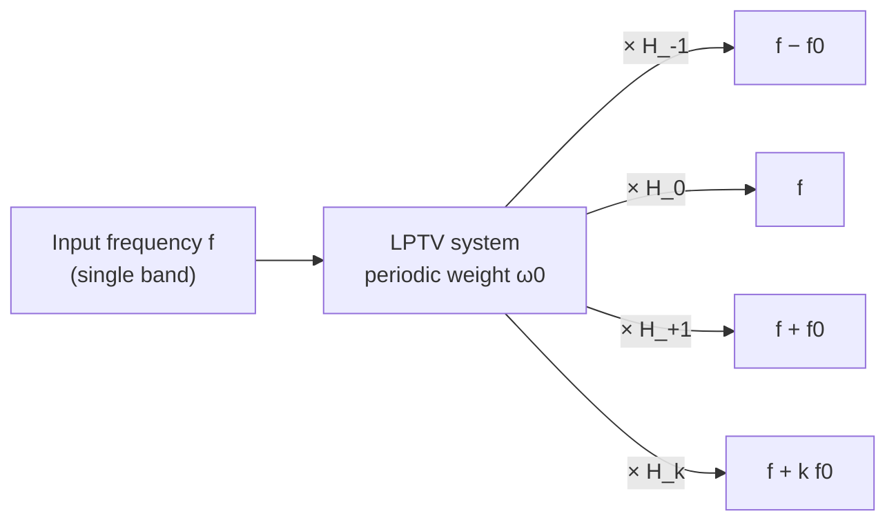

> **β**: This English translation is in beta — the Traditional-Chinese original is the authoritative version.

# Rigorous LTV framework: Zadeh's time-varying transfer function and the harmonic transfer matrix

> **Prerequisites**: [lti_vs_ltv](/02_foundations/lti_vs_ltv) (intuition for LTV vs. LTI), [convolution_derivation](/03_isf_core_theory/convolution_derivation) ([P1] Eq.(11)'s LTV convolution), [fourier_series_of_isf](/03_isf_core_theory/fourier_series_of_isf) (ISF Fourier coefficients $c_n$) | **Next**: [derivation_floquet_ppv](/99_appendix/derivation_floquet_ppv) (the PPV/Floquet face of the same ISF)

This site's main thread ([P1]) introduces the ISF via "physical intuition + impulse simulation," and
[convolution_derivation](/03_isf_core_theory/convolution_derivation) uses superposition to generalize a single impulse to arbitrary noise.
That path works very well, but leaves a gap: we keep saying the oscillator's response to noise is **LTV (linear time-varying)**,
"it acts like a **time-varying mixer** that shifts noise near $n\omega_0$ to the carrier" — but in the language of
**signals and systems**, exactly which rigorous object do these statements correspond to? Can "frequency gets shifted, gain is $c_k$"
be written as a clean transfer function?

This page fills in that **system-theory foundation**. Starting from the convolution/LTI framework the reader already knows, we work up to **Zadeh's
time-varying transfer function $H(f,t)$** and the **harmonic transfer matrix (HTM)**,
and then prove one statement:

> **The ISF (together with $1/q_{max}$) is exactly the "conversion vector from each input-harmonic band to the phase output" — its
> $k$-th component is precisely the $k$-th Fourier coefficient $c_k$ of the ISF.** In other words, the ISF's Fourier series $\{c_k\}$ is not
> merely a set of numbers — it is exactly the "phase-output row" of this LTV system's HTM.

> **Honesty note (read first)**: this page's **Zadeh time-varying transfer function $H(f,t)$, bi-frequency function, and harmonic transfer
> matrix (HTM)** belong to the broader theory of **linear time-varying systems** and are **not among the 5 PDFs hosted on this site**. The original concept comes from
> **[E5] L. A. Zadeh, "Frequency Analysis of Variable Networks," Proc. IRE, vol. 38, no. 3,
> pp. 291–299, Mar. 1950 (DOI 10.1109/JRPROC.1950.231083)**; the HTM formulation is standard in periodic-time-varying/RF circuit literature
> (e.g., cyclostationary, LPTV system analysis). **These are external mathematical frameworks; the formal [E5] citation (Zadeh 1950, Proc. IRE 38(3):291–299, DOI 10.1109/JRPROC.1950.231083) is recorded in [references](/99_appendix/references).** This page only uses them to "re-derive the ISF"; every correspondence to the ISF converges back to
> [P1] Eq.(13) (within the 5 PDFs, verified verbatim).

This page answers four questions:

1. How does LTI convolution generalize to LTV? (First connect to the reader's signals-and-systems background.)
2. How does Zadeh write "the LTV response to each input frequency $f$" as a time-varying transfer function $H(f,t)$?
3. When this LTV system is **periodic** (as an oscillator is), what structure does $H(f,t)$ collapse into — why does the input frequency $f$
   only get shifted to the discrete set $f+kf_0$, with gain $c_k$? This is the HTM.
4. Narrowing to the "phase output," how do we prove the ISF is exactly that conversion vector?

---

## Step 0: review LTI — convolution and a single transfer function (the reader's starting point)

The **LTI (linear time-invariant)** systems taught in signals-and-systems courses are completely determined by a single impulse response $h(\tau)$.
For an input $x(t)$, the output is a **convolution**:

$$
y(t)=\int_{-\infty}^{\infty}h(t-\tau)\,x(\tau)\,d\tau .
$$

- **Key feature**: the kernel $h$ depends only on the **time difference** $t-\tau$, not on absolute time. "Kicking it now" and "kicking it one beat later"
  give the same effect, just shifted in time.
- **The frequency domain is diagonal**: LTI's signature property is that complex exponentials are eigenfunctions. Substituting $x(t)=e^{j2\pi f t}$,

$$
y(t)=\int h(t-\tau)\,e^{j2\pi f\tau}\,d\tau
=e^{j2\pi f t}\underbrace{\int h(\sigma)\,e^{-j2\pi f\sigma}\,d\sigma}_{=\,H(f)},
$$

  (change of variables $\sigma=t-\tau$). The output is **the same frequency** $f$ multiplied by a complex gain $H(f)$.
- **This is the essence of LTI**: **input frequency $f$ in, only frequency $f$ out** — no new frequencies are generated. So a single transfer function $H(f)$
  suffices to describe everything — in the frequency domain, LTI is **diagonal** (different frequencies do not couple).
- **Dimension check**: $[h]=[y]/([x]\cdot\text{s})$ (convolution carries a $d\tau$); $H(f)=\int h\,e^{-j2\pi f\sigma}d\sigma$
  differs from $h$ by one $\text{s}$, so $[H]=[y]/[x]$ (a pure gain) ✓.

> Why is an oscillator **not** LTI? Because "kicking at the peak" and "kicking at the zero crossing" give wildly different effects — the kernel
> **depends on the absolute injection instant** (through $\Gamma(\omega_0\tau)$), not only on $t-\tau$. This is exactly what
> [lti_vs_ltv](/02_foundations/lti_vs_ltv) and [impulse_to_phase_shift](/03_isf_core_theory/impulse_to_phase_shift) Step 4 ("$h_\phi(t,\tau)$ depends on
> $\tau$") describe. Below we systematize this.

---

## Step 1: LTV — the kernel becomes a two-variable function $h(t,\tau)$

Relax LTI's "depends only on time difference" assumption: an **LTV** system's impulse response depends on **two** instants — "when the impulse
is applied ($\tau$)" and "when it is observed ($t$)." The output is written (per convention 11.2):

$$
\boxed{\ y(t)=\int_{-\infty}^{\infty}h(t,\tau)\,x(\tau)\,d\tau\ }
$$

- $h(t,\tau)$ reads as "the response measured at time $t$ to a unit impulse fired at time $\tau$."
- **LTI is a special case**: if the system is time-invariant, $h(t,\tau)=h(t-\tau)$, and the expression above collapses back to convolution. LTV
  loosens "$t-\tau$" into the "independent pair $(t,\tau)$" — the extra degree of freedom is exactly the mathematical container for the physical fact
  that "**when** you kick it matters."
- **Correspondence to the ISF**: [P1] Eq.(10), p.182's excess-phase impulse response
  $h_\phi(t,\tau)=\dfrac{\Gamma(\omega_0\tau)}{q_{max}}\,u(t-\tau)$ is exactly such an $h(t,\tau)$ — its dependence on $\tau$
  is entirely encoded in $\Gamma(\omega_0\tau)$, and its dependence on $t-\tau$ is just a unit step (the phase step is retained permanently). Substituting into the box above gives
  [P1] Eq.(11)'s $\phi(t)=\frac{1}{q_{max}}\int_{-\infty}^{t}\Gamma(\omega_0\tau)\,i_n(\tau)\,d\tau$
  (see [convolution_derivation](/03_isf_core_theory/convolution_derivation)). **So ISF theory was already an
  LTV convolution all along** — just with a particularly simple kernel.
- **Dimension check**: same as LTI, $[h(t,\tau)]=[y]/([x]\cdot\text{s})$ ✓.

---

## Step 2: Zadeh's time-varying transfer function $H(f,t)$ — "the instantaneous response to each frequency"

LTI needs only one $H(f)$. For LTV, the response to "each input frequency" **varies with the observation instant $t$**, so Zadeh (1950) defines a
**time-varying transfer function** $H(f,t)$: feed a pure sinusoid $x(\tau)=e^{j2\pi f\tau}$ into the system,
and write the output as "$e^{j2\pi f t}$ times a gain that varies with $t$":

$$
y(t)\big|_{x=e^{j2\pi f\tau}}=H(f,t)\,e^{j2\pi f t}.
$$

Substitute Step 1's LTV convolution into this, and change variables $\sigma=t-\tau$ (i.e., $\tau=t-\sigma$):

$$
y(t)=\int h(t,\tau)\,e^{j2\pi f\tau}\,d\tau
=\int h(t,\,t-\sigma)\,e^{j2\pi f(t-\sigma)}\,d\sigma
=e^{j2\pi f t}\underbrace{\int h(t,\,t-\sigma)\,e^{-j2\pi f\sigma}\,d\sigma}_{\equiv\,H(f,t)} .
$$

This yields **Zadeh's time-varying transfer function** (convention 11.2):

$$
\boxed{\ H(f,t)=\int_{-\infty}^{\infty}h(t,\,t-\sigma)\,e^{-j2\pi f\sigma}\,d\sigma\ }
$$

- **How to read it**: $H(f,t)$ is the "instantaneous complex gain **at this instant $t$**, for input frequency $f$." Its dependence on $f$ resembles LTI's $H(f)$;
  the extra dependence on $t$ is the entire content of being time-varying.
- **Degeneracy check**: when time-invariant, $h(t,t-\sigma)=h(\sigma)$ is independent of $t$, so $H(f,t)\to H(f)$, recovering LTI ✓.
- **Dimension check**: same as $H(f)$, $[H(f,t)]=[y]/[x]$ (a pure gain) ✓.
- **Why this still isn't "elegant" enough**: $H(f,t)$ is an arbitrary function of $t$, carrying the same amount of information as the entire $h(t,\tau)$ — no
  compression. The real magic comes in the next step — when the system is **periodic**, $H(f,t)$'s dependence on $t$ reduces to only discrete Fourier
  components, and the whole LTV system collapses into a **matrix** (the HTM).

---

## Step 3: periodic LTV → Fourier expansion of $H(f,t)$ → harmonic transfer matrix

In periodic steady state, an oscillator's LTV kernel is $T$-periodic: $h(t+T,\tau+T)=h(t,\tau)$ (invariant when $\tau$ and $t$ are both shifted by one
period). This class of systems is called **LPTV (linear periodically time-varying)**. Periodicity makes $H(f,t)$'s dependence on $t$
become $T$-periodic, so it can be expanded in a Fourier series in $t$:

$$
H(f,t)=\sum_{k=-\infty}^{\infty}H_k(f)\,e^{j2\pi k f_0 t},\qquad f_0=\frac1T,
$$

where $H_k(f)=\dfrac1T\displaystyle\int_0^T H(f,t)\,e^{-j2\pi k f_0 t}\,dt$ is the $k$-th **harmonic transfer function**.

- **Physical meaning (key)**: feeding a pure sinusoid $x=e^{j2\pi f\tau}$ into the system, the output is

$$
y(t)=H(f,t)\,e^{j2\pi f t}=\sum_{k}H_k(f)\,e^{j2\pi (f+kf_0) t}.
$$

  **A single input frequency $f$ scatters into an entire row of discrete frequencies $f+kf_0$** ($k=0,\pm1,\pm2,\dots$), with the complex gain of the
  $k$-th line being $H_k(f)$. This is the rigorous statement of "the oscillator is a time-varying mixer" / "frequency gets shifted": in the frequency
  domain, LPTV is **no longer diagonal** — it couples an input band to every band "spaced by an integer multiple of $f_0$."

- **The harmonic transfer matrix (HTM)**: index both input and output by "harmonic bands spaced by $f_0$"; the entire LPTV
  system is then described by a matrix $\mathbf{H}$ whose elements

$$
[\mathbf{H}]_{m,k}=H_{m-k}\!\left(f\right)
$$

  map "input band $k$" to "output band $m$." It has **Toeplitz structure** (elements depend only on the band difference $m-k$), because the
  shift amount only depends on "how many multiples of $f_0$ apart." This is the **harmonic transfer matrix** — LPTV's "transfer function" is not a
  single number but this matrix that couples the harmonic bands to one another.

- **Degeneracy check**: if the system is time-invariant, only $H_0(f)=H(f)$ is nonzero, and the matrix becomes diagonal (the $k=0$ line), recovering LTI's
  "no new frequencies generated" ✓.
- **Dimension check**: every $H_k(f)$ is a pure gain (same dimension as $H(f,t)$) ✓.



> **This diagram is identical to the one in [fourier_series_of_isf](/03_isf_core_theory/fourier_series_of_isf)**: that page's mermaid
> diagram draws "noise near $n\omega_0$ folded back to the carrier via $c_n$" as a row of arrows; here $H_k$ is the rigorous name for those arrows.
> Next we compute $H_k$ explicitly and find it is **exactly** the Fourier coefficient of the ISF.

Let's draw the boxed result above: the left panel is **band folding** on the frequency axis — a single input noise band lands at $f$, and is folded
by the LPTV system into an entire row $f+kf_0$ ($k=-2..2$); each arrow's height/label is the folding gain $|\tilde c_k|$ (DC $=c_0/2$, $\pm1=c_1/2$, …); the right panel is
the **Toeplitz heatmap** of $[\mathbf H]_{m,k}=H_{m-k}$, constant along each diagonal (the shift amount only depends on "how many $f_0$ apart"). Gains are computed by
`simulations/common/isf_utils.compute_fourier_coefficients` from a pedagogical ISF (same as lab_05, with nonzero $c_0$).


*(Figure: `simulations/fig_htm_bandfold.py`. This is an illustrative teaching figure, not a transistor-level extraction. Left-panel arrow gains
$|\tilde c_0|=c_0/2$, $|\tilde c_{\pm1}|=c_1/2$, $|\tilde c_{\pm2}|=c_2/2$ correspond exactly to
$H_k^{(\Gamma)}=\tilde c_k$ proven in Step 4; the sum of squared folding gains $\sum_k|\tilde c_k|^2=\Gamma_{rms}^2$ is Step 5's Parseval relation.)*

---

## Step 4: substitute the oscillator's ISF kernel — $H_k$ is exactly $c_k$

Now we narrow the abstract HTM to [P1]'s phase channel. The phase output's LTV kernel (with respect to noise current) comes from [P1] Eq.(11),
written in Step 1's $h(t,\tau)$ form (phase is the **cumulative integral** of noise, so the kernel carries a unit step):

$$
h_\phi(t,\tau)=\frac{\Gamma(\omega_0\tau)}{q_{max}}\,u(t-\tau)\qquad[\text{P1] Eq.(10), p.182}.
$$

Substitute the ISF's Fourier series ([P1] Eq.(12), p.183) into $\Gamma$:

$$
\Gamma(\omega_0\tau)=\frac{c_0}{2}+\sum_{n=1}^{\infty}c_n\cos(n\omega_0\tau+\theta_n)
=\sum_{k=-\infty}^{\infty}\tilde c_k\,e^{jk\omega_0\tau},
$$

where the right-hand side rewrites the real-valued cosine series as a complex exponential series ($\tilde c_0=c_0/2$, $\tilde c_{\pm k}=\tfrac12 c_k e^{\pm j\theta_k}$,
$k\ge1$; this is the standard real↔complex Fourier conversion, see [math_identities](/99_appendix/math_identities)).

**Core algebra**: the phase channel is "ISF-weight, then integrate." First look at the "ISF weighting" — an instantaneous multiplication (we leave the
integrator to the next step, since it multiplies every band uniformly by $1/(j2\pi f)$ and does not couple bands). Weight a pure sinusoidal noise
$i_n(\tau)=e^{j2\pi f\tau}$ by the ISF:

$$
\Gamma(\omega_0\tau)\,e^{j2\pi f\tau}
=\sum_{k}\tilde c_k\,e^{jk\omega_0\tau}\,e^{j2\pi f\tau}
=\sum_{k}\tilde c_k\,e^{j2\pi (f+kf_0)\tau}.
$$

(using $k\omega_0\tau=2\pi(kf_0)\tau$). Comparing against Step 3's $y=\sum_k H_k(f)e^{j2\pi(f+kf_0)t}$, **term-by-term matching** reads off
the harmonic transfer function of the ISF-weighting stage:

$$
\boxed{\ H_k^{(\Gamma)}=\tilde c_k\ }\qquad\Longleftrightarrow\qquad
H_0^{(\Gamma)}=\frac{c_0}{2},\quad H_{\pm k}^{(\Gamma)}=\tfrac12 c_k\,e^{\pm j\theta_k}\ (k\ge1).
$$

- **This is half of this page's signature result**: **the harmonic gain of the ISF-weighting stage's HTM is exactly the ISF's Fourier
  coefficient**. "Input frequency $f$ is shifted to $f+kf_0$ with gain $c_k$" is now a theorem that holds verbatim, not an analogy.
- $H_0=c_0/2$ (the DC band, shifting $f$ right back to itself) — this is exactly the band by which $c_0$ upconverts baseband flicker;
  $H_{\pm1}\propto c_1$ folds down the band near $\omega_0$ — this **exactly matches**
  [fourier_series_of_isf](/03_isf_core_theory/fourier_series_of_isf) Steps 4 and 5.
- **Dimension check**: $c_k$ is dimensionless, $1/q_{max}$ carries $\text{C}^{-1}$; the ISF channel turns current (A) into a phase rate of change, with
  the dimension being reconciled to rad by $1/q_{max}$ together with the following integrator (see next step) ✓.

### Hands-on verification: $H_k=c_k$ is not an analogy — it's a measurable number

The block below can be run directly (it depends on this site's `simulations/common/isf_utils`). It tests the claim $H_k=\tilde c_k$
**verbatim**: separately inject **equal-amplitude** single-tone noise near $1\omega_0$, $2\omega_0$, $3\omega_0$ (each offset by $\Delta f$), integrate
into phase $\phi(t)$, take the FFT of $\phi(t)$, and measure the amplitude of the "sideband down-converted to baseband $\Delta f$." **If $H_n\propto c_n$, these
sideband ratios must equal the ratios of the ISF's Fourier coefficients** $c_1:c_2:c_3$.

```python
import numpy as np
from simulations.common.isf_utils import (
    compute_fourier_coefficients, integrate_phase_from_noise)

f0, qmax = 5e9, 1e-12                 # 5 GHz carrier, q_max = 1 pC
w0 = 2 * np.pi * f0
fs = 8 * f0                           # resolves up to ~3 w0 without aliasing
df = 5e6                              # injected single-tone offset near each harmonic [Hz]
N  = 1 << 21                          # large N -> cleanly resolve the baseband df sideband
t  = np.arange(N) / fs

# same pedagogical ISF as this page's figure / lab_05 (nonzero c0, several nontrivial harmonics):
def gamma(theta):
    return (-np.sin(theta) + 0.35*np.sin(2*theta)
            + 0.18*np.cos(3*theta) + 0.25)

g_traj = gamma(w0 * t)                # Gamma(w0 t), sampled along the trajectory
th = np.linspace(0, 2*np.pi, 4000, True)
_, _, _, c, _ = compute_fourier_coefficients(th, gamma(th), 4)
print(np.round(c[:4], 3))             # -> [0.5  1.    0.35 0.18]  (c0, c1, c2, c3)

I0 = 1e-6
def phi_sideband(n):                  # inject I0 cos((n w0 + df) t), measure phi's sideband at df
    i_n = I0 * np.cos((n*w0 + 2*np.pi*df) * t)
    phi = integrate_phase_from_noise(t, i_n, g_traj, qmax)
    P = np.abs(np.fft.rfft((phi - phi.mean()) * np.hanning(N))) / N
    f = np.fft.rfftfreq(N, 1/fs)
    k = int(np.argmin(np.abs(f - df)))
    return P[k-5:k+6].max()

a1, a2, a3 = (phi_sideband(n) for n in (1, 2, 3))
print(f"a1/a2 = {a1/a2:.3f}   c1/c2 = {c[1]/c[2]:.3f}")  # -> a1/a2 = 2.857   c1/c2 = 2.857
print(f"a1/a3 = {a1/a3:.3f}   c1/c3 = {c[1]/c[3]:.3f}")  # -> a1/a3 = 5.556   c1/c3 = 5.556
```

The two sets of ratios **match digit-for-digit**: $\phi$'s response strength to "injection near $n\omega_0$" is proportional to $c_n$, which is the
numerical witness to $H_n^{(\Gamma)}=\tilde c_n$ — the HTM's folding gain **is** the ISF's Fourier coefficient, not an analogy. (This also corresponds to
the arrow heights on the left side of the band-folding figure above, $|\tilde c_{\pm1}|=c_1/2$, $|\tilde c_{\pm2}|=c_2/2$.)

---

## Step 5: adding back the integrator and $1/q_{max}$ — the complete HTM row of the phase channel

The full phase channel is "ISF weighting $\to$ multiply by $1/q_{max}$ $\to$ integrate" (see the block diagram in
[white_noise_to_phase_noise](/03_isf_core_theory/white_noise_to_phase_noise)). In the frequency domain, the integrator multiplies the
"**post-shift**" frequency $f+kf_0$ by $\dfrac{1}{j2\pi(f+kf_0)}$. But what we care about is **phase noise near the carrier**:
noise falling at $f=-kf_0+\Delta f$ (i.e., "the $k$-th harmonic band offset by $\Delta f$") gets shifted by $H_{k}$ to baseband $\Delta f$
(following Step 3's HTM convention $y=\sum_m H_m\,x(f-mf_0)$, shifting input $-kf_0+\Delta f$ to $\Delta f$ requires $m=k$),
and the integrator there multiplies by $\dfrac{1}{j2\pi\Delta f}$. So the gain of the entire chain "noise in the $k$-th band → phase at $\Delta f$ near the carrier" is

$$
\frac{1}{q_{max}}\cdot \underbrace{\tilde c_{k}}_{\text{ISF shift}}\cdot\underbrace{\frac{1}{j2\pi\Delta f}}_{\text{integrator}}
\;\xrightarrow{\ |\cdot|\ }\;
\frac{|c_k|}{2\,q_{max}}\cdot\frac{1}{2\pi\Delta f}\quad(k\ge1).
$$

This is exactly [P1] Eq.(16/17), p.183's single-tone sideband result
$\phi_p=\dfrac{I_0\,c_k}{2q_{max}\,\Delta\omega}$ ($\Delta\omega=2\pi\Delta f$) — **we've re-derived it from the HTM**,
with every piece (ISF shift $=c_k$, integrator $=1/(j2\pi\Delta f)$, normalization $=1/q_{max}$) cleanly separated out.

Collect this entire row of gains "each input harmonic band → phase output" into a **vector** (this is the row of the HTM corresponding to the "phase output"):

$$
\boxed{\ \mathbf{g}_\phi=\frac{1}{q_{max}}\big[\dots,\ \tilde c_{-2},\ \tilde c_{-1},\ \tfrac{c_0}{2},\ \tilde c_{1},\ \tilde c_{2},\ \dots\big]\ }
$$

- **The $k$-th component $=\tilde c_k/q_{max}$**: maps "the noise band a distance $kf_0$ from the carrier" to phase. The sum of squared magnitudes
  $\sum_k|\tilde c_k|^2=(c_0/2)^2+\tfrac12\sum_{n\ge1}c_n^2=\Gamma_{rms}^2$ (the DC term contributes as $(c_0/2)^2$, consistent with lab_05's Parseval correction and [P1] Eq.(20)) — this is the
  HTM version of [white_noise_to_phase_noise](/03_isf_core_theory/white_noise_to_phase_noise)'s use of Parseval to convert $\sum c_n^2$
  into $\Gamma_{rms}^2$: **the total phase-noise weight = the energy of this conversion vector**.
- **Dimension check**: each component $\tilde c_k/q_{max}$ carries $\text{C}^{-1}$; multiplying by the noise band's charge (A·s/...) and
  the integrator afterward yields rad ✓.

---

## Step 6: conclusion — "the ISF is exactly the conversion vector from each harmonic to the phase output"

Combining Steps 4 and 5, this page's signature theorem holds:

> **Theorem (ISF = HTM row of the phase output)**: treat the periodic-time-varying oscillator's phase channel as an LPTV system, indexing
> input/output by harmonic bands spaced by $f_0$. Then the $k$-th component of the conversion vector $\mathbf{g}_\phi$ mapping "each input harmonic
> band → phase output" is exactly the (complex) ISF Fourier coefficient divided by $q_{max}$: $[\mathbf{g}_\phi]_k=\tilde c_k/q_{max}$. Equivalently, **the ISF's
> Fourier series $\{c_k\}$ is exactly the content of that row of the phase output in the HTM**.

This upgrades three statements that had been treated as "intuition/analogy" into theorems of LTV system theory:

| What this site has said (intuition) | Rigorous HTM statement | Correspondence |
|---|---|---|
| The oscillator is a "time-varying mixer" | LPTV system, $H(f,t)=\sum_k H_k(f)e^{jk\omega_0 t}$, off-diagonal | Input $f$ → output $f+kf_0$ |
| "Noise near $n\omega_0$ is shifted to the carrier" | $H_{\pm k}^{(\Gamma)}=\tfrac12 c_k e^{\pm j\theta_k}$ | Shift gain $=c_k$ |
| "The ISF's Fourier coefficient $c_k$ is the mixer gain" | $[\mathbf{g}_\phi]_k=\tilde c_k/q_{max}$ | ISF $=$ HTM row of the phase output |
| "Total weight $\sum c_n^2=2\Gamma_{rms}^2$" | Conversion-vector energy $\sum_k\vert \tilde c_k\vert ^2=\Gamma_{rms}^2$ | Parseval = vector norm |

- **Relation to [P1] Eq.(13) (within the 5 PDFs)**: [P1] Eq.(13), p.183 writes phase as "the $c_0$-term integral plus the sum of integrals weighted by
  each harmonic $c_n\cos(n\omega_0\tau+\theta_n)$." That is exactly the time-domain version of "applying the conversion vector $\mathbf{g}_\phi$ to the
  noise, then integrating" — the HTM is its frequency-domain counterpart. The two are the same thing in two languages (time-domain series vs.
  frequency-domain band matrix).
- **Relation to PPV/Floquet**: [derivation_floquet_ppv](/99_appendix/derivation_floquet_ppv) proves the ISF $=$ the PPV's
  component at the injection node ($\Gamma/q_{max}=v_1^T\mathbf b$). The HTM is the **frequency-domain/system-theory** face of "the same ISF"; the PPV is its
  **state-space/differential-geometry** face. All three ([P1]'s intuition, PPV, HTM) describe the same object $\Gamma$, just at different levels of abstraction.

---

## Comparison table against the three great signals-and-systems objects

Placing this page's LTV objects side by side with the reader's familiar LTI objects completes the map:

| Concept | LTI (signals and systems course) | LTV (this page) | Periodic LTV / oscillator |
|---|---|---|---|
| impulse response | $h(t-\tau)$ | $h(t,\tau)$ | $h(t,\tau)=\frac{\Gamma(\omega_0\tau)}{q_{max}}u(t-\tau)$ |
| output | convolution $\int h(t-\tau)x\,d\tau$ | $\int h(t,\tau)x\,d\tau$ | [P1] Eq.(11) |
| transfer function | a single $H(f)$ | $H(f,t)$ (Zadeh) | $H(f,t)=\sum_k H_k(f)e^{jk\omega_0 t}$ |
| frequency-domain structure | diagonal (no new frequencies) | general | **Toeplitz HTM** (shift $kf_0$) |
| what "transfer function" is | scalar $H(f)$ | function $H(f,t)$ | matrix $\mathbf H$ (HTM) |
| phase-channel gain | — | — | conversion vector $\mathbf g_\phi$, $[\mathbf g_\phi]_k=\tilde c_k/q_{max}$ |

---

## Validity and failure conditions

| Condition | When it holds | What happens when it fails |
|---|---|---|
| System linearity (small perturbation) | Convolution/Zadeh/HTM all hold | Large injection → nonlinearity, harmonic interaction, HTM no longer a single linear map |
| Periodic steady state (LPTV) | $H(f,t)$ is $T$-periodic in $t$, expandable as $\sum_k H_k$ | Startup transient/pulled by injection → not purely periodic, HTM fails |
| Noise is additive | Conversion vector $\mathbf g_\phi$ acts linearly | Strong multiplicative/cyclostationary effects must first be absorbed into $\Gamma_{eff}=\Gamma\alpha$ (see [effective_isf](/03_isf_core_theory/effective_isf)) |
| Only the phase-output row is taken | $\mathbf g_\phi$ is the ISF | To also track amplitude → need the HTM's "amplitude output row" (corresponds to APF [P4]) |
| Finite band truncation $k$ | Low-order $c_k$ dominate, fast numerical convergence | When ISF high-order harmonics are strong, more bands must be retained |

---

## Correspondence to papers/equations

- **This site's main thread (within the 5 PDFs)**: LTV convolution [P1] Eq.(11), ISF Fourier series [P1] Eq.(12), harmonic-resolved phase response
  [P1] Eq.(13), p.182–183 (see [convolution_derivation](/03_isf_core_theory/convolution_derivation),
  [fourier_series_of_isf](/03_isf_core_theory/fourier_series_of_isf)). This page's HTM is a frequency-domain restatement of Eq.(13).
- **Re-derivation of the single-tone sideband via HTM**: matches back to [P1] Eq.(16/17), p.183 (Step 5).
- **The other face of the rigorous foundation**: PPV/Floquet (ISF $=v_1^T\mathbf b$), see
  [derivation_floquet_ppv](/99_appendix/derivation_floquet_ppv) (external [E2] Demir 2000).
- **This page's LTV system framework (Zadeh $H(f,t)$, HTM) is external literature, not among the 5 PDFs**: [E5] L. A. Zadeh,
  "Frequency Analysis of Variable Networks," Proc. IRE 38(3):291–299, Mar. 1950; the HTM is the standard form in LPTV/RF literature.
  (The formal [E5] Zadeh 1950 citation is recorded in [references](/99_appendix/references), DOI 10.1109/JRPROC.1950.231083.)

## Key takeaways

- LTI is described by a single $h(t-\tau)$/$H(f)$, diagonal in frequency domain, generating no new frequencies; **LTV's kernel becomes $h(t,\tau)$**, with output
  $y=\int h(t,\tau)x\,d\tau$; the oscillator's $h_\phi(t,\tau)=\frac{\Gamma(\omega_0\tau)}{q_{max}}u(t-\tau)$ is exactly one example.
- **Zadeh's time-varying transfer function** $H(f,t)=\int h(t,t-\sigma)e^{-j2\pi f\sigma}d\sigma$ describes "the instantaneous gain at frequency $f$ right now";
  it degenerates to $H(f)$ when time-invariant.
- **Periodic LTV (LPTV)**: $H(f,t)=\sum_k H_k(f)e^{jk\omega_0 t}$; an input frequency $f$ gets shifted to an entire row $f+kf_0$, with gain $H_k$.
  This set of harmonic gains forms the **Toeplitz harmonic transfer matrix (HTM)**.
- Substituting the ISF kernel → **$H_k^{(\Gamma)}=\tilde c_k$ (the ISF's Fourier coefficient)**; adding back $1/q_{max}$ and the integrator re-derives
  [P1] Eq.(16/17)'s single-tone sideband.
- **Signature theorem**: the phase-output conversion vector $[\mathbf g_\phi]_k=\tilde c_k/q_{max}$ — **the ISF is exactly the conversion vector
  from each harmonic band to the phase output** (the HTM's phase-output row); its energy $\sum_k|\tilde c_k|^2=\Gamma_{rms}^2$ is Parseval.
- The entire Zadeh/HTM apparatus belongs to **external LTV system theory, not among the 5 PDFs** ([E5] Zadeh 1950); together with [P1] Eq.(13) and PPV, it is
  the same ISF in three languages.

## Further reading

- The essential difference between LTV and LTI (intuition version): [lti_vs_ltv](/02_foundations/lti_vs_ltv)
- The ISF's Fourier coefficients and the mixer picture (the time-domain face of the HTM): [fourier_series_of_isf](/03_isf_core_theory/fourier_series_of_isf)
- Step-by-step derivation of the LTV convolution: [convolution_derivation](/03_isf_core_theory/convolution_derivation)
- The other face of the rigorous foundation (PPV/Floquet/adjoint): [derivation_floquet_ppv](/99_appendix/derivation_floquet_ppv)
- A DSP view of phase noise (frequency shift + integrator): [dsp_view_of_phase_noise](/02_foundations/dsp_view_of_phase_noise)
- Cyclostationarity and $\Gamma_{eff}$ (the modulation absorbed before the HTM): [effective_isf](/03_isf_core_theory/effective_isf)
- Full literature and external citations: [references](/99_appendix/references)
